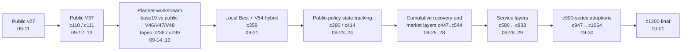
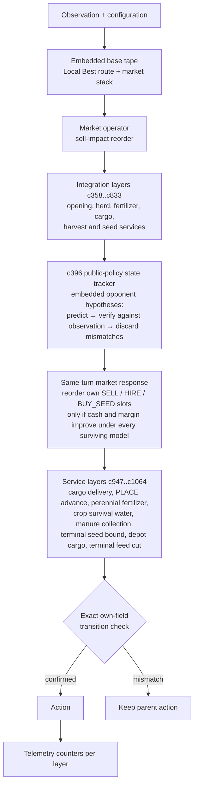
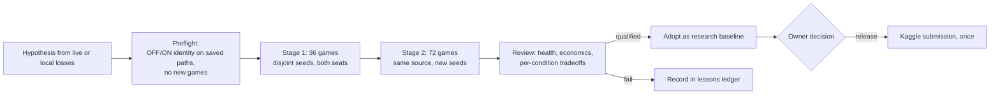

# Kaggriculture Strategy Meta

Research repository for the Kaggle **Kaggriculture** simulation competition
(two-player farming economy, 720 turns, kaggle-environments 1.32.7).
It contains the dataset work on strategy fingerprints, the agent research that
produced the final submission `c1200`, and the validation infrastructure that
gated every change along the way.

[한국어 README](README.ko.md) · [Documentation index](docs/INDEX.md) · [Work log](HANDOFF.md)

| | |
|---|---|
| Final agent | [`agent/c1200_final.py`](agent/c1200_final.py) (byte-identical to the validated `c1064`) |
| Kaggle submissions of the final lineage | `c1054` (2026-09-30, id 56719658) and `c1200` (2026-10-01, id 56722176) |
| Research span | 2026-09-11 → 2026-10-01, ~1,100 candidate ids (`c001`–`c1068`, `o001`–`o403`, planner `p`, `g`, `r` series), 20+ Kaggle submissions |
| Results | _to be added after the competition's final evaluation_ |
| Retrospective | _to be added_ |

## Contents

1. [What this repository is](#1-what-this-repository-is)
2. [What we built on](#2-what-we-built-on)
3. [How the work evolved](#3-how-the-work-evolved)
4. [Final agent architecture](#4-final-agent-architecture)
5. [Validation methodology](#5-validation-methodology)
6. [Results](#6-results)
7. [Review](#7-review)
8. [Repository map](#8-repository-map)
9. [Reproduce](#9-reproduce)
10. [Data, rights and license](#10-data-rights-and-license)

## 1. What this repository is

Two workstreams share this repository.

- **Strategy meta dataset (2026-09-11).** A bounded, reproducible pipeline
  (`src/kaggriculture_meta/`) that turns Kaggle's daily CC0 episode releases into
  a 48-column per-seat strategy fingerprint table ("current meta V1"), with a
  schema, data dictionary and quality gate. See `docs/v1-schema.md` and
  `docs/data-dictionary.md`.
- **Agent research and validation (2026-09-12 → 2026-10-01).** Hundreds of
  candidate agents, each a small, auditable change on top of an exact public
  baseline, evaluated by a shared validation runner with fixed health and
  statistics rules. Every candidate, config and report is kept; failures are
  recorded as carefully as adoptions.

The guiding rule throughout was **evidence before change**: a candidate is
defined and its validation rules are frozen before any game is played, the
candidate and its parent play identical worlds, and adoption or Kaggle submission
is always an explicit owner decision, never automatic.

## 2. What we built on

All competition agents here descend from publicly shared Kaggle notebooks
published under Apache-2.0. Each public source was stored byte-exact with its
SHA-256 before any derivative was made, and every derivative keeps the upstream
license and attribution text embedded in its own source.

| Public source (author) | Role in this repository |
|---|---|
| v27 "Midgame Meta Reset" (Kaito Fukami; route backbone credited to Ezzzzzekki) | First adopted public champion, `agent/public_v27_kaito.py` |
| V37 "More Yield, Smarter Labor" (Ahmed Berat Özer) | Second baseline, `agent/public_v37_more_yield.py`; parent of the first submissions `c110`/`c111` |
| "Master Engine V2" (Guru Prasaath S) | Exact public reacting opponent, `agent/public_master_engine_v2.py` |
| "Local Best" (public v9 lineage wrapped with market portfolio, frontload, adaptive market, sale-advance and sell-impact operators) | Base tape and market stack of the final lineage (embedded in `c358` onward) |
| V54 "Productive Wheat and Patient" (Ahmed Berat Özer) with the shop-aware herd layer (Seyit Kaan Gunes) | Opening and herd substitution layers (`c358`, `c369`) |
| "More Wheat, Smarter Sales" (Dmitrii Gluzdov) | Forecast trajectories (`c387`) |
| "Terminal Recovery v4" (xox787) | Terminal recovery layer (`c447`) |
| Harvey Zhang V15 Market Stack, Dmitrii Gluzdov Herd-Safe Sale Window, statma ca20, Master350, Harvest V87, hanaro EXP-173 and others | Embedded only as **opponent-policy hypotheses** for the state tracker (`c396` family) |
| Thomas Tschinkel router v5, public V46/V47/V48 | Reference opponents and comparison policies in the planner (o-series) work |

Nothing was taken from private leaderboard sources. The complete list of
attributions is in [NOTICE](NOTICE) and inside each embedding source file.

## 3. How the work evolved



**Sep 11 · Dataset pilot.** Bounded current-meta V1 (168 CC0 episodes, 336
seats) with schema and quality gate; first benchmark harness and rights-clear
baselines. Read `docs/gate-2026-09-11.md`, `docs/v1-schema.md`.

**Sep 12–13 · Public baselines.** Adopted v27, then V37, as exact champions.
Rebuilt the simulation league with Kaggle's official loader, source and engine
fingerprints and separate seed stages. `c110`/`c111` were the first live
submissions (c111 reached 2350.6 after 56 games). Read
`docs/public-v37-adoption.md`, `docs/simulation-league.md`.

**Sep 14–19 · Planner (o-series).** Built a planner (`base19`) and compared it
with public V46/V47/V48 and our own tapes on a 12-opponent panel and head-to-head.
Learned that the local panel saturates above the live top, that live strength came
from tape routers, and that the gap to the top was herd scale, not labour. Read
`reports/o-index-2026-09-19.ko.md`, `reports/o-policy-compare-results-2026-09-19.ko.md`.

**Sep 21 · Local public-notebook league.** Built a service that collects every
public Kaggriculture notebook, extracts runnable agents and plays native reacting
matches locally, with a web UI, ratings and a team gateway. Details and
screenshots in [section 5](#local-public-notebook-league). Read
`docs/public-league.ko.md`.

**Sep 21–24 · New lineage.** `c358` composed the Local Best market stack with
V54's opening; `c396` added public-policy state tracking with a same-turn funded
market response; `c414` added targeted-opponent acceptance; validation v3 adopted
the official overage timing contract. Read
`reports/c358-localbest-hybrid-2026-09-21.ko.md`, `reports/c414-targeted-opponents-2026-09-24.ko.md`.

**Sep 25–28 · Market and recovery layers.** Exact queue search (`c461`), terminal
recovery (`c447`), wool and fertilizer calendars (`c516`–`c544`); c544 reached
2411 live. Route swaps, sale windows and extra tomato rows (`c588`–`c596`) all
failed adoption. Read `docs/experiment-history-and-lessons.ko.md`.

**Sep 28–29 · Service layers.** Observation-based cleanup and completion services
(`c580`, `c612`, `c671`, `c763`, `c776`, `c785`, `c833`). Read the candidate
reports in `reports/`.

**Sep 30 · c900 series.** Nine small, gated adoptions `c947` → `c1064`, each
verified by exact own-field transition checks; the owner policy now admitted
qualified small improvements without a win flip. Read `HANDOFF.md` and the
charts below.

**Oct 1 · Final.** `c1200` = `c1064` packaged and submitted; direct ladder of
every c900-series version on fresh seeds (256 games). Read
`configs/validation/c1200_chain_ladder_v4.json`.

### c900-series progress

Each adoption was measured against its immediate parent on identical worlds
(same seed, seat and opponent). The bars are mean final-cash deltas per
condition; the line is the cumulative margin gain.


The chain was then re-checked on eight never-used seeds with direct matches
between versions. `c1200` beat every earlier version (118 wins, 8 losses, 2 ties
over 128 games); almost the whole gain comes from the last layer, `c1064`.


Negative results mattered as much: sell-holding, extra hires, tape-to-planner
hybrids, market-timing-only changes, one extra cow, price-gate flips, route swaps
and sale windows were all tried and rejected with recorded evidence. The ledger
is `docs/experiment-history-and-lessons.ko.md`.

## 4. Final agent architecture

`c1200` is a single Python file (about 21 MB, standard library only). It is a
stack of independently validated layers around an embedded public base: each
layer wraps the previous `agent` callable, checks that the environment is the
standard one, computes the parent's action, and changes it only when a narrow,
observable condition holds and an exact engine-proxy simulation confirms the
intended own-field transition.



Design rules that every layer follows:

- Only the agent's own observation and the public configuration are used. No
  hidden seed, replay, opponent private state or opponent identity.
- Non-standard configurations (board, turns per day, episode length, shed
  capacity) disable the layer and fall through to the parent.
- A layer's change must be reproduced by the engine proxy as an exact state
  transition before it is emitted; otherwise the parent action stands.
- Exceptions are counted and re-raised rather than hidden, so the validation
  runner sees them. The final package ran 108 validation games and 38,826 policy
  calls with zero errors.
- Upstream license and attribution blocks stay in the file.

Timing: the Kaggle contract is 1 second per step plus a shared overage budget.
The heavy step is the first one (decoding the embedded sources); under eight
parallel validation workers it peaked at 13.6 s, with a p99 step time of 0.011 s.

## 5. Validation methodology



- **Paired fixed-panel design.** Candidate and parent play the same seed, seat and
  opponent; the unit of evidence is the per-condition delta in own cash, margin
  and points. Repeated games on a seed never count as independent samples.
- **Staged, disjoint seeds.** Screen, confirm and final stages use
  non-overlapping integer seeds fixed before the run; seeds used for tuning are
  barred from final checks. Blind seeds were reserved for the owner.
- **Health gates.** A game counts only with 720 states, 719 policy calls, both
  seats `DONE`, no `ERROR`/`INVALID`/`TIMEOUT`, matching source and engine
  hashes, and the official actTimeout plus remaining-overage accounting (runner
  v3/v4). Failed games are kept, never overwritten.
- **Statistics.** Points and margin deltas are clustered by seed and weighted
  equally per opponent family; bootstrap confidence intervals and Bonferroni
  correction across the stage alphas; `promotion` is always `false` in the tool.
- **Runner lineage.** `validation_v1` (fresh subprocess per game, global launch
  lock, hash-verified cache) → `v2` (reacting opponents) → `v3` (official overage
  contract) → `v4` (per-step timing, callback/replay hashes, whole-farm
  accounting). Configs live in `configs/validation/`; see
  `docs/reusable-validation.ko.md`.
- **Opponent pools.** Fixed historical baselines, diverse strong public policies,
  hypothesis-specific weakness attackers and legitimately obtained top-ranked
  code or replays (`docs/agent-validation-protocol.ko.md`); the local league
  below supplied and rated the public pool.

### Local public-notebook league

To know how a candidate fares against the actual live population, not just a
hand-picked panel, we built a local league around the public notebooks
(`tools/public_league.py`, `src/kaggriculture_meta/public_league.py`,
`configs/public_league_v2.json`).

- **Collection.** Every public Kaggriculture notebook is listed through the Kaggle
  API (score and recency orderings plus search), new versions are pulled, and
  runnable agents are extracted from `main.py`, tar members, `%%writefile` cells,
  direct agent cells and packed file maps. Multi-file artifacts are hashed over
  their sorted member paths and bytes.
- **Admission QA.** An agent enters only if it compiles, loads through Kaggle's
  last-callable loader and returns a real first action under the official
  observation; failures are quarantined with their error, never deleted.
- **Matches.** Native reacting games on the pinned engine, both seats, eight
  workers, SQLite-cached by engine, rules, runner, artifacts, seed and seat.
  New agents get catch-up matchmaking; the top 120–150 stay `active`, the rest
  are `archived` with full history.
- **Rating.** Regularized Bradley–Terry displayed on a 1500 + 400/ln10 scale with
  Wilson 95% intervals. Our own candidates are registered alongside the public
  pool, so a "focus measurement" of 500 games against the live population takes
  about an hour.
- **Operation.** A local web UI (port 8791) with manual and scheduled collection,
  continuous battles, per-agent histories and source views; a login gateway plus a
  Cloudflare quick tunnel gave teammates read access. Snapshot on 2026-10-01: 407
  notebooks, 739 versions, 380 runnable agents, 150 active, 206,593 completed
  matches.


## 6. Results

_To be added after the competition's final evaluation._

## 7. Review

_To be added._

## 8. Repository map

```text
agent/                 candidate agents; public_*.py are exact public baselines,
                       c<id>_*.py research candidates, overlays/ small source overlays,
                       o/p/g/r series from the planner and search workstreams,
                       c1200_final.py the final submission source
src/kaggriculture_meta dataset pipeline (pilot, current V1, schema, insights),
                       simulation league runner, candidate build and packaging
tools/                 validation runners v1-v4, statistics, public league server
                       and gateway, builders and audits (PowerShell entry points)
o_tools/               planner-era arena, replay, lineage and live-episode tools
configs/               validation configs, league plans, public league roster
reports/               ~300 dated evidence reports (mostly Korean), one per candidate
docs/                  process, protocol and infrastructure documentation (see docs/INDEX.md)
tests/                 unit tests for runners, packaging, imports
HANDOFF.md             shared work log; START HERE block holds the current state
AGENTS.md, CLAUDE.md   operating rules for the coding agents that worked in this repo
```

Local, non-committed material (`state/`, replays, league databases, build
artifacts) is excluded by `.gitignore`; the committed sources, configs and
reports are sufficient to regenerate it.

## 9. Reproduce

Environment: Windows 10, Python 3.12.6, `kaggle-environments==1.32.7`
(`agent/requirements.txt` and `configs/validation/*.json` pin the engine file
hashes).

```bash
python -m venv .venv && .venv/Scripts/pip install -r agent/requirements.txt
```

Run the unit tests:

```bash
.venv/Scripts/python.exe -m unittest discover -s tests -v
```

Replay the final direct ladder (256 games, eight workers, about 17 minutes):

```powershell
& .\tools\run-validation-v4.ps1 -Config configs\validation\c1200_chain_ladder_v4.json -Out state\agent_experiments\ladder_rerun -Stage screen -Action Run
```

Load the final agent through Kaggle's own loader and play one game:

```python
from kaggle_environments import make
env = make("kaggriculture", debug=True)
env.run(["agent/c1200_final.py", "agent/c1200_final.py"])
print([s.status for s in env.state], [s.reward for s in env.state])
```

The submission package is the same file as `main.py` plus `LICENSE.txt` and
`NOTICE.txt` in a tar.gz (`src/kaggriculture_meta/package_agent.py`).

## 10. Data, rights and license

- Competition data were used only under the Kaggriculture rules. Direct
  competition files, raw replays and the public league database are not
  redistributed here; Kaggle's separately licensed CC0 daily episode datasets
  were the public-source path for the dataset workstream.
- Public notebook code is embedded with its Apache-2.0 license and attribution
  intact. Do not read the public routes or production controllers as original
  work of this project; the original contributions are the integration layers,
  the validation infrastructure and the research record.
- This repository is released under the [Apache License 2.0](LICENSE); see
  [NOTICE](NOTICE) for attributions.

Figures in `docs/images/` were generated from the committed validation results
and from a read-only snapshot of the owner's Kaggle submission list.


