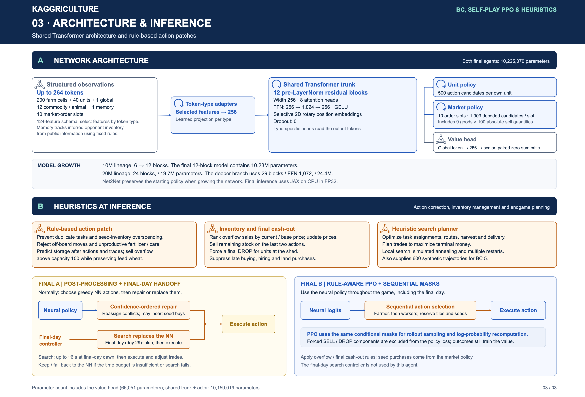

# Network and heuristic controllers

## Contents

- [Network](#network)
- [Action rules](#action-rules)
- [Final A](#final-a)
- [Final B](#final-b)

## Network

Both final submitted neural networks contain **10,225,070 parameters**, including a 66,051-parameter value branch. The shared trunk plus actor contains 10,159,019 parameters.

The backbone is a pre-LayerNorm residual Transformer with 12 blocks, width 256, eight attention heads, and a 256 → 1,024 → 256 GELU feed-forward network. Dropout is zero. Selective 2D RoPE encodes relative spatial information within farms; its rotary dimension is 16 and base is 100.

Observations use a 124-column feature schema. Each token type selects its own relevant columns before projection to width 256:

| Token type | Maximum tokens | Selected input features |
| --- | ---: | ---: |
| Farm cells, both players | 200 | 34 |
| Units, both players | 40 | 22 |
| Global state | 1 | 34 |
| Commodities and animals | 12 | 19 |
| Opponent-inventory memory | 1 | 50 |
| Market-order slots | 10 | 10 |
| **Total** | **264** | |

The memory token is a rule-updated estimate from public observations, including uncertainty about the opponent's inventory. It is not recurrent neural state or access to the opponent's private data.

Each own unit receives 500 action logits. Ten market slots combine the original order head with a separate absolute-quantity SELL head: 1,003 non-SELL choices plus 9 commodities × 100 quantities = 1,903 decoded choices per slot. Sequential market decoding accounts for stock already reserved by earlier orders.

The critic reads the global token through a 256-wide hidden layer and a scalar output. Paired seat logits produce zero-sum values; a two-parameter money/time prior supplements the learned value.

The `bootstrap`, `10m`, and `20m` presets have 6, 12 and 24 blocks. The 24-block network is approximately 19.7M parameters. The `deeper` architecture preset has 29 blocks and FFN width 1,072, approximately 24.4M parameters. All public presets use the final feature/action schema. Historical architecture migrations are described in the training lineage.

Implementation: [`model/policy.py`](../python/kaggriculture/model/policy.py), [`observations/features.py`](../python/kaggriculture/observations/features.py), and [`actions/sell_quantity.py`](../python/kaggriculture/actions/sell_quantity.py).

## Action rules

The rules cover off-board movement, redundant work, seed availability, production opportunities and end-of-game inventory:

- Reassign conflicting unit tasks that compete for the same tile or resource.
- Prevent total planting demand from exceeding seed inventory.
- Reject fertilization and animal care when no useful production can follow.
- Before night, predict inventory after unit actions and market orders; sell stock exceeding shed capacity 100 while reserving wheat for feed.
- Rank overflow sales using current price relative to base price, accounting for price movement as sales are added.
- Liquidate stock on actions 717 and 718; force DROP for units at the shed on action 718; suppress purchases with no remaining useful horizon.

The original rule implementations are in [`heuristics/unit_rules.py`](../python/kaggriculture/heuristics/unit_rules.py) and [`heuristics/shed_patch.py`](../python/kaggriculture/heuristics/shed_patch.py). No new strength or ablation claim is made for individual rules.

## Final A

The neural policy proposes greedy actions. Post-processing prioritizes high-confidence unit choices, repairs collisions and replaces invalid or wasteful choices. It may insert a seed purchase when that enables useful planting and available money and order slots permit it.

At dawn of day 29, the final day under zero-based day numbering, the controller switches to the C++ search planner. It jointly plans task assignments, routes, harvest, transport, delivery and trades to maximize terminal money. Local search uses reorder/swap moves, simulated annealing, multiple starting solutions and restarts.

The search library is preloaded on day 28. Final-day dawn receives up to approximately six seconds of search. If fewer than ten seconds of overage remain before handoff, or loading/execution fails, the neural controller continues. The refactored handoff and repair objects keep their state per agent and reset between games.

The same family of heuristic planners also supplies BC demonstrations. The final BC stage uses both seats of 300 heuristic self-play games, giving 600 teacher trajectories.

Implementation: [`agents/final.py`](../python/kaggriculture/agents/final.py), [`heuristics/postprocess.py`](../python/kaggriculture/heuristics/postprocess.py), [`heuristics/handoff.py`](../python/kaggriculture/heuristics/handoff.py), and [`search/`](../python/kaggriculture/search/).

## Final B

The neural policy selects the farmer's action first, then workers in their fixed order. Each choice reserves tile usage and seed inventory before the next unit is masked. PPO sampling and log-probability recomputation use the same conditional action support.

Forced SELL/DROP components are excluded from the policy loss, while their outcomes still contribute to value learning. Market-policy logits choose seed purchases; Final A's automatic seed-buy insertion is not used. The neural controller plays the entire game, with no final-day search handoff.

Implementation: [`actions/sequential.py`](../python/kaggriculture/actions/sequential.py), [`actions/patch_inputs.py`](../python/kaggriculture/actions/patch_inputs.py), [`training/rollout.py`](../python/kaggriculture/training/rollout.py), and [`training/objectives.py`](../python/kaggriculture/training/objectives.py). The Rust equivalents that generate rollout masks and forced sales are [`patch_masks.rs`](../native/engine/src/patch_masks.rs) and [`patch_sales.rs`](../native/engine/src/patch_sales.rs).
