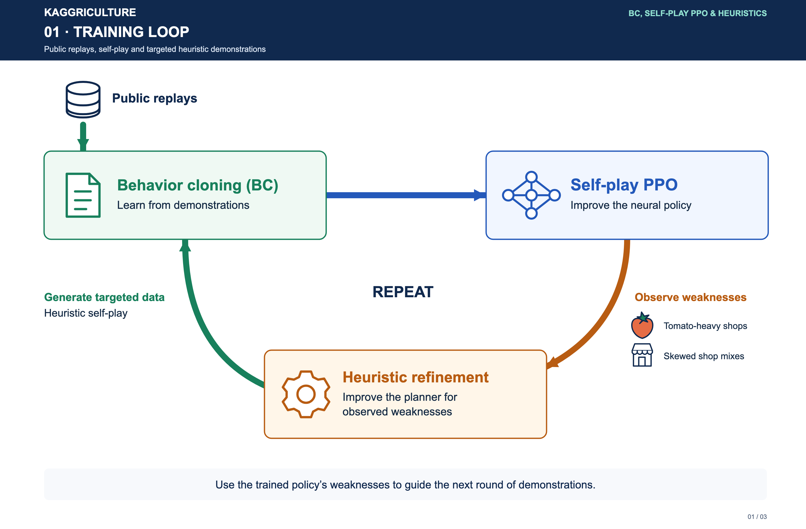
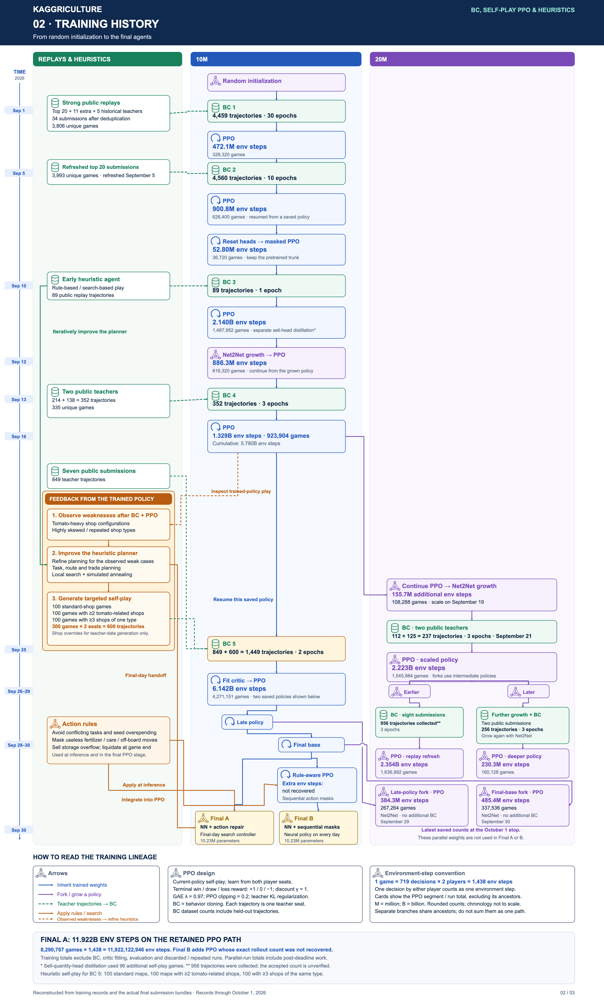

# Retained training lineage

## Contents

- [Counting convention](#counting-convention)
- [Main lineage](#main-lineage)
- [Final agents](#final-agents)
- [Parallel larger models](#parallel-larger-models)

After training policies with BC and PPO, we inspected their play and observed weaknesses in tomato-heavy and highly skewed shop configurations. We then improved the heuristic planner, generated demonstrations for those cases, and returned to BC. The final BC stage mixed public replays with both seats of 300 heuristic self-play games: 100 standard, 100 with at least two tomato-related shops, and 100 with at least three shops of one type. This supplied 600 synthetic trajectories, alongside 849 public trajectories, before returning to PPO.

The detailed chronology and training amounts are shown below.

## Counting convention

One complete self-play game contributes **1,438 env steps**, counting both players' 719 decisions. BC counts are teacher-seat trajectories, including holdouts; they are not necessarily unique games. Figures show rounded PPO amounts.

The totals below count the adopted ancestor path. They exclude BC data generation, critic-only fitting, head distillation, evaluation, discarded branches and repeated work after failed attempts. Parallel forks share ancestors and must not be summed as independent complete training histories.

## Main lineage

The 10M family began with a six-block model and grew to twelve blocks. User-facing family names are retained throughout the figures.

| Stage | Teacher data or change | Training amount |
| --- | --- | --- |
| BC 1 | 34 public submissions after deduplication; top 20, 11 additional and five historical entries | 4,459 trajectories / 3,806 unique games; 30 epochs |
| PPO | Self-play | 328,320 games; 472,124,160 env steps |
| BC 2 | Refreshed top-20 public submissions | 4,560 trajectories / 3,993 unique games; 10 epochs |
| PPO | Retained continuation across a restart | 626,400 games; 900,763,200 env steps |
| Masked PPO | Reset policy/value heads; keep the trunk | 36,720 games; 52,803,360 env steps |
| BC 3 | Early heuristic/search teacher | 89 trajectories; one epoch |
| PPO | Self-play; later add an absolute SELL quantity head | 1,487,952 games; 2,139,674,976 env steps |
| Growth + PPO | Net2Net, six → twelve blocks | 616,320 games; 886,268,160 env steps |
| BC 4 | Two public teachers: 214 + 138 trajectories | 352 trajectories / 335 unique games; three epochs |
| PPO | Adopted continuation | 923,904 games; 1,328,573,952 env steps |
| BC 5 | Seven public submissions plus improved heuristic self-play | 849 + 600 = 1,449 trajectories; two epochs |
| Critic fit + PPO | Freeze actor for critic fitting, then resume full PPO | 4,271,151 PPO games; 6,141,915,138 env steps |

The SELL-head migration used 96 separate self-play games for distillation. They are not added to the PPO counts. The last BC dataset included 300 heuristic self-play games, both seats, with 100 games from each of three shop distributions. The full pipeline also evolved its input schema; this public package uses the final 124-feature schema for all new runs.

## Final agents

**Final A's retained PPO ancestry totals 8,290,767 games and 11,922,122,946 env steps**, approximately 11.922B. Inference adds the action-repair rules and final-day search controller.

**Final B** continues from the same base neural policy for 140 additional PPO updates with rule-aware action selection. The exact additional game and env-step counts were not recovered. GPU count and rollout size changed, so multiplying 140 by one observed batch size would not give a verified total.

Both final agents use 12 blocks and 10.23M parameters. The larger-model branches below were not merged into either final submitted network.

## Parallel larger models

An intermediate main-line policy was continued for another **108,288 games / 155,718,144 env steps** before growing from 12 to 24 blocks. Its subsequent larger-model runs, and two later direct forks, were:

| Branch | Initialization and BC | PPO collected within that run |
| --- | --- | --- |
| Scaled policy | 24 blocks; two teachers, 112 + 125 = 237 trajectories; three epochs | 1,545,984 games / 2,223,124,992 env steps |
| Replay refresh | Earlier checkpoint of scaled policy; eight submissions, 956 trajectories collected; three epochs | 1,636,992 games / 2,353,994,496 env steps |
| Further growth | Later checkpoint of scaled policy; 29 blocks / FFN 1,072; two submissions, 256 trajectories; three epochs | 160,128 games / 230,264,064 env steps |
| Late-policy fork | Later main-line policy, grown to 24 blocks; no additional BC | 267,264 games / 384,325,632 env steps |
| Final-base fork | Final base main-line policy, grown to 24 blocks; no additional BC | 337,536 games / 485,376,768 env steps |

The accepted count after filtering the 956 collected trajectories was not independently recovered. These larger-run totals are the latest saved checkpoints at the October 1 stop and include training after the submission deadline.
