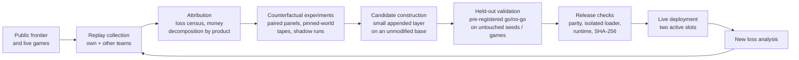

# Kaggriculture: empirical strategy research for a two-player market simulation

This is a case study of agent development for Kaggle's **Kaggriculture** simulation competition (2026). It is a 719-decision farming season in which two players compete in one shared, price-impacting market. The project ran as a continuous research loop over 26 days and 67 live submissions:

1. Reconstruct live games.
2. Attribute losses to concrete mechanisms.
3. Test small changes counterfactually.
4. Validate them under pre-registered rules.
5. Deploy them and analyse the new live games.

The final agent is a public open-source base with a stack of small, separately validated private layers. The most valuable layers exploit the market's microstructure: order-slot priority, a predictable demand tick, and same-step interaction with the opponent's orders.

| | |
|---|---|
| **Competition** | Kaggle Kaggriculture (2026), more than 10,000 participating teams |
| **Team** | XIAO MA |
| **Problem** | Sequential production and trading decisions against an adaptive opponent, ranked by wins only |
| **Final agent** | Public Apache-2.0 base + 8 appended layers ([§10](#10-final-system)) |
| **Methods** | Paired-seed simulation, pre-registered go/no-go rules, pinned-world counterfactual replay of live games, shadow diffs against public bases, parity and loader checks |
| **Evaluation evidence** | Registered go/no-go tests on paired seeds, replay of recorded games with pinned randomness, engine parity with the official interpreter, behavioural equivalence of the published agent ([§11](#11-evaluation-summary)) |

## Contents

1. [Project overview](#1-project-overview)
2. [Why this problem is interesting](#2-why-this-problem-is-interesting)
3. [Competition and system architecture](#3-competition-and-system-architecture)
4. [Development timeline and strategy evolution](#4-development-timeline-and-strategy-evolution)
5. [Experimental methodology](#5-experimental-methodology)
6. [Failure analysis and what was rejected](#6-failure-analysis-and-what-was-rejected)
7. [Major technical discoveries](#7-major-technical-discoveries)
8. [Public baseline vs private edge](#8-public-baseline-vs-private-edge)
9. [RL / adaptive learning investigation](#9-rl--adaptive-learning-investigation)
10. [Final system](#10-final-system)
11. [Evaluation summary](#11-evaluation-summary)
12. [What I learned](#12-what-i-learned)
13. [Relevance to quantitative and graduate work](#13-relevance-to-quantitative-and-graduate-work)
14. [Repository structure](#14-repository-structure)
15. [Reproducibility](#15-reproducibility)
16. [Limitations and future work](#16-limitations-and-future-work)
17. [Acknowledgements](#acknowledgements)
18. [License](#license)

## 1. Project overview

**Kaggriculture** was a Kaggle simulation competition (submissions July 29 – September 30, 2026; prize pool $50,000). Each match is a two-player farming season on a shared market:

- 30 days × 24 turns: 720 recorded steps, 719 decisions.
- Each player runs a 10×10 farm, starting with 3,000 coins and one of four land quadrants; the other three cost 1,000 / 2,000 / 4,000 coins.
- Players plant and water five crops (wheat, carrot, tomato, strawberry, melon) and raise three animals (geese, cows, sheep). Every animal also produces fertilizer.
- Hired hands provide extra labour at sharply increasing daily cost.
- All output is sold into one market that both players share.
- The winner is the player holding more coins after the last turn. Unsold goods, land and animals are worth nothing at the end.

It is a sequential resource-allocation problem with an adversary:

- **Capital allocation under a cash constraint:** seeds, animals, land and labour all compete for a small opening budget.
- **Long production lags:** tomato and strawberry yields arrive 8–16 days after planting.
- **Price impact in a shared market:** every unit sold moves the price both players face.
- **Exogenous demand:** town shops that consume products are drawn at random every three days.
- **An opponent whose farm is public but whose orders are not.**

Ratings depend only on win, loss or tie; the coin margin does not matter. The task is therefore to beat whatever opponents the matchmaking system supplies, not to maximise expected income.

| Setting | Value |
|---|---|
| Participating teams | more than 10,000 |
| Submissions tracked per team | the latest two; a new upload retires the older one |
| Team score | the better of the two active submissions |
| Uploads | at most 5 per team per day |
| Compute per move | 1 s per action plus a 60 s overage budget per game |
| Final evaluation | games played for about two weeks after the deadline between agents that remain active, scored with a Bradley–Terry fit |

**Objective and constraints.** My objective was the strongest possible agent under this win/loss evaluation. Constraints:

- Competition rules: no use of the hidden episode seed, and agents see only their own observation.
- Open-source licences: every public component is used under Apache-2.0 with its notices retained.
- At most two live slots and five uploads per day.
- Every live deployment was decided manually after reviewing the evidence.

**Public baselines versus project work.** Late in the competition the strongest agents were open-source notebooks that built on one another. This project used several of them as *bases*, credited in [Acknowledgements](#acknowledgements). The project's own contributions are:

1. The evaluation and replay-analysis infrastructure.
2. The empirical studies that decided what to change.
3. A stack of small *private layers* appended after an unmodified public base file.

A layer intercepts the base policy's action and modifies only specific decisions, mostly market orders. Every claim in this README about a layer's effect refers to these project-specific layers, measured against the unmodified public base or the previous build.

## 2. Why this problem is interesting

The game is small enough to simulate exactly but rich enough that most intuitive strategies fail when measured. Several of its features correspond directly to problems studied in quantitative finance and operations research. The table lists the ones that mattered in this project.

| Feature of the game | Field it maps to | Where it appeared in this project |
|---|---|---|
| Orders execute unit by unit against a downward-sloping price curve; both players quote off the same pre-trade inventory and commits happen in player and slot order | Market microstructure: price impact, queue priority, same-step interaction | Wheat and fertilizer round trips, front-running and "sandwich" orders by rivals, sale-race timing ([§7](#7-major-technical-discoveries)) |
| Buying and selling at an unchanged price earns nothing, but scheduled town consumption moves the price between steps | Predictable order flow, inventory risk | A wheat round trip timed around the consumption tick: +$500 a game regardless of rival |
| Crops pay 8–16 days after planting; random shop draws change future demand | Capacity planning and investment under uncertainty | Tomato investment gate, herd and route decisions, melon timing |
| Rating depends only on win/loss against opponents chosen by skill | Decision-making under a non-linear (rank-based) objective | Decisions judged by win flips against relevant rivals, not by average income |
| Opponents copy public code and adapt to each other within hours | Adversarial, non-stationary environments; strategy decay | Private edges that worked for one day and stopped working the next |
| Matches are deterministic given the seed and both agents' actions | Simulation-based policy evaluation; variance reduction with common random numbers | Paired seeds, pinned-world replays, counterfactual "tapes" |
| Effects of a change are often 1–2 % of win rate | Statistical power, pre-registration, multiple-comparison control | Registered go/no-go rules on untouched seeds and fresh live games |

None of these is special to farming. Similar problems arise in execution algorithms facing other execution algorithms, in inventory and pricing decisions under exogenous demand, and in strategy research where back-test evidence must be separated from live evidence. The project's methods were built for those problems.

## 3. Competition and system architecture

### 3.1 State, actions and market

**Observation.** At every step each agent sees:
- both farms' grids, crop ages, animals, unit positions and bank balances (public);
- the market's price and inventory state and the town's unlocked shops (public);
- its own shed, carried goods and seeds (private).

The episode seed is hidden from agents.

**Action.** Each step an agent issues:
- one action per unit: the farmer plus any hired hands (move, plant, water, harvest, fertilize, feed, care, pick up, drop, build);
- a list of at most ten market orders (BUY_SEED, BUY_PRODUCT for wheat and fertilizer, BUY_ANIMAL, SELL, HIRE, land purchases).

**Processing order within a step:**
1. Both players' unit actions run.
2. All market orders run, slot by slot and unit by unit.
3. Town demand for that step is consumed.
4. Plants decay.
5. Every 24 steps, an end-of-day refresh runs: growth, weed spawning, inventory drop into the shed.

The engine's only randomness is drawn at day end: one weed draw per empty tile, then the shop draw.

Three consequences shaped most of the work:

- **Unit-by-unit order matching.** A player's place in the order list decides which price each unit gets. Where the two players' orders interleave decides who sells into a shortage first.
- **Town consumption every four steps.** It moves prices predictably, while a buy-then-sell in an unchanged market earns exactly zero.
- **Final money only.** Inventory is worth nothing at the end, so sale timing at the season's close becomes a race.

### 3.2 Why local simulation was necessary — and why it was not sufficient

Every candidate change was first measured offline:

- **Official interpreter.** `kaggle-environments` 1.32.7, the same code Kaggle runs, is the release authority.
- **Lean engine.** An in-process engine drives the official step function directly and loads agents exactly as Kaggle's loader does (a fresh namespace per game, the last callable as the entry point). This removes framework overhead so that panels of thousands of games run on one machine. Before every release it was checked against the official `env.run` for identical games (*parity*).
- **Optional C++ backend.** Built in the first week for very large panels; the Python interpreter stayed the authority.

Local win rate, however, measures performance against the opponents you chose to model. The live ladder is a different population:

- **Opponent mix shifts by the hour.** It moved as public notebooks were released and forked. On the final day, about 58 % of the opponents in our part of the ladder used an "animal opener" plan for which no public source existed.
- **Opponents adapt.** Several private forks of the same public base front-ran or sandwiched our market orders within a day or two of those orders appearing live.
- **Live evaluation is noisy and path-dependent.** A new submission needs tens of games before its standing settles, and the same build's results keep fluctuating with the opponents it is scheduled against.

So the work combined offline evidence (fast, controlled, but model-dependent) with live evidence (real, but slow, noisy and non-stationary).

### 3.3 The two-slot constraint

Only the latest two uploads count. The team score is the better of the two, and a new upload always retires the older one. Every upload is therefore also a retirement decision. A promising but unproven build either displaces a proven one or waits. Most of the final week's slot decisions came down to this trade-off. Typical options:

- keep one stable build and rotate the other slot;
- upload an identical copy for a second independent rating draw;
- hold an upload until held-out evidence was complete.

### 3.4 The research loop



Each stage was backed by a concrete tool or record. The evaluation and replay tools are included in this repository ([Repository structure](#14-repository-structure)):

- replay downloads with SHA-256 receipts;
- per-game accounting of revenue and spend by product;
- tape and pinned-world beds that replay our candidate against a live rival's recorded orders;
- builders that append a layer to a byte-identical base file;
- go/no-go rules written down before a test is run;
- release logs from the parity and loader checks.

## 4. Development timeline and strategy evolution

The project made 67 uploads between September 5 and September 30. They group into seven generations.

### Version history (compact)

| Gen | Dates (2026) | Uploads | Base | Main project changes | Key local evidence |
|---|---|---|---|---|---|
| 1 | Sep 5–6 | V1–V4 | Public "Farming V3" | Engine-exact overlays: sales threshold, feed economics, overnight shed-capacity projector, maturity-limited seed buying | V1 254/256 wins on a frozen holdout against four public agents |
| 2 | Sep 6–9 | V5–V7, Thomas955, Shop0908, MARKET, FIVE, SALE | Public state routers (Thomas Tschinkel; yhay81 Shop Router) | Production hand-over on yarn worlds; one-turn sale advance; tape repairs; sale-slot ordering | Thomas955 64–0 in official duels against V7; sale-slot ordering 118 vs 112 wins of 128 |
| 3 | Sep 10–12 | MIX, ADVANCE, COMBO, INTEGRATED, BULK, SE4, BULK-R | Public "Soil" / Shop0909 | Stock-backed premium-sale advance, rival-aware anticipation, dairy conversion | COMBO 48/48 on fresh seeds against three rival programs |
| 4 | Sep 12–16 | S, NET, V38 and V40 variants, DAWN, P15 carrot | Ahmed Berat Ozer V37 → V38 → V40 | Production repairs (sheep, cattle, pasture), sale windows, worker funding, carrot timing | Small responsive panels (6–16 contexts) and re-simulated losses |
| 5 | Sep 17–21 | V46, Beyond48, V48 P0–P3, 2945 T2–T3, D2–D4, M2–M4 | Converging public frontier (V46/V48, Thomas 2945, Dmitrii, prvsiyan Metav4) | Small private overlays: opening round trip, weed-blocked action recovery, herd rule, order-preserving sale compaction | P2 95–0–1 against exact V48; T2 127–0–1; M4 119–1 |
| 6 | Sep 22–27 | M5, M6H-SR12 (×2), L8 (×2), MK3, C22 (×2), C1010, ESC, ST16, T8, S107 | Pipe19/"2965" → cha22 → tetsutani v8 | Earlier sell-off, sale look-ahead 8, step-0 cash-cliff round trip, staged look-ahead, route-107 splice | Sell-off 98–2; look-ahead mirror 97–0–3; route splice +131/−0 and +270/−1 |
| 7 | Sep 28–30 | PUMP, APUMP4, MX5, MX7, MX12, MX15, MX17 (×2) | tetsutani v8 + S107 | Market-microstructure layers: wheat round trip, adaptive front-running, fertilizer sandwich, sandwich cost rule, tomato gate, sale race | Registered panels of 1,200–3,000 games per layer; decisive held-out test on 150 fresh games |

The full build list is in [`docs/build_history.md`](docs/build_history.md).

### Generation 1 — engine-exact overlays (Sep 5–6)

- **Problem.** No reliable local evaluation existed, and public agents differed by large amounts.
- **Hypothesis.** The strongest runnable public agent, plus overlays derived from an audit of the official engine source (storage caps, maturity windows, end-of-season valuation), would beat it.
- **Changes.** A late low-threshold sales overlay and terminal salvage (V1); purchase pruning (V2); an overnight shed-capacity projector built from the engine's own unit functions (V3); seed purchases only for plants that can mature by day 29 (V4).
- **Tests.**
  - V1 on a frozen holdout (seeds 1001–1032, both seats, four public opponents): 254/256 wins, mean margin +$9,186 (seed-clustered SE 442).
  - V3 under a protocol registered before its fresh seeds: all 256 margins improved (+$56, SE 3.5), with 48 official-interpreter repeats matching the native simulator exactly.
  - V4's first panel failed its funding gate; the failure was kept on record.
- **Result.** Large local margins, but the gains were efficiency only: wins against an already-beaten pool did not change, and a stronger public router appeared.

### Generation 2 — public routers and the first live lessons (Sep 6–9)

- **Problem.** A public state router (Thomas Tschinkel) beat our build 7–1 in development games.
- **Changes.**
  - Adopt the router unmodified (V5).
  - Add a late seed cap (V6).
  - At step 88, when the first shop revealed is a yarn store, hand over to our own production program (V7).
- **Result.** Replays of V7's live losses soon showed the same failure repeating in the opening.
- **Diagnosis: the opening cash cliff.**
  - V7 spent nearly all its opening cash on melon seeds and ran equal wheat round trips.
  - A few coins short, a hire failed and a cow escaped after two unfed nights. Because a short seed stock blocks *all* plantings of that crop, the shortfall cascaded.
  - Cancelling the round trips turned −$109,919 into +$529 against a *fixed recorded* opponent, but gained only +0.25 win points over 128 fresh games against *responsive* opponents. This was the first lesson that replays and live play differ.
- **Next.** The project adopted newer public code rather than repairing V7:
  - Thomas955: 64–0 in official direct duels.
  - yhay81's Shop Router 0908.
  - Market overlays on top: a one-turn premium-sale advance, repairs for tape steps that break on random weeds, and sale-slot ordering by marginal price.
- **Tests.** Each overlay was confirmed on fresh paired seeds, e.g. the slot ordering at 118 vs 112 wins of 128 with +$143 margin (95 % CI [68, 236]).
- **Why it stalled.** SALE's new losses were to opponents running the *updated* public Shop0909 tapes. The public frontier was moving faster than overlays could add value.

### Generation 3 — composing the frontier (Sep 10–12)

- **Hypothesis.** Combine the newest public production (Soil V221B / Shop0909) with the market lessons so far.
- **Changes.**
  - Guarded repairs plus stock-backed sale promotion (MIX).
  - Soil V229A's sale advance on steps divisible by four (ADVANCE).
  - Bounded anticipation of premium sales from the rival's *visible* production (COMBO).
  - Conditional dairy conversion (INTEGRATED).
  - Same-day advance of complete stock-backed lots, with a ledger against double-selling (BULK).
- **Tests.** Fresh-seed duels, e.g. COMBO 48/48 against ADVANCE, Soil V229A and Ahmed V31, plus replays against 76 recorded action streams of top teams.
- **Result.** The composed builds beat their parents locally, but replays of losses to the strongest teams pointed to a different cause.
- **Lesson.** Production mix mattered more than tactics. Leaders' farms were physically identical up to the first shop reveal (step 72) and then diverged by revealed demand. In the same worlds, the public Thomas955 router sold 263 milk to V7's 169. Sale tactics could not close a production gap of that size, so the next generation moved to the strongest public *production* lineage.

### Generation 4 — the V37/V38/V40 production lineage (Sep 12–16)

- **Problem.** Sale tactics could not close the production gap. Ahmed Berat Ozer's public V37 → V38 → V40 series had the strongest production plans of the time.
- **Changes.** Private wrappers, each addressing a specific live loss:
  - one sheep purchase the public program omitted (S);
  - removal of an opening wheat churn (NET);
  - a longer premium-sale reservation horizon, 4 → 6 steps, after a loss with *identical* production that was decided by sale timing (WINDOW6);
  - a six-sheep investment in the unused quadrant (LATE6);
  - dairy conversion when two milk shops appear (DAIRY);
  - rebuilding a pasture blocked by a random weed, combined with V40's shop-aware plan selector (V40NE);
  - funding of first-dawn workers after a −$65k loss caused by an unfunded day-1 hire (DAWN);
  - a 15-cow route plus a carrot rule (P15);
  - sale-lot timing (DAWN demand reservation).
- **Tests.** Small responsive panels (6–16 contexts) plus re-simulation of the real losses that motivated each change. For example, V40NE went 3W3L → 4W2L, and the funding fix turned the −$65k loss into +$2.2k.
- **Result.** The targeted repairs worked in the contexts that motivated them but did not generalise; the two lessons below explain why.
- **Lessons — two methodological failures.**
  1. Several of these uploads went ahead as "exploratory trials" *after* their pre-registered gates had failed, and most did not hold up live.
  2. A broader gate built from 13 fixed tapes of strong opponents ranked candidates that then underperformed live. One whole public policy scored 12/13 on it yet did clearly worse in live play than a policy that scored 9/13.

  Both failures shaped the later process: gates became binding, and panels used reacting opponents (agent code) instead of fixed tapes wherever the code was available.

### Generation 5 — a clone ladder and the first private overlays (Sep 17–21)

- **Problem.** By Sep 18 the upper part of the ladder was essentially one public lineage. In 14 of 16 sampled losses the opponent ran the same route tape as the public V4x files, with 446–719 of 719 unit actions identical. Exact clones tied to the coin, e.g. 106,724–106,724.
- **Hypothesis.** On a clone ladder, the edge is a small private difference that converts ties and near-ties. A whole new strategy is not needed.
- **Changes.** Each new public frontier file was adopted with its bytes unchanged (SHA-256 checked against the author's published hash where one existed), and an appended private layer was added:
  - **Exact V48 + overlays (P0–P3):**
    - a smaller opening round trip (30 → 5 units), which wins the opening-price contest against exact clones;
    - weed-blocked action recovery: a random weed turns a scheduled BUILD/PLANT into a silent no-op and can cost a pasture for the season;
    - a milk-shop herd rule.
    - P2 won **95–0–1** on 96 fresh seeds against exact V48.
  - **Thomas Tschinkel's open-sourced "2945 Farm v9/4"** + opening 6/1 + recovery (T2): 127–0–1 against the exact file.
  - **Dmitrii Gluzdov's "A Smaller Market Shock"** + a second temporary wheat crop worked by idle hands (D2: 32–0) + a final order-list pass that drops dead sale orders and moves live ones forward (D4: 48–0 against D3). One dead order in slot 3 had cost 407 coins in a single turn.
  - **prvsiyan's Metav4 crop build** + an opening round trip + a day 0–3 hire-funding guard (M4). The crop builds ended day 0 with about $1 and lost 0–8 to an opening squeezer. M4 went 119–1 against the previous build and 59–1 against synthetic patched forks.
- **Result.** Each overlay beat its exact public parent decisively in paired panels, but the strongest teams were still out of reach.
- **Lesson: the gap to the very top was a different economy.** Teams that beat the best public file shared only 1–17 of its 719 unit actions:
  - they bought second land at steps 120–241 instead of 265;
  - they kept 19–27 animals instead of 17;
  - they hired more.

  That is a production-planning gap, the same one that remained at the end (§7.8).

### Generation 6 — first-mover races and three chassis changes (Sep 22–27)

**Base 1: Pipe19 / "2965 Master".**
- **Problem.** Our near-mirror losses were sale races: opponents issued the first sale 419 times to our 181.
- **Changes.**
  - Move our layer onto the base that carried a 3-turn sale advance.
  - Start the evening sell-off at hour 12 instead of 18.
- **Tests.** 100 fresh seeds: 98–2 against the previous build and 97–3 against an earlier-selling fork.
- **Result.** A sale look-ahead of 8 turns then won a 100-seed mirror 97–0–3 and went +49/−21 against seven public rivals.

**Base 2: cha22.**
- **Problem.** The public cha22 lineage beat our build 56–44.
- **Change.** Rebase the layer onto cha22: 100–0 against exact cha22 and 74–26 against the previous build.
- **Opening round trip.** A step-0 wheat round trip exploited the cash cliff of "20/15" openers (§7.1): 100–0 against them, at most $4 of cost elsewhere.
- **Racing field.** Loss replays showed that every opponent that beat these builds sold 3–14 turns earlier. A staged look-ahead (8 → 16 late in the game) was tested under a decision rule written before the next live read, and replaced the previous build when the rule said so.

**Base 3: tetsutani v8.**
- **Problem.** The public demand-preserving stack beat both racing builds about 81–18 *with an identical production plan*: selling first at depressed prices lost to spacing sales.
- **Change.** Rebase again. Our earlier opening rewrite and look-ahead schedule turned out to be inert on the new base.
- **Route-107 splice.** Added from the oracle study (§9), after independent re-validation: +18/−0 over 1,100 paired contexts.

**Why next.** Public stacks spread within hours, and the very top teams ran a non-public plan; every transferable piece of their play tested neutral or negative.

### Generation 7 — market microstructure (Sep 28–30)

With production plans converged, the remaining exploitable structure was in the market rules (§7.3–7.5). Each step of the generation responded to how the field reacted to the last:

1. **PUMP** — wheat round trip across the consumption tick.
   - Test: pre-registered 1,200 games, +184/−0.
2. **APUMP** — rival-flow reconstruction with front-running and pausing, after front-runners appeared.
   - Test: 100–0 against the naive pump and 92–8 against a front-runner.
3. **MX5** — the fertilizer sandwich.
   - Test: registered 2,800 games, +$917/game against the public base.
4. **MX7** — the cost rule, after same-step sandwiches appeared in live replays.
   - Test: registered 3,000 games; 19→100, 9→97 and 2→76 wins against sandwich styles.
5. **MX12** — the fertilizer trade at every plan purchase.
   - Test: registered 3,000 games, no win changed; +4/−0 on 348 live tapes.
6. **MX15** — tomato gate 7,500, the only production change to pass the production sprint (§6).
   - Test: registered held-out +4/−1 on 455 pairs; +8/−0 over 1,317 live worlds.
7. **MX17** — the sale race of same-base forks (§8.3), deployed twice as the final pair.

A tape ablation on 109 live games shows the generation's cumulative value: wins rose from 31 (no market layers) to 51 (PUMP), 58 (APUMP), 65 (MX5) and 69 (MX7).

What the market layers could not change was the production gap. In the last days the opponent mix moved towards animal openers, a production plan that no layer helped against (§7.8).

## 5. Experimental methodology

Most decisions turned on effects of one or two percentage points of win rate. The methodology exists to tell such effects apart from noise, from selection, and from artefacts of the test bed.

### 5.1 Paired seeds, seat symmetry and hash-seed control

- **Common random numbers.** The engine is deterministic given the episode seed and both agents' actions. Every comparison ran the candidate and the reference on the *same* seeds against the same opponents, and counted **win flips**: games won by one build and lost by the other. A typical registered panel was 100 seeds × 12–15 opponents.
- **One seat per seed.** Both seats of a seed turned out to produce identical money for the two agents (1,080 of 1,080 checked pairs). Running "both seats" therefore double-counts a single world. Panels used one seat per seed (`seat = seed mod 2`) and more seeds instead.
- **Hash-seed control.** The play of some public agents turned out to depend on Python's per-process string-hash seed. One live episode reproduced under only 1 of 6 hash seeds. All paired and counterfactual panels pinned `PYTHONHASHSEED=0`.

### 5.2 Development vs held-out, and pre-registered go/no-go rules

- **Separate seed ranges.** Each study used separate ranges for development and confirmation, with a registry of used ranges. Typical confirmation ranges were 9440001–100, 9480001–100 and 9520001–100.
- **Rules written before the run.** Every confirmation had its go/no-go rule written down beforehand. A typical rule had four clauses:
  - net win flips ≥ a threshold (e.g. +1 % of worlds);
  - wins lost ≤ half of wins gained;
  - per-opponent mean margin change ≥ a floor (e.g. −$20);
  - all release checks pass.
- **No re-running a failed rule.** A failed rule was recorded as no-go and was never re-run on other seeds. A candidate could return only under a new rule asking a different question. The one such case is the sale race: it failed on an older field and was re-tested, under a newly registered rule, on the current field ([§10](#10-final-system)).

Examples of registered rules that **rejected** attractive candidates:
- A pump variant starting earlier won +11/−3 pooled but failed two per-opponent floors (−$203 and −$30).
- A herd rule had a positive mean (+$643) but went 45 → 38 wins on held-out live worlds.
- The first sale-race version failed its +1 % bar on an older field (+0.66 %).

### 5.3 Statistics

- **Win-flip sign tests.** Win flips (gained vs lost) were tested with sign tests. Wilson lower bounds were used for head-to-head rates.
- **Clustering.** When contexts share a seed, tests were clustered by seed. One herd rule's p-value went from 5.6×10⁻⁸ (naive) to 0.23 (seed-clustered and post-stratified by shop draws). That difference is why decisions were never made on raw context counts.
- **Margin, not own money.** Changes were judged by the coin *margin* over the opponent, because shifting supply can help the rival more than ourselves (§7.7).

### 5.4 Replay ("tape") evaluation and its limits

- **The REPLAY bed.** A downloaded live game becomes a *tape*: the opponent's recorded orders, step by step. The bed plays a candidate against that tape. A control run of the build that played the game must first reproduce it, for example 109 of 109 games within $50 of the recorded margin.
- **Pinned worlds.** Production changes alter the number of empty tiles, which shifts the engine's random stream and with it the later shop draws. The pinned bed replaces the day-end random draws (weed spawns and shop draws) with the live game's outcomes, so a candidate is evaluated in the *same world* the live opponent played.
- **Rival-divergence check.** A recorded opponent cannot react. When our early trades differ from the live game, the opponent's tight-budget purchases can fail and its whole plan collapses on the tape. This produced fake gains of $5k–$100k for some counter-plans. The bed flags worlds where the opponent's farm departs from the live game (animals and crop tiles at steps 360/480/600), and only worlds clean for both builds are counted.
- **Use as a filter.** Tapes were used as a filter and as regression tests, never as final proof.

### 5.5 Live-opponent reconstruction: other teams' games as held-out data

Our own live games are a biased sample: the rating system picks our opponents, and the build being tested played them. The **foreign-game bed** removes that bias. It downloads recent games *between other teams* of similar strength and places the candidate in each seat in turn against the other seat's recorded orders, in pinned worlds. This is the closest available proxy for "the current field".

The final decisive test was registered at 14:25 UTC on the last day, before the data was downloaded. It used 150 such games that had ended in the previous 3–8 hours: 300 worlds, of which 249 were clean.

### 5.6 Release checks

Every package passed the same gate before upload:
- **Parity.** The fast engine against the official `env.run`: identical actions at every step, identical final money and statuses (6/6 for the final builds).
- **Isolated loader.** The packaged `.tar.gz` is unpacked and loaded in a fresh process exactly as Kaggle loads it, and full games are run (2/2 DONE).
- **Runtime.** Overage time is measured against the 60 s budget. The final agent used under 1 s in any of its 66 live games.
- **Hashes.** SHA-256 of the archive and of `main.py` is checked at build, before upload and after upload, and recorded in an upload receipt together with the approval.

### 5.7 Avoiding overfitting to one opponent

- **Many opponents.** Panels used 7–15 opponents: public files from different lineages plus *style* rivals built from observed live behaviour (naive pumper, front-runner, same-step sandwicher, small-lot fertilizer trader).
- **Per-opponent floors.** Go/no-go rules had per-opponent floors, so a gain against one style could not hide a loss against another.
- **Live family census.** Opponents in the live band were grouped by family (opening fingerprint) to estimate how much each style mattered.

## 6. Failure analysis and what was rejected

Most hypotheses failed. The table lists representative closed directions, the idea behind each, and the evidence that closed it. All results are paired comparisons against the then-current build unless stated.

| Direction | Why it looked promising | Evidence that closed it |
|---|---|---|
| **Learned / oracle route selection** | Different production routes win in different worlds | A hybrid selector lost 3.75 pp of wins on validation. A hindsight policy oracle reached 11/13 on a hard panel, but a realisable router only 9/13, and at action 0 all inputs are identical except the player id. Against 63 non-animal yarn worlds every alternative route fell from 32 wins to 10–17. |
| **Tomato expansion** | Tomato prices climb all game when no one sells | Doubling tomatoes: 9 of 9 worlds negative, mean −$5,289. Forcing the investment gate open against tomato planters improved no world. Twenty-tile tomato plans pay only in worlds with 5+ tomato shops (~0.5 % of seeds). Only a *lower threshold* on the existing gate survived (§10). |
| **Herd switches** | Cows, sheep and geese pay differently depending on shops | Unconditional sheep → goose −$17,828. A herd rule with a +$643 mean went 45 → 38 wins on held-out live worlds. Cows → geese raised our income but the rival's more (§7.7). A learned herd chooser added +0.4 per 1000 games against +7.7 for a fixed rule (§9). |
| **Fertilizer timing and size variants** | The fertilizer layer was profitable, so tuning should add more | First fertilizer day 8/10/12: noise to negative. A lot cap plus early stop failed three registered clauses (e.g. −$108 for the slot-0 exit). A wider buying window: late-exit risk ($7–14k per bad game) outweighed the gain. |
| **Sale-timing rules that help one family and hurt others** | Selling first wins the race against clones | Look-ahead 12: +7/−18 against public files. Immediate liquidation of premium stock: −$2k to −$50k on 10 loss tapes; 2W6L on a responsive panel. An escalating look-ahead cost 7–10 pp against non-racers. Racing all products instead of three: +19/−3 instead of +17/−0. |
| **Whole-plan transplants from leaders** | Leaders' plans earn more | Leader-tape transplants lost a median $21k once the opponent changed. A full-farm portfolio controller went 0/6, from −$90k to −$123k. A whole-calendar transplant lost by $71k–$128k. An imitation model (ExtraTrees on leader actions) went 0W8L. |
| **Using idle cash for an extra farm segment** | The fourth quadrant was never bought in 25 of 32 worlds, and $27–55k sat idle by day 18 | Forced counterfactual arms (8–12 cows or sheep) won 0–4 of 80 games, against 79/80 for doing nothing. Hires for a fourth quadrant cost ≈ $377/day plus $4k of land, for output only from day 16–20. |
| **Counter-plans against the dominant private family** | Some public plans looked +$5k–$100k better against animal openers on replays | Tape artefact: the replayed opponent's tight-budget orders failed once our early trades changed (§5.4). |
| **Melon race** | The first melon seller earns a large premium | Engine rule: melons cannot be harvested before age 10, and the day-10 walking window is too short. A rule-respecting oracle gained +$271–$810 against $628–$1,819 of extra hire cost. |
| **Sandwich detector** (pause the wheat trade when a sandwich is detected) | Same-step sandwiches appeared in a cluster of recent losses | Neutral on 508 live tapes at the safe setting (+2/−1, +$2). Front-run-only mode: +11/−10 on the 93 newest games and +5/−14 on 220 current-field worlds. |

**Why plausible ideas failed.** The same few causes recur:

1. **Price crowding and spillover.** Supply decisions move the shared price for both players, so a change's effect on the margin can have the opposite sign to its effect on our own income.
2. **Random-stream coupling.** Any production change shifts later shop draws, so naive comparisons confound the change with a different world.
3. **Fixed-tape artefacts.** Recorded opponents cannot react, so tapes over-reward aggressive changes.
4. **Opponent-mix dependence.** Sale timing has no single best response.

Each closed direction is documented with its data, so a reopened idea starts from the evidence rather than from intuition.

## 7. Major technical discoveries

Each item below is a mechanism of the official engine or of the competitive field, established with replays and controlled experiments.

### 7.1 Lockstep order matching and the opening cash cliff

Both players' market orders clear slot by slot and unit by unit against the same inventory. A buy is quoted at the post-buy inventory and a sale at the pre-sale inventory, so an isolated round trip earns exactly zero. A *concurrent* trade, however, changes what the other player pays.

Many public opening plans spend the day-0 budget almost to the dollar ("20/15" openers). A small wheat round trip at step 0 (buy 10, sell 10) raised their purchase cost by roughly $15. They then missed a day-0/1 hire or animal purchase, and the plan collapsed. Results:
- **100–0** against unpatched 20/15 openers (+$13.7k to +$19.0k per game);
- at most $4 of cost and no lost games across 800 games against other openings.

The size of the trip matters: buying 15 and selling 10 did *not* trigger the collapse. The value decayed as the field patched the cliff. 20/15 openers made up only 5–12 % of recent opponents when the change was deployed.

### 7.2 Sale-timing races are non-transitive

When two agents run the same production plan, the game is decided by the average price each realises on wool, milk and strawberries. The first seller of a shared lot gets the pre-flood price. In one set of near-mirror losses, the opponent issued the first sale 419 times to our 181. Two base parameters control this:
- the hour at which the evening sell-off starts;
- a look-ahead that sells a lot already in the shed up to *N* turns early.

Look-ahead 8 instead of 3 won a 100-seed mirror 97–0–3 and went +49/−21 against seven public rivals. It did not generalise. Against a *demand-preserving* seller, which spaces sales so town demand recovers between them, selling first at lower prices **loses**: the public tetsutani v8 stack beat our racing build 81–18 with an identical production plan. Later, forks of that demand-preserving base won by racing again ([§8.3](#83-a-worked-example-the-sale-race)).

Which sale-timing style is best therefore depends on the opponent mix. Each change had to be judged against the live distribution of styles, not against a single rival.

### 7.3 A predictable demand event: the wheat round trip across the town-consumption tick

In each step the engine processes market orders and *then* town consumption. Every fourth step each unlocked shop consumes its products; five of the eight shop types take wheat. Buying *N* wheat at step 4m and selling it at 4m+1 therefore sells into an inventory lowered by the town's consumption, worth $3–$10 per event. About 120 such events give roughly **+$500 per game**, independent of the rival.

Constraints:
- the shed holds 100 items;
- at most ten orders per step;
- the main production plan sees a "restored" inventory, so the parked wheat never changes its decisions.

A pre-registered panel of 1,200 games returned **+184 wins / −0 losses** (sign test p ≈ 8×10⁻⁵⁶; worst context +$5).

### 7.4 Front-running and same-step sandwiches

A profitable, visible pattern invites predators, and the field adapted within a day.

- **Front-running.** Zero-quantity orders reserve order slots. A rival can buy one step earlier and sell in the *last* slot of our buy step, capturing the price lift our purchase creates. A front-runner beat the naive pump in 6 of 6 test games (mean +$16.5k).
- **Lockstep size rule.** When both legs clear in lockstep, the smaller lot wins.
- **Same-step sandwiches.** Some forks bought 60–93 wheat in slot 0 and sold it in slot 9 *of the same step*. This leaves no net flow in public data, so it is invisible to flow reconstruction; it can only be seen in what our own buys cost.

The response was a layer that reconstructs the rival's wheat flow from public inventory changes and adapts its mode:
- a plain round trip when no rival activity is seen;
- a front-run of its own against a recurring large buyer;
- a pause when the rival sells into our buy step;
- a **cost rule**: front-run whenever the median of our last three buys cost at least $0.50 per unit above the price curve, which detects sandwiches through their cost alone.

Against sandwich styles, wins rose from 19 to 100, 9 to 97 and 2 to 76 (per 100 games). Play was unchanged against non-sandwichers. On the current field, the adaptive layer was worth about 10 points of win rate: 96 vs 73 wins in 220 worlds.

### 7.5 The fertilizer sandwich

Fertilizer has a linear price (−$0.20 per unit sold) and no town demand. Forks of the same public base buy the plan's fertilizer *in the same step and slot*. Holding *N* units while the rival buys *n* earns *n·N·0.2*, and the rival pays exactly that much more.

The layer:
1. re-implements the market phase exactly from the public rules: 0 mismatches over 719 phases × 6 games;
2. buys fertilizer just before the slot of the plan's own purchase and sells it in that slot;
3. sizes the trip so every plan order fills as before;
4. audits each trip at the next step and stops after repeated losses.

In a 2,800-game registered confirmation it added +$917 per game against the public base. 78 % of live rivals bought fertilizer at ≥80 % of our purchase steps, so the opportunity was common. Payoff tables showed the risk: whoever enters *and* exits earlier wins, and a late exit costs $7–14k.

### 7.6 Route-dependent weaknesses

The public chassis chooses one of 41 production "tapes" (scripted plans) from the first two shop draws.

- **A hidden bug in one route.** A live census showed our build weak only in yarn-store worlds (route 9). An ablation traced this to one of our own order-reordering rules, which pushed our sales one slot later in exactly those worlds. Disabling it on route 9 alone changed 15–19 into 19–15; disabling it everywhere was negative.
- **A strictly better plan segment.** Route 107's steps 167–193 turned out to be strictly better than the corresponding steps of seven sibling routes. Splicing them in was worth +131/−0 and +270/−1 on two held-out sets (800 and 936 contexts).

### 7.7 Exogenous future demand decides production value

Shops unlock on days 3, 6, …, 24, each drawn uniformly. The draw happens after one random number per empty tile on both farms, so every planted tile shifts all later draws.

Two consequences:
- **The value of a herd swap depends on the future.** Whether a sheep-to-cow swap on days 9–11 pays depends on whether a yarn store arrives later (probability 1 − (7/8)⁵ ≈ 0.487). That cannot be known at decision time.
- **Naive paired tests of production changes are noisy by construction.** Hence the pinned-world replay method ([§5](#5-experimental-methodology)).

Production changes also spill over through the shared market. Replacing cows with geese raised our own money by $1,287 but raised the rival's milk revenue by $2,588: a net loss of $1,703 in the only quantity that matters, the margin.

### 7.8 The production-planning ceiling

On the final day the largest group of opponents we met (about 58 %) used an "animal opener": wheat, a cow and sheep at step 0. No public source of this plan existed; a 119-agent community collection contained 18 animal openers, none with this opening.

In 39 recorded losses against them (mean −$12.7k):
- they trailed until day 14 and then pulled ahead: +$5.5k by day 19, +$7.4k by day 24;
- per loss, they out-earned us on tomatoes (+$4.3k), eggs (+$4.0k), strawberries (+$2.9k), carrots (+$2.6k) and wool (+$2.0k);
- their plan held 5.2 geese to our 2.8, 7–8 tomato tiles on days 15–24 to our ~1, and 10.8 strawberry tiles on day 6 to our 4.3.

Every market layer left these games unchanged. This is a production-planning gap, discussed in [§6](#6-failure-analysis-and-what-was-rejected) and [§16](#16-limitations-and-future-work).

## 8. Public baseline vs private edge

The central lesson of the competition: **once strong agents became public, the ladder turned into a field of near-identical copies, and rank was decided by small private differences on top of shared public cores.**

### 8.1 How the field converged

Every few days a new public notebook raised the bar. The upper ladder then filled with that file and its forks within hours. By the last week, about one in five of our live games was against a fork of the same public base we used (the tetsutani v8 stack). Two such agents agree on most of their decisions. Their games are decided by a handful of divergent decisions worth tens to hundreds of dollars, for example:

- an order placed one slot earlier;
- a product sold a step sooner;
- a round trip around another player's purchase.

Two consequences:

1. **A public improvement is no edge.** Everyone adopts it at once, so its rating value disappears within a day.
2. **Edges come from private overlays.** Their value depends on what the *other* private overlays in the band do, so it decays as those change.

### 8.2 Methods built for this regime

| Method | What it answers | How it works |
|---|---|---|
| **Lineage census** | Who are we actually playing? | Each live opponent is classified from public signals: its step-0 market orders (e.g. "buy 8 wheat, sell 3" identifies one opening family), its shop-router route, its herd and crop timing. Win rates and money gaps are then reported per family. |
| **Shadow diff (earliest-action divergence)** | What did a rival change relative to its public base? | The public base is run on the rival's *exact* recorded observations at every step. Its would-be actions are compared with the rival's recorded actions. The first and most frequent divergences locate the rival's private delta without access to its code. |
| **Market-order reconstruction** | What is the rival doing in the market right now? | The rival's net trades per product are inferred from public market-inventory changes, net of town consumption and our own trades. This reveals round trips, front-runs and same-step sandwiches, even though the rival's order book is private. |
| **Exact money accounting** | Which product decided a close game? | A replay of the game re-executes the market with hooks that record every unit committed. Revenue and spend are split by product and by five-day window for both seats. |
| **Counterfactual replay** | Would our change have won that game? | The candidate is played against the rival's recorded orders in a world whose random draws are pinned to the live game. A divergence check flags worlds where the rival's recorded orders stop being valid. |
| **Synthetic forks** | Is the inferred mechanism causal? | The inferred private change is implemented on the public base and played locally against our build. If the synthetic fork reproduces the live losses, the mechanism is real. |

### 8.3 A worked example: the sale race

1. **Observation.** In the final week, most of our close live losses were against forks of our own public base, typically by a few hundred dollars.
2. **Shadow diff.** Over 502 live games of four of our builds, 108 games were against tetsutani-v8 forks (72 teams) that agreed with the public base on at least 80 % of steps. The forks' dominant private change was a **sale race**: they sold wool, milk, strawberries and carrots *in full as soon as they held them*. The public base paces those sales to preserve town demand, and so did our build.
3. **Causal test.** A synthetic fork (public base + sale race) took 4 of 40 local games from our then-current build; the unmodified base took none.
4. **Candidate.** An appended layer made our agent race the same way for wool, milk and strawberries:
   - raise any planned sale of those products to every held unit;
   - offer all held units at hour 0;
   - leave products priced under 20 coins alone.
5. **Validation.** It passed development panels and live-tape replays, then **failed** its pre-registered test on an older live field: +15/−8, +0.66 % against a +1 % bar. It was shelved.
6. **Re-test on the current field.** Thirteen hours later, a second pre-registered test on 150 fresh live games between *other* teams (300 worlds, 249 usable) passed every clause: +5/−1 wins, +1.61 %, +$121 a world. The build was deployed (MX17).

The same pattern — census, shadow diff, mechanism, synthetic test, small layer, registered validation, live check — produced the wheat round-trip, front-run and fertilizer layers described in [§7](#7-major-technical-discoveries).

## 9. RL / adaptive learning investigation

**The final agent is not a reinforcement-learning agent.** It is a public rule-based base plus hand-written, validated layers.

Learned policies were investigated in a separate research track, isolated in its own worktree so it could never touch a live build. The protocol was always the same: **measure the oracle headroom first, and learn only if the attainable headroom justifies it.**

### 9.1 Measuring headroom before learning

For a candidate decision:
1. Every (seed, opponent) context was replayed with each branch of the decision forced.
2. Each branch was scored by win + ½ tie.
3. The per-context best branch defined the **oracle**. It was compared with the base, the best single fixed rule, the best per-opponent choice and the best choice available from decision-time information.

Two components of the oracle were discounted explicitly:
- a **luck floor**: taking the best of several perturbed games wins more even when no branch is better;
- **future exogenous information**, such as later shop draws, which no policy can observe.

Learning was attempted only when the remaining headroom was large. It was then judged by seed-grouped cross-validation, a pre-registered held-out test and a replay check against live opponents.

### 9.2 Four cycles

| Cycle | Decision studied | Headroom / result | Outcome |
|---|---|---|---|
| 1 | When to release a premium lot early | "Release early" labels had no signal (CV correlation 0.01). A learned "hold" policy gained about +1 pp (+72/−48, p 0.035) over a fixed lead. | Small; regressed when moved to the next base and was never deployed |
| 2a | Tomato investment gate | Oracle 484.5 vs base 479.5 on 600 contexts (+5) | Stopped before training |
| 2b | Sale look-ahead chosen per game | Learned chooser +19/−13 on 1,600 held-out contexts (p 0.38) but lost the live-opponent replay check (90 vs 96). It had learned to recognise public files, not racing behaviour. | **No-go**; the fixed look-ahead 8 was kept (held-out +220/−42) |
| 3 | Herd choice (sheep vs cows) | Oracle +143 per 1000 games, almost all from unobservable future shop draws. The best fixed rule (B3) gave +7.7 per 1000 [+3.3, +11.6]; the learned policy gave +0.4. | **No-go** for learning; the fixed rule was later rejected on live-field held-out data (45 → 38 wins) |
| 4 | Macro production decisions (geese, fourth quadrant, herd plans, bought fertilizer) | The oracle over six plans added +67.5 of 400, but +39 of that came from breaking mirror ties. Against public rivals it added only +1 to +15.5 of 100, and no decision-time bucket was positive. | **No-go**. One "placebo" plan proved strictly better everywhere and became a fixed splice (route 107, [§7.6](#76-route-dependent-weaknesses)) |

### 9.3 Why hand-coded adaptive policies were preferred

The decisions with real value were market decisions:
- whether to front-run;
- whether to pause a round trip;
- when to exit a fertilizer position.

For these the relevant state can be *measured* inside the game: the cost of our own buys relative to the price curve, and the rival's net flow. A threshold on a measured quantity is transparent and testable. It is also robust to the opponent mix shifting, which a learned chooser trained on yesterday's opponents is not, as cycle 2b demonstrated.

Full production-planning RL was considered and rejected for the remaining time budget, for three reasons:
1. The one large gap (§7.8) was against an opponent family with no source code, so no realistic training opponent existed.
2. Production changes alter the shared random stream, which makes reward estimates very noisy.
3. Measured headroom on every decomposed production decision was small.

**A future learning extension** should target whole-plan production selection conditioned on the first shop draws and the opponent's opening. It should be trained against a population weighted by live opponent frequencies and evaluated with pinned worlds.

## 10. Final system

The final agent ([`agents/mx17/main.py`](agents/mx17/main.py), Apache-2.0) is a single Python file. The submitted version is 1,262,653 bytes in two parts:

- **The first 1,196,081 bytes are the public base.** They are byte-identical to the agent of the [tetsutani "demand-preserving turn sale timing" stack v8](https://www.kaggle.com/code/tetsutani/demand-preserving-turn-sale-timing) (SHA-256 `55be5d5f…`). It itself chains public work by Ahmed Berat Ozer, yhay81, Thomas Tschinkel, prvsiyan, Dmitrii Gluzdov, aurax7, shiiin9 and others (see [Acknowledgements](#acknowledgements)).
- **The remaining 66,572 bytes are the project's appended layers.** Each wraps the previous entry point and edits only specific decisions:

| # | Layer | First build | Effect | Validation |
|---|---|---|---|---|
| 1 | Robustness | Gen 5–6 | Weed-blocked action recovery, order-preserving market compaction, day 0–3 hire-funding guard, wheat-wash slot priority | Layers 1–2 together on this base: 70–29–1 against the unmodified base (100 seeds) |
| 2 | Sale-timing parameters | M6H-SR12, MK3 | Evening sell-off from hour 12; race horizon 44; slot margin 8; prediction interval 2 | On earlier bases: 98–2 against the previous build (sell-off hour); +41/−13 on 100 seeds, p < 0.001 (market settings) |
| 3 | Route-107 splice | S107 | Replaces steps 167–193 of seven sibling routes with route 107's | Held-out +131/−0 and +270/−1; independent re-check +18/−0 over 1,100 contexts |
| 4 | Route-9 reorder exception | PUMP | Skips one of our own reorder rules in yarn-store worlds | 34-seed route-9 panel: 15–19 → 19–15; global removal rejected |
| 5 | Adaptive wheat round trip | PUMP → APUMP → MX7 | Round trip across the consumption tick; rival-flow reconstruction; front-run, pause and cost rule | Held-out 1,200 games +184/−0. 100–0 against the naive pump and 92–8 against a front-runner. 19→100, 9→97 and 2→76 wins against sandwich styles (registered, 3,000 games) |
| 6 | Fertilizer round trip | MX5 → MX12 | Same-slot fertilizer round trip around every fertilizer purchase of the plan | Registered 2,800 games: +$917/game against the public base. Extension to every purchase: registered 3,000 games with no win changed; +4/−0 on 348 live tapes |
| 7 | Tomato gate 7,500 | MX15 | Day-18 tomato investment threshold lowered from 9,000 to 7,500 expected revenue (acts in ~4 % of worlds) | Registered held-out, 455 pairs: +4/−1. 1,317 live worlds: +8/−0 (sign test p 0.004) |
| 8 | Sale race | MX17 | Sells all held wool, milk and strawberries as soon as they are held; skips prices under 20 | See the next table |

**The published copy.** The file in this repository differs from the submitted file only in comments and names:
- a two-line modification notice at the top;
- 13 reworded comment lines inside the upstream base;
- normalised internal build labels in the appended layers.

No code was changed. Replayed against the submitted file with the official interpreter, it played identically in all 18 test games. The exact changes and both SHA-256 values are listed in [`agents/mx17/NOTICE.md`](agents/mx17/NOTICE.md).

**Superseded or inert components.** Earlier generations' opening round trip and adaptive look-ahead schedule remain in the first private layer but are **inert** on this base: it has no look-ahead module and opens differently. They contribute nothing and are listed only for provenance.

**MX17 vs MX15.** MX17 adds only the sale race. Its evidence is mixed and should be read as such:

| Test | Result | Verdict |
|---|---|---|
| Registered test, older live field | +15/−8, +0.66 % | Failed its +1 % bar |
| 160 current foreign games (224 clean worlds) | +1/−2 | Neutral |
| Registered decisive test, 150 fresh games | +5/−1, +1.61 % | Passed every clause |
| Regression on the 81 newest live worlds | +7/−0 | Positive |

Pooled over the two current-field sets the net is +6/−3 over 473 worlds.

**Why the final pair is two copies of MX17.** Only two submissions count, and the team score is the better of the two. In the last hours MX15's slot was losing mostly close games to forks, the failure mode MX17 addresses (+3/−0 on MX15's own newest games). The identical MX17 archive was uploaded a second time (submission 56718803), retiring MX15. This is a *variance* decision, not a strength claim. Two independent rating estimates of the stronger build should raise the expected best-of-two score. The gain was an estimate (a few rating points) from observed rating noise, not a measurement, and the cost was losing MX15 as a hedge.

## 11. Evaluation summary

This repository reports technical evaluation evidence only. Every figure below comes from controlled local panels or from replays of recorded games.

| Evidence | Scale | Result |
|---|---|---|
| Paired-seed panels with registered go/no-go rules | typically 100 seeds × 12–15 opponents; 1,200–3,300 games per confirmation | e.g. wheat round trip +184/−0 on 1,200 games; fertilizer round trip +$917 a game on 2,800 games |
| Live-replay regression in pinned worlds | 81 to 1,317 recorded games per check | e.g. tomato gate +8/−0 over 1,317 games; sale race +7/−0 over the 81 newest |
| Held-out games between other teams | 150 fresh games (300 worlds, 249 usable) | final decisive test +5/−1 (+1.61 %), mean +$121 a world |
| Replay fidelity | every replay check | the build that played a game reproduces its recorded margin (e.g. 109 of 109 within $50) |
| Engine parity | before every release | lean engine against the official `env.run`: identical actions and money (6/6 for the final builds) |
| Packaging and runtime | before every release | isolated loader 2/2; the final agent used under 1 s of its 60 s overage budget in 66 recorded games |
| Published copy vs submitted agent | 18 games (6 seeds × 3 opponents) | identical actions of both seats at every step and identical final money |
| Smoke test (`tests/test_smoke.py`) | 1 full game | passes |

## 12. What I learned

| Lesson | Evidence from this project |
|---|---|
| **Local metrics drift away from the live objective.** A panel against public agents measures robustness to *those* agents. | Builds routinely won 95–100 % of local games against their public parents. On the final day, though, about 58 % of the opponents we met were animal openers with no public source, a plan that none of the local panels contained. |
| **Rank-based objectives change what "better" means.** Income is not the target; wins against the opponents you will actually meet are. | Changes that raised average income but lost close games were rejected. The money spillover from geese-for-cows helped the rival's milk more than our own revenue. |
| **Replays are evidence, not ground truth.** A recorded opponent cannot react. | Counter-plans looked +$5k–$100k better on tapes until the rival-divergence check showed the rival's recorded orders failing once our early trades changed. |
| **Adversaries adapt quickly.** A visible, profitable pattern is copied or countered within days. | The wheat round trip was front-run and then "sandwiched" in the same step by forks within about a day of going live. Only a cost-aware adaptive rule kept a positive value. |
| **Pre-registration matters most when effects are small.** | Final decisions turned on +1 % to +2 % win-rate effects. Rules written before data collection rejected several plausible changes, e.g. the first sale-race version failed its older-field criterion (+15/−8, +0.66 % against a 1 % bar). |
| **Measure the oracle before building a learner.** | Several learning targets had too little headroom between the best fixed rule and a hindsight oracle to justify a learned policy. |
| **Public diffusion decays edges.** | The field converged on a few public cores. Ranking then depended on small private overlays, and each public release shifted the ladder within hours. |
| **Deadlines turn research into portfolio decisions.** | With two slots, each upload retired a proven build. The final pair was chosen for expected best-of-two score, not for novelty. |
| **Reproducibility is a safety property.** | Byte-identical bases, SHA-256 receipts, parity runs and isolated loader tests caught several packaging and determinism problems before upload, e.g. results depending on Python's hash seed. |

## 13. Relevance to quantitative and graduate work

| Skill | Concrete work in this project |
|---|---|
| Quantitative strategy research | Round-trip trades timed around a predictable demand event; cost-aware front-running; sale-timing races measured in dollars per game and win flips |
| Hypothesis-driven experimentation | Every layer began as a mechanism hypothesis from replay attribution; closed directions are documented with the evidence that closed them |
| Stochastic simulation | Thousands of deterministic simulated games per study using common random numbers (paired seeds), pinned random worlds and hash-seed control |
| Optimisation | Investment thresholds (e.g. tomato gate), route and herd choices, order-slot placement under unit-by-unit execution |
| Sequential decision-making | 719-step episodes with delayed rewards, cash constraints and a terminal valuation that ignores inventory |
| Adversarial environments | Opponent-flow reconstruction from public market inventory; responses to front-running and same-step sandwiches |
| Statistical validation | Development/held-out separation, pre-registered go/no-go rules, win-flip counts with loss limits, seed-clustered uncertainty |
| Reproducible research | Byte-level provenance of every base and layer, SHA-256 receipts, parity and loader tests, release logs |
| Python and software engineering | A lean simulation harness, multiprocessing panels, replay parsers, a tape bed with RNG pinning, packaging tools |
| Live performance analysis | Regular collection of new live games, opponent-family census, separating evaluation noise from build quality |

## 14. Repository structure

```text
.
├── README.md                    this case study
├── LICENSE                      Apache License 2.0
├── NOTICE                       copyright and attribution notice for the repository
├── THIRD_PARTY_NOTICES.md       licences of the included third-party code
├── requirements.txt
├── agents/
│   ├── mx17/                    final agent (submissions 56710576 and 56718803)
│   │   ├── main.py              public base + appended private layers (changes listed in NOTICE.md)
│   │   ├── NOTICE.md            list of modifications and how the publication copy was verified
│   │   ├── SOURCE_ATTRIBUTION.md upstream credits of the public base
│   │   ├── UPSTREAM_NOTICE.txt  NOTICE file of the upstream distribution, verbatim
│   │   └── LICENSE-APACHE-2.0.txt
│   └── starter/main.py          wrapper around the official starter agent (test opponent)
├── tools/
│   ├── lean_engine.py           in-process driver of the official interpreter; Kaggle-equivalent agent loading
│   ├── lean_arena.py            parallel paired panels (seeds × opponents × seats)
│   ├── lean_parity.py           action-for-action parity against the official env.run
│   ├── evaluate.py              seat-paired panels on the unmodified official framework, seed-clustered statistics
│   ├── compare_reports.py       compares two evaluation reports with seed-clustered uncertainty
│   ├── live_refresh.py          anonymous read-only capture of a submission's episode list
│   ├── live_fetch_all.py        downloads every replay of a submission (uses your own Kaggle CLI login)
│   ├── tape_testbed.py          turns a replay into a "tape" opponent; simple replay bed
│   ├── pin_cache.py             builds pinned-world caches (tape, live shop draws, weed spawns)
│   ├── pinned_tape.py           counterfactual replay of our own live games in pinned worlds, with divergence check
│   ├── pinned_foreign.py        the same on games between other teams (current-field held-out data)
│   ├── variants_base.json       variant file for the pinned beds (no inject = the agent as published)
│   ├── shadow_lib.py            shadow runs: a public agent fed a live seat's exact observations
│   ├── close_loss_rev.py        exact per-product revenue / spend accounting of close losses
│   ├── leader_gap.py            production accounting against an opponent family, by five-day window
│   ├── new_games_census.py      opponent-family census of new live games
│   ├── sandwich_audit.py        same-step sandwich detection in replays
│   ├── wheat_flow_trace.py      per-step wheat order flow of both seats in one replay
│   └── replay_health.py         runtime health of our seat in live replays (statuses, overage budget)
├── docs/
│   ├── engine_notes.md          audit of the official engine: turn order, market, crops, animals, horizon
│   └── build_history.md         all 67 builds with dates, generations and changes
└── tests/
    └── test_smoke.py            one complete game of the final agent on the lean engine
```

The repository contains the final agent and the evaluation and analysis tooling. Other material produced during the competition is not part of this repository:
- raw replays (about 3,500 live games at roughly 30 MB each);
- intermediate builds;
- notebooks of other competitors;
- experiment logs.

[`docs/build_history.md`](docs/build_history.md) describes every build that was uploaded.

## 15. Reproducibility

**Environment.** Python 3.14 (tested with 3.14.5) and the official `kaggle-environments` 1.32.7. Install the environment package without its optional dependencies, since they pull in unrelated games:

```bash
python -m venv .venv
source .venv/bin/activate              # Windows: .venv\Scripts\activate
pip install --no-deps kaggle-environments==1.32.7
pip install -r requirements.txt
```

**Reproducible without Kaggle data:**

```bash
pytest -q                                                          # one full game of the final agent
python tools/lean_parity.py results/parity.jsonl --seeds 1,2 --pairs mx17:starter
python tools/lean_arena.py results/panel.jsonl --seeds 1-20 --pairs mx17:starter --workers 4
python tools/evaluate.py --candidate agents/mx17/main.py --opponent starter --seeds 101,102 --output results/eval.json
```

Any other agent can be added as `agents/<name>/main.py` and used in `--pairs`. For example, public Kaggle notebooks can be added under their own licences.

**Replay-based analysis.** This needs games downloaded with your own Kaggle account; no replays are redistributed here.

```bash
python tools/live_refresh.py capture_1 <submission_id>      # anonymous: the submission's episode list
python tools/live_fetch_all.py capture_1 <submission_id> replays_1   # replays, via the Kaggle CLI
TEAM_NAME="<your team>" python tools/pinned_tape.py mx17 tools/variants_base.json base results/tapes.jsonl 4 - data/replays_1
```

When the agent under test is the one that played the downloaded games, the pinned bed should reproduce each live margin, typically to within $50. This is the control that every counterfactual comparison relies on.

**Not reproducible from this repository:**
- **Live matchmaking.** The opponents Kaggle scheduled can be studied only through their recorded games.
- **Exact intermediate builds.** Their bases are other authors' notebooks at specific versions.

**Verifying the published agent.** `agents/mx17/NOTICE.md` lists the SHA-256 of the submitted file and of the published copy, and every comment-level change between them. The published copy was replayed against the submitted file with the official interpreter and played identically in all 18 test games.

## 16. Limitations and future work

- **The production-planning gap.** The largest losses came from opponents with stronger production plans. Losses to animal openers averaged $12.7k–$16.5k in two samples. No layer on top of the public plan closed it. A real fix needs a planner that chooses crop and herd allocation for the shop draws and the opponent's farm.
- **Unmodelled private strategies.** No public source existed for the dominant animal-opener family, so the project could study it only through replays. A replay cannot answer counterfactual questions without the cascade problem described above.
- **Distribution shift.** Offline panels used public agents and recorded rivals. The live band changed every few hours with private forks and final-day uploads. A robust approach would weight evaluation opponents by their live frequency and re-estimate that mix continuously.
- **Learned production planning.** The most promising learning target is a contextual policy for production decisions conditioned on shops and the opponent's opening. Oracle headroom for the decisions tested was small, but whole-plan decisions were not tested within the time budget.
- **Opponent modelling.** Reconstructing rival order flow from public market inventory worked for wheat and fertilizer. A general model of rival order books would let the market layers anticipate, rather than react to, sandwiches and races.
- **Online adaptation.** The final agent adapts within a game only through simple rules: cost thresholds and pause conditions. Bandit-style selection among a few pre-validated layers, using within-game evidence, is a natural next step.

## Acknowledgements

This project built on the open work of the Kaggriculture community. All public code was used under its published licence, and every upstream notice is retained in the files that contain it.

**Final agent's base.** The final agent's base is the public "Demand-Preserving Turn Sale Timing" stack v8 by tetsutani (Apache-2.0). Its own lineage, as stated in the file, includes:
- Ahmed Berat Ozer's Kaggriculture v9/3 (public V39 with its RACE, COURIER, CARROT and HERD layers);
- the Pipe-16 HybridOpening controller;
- aurax7's day-end storage guard;
- Dmitrii Gluzdov's terminal rescue;
- yhay81's shop routers;
- production and timing work by thomastschinkel, destbreso and prvsiyan;
- shiiin9's counter ordering and tomato gate;
- the v44y herd wrapper.

**Earlier bases** (each credited in the corresponding builds):
- Farming V3/V5 (lynnsakurai);
- Thomas Tschinkel's state routers and "2945 Farm v9/4";
- yhay81's Shop Router 0908/0909;
- aurax7's sale-lead logic;
- prvsiyan's Soil V221B/V229A and Metav4 crop builds;
- Ahmed Berat Ozer's V37/V38/V40/V46/V48;
- jaxa623's Beyond48;
- Dmitrii Gluzdov's "A Smaller Market Shock";
- haideptry's "2965 Master Hybrid Engine", built on Nathan Jacob's Pipe19;
- busyaprime's market settings;
- abhinav0370's cha22 agent.

**Platform.** The official Kaggriculture environment ([kaggle-environments](https://github.com/Kaggle/kaggle-environments), Apache-2.0) is the release authority for every result reported here. Kaggle publishes the competition's episode replays.

## License

This repository is released under the [Apache License 2.0](LICENSE).

The final agent is a derivative of Apache-2.0 public code. Its upstream copyright, licence and attribution notices are retained in the file. Its origin and every modification are recorded in:
- [`NOTICE`](NOTICE);
- [`agents/mx17/NOTICE.md`](agents/mx17/NOTICE.md);
- [`agents/mx17/SOURCE_ATTRIBUTION.md`](agents/mx17/SOURCE_ATTRIBUTION.md);
- [`agents/mx17/UPSTREAM_NOTICE.txt`](agents/mx17/UPSTREAM_NOTICE.txt), the upstream distribution's NOTICE file, reproduced verbatim;
- [`THIRD_PARTY_NOTICES.md`](THIRD_PARTY_NOTICES.md).

Competition replays and other Kaggle data are not included.
