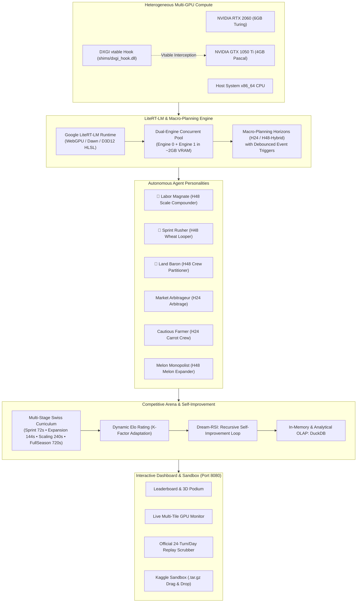

# 🌾 Kaggriculture Agent Arena

[](https://www.python.org/)
[](https://github.com/astral-sh/uv)
[](https://github.com/google/litert)
[](https://learn.microsoft.com/en-us/windows/win32/direct3d12/direct3d-12-graphics)
[](https://duckdb.org/)
[](LICENSE)

An open-source research and experimentation platform for **Kaggle Kaggriculture**, featuring **local multi-GPU neural inference via Google LiteRT-LM (Direct3D 12)**, **dialectical autonomous agent personalities**, **Swiss-system league tournaments with dynamic Elo**, an analytical **DuckDB** telemetry warehouse, and an interactive **live arena & Kaggle submission sandbox**.

---

## 🌟 Key Architectural Pillars



---

## 🚀 Highlights & Features

1. **Deterministic Multi-GPU Routing on Windows (Direct3D 12)**:
   - Google LiteRT-LM on Windows targets **Google Dawn over Direct3D 12 (D3D12)**. Standard environment variables like `CUDA_VISIBLE_DEVICES` are completely ignored by the Windows graphics subsystem.
   - We engineered a lightweight native C++ vtable interceptor ([`shims/dxgi_hook.cpp`](./shims/dxgi_hook.cpp)) that patches `IDXGIFactory::EnumAdapters1` and `EnumAdapterByGpuPreference`, enabling seamless targeting of secondary GPUs (such as an NVIDIA GeForce GTX 1050 Ti) with zero overhead.

2. **Dual-Engine Concurrent Inference on GTX 1050 Ti**:
   - Manages concurrent LiteRT-LM model runner instances in under **2,060 MB VRAM**, allowing 1v1 self-play and Swiss matches to execute entirely on a local consumer GPU.

3. **Macro-Planning Architectures ($H_{24}$ and $H_{48}$-Hybrid)**:
   - Evaluates multi-step decision sequences over daily ($H_{24}$) and bi-daily ($H_{48}$) horizons.
   - Features **debounced event-driven re-planning** when critical environment events occur (`WEED_SPAWN`, `HARVEST_READY`, `OPPONENT_SPIKE`), saving over 70% in inference tokens while maintaining peak tactical responsiveness.

4. **120-Match Swiss Tournament Curriculum**:
   - 4 temporal difficulty stages:
     - **Sprint**: 72 steps (3 in-game days) — Fast wheat loops and liquidity velocity.
     - **Expansion**: 144 steps (6 in-game days) — Tool upgrades and multi-plot watering.
     - **Scaling**: 240 steps (10 in-game days) — First farm-hands, market arbitrage, and automation.
     - **Full Season**: 720 steps (30 in-game days) — Full macro compound scaling, melons, pastures, and end-game monopolies.
   - Dynamic Elo ratings with promotion/demotion between 4 competitive leagues: Bronze, Silver, Gold, and Champion.

5. **Dream-RSI (Recursive Self-Improvement)**:
   - Automated 10-epoch reflective loop ([`kaggriculture/dream/dream_rsi.py`](./kaggriculture/dream/dream_rsi.py)) that inspects DuckDB telemetry, detects tactical pathologies (e.g., cash starvation, weed choking, over-hiring), and refines agent prompt strategies dialectically.

6. **Full-Featured Interactive Web Dashboard ([http://127.0.0.1:8080](http://127.0.0.1:8080))**:
   - **Podium & Leaderboard**: Comprehensive agent metrics, win rates, and accumulated capital.
   - **Live Arena Tiles**: Real-time multi-tile monitoring during active GPU simulations.
   - **Match History**: Dense tabular search with one-click full-screen replay player.
   - **Official Replay HUD**: Correctly synchronizes the **24 turns per day** game clock (`Day X / Total • Turn Y / 24 • Step Z / Total`), showing carried inventory (`🎒`), shed reserves (`🌱`, `📦`), and market spot prices.
   - **Kaggle Sandbox**: Drag-and-drop validation for `.tar.gz` Kaggle competition submissions against the arena champion before submitting to the official leaderboard.

---

## 📊 Hardware Benchmarks (`gemma-4-E2B-it`)

Empirical inference measurements comparing hardware targets via LiteRT-LM Direct3D 12 shaders:

| Device / Target | Microarchitecture | VRAM | Prefill Speed | Decode Speed | Time to 1st Token |
| :--- | :--- | :---: | :---: | :---: | :---: |
| **NVIDIA GeForce RTX 2060** | Turing (`sm_75`) | 6 GB | 149.35 t/s | **62.21 t/s** | 1.73 s |
| **NVIDIA GeForce GTX 1050 Ti** | Pascal (`sm_61`) | 4 GB | 98.02 t/s | **38.86 t/s** | 2.63 s |
| **Host System CPU (x86_64)** | AVX2 / FMA | 16 GB | 163.75 t/s | **14.88 t/s** | 1.63 s |

> **Key Finding**: The GTX 1050 Ti delivers **38.86 tokens/s**, outperforming the CPU by **2.61x** for auto-regressive decoding while utilizing only 1.03 GB VRAM per model engine.

---

## 🏆 Arena Tournament Results (Season 3 Swiss Curriculum)

Final standings after 120 matches across all 4 stages:

| Rank | Agent Personality | Architecture | Points | Record (W - D - L) | Peak Elo | Final Avg Elo | Net Margin | Total Revenue |
| :---: | :--- | :---: | :---: | :---: | :---: | :---: | :---: | :---: |
| 🥇 | **Labor Magnate** | $H_{48}$-Hybrid | **72** | **18 - 18 - 4** | 2,428 | 1,535.5 | +$9,840 | $102,240 |
| 🥈 | **Sprint Rusher** | $H_{48}$-Hybrid | **71** | **16 - 23 - 1** | 2,466 | **1,598.0** | +$5,340 | $102,180 |
| 🥉 | **Land Baron** | $H_{48}$-Hybrid | **68** | **15 - 23 - 2** | **2,514** | 1,550.0 | +$9,720 | **$104,100** |
| 4º | **Market Arbitrageur** | $H_{24}$ (Daily) | 57 | 19 - 0 - 21 | 1,797 | 315.0 | +$15,360 | $90,600 |
| 5º | **Cautious Farmer** | $H_{24}$ (Daily) | 46 | 13 - 7 - 20 | 1,510 | 115.5 | -$1,320 | $67,200 |
| 6º | **Melon Monopolist** | $H_{48}$-Hybrid | 7 | 0 - 7 - 33 | 2,125 | 161.0 | -$38,940 | $40,440 |

---

## ⚡ Quickstart Guide

### 1. Requirements & Prerequisites
- Windows 10/11 (64-bit) with Direct3D 12 support.
- Python 3.11 or higher.
- [`uv`](https://github.com/astral-sh/uv) installed (`curl -LsSf https://astral.sh/uv/install.ps1 | iex`).
- NVIDIA GPU with up-to-date Game Ready or Studio Drivers.

### 2. Environment Setup
Clone the repository and install all dependencies:
```powershell
git clone https://github.com/aleffita/kaggriculture-agent-arena.git
cd kaggriculture-agent-arena
uv sync
```

### 3. Verify Hardware & DXGI Interceptor
Inspect available GPU adapters and verify the DXGI hook:
```powershell
uv run litert-gpu
```

### 4. Launch the Interactive Dashboard
Start the web dashboard server:
```powershell
uv run kaggriculture-dashboard
```
Open [http://127.0.0.1:8080](http://127.0.0.1:8080) in your browser to view the leaderboard, browse the match history, watch replays, or drag-and-drop a `.tar.gz` submission into the sandbox.

### 5. Run Arena Benchmarks & Dueling
```powershell
# Benchmark language model inference on GTX 1050 Ti
uv run litert-bench --target 1050ti

# Benchmark across all targets (RTX 2060, GTX 1050 Ti, CPU)
uv run litert-bench --target all

# Regenerate all arena replays with full 720-step trajectories
uv run python scripts/regenerate_all_arena_replays.py
```

---

## 📂 Repository Topology

```text
kaggriculture-agent-arena/
├── pyproject.toml              # UV project configuration, dependencies, and CLI entrypoints
├── README.md                   # This project overview and documentation
├── AGENTS.md                   # Operational guidelines for autonomous coding agents
├── .gitignore                  # Production-grade exclusions (DuckDB, VRAM caches, raw weights)
├── src/
│   └── litert_explore/         # Python package for LiteRT-LM runtime & GPU interception
│       ├── cli.py              # CLI entrypoints (litert-explore, litert-bench, litert-gpu)
│       ├── gpu.py              # DXGI adapter detection and hook injector
│       ├── engine.py           # High-level LiteRT engine runner and structured decoder
│       ├── benchmark.py        # Automated multi-device benchmarking suite
│       └── dxgi_hook.dll       # Compiled DXGI vtable interceptor binary
├── shims/
│   ├── dxgi_hook.cpp           # C++ source for the DirectX DXGI vtable hook
│   └── dxgi_hook.dll           # Compiled 64-bit DLL hook
├── kaggriculture/
│   ├── agents/                 # Autonomous agent implementations & personalities
│   │   ├── personality_agent.py# Dual-engine macro-planning factory (H24 / H48)
│   │   ├── llm_player.py       # LiteRT-LM runner pool for Player 0 and Player 1
│   │   ├── scale_compounder.py # Labor Magnate champion macro policy
│   │   ├── wheat_looper.py     # Sprint Rusher wheat cycle macro policy
│   │   ├── crew_partitioner.py # Land Baron capital preservation macro policy
│   │   ├── market_arbitrage.py # Market price arbitrage macro policy
│   │   ├── carrot_crew.py      # Cautious Farmer risk-averse macro policy
│   │   └── melon_expander.py   # Melon Monopolist high-yield macro policy
│   ├── arena/                  # Competitive league engine, matchmaking & Elo system
│   │   ├── arena_engine.py     # Swiss tournament execution & replay orchestrator
│   │   ├── elo.py              # Dynamic Elo mathematics
│   │   ├── matchmaking.py      # Swiss-system pairing algorithm
│   │   ├── stages.py           # Stage horizons (Sprint, Expansion, Scaling, FullSeason)
│   │   └── leagues.py          # League promotion & demotion rules
│   ├── dashboard/              # Flask & HTML5 interactive dashboard
│   │   ├── app.py              # Backend REST API, replay streamer & sandbox worker
│   │   ├── templates/          # HTML5 templates (Podium, Live Tiles, Sandbox)
│   │   └── static/             # Responsive CSS & JavaScript HUD controllers
│   ├── db/
│   │   └── schema.py           # DuckDB relational schema (matches, telemetry, ratings)
│   ├── dream/                  # Dream-RSI recursive self-improvement pipeline
│   │   ├── dream_loop.py       # Multi-epoch tournament loop
│   │   └── dream_rsi.py        # Empirical debriefing & tactical prompt refinement
│   ├── notes/                  # 10 empirical debriefing logs (NOTE_epoch_001 to 010)
│   └── personalities/          # Markdown personality prompt specifications
├── scripts/                    # Standalone utility & measurement scripts
│   ├── regenerate_all_arena_replays.py # Multi-worker full-step replay regenerator
│   ├── benchmark_massive_concurrency.py # High-load concurrency stress tests
│   └── run_dashboard.ps1       # Convenience PowerShell launcher
├── docs/                       # Technical documentation & deep-dive reports
│   ├── architecture.md         # Runtime architecture: WebGPU vs D3D12 vs CUDA
│   ├── benchmarks.md           # Benchmark comparison tables across GPUs
│   ├── gpu_routing.md          # Multi-GPU routing options in Windows
│   ├── dashboard_visualizador_e_sandbox.md # Dashboard architecture & sandbox guide
│   ├── guia_duckdb_replays_e_metodologia_treinamento.md # DuckDB schema & telemetry guide
│   ├── relatorio_final_arena_10_epocas_dream_rsi.md # Final 10-epoch tournament report
│   └── relatorio_correcao_replays_e_temporizacao.md # Replay integrity & 24-turn clock audit
└── experiments/                # Empirical research logs, ablation data, and results
```

---

## 📚 Technical Documentation

- 📖 [**Runtime Architecture (WebGPU / D3D12 vs CUDA)**](./docs/architecture.md): Deep-dive into Google Dawn, DirectXShaderCompiler (DXC), and the DXGI vtable hook.
- 📖 [**Tournament & Telemetry Specification (DuckDB)**](./docs/guia_duckdb_replays_e_metodologia_treinamento.md): Schema reference, telemetry sampling points, and training dataset extraction.
- 📖 [**10-Epoch Dream-RSI Final Report**](./docs/relatorio_final_arena_10_epocas_dream_rsi.md): Comprehensive analysis of the 120-match Swiss season, tactical pathologies, and Elo curves.
- 📖 [**Replay Integrity & 24-Turn Clock Audit**](./docs/relatorio_correcao_replays_e_temporizacao.md): Complete audit of full 720-step trajectories and mathematical time formatting.
- 📖 [**Dashboard & Kaggle Sandbox Guide**](./docs/dashboard_visualizador_e_sandbox.md): User guide for live monitoring and `.tar.gz` submission testing.

---

## 📜 License

This project is licensed under the **Apache License 2.0** — see the [LICENSE](LICENSE) file for details.
