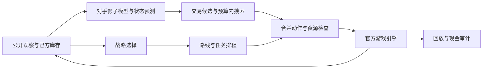

# Kaggriculture：策略整合、行为建模与可复现评测

在 Kaggle 的双人农场经营竞赛中，我负责汇总三人团队的策略思路，完成最终 Agent 的整合构建、实验筛选与提交。本项目展示如何把生产路线、对手行为模型和市场搜索组合成受运行预算约束的决策系统，以及如何用实验判断组合是否有效。

**个人角色：三人团队的策略整合与最终构建负责人。** 项目面向算法、机器学习与 AI 工程实习。开发过程使用 AI 编程工具辅助，队友贡献与代码来源见[团队协作](docs/TEAMWORK.md)和[来源说明](docs/CREDITS.md)。

三人团队共同完成的[赛后反思](docs/RETROSPECTIVE.md)还记录了 AI 写入未经授权否决规则、失败结论扩大、比较基线错位和未完成机制验证的问题，并提出下一次比赛的改进流程。

## 已完成的工作

- **策略整合**：对接队友的固定生产路线与六种对手影子模型，把浇水、喂食、采收等义务安排在执行层，把策略选择与交易搜索放在决策层
- **机器学习探索**：整理团队完整动作行为克隆实验，比较离线验证与自主对局结果，将部署失败的证据用于最终版本筛选
- **工程优化**：复用相同动作前缀的状态转移，修复 SDK 状态对象的复制语义，保持六模型和决策逻辑
- **实验与交付**：固定种子、对手和席位做成对比较，重建官方现金账，用源码和提交包哈希对应最终版本

## 可以核对的结果

以下数字来自保存的本地官方环境实验，最终比赛成绩尚未公布。

| 实验 | 观察结果 | 适用范围 |
|---|---|---|
| 最终 R7 对比 R4 | 12 个配对的净金币差增量均为正，平均 **+961** | 2 个已暴露的条件世界、3 类对手、双席；24 局，包含 2 个有旧错误标记的对照局 |
| 独立复制优化对照 | 16 对动作、现金和决策语义一致；平均配对回调耗时比下降 **15.6%** | 2 个固定世界、4 类对手、32 局；本机六并发计时 |
| 行为克隆开发验证 | 23,008 个验证样本的完整动作一致率 **88.25%** | 416 条训练轨迹；自主对 Master 为 0 胜 6 负，未用于最终 Agent |
| 最终现金审计 | **17,256** 次官方现金转移，双方残差均为 0 | 24 局 × 每局 719 次转移；由完整回放审计所得 |
| 正式提交 | R7，Kaggle 提交编号 **56713467** | 平台已接收；成绩与排名待公布 |

12 个配对包含重复世界和相反席位，不能换算成总体胜率。原严格整板健康门为 **22/24，未通过**；全部 12 个候选局通过，两处标记来自旧版对照。本仓库保留全部配对，详细口径见[证据与限制](docs/EVIDENCE.md)。


## 系统如何工作

固定执行计划安排生产与照护义务；有限预算的搜索负责选择有价值的交易和策略。



模型预测使用允许观察的信息。对手真实私有库存、未来动作和真实未来店铺不作为策略输入。

## 在本地复核结果

Python 3.11 及以上即可运行，不需要 Kaggle 凭据、GPU 或第三方 Python 依赖。

```bash
git clone https://github.com/ki-fine/kaggriculture-agent-portfolio.git
cd kaggriculture-agent-portfolio
python src/analyze_results.py --check
python -m unittest discover -s tests -v
```

第一条 Python 命令从公开的精简结果重算配对指标；测试覆盖统计口径和状态复制边界。该步骤复核已保存的证据摘要，不会重新运行完整比赛。

## 阅读与代码入口

根据你的关注点，可以直接进入以下材料：

| 内容 | 入口 |
|---|---|
| 项目背景、技术方法与取舍 | [项目总结报告](docs/PROJECT_REPORT.md) |
| 路线锁定、失败结论与 AI 协作改进 | [赛后反思](docs/RETROSPECTIVE.md) |
| 三人协作与本人职责 | [团队协作](docs/TEAMWORK.md) |
| 行为克隆、评估差异与模型边界 | [机器学习实践](docs/ML_EXPERIMENTS.md) |
| 指标定义、样本设计、失败记录 | [实验依据](docs/EVIDENCE.md) |
| 配对评测代码 | [analyze_results.py](src/analyze_results.py) |
| 精确状态复制代码 | [state_copy.py](src/state_copy.py) |
| PyTorch 模型与合成输入演示 | [机器学习代码](ml/README.md) |
| 简历条目与面试准备 | [简历与面试材料](docs/RESUME.md) |
| English overview | [English README](README.en.md) |

公开展示代码和数据经过精选；原参赛程序包含团队提供的路线与模型，完整程序仍保存在团队研究仓库。此仓库公开可归属的评测工具、状态复制增量、精简实验数据和来源记录，不重新分发完整队友程序或模型。

## 项目状态

截至 **2026-10-01**，R7 已提交，最终比赛成绩尚未公布。R8、R9 保留为研究实验，未替换最终版本。成绩公布后可按[更新说明](docs/RESULTS_UPDATE.md)补充官方结果。

本仓库新增代码采用 MIT 许可证；引用的 Kaggle SDK 参考代码采用 Apache-2.0，见[第三方声明](THIRD_PARTY_NOTICES.md)。
