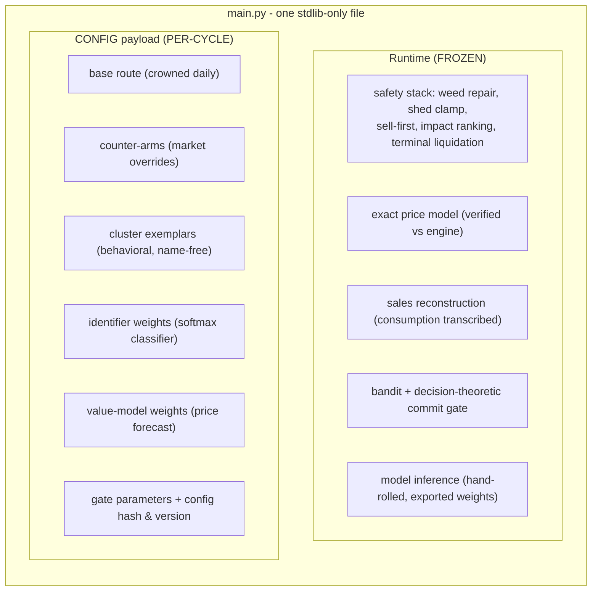
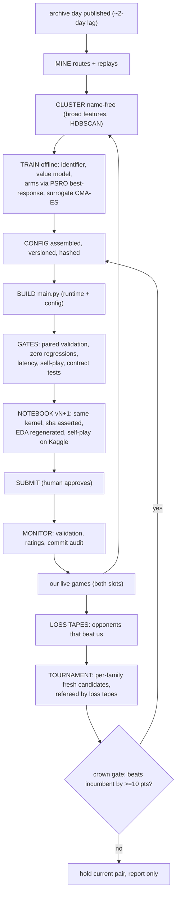

# The config-driven agent architecture

*2026-08-10. The system that produces every submission from v23 onward.*

## Verdict

One **frozen runtime** + one **per-cycle config payload**, rendered into a single
stdlib-only `main.py`, hash-verified inside the notebook that submits it. This
generalizes two proven disciplines: the `PARAMS` sentinel split (v1/v2) and the
route template (`tape_runtime.TEMPLATE`). Runtime code changes only with review
and full regression; the config regenerates daily from data.

## Anatomy of the shipped agent

## The daily cycle

Today's losses are tomorrow's referees and training labels. Every training row
is tagged with the episode's **engine version** so old-game data cannot
contaminate new-game models (lesson of the 2026-08-07 balance change).

## Model A/B — three tiers, cheapest first

| Tier | How | Decides in | Notes |
|---|---|---|---|
| Local paired A/B | Two builds differing in one config entry, identical seeds, both seats | ~30 min | The workhorse; caught five harmful layers before they went live |
| Slot A/B (live) | The two active submissions carry config A and B on the same base | ~50 games/slot | **Judge game records, never early ratings** — the v19.1/v22.1 twins diverged 1,100 rating points at identical win rates |
| Config lineage | Registry links ref → config hash → metrics; commit audit attributes outcomes per component | days | Any historical agent exactly rebuildable from its hash |

## Fine-tuning cadence

| Component | Method | Cadence | Warm start |
|---|---|---|---|
| Base route | Not tuned — **re-crowned** (freshness: 47%→86%→100% across three days) | daily | — |
| Counter-arms | (1+λ) ES / latent CMA-ES vs current family reps (PSRO oracle) | daily | previous genome |
| Identifier | Retrain on newest replay prefixes; temperature recalibration held-out | daily | previous weights |
| Value model | Incremental refit on price transitions | weekly | previous weights |
| Commit gates | Re-estimate E[gain/cost] from commit audit | weekly | current estimates |
| Surrogate | Refit on the episode sink | continuous | — |

## Delivery roadmap

| Phase | Deliverables | Exit test |
|---|---|---|
| 0 (now) | Vendored engine 1.32.6 + re-baseline (**done**); consumption-model patch; version-drift alarm; `refresh_cycle.py` v1; docs pass; v23 re-crown under new engine | one unattended cycle produces a gated candidate + report |
| 1 | Episode sink; replay feature extractor; clustering v2 (broad features, cross-episode consistency) | ground-truth co-clustering; day-over-day stability |
| 2 | Identifier classifier (calibrated, novel class); decision-theoretic gates; surrogate-assisted arm oracle | export equivalence ≤1e-6; fire-rate up, lookalike column unharmed |
| 3 | Rust `step()` via PyO3 ported from 1.32.6; parity harness; two-tier search; trajectory optimizer | parity bit-exact over 1k+ episodes; candidates re-gated on true engine |
| 4 | ~~Signature obfuscation~~ **CLOSED — no zero-cost obfuscation exists** (`src/kaggriculture/agentbuild/obfuscate.py`, measured 2026-08-10); copy detection; architecture section in the (private) notebook | verdict recorded below; defense is basin choice, already exercised |

### Phase 4 finding: obfuscation is a dead end, defense is basin choice

`src/kaggriculture/agentbuild/obfuscate.py` measures our identifiability across three channels and
engine-prices each candidate transform. Result: **identity is intrinsic to how
we farm and cannot be cheaply hidden.**

* **Sell-timing jitter** (the old `_OBFUSCATE` layer) leaves the final sell
  basket byte-identical, so it can never move `self_identify` (which reads
  exactly those totals). The +2-turn jitter drops identifier confidence
  0.985→0.964 (noise); the only timing shift that moves it (+60 turns,
  →0.675) costs **−$133,377/episode** and still leaves the final-mix and
  farm-event channels fully identifying.
* **Farm-event edits** (herd swap, seed shuffle) are what the public
  first-48-turn detector actually keys on, but changing them means farming
  differently — real cost, and they don't even move our own curve-dominated
  identifier.
* **What works instead:** basin choice. Our broad fingerprint dataset
  (`src/kaggriculture/data/fingerprint_dataset.py`, 2,562 routes) places our base in the
  `sheep_first_hybrid` cluster — the winningest basin (75.5%) — shared with
  ~26 field teams. We are identifiable *as a family*, not uniquely, and the
  family we chose is the one that wins. The crown already selects for this.

### Near-mirror market relay v2 (2026-08-11, ON by default)

The public meta now front-runs shared-market dumps in mirror games (boatlee
V16-RC2: 3-turn fixed lead, public 3046.4 with 22 forks; shiv17: 5-turn
counter-lead, 87.5% vs boatlee). Our v1 mirror tie-break never fired — it
demanded exact public equality *including money* and looked one turn ahead.
v2 (both runtimes, `routes.py --build` default ON): money-free structural
near-match (tolerance 4, 12-turn streak from step 216), 2-turn lead on the
recurring FERTILIZER dump only (≥8 units, min-quote 3), per-step repayment
ledger. **Measured: +202/game, 3W 0L 0T vs a clone of our own base (was an
exact tie); byte-identical outside the mirror.** A broad variant (6-turn
window, all premiums) measured **−1,401/game** — the edge is narrow or it is
negative. Fixed leads are pre-emptable constants; ours engages only clones of
our own schedule, where a minimal lead wins the race.

## Guardrails that never move

* Every config change ships through paired validation with **zero regressions**,
  including the novel/lookalike referees.
* Exported inference must match the trained model to numerical tolerance;
  latency measured under load.
* The pipeline builds and gates; **a human submits**.
* Identity is behavioral — nothing keys on a team name.
* Any local number predating the current vendored engine version is void.
