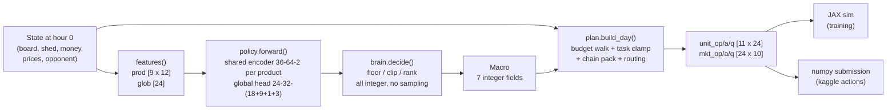
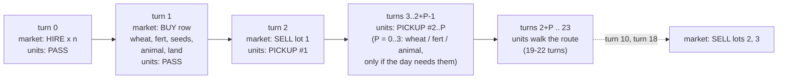
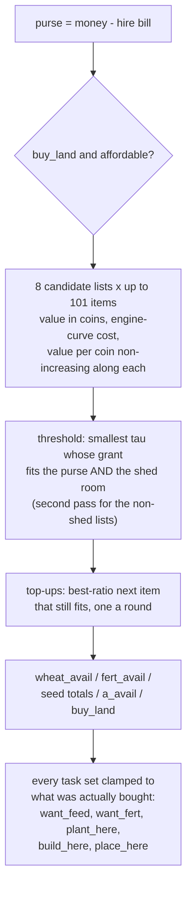
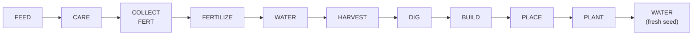
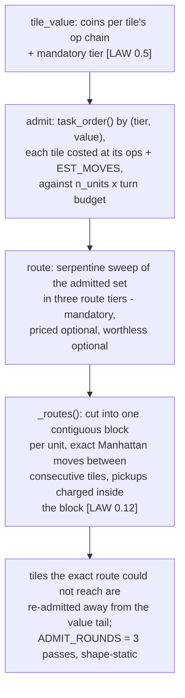

# The planner policy: one decision a day, deterministically compiled into 24 turns

> Architecture review and prioritized improvement recommendations:
> [`PLANNER_REVIEW.md`](PLANNER_REVIEW.md).

The policy never picks per-turn actions. Once per day, at hour 0, a tiny network
reads the state and emits a **Macro** (seven integer fields, most of them
*value estimates in coins* rather than decisions — PLANNER_V3_1 §2). The planner
(`src/kagg3/core/plan.py`) then *compiles* that macro into the whole day —
per-unit ops for all 24 turns and market-order rows — with no further feedback.
The JAX simulator and the numpy submission both execute these arrays verbatim,
which is what keeps them equivalent.

## What the network decides (the Macro)

| Field | Type | Meaning |
|---|---|---|
| `plant_target` | int[5] | new plantings wanted today, per crop |
| `animal_kind` | int | the **one** animal type handled today (goose/cow/sheep) |
| `animal_count` | int | animals to acquire today (0 means zero — §0.8) |
| `buy_land` | int | 0/1 — buy the next quadrant if affordable |
| `hold` | int[9] | **value**: coins one unit of a product is worth kept until tomorrow (the sale's reservation, §1.2) |
| `press` | int[9] | **value**: coins a unit is expected to lose per lot of delay to opponent selling (§1.2) |
| `grow_mult` | int[9] | **value**: fixed-point multiplier on new plantings and animals, `GROW_ONE = 256` is x1 (§1.3) |

Every coin value is clipped to `spec.COIN_CAP - 1` (`COIN_CAP = 2**20`) before it enters ratio
or ranking arithmetic, and `sell.LIQUIDATE = -COIN_CAP` sits below every
decodable `hold`, which is what makes day 29's liquidation unconditional.

The ten decisions that used to sit here are gone, replaced by deterministic
integer optimisers over the values above and the engine's own tables
(PLANNER_V3_1 §§1.2–1.6): `sell_qty`/`sell_min`/`sell_lots` by the lot
allocator (`core/sell.py`), `order`/`fert_buy`/`n_fertilize` by the
marginal-unit budget (`core/budget.py`) and §0.11's fertilizer valuation,
`feed_daily`/`care_on` by §1.4's feed test and §0.11's cadence, `n_hire` by
§1.5's enumerated argmax, and `prio` by §1.6's admit-then-route.

Everything downstream of the Macro is fixed machinery — the network's only
levers are these fields.

## The fixed day skeleton

Within every turn the engine applies **unit actions first, market orders
second**, then town consumption and plant decay (`sim/rollout.py`). Purchases
land in the shed at turn 1; pickups start at turn 2; today's harvest reaches
the shed at end-of-day and can only be sold **tomorrow**.

## The budget: marginal units, not categories

Purchases are *marginal candidates* — one wheat per passing feed, one
fertilizer per application, the k-th seed of each crop, the k-th animal — each
priced in coins and against its engine-curve cost, and granted best value per
coin down the purse (`core/budget.py`, §1.3). The hire bill is deducted first
because HIRE resolves before BUY; land is compared two ways (grant or skip)
ahead of the greedy, because its value is a learned logit rather than coins.

Shed room is a second budget carried *inside* the greedy, not clipped off its
answer: wheat, fertilizer and animals share one room, and the engine caps
those buys at turn 1 before any lot fires.

## Per-tile op chains

Each tile independently accumulates up to `CHAIN_MAX = 6` ops, in a fixed order
that respects the engine's same-day semantics:

- water when the plant would weed tonight (`t_cons >= 1`), when watering still
  buys yield (one-time crops inside their bonus window), or on a fertilized
  ongoing crop's fire night
- feed a hungry animal iff what it can still sell — capped at a replacement's
  cost, plus a pending CARE bank a fed fire day would cash — beats this feed's
  wheat price (§1.4); one that fails is left to escape and not replaced
- one-time crops harvest at `max_yield_day`, or on `LAST_SHED_DAY` when the
  season ends first (§0.1); ongoing crops harvest whenever yield is banked
- weeds are always dug; empty structures of today's kind are restocked before
  new ones are built

## Labour: admit, then route

Every queued op is priced in coins (harvests at today's quotes, survival work
at what it saves, development at its stream value under `grow_mult`), and the
day admits tiles by (mandatory tier, value) against the whole turn budget —
then routes the admitted set spatially (§1.6).

How many hands walk it is not a gene either: each hand count 0..10 is scored
as the admitted value its extra turns buy, less its fib bill, and the best
affordable one wins, ties to fewer hands (§1.5).

Turn budget per unit: `24 - 2` route turns, less the pickup turns that unit's
own block consumes (0–3). Hands spawn on the shed-access tiles.

## Deterministic caveats (short list)

The full analysis lives in the review that produced this doc; headlines, all
structural rather than learned. Items marked **[fixed]** were closed by the
Phase-0/1/2 landings of `PLANNER_V3_1.md` and are kept for the history.

1. **Open loop.** The day is compiled from the hour-0 snapshot; nothing
   replans intra-day. Sell gates check hour-0 prices while lots execute at
   turns 2/10/18; buys are priced at hour-0 but execute at turn 1 on a moved
   market (dynamic-priced wheat/fertilizer only).
2. **One-day revenue latency.** Harvest sells tomorrow; a day-29 harvest is
   never sold (score is final money).
3. **Season-tail dead zone. [fixed, §0.1]** Planting was gated on *first*
   yield by day 28 while one-time crops only harvested at `max_yield_day`, so
   wheat planted d25–26, carrot d26 and melon d17–18 were write-offs. The
   harvest age is now clamped to `LAST_SHED_DAY` when the season ends first.
4. **All-or-nothing harvest.** No early or partial harvest exists in the
   vocabulary; a one-time crop whose harvest day is dropped by the labour
   budget decays at 1 yield per 2 turns (`rollout.py:70`) — the crop is gone
   within half a day.
5. **Cadence traps. [fixed, §0.11]** The ongoing-crop fertilizer bonus only
   pays on a watered fire day and the CARE bank is wiped on any unfed fire day
   (`eod.py:112`), which the `feed_daily`/`care_on` genes could not express.
   Both are now emitted from the mechanics: fertilized ongoing crops are
   watered on their fire nights, and CARE is emitted only when the payout fire
   is fed, monetizable and inside `max_held`.
6. **Positional rationing. [fixed, §0.6]** Shortfall victims are ranked by
   replacement value, serpentine position only as the final tiebreak.
7. **Fertilizer is not reserved from the sale. [fixed, §0.7]** `n_fert_eff` is
   deducted from sale availability the way feed wheat is.
8. **Shed-capacity management. [fixed, §0.9]** End-of-day still destroys
   overflow above 100 (`eod.py:192`), but the day now projects tonight's shed
   from certain inflow alone and force-sells the cheapest marginal units to
   absorb it. Open: harvest batching — a day whose certain inflow alone
   exceeds the hour-0 sellable stock still overflows.
9. **Irreversibilities.** Structures are never demolished; animals are handled
   one kind per day; empty structures of today's kind are force-restocked
   (`plan.py:330`).
