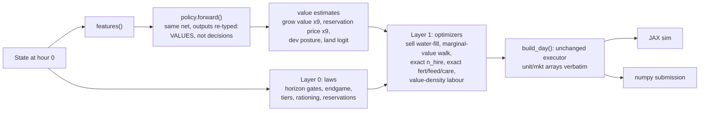

# Planner v3: the network estimates value, the planner optimizes

> **Superseded by [`PLANNER_V3_1.md`](PLANNER_V3_1.md)** — v3 with every
> verified correction from the review folded in.
> Detailed correctness review and V3.1 recommendations:
> [`PLANNER_V3_REVIEW.md`](PLANNER_V3_REVIEW.md).

Derived from the blind verification pass over `PLANNER.md` / `PLANNER_V2.md`
(2026-08-24): every V2 line reference was checked against
`src/kagg3/{core,sim,agent}`, seven of ten concrete items confirmed sound, two
found broken as specified (1.2, 2.2), two underspecified (1.6, 2.3), and one
whole class of exact fixes found missing (endgame pruning). V3 keeps V2's
direction and replaces its organizing idea with a stronger one.

## The rethink

V2 frames the problem as "which fixed rules should become smarter, and which
learned scalars should become computed." That is patchwise. The verified
findings support a cleaner statement of the same insight, applied uniformly:

> **Every learned output is re-typed from *decision* to *value estimate in
> coins*. Every decision is made by exact arithmetic over those values plus
> the engine's own tables.**

Three facts, all verified in code, make this the right architecture:

1. **The engine is fully transcribed and deterministic.** Prices are
   tabulated (`tables.price`), town consumption is a fixed schedule, yield
   and cadence rules are exact integer arithmetic. Anything that depends only
   on *our own* state and plan is computable, not learnable.
2. **The only genuine unknown is the opponent** (their trades move prices,
   their development shapes the market) plus multi-day tradeoffs that route
   through it. That is a *value estimation* problem, not a decision problem.
3. **ES is the scarce resource.** The trainer already has every cheap
   variance trick (antithetic pairs, rank shaping, CRN, mirrored seats, an
   absolute anchor) — its resolution is spent, and it is spent today on ~38
   decoded outputs, most of which arithmetic could settle exactly. Shrinking
   the decision surface is worth more than any further trainer tuning.

This is one step of rollout / one-step-lookahead policy improvement with an
exact model (Bertsekas): a policy that proposes values and an optimizer that
argmaxes over them cannot do worse than the proposing policy, and in a
deterministic engine the "model error" term is exactly zero for everything
except the opponent — which is precisely what the genes are left to absorb.

## What stays (unchanged from v1/v2)

- One network eval per day; the whole day compiled to shape-static arrays;
  JAX sim and numpy submission execute them verbatim. The equivalence surface
  does not grow (one optional, explicitly-gated exception in §6).
- Needs-derived provisioning with affordability clamps.
- Integer-exact, tie-broken-everywhere determinism; all new sort keys are
  pairwise/lexicographic comparisons, never packed integers (see §3.4 — the
  packed-key form in V2 1.2 overflows int32 and is rejected).
- The network architecture and theta layout. Heads whose decisions move into
  arithmetic become inert, not removed; the encoder's two per-product scores
  are *re-typed* (grow value, reservation price). This preserves the shipping
  machinery but **not** checkpoint behaviour — see §9.

---

## Layer 0 — the laws (exact rules, zero genes)

Everything in this layer is provable from engine semantics verified in the
sim transcription. Each item is an independent ablation against the absolute
eval. Items 0.1–0.9 are V2 Tier 1 as amended by the review; 0.10–0.12 are new.

### 0.1 Sellability gates (V2 1.1, confirmed verbatim)

    one-time:  day + CROP_MAX_YIELD_DAY[c]   <= 28
    ongoing:   day + CROP_FIRST_YIELD_DAY[c] <= 28

Verified: yield banks at eod of `t_day+first-1`, harvest lands in the shed at
eod, sells next morning, day 29 has no eod. Sellable planting deadlines:
wheat d24, carrot d25, tomato d20, strawberry d18, melon d16. The current
gate (`brain.py:289`) allows wheat/carrot d26 and melon d18 — deterministic
write-offs.

### 0.2 Animal & structure horizon gates (new — missing from V2)

Nothing gates `animal_count` by day anywhere in `brain.py` or `plan.py`. The
symmetric rule to 0.1: an animal placed on day d first yields at `d + first`,
harvestable then, must be harvested by day 28. Gate acquisition (buy, build,
place) per kind:

    day + ANIMAL_FIRST_YIELD_DAY[a] <= 28     # goose d<=24, cow d<=20, sheep d<=22

The residual fertilizer stream of a later animal (1/day, sellable through the
day-28 collection) never covers cost for any of the three kinds — a goose
bought d25 collects at most 3 fert (~<=300 declining coins) against 300 cost
plus feed and labour. Late animal buys are the same write-off class as d25
wheat. Same gate applied to `buy_land` at the point where no gated
development remains (`day >= 27` given the tables — derive, don't hard-code).

### 0.3 Endgame pruning (new — missing from V2, largest free win in this layer)

Verified from `rollout.py::episode`: the last day runs 23 turns with
**no end-of-day**, so day-29 harvests never reach the shed and no day-29 unit
op can move money. Exact consequences, all rules:

- **Day 29:** suppress every hire and every BUY (nothing can pay back).
  Liquidate the *entire* hour-0 shed across the three lots, ignoring
  reservation prices — terminal value of anything unsold is exactly zero, so
  selling at any price dominates holding. No unit op is emitted at all
  (labour is free but worthless; emitting nothing keeps the trace clean).
- **Day 28:** no FERTILIZE (pays on future fire days only), no CARE (payout
  ≥ eod 29), no survival FEED or WATER (survival to day 29 is worthless, and
  wheat bought for day-28 feeding is dead money — the feed *want* must also
  leave the budget walk), no PLANT/BUILD/PLACE (already covered by 0.1/0.2).
  Kept: HARVEST (eod 28 → sold day 29), COLLECT (same), and WATER only where
  it raises a *same-day* harvest (one-time crop in bonus window, watered
  before harvested in the chain — verified order in `plan.py`).
- Generalized guard: any op whose entire payoff chain lands past the last
  monetizable event is never emitted. Implemented as a per-op horizon
  predicate, not day-number special cases, so it is provable and testable.

This frees exactly the late-season labour that the survival tiers (0.4) are
protecting and removes the season tail from the learnable surface entirely.

### 0.4 Two-tier labour ordering — lexicographic, not packed (V2 1.2 amended)

V2's packed key `tier * TIER_BIG + score * 128 + (127 - idx)` **overflows
int32**: the existing key already spans ±1.15e9 (`brain.py`'s own comment),
so any TIER_BIG that clears it exceeds 2^31−1. The fix costs nothing because
`task_order` (`plan.py:200`) is already a pairwise rank:

    ahead = (tier[None,:] > tier[:,None]) \
          | ((tier[None,:] == tier[:,None]) & (key[None,:] > key[:,None]))
    ahead &= task[None,:]

Mandatory tier: deadline harvests (one-time crop at `max_yield_day`, any
harvest on day 28), survival waterings (`must_water` only — not
`want_water`, which includes bonus waterings), and survival feeds *that pass
the value test in §5.3*. Within-tier order comes from Layer 1's value
density (§5.6).

### 0.5 Value-ranked rationing (V2 1.3, confirmed; refs are `plan.py:384-390`)

When wheat or fertilizer is short, the victim is currently the serpentine
tail (`_rank` over serpentine-ordered `DayView` arrays). Rank victims by
replacement value instead — animal: remaining sellable production (capped at
animal cost); crop: remaining projected revenue — serpentine as the final
tiebreak, via the same pairwise machinery as 0.4. Exact tables, no genes.

### 0.6 Reserve fertilizer from the sale (V2 1.4, confirmed)

Mirror `wheat_reserved` (`plan.py:632`) with `n_fert_eff`. Verified race:
with a feed pickup present the fert pickup slides to turn 3 while sell lot 1
fires at turn 2 (units act before market inside a turn, so turn-2 pickups are
safe and turn-3 pickups are not). In v3 the reservation is folded into the
sell optimizer's availability input (§5.2) rather than patched at `_market`.

### 0.7 `animal_count = 0` means zero (V2 1.5, confirmed, with the caveat)

    a_want = min(animal_count, n_free + n_struct_free)     # plan.py:330

with the `n_build`/`place_here` chain stocking free structures first. This
changes the *semantics* of a live gene: frozen pre-v3 checkpoints will stop
force-restocking and may regress until retrained — that is expected and must
be stated as the predicted sign in the ablation, not discovered by it. In
v3 this fix composes with §5.3: an animal that fails the feed value test is
allowed to leave and is not repurchased.

### 0.8 Shed-overflow forced sale — conservative-LOW, post-gate (V2 1.6 amended)

Two amendments to V2, both from the review:

- Project the end-of-day shed **conservatively low** (count only inflow that
  is certain: purchases already granted by the walk, harvests inside the
  mandatory tier). Selling dominates *destroying*; it does not dominate
  *holding* — an optimistically-high projection sells stock that would have
  survived, which is a price bet, not a free win.
- The forced quantity must **bypass the reservation/gate check**: in the
  current code `s_qty` is zeroed by the gate before lot splitting
  (`plan.py:634`), and below-gate products are exactly what accumulates.

In v3 this is not a patch: the sell optimizer (§5.2) takes `room = 100 −
projected_keep` as a hard constraint and chooses *which* units to force-sell
by lowest marginal value, so overflow handling and revenue maximization are
one problem. Hard cap acknowledged: forced sales draw only on the hour-0
shed; a day whose certain inflow alone exceeds capacity still overflows, and
the projector must report that so harvest scheduling (Layer 1) can react.

### 0.9 Engine-curve buy pricing (V2 1.7, confirmed, plus packaging)

Price the budget walk with `sell_walk`/`buy_walk` cumsums over
`tables.price`, starting from the hour-0 inventory advanced by the turn-0
town tick (both shop and town-center intervals divide 24, so exactly one
tick lands between quote and the turn-1 buy — verified). Two implementation
facts V2 omits: `DayView` must grow `mkt_inv` and `shops` fields (it carries
only `price` today, so `parse.py` and `day_view` change), and the price
table must be buildable without JAX for the submission (move the table
builder from `sim/state.py` into shared core; `spec.shape` already is).
Cross-seat same-turn coupling stays the acknowledged residual drift.

### 0.10 Fire-day cadence as exact rules (upgrades V2 2.1 from re-typed genes to no genes)

All verified: production fires regardless of watering; the fert +2 requires
watered-on-fire-day (`eod.py:76-77`); the CARE bank pays at the next fire
day only if the animal is fed that day and is wiped either way
(`eod.py:112-115`). Fire days are exactly computable. The v3 rules:

- **Water** ongoing crops on *fertilized* fire days (the only fire-day
  watering with any payoff), plus survival and one-time-bonus watering as
  today.
- **Feed** = survival feed, gated by the value test in §5.3. The
  `feed_daily` gene is deleted; feeding beyond survival pays only through
  CARE, which is scheduled exactly:
- **CARE** is emitted only when (a) the next fire day is ≤ the horizon,
  (b) the feed rule guarantees the animal will be fed on that fire day, and
  (c) the marginal product unit clears the labour opportunity cost (§5.6).
  The `care_on` gene is deleted.

### 0.11 Per-unit pickups — two-pass cut (V2 2.2 amended)

Confirmed waste: `budget = 24 − 2 − n_pickup` is global and a unit with an
all-zero `blk` still idles through the pickup turns. V2's "blk is already
per-unit" hides a circular dependency: a unit's budget depends on its pickup
count, which depends on its task block, which depends on its budget. Spec:
a fixed two-pass cut (shape-static, jit-safe) — pass 1 cuts blocks with the
optimistic budget (no pickups), derives each unit's actual pickup count from
its block, pass 2 re-cuts with per-unit budgets `24 − 2 − own_pickups`. A
unit whose pass-2 pickup set grew re-runs the derivation once more against
the conservative global bound; three passes total, then freeze. Predicted
recovery: 1–2 turns for most units on multi-pickup days.

### 0.12 The projector honesty rule

Every Layer-1 optimizer consumes projections. Wherever a projection is
uncertain (opponent trades, dropped-task risk), the rule is: **survival and
selling decisions use conservative bounds; development decisions use the
gene-scaled estimate.** This keeps every exact rule provably
no-worse-than-current while confining optimism to the subspace ES trains.

---

## Layer 1 — the optimizers (argmax over exact projections)

V2 Tier 3 proposed K× `build_day` generate-and-test. The review's cost note
stands, and the rethink goes further: the macro's components are largely
*separable*, so each gets its own small exact optimizer inside **one**
`build_day`, at near-zero marginal cost, in both backends, shape-static.
The K-candidate hammer is rejected (§10) — decomposition beats it.

### 5.1 The price projector (shared primitive)

For each product: the tabulated price curve, advanced by the deterministic
town-consumption schedule between any two turns of today, walked by our own
planned trades (`sell_walk`/`buy_walk` cumsums — the code exists in
`sim/market.py`). This gives exact *own-impact, opponent-free* revenue and
cost for any planned quantity at any of today's market turns. Opponent
impact is deliberately absent: it is the genes' job (§7). Build once per
day per product; every optimizer below reads it.

### 5.2 The sell side: reservation prices (deletes 19 decoded outputs)

Replace `sell_qty[9] + sell_min[9] + sell_lots` with one learned scalar per
product: a **reservation price** `hold[p]` — the value of keeping one unit
until tomorrow (re-typed from the encoder's sell score; smooth in theta,
which is exactly what ES wants). The optimizer then:

1. availability = hour-0 shed − wheat feed reservation − fert reservation
   (§0.6) per product;
2. marginal revenue schedule = the three lots' quote walks from the
   projector, lot 2/3 inventories advanced by the town ticks between turns
   2→10→18 and by our own earlier lots;
3. **water-fill**: allocate units one marginal step at a time to the lot
   with the highest current marginal price, stopping at the first step whose
   marginal price < `hold[p]`; ties break to the earlier lot, then lower
   product index;
4. overflow room (§0.8) enters as a floor on total units sold, filled by
   lowest-marginal-value units ignoring `hold`;
5. day 29: `hold ≡ 0` (§0.3).

Correctness note: water-filling is optimal iff each lot's marginal revenue
is non-increasing, i.e. the price table is monotone non-increasing in
inventory. Verify that once at table build (the shape functions are monotone
but assert it, don't assume it); if any product violates it, fall back to a
bounded exhaustive split search for that product (quantities ≤ 100, 3 lots —
still static-shaped). Everything is integer table lookups and cumsums.

This deletes the sell genes' hardest joint credit-assignment problem (how
much × at what floor × over how many lots) and leaves ES one interpretable
number per product. V2 2.3's turn-time re-gating survives only as a thin
safety net (§6).

### 5.3 The buy side: marginal value per coin (deletes `order[5]`, `fert_buy`, `n_fertilize`)

The budget walk keeps its shape (wants never read money; one walk down the
purse) but the *order* is computed, not learned: categories are ranked by
projected marginal value per coin, priced on the engine curve (§0.9).

- **Feed wheat** — exact: value of a feed = the animal's remaining
  conservatively-projected sellable production (capped at replacement cost),
  minus nothing (labour is priced in §5.6). An animal whose remaining value
  < its feed cost is *not fed and not replaced* — this is the exact exit
  rule that composes with §0.7, and it finally prices the
  buy→starve→re-buy loop at its true (negative) value.
- **Fertilizer** — exact: fertilize a plant iff, within the 2-day
  `t_fert` window, it has watered fire days whose +1 marginal yield ×
  projected price exceeds the fert price (market price if buying, projected
  sale value if diverting collected stock). This one inequality replaces
  both `n_fertilize` and `fert_buy`.
- **Seeds** — gene-scaled: per-tile crop value = exact projected revenue
  (yield schedule × projector price path, horizon-gated by §0.1) × the
  learned grow multiplier for that product. The multiplier absorbs opponent
  crater risk and multi-day price impact of our own volume.
- **Animals** — gene-scaled the same way, horizon-gated by §0.2.
- **Land** — the learned logit stays (§7): its value routes through labour
  capacity and multi-day development, the least computable thing here.

The walk grants in descending value-per-coin; survival items priced exactly
will outrank development whenever they should, and the pathological "land
always last" trap cannot recur because ordering is no longer a trained
permutation with a zero gradient — it is arithmetic over values ES *can*
move one scalar at a time.

### 5.4 Hiring: exact argmax (deletes `n_hire`)

The circularity (hire bill → purse → wants → tasks → block values → hire
value) is resolved by structure, not iteration-to-convergence: for each
h ∈ 0..MAX_HANDS (11 static passes), run only the cheap prefix — budget
walk, task derivation, `task_order` (a 100×100 pairwise compare), cumulative
block *values* from §5.6's per-task values — and pick

    n_hire = argmax_h [ sum of task values inside h+1 blocks − hire_bill(h) ]

ties to the smaller h. The expensive `_routes` expansion runs once, with the
winner. Eleven passes of walk+compare are trivial on GPU and milliseconds in
numpy. This is the purest case of the whole design: the gene was a scalar ES
had to grope for; the argmax is exact and adapts to every board.

### 5.5 Development split

`dev_frac` and `animal_share` stay learned (§7) — they are multi-day
posture. The crop split keeps the proportional largest-remainder mechanism,
fed by the §5.3 gene-scaled values instead of raw grow scores; `animal_kind`
stays the argmax over the three animal values.

### 5.6 Labour: tiered value density (deletes `prio[9]`)

Each task tile's value is already computed by this point (harvest revenue
via the projector; survival = remaining asset value from §5.3; development =
gene-scaled value from §5.3; dig = the tile's development option value,
conservatively the best plantable crop's value). Order tasks by

    tier (mandatory first, §0.4)  >  value − λ·walk_cost  >  serpentine index

with `λ` the marginal task value at the budget boundary (one scalar,
computed, not learned) and walk cost the serpentine-adjacent Manhattan step
— the routing model stays the greedy sweep; no TSP. The nine `prio` genes
and their 64-step quantization disappear; what the farm abandons on a short
day is now the provably least valuable work, and ES no longer spends
resolution learning that weeds near the shed are cheap.

---

## 6. The compiled day and the one executor exception

`build_day`'s outputs and both executors stay verbatim — every optimizer
above runs at plan time. One optional exception, inherited from V2 2.3 and
now much smaller because §5.2 already prices lots 2/3 on projected curves:

**Turn-time lot guard.** At turns 10/18 the only unmodeled price move is the
opponent's same-day trades. The guard zeroes a lot whose observed price is
below that lot's planned marginal floor. Design decision V2 left open, now
fixed: the guard **keeps the order and zeroes the quantity** — a qty-0 SELL
is inert in the sim (`act = op & (n>0)`) and preserves cross-seat compacted
slot alignment, which the coupled-resolution path in `_inventory_orders`
depends on. Precondition: verify the engine accepts a zero-quantity SELL as
a no-op. If it does not, the guard is **dropped entirely** rather than
implemented via order removal + turn-time recompaction — the equivalence
surface is worth more than the residual it protects.

## 7. The genome after v3

| Learned output | Count | Why arithmetic cannot settle it |
|---|---|---|
| grow value multiplier (per product) | 9 | opponent development, own multi-day price impact, crater risk |
| reservation price (per product) | 9 | tomorrow's price is opponent-coupled |
| `dev_frac` (+ aux) | 1 | develop-vs-liquidate posture across days |
| `animal_share` | 1 | crop/animal mix is a season-scale bet |
| `buy_land` (+ afford aux) | 1 | pays through labour capacity over many days |
| plant-mix sharpness | 1 | how peaked the proportional split is |

≈13 decoded outputs, down from ≈38. Deleted as decisions: `sell_qty`,
`sell_min`, `sell_lots`, `order`, `prio`, `n_hire`, `n_fertilize`,
`fert_buy`, `feed_daily`, `care_on`. The network keeps its shape — freed
heads go inert — so the training stack, sharding, and checkpoint plumbing
are untouched. What does **not** survive is checkpoint *semantics*: the two
encoder scores mean different things in v3. A v3 run starts fresh (or
warm-starts the encoder trunk only, treating the score heads as
reinitialized); comparing v3 to v2 is a lineage-vs-lineage comparison on the
absolute ladder, never checkpoint-for-checkpoint.

## 8. Optional module: DROP same-day selling (conditional)

`OP_DROP` exists in `ops.py` and the renderer but is unimplemented in
`sim/units.py` and never emitted. If — engine verification required, this is
step zero — DROP deposits an adjacent unit's inventory into the shed
mid-day, then harvest-early → walk back → DROP → sell in lot 18 kills the
one-day revenue latency for a large share of harvests and un-writes-off
day-28/29 production, still compiled open-loop at hour 0 (the planner knows
which tiles harvest when; the engine's `min(qty, shed)` sell cap makes an
over-planned lot safe). Costs: implement DROP in the sim (with shed-capacity
semantics at drop time), add the return leg to routing, and re-derive §5.2's
lot-3 availability. Gate it behind: (a) engine semantics confirmed, (b) the
sim-equivalence suite extended to DROP, (c) a measured labour cost of the
return leg below the latency win on the archetype ladder. Potentially worth
more than several Layer-0 items; not load-bearing for anything above.

## 9. Training notes

- **The main ES win is §7 itself.** ~13 outputs with coin-denominated,
  individually-smooth semantics is a different optimization problem from 38
  coupled decision outputs. Every deleted gene is variance the trainer no
  longer pays for.
- The trainer keeps its current machinery. The one orthodox upgrade worth a
  measured trial afterwards: per-parameter step sizes (SNES / sep-CMA-ES /
  PEPG class), O(n) at 4,386 params, targeting exactly the
  "small gradients under isotropic sigma" failure. It complements the
  genome shrink; it does not substitute for it.
- The absolute-anchor objective and archetype ladder are unchanged and are
  the measurement instrument for every phase below.

## 10. Rejected

- **K× `build_day` generate-and-test** (V2 Tier 3 as literally specified) —
  superseded by §5's decomposition: same exact-model argmax, ~1× plan cost,
  no K-way submission budget question, and each component lands and measures
  independently instead of as one monolith.
- **Per-turn policy / midday replan** — same grounds as V2; §6's guard and
  §5.2's projected lot pricing capture the residual far cheaper.
- **Packed tier keys** (V2 1.2's mechanism) — int32 overflow; lexicographic
  pairwise compare is free and exact (§0.4).
- **Turn-time recompaction** as the lot-guard fallback — grows the
  equivalence surface for a residual the projector already shrank (§6).
- **Demolition / richer market ops** — no such ops exist in the engine
  transcription.

## 11. Migration and measurement

Phased so that every step is a sign-predicted ablation on the absolute
ladder (fixed seeds, n ≥ 16, both seats), behind the sim-equivalence suite.

- **Phase 0 — laws with no theta interaction:** 0.1, 0.2, 0.3, 0.6, 0.8.
  Predicted: monotone non-negative individually; 0.3 largest.
  Frozen checkpoints remain semantically valid.
- **Phase 1 — laws that touch behaviour of live genes:** 0.4, 0.5, 0.7,
  0.9, 0.10, 0.11. Predicted signs stated per item; 0.7 explicitly may
  regress frozen thetas (state it before the run). Short retraining from
  the current mean is allowed before judging 0.7/0.10.
- **Phase 2 — the optimizers, one at a time, each deleting its genes:**
  5.4 (hire), 5.3 (walk + fert), 5.2 (sell), 5.6 (labour), 5.5 last.
  Each lands with its deleted heads forced inert and a fresh-lineage
  training run; the gate is v3-lineage vs v2-lineage on the ladder at equal
  generation budget, plus head-to-head.
- **Phase 3 — conditional and trainer-side:** §8 DROP (after engine
  verification), §6 guard (after engine qty-0 check), per-parameter sigma
  trial.

The doc-level invariant to re-verify at every phase: the planner emits
arrays both executors run verbatim, all integer, all ties broken, and
nothing in the genome is a number the simulator could have computed.
