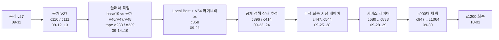
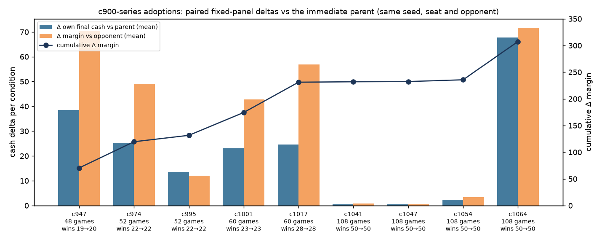
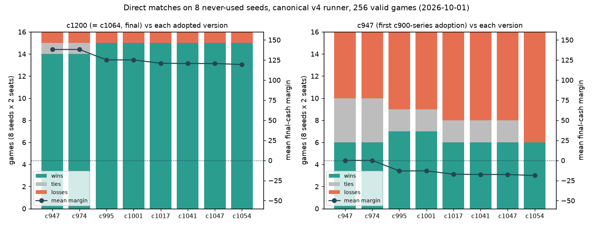
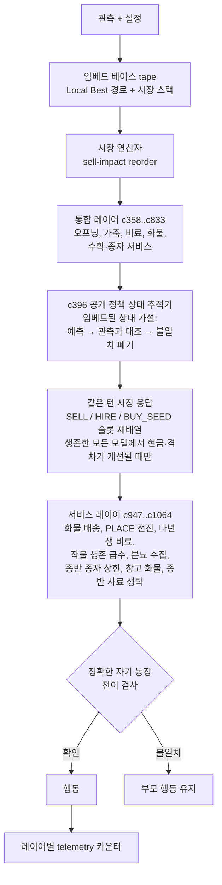
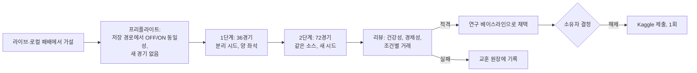
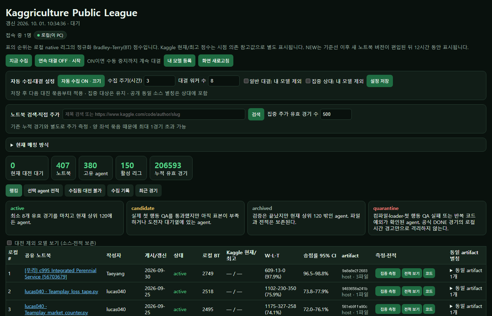
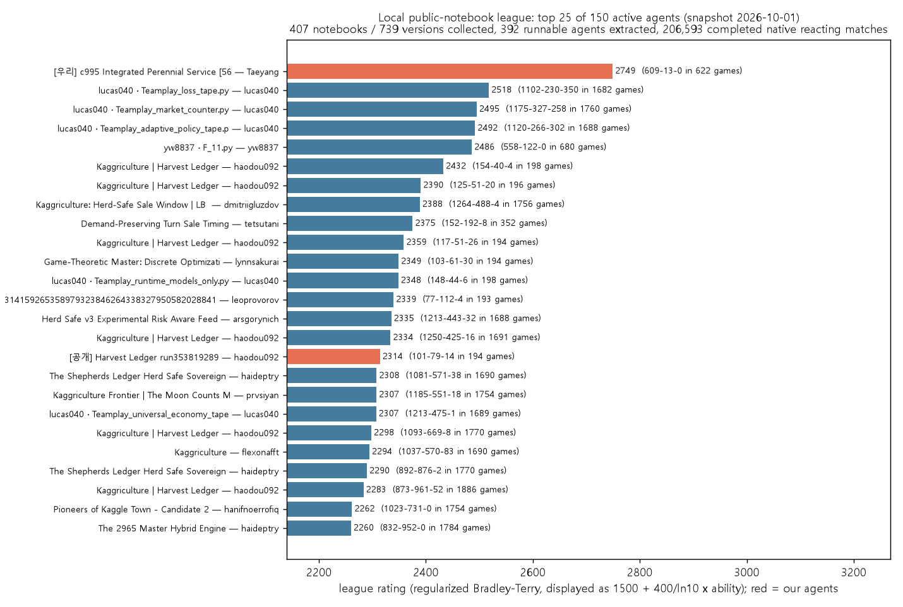
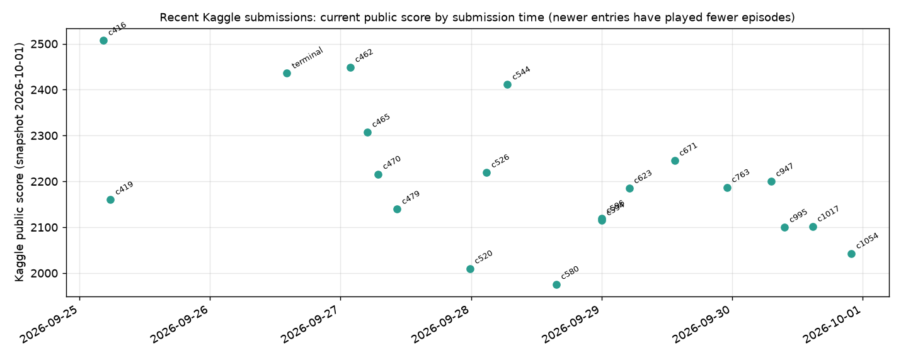

# Kaggriculture Strategy Meta

Kaggle **Kaggriculture** 시뮬레이션 대회(2인 농장 경제, 720턴, kaggle-environments 1.32.7)
연구 저장소입니다. 전략 지문 데이터셋 작업, 최종 제출본 `c1200`을 만든 에이전트 연구,
그리고 모든 변경을 걸러낸 검증 인프라가 들어 있습니다.

[English README](README.md) · [문서 색인](docs/INDEX.md) · [작업 로그](HANDOFF.md)

| | |
|---|---|
| 최종 에이전트 | [`agent/c1200_final.py`](agent/c1200_final.py) (검증된 `c1064`와 바이트 동일) |
| 최종 계보의 Kaggle 제출 | `c1054` (2026-09-30, id 56719658), `c1200` (2026-10-01, id 56722176) |
| 연구 기간 | 2026-09-11 → 2026-10-01, 후보 id 약 1,100개(`c001`–`c1068`, `o001`–`o403`, 플래너 `p`, `g`, `r` 계열), Kaggle 제출 20회 이상 |
| 결과 | _대회 최종 평가 후 추가 예정_ |
| 리뷰 | _추가 예정_ |

## 목차

1. [이 저장소는 무엇인가](#1-이-저장소는-무엇인가)
2. [무엇을 베이스로 했나](#2-무엇을-베이스로-했나)
3. [어떻게 발전했나](#3-어떻게-발전했나)
4. [최종 에이전트 아키텍처](#4-최종-에이전트-아키텍처)
5. [검증 방법론](#5-검증-방법론)
6. [결과](#6-결과)
7. [리뷰](#7-리뷰)
8. [저장소 구조](#8-저장소-구조)
9. [재현](#9-재현)
10. [데이터·권리·라이선스](#10-데이터권리라이선스)

## 1. 이 저장소는 무엇인가

두 개의 작업 흐름이 한 저장소를 공유합니다.

- **전략 메타 데이터셋 (2026-09-11).** Kaggle이 매일 공개하는 CC0 에피소드 데이터를
  좌석 단위 48컬럼 전략 지문 테이블("current meta V1")로 바꾸는 한정적·재현 가능한
  파이프라인(`src/kaggriculture_meta/`). 스키마, 데이터 사전, 품질 게이트 포함.
  `docs/v1-schema.md`, `docs/data-dictionary.md` 참고.
- **에이전트 연구와 검증 (2026-09-12 → 2026-10-01).** 정확한 공개 베이스라인 위에
  작고 감사 가능한 변경을 하나씩 얹은 수백 개의 후보 에이전트를, 건강성·통계 규칙이
  고정된 공용 검증 러너로 평가했습니다. 모든 후보·설정·보고서를 보존하며 실패도
  채택과 같은 수준으로 기록했습니다.

전 과정의 원칙은 **변경 전에 증거**입니다. 후보와 검증 규칙은 경기 전에 고정하고,
후보와 부모는 같은 월드를 플레이하며, 채택과 Kaggle 제출은 항상 소유자의 명시적
결정이고 자동화하지 않았습니다.

## 2. 무엇을 베이스로 했나

이 저장소의 모든 대회 에이전트는 Apache-2.0으로 공개된 Kaggle 노트북에서 나왔습니다.
각 공개 소스는 파생본을 만들기 전에 SHA-256과 함께 바이트 단위로 보존했고, 모든
파생본은 상위 라이선스와 출처 표기를 자기 소스 안에 그대로 품고 있습니다.

| 공개 소스 (저자) | 이 저장소에서의 역할 |
|---|---|
| v27 "Midgame Meta Reset" (Kaito Fukami; 경로 골격은 Ezzzzzekki 출처) | 첫 공개 챔피언, `agent/public_v27_kaito.py` |
| V37 "More Yield, Smarter Labor" (Ahmed Berat Özer) | 두 번째 베이스라인, `agent/public_v37_more_yield.py`; 첫 제출 `c110`/`c111`의 부모 |
| "Master Engine V2" (Guru Prasaath S) | 정확한 공개 반응형 상대, `agent/public_master_engine_v2.py` |
| "Local Best" (공개 v9 계보에 market portfolio, frontload, adaptive market, sale-advance, sell-impact 연산자를 포장) | 최종 계보의 베이스 tape와 시장 스택(`c358`부터 임베드) |
| V54 "Productive Wheat and Patient" (Ahmed Berat Özer) + shop-aware herd 레이어 (Seyit Kaan Gunes) | 오프닝과 가축 대체 레이어(`c358`, `c369`) |
| "More Wheat, Smarter Sales" (Dmitrii Gluzdov) | 예측 궤적(`c387`) |
| "Terminal Recovery v4" (xox787) | 종반 회복 레이어(`c447`) |
| Harvey Zhang V15 Market Stack, Dmitrii Gluzdov Herd-Safe Sale Window, statma ca20, Master350, Harvest V87, hanaro EXP-173 등 | 상태 추적기(`c396` 계열)의 **상대 정책 가설**로만 임베드 |
| Thomas Tschinkel router v5, 공개 V46/V47/V48 | 플래너(o-시리즈) 작업의 참조 상대·비교 정책 |

비공개 리더보드 소스는 사용하지 않았습니다. 전체 출처 목록은 [NOTICE](NOTICE)와
각 임베딩 소스 파일 안에 있습니다.

## 3. 어떻게 발전했나



**9월 11일 · 데이터셋 파일럿.** 한정 current-meta V1(CC0 168 에피소드, 336 좌석),
스키마와 품질 게이트; 첫 벤치마크 하네스와 권리 확인된 베이스라인.
참고: `docs/gate-2026-09-11.md`, `docs/v1-schema.md`.

**9월 12–13일 · 공개 베이스라인.** v27, 이어서 V37을 정확한 챔피언으로 채택.
Kaggle 공식 로더, 소스·엔진 지문, 분리 시드 단계를 갖춘 시뮬레이션 리그 재구축.
`c110`/`c111`이 첫 라이브 제출(c111은 56경기 후 2350.6).
참고: `docs/public-v37-adoption.md`, `docs/simulation-league.md`.

**9월 14–19일 · 플래너(o-시리즈).** 플래너(`base19`)를 만들어 공개 V46/V47/V48,
자체 tape와 12상대 패널·상호 대전으로 비교. 로컬 패널은 라이브 상위권 위에서
포화하고, 라이브 강자는 tape 라우터이며, 1위와의 격차는 노동이 아니라 herd
규모라는 것을 확인. 참고: `reports/o-index-2026-09-19.ko.md`,
`reports/o-policy-compare-results-2026-09-19.ko.md`.

**9월 21일 · 로컬 공개 노트북 리그.** 모든 공개 Kaggriculture 노트북을 수집해
실행 가능한 에이전트를 추출하고 로컬 native 반응형 경기로 비교하는 서비스를
구축. 웹 UI, 평점, 팀 게이트웨이 포함. 상세와 스크린샷은
[5절](#로컬-공개-노트북-리그). 참고: `docs/public-league.ko.md`.

**9월 21–24일 · 새 계보.** `c358`이 Local Best 시장 스택과 V54 오프닝을 결합;
`c396`이 공개 정책 상태 추적과 같은 턴 자금 확인 시장 응답을 추가; `c414` 표적
상대 수용; 검증 v3가 공식 overage 시간 계약 채택.
참고: `reports/c358-localbest-hybrid-2026-09-21.ko.md`,
`reports/c414-targeted-opponents-2026-09-24.ko.md`.

**9월 25–28일 · 시장·회복 레이어.** 정확 큐 탐색(`c461`), 종반 회복(`c447`),
양모·비료 달력(`c516`–`c544`); c544 라이브 2411. 경로 교체, 판매 창, 추가 토마토
열(`c588`–`c596`)은 전부 채택 실패. 참고: `docs/experiment-history-and-lessons.ko.md`.

**9월 28–29일 · 서비스 레이어.** 관측 기반 정리·완료 서비스(`c580`, `c612`,
`c671`, `c763`, `c776`, `c785`, `c833`). 참고: `reports/`의 후보 보고서.

**9월 30일 · c900 시리즈.** `c947` → `c1064` 아홉 번의 작은 게이트 채택, 각각
정확한 자기 농장 전이 검사로 확인; 소유자 정책이 승패 전환 없는 소폭 개선도
인정. 참고: `HANDOFF.md`와 아래 차트.

**10월 1일 · 최종.** `c1200` = `c1064` 패키징·제출; 새 시드로 c900대 전 버전 직접
대결(256경기). 참고: `configs/validation/c1200_chain_ladder_v4.json`.

### c900 시리즈 진행

각 채택은 직전 부모와 같은 월드(같은 시드·좌석·상대)에서 측정했습니다. 막대는
조건당 최종 현금 차이의 평균, 선은 격차 개선의 누적입니다.



이어서 한 번도 쓰지 않은 시드 8개에서 버전 간 직접 대결로 체인을 재확인했습니다.
`c1200`은 모든 선조 버전을 이겼고(128경기 118승 8패 2무), 이득의 거의 전부가
마지막 레이어 `c1064`에서 나왔습니다.



부정적 결과도 같은 비중으로 중요했습니다. 판매 보류, 추가 고용, tape→플래너
하이브리드, 시장 타이밍 단독 변경, 소 한 마리 추가, 가격 게이트 전환, 경로 교체,
판매 창은 모두 시도했고 증거와 함께 기각했습니다. 원장은
`docs/experiment-history-and-lessons.ko.md`입니다.

## 4. 최종 에이전트 아키텍처

`c1200`은 표준 라이브러리만 쓰는 단일 Python 파일(약 21 MB)입니다. 임베드된 공개
베이스 위에 독립적으로 검증된 레이어를 쌓은 구조로, 각 레이어는 이전 `agent`
호출을 감싸고, 환경이 표준인지 확인하고, 부모의 행동을 계산한 뒤, 좁고 관측 가능한
조건이 성립하고 정확한 엔진 프록시 시뮬레이션이 의도한 자기 농장 전이를 확인할
때만 행동을 바꿉니다.



모든 레이어가 지키는 설계 규칙:

- 자기 관측과 공개 설정만 사용합니다. 숨은 시드, 리플레이, 상대 비공개 상태,
  상대 신원은 쓰지 않습니다.
- 비표준 설정(보드, 하루 턴 수, 에피소드 길이, 창고 용량)에서는 레이어가 꺼지고
  부모로 넘어갑니다.
- 레이어의 변경은 엔진 프록시가 정확한 상태 전이로 재현해야 내보내며, 아니면 부모
  행동이 유지됩니다.
- 예외는 숨기지 않고 세어서 다시 던져 검증 러너가 보게 합니다. 최종 패키지는 검증
  108경기, 정책 호출 38,826회에서 오류 0이었습니다.
- 상위 라이선스와 출처 블록은 파일 안에 유지됩니다.

시간: Kaggle 계약은 스텝당 1초에 공유 overage 예산이 더해집니다. 무거운 스텝은
첫 스텝(임베드 소스 디코딩)으로, 8워커 병렬 검증에서 최대 13.6초, p99 스텝 시간은
0.011초였습니다.

## 5. 검증 방법론



- **짝 비교 고정 패널.** 후보와 부모가 같은 시드·좌석·상대로 플레이하며, 증거 단위는
  조건별 자기 현금·격차·승점 차이입니다. 같은 시드의 반복 경기는 독립 표본으로 세지
  않습니다.
- **단계별 분리 시드.** screen·confirm·final 단계는 실행 전에 고정한 서로 겹치지 않는
  정수 시드를 쓰고, 튜닝에 쓴 시드는 최종 검사에서 제외합니다. 블라인드 시드는
  소유자용으로 남겨두었습니다.
- **건강성 게이트.** 720상태, 719정책 호출, 양 좌석 `DONE`, `ERROR`/`INVALID`/`TIMEOUT`
  없음, 소스·엔진 해시 일치, 공식 actTimeout과 잔여 overage 회계(러너 v3/v4)를
  만족한 경기만 집계합니다. 실패 경기는 덮어쓰지 않고 보존합니다.
- **통계.** 승점·격차 차이를 시드 묶음으로 군집화하고 상대 계열별 동일 가중을 적용,
  부트스트랩 신뢰구간과 단계 alpha에 대한 Bonferroni 보정을 씁니다. 도구의
  `promotion`은 항상 `false`입니다.
- **러너 계보.** `validation_v1`(경기별 새 서브프로세스, 전역 실행 잠금, 해시 검증
  캐시) → `v2`(반응형 상대) → `v3`(공식 overage 계약) → `v4`(스텝별 시간, 콜백/리플레이
  해시, 농장 전체 회계). 설정은 `configs/validation/`에 있고
  `docs/reusable-validation.ko.md`를 참고합니다.
- **상대 풀.** 고정 과거 베이스라인, 다양한 공개 강자, 가설별 약점 공격자, 합법적으로
  확보한 상위권 코드·리플레이(`docs/agent-validation-protocol.ko.md`); 아래 로컬
  리그가 공개 풀을 공급하고 평가했습니다.

### 로컬 공개 노트북 리그

후보가 손으로 고른 패널이 아니라 실제 라이브 인구를 상대로 어떤지 알기 위해
공개 노트북을 중심으로 로컬 리그를 구축했습니다(`tools/public_league.py`,
`src/kaggriculture_meta/public_league.py`, `configs/public_league_v2.json`).

- **수집.** Kaggle API로 모든 공개 Kaggriculture 노트북을 점수순·최신순·검색으로
  나열하고 새 버전을 받아, `main.py`, tar 멤버, `%%writefile` 셀, 직접 에이전트
  셀, 압축 파일맵에서 실행 가능한 에이전트를 추출합니다. 다중 파일 산출물은
  정렬된 멤버 경로와 바이트로 해시합니다.
- **입장 QA.** 컴파일, Kaggle last-callable 로더 적재, 공식 관측으로 실제 첫 행동
  호출까지 통과한 에이전트만 리그에 들어갑니다. 실패는 오류와 함께 격리하고
  삭제하지 않습니다.
- **경기.** 고정 엔진에서 native 반응형 경기, 양 좌석, 8워커, 엔진·규칙·러너·
  산출물·시드·좌석으로 키를 잡은 SQLite 캐시. 신규 에이전트는 catch-up 매칭을
  받고, 상위 120–150개가 `active`, 나머지는 전적을 보존한 `archived`가 됩니다.
- **평점.** 정규화 Bradley–Terry를 1500 + 400/ln10 스케일로 표시하고 Wilson 95%
  구간을 함께 둡니다. 우리 후보도 공개 풀과 같이 등록되므로, 라이브 인구 상대
  500경기 "집중 측정"이 약 한 시간에 끝납니다.
- **운영.** 로컬 웹 UI(8791 포트)에서 수동·예약 수집, 연속 대결, 에이전트별 전적과
  소스 보기를 제공하고, 로그인 게이트웨이와 Cloudflare 임시 터널로 팀원이 읽기
  접근했습니다. 2026-10-01 스냅샷: 노트북 407개, 버전 739개, 실행 가능 에이전트
  380개, 활성 150개, 완료 경기 206,593회.





## 6. 결과

_대회 최종 평가 후 추가 예정._

## 7. 리뷰

_추가 예정._

## 8. 저장소 구조

```text
agent/                 후보 에이전트; public_*.py는 정확한 공개 베이스라인,
                       c<id>_*.py 연구 후보, overlays/ 소형 소스 오버레이,
                       플래너·탐색 작업의 o/p/g/r 계열, c1200_final.py 최종 제출 소스
src/kaggriculture_meta 데이터셋 파이프라인(pilot, current V1, 스키마, insights),
                       시뮬레이션 리그 러너, 후보 빌드와 패키징
tools/                 검증 러너 v1-v4, 통계, 공개 리그 서버와 게이트웨이,
                       빌더와 감사(PowerShell 진입점)
o_tools/               플래너 시기의 arena, 리플레이, 계보, 라이브 에피소드 도구
configs/               검증 설정, 리그 계획, 공개 리그 로스터
reports/               약 300개의 날짜별 증거 보고서(대부분 한국어), 후보당 1개
docs/                  프로세스·프로토콜·인프라 문서(docs/INDEX.md 참고)
tests/                 러너, 패키징, import 단위 테스트
HANDOFF.md             공유 작업 로그; START HERE 블록이 현재 상태
AGENTS.md, CLAUDE.md   이 저장소에서 작업한 코딩 에이전트의 운영 규칙
```

로컬 비커밋 자료(`state/`, 리플레이, 리그 DB, 빌드 산출물)는 `.gitignore`로
제외했습니다. 커밋된 소스·설정·보고서로 재생성할 수 있습니다.

## 9. 재현

환경: Windows 10, Python 3.12.6, `kaggle-environments==1.32.7`
(`agent/requirements.txt`와 `configs/validation/*.json`이 엔진 파일 해시를 고정).

```bash
python -m venv .venv && .venv/Scripts/pip install -r agent/requirements.txt
```

단위 테스트:

```bash
.venv/Scripts/python.exe -m unittest discover -s tests -v
```

최종 직접 대결 재실행(256경기, 8워커, 약 17분):

```powershell
& .\tools\run-validation-v4.ps1 -Config configs\validation\c1200_chain_ladder_v4.json -Out state\agent_experiments\ladder_rerun -Stage screen -Action Run
```

Kaggle 공식 로더로 최종 에이전트를 올려 한 판 플레이:

```python
from kaggle_environments import make
env = make("kaggriculture", debug=True)
env.run(["agent/c1200_final.py", "agent/c1200_final.py"])
print([s.status for s in env.state], [s.reward for s in env.state])
```

제출 패키지는 같은 파일을 `main.py`로 넣고 `LICENSE.txt`, `NOTICE.txt`를 더한
tar.gz입니다(`src/kaggriculture_meta/package_agent.py`).

## 10. 데이터·권리·라이선스

- 대회 데이터는 Kaggriculture 규칙 안에서만 사용했습니다. 대회 파일 원본, 원시
  리플레이, 공개 리그 DB는 재배포하지 않으며, 데이터셋 작업의 공개 소스 경로는
  Kaggle이 별도 CC0로 공개한 일별 에피소드 데이터셋입니다.
- 공개 노트북 코드는 Apache-2.0 라이선스와 출처 표기를 그대로 품고 임베드됩니다.
  공개 경로나 생산 컨트롤러를 이 프로젝트의 독창적 작업으로 읽지 마십시오. 이
  프로젝트의 기여는 통합 레이어, 검증 인프라, 연구 기록입니다.
- 이 저장소는 [Apache License 2.0](LICENSE)으로 공개하며 출처는 [NOTICE](NOTICE)에
  있습니다.

`docs/images/`의 그림은 커밋된 검증 결과와 소유자 Kaggle 제출 목록의 읽기 전용
스냅샷에서 생성했습니다.


