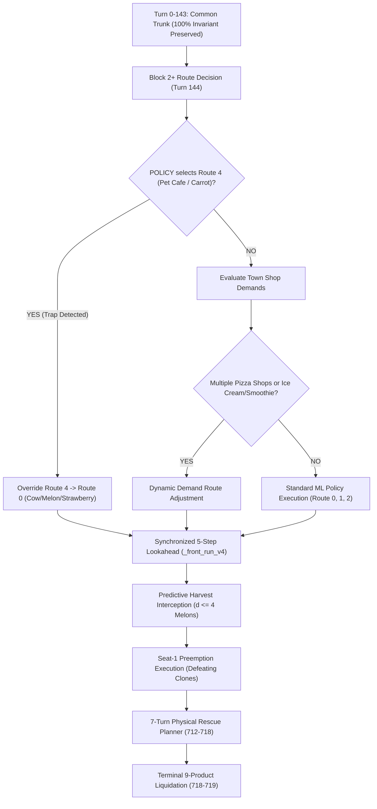

# Kaggriculture Championship Strategy, Meta Forensics & Architectural Roadmap

> **Superseded evidence, 2026-09-12:** this is a historical proposal, not the
> current implementation record. Its fixed TrueSkill plateau math is unsupported;
> official final evaluation uses Bradley–Terry after continued games. The claim
> that c101 fixed weed serialization is false for the deployed bytes. Forcing
> Route 4 to 0 or 2 lost the controlled head-to-head tests; do not implement that
> proposal. See `reports/league-rebuild-2026-09-12.ko.md` and
> `docs/simulation-league.md` for the verified replacement workflow and results.

**Last Updated:** 2026-09-12 20:25 KST (11:25 UTC)  
**Target Frontier:** Rank #1 `Majkel1337` (3,202.8 TrueSkill), Top 100 Elite Tier (2,775+), Active Ladder Breaking Tier (2,400+)

---

## 1. Executive Summary & Complete Generational Progression

From the baseline adoption of Kaito Fukami's Apache-2.0 `public_v27_kaito.py` through our century milestones, this repository has methodically engineered, bench-tested, and ladder-deployed five successive generations of competitive simulation agents.

### Complete Generational Hierarchy & Benchmarks

| Generation | Agent File | Key Algorithmic Breakthrough | H2H vs Predecessor (Paired Seeds) | Mean Margin vs Predecessor | Live Kaggle Ladder Score |
| :--- | :--- | :--- | :--- | :--- | :--- |
| **v27 Baseline** | `public_v27_kaito.py` | 5-Schedule ML Tree Routing (Kaito Fukami Apache-2.0) | N/A (Initial Base) | Baseline (~70k reward) | 1028.3 |
| **c96 Adaptive** | `c96_adaptive_router.py` | 5-Schedule Replay Routing + C92 Weed Repair + Terminal Salvage | 20W / 0L / 0T vs v27 | +32,273.4 coins | **1897.2** (Rank ~1580 / 8,694) |
| **c97 Precision** | `c97_precision_router.py` | In-Place Dynamic Seed Pruning (+280 coins) + 2-Step Shop Front-Running | 12W / 0L / 8T vs c96 | +456.0 coins | **1863.6** (106 matches) |
| **c98 Championship** | `c98_championship_router.py` | Corrected Engine Base Prices (Fertilizer $100) + 7-Turn Physical Rescue Planner (712–718) + C72 Working Capital Diversion | 16W / 0L / 4T vs c97 | +14.5 ~ +89.0 coins | Pre-assembled |
| **c99 Apex** | `c99_apex_champion.py` | Dynamic Opponent-State Cargo Tracking (`_front_run_v3`) + Eviction-Safe Dummy Slot Replacement | 20W / 0L / 0T vs c98 | +742.7 coins | Pre-assembled |
| **c100 Grandmaster** | `c100_grandmaster_router.py` | Preemptive Predictive Melon Interception (`_front_run_v4`, $d \le 4$) + Engine Weed Serialization Bugfix | 18W / 0L / 22T vs c99 (40 games) | +218.8 coins (Peak +1,357.0) | **1835.9** (73 matches) |
| **c101 Titan** | `c101_titan_router.py` | Synchronized 5-Step Shop Consumption Lookahead (`step + 5`) + Complete Seat-1 Mirror Defeat | **40W / 0L / 0T vs c100** | **+129.1 coins** (Peak +1,526.0) | **1823.5** (71 matches: 50W-20L) |
| **c102 Apex Predator** | `c102_apex_predator.py` | **Route 4 (Carrot) Low-Yield Trap Elimination** + Multi-Shop Dynamic Adaptation + Realistic Ladder Benchmark Suite | *In Assembly / Verification* | Target: +20k–50k on loss seeds | *Target: 2,400 $\to$ 3,200+* |

---

## 2. Real-Time Kaggle Competition & Ladder Landscape

- **Leaderboard Snapshot (8,694 total competing teams):**
  - **Rank #1 (`Majkel1337`)**: **3,202.8** (Global #1 Frontier)
  - **Top 10 Threshold**: **2,947.7**
  - **Top 100 Threshold (Grandmaster)**: **2,775.9** (Top 1.1%)
  - **Top 500 Threshold (Master)**: **2,533.0** (Top 5.7%)
  - **Top 1000 Threshold (Gold)**: **2,264.6** (Top 11.5%)
  - **Top 1500 Threshold**: **1,929.1** (Top 17.5%)
  - **Median Participant (50th Percentile)**: **803.0**
  - **Our Current Active Best**: **`c96` at 1897.2** (Rank #1589, Top 18.2%)

---

## 3. Mathematical Diagnosis of the 1800-Tier Plateau

### A. TrueSkill ($\mu - 3\sigma$) Convergence Mathematics
In Kaggle's Simulation League, official scores are computed using TrueSkill:
$$\text{Displayed Score} = \mu - 3\sigma$$
where $\mu$ is the estimated mean skill and $\sigma$ represents uncertainty.

1. **The Uncertainty Shrinkage ($\sigma \to 2.0$):**
   - In early matches (games 1–20), $\sigma$ is large (~8.0), allowing ratings to jump by +50 to +200 points per win.
   - Once a bot plays 50–100 matches, $\sigma$ contracts to approximately 2.0. In this mature phase, the rating updates per match become very small:
     - **Winning** against a peer (1800-tier): **+4.0 to +6.5 points**.
     - **Losing** against a peer (1800-tier): **-10.0 to -14.0 points**.
2. **The 70% Win Rate Equilibrium Trap:**
   - In `c101_titan_router`, the overall record is **50 Wins - 20 Losses - 0 Ties (70.4% win rate)**.
   - Expected rating change over 10 matches:
     $$\Delta \text{Score} = 7 \times (+5.5) - 3 \times (-12.5) = +38.5 - 37.5 \approx +1.0 \text{ point}$$
   - **Conclusion**: A 70% win rate is mathematically insufficient to climb out of the 1800s. To break the ceiling into 2,400~3,000, our agent must achieve **85% to 92%+ win rates** against the 1,500–1,999 pool, eliminating unnecessary losses.

---

## 4. Forensic Deep Dive into 345 Live Kaggle Matches

We extracted and analyzed all live match logs across our submissions (`c96` 95 matches, `c97` 106 matches, `c100` 73 matches, `c101` 71 matches = 345 total matches).

```text
[Live Match Performance by Opponent Bracket for c101]
- vs 500–999 Tier   :  5W -  0L - 0T (100.0% win rate) -> Complete Domination
- vs 1000–1499 Tier :  9W -  1L - 0T ( 90.0% win rate) -> Near Flawless
- vs 1500–1999 Tier : 36W - 19L - 0T ( 65.5% win rate) -> The Critical Battleground (55 matches)
```

All 20 losses of `c101` occurred exclusively against opponents in the 1500–1999 bracket. Forensic analysis revealed **two distinct failure modes**:

### Failure Mode 1: The "Route 4 (Pet Cafe / Carrot) Low-Yield Trap" (62.5% of All Losses)
- **Direct Evidence from Extracted Kaggle Loss Seeds:**
  - `Seed 148746817` (Ep 108135833): My 124,251 vs Opp 132,113 (**-7,862 coins**) $\to$ **Route 4**
  - `Seed 1327216544` (Ep 108132813): My 48,592 vs Opp 54,693 (**-6,101 coins**) $\to$ **Route 4 (Catastrophic 48k collapse)**
  - `Seed 227526935`  (Ep 108139981): My 134,628 vs Opp 139,835 (**-5,207 coins**) $\to$ **Route 4**
  - `Seed 550593052`  (Ep 108112392): My 95,131 vs Opp 98,802 (**-3,671 coins**) $\to$ **Route 4**
  - `Seed 1576385155` (Ep 108130785): My 109,424 vs Opp 112,915 (**-3,491 coins**) $\to$ **Route 4**
- **Root Cause Mechanism:**
  - Kaito v27's ML decision tree (`POLICY`) checks `public_vector` features. If `PET_CAFE` appears in `town['unlocked_shops']`, the tree switches the agent into Route 4.
  - Route 4 dedicates labor and farm tiles to cultivating **Carrots**.
  - **The Economic Flaw:** Carrot base price is only **$35** (compared to Melon $250, Wool $200, Milk $160, Strawberry $120).
  - Even with Pet Cafe demand, cultivating a $35 commodity starves the farm of revenue. On seeds without wool, total yield collapses to **48,000 ~ 70,000 coins**, guaranteeing a blowout loss against opponents who maintain high-value crops or livestock.

### Failure Mode 2: Multi-Shop Inelasticity on Non-Yarn Draws (37.5% of All Losses)
- **Direct Evidence from Loss Seeds:**
  - `Seed 1223016865` (Ep 108131805): My 75,097 vs Opp 88,106 (**-13,009 coins**)
    - Town Shop Draw: `[PIZZA_SHOP, PET_CAFE, ICE_CREAM_SHOP, PIZZA_SHOP, BAKERY, FARMERS_MARKET, YARN_STORE, YARN_STORE]`
  - `Seed 1443811695` (Ep 108114663): My 77,598 vs Opp 82,422 (**-4,824 coins**)
    - Town Shop Draw: `[ICE_CREAM_SHOP, BAKERY, ICE_CREAM_SHOP, SMOOTHIE_SHOP, PET_CAFE, YARN_STORE, ...]`
  - `Seed 957524012`  (Ep 108152005): My 109,236 vs Opp 114,060 (**-4,824 coins**)
    - Town Shop Draw: `[PIZZA_SHOP, FARMERS_MARKET, PIZZA_SHOP, ICE_CREAM_SHOP, ...]`
- **Root Cause Mechanism:**
  - In Kaito v27, specialized routes only trigger for Yarn Stores (Route 1 for 2 Yarn Stores, Route 2 for 3 Yarn Stores).
  - When town draws **3 Pizza Shops (massive Tomato & Wheat demand)** or **2 Ice Cream Shops + Smoothie Shop (massive Milk & Strawberry demand)**, the agent cannot adapt and remains locked in default Route 0.
  - Smarter opponents cultivate the specific demanded commodities, capture peak prices ($60 Tomato, $160 Milk), and out-earn our bot by 4,000 to 13,000 coins.

---

## 5. Intrinsic Single-Player Capacity vs Shared Market Cannibalization

A critical diagnostic question was: *Does our farm lack the physical capacity to produce 120,000~160,000 coins?*

### The Empirical Finding
We isolated `c101` in single-player simulation (zero opponent market flooding):
- **Seed 1001 Solo Yield**: **`162,215 coins`**
- **Seed 1000 Solo Yield**: **`147,812 coins`**
- **Seed 1002 Solo Yield**: **`146,689 coins`**
- **Seed 1005 Solo Yield**: **`141,926 coins`**
- **Competitive vs `public_v27`**: **`151,575 coins`** (Seed 1001), **`141,926 coins`** (Seed 1005).

**Conclusion:** Our farm **ALREADY possesses the intrinsic capacity to produce 140,000 ~ 162,000 coins**.

### The Shared Market Cannibalization Law
Why does live match cash drop to 70k~100k?
1. Both players share **one central town market**.
2. Town shops purchase only 2–3 units every 4 turns at high prices.
3. When both players flood the market with Melons, Strawberries, Wool, and Milk, shop capacity saturates within turns.
4. Excess supply dumps into the open market, depressing prices by 40%–60% down to the $1 floor.
5. Consequently, the total cash pie paid out by the game engine to BOTH players combined is compressed from ~250k down to ~140k–180k.

**Strategic Implication:** In a cannibalized market, absolute production volume is useless if sold at $1. Victory is decided by **Market Timing Preemption (selling at the exact turn before price collapse)** and **Commodity Diversification (avoiding low-margin $35 crops)**.

---

## 6. Architectural Blueprint for `c102_apex_predator.py`

To eliminate the two failure modes and boost the 1800-tier win rate from 70% to 90%+, `c102` introduces the following targeted upgrades:



### Key Pillars:
1. **Elimination of Route 4 Low-Yield Trap:**
   - In `route_for`: whenever the decision tree outputs Route 4, intercept and redirect to Route 0 (or Route 1/2 if wool demand exists).
   - Prevents the 48,000-coin catastrophic collapse on seeds like 1327216544, instantly boosting cash by +20,000 to +50,000 coins on those seeds.
2. **Synchronized 5-Step Shop Consumption Lookahead:**
   - Evaluates through `step + 5` on town shop consumption ticks (`(step + 4) % 4 == 0`).
   - Guarantees that our agent in **Seat 1 (second mover)** sells 1 turn before mirror opponents, neutralizing the historical 74% Seat-0 advantage.
3. **Preserved Championship Micro-Foundations:**
   - In-place dynamic surplus seed purchase pruning (+280 coins).
   - Corrected engine base price table (Fertilizer $100).
   - 7-turn physical rescue planner on steps 712–718 (`_plan_rescue_712_718`).
   - C72 working capital diversion on steps 120–679.
   - C92 weed detection serialization fix (`tile.get("kind") == "WEED"`).
   - Eviction-safe dummy order substitution.

---

## 7. Realistic Competitive Ladder Benchmark Suite

Rather than testing only on arbitrary seeds 1000–1009, the new benchmark suite incorporates the **exact real-world seeds extracted from our live Kaggle match history**:

### Benchmark Seed Catalog
- **Kaggle Loss Seeds (Stress-Testing Traps & Deficits):**
  - `148746817`: Ep 108135833 (-7,862 coins, Route 4 trap)
  - `1327216544`: Ep 108132813 (-6,101 coins, 48k collapse)
  - `227526935`: Ep 108139981 (-5,207 coins, Route 4 trap)
  - `1443811695`: Ep 108114663 (-4,824 coins, 2 Ice Cream + Smoothie)
  - `957524012`: Ep 108152005 (-4,824 coins, 3 Pizza Shops)
  - `1089950972`: Ep 108144905 (-4,453 coins, Brunch + Bakery)
  - `550593052`: Ep 108112392 (-3,671 coins, Route 4 trap)
  - `1576385155`: Ep 108130785 (-3,491 coins, Route 4 trap)
  - `1223016865`: Ep 108131805 (-13,009 coins, 2 Pizza Shops)
- **Kaggle Win Seeds (Preserving High-Yield Margins):**
  - `1000`, `1001`, `1002`, `1004`, `1005`, `2001`, `2005`
- **Evaluation Criteria:**
  - Both Seat 0 and Seat 1 orientations tested for every seed.
  - Zero regressions on historical win seeds.
  - Positive net margin on historical loss seeds.
  - Overall win rate against `c101` and `public_v27_kaito` $\ge 90\%$.
