# Joint Trajectory Optimization and Resource Allocation in UAV-MEC Systems: A Lyapunov-Assisted DRL Approach

Ying Chen , Senior Member, IEEE, Yaozong Yang , Yuan Wu , Senior Member, IEEE, Jiwei Huang , Senior Member, IEEE, and Lian Zhao , Fellow, IEEE

Abstract—Mobile Edge Computing (MEC), as a highly promising technology, effectively processes computation-intensive tasks by offloading them to edge servers. Utilizing the advantages of Unmanned Aerial Vehicles (UAVs) in deployment flexibility and broad coverage, UAV-assisted edge computing can significantly enhance system efficiency. This paper studies a scenario where a UAV-MEC system serves multiple Mobile Users (MUs) with random task arrivals and movements. We minimize the energy consumption of MUs by jointly optimizing UAV trajectory and resource allocation for MUs subjected to the UAV energy limit. The problem is formulated as a multi-stage Mixed-Integer Nonlinear Programming (MINLP) problem. To address this, we propose an algorithm called JTORA integrated Deep Reinforcement Learning (DRL) and Lyapunov optimization techniques. Specifically, we initially transform the multi-stage MINLP problem into a deterministic optimization problem utilizing Lyapunov techniques and decompose the original problem into two sub-problems in parallel. Through DRL, we solve the first sub-problem of trajectory and communication resources optimization. For the second sub-problem involving computing resource allocation, convex optimization is employed to get the optimal solution. Theoretical analysis and experimental results demonstrate that the JTORA algorithm can effectively reduce the energy consumption of MUs while ensuring UAV endurance.

Index Terms—Mobile edge computing (MEC), unmanned aerial vehicle (UAV), resource allocation, trajectory optimization, deep reinforcement learning (DRL).

## 图像索引

本索引由 `raw/scripts/establish_image_links.py` 根据注释导出的图片标注解析生成。图片目录总览见 [chen2025JointTrajectoryOptimization/README.md](../assets/chen2025JointTrajectoryOptimization/README.md#asset-index)。

| 图号/表号 | 论文定位 | 资源文件 | 说明 |
| --- | --- | --- | --- |
| [Fig. 1](#fig-1) | p. 3 | [HH48XSLL.png](../assets/chen2025JointTrajectoryOptimization/HH48XSLL.png) | System model with I MUs and a UAV equipped with an edge server. |
| [Fig. 2](#fig-2) | p. 7 | [KUUWK282.png](../assets/chen2025JointTrajectoryOptimization/KUUWK282.png) | The main process of proposed JTORA algorithm. |
| [Table I](#table-1) | p. 10 | [UJYKDDX2.png](../assets/chen2025JointTrajectoryOptimization/UJYKDDX2.png) | Main experiment settings |
| [Fig. 3](#fig-3) | p. 10 | [YTXDEL8C.png](../assets/chen2025JointTrajectoryOptimization/YTXDEL8C.png) | The energy consumption and queue length with the different values of V. |
| [Fig. 4](#fig-4) | p. 11 | [696PWXM8.png](../assets/chen2025JointTrajectoryOptimization/696PWXM8.png) | Trajectories of UAVs and MUs with different initial positions of UAVs. |
| [Fig. 5](#fig-5) | p. 11 | [3P3ZWAI7.png](../assets/chen2025JointTrajectoryOptimization/3P3ZWAI7.png) | Trajectories of UAVs and MUs with random movement of MUs. |
| [Fig. 6](#fig-6) | p. 11 | [GGBNYURF.png](../assets/chen2025JointTrajectoryOptimization/GGBNYURF.png) | The smoothed reward with the different buffer size. |
| [Fig. 7](#fig-7) | p. 11 | [PZTMPUDG.png](../assets/chen2025JointTrajectoryOptimization/PZTMPUDG.png) | The smoothed reward with the different batch size. |
| [Fig. 8](#fig-8) | p. 12 | [B7EQFD96.png](../assets/chen2025JointTrajectoryOptimization/B7EQFD96.png) | The energy consumption of MUs with different rate. |
| [Fig. 9](#fig-9) | p. 12 | [ZRULFC3K.png](../assets/chen2025JointTrajectoryOptimization/ZRULFC3K.png) | The queue length of MUs with different rate. |
| [Fig. 10](#fig-10) | p. 12 | [NCDXZ23N.png](../assets/chen2025JointTrajectoryOptimization/NCDXZ23N.png) | Average energy consumption versus different number of MUs. |
| [Fig. 11](#fig-11) | p. 12 | [ZZP4PGSP.png](../assets/chen2025JointTrajectoryOptimization/ZZP4PGSP.png) | Average queue length versus different number of MUs. |
| [Fig. 12](#fig-12) | p. 13 | [QUJN66S3.png](../assets/chen2025JointTrajectoryOptimization/QUJN66S3.png) | The energy consumption of MUs with different algorithm. |
| [Fig. 13](#fig-13) | p. 13 | [LIQHX5TD.png](../assets/chen2025JointTrajectoryOptimization/LIQHX5TD.png) | The queue length of MUs with different algorithm. |

## I. INTRODUCTION

T HE rapid advancement of the Internet of Things (IoT) has ushered in a plethora of innovative applications,

Received 3 April 2024; revised 16 December 2024; accepted 13 February 2025. Date of publication 20 February 2025; date of current version 10 April 2025. This work was supported in part by the National Natural Science Foundation of China under Grant 62472039 and Grant 62402049, in part by Beijing Natural Science Foundation under Grant L232050, in part by Project of Cultivation for young top-motch Talents of Beijing Municipal Institutions under Grant BPHR202203225, and in part by the Young Elite Scientists Sponsorship Program by BAST under Grant BYESS2023031, and Grant MYRG-GRG2023- 00083-IOTSC-UMDF. (Corresponding author: Jiwei Huang.)

Ying Chen and Yaozong Yang are with the School of Computer Science, Beijing Information Science and Technology University, Beijing 100101, China (e-mail: chenying@bistu.edu.cn; yyz@bistu.edu.cn).

Yuan Wu is with the State Key Lab of Internet of Things for Smart City, University of Macau, Macao 999078, China (e-mail: yuanwu@um.edu.mo).

Jiwei Huang is with the Beijing Key Laboratory of Petroleum Data Mining, China University of Petroleum, Beijing 102249, China (e-mail: huangjw@cup.edu.cn).

Lian Zhao is with the Department of Electrical and Computer Engineering, Toronto Metropolitan University, Toronto, ON M5B 2K3, Canada (e-mail: l5zhao@torontomu.ca).

Digital Object Identifier 10.1109/TSC.2025.3544124 transforming various aspects of daily life and industrial operations [1], [2]. These applications, ranging from smart city infrastructures to advanced healthcare monitoring systems, are often characterized by their intensive computational demands and the unpredictability of task arrivals. However, a critical challenge lies in the inherent limitations of IoT devices, particularly in terms of computational capacity and battery life. These constraints often impede the ability of IoT devices to efficiently process complex tasks, leading to delays and reduced performance [3], [4].

Mobile Edge Computing (MEC) emerges as a promising solution to these challenges [5]. MEC brings computational resources closer to the location of IoT devices, effectively reducing latency and conserving the limited energy resources of these devices [6]. By offloading intensive computing tasks from IoT devices to edge servers, MEC enables more efficient processing, quicker response times, and a better overall user experience. This computational offloading leverages the proximity of edge servers to process data and execute demanding tasks, thereby alleviating the computational burden on IoT devices and extending their battery life [7].

UAV-assisted MEC effectively addresses the limitations of the inflexible deployment of ground-based stations. The UAVs equipped with edge computing capabilities offer several benefits [8]. Their enhanced flexibility and mobility enable rapid deployment to locations lacking ground infrastructure or where it has been compromised [9]. This mobility is especially beneficial in disaster recovery efforts or providing temporary network support for large-scale events. Furthermore, UAVs have the unique ability to dynamically adjust their positions, ensuring optimal proximity to IoT devices, thereby reducing latency and enhancing service quality.

## A. Motivation

To maximize the benefits of UAV-MEC systems, it is necessary to design an appropriate algorithm for scheduling the available resources of UAVs [10]. Specifically, optimizing the trajectory of UAVs and resource allocation of UAV-MEC systems are crucial to maximizing system efficiency [11]. Despite the considerable efforts invested in the past, the challenges in optimizing strategies remain significant for UAV-MEC systems. We analyze these challenges from the perspectives of system modeling and optimization techniques.

In the past works, most studies [12], [13], [14] utilize UAVs as stationary aerial units to serve ground users, focusing on resource allocation and task offloading in more complex air-to-ground communication scenarios. Only a minority of researches consider resource allocation while optimizing the trajectory of UAVs in the UAV-MEC systems. In the modeling of these studies [15], [16], almost only consider the movement of one side of the UAVs or users. This consideration simplifies the problem, but both are often movable in real life. In addition, the above works haven’t addressed the coexistence of random data arrival and user mobility in algorithm design, which may lead to serious performance degradation in practical applications of UAV-MEC systems. In scenarios where UAVs and users are both dynamically moving, UAVs can significantly optimize the quality of experience by adjusting their trajectory to provide better communication conditions for Mobile Users (MUs). However, the movement of UAVs and users alters the channel environment between them, and the randomness and unpredictability of user movement further complicate problem-solving, making an already complex problem more challenging.

Furthermore, to solve the joint trajectory optimization and resource allocation problem, some studies utilize traditional stochastic optimization, game theory combined with convex optimization, Successive Convex Approximation (SCA) [17], etc, to address the issue. These approaches often face high time complexity and difficulty obtaining strategies within a reasonable timeframe when dealing with complex, high-dimensional trajectory optimization problems. DRL performs well in fast decision-making, but it is difficult to surpass traditional methods in convergence performance and generalizability when addressing problems like resource allocation solved well through mathematical methods [3], [18]. In addition, DRL faces the issue of state space explosion and probability transition space explosion in large-scale environments [6].

To sum up, the works about UAV-MEC are mainly focused on how to jointly optimize the trajectory of UAVs and the resource allocation of systems to satisfy users’ varying needs. However, these works have not taken into account the relative movement between users and UAVs and the coexistence of stochastic data arrival and user mobility, which is inevitable in many real-world scenarios. Furthermore, the mobility of users can render some traditional mathematical methods ineffective. It is vital to propose an algorithm to optimize trajectories and allocate resources while considering the randomness of user movement, the uncertainty of tasks, and the dynamically changing communication environment.

## B. Contribution

This paper studies joint trajectory optimization and resource allocation in a UAV-MEC system, which includes a UAV equipped with an edge server to assist multiple MUs with computing tasks. After receiving arrival tasks, MUs can choose to partially process them locally and then offload the remaining tasks to the UAV. By adjusting its trajectory, the UAV can provide better communication conditions for MUs while ensuring its endurance. By jointly optimizing the trajectory for UAVs and allocating computational and communication resources for MUs, the overall energy consumption of the MUs is minimized. The main contributions of this paper are as follows:

1) This study addresses the UAV-MEC system’s trajectory optimization and resource allocation problem. Considering fading channels and unpredictable data arrival, we use the position of the UAV, the CPU frequency cycle, and the offloading power of MUs as our decision variables. In particular, we consider the random movement of users and the UAV energy limit in rapidly changing environments. The problem is reformulated as a multi-stage Mixed Integer Non-Linear Programming (MINLP) problem to minimize the energy consumption of all MUs while ensuring the energy efficiency of UAVs and system performance.

2) As we know, the JTORA Algorithm is the first to solve the UAV-MEC system optimization problem using a combination of Lyapunov optimization and DRL. Using Lyapunov optimization, JTORA initially decouples the MINLP problem into deterministic problems concerning time slots. It then uses the Soft Actor-Critic (SAC) algorithm to solve the trajectory optimization and communication resource allocation sub-problem and convex optimization to solve the computational resource allocation sub-problem. This combination makes the algorithm rapidly responsive and the training process more robust with faster convergence.

3) Extensive experiments are conducted to evaluate the performance of JTORA, including parameter analysis and comparative experiments. Parameter analysis shows that JTORA can achieve varying degrees of balance between energy consumption and performance by adjusting the trade-off factor V . The experiment tests the applicability of the JTORA algorithm using different initial positions and task arrival rates. A series of comparative experiments demonstrate that JTORA is effective in significantly reducing the energy consumption of MUs while subjecting to system performance and UAV energy limit.

The remainder of this paper is structured as follows: In Section II, the related work is discussed. In Section III, the system model is presented, and the dynamic optimization problem is formalized. In Section IV, the original problem is transformed into an upper-bound optimization problem. In Section V, the problem is decomposed into two sub-problems to be solved in parallel, and the JTORA algorithm is proposed. In Section VI, the theoretical performance of our approach is analyzed. In Section VII, JTORA is experimentally evaluated through parameter analysis and comparative experiments. Finally, we conclude the paper in Section VIII.

## II. RELATED WORK

Trajectory optimization and resource allocation is a hot topic in research on MEC. Many efforts have been made in UAV-MEC system, mainly focused on the following:

1) Resource Allocation in MEC System: Chen et al. [19] studied the task offloading problem that user devices competing for limited computing and communication resources in UAV-Assisted LEO Satellite Edge Computing. Considering the competition of resources among different devices, they proposed a distributed algorithm based on game theorem to achieve a Nash equilibrium offloading strategy. In [20], the NOMA technology was applied to realize large-scale connection, and the resource allocation optimization problem in a cellular network-assisted edge computing environment was proposed, which solved the problem by decomposing it and applying matching algorithms and sequential convex. Zhu et al. [21] considered an offloading model in MEC environment and proposed an effective method to optimize user grouping by combining matching algorithms with optimal power and time allocation. Zheng et al. [18] addressed the issue of minimizing computational delay in MEC system and designed a Worst-case Device Adjustment (WDA) algorithm to effectively obtain the optimal solution. However, these solutions for resource allocation strategies of ground-based edge computing cannot be directly applied to UAV-MEC systems. In UAV-MEC systems, additional considerations need to be made for factors such as the mobility of UAVs, limitations on endurance, and changes in channel conditions.

2) Resource Allocation in UAV-MEC System: Furthermore, there has been related research on resource allocation problems in UAV-MEC system. Yu et al. [22] considered the roles of UAVs, ground stations, and IoT devices, minimizing the energy consumption of UAVs and the delays for the system through task splitting decisions and a successive convex approximation method. In [23], the Dinkelbach method was utilized to vary the fractional structure problem into a manageable form, generating offloading decisions based on DRL, and iteratively optimizing resource management through Successive Convex Approximation (SCA). Ning et al. [24] formulated two stochastic games to decompose the problem of minimizing computational cost under UAV-assisted edge computing, proving that each formulated stochastic game had at least one Nash equilibrium.

3) Trajectory Optimization in UAV-MEC System: Building on the above research, some studies have also incorporated the optimization of UAV trajectories. Song et al. [25] considered using UAVs as base stations or wireless relays for task collection, employing an Evolutionary Multi-objective Reinforcement Learning (EMORL) algorithm to minimize UAV energy consumption and task delay. Zeng et al. [26] obtained closed-form solutions for joint trajectory optimization and resource allocation by making offloading decisions and flight area selections using the Stackelberg game in long time slots, and employing Lyapunov optimization in short time slots. Xu et al. [27] considered multiple cellular-connected UAVs capable of offloading tasks to ground stations. The original stochastic optimal problem was altered to a deterministic optimal problem through stochastic optimization framework and the total weighted energy consumption of UAVs and devices was the optimization object. Yang et al. [28] focused on researching a UAV-MEC system, in which a UAV flew along a designated starting and ending point, providing services for energy harvesting devices during the process. The PLOT algorithm was proposed to optimize the resource allocation for the system and the trajectory of UAV. However, the above works only consider the movement of either the UAVs or the users, without considering the simultaneous movement of both. In addition, the above work did not address the coexistence of random data arrival and user mobility in algorithm design, which may lead to serious performance loss in practical applications. Our work takes these into consideration.

## III. SYTEM MODEL AND PROBLEM FORMULATION

## A. Sytem Model

As illustrated in Fig. 1, we consider a UAV-assisted MEC system comprising I MUs. A UAV equipped with an Edge Server (ES) can provide edge computing services to these MUs or act as a relay for cloud services. To achieve long-term optimization of the system, we consider an equal continuous time frame N, denoted as $\mathcal { N } \in \{ 1 , 2 , 3 , . . . , \bar { N } \}$ . When each time 1 2 3slot is sufficiently short, it can be considered that environmental information such as task arrival rate, channel gain, etc. is almost constant within that time slot.

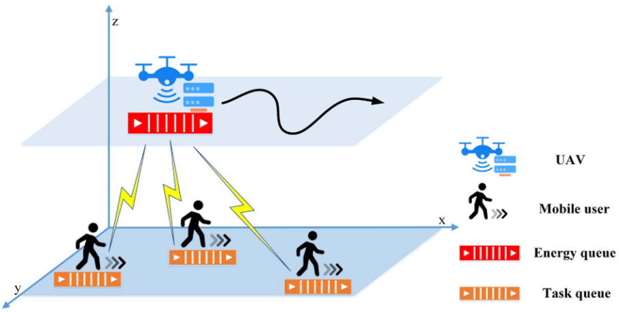

Fig. 1. System model with I MUs and a UAV equipped with an edge server.

## B. Communication Model

The communication process between UAV and MUs experiences significant variations in channel gain. It primarily depends on two factors: (1) the distance between the UAVs and the MUs, with the channel gain significantly increasing as the UAV approaches the MU. (2) the channel fading caused by obstructions, where the channel gain under line-of-sight (LOS) communication is notably superior to that under non-line-of-sight (NLOS) conditions. In this section, we first model the MU’s location and channel gain, and then model the communication model.

The MU’s movement is assumed to follow the Gauss-Markov mobility model, and the MU’s speed can be expressed as follows:

$$
v _ { i } [ n + 1 ] = \alpha v _ { i } [ n ] + ( 1 - \alpha ) \bar { v } + \bar { \sigma } \sqrt { 1 - \alpha ^ { 2 } } w _ { i } [ n ] ,\tag{1}
$$

where $v _ { i } [ n ]$ is a velocity vector composed of the speed scalar $k _ { i } [ t ]$ i[ ]and the movement angle $\theta _ { i } [ t ]$ of MU i at time $n . v _ { i } [ n + 1 ]$ is i[ ] i[ ] i[ + 1]the velocity of MU i at time slot n . α is the autocorrelation + 1coefficient, with a value range of , . v and σ respectively [0 1] ¯ ¯represent the level of velocity memory, asymptotic mean, and asymptotic standard deviation. $w _ { i } [ n ]$ is a Gaussian random i[ ]process with zero unit variance and mean. Based on the modeling of the MU’s velocity, we can obtain the Markov position of the MU:

$$
p _ { i } [ n + 1 ] = p _ { i } [ n ] + v _ { i } [ n ] \Delta ,\tag{2}
$$

where $p _ { i } [ n ]$ represents the position of MU i at time slot n, which i[ ]can be expressed as a two-dimensional vector, $v _ { i } [ n ] = ( \theta , k )$ i[ ] = ( )corresponding to the longitudinal and latitudinal coordinates of MU i on a two-dimensional plane. The symbol  represents the length of a time slot.

The UAV is assumed to fly at a fixed height H and subjects to its maximum speed $v _ { m }$ throughout the entire period N, and mit is capable of obtaining the current positions of the MUs. The UAV will start from the initial point $p _ { u } [ 1 ]$ and return to u[1]the power replenishment position upon reaching the minimum return battery level or at the end of service. A probabilistic LOS channel model is adopted to determine the large-scale fading of the links between the UAV and the MUs. According reference [17], the probability of a geometrical LoS between a MU and the UAV depends on the angle, which can be calculated based on the difference between the altitude and the horizontal distance, yielding the angle between UAV and MU i. It can be

written as follows,

$$
\theta _ { i } [ n ] = { \frac { 1 8 0 } { \pi } } \arctan \left( { \frac { H } { \lVert p _ { u } [ n ] - p _ { i } [ n ] \rVert } } \right) .\tag{3}
$$

u[ ] i[ ]From this, it can be obtained that the probability of LoS between the MUs and the UAV is as follows:

$$
P ( L o S , \theta _ { i } [ n ] ) = \frac { 1 } { 1 + a \exp ( - b ( \theta _ { i } [ n ] - a ) ) } ,\tag{4}
$$

where a and b are environment-dependent coefficients. Accordingly, it can be inferred that the probability of a NLOS channel is equal to $P ( N L o S , \Theta k [ n ] ) = \bar { 1 } - P ( \bar { L o S } , \Theta k [ n ] )$ . Thus, the ( Θ [ ]) = 1 ( Θ [ ])channel gain between MUs and the UAV can be expressed as follows:

$$
\begin{array} { l } { { g _ { i } [ n ] = \displaystyle \frac { P ( L o S , \theta _ { i } [ n ] ) g _ { 0 } } { d _ { i } [ n ] ^ { \iota } } + \displaystyle \frac { ( 1 - P ( L o S , \theta _ { i } [ n ] ) ) \kappa g _ { 0 } } { d _ { i } [ n ] ^ { \iota } } } } \\ { { \displaystyle ~ = \frac { \bar { P } ( L o S , \theta _ { i } [ n ] ) g _ { 0 } } { ( h ^ { 2 } + \| p _ { u } [ n ] - p _ { i } [ n ] \| ^ { 2 } ) ^ { \frac { \iota } { 2 } } } , } } \end{array}\tag{5}
$$

where $g _ { 0 }$ represents the channel gain at a distance of one meter $( d _ { i } [ n ] \stackrel { \cdot } { = } 1 \stackrel { \cdot } { m } )$ . κ is the channel attenuation factor under NLoS ( i[ ] = 1 )conditions, with $\kappa < 1 . \ d _ { i } [ n ]$ is the distance between MU i and 1 i[ ]the UAV during the nth time slot. ι is the path loss exponent.

¯Orthogonal frequency-division multiple access (OFDMA) is adopted as the transmission method between UAV and MUs in this paper. According to Shannon’s formula, the transmission rate from MUs to the UAV can be represented as follows:

$$
\begin{array} { l } { { \displaystyle R _ { i } [ n ] = \frac { W _ { u } } { I [ n ] } \log _ { 2 } \left( 1 + \frac { g _ { i } [ n ] P _ { i } [ n ] } { N _ { 0 } [ n ] } \right) } } \\ { { \displaystyle \quad = \frac { W _ { u } } { I [ n ] } \log _ { 2 } \left( 1 + \frac { P ( L o S , \theta _ { i } [ n ] ) g _ { 0 } P _ { i } [ n ] } { N _ { 0 } [ n ] ( h ^ { 2 } + \| p _ { u } [ n ] - p _ { i } [ n ] \| ^ { 2 } ) ^ { \frac { t } { 2 } } } \right) } , }  \end{array}\tag{6}
$$

where $P _ { i } [ n ]$ denotes the offloading power of MUs, and $W _ { u }$ i[ ]represents the bandwidth of the UAV.

## C. Task and Offloading Model

In each time slot n, tasks $A _ { i } [ n ]$ are randomly generated and ari[ ]rive at the task queue of MUs i in a first-in first-out manner. MUs collaboratively process these tasks through local computing and offloading to the UAV. Notably, while fully offloading tasks to the UAV can alleviate the computational burden on MUs, when the network conditions are unstable, the MUs require higher transmission powers to achieve satisfactory transmission rates, which may result in energy consumption that exceeds the savings from local computation. Unlike binary offloading in [29], this paper computes or offloads a certain proportion of tasks by scaling the CPU frequency of MU and adjusting the offloading power. This approach is more realistic and also significantly reduces energy consumption. This section models the specific raw data (in bits) processed locally and energy consumption, as detailed below.

1) Energy Consumption and Task Sizes of MUs: The task processing of MUs mainly includes two parts: local computing and offloading. The communication circuit and the computing component operate independently, allowing MUs to compute and offload tasks in parallel. We use $E _ { i } [ \bar { n } ]$ to represent the i[ ]energy consumed by MU i at the time slot n, and $f _ { i } [ n ]$ and $P _ { i } [ n ]$ i[ ]to respectively denote the CPU frequency cycle and ofi[ ]floading power of MU i at moment n. The transmission method adopts Frequency Division Multiple Access (FDMA), dividing the channel evenly into I parts, with each device obtaining a sub-channel bandwidth of $W _ { u } / I [ n ]$ . Therefore, the energy u [ ]consumption of MU i includes both local and offloading energy consumption, as represented below,

$$
E _ { i } [ n ] = \gamma _ { c } f _ { i } ^ { 3 } [ n ] \Delta + \Delta P _ { i } [ n ] ,\tag{7}
$$

where $\gamma _ { c }$ is the effective capacitance coefficient of the procescsor’s chip, which is determined by the chip architecture. $D _ { i } ^ { l } [ n ]$ i[is used to represent task sizes of MU i, and it can be denoted:

$$
D _ { i } ^ { l } [ n ] = \frac { f _ { i } [ n ] \Delta } { C _ { i } } ,\tag{8}
$$

where $C _ { i }$ is the number of CPU cycles required for MU i to iprocess each bit of task.

The size of the task offloading to UAV mainly depends on the offloading power [30], which is represented:

$$
D _ { i } ^ { u } [ n ] = \Delta R _ { i } [ n ] ,\tag{9}
$$

where $R _ { i } [ n ]$ represents the transmission rate of MU i, consistent i[ ]with the description in the communication model section.

2) Task Queue Model: We maintain a task queue on each MU, operating on a first-in, first-out principle. The primary input to the queue is the task arrival rate, denoted as $A _ { i } [ n ]$ . The output from the queue include $D _ { i } ^ { l } [ n ]$ and $D _ { i } ^ { u } [ n ]$ i[ ]. The model of the queue is as follows:

$$
Q _ { i } [ n + 1 ] = \operatorname* { m a x } \{ Q _ { i } [ n ] + A _ { i } [ n ] - D _ { i } ^ { l } [ n ] - D _ { i } ^ { u } [ n ] , 0 \} \forall n \in \mathcal { N }\tag{10}
$$

Note that for achieving long-term optimization, the queue should be maintained in a stable state. In other words, there is an upper limit to the length of the queue. Therefore, it can be satisfied the following constraint:

$$
\operatorname* { l i m } _ { N \to \infty } \frac { 1 } { N } \sum _ { n = 1 } ^ { N } \sum _ { i = 1 } ^ { I } \mathbb { E } \{ Q _ { i } [ n ] \} < \infty ,\tag{11}
$$

where ${ \mathbb { E } } \{ Q _ { i } [ n ] \}$ represents the expectation of $Q _ { i } [ n ]$

## D. UAV Movement and Energy Consumption Model

In our approach, we consider the position of the $\mathrm { U A V } p _ { u } [ n ]$ as u[ ]one of the decision variables. Unlike other models that discretize the movement of UAVs [24], our model treats the UAV’s position as a continuous variable, better aligning with reality and the UAV’s maneuverability. Therefore, the UAV’s movement is represented as a continuous two-dimensional vector. We use a continuous angle θ and a scalar d n to denote the distance [moved in each time slot n, as follows:

$$
0 \leq \theta [ n ] \leq 2 \pi , 0 \leq d [ n ] \leq d _ { \operatorname* { m a x } } ,\tag{12}
$$

where $d _ { \mathrm { m a x } }$ represents the maximum distance the UAV can move within a single time slot. The update of the UAV’s position $p _ { u } [ n ] = ( x _ { u } { \bar { [ n ] } } , y _ { u } [ n ] )$ can be expressed as follows:

$$
\begin{array} { l } { { x _ { u } [ n + 1 ] = x _ { u } [ n ] + d [ n ] \cos ( \theta ) , } } \\ { { y _ { u } [ n + 1 ] = y _ { u } [ n ] + d [ n ] \sin ( \theta ) . } } \end{array}\tag{13}
$$

The propulsion energy consumption of a UAV is significantly higher than its computing and offloading energy consumption [17], [31]. In considering the energy consumption of the UAV, we primarily focus on its propulsion energy. Referring to existing models of rotary-wing UAVs, we connect speed with power to establish a power function in terms of velocity v n as

follows:

$$
P _ { U A V } ( v ) = C _ { 1 } \left( 1 + \frac { 3 v ^ { 2 } } { v _ { t i p } ^ { 2 } } \right) + C _ { 2 } \sqrt { \sqrt { C _ { 3 } + \frac { v ^ { 4 } } { 4 } } - \frac { v ^ { 2 } } { 2 } } + C _ { 4 } v ^ { 3 } .\tag{14}
$$

where $v _ { t i p }$ represents the square of the velocity at the rotor tiptip, and C , C , C , C are constants that are related to the 1 2 3 4weight and aerodynamic parameters of the UAV. This model adequately accounts for the UAVs’ energy consumption in both hovering and flying states.

To achieve long-term optimization, we have set up a virtual energy consumption queue $U [ n ]$ for the UAV as follows:

$$
U [ n + 1 ] = \operatorname* { m a x } \{ U [ n ] + E _ { v } [ n ] - E ^ { u } , 0 \} , \forall n \in \mathcal { N } ,\tag{15}
$$

where $E _ { v } [ n ] = P _ { U A V } \Delta$ is the movement energy in each time vslot. And $E ^ { u }$ = UAV Δis a constant that represents the average maximum energy consumption for each time slot. By maintaining the stability of the virtual energy queue $U [ n ]$ , UAV can ensure its [ ]endurance during the period of serving MUs.

## E. Problem Formulation

Recalling our initial optimization problem, which is to minimize the energy consumption of MUs as much as possible while ensuring the stability of device queues and sufficient endurance of UAV. The problem can be approached through joint optimization of UAV trajectories, device CPU frequencies, and offloading powers. After completing the modeling of the previous section, this issue can be formulated as the following multi-stage Mixed Integer Nonlinear Programming (MINLP) problem:

$$
\mathrm { P 1 } \colon \operatorname* { m i n } _ { \phi } \operatorname* { l i m } _ { N \to \infty } \frac { 1 } { N } \sum _ { n = 1 } ^ { N } \sum _ { i = 1 } ^ { I } E _ { i } [ n ] ,\tag{16a}
$$

$$
\operatorname { s . t . } \operatorname* { l i m } _ { N \to \infty } \frac { 1 } { N } \sum _ { n = 1 } ^ { N } \mathbb { E } \{ U [ n ] \} \le E _ { u } ,\tag{16b}
$$

$$
\operatorname* { l i m } _ { N \to \infty } \frac { 1 } { N } \sum _ { n = 1 } ^ { N } \sum _ { i = 1 } ^ { I } \mathbb { E } \{ Q _ { i } [ n ] \} < \infty ,\tag{16c}
$$

$$
0 \leq f _ { i } [ n ] \leq f _ { m } , \forall i , n ,\tag{16d}
$$

$$
0 \leq P _ { i } [ n ] \leq P _ { m } , \forall i , n ,\tag{16e}
$$

$$
D _ { i } ^ { l } [ n ] + D _ { i } ^ { u } [ n ] \leq Q _ { i } [ n ] + A _ { i } [ n ] , \forall i , n ,\tag{16f}
$$

$$
p _ { u } [ 1 ] = p _ { I } , p _ { u } [ N + 1 ] = p _ { F } ,\tag{16g}
$$

$$
\| p _ { u } [ n + 1 ] - p _ { u } [ n ] \| \leq v _ { m } \Delta , \quad \forall n ,\tag{16h}
$$

$$
\| p _ { F } - p _ { u } [ n + 1 ] \| \leq v _ { m } ( N - n ) \Delta , \forall n ,\tag{16i}
$$

where φ n represents $f _ { i } [ n ] , P _ { i } [ n ] , p _ { u } [ n ] , \forall i$ is a combined vec-[ ] i[ ] i[ ] u[ ]tor of CPU frequency, offloading power for all MUs and UAV position at time slot n. Equation (16b) is a constraint on the energy consumption of the UAV propulsion. Equation (16c) is a constraint on the stability of long-term queues. Constraints (16d) and (16e) limit the maximum CPU frequency and offloading power of each MU. Equation (16f) limits the task processing capacity of MUs within a single time slot. Constraint (16g) restricts the initial position and final power supply point position of the UAV. Equation (16h), (16i) limits the maximum speed of a single time slot and the entire process of the UAV.

In real-life scenarios, it’s challenging to obtain information about future task arrival rates, channel gains, and similar data. Existing work often uses the Lyapunov framework to transform uncertain stochastic optimization problems into deterministic optimization problems. However, the drawbacks of traditional Lyapunov optimization techniques are apparent, as they cannot provide low-complexity, rapid solutions for highly nonlinear problems. For instance, the UAV trajectory optimization problem under dynamic users. If DRL is used to directly solve P1, the high-dimensional state and action spaces would lead to a dramatic increase in complexity. Moreover, DRL struggles to ensure the generality of the problem when dealing with highly complex mathematical expressions. In the next section, we design an online algorithm that combines Lyapunov optimization with DRL to solve this problem.

## IV. PROBLEM TRANSFORMATION

In this section, we utilize Lyapunov optimization techniques to transform the original dynamical stochastic optimization problem into a single-time-slot deterministic optimization problem. Additionally, we initiate the decoupling of the interdependencies among decision variables and the problem is decomposed into two sub problems that can be solved in parallel online.

To ensure the stability of the MU task queues and the UAV energy queues, we define ${ \bf Q } [ n ] = ( \{ Q _ { i } [ n ] \} _ { i = 1 } ^ { \prime } , U [ n ] )$ as a total [ ] = ( i[ ] i [backlog. Then we define the Lyapunov function as

$$
L ( \mathbf { Q } [ n ] ) = \frac { 1 } { 2 } \left( \sum _ { i = 1 } ^ { I } Q _ { i } ^ { 2 } [ n ] + U ^ { 2 } [ n ] \right) ,\tag{17}
$$

and Lyapunov drift is expressed as

$$
\Delta L ( \mathbf { Q } [ n ] ) = \mathbb { E } \{ L ( \mathbf { Q } [ n + 1 ] ) - L ( \mathbf { Q } [ n ] ) | \mathbf { Q } [ n ] \} .\tag{18}
$$

Reducing $\Delta L ( \mathbf { Q } [ n ] )$ is equivalent to reducing both task queue Δ ( [ ])and UAV’s energy queue backlog. And in order to achieve the goal of minimizing MUs’ energy consumption while stabilizing the queue, we introduce a method of minimizing drift functions and penalty terms. Then, the drift-plus-penalty can be represented as

$$
D ( \mathbf { Q } [ n ] ) = \Delta ( \mathbf { Q } [ n ] ) + V \mathbb { E } \{ E [ n ] | \mathbf { Q } [ n ] \} ,\tag{19}
$$

where $\begin{array} { r } { E [ n ] = \sum _ { i = 1 } ^ { I } E _ { i } [ n ] } \end{array}$ is the total energy consumption of [MUs, and $V > 0$ i i[ ]is a parameter that balances energy consump-0tion and queue stability. The weight of energy consumption in optimization goals depend on the value of $\bar { V } .$ . In other words, the optimization strength of energy consumption or queue can be adjusted by the size of V . In practice, directly optimizing the drift-plus-penalty function remains challenging. Following the Lyapunov optimization method, we optimize $E [ n ]$ and maintain [ ]stability of Q n by optimizing the upper bound of the drift-plus-[ ]penalty function.

Theorem 1: If the upper bounds $A _ { \mathrm { m a x } } [ n ]$ for $A _ { i } [ n ]$ exists, the [ ] i[ ]following equation is satisfied regardless of the value of $\mathbf Q [ n ]$

$$
D ( \mathbf { Q } [ n ] ) + V \mathbb { E } \{ E [ n ] | \mathbf { Q } [ n ] \}
$$

$$
\begin{array} { l } { { \displaystyle \le Z + \sum _ { i = 1 } ^ { I } V \{ \gamma _ { c } f _ { i } ^ { 3 } [ n ] \Delta + \Delta P _ { i } [ n ] | { \bf Q } [ n ] \} } } \\ { { \displaystyle ~ + U [ n ] \{ P _ { U A V } ( v ) \Delta - E ^ { u } \} } } \\ { { \displaystyle ~ + \sum _ { i = 1 } ^ { I } Q _ { i } [ n ] \left\{ A _ { i } [ n ] - \frac { f _ { i } [ n ] \Delta } { C _ { i } } - \Delta R _ { i } [ n ] \right\} , } } \end{array}\tag{20}
$$

where $\begin{array} { r } { Z = \frac { 1 } { 2 } \sum _ { n = 1 } ^ { N } \sum _ { i = 1 } ^ { I } \{ [ A _ { \operatorname* { m a x } } ^ { 2 } + ( D _ { \operatorname* { m a x } } ^ { l } + D _ { \operatorname* { m a x } } ^ { u } ) ^ { 2 } ] + } \end{array}$ $[ E _ { v } ^ { 2 } + E ^ { 2 } u ] \}$ = nis a constant.

v + ]Proof: Based on (10), we can get

$$
\begin{array} { r l r } {  { Q _ { i } [ n + 1 ] ^ { 2 } - Q _ { i } [ n ] ^ { 2 } } } \\ & { = \operatorname* { m a x } \{ Q _ { i } [ n ] + A _ { i } [ n ] - D _ { i } ^ { l } [ n ] - D _ { i } ^ { u } [ n ] , 0 \} ^ { 2 } - Q _ { i } [ n ] ^ { 2 } } \\ & { \leq \{ Q _ { i } [ n ] + ( A _ { i } [ n ] - D _ { i } ^ { l } [ n ] - D _ { i } ^ { u } [ n ] ) \} ^ { 2 } - Q _ { i } [ n ] ^ { 2 } } \\ & { = ( A _ { i } [ n ] - D _ { i } ^ { l } [ n ] - D _ { i } ^ { u } [ n ] ) ^ { 2 } - 2 Q _ { i } [ n ] ( A _ { i } [ n ] - D _ { i } ^ { l } [ n ] } \\ & { - D _ { i } ^ { u } [ n ] ) . } \end{array}\tag{21}
$$

iSimilar to (21), we can derive

$$
\begin{array} { r l } & { U [ n + 1 ] ^ { 2 } - U [ n ] ^ { 2 } } \\ & { = \{ U [ n ] + E _ { v } [ n ] - E ^ { u } , 0 \} ^ { 2 } - U [ n ] ^ { 2 } } \\ & { \le \{ U [ n ] + ( E _ { v } [ n ] - E ^ { u } ) \} ^ { 2 } - U [ n ] ^ { 2 } } \\ & { = ( E _ { v } [ n ] - E ^ { u } ) ^ { 2 } - 2 U [ n ] ( E _ { v } [ n ] - E ^ { u } ) . } \end{array}\tag{22}
$$

Recalling (17), (18), and (19), we substitute (21) and (22) into them. We can obtain

$$
\begin{array} { r l } & { \displaystyle { D ( \mathbf { Q } [ n ] ) + V \mathbb { E } \{ E [ n ] | \mathbf { Q } [ n ] \} } } \\ & { \displaystyle \leq \sum _ { i = 1 } ^ { I } ( A _ { i } [ n ] - D _ { i } ^ { l } [ n ] - D _ { i } ^ { u } [ n ] ) ^ { 2 } } \\ & { \displaystyle - 2 Q _ { i } [ n ] ( A _ { i } [ n ] - D _ { i } ^ { l } [ n ] - D _ { i } ^ { u } [ n ] ) } \\ & { \displaystyle + ( E _ { v } [ n ] - E ^ { u } ) ^ { 2 } - 2 U [ n ] ( E _ { v } [ n ] - E ^ { u } ) } \\ & { \displaystyle + V \mathbb { E } \{ E [ n ] | \mathbf { Q } [ n ] \} . } \end{array}\tag{23}
$$

Note that $A _ { i } [ n ] \leq A _ { \operatorname* { m a x } } , D _ { i } ^ { l } [ n ] \leq D _ { \operatorname* { m a x } } ^ { l }$ , and $D _ { i } ^ { u } [ n ] \leq D _ { \operatorname* { m a x } } ^ { u }$ i[ ] i[ ] i [ ]thus we strip the constant term from the Equation and represent it as $\begin{array} { r } { Z = \frac { 1 } { 2 } \bar { \sum } _ { n = 1 } ^ { N } \sum _ { i = 1 } ^ { I } \{ [ A _ { \mathrm { m a x } } ^ { 2 } + ( D _ { \mathrm { m a x } } ^ { l } + D _ { \mathrm { m a x } } ^ { u } ) ^ { 2 } ] + [ E _ { v } ^ { 2 } + } \end{array}$ $E ^ { 2 } u ] ]$ = n i}. We can obtain

$$
\begin{array} { l } { { \displaystyle { \cal D } ( { \bf Q } [ n ] ) + V { \mathbb E } \{ E [ n ] | { \bf Q } [ n ] \} } \ ~ } \\ { { \displaystyle ~ \leq Z + V { \mathbb E } \{ E [ n ] | { \bf Q } [ n ] \} } } \\ { { \displaystyle ~ - \sum _ { i = 1 } ^ { I } Q _ { i } [ n ] ( A _ { i } [ n ] - D _ { i } ^ { l } [ n ] - D _ { i } ^ { u } [ n ] ) } } \\ { ~ } \\ { { \displaystyle ~ - U [ n ] ( E _ { v } [ n ] - E ^ { u } ) . } } \end{array}\tag{24}
$$

Substituting (7), (8), and (9), we can get (20).

After deriving the upper bound of the drift-plus-penalty, we can achieve our optimization objective by optimizing the righthand side (RHS) of (20). By eliminating the constant parts, we obtain a clear expression of the problem as follows:

$$
\begin{array} { r l } { P 2 : } & { \underset { \phi [ n ] } { \operatorname* { m i n } } U [ n ] E _ { v } [ n ] - Q _ { i } [ n ] \{ D _ { i } ^ { l } [ n ] + D _ { i } ^ { u } [ n ] \} + V E _ { i } [ n ] , } \end{array}\tag{25}
$$

$$
\mathrm { s . t . } \quad ( 1 6 \mathrm { d } ) { - } ( 1 6 \mathrm { i } ) .
$$

Note that constraints (16b), (16c) have been incorporated in a queue-based formulation in this problem, thus necessitating only the satisfaction of constraints (16d)–(16i). This significantly simplifies the issue compared to Problem P1. However, $P 2$ 2remains a non-convex problem and cannot be directly resolved. This complexity is particularly pronounced when both UAVs and MUs are in motion, as changes in their positions result in variations in channel gains, which in turn cause that there is a coupled relation between the trajectory and MUs’ offloading. In Section V, we integrate DRL with the Lyapunov optimization framework to devise a joint optimization algorithm. This algorithm aims to jointly optimize the computational frequency, offloading power of MUs, and the UAV trajectory.

## V. JTORA FOR JOINT TRAJECTORY OPTIMIZATION AND RESOURCE ALLOCATION

Recalling P2, parts such as $D _ { i } ^ { l } [ n ]$ and $E _ { i } [ n ]$ can be expressed i[using certain decision variables in $\mathbf { \bar { \phi } } _ { \phi [ n ] }$ i[ ]. Moreover, the variable $f _ { i } [ n ]$ can be decoupled from $P _ { i } [ n ] , \bar { p _ { u } } [ n ]$ . Based on this obi[ ] i[ ] u[ ]servation, this section will first reformulate the problem using variables in $\phi [ n ]$ , and then separate the sub-problem related [ ]to the easily solvable $f _ { i } [ n ]$ , addressing it as a priority. For i[ ]the remaining issues related to trajectory optimization and offloading power, we will introduce the Soft Actor-Critic (SAC) algorithm combined with convex optimization theory to provide an efficient and responsive solution.

## A. Decompose the Subproblem

Substituting $f _ { i } [ n ] , P _ { i } [ n ] , p _ { u } [ n ]$ into P2, we get the following iexpression as P3:

$$
\begin{array} { r l } { P 3 : } & { \underset { \phi [ n ] } { \operatorname* { m i n } } U [ n ] P _ { U A V } ( v ) \Delta - Q _ { i } [ n ] \left\{ \frac { f _ { i } [ n ] \Delta } { C _ { i } } + \Delta R _ { i } [ n ] \right\} } \\ & { \qquad + V \{ \gamma _ { c } f _ { i } ^ { 3 } [ n ] \Delta + \Delta P _ { i } [ n ] \} , } \\ & { \qquad \mathrm { s . t . ~ } \ ( 1 6 \mathrm { d } ) - ( 1 6 \mathrm { i } ) , } \end{array}
$$

where the meaning of $P _ { U A V } ( v )$ is the same as in (14) and the meaning of $P _ { U A V } ( v )$ UAV ( )is the same as in (6).

UAV ( )It can be observed that the CPU frequency $f _ { i } [ n ]$ is not coupled i[ ]with the other two decision variables, so we can decompose and optimize the sub-problem 3-1 about $f _ { i } [ n ]$ as follows:

$$
\mathrm { P 3 - 1 } \mathrm { : } \quad \operatorname* { m i n } _ { f _ { i } \left[ n \right] } - Q _ { i } \lbrack n \rbrack \frac { f _ { i } \lbrack n \rbrack \Delta } { C _ { i } } + V \gamma _ { c } f _ { i } ^ { 3 } \lbrack n \rbrack \Delta ,\tag{27a}
$$

$$
\mathrm { s . t . } \quad 0 \leq { f _ { i } } [ n ] \leq f _ { m } , \quad \forall i , n ,\tag{27b}
$$

$$
f _ { i } [ n ] \Delta / C _ { i } \leq Q _ { i } [ n ] + A _ { i } [ n ] , \forall i , n ,\tag{27c}
$$

This is a cubic function about $f _ { i } [ n ]$ . According to the coni[ ]vex optimization theorem, we can easily derive the analytical solution about $P 3 - 1 { \mathrm { : } }$

$$
f _ { i } ^ { o p t } [ n ] = \left\{ \begin{array} { l l } { \sqrt { \frac { Q _ { i } [ n ] } { 3 V \gamma _ { c } C _ { i } } } , \quad 0 \leq \sqrt { \frac { Q _ { i } [ n ] } { 3 V \gamma _ { c } C _ { i } } } \leq f ^ { * } , } \\ { f ^ { * } , \quad \quad \quad \quad \quad \quad \quad \mathrm { o t h e r w i s e } , } \end{array} \right.\tag{28}
$$

where $\begin{array} { r } { f ^ { * } = \operatorname* { m i n } \lbrace \frac { ( Q _ { i } [ n ] + A _ { i } [ n ] ) C _ { i } } { \Delta } , f _ { i } ^ { \operatorname* { m a x } } \rbrace } \end{array}$

= min iWe define the problem after decoupling $f _ { i } [ n ]$ as P3-2, expressed as follows:

$$
\begin{array} { l } { { \displaystyle \mathrm { P 3 - 2 : } \qquad \operatorname* { m i n } _ { P _ { i } [ n ] , p _ { u } [ n ] } - Q _ { i } [ n ] \Delta \frac { W _ { u } } { I [ n ] } } } \\ { { \displaystyle \log _ { 2 } \left( 1 + \frac { P \left( L o S , \theta _ { i } [ n ] \right) g _ { 0 } P _ { i } [ n ] } { N _ { 0 } [ n ] \left( h ^ { 2 } + \| p _ { u } [ n ] - p _ { i } [ n ] \| ^ { 2 } \right) ^ { \frac { \epsilon } { 2 } } } \right) + V \Delta P _ { i } [ n ] } } \\ { { + \Delta U [ n ] \left[ C _ { 1 } \left( 1 + \frac { 3 v ^ { 2 } } { v _ { t i p } ^ { 2 } } \right) + C _ { 2 } \sqrt { \sqrt { C _ { 3 } + \frac { v ^ { 4 } } { 4 } } - \frac { v ^ { 2 } } { 2 } } + C _ { 4 } v ^ { 3 } \right] . } } \end{array}\tag{29}
$$

$$
\mathrm { s . t . } \quad 0 \leq P _ { i } [ n ] \leq P _ { m } , \quad \forall i , n ,
$$

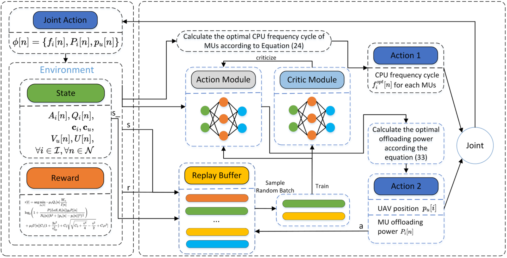

Fig. 2. The main process of proposed JTORA algorithm.

$$
\begin{array} { r } { R _ { i } [ n ] \Delta \leq Q _ { i } [ n ] + A _ { i } [ n ] , \forall i , n , } \\ { ( 1 6 \mathrm { g } ) , ( 1 6 \mathrm { h } ) , \mathrm { a n d } ( 1 6 \mathrm { i } ) . \qquad } \end{array}
$$

The P3-2 is still difficult to solve due to its non-convexity. Specifically, in the context of solving the UAV trajectory $p _ { u } [ n ]$ u[ ]traditional methods struggle to provide an effective solution. Thus, we need to use DRL to offer a potential resolution for this problem. However, DRL is unable to attain the optimal solution when confronted with complex mathematical problems. Additionally, convergence becomes increasingly difficult as the number of agents and the range of actions grow. Fortunately, as observed in Equation P3-2, if $p _ { u } [ n ]$ is treated as a constant, the u[ ]resolution of P3-2 becomes much more feasible. Moreover, the analytical solution for the offloading power of MUs is derived through mathematical methods which reduces the scale of the problem, and makes DRL easier to achieve a better solution. For this purpose, we introduce the JTORA algorithm, which effectively trains to ascertain an appropriate trajectory $p _ { u } [ n ]$ u[ ]for P3-2. Subsequently, integrating this solution for trajectory into P3-2 allows us to get the solution of $P _ { i } [ n ]$ through convex optimization techniques.

## B. Algorithm Description

As shown in Fig. 2, we design the JTORA algorithm, which employs the Soft-Actor-Critic (SAC) method to resolve the UAV position decision within a single time slot. The position information obtained is then transmitted to the sub-problem solved by Lyapunov optimization techniques. Subsequently, information regarding the task queues of each MU, obtained from the Lyapunov sub-problem, is fed back to the SAC algorithm. Due to the sufficiently small selection of time slots, the positions of the UAV and devices can be considered constant within a single time slot. Hence, the combination of SAC and Lyapunov methods allows us to determine a jointly optimized trajectory and the allocation of computing and communication resources.

In order to address the optimal position selection problem about $p _ { u } [ n ]$ , we formulate a Markov Decision Process (MDP) u[ ]consisting of a triplet S, A, R , where S represents the state ( )space, A stands for the action space, and R indicates the reward. The UAV, acting as an agent, can determine appropriate actions for the current time slot through its interaction with the environment and the output of the action network.

a) State Space: The UAV aims to minimize device energy consumption while ensuring device latency and its energy queue by adjusting its movement trajectory. The essence of the problem is for the UAV to approach MUs as closely as possible and provide better channel conditions for MUs with larger queue backlogs. Therefore, within the state space, factors such as the device’s queue, position, task arrival rate, and the UAV’s position and velocity should be considered. The description of State Space is as follows:

$$
\begin{array} { l } { { \displaystyle { \cal S } = \{ s [ n ] | s [ n ] = ( A _ { i } [ n ] , Q _ { i } [ n ] , { \bf c } _ { i } , { \bf c } _ { u } , } } \\ { { \displaystyle V _ { u } [ n ] , U [ n ] ) , \forall i \in \mathbb { Z } , \forall n \in \mathcal { N } \} , } } \end{array}\tag{30}
$$

where $\mathbf { c } _ { i } = ( x _ { u } , y _ { u } )$ and $\mathbf { c } _ { u } = ( x _ { u } , y _ { u } )$ respectively represent i = ( u u) uthe positions of MUs and the $\mathrm { U A V } .$

b) Action Space: To simplify the research of the problem, we set the height of the drone to be fixed at the horizontal plane of H, and the position movement of the UAV can be represented by a continuous two-dimensional vector, which is velocity and angle. Represented as follows:

$$
\mathcal { A } = \{ a [ n ] | a [ n ] = ( v [ n ] , \theta [ n ] ) , \forall n \in \mathcal { N } . \}\tag{31}
$$

c) Reward: First, we introduce the solution about $P _ { i } [ n ]$ obtained through Lyapunov into 3-2 and simplify the $\Delta$ i[ ]term,

and the reward can be represent as follows:

$$
\begin{array} { l } { r [ t ] = \arg \underset { p _ { u } [ n ] } { \operatorname* { m i n } } - \mu _ { 1 } Q _ { i } [ n ] \frac { W _ { u } } { I [ n ] } } \\ { \log _ { 2 } ( 1 + \frac { P ( L o S , \theta _ { i } [ n ] ) g _ { 0 } P _ { i } [ n ] } { N _ { 0 } [ n ] ( h ^ { 2 } + \| p _ { u } [ n ] - p _ { i } [ n ] \| ^ { 2 } ) ^ { \frac { \varepsilon } { 2 } } } )  } \\ {  + \mu _ { 2 } U [ n ] [ C _ { 1 } ( 1 + \frac { 3 v ^ { 2 } } { v _ { t i p } ^ { 2 } } ) + C _ { 2 } \sqrt { \sqrt { C _ { 3 } + \frac { v ^ { 4 } } { 4 } } - \frac { v ^ { 2 } } { 2 } } + C _ { 4 } v ^ { 3 } ] . } \end{array}\tag{32}
$$

where $\mu _ { 1 }$ and $\mu _ { 2 }$ are the trade-off parameters, ensuring that items 1 and 2 remain on the same order of magnitude, and allowing for adjustment of the weight between MUs’ energy and the UAV energy consumption. From the perspective of the agent, all values except $p _ { u } [ \bar { n } ]$ are considered constants which can be u[ ]obtained from the Lyapunov sub-algorithm.

d) Policy Update: To address dynamic optimization challenges, the SAC algorithm utilizes multiple deep neural networks. Specifically, its network architecture comprises a policy network, two V-networks, and two Q-networks. The policy network takes the state as input and outputs parameters for an action probability distribution. The V-networks also take the state as input, outputting estimated values of the state. The Q-networks input both state and action to provide their estimated values. The core idea of the SAC algorithm is to obtain action policies by maximizing the weighted sum of rewards and entropy based on the AC algorithm. The policy can be expressed as follows:

$$
\pi ^ { * } = \arg \operatorname* { m a x } _ { \pi } E _ { ( s _ { n } , a _ { n } ) } \sim \rho _ { \pi } \left[ \sum _ { n } R ( s _ { n } , a _ { n } ) + \alpha H ( \pi ( \cdot | s _ { t } ) ) \right] ,\tag{33}
$$

where α $H ( \pi ( \cdot | s _ { t } ) )$ represents entropy and its weighting coefficient.

The process for updating the Q-network can be expressed as follows:

$$
\begin{array} { l } { { J _ { Q } ( \theta ) = E _ { s _ { n } , a _ { n } , s _ { n + 1 } \sim \mathcal { D } } \left[ \displaystyle \frac { 1 } { 2 } ( Q _ { \theta } ( s _ { n } , a _ { n } ) ) - ( r ( s _ { n } , a _ { t } ) \right. } } \\ { { \left. \qquad + \gamma V _ { \theta } ( s _ { n + 1 } ) ) ) ^ { 2 } \right] . } } \end{array}\tag{34}
$$

The process for updating the Policy network is expressed as:

$$
\begin{array} { r l } & { J _ { \pi } ( \phi ) = E _ { s _ { n } \sim D , \epsilon \sim \mathcal N } [ \alpha \log \pi _ { \phi } ( f _ { \phi } ( \epsilon _ { n } ; s _ { n } ) | s _ { n } ) } \\ & { \phantom { a a a a a a a a a a a a a a a a a a a a a a a a a a a a a a a a a a a a a a a a } - Q _ { \theta } ( s _ { n } , f _ { \phi } ( \epsilon _ { n } ; s _ { n } ) ) ] . } \end{array}\tag{35}
$$

Through SAC Algorithm, we can obtain the position of the UAV in each time slot. And when the position of the UAV is determined, the channel gain of the MU i in that time slot can be considered as $g _ { i } [ n ]$ , thus P3-2 can be re-expressed as follows:

$$
\begin{array} { l } { { \displaystyle \mathrm { P 3 } \mathrm { - } 2 ^ { \prime } : \quad \operatorname* { m i n } _ { P _ { i } [ n ] } \displaystyle - Q _ { i } [ n ] \Delta \frac { W _ { u } } { I [ n ] } } } \\ { { \displaystyle \log _ { 2 } \left( 1 + \frac { g _ { i } [ n ] P _ { i } [ n ] } { N _ { 0 } [ n ] } \right) + V \Delta P _ { i } [ n ] . } } \end{array}\tag{36}
$$

$P 3 - 2 ^ { \prime }$ is a nonlinear programming problem. Since $V > 0$ and $- Q _ { i } [ n ] \Delta \frac { W _ { u } } { I [ n ] } \le 0$ 0, thus the function must have a minimum I npoint. We first take the first derivative of obtaining the firstorder derivative: $\begin{array} { r } { V - \frac { Q _ { i } [ n ] W _ { u } g _ { i } [ n ] } { I [ n ] l n 2 ( N _ { 0 } + g _ { i } [ n ] P _ { i } [ n ] ) } } \end{array}$ then the secondorder derivative is $\frac { g _ { i } ^ { 2 } [ n ] Q _ { i } [ n ] W _ { u } } { I [ n ] l n 2 ( N _ { 0 } + g _ { i } [ n ] P _ { i } [ n ] ) ^ { 2 } }$ . We can summarize its analytical solution as follows:

Algorithm 1: Joint Trajectory Optimation and Resource   
Allocation Algorithm.   
1 Input: $S _ { n } = \{ A _ { i } [ n ] , Q _ { i } [ n ] , \mathbf { c } _ { i } , \mathbf { c } _ { u } , V _ { u } [ n ] , U [ n ] \} , V$   
2 Initialization:   
3 $Q _ { i } [ n ]  0 \ , \mathbf { c } _ { u }  ( 0 , 0 ) , U [ n ]  0 , A _ { i } [ n ] $   
poisson(, $\mathbf { c } _ { i } \gets$ random()   
4 End Initialization   
5 for each $M U ~ i \in \mathcal { I }$ do   
6 Calculate the value of $\sqrt { \frac { Q _ { i } [ n ] } { 3 V \gamma _ { c } C _ { i } } }$   
7 Set the value of $f _ { i } [ n ]$ according to (28)   
8 Update the queues $Q _ { i } [ n ]$ and the positions $\mathbf { c } _ { i }$   
9 Set $p _ { u } [ n ]$ according to policy (33)   
10 for each $M U ~ i \in \mathcal { I }$ do   
11 Calculate the channel gain $g _ { i } [ n ]$ according (5)   
12 Calculate the value of $\begin{array} { r } { \{ \frac { Q _ { i } [ { \bar { n } } ] { \bar { W _ { u } } } g _ { i } [ n ] } { V I [ n ] l n 2 } - \frac { \bar { N _ { 0 } } } { g _ { i } [ n ] } \} } \end{array}$   
13 Set the value of $p _ { i } [ n ]$ according to (37)   
14 Update the queues $Q _ { i } [ n ]$   
15 Update the queue $U [ n ]$   
16 Output: $f _ { i } [ n ] , P _ { i } [ n ]$ and $p _ { u } [ i ]$

$$
\begin{array} { r } { P _ { i } ^ { * } [ n ] = \left\{ \begin{array} { r } { \operatorname* { m i n } \left\{ P _ { i } ^ { \operatorname* { m a x } } , \frac { Q _ { i } [ n ] W _ { u } g _ { i } [ n ] } { V I [ n ] l n 2 } - \frac { N _ { 0 } } { g _ { i } [ n ] } \right\} , \quad V \le G [ n ] , } \\ { 0 , \quad \mathrm { o t h e r w i s e } , } \end{array} \right. } \end{array}\tag{37}
$$

where $\begin{array} { r } { G [ n ] = \frac { Q _ { i } [ n ] W _ { u } g _ { i } ^ { 2 } [ n ] } { l n 2 N _ { 0 } I [ n ] } } \end{array}$ . Thus far, the analytical solution for ln N I nproblem 3-2 has been obtained. Recalling P3-1, it determines the solution for the CPU frequency of MUs in each time slot. Combined with (37), the solution for resource allocation is completed. Integrating the solution for the UAV’s position selection $p _ { u } [ n ]$ , we can summarize Algorithm 1, which jointly optimizes u[ ]the trajectory of the UAV and resource allocation for MUs.

## C. Complexity Analysis

In this part, we analyze the time complexity of the proposed JTORA algorithm. The complexity of JTORA algorithm consists of two parts: the subproblem P3-1, which addresses the local CPU frequency allocation for MUs, and the joint optimization subproblem P3-2, which deals with the UAV trajectory and MU offloading power.

For subproblem P3-1, each MU only needs to compute the solution according to equation (28), and thus the time complexity of P3-1 in a single time slot is O I , where I denotes the number of users.

For subproblem P3-2, it involves solving a nonlinear programming problem combined with the SAC algorithm. Using the SAC algorithm, once training is complete and the policy converges, generating an action essentially requires a single forward pass through the policy network. Assume the trained policy network is a feedforward neural network with L fully connected layers (excluding the input layer). Each layer has an input dimension of $n _ { i - 1 }$ and an output dimension of $n _ { i }$ (where $i = 1 , 2 , \dots , L ,$ , and $n _ { 0 }$ irepresents the input layer dimension, = 1 2i.e., the state dimension). The computational complexity of each layer is approximately $O ( n _ { i - 1 } \cdot n _ { i } )$ . Thus, the time complexity for a single forward pass through the entire policy network is expressed as $O ( \sum _ { i = 1 } ^ { L } n _ { i - 1 } \cdot n _ { i } )$ . The total time complexity for isubproblem P3-2in a single time slot is $\begin{array} { r } { O ( I + \sum _ { i = 1 } ^ { L } n _ { i - 1 } \cdot n _ { i } ) } \end{array}$

( + i i i)The JTORA algorithm runs for a long time, running a total of $T$ time slots. Each time slot solves two subproblems in sequence. Therefore, the time complexity of the JTORA algorithm in a single time slot is $\begin{array} { r } { O ( I + I + \sum _ { i = 1 } ^ { L } n _ { i - 1 } \cdot n _ { i } ) } \end{array}$ . For a complete episode, the computational complexity is $\begin{array} { r } { O ( T ( I + \sum _ { i = 1 } ^ { L } n _ { i - 1 } . } \end{array}$ $n _ { i } ) )$ .

))On one hand, solving the trajectory optimization problem, which is NP-hard, using the DRL method significantly reduces the time complexity compared to other mathematical approaches such as successive convex approximation (SCA), decomposition and iteration (DAI) [17], [32], [33]. On the other hand, compared to solving the entire problem solely using DRL [15], [25], we address the resource allocation subproblem through stochastic optimization, which sacrifices only a minimal time complexity of $O ( I )$ while greatly reducing the training difficulty and more ( )comprehensively accounting for the stochastic nature of environmental variables.

## VI. ALGORITHM ANALYSIS FOR JTORA

In this section, a theoretical analysis of the algorithm is conduced to prove the applicability of the JTORA algorithm to different environmental information, the gap between the JTORA algorithm’s energy consumption and the optimal solution is finite. What’s more, we prove the JTORA algorithm can control the energy consumption of UAVs and the system performance at a constant level.

Lemma 1: There’s an optimal decision $\alpha ^ { * }$ for any given information set $\omega ,$ which is not tied to queue length, ensuring the optimal decision at time n.

We can conclude that based on this lemma:

$$
\begin{array} { r l } & { \mathbb { E } \{ E ^ { \alpha ^ { * } } [ n ] \} = E ^ { * } ( \omega ) , } \\ & { } \\ & { \mathbb { E } \{ A _ { i } ^ { \alpha ^ { * } } [ n ] \} \le \mathbb { E } \{ D _ { i } ^ { l , \alpha ^ { * } } [ n ] + D _ { i } ^ { u , \alpha ^ { * } } [ n ] \} . } \end{array}\tag{38}
$$

Proof: Lemma 1 can be proven by Caratheodory’s theorem [34]. We no longer delve into the detailed proof of Lemma 1.

Theorem 2: The energy consumption gap between the JTORA algorithm and the optimal algorithm is within a constant level of $\textstyle { \frac { Z } { V } }$ , regardless of the random information set ω:

$$
E ^ { J T O R A } \leq E ^ { * } + \frac { Z } { V } ,\tag{39}
$$

Proof: The random information set $\omega + \varepsilon$ and the decision +set α can be defined and exist the following relationship based on Lemma 1:

$$
\begin{array} { c } { \mathbb { E } \{ E ^ { \alpha } [ n ] \} = E ^ { * } ( \omega + \varepsilon ) } \\ { \mathbb { E } \{ A _ { i } ^ { \alpha } [ n ] \} + \varepsilon \leq \mathbb { E } \{ D _ { i } ^ { l , \alpha } [ n ] + D _ { i } ^ { u , \alpha } [ n ] \} . } \end{array}\tag{40}
$$

By substituting the decision set into (24), we can obtain:

$$
D ( \mathbf { Q } [ n ] ) + V \mathbb { E } \{ E [ n ] | \mathbf { Q } [ n ] \}
$$

$$
\begin{array} { l } { { \displaystyle \leq Z + \sum _ { i = 1 } ^ { I } V \mathbb { E } \{ E [ n ] | \mathbf { Q } [ n ] \} } } \\ { { \displaystyle + U [ n ] \mathbb { E } \{ E ^ { \alpha , u a v } [ n ] - E ^ { u } \} } } \end{array}
$$

$$
+ \sum _ { i = 1 } ^ { I } Q _ { i } [ n ] \{ A _ { i } ^ { \alpha } [ n ] - D _ { i } ^ { \alpha , l } [ n ] - D _ { i } ^ { \alpha , u } [ n ] \} ,\tag{41}
$$

According to inequality (40), we can further obtain:

$$
\begin{array} { r l } & { D ( \mathbf { Q } [ n ] ) + V \mathbb { E } \{ E [ n ] | \mathbf { Q } [ n ] \} } \\ & { \le Z + V E [ n ] * ( \alpha + \varepsilon ) } \\ & { \_ \varepsilon \left( U [ n ] + \displaystyle \sum _ { i = 1 } ^ { I } Q _ { i } [ n ] \right) , } \end{array}\tag{42}
$$

Taking the upper bound over the time slot n, we can get:

$$
\begin{array} { l } { { \displaystyle { \cal V } \sum _ { n = 0 } ^ { N - 1 } \mathbb { E } \{ E [ n ] | { \bf Q } [ n ] \} \le Z N + V N E ^ { * } ( \omega + \varepsilon ) } \ ~ } \\ { { \displaystyle ~ - \varepsilon \mathbb { E } \left\{ \left( U [ n ] + \sum _ { i = 1 } ^ { I } Q _ { i } [ n ] \right) \right\} } , } \end{array}\tag{43}
$$

where $\varepsilon , U [ n ] , Q _ { i } [ n ]$ are all positive and can be scaled as follows:

$$
V \sum _ { n = 0 } ^ { N - 1 } \mathbb { E } \{ E [ n ] | \mathbf { Q } [ n ] \} \leq Z N + V N E ^ { * } ( \omega + \varepsilon ) .\tag{44}
$$

Divide $V N$ on both sides of the inequality, then take the limit of $N$ to approach infinity. Lemma 2 is proven.

Theorem 3: The following inequality holds regardless of the size of the information set ω:

$$
\overline { { L } } \leq \frac { Z + V ( E _ { \operatorname* { m a x } } - E ^ { * } ) } { \varepsilon }\tag{45}
$$

where $\begin{array} { r } { \overline { { L } } = \operatorname* { l i m } _ { N \to \infty } \frac { 1 } { N } \{ U [ n ] + \sum _ { i = 1 } ^ { I } Q _ { i } [ n ] | \mathbf { Q } [ n ] \} . } \end{array}$

= limN N [ ] + i i[ ] [ ]Proof: By swapping the terms on both sides of (43), we can get:

$$
\begin{array} { r } { \varepsilon \mathbb { E } \left\{ \left( U [ n ] + \displaystyle \sum _ { i = 1 } ^ { I } Q _ { i } [ n ] \right) \right\} \le Z N + V N E ^ { * } ( \omega + \varepsilon ) } \\ { - V \displaystyle \sum _ { n = 0 } ^ { N - 1 } \mathbb { E } \{ E [ n ] | \mathbf { Q } [ n ] \} . } \end{array}\tag{46}
$$

For any $E [ n ]$ , it holds that $E [ n ] \leq E _ { \mathrm { m a x } } - E _ { \mathrm { m i n } }$ . Additionally, $\begin{array} { r } { V \sum _ { n = 0 } ^ { N - 1 } \mathbb { E } \{ E [ n ] | \mathbf { Q } \geq 0 \} } \end{array}$ [ ]can be gained. Thus, we can get,

$$
\begin{array} { l } { \displaystyle \varepsilon \sum _ { n = 0 } ^ { N - 1 } \mathbb { E } \left\{ U [ n ] + \sum _ { i = 1 } ^ { I } Q _ { i } [ n ] \right\} } \\ { \leq \displaystyle Z N + V N \big ( E _ { \operatorname* { m a x } } - E _ { \operatorname* { m i n } } \big ) . } \end{array}\tag{47}
$$

Dividing both sides by $\varepsilon N$ , then we simplify the both sides of the inequality, Lemma 3 is proven.

## VII. EVALUATION

## A. Experimental Setup

In order to conduct a comprehensive evaluation of the JTORA algorithm, this section includes simulation experiments comprising parameter analysis, effectiveness verification, and comparisons with algorithms that have performed well in recent years. The algorithms are tested on the python 3.8.10 and Py-Torch 1.10.0 platforms, utilizing an Intel Core i7-13650HX CPU and a NVIDIA RTX4070Ti GPU. We simulate a UAV-MEC system, comprising a ES-equipped UAV and five MUs which move randomly with an initial velocity of  m/s to the right. $A _ { \mathrm { m a x } } { = } 2 M b )$ ival rate follows a Poisson distribution, with the MUs’ maximum CPU frequen $( \lambda { = } 1 0$ , being $1 \times 1 0 ^ { 9 }$ and the maximum offloading power at . W . We 1 10 0 1assume that 1000 CPU cycles are needed to process one bit. The UAV-mounted edge server’s CPU has a maximum frequency of $1 0 ^ { 1 0 }$ and provides a bandwidth of $1 0 ^ { 6 }$ . The energy consumption 10coefficient is set at $1 \times 1 0 ^ { - 2 7 }$ 10, the length of a time slot  is 1s, 1 10 Δand the fixed flight altitude H is  m. The maximum average 100energy consumption per time slot for the UAV is $E ^ { u } = 1 5 5 { \mathrm { ~ J } } .$ = 155Table I summarizes the parameters used in the experiment and their corresponding values.

TABLE I  
MAIN EXPERIMENT SETTINGS
<table><tr><td>Parameter</td><td>Value</td></tr><tr><td>Simulation environment size (x×y)</td><td>500m×500m</td></tr><tr><td>Number of MUs (i)</td><td>5</td></tr><tr><td>Maximum task arrival rates  $\overline { { ( a ^ { m a x } ) } }$ </td><td> $\overline { { 2 \times 1 0 ^ { 6 } } }$  bit/s</td></tr><tr><td>Maximum MUs’ CPU frequency (fmax)</td><td> $1 \times 1 0 ^ { 9 } ~ \mathrm { H z }$ </td></tr><tr><td>Maximum MUs’ offloading power  $( p ^ { m a x } )$ </td><td>0.1W</td></tr><tr><td>The CPU cycles needed to process one bit (Ci)</td><td>1000</td></tr><tr><td>Channel bandwidth for UAV(W)</td><td>1 MHz</td></tr><tr><td>The energy consumption coefficient (Yc）</td><td>1×10-27</td></tr><tr><td>Maximum UAV&#x27;s speed (umax)</td><td>5m/s</td></tr><tr><td>The flight altitude of UAV(H)</td><td>100m</td></tr><tr><td>The maximum average energy consumption per time slot for the</td><td>155J</td></tr><tr><td>UAV (Eu) Environment noise power  $\overline { { ( N _ { 0 } ) } }$ </td><td> $\overline { { 1 \times 1 0 ^ { - 1 2 } } }$ </td></tr><tr><td>The length of slot (△)</td><td>1 s</td></tr><tr><td>The selected trade-off factor V</td><td> $5 \times 1 0 ^ { 1 2 }$ </td></tr></table>

The deep learning framework used in the simulation experiments is Pytorch. The policy network of the agent is a multi-layer perceptron with two hidden layers, where the number of nodes in the first hidden layer is 256 and in the second hidden layer is 128. The output consists of two components: the mean and log standard deviation for each action dimension, used for the stochastic policy. The activation functions used are ReLU. The critic networks consist of two soft Q-networks, each implemented as an MLP with three hidden layers. The number of nodes in the hidden layers are 128, 64, and 1, respectively. The optimizer used is Adam, and the soft update parameter τ is set to 0.05. The entropy coefficient α is 0.5. The final selected learning rates is $1 0 ^ { - 4 } .$ . The discount factor γ is 0.99. The model training 10utilizes 5000 training sets, with each set including a maximum step limit of 600 steps.

JTORA compares two advanced algorithms from recent years: LyDROO [29], which combines Lyapunov optimization with DRL, and JRATO [26], based on Lyapunov optimization technology and game theory. Both of the two algorithms are representative algorithms for resource allocation problem of edge computing in recent years. Additionally, we simulated two algorithms as baseline algorithms.

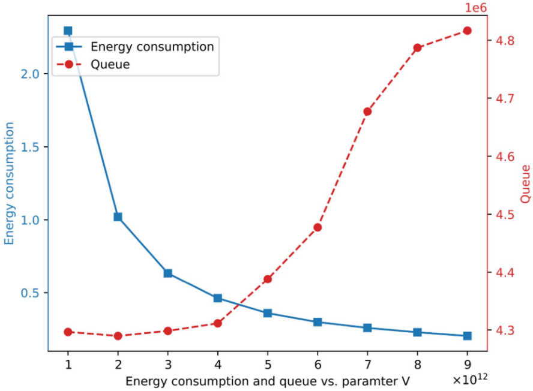

Fig. 3. The energy consumption and queue length with the different values of V .

1) Lyapunov-Guided DRL-Based Online Offloading $( L y -$ DROO 2021) [29]: LyDROO integrates DRL and Lyapunov optimization techniques to provide users with a binary offloading strategy. Since the algorithm does not consider user mobility, a greedy strategy is employed in the experiments, directing UAVs towards the closest point to the device center to enhance performance.

2) Joint Resource Allocation and Trajectory Optimization (JRATO 2023) [26]: JRATO algorithm adopts a mixed method of long and short time slots. In the long time slot, it uses the Stackelberg game approach for offloading decisions and flight area handling. In the short time slot, after decomposing the problem with Lyapunov, the trajectory and resource allocation are solved through Lagrangian dual theory and alternate optimization. This experiment adapts the original algorithm to the environment.

3) Random: As a baseline algorithm in comparative experiments, only the resource allocation part of Lypuanov is effective. JTORA’s SAC-based UAV trajectory solution is replaced with a random function to verify the contribution of trajectory optimization to the algorithm.

4) Ly-PPO: It is also a baseline algorithm in comparison experiment. In the DRL design part of the algorithm, Proximal Policy Optimization (PPO) is used to replace the SAC algorithm, and the rest is the same as JTORA.

## B. Parameter Analysis

1) Effect of Trade-off Parameter V: We use a range of different values of V from $1 \ \times 1 0 ^ { 1 2 } \mathrm { t o } 9 \times 1 0 ^ { 1 2 }$ to test the relationship 1 10 9 10between V and the energy consumption and task backlog of MUs. As a penalty function in the Lyapunov optimization framework, the function of V is to increase the proportion of energy consumption in the optimization objective. The larger the V , the smaller the energy consumption under the same conditions, but at the cost of increasing queue backlog. Fig. 3 shows the trend of energy consumption and queue changing with $V ,$ which is consistent with our theoretical analysis. Through the parameter analysis experiment, we select an appropriate trade-off factor $V = \dot { 5 } \times \dot { 1 0 } ^ { 1 2 }$ for subsequent experiments.

= 5 102) Convergence Evaluation of JTORA: In this part, we analyze the convergence of the JTORA algorithm. The UAV optimizes its objective by adjusting its position to reduce the energy consumption of the MUs and stabilize the virtual queues of both the MUs and itself. During the training process, the initial positions of the UAV and MUs are not fixed, making the algorithm adaptable to different environments. As shown in Fig. 4, we simulate 5 MUs and a UAV within a 500 × 500 coordinate plane and present four scenarios to demonstrate the UAV’s trajectory movement. From Fig 4(a) to (c), it shows the UAV’s trajectory adaptation to different initial positions. In the figures, all five MUs start from positions with an x-coordinate of 100, each with an initial velocity of 1m/s to the right, and they move randomly according to the Gaussian Markov movement model. The five MUs follow the same task arrival model. It can be observed that the UAV, starting from different initial points (50, 50), (250, 450), and (50, 450), moves towards the trajectory of the MUs, and after the service cycle, returns to the specified endpoint (500, 0). In Fig 4(d), we set the task arrival rate of MU1 to be 2.5 times that of the other MUs, making it hard for MU1 to stabilize its task queue. As shown in the figure, with the same initial position as Fig 4(a), the trajectory of the UAV shifts noticeably downward, moving closer to MU1. This is because in our reward function, the task queue backlog contributes significantly, causing the UAV to move towards MU1 in an attempt to provide better channel conditions to reduce the backlog.

<!-- image-->

<!-- image-->

(a) The UAV starting from (50,50) (b) The UAV starting from (250,450)  
<!-- image-->

<!-- image-->  
(c） The UAV starting from (50,450)(d) The MU 1 with more task backlog  
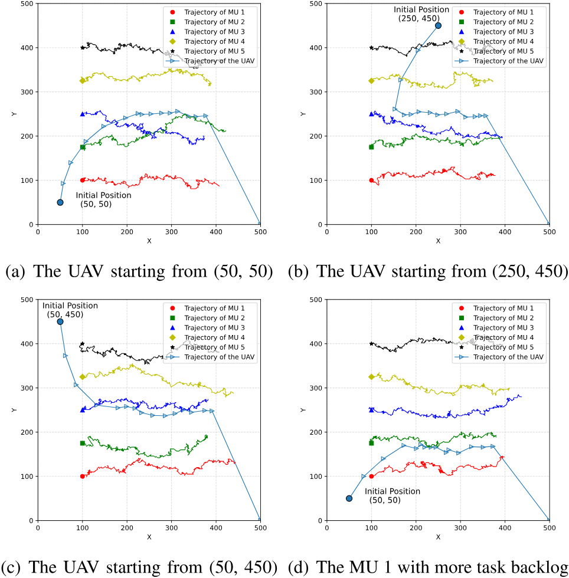

Fig. 4. Trajectories of UAVs and MUs with different initial positions of UAVs.

Additionally, as shown in Fig. 5, we also simulate the UAV’s trajectory when MUs move randomly. It can be seen that when the MUs move randomly, their positions tend to stay within a small area due to the uniform probability distribution. The UAV, starting from its initial point, makes only minor adjustments to its position after reaching an approximately optimal location. After the service slot ends, the UAV returns to the specified endpoint (500, 0).

From Figs. 6 to 7, we demonstrate the influence of different hyperparameters on convergence performance during the training process. We use four different buffer pool sizes ranging from 10,000 to 40,000, and observe that the size of the buffer pool had varying impacts on the speed of training convergence. Specifically, the fastest convergence was achieved with a buffer size of 30,000. Building on this, we further test the impact of batch size on convergence performance. It is found that the change in batch size has a significant effect on JTORA, with a batch size of 256 taking three times longer to converge compared to a batch size of 512. Overall, the TJORA algorithm, assisted by Lyapunov techniques, is able to converge rapidly in a relatively short amount of time.

<!-- image-->

<!-- image-->  
(a)MUs with random initial positions (b) MUs with random initial positions and movements and movements

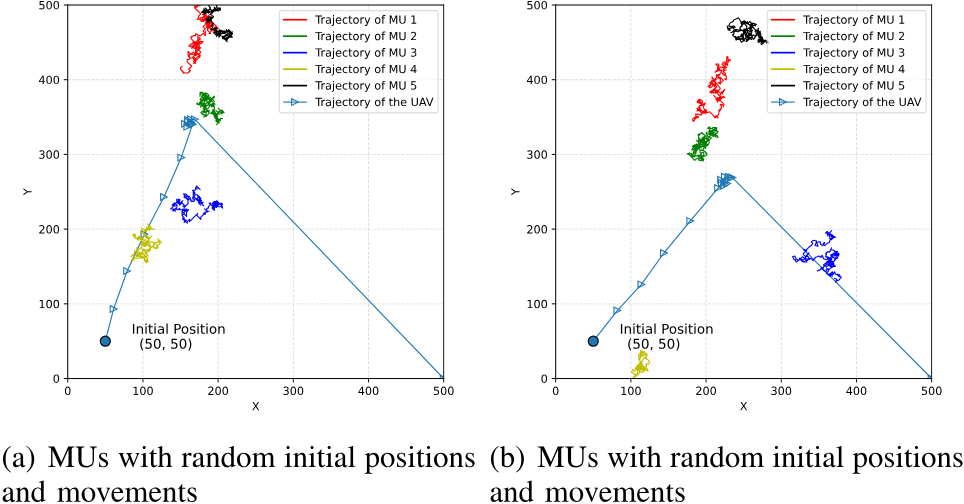

Fig. 5. Trajectories of UAVs and MUs with random movement of MUs.  
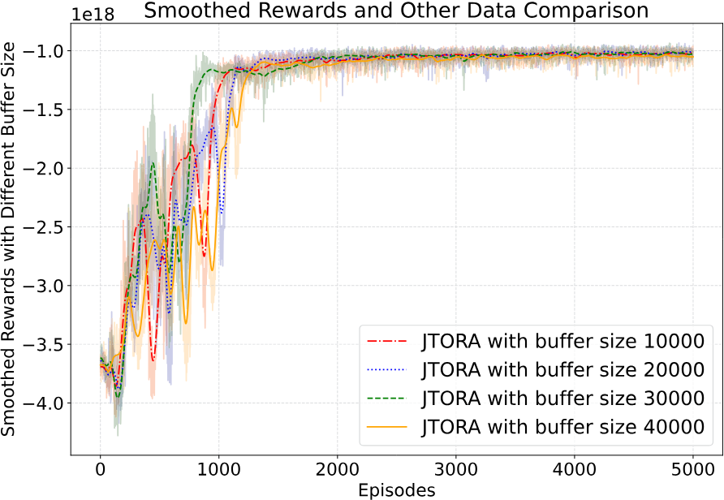

Fig. 6. The smoothed reward with the different buffer size.

1e18Smoothed Rewards and Other Data Comparison  
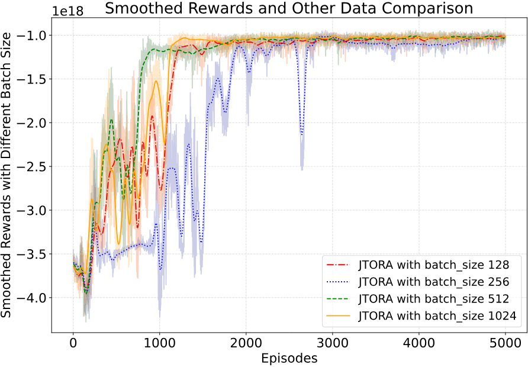

Fig. 7. The smoothed reward with the different batch size.

Average Energy Consumption with Different α (Scale Factor of Task Arrival Rates)  
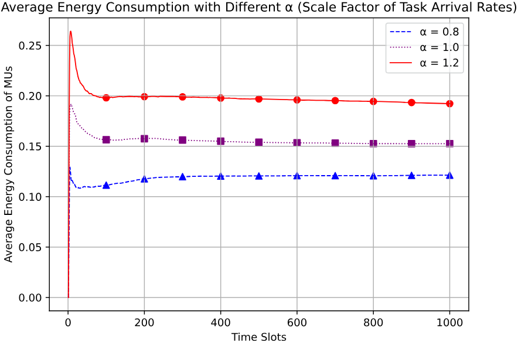

Fig. 8. The energy consumption of MUs with different rate.

Average Queue Length with Different α (Scale Factor of Task Arrival Rates)  
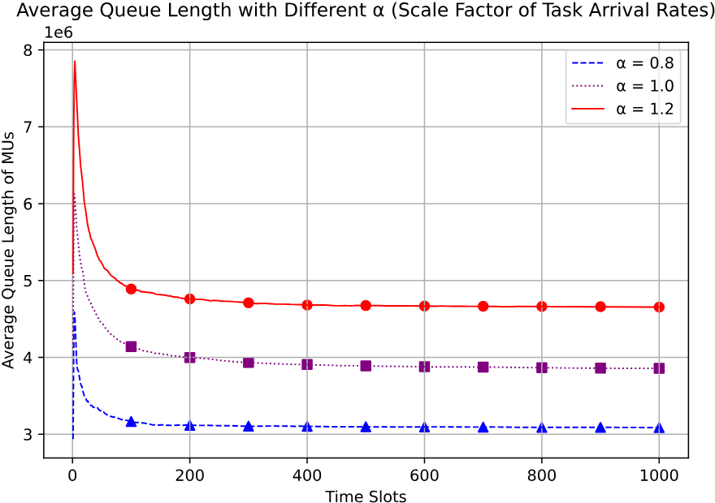

Fig. 9. The queue length of MUs with different rate.

## C. Comparison Experiment

1) Comparison With Different Rate: In this part, we test the convergence of the algorithm on energy consumption and queue under three different task arrival rate proportions, using 4 Mbit/s as the benchmark. The values α 0.8, 1.0, and 1.2 in the =legend of Fig. 8 indicate three scale factors for task arrival rates: 0.8 times, equal to, and 1.2 times the benchmark, respectively. As shown in Figs. 8 and 9, We show that the algorithm can adaptively adjust according to different task arrival rates to suit various situations. Moreover, when other variables remain constant, increasing the task arrival rate alone results in an increase in both energy consumption and the queue.

2) Comparison With Different Number of MUs: As shown in Figs. 10 and 11, we assess the algorithm’s adaptability to varying numbers of MUs. In Fig. 10, we observe that as the number of MUs increases, the energy consumption also grows which is due to the additional computational load on the UAV-assisted MEC system. Notably, even as the number of MUs reaches 25, the energy consumption continues to rise almost linearly, indicating that JTORA effectively scales with the increasing number of MUs and maintains efficient energy management. In Fig. 11, a similar trend is observed for the queue backlog. As the number of MUs increases, the backlog also grows. These results indicate that JTORA is capable of adapting to different scales of MU numbers while maintaining efficiency in both energy consumption and queue stability.

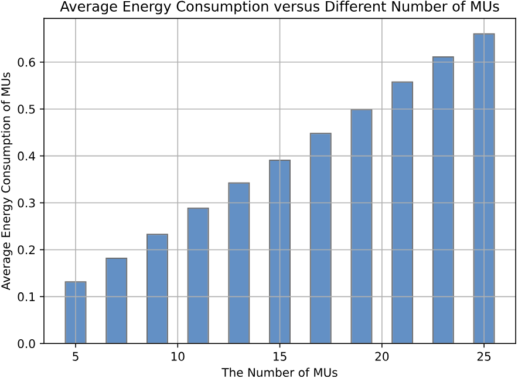

Fig. 10. Average energy consumption versus different number of MUs.

1e7Average Queue Length versus Different Number of MUs  
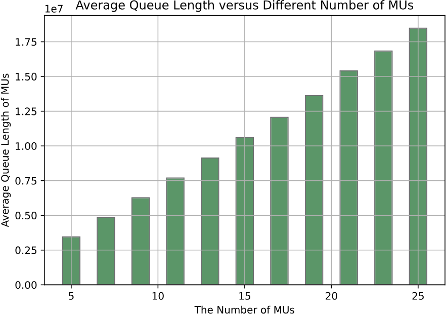

Fig. 11. Average queue length versus different number of MUs.

3) Comparison With Other Algorithm: In this part, we simulate the JTORA algorithm with four other algorithms under the same environmental conditions. We conduct tests using 1000 time slots to assess each algorithm’s effectiveness in reducing energy consumption and stabilizing the queue.

As shown in Figs. 12 and 13, it is observed that, except for the Random algorithm, the other algorithms are able to effectively control energy consumption and stabilize the queue. Among them, the JTORA algorithm performs the best in terms of reducing energy consumption and stabilizing the queue. The performance of the Random algorithm in the experiment indicates that relying solely on the Lyapunov algorithm is not effective in handling user mobility. Observing LyDROO-2021, this algorithm controls energy consumption poorly but is very effective in stabilizing the queue. This may be due to the selection of a greedy strategy that directly targets the central point in the trajectory optimization part of the algorithm, leading to its not-so-excellent performance in reducing energy consumption. JRATO is good in optimizing energy consumption but not sufficient in optimizing the queue. Ly-PPO is inferior to JTORA in both reducing energy consumption and controlling the queue, which is why JTORA is ultimately chosen as the proposed algorithm. In summary, comparative experiments shows that this algorithm can effectively improve the reduction of device energy consumption while ensuring UAV endurance and system stability.

Energy Consumption of Mobile Users  
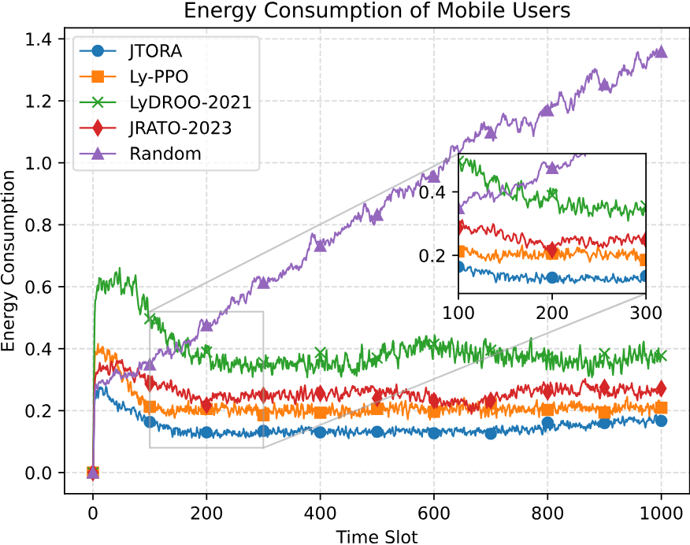

Fig. 12. The energy consumption of MUs with different algorithm.

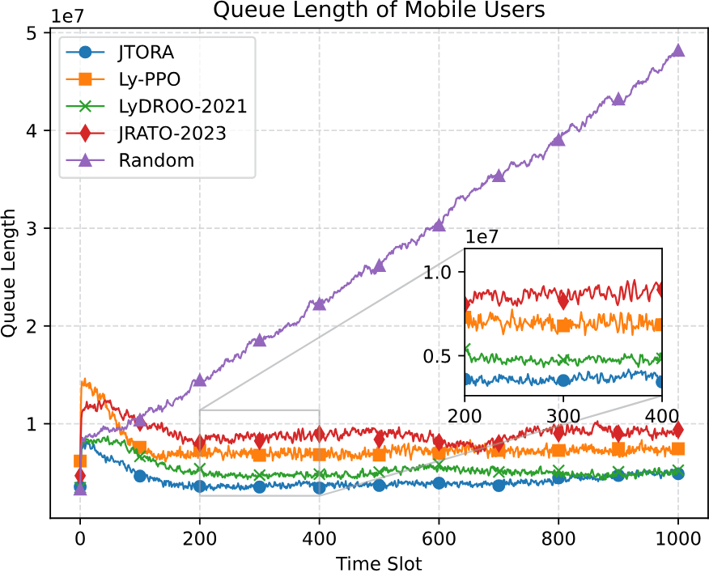

Fig. 13. The queue length of MUs with different algorithm.

## VIII. CONCLUSION

This paper studied the resource allocation and trajectory optimization problem in UAV-MEC systems with random channel conditions and task arrival rates. Considering the long-term constraints imposed on the system, we formulated the problem as a multi-stage MINLP problem to minimize energy consumption of MUs. We proposed the JTORA algorithm combined the advantages of DRL and Lyapunov optimization technology to solve the problem without the need for prior knowledge of conditions. By utilizing Lyapunov optimization technology, the problem was decoupled into multiple sub-problems for parallel solving, enhancing the efficiency of the solution. Utilizing DRL allowed for rapid response to environmental changes and the selection of UAV positions. Both theoretical and simulation results showed that the JTORA algorithm could adapt to different task arrival rates and MU numbers. In comparative experiments, our algorithm showed significant improvements in energy consumption reduction and queue stability compared to algorithms like LyDROO and JRATO.

In our future work, we will explore the integration of Multiagent Deep Reinforcement Learning (MADRL) and Lyapunov optimization techniques to address the issues of computation and communication resource allocation, as well as multi-UAV trajectory optimization, in multi-UAV-assisted systems.

## REFERENCES

[1] Y. Chen, J. Xu, Y. Wu, J. Gao, and L. Zhao, “Dynamic task offloading and resource allocation for NOMA-aided mobile edge computing: An energy efficient design,” IEEE Trans. Serv. Comput., vol. 17, no. 4, pp. 1492–1503, Jul./Aug. 2024.

[2] J. Huang, F. Liu, and J. Zhang, “Multi-dimensional qos evaluation and optimization of mobile edge computing for IoT: A survey,” Chin. J. Electron., vol. 33, no. 4, pp. 859–874, 2024.

[3] L. Tan, Z. Kuang, J. Gao, and L. Zhao, “Energy-efficient collaborative multi-access edge computing via deep reinforcement learning,” IEEE Trans. Ind. Inform., vol. 19, no. 6, pp. 7689–7699, Jun. 2023.

[4] J. Huang et al., “Incentive mechanism design of federated learning for recommendation systems in MEC,” IEEE Trans. Consum. Electron., vol. 70, no. 1, pp. 2596–2607, Feb. 2024.

[5] P. Lai et al., “Dynamic user allocation in stochastic mobile edge computing systems,” IEEE Trans. Serv. Comput., vol. 15, no. 5, pp. 2699–2712, Sep./Oct 2022.

[6] Y. Chen, Z. Liu, Y. Zhang, Y. Wu, X. Chen, and L. Zhao, “Deep reinforcement learning-based dynamic resource management for mobile edge computing in industrial Internet of Things,” IEEE Trans. Ind. Inform., vol. 17, no. 7, pp. 4925–4934, Jul. 2021.

[7] J. Huang, B. Ma, Y. Wu, Y. Chen, and X. Shen, “A hierarchical incentive mechanism for federated learning,” IEEE Trans. Mobile Comput., vol. 23, no. 12, pp. 12731–12747, Dec. 2024.

[8] M. B. Singh, H. Singh, and A. Pratap, “Stable matching based revenue maximization for federated learning in UAV-assisted WBANs,” IEEE Trans. Serv. Comput., vol. 17, no. 4, pp. 1835–1846, Jul./Aug. 2024.

[9] M. Liwang, Z. Gao, S. Hosseinalipour, Y. Su, X. Wang, and H. Dai, “Graphrepresented computation-intensive task scheduling over air-ground integrated vehicular networks,” IEEE Trans. Serv. Comput., vol. 16, no. 5, pp. 3397–3411, Sep./Oct. 2023.

[10] J. Huang, M. Zhang, J. Wan, Y. Chen, and N. Zhang, “Joint data caching and computation offloading in UAV-assisted internet of vehicles via federated deep reinforcement learning,” IEEE Trans. Veh. Technol., vol. 73, no. 11, pp. 17644–17656, Nov. 2024.

[11] Z. Chen, Y. Yang, J. Xu, Y. Chen, and J. Huang, “Task offloading and resource pricing based on game theory in UAV-assisted edge computing,” IEEE Trans. Serv. Comput., vol. 18, no. 1, pp. 440–452, Jan./Feb. 2025.

[12] Y. Chen, K. Li, Y. Wu, J. Huang, and L. Zhao, “Energy efficient task offloading and resource allocation in air-ground integrated mec systems: A distributed online approach,” IEEE Trans. Mobile Comput., vol. 23, no. 8, pp. 8129–8142, Aug. 2024.

[13] S. Fu, X. Feng, A. Sultana, and L. Zhao, “Joint power allocation and 3D deployment for UAV-BSS: A game theory based deep reinforcement learning approach,” IEEE Trans. Wireless Commun., vol. 23, no. 1, pp. 736–748, Jan. 2024.

[14] B. Chen, H. Zhou, J. Yao, and H. Guan, “RESERVE: An energy-efficient edge cloud architecture for intelligent multi-UAV,” IEEE Trans. Serv. Comput., vol. 15, no. 2, pp. 819–832, Mar./Apr. 2022.

[15] Y. Ding et al., “DDQN-based trajectory and resource optimization for UAV-aided MEC secure communications,” IEEE Trans. Veh. Technol., vol. 73, no. 4, pp. 6006–6011, Apr. 2024.

[16] Y. Zeng and J. Tang, “MEC-assisted real-time data acquisition and processing for UAV with general missions,” IEEE Trans. Veh. Technol., vol. 72, no. 1, pp. 1058–1072, Jan. 2023.

[17] Z. Yang, S. Bi, and Y.-J. A. Zhang, “Online trajectory and resource optimization for stochastic UAV-enabled MEC systems,” IEEE Trans. Wireless Commun., vol. 21, no. 7, pp. 5629–5643, Jul. 2022.

[18] K. Zheng, G. Jiang, X. Liu, K. Chi, X. Yao, and J. Liu, “DRLbased offloading for computation delay minimization in wireless-powered multi-access edge computing,” IEEE Trans. Commun., vol. 71, no. 3, pp. 1755–1770, Mar. 2023.

[19] Y. Chen, J. Zhao, Y. Wu, J. Huang, and X. S. Shen, “Multi-user task offloading in UAV-assisted leo satellite edge computing: A game-theoretic approach,” IEEE Trans. Mobile Comput., vol. 24, no. 1, pp. 363–378, Jan. 2025.

[20] B. Liu, C. Liu, and M. Peng, “Resource allocation for energy-efficient MEC in NOMA-enabled massive IoT networks,” IEEE J. Sel. Areas Commun., vol. 39, no. 4, pp. 1015–1027, Apr. 2021.

[21] J. Zhu, J. Wang, Y. Huang, F. Fang, K. Navaie, and Z. Ding, “Resource allocation for hybrid NOMA MEC offloading,” IEEE Trans. Wireless Commun., vol. 19, no. 7, pp. 4964–4977, Jul. 2020.

[22] Z. Yu, Y. Gong, S. Gong, and Y. Guo, “Joint task offloading and resource allocation in UAV-enabled mobile edge computing,” IEEE Internet Things J., vol. 7, no. 4, pp. 3147–3159, Apr. 2020.

[23] Y. Ding et al., “Online edge learning offloading and resource management for UAV-assisted MEC secure communications,” IEEE J. Sel. Topics Signal Process., vol. 17, no. 1, pp. 54–65, Jan. 2023.

[24] Z. Ning et al., “Dynamic computation offloading and server deployment for UAV-enabled multi-access edge computing,” IEEE Trans. Mobile Comput., vol. 22, no. 5, pp. 2628–2644, May 2023.

[25] F. Song et al., “Evolutionary multi-objective reinforcement learning based trajectory control and task offloading in UAV-assisted mobile edge computing,” IEEE Trans. Mobile Comput., vol. 22, no. 12, pp. 7387–7405, Dec. 2023.

[26] Y. Zeng, S. Chen, Y. Cui, J. Yang, and Y. Fu, “Joint resource allocation and trajectory optimization in UAV-enabled wirelessly powered mec for large area,” IEEE Internet Things J., vol. 10, no. 17, pp. 15705–15722, Sep. 2023.

[27] Y. Xu, T. Zhang, Y. Liu, D. Yang, L. Xiao, and M. Tao, “Cellular-connected multi-UAV MEC networks: An online stochastic optimization approach,” IEEE Trans. Commun., vol. 70, no. 10, pp. 6630–6647, Oct. 2022.

[28] Z. Yang, S. Bi, and Y.-J. A. Zhang, “Dynamic offloading and trajectory control for UAV-enabled mobile edge computing system with energy harvesting devices,” IEEE Trans. Wireless Commun., vol. 21, no. 12, pp. 10515–10528, Dec. 2022.

[29] S. Bi, L. Huang, H. Wang, and Y.-J. A. Zhang, “Lyapunov-guided deep reinforcement learning for stable online computation offloading in mobileedge computing networks,” IEEE Trans. Wireless Commun., vol. 20, no. 11, pp. 7519–7537, Nov. 2021.

[30] Y. Yang, Y. Chen, K. Li, and J. Huang, “Carbon-aware dynamic task offloading in NOMA-enabled mobile edge computing for IoT,” IEEE Internet Things J., vol. 11, no. 9, pp. 15723–15734, May 2024.

[31] Y. Zeng, J. Xu, and R. Zhang, “Energy minimization for wireless communication with rotary-wing UAV,” IEEE Trans. Wireless Commun., vol. 18, no. 4, pp. 2329–2345, Apr. 2019.

[32] X. Hu, K.-K. Wong, K. Yang, and Z. Zheng, “UAV-assisted relaying and edge computing: Scheduling and trajectory optimization,” IEEE Trans. Wireless Commun., vol. 18, no. 10, pp. 4738–4752, Oct. 2019.

[33] Y. Liu, K. Xiong, Q. Ni, P. Fan, and K. B. Letaief, “UAV-assisted wireless powered cooperative mobile edge computing: Joint offloading, CPU control, and trajectory optimization,” IEEE Internet Things J., vol. 7, no. 4, pp. 2777–2790, Apr. 2020.

[34] W. D. Cook and R. J. Webster, “Carathéodory’s theorem,” Can. Math. Bull., vol. 15, no. 2, pp. 293–293, 1972.

<!-- image-->

Ying Chen (Senior Member, IEEE) received the PhD degree in computer science and technology from Tsinghua University, Beijing, China, in 2017. She was a joint PhD student with the University of Waterloo, Waterloo, ON, Canada from 2016 to 2017. She is a professor with the Computer School, Beijing Information Science and Technology University, Beijing. Her current research interests include Internet of Things, mobile edge computing, wireless networks and communications, machine learning, etc. She is the recipient of the Best Paper Award with IEEE

SmartIoT 2019, the 2016 Google PhD Fellowship Award, and the 2014 Google Anita Borg Award, 2022 Outstanding Contribution Award in 18th EAI CollaborateCom, respectively. She is/was the leading guest editor of JCC, TPC member of IEEE HPCC, and PC member of IEEE Cloud, CollaborateCom, IEEE CPSCom, CSS, etc. She is also the reviewer of several journals such as the IEEE Wireless Communications, IEEE Transactions on Dependable and Secure Computing, IEEE Internet of Things Journal, IEEE Transactions on Cloud Computing, IEEE Transactions on Services Computing.

<!-- image-->

Yaozong Yang received the BEng degree in software engineering from the Zhengzhou University, Zhengzhou, China. He is currently working toward the MEng degree in computer science and technology, the Beijing Information Science and Technology University, Beijing, China. His current research interests include edge computing, Internet of Things, game theory, and reinforcement learning.

<!-- image-->

Yuan Wu (Senior Member, IEEE) received the PhD degree in electronic and computer engineering from the Hong Kong University of Science and Technology, Hong Kong, in 2010. He is currently an associate professor with the State Key Laboratory of Internet of Things for Smart City, University of Macau, Macao SAR, China, and also with the Department of Computer and Information Science, University of Macau. His research interests include resource management for wireless networks, edge computing and edge intelligence, and green communications and computing.

He was the recipient of the Best Paper Award from the IEEE ICC’2016, IEEE TCGCC’2017, IWCMC’2021, and IEEE WCNC’2023. Dr. Wu is on the editorial board of IEEE Transactions on Vehicular Technology, IEEE Transactions on Network Science and Engineering, and IEEE Internet of Things Journal.

<!-- image-->

Jiwei Huang (Senior Member, IEEE) received the BEng and PhD degrees in computer science and technology from Tsinghua University, in 2009 and 2014, respectively. He was a visiting scholar with the Georgia Institute of Technology. Currently, he is a professor and associate dean of the College of Artificial Intelligence at China University of Petroleum (Beijing), a member of the Hainan Institute of China University of Petroleum (Beijing), and the director of the Beijing Key Laboratory of Petroleum Data Mining. His research areas include services computing,

Internet of Things, and edge computing. He has published one book and more than 70 papers in international journals and conference proceedings, including IEEE Transactions on Mobile Computing, IEEE Transactions on Services Computing, IEEE Transactions on Cloud Computing, IEEE Transactions on Vehicular Technology, ACM SIGMETRICS, IEEE ICWS, and IEEE SCC. He currently serves on the editorial boards of the Chinese Journal of Electronics and Scientific Programming.

<!-- image-->

Lian Zhao (Fellow, IEEE) received the PhD degree from the Department of Electrical and Computer Engineering (ELCE), University of Waterloo, Canada, in 2002. She joined the Department of Electrical and Computer Engineering with the Toronto Metropolitan University (formerly Ryerson University), Canada, in 2003. Her research interests are in the areas of wireless communications, resource management, mobile edge computing, caching and communications, and IoV networks. She has been an IEEE Communication Society (ComSoc) and IEEE Vehicular Technology

(VTS), Distinguished Lecturer (DL); received the Best Land Transportation Paper Award from IEEE Vehicular Technology Society, in 2016, Top 15 Editor Award, in 2016 for IEEE Transaction on Vehicular Technology, Best Paper Award from the 2013 International Conference on Wireless Communications and Signal Processing (WCSP), and the Canada Foundation for Innovation (CFI) New Opportunity Research Award, in 2005. She has been serving as an editor for IEEE Transactions on Wireless Communications, IEEE Internet of Things Journal, and IEEE Transactions on Vehicular Technology (2013-2021).

---

## 📷 Images

The following images were extracted from this PDF:

1. [[../extracted_images/Joint_Trajectory_Optimization_and_Resource_Allocation_in_UAV-MEC_Systems_A_Lyapunov-Assisted_DRL_Approach/page_3_img_1.jpeg|page_3_img_1]]
2. [[../extracted_images/Joint_Trajectory_Optimization_and_Resource_Allocation_in_UAV-MEC_Systems_A_Lyapunov-Assisted_DRL_Approach/page_7_img_1.png|page_7_img_1]]
3. [[../extracted_images/Joint_Trajectory_Optimization_and_Resource_Allocation_in_UAV-MEC_Systems_A_Lyapunov-Assisted_DRL_Approach/page_10_img_1.jpeg|page_10_img_1]]
4. [[../extracted_images/Joint_Trajectory_Optimization_and_Resource_Allocation_in_UAV-MEC_Systems_A_Lyapunov-Assisted_DRL_Approach/page_14_img_1.jpeg|page_14_img_1]]
5. [[../extracted_images/Joint_Trajectory_Optimization_and_Resource_Allocation_in_UAV-MEC_Systems_A_Lyapunov-Assisted_DRL_Approach/page_14_img_2.jpeg|page_14_img_2]]
6. [[../extracted_images/Joint_Trajectory_Optimization_and_Resource_Allocation_in_UAV-MEC_Systems_A_Lyapunov-Assisted_DRL_Approach/page_14_img_3.jpeg|page_14_img_3]]
7. [[../extracted_images/Joint_Trajectory_Optimization_and_Resource_Allocation_in_UAV-MEC_Systems_A_Lyapunov-Assisted_DRL_Approach/page_14_img_4.jpeg|page_14_img_4]]
8. [[../extracted_images/Joint_Trajectory_Optimization_and_Resource_Allocation_in_UAV-MEC_Systems_A_Lyapunov-Assisted_DRL_Approach/page_14_img_5.jpeg|page_14_img_5]]

---
