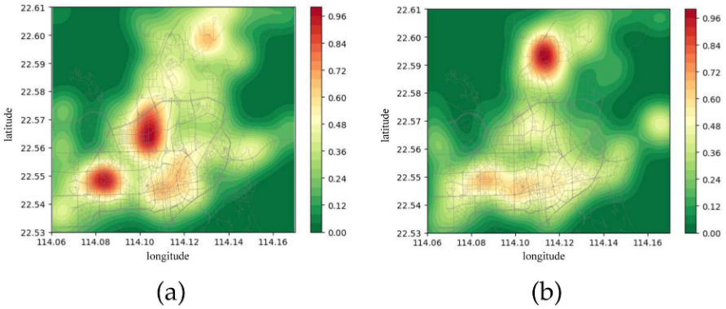
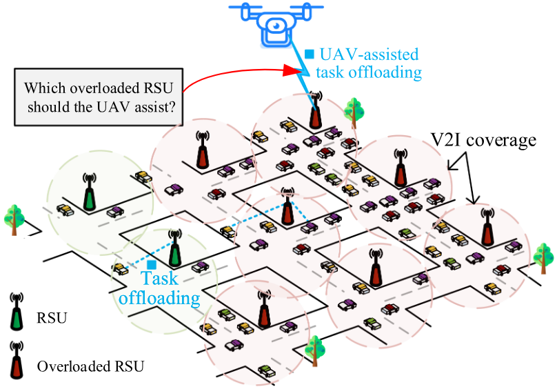
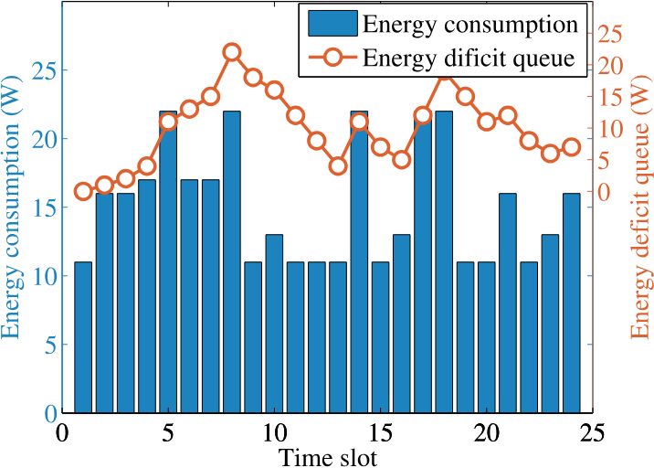
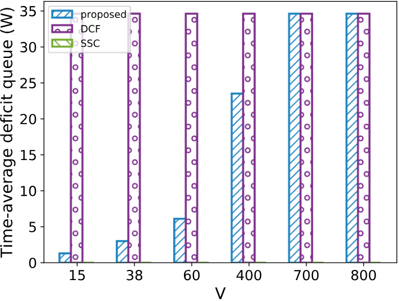
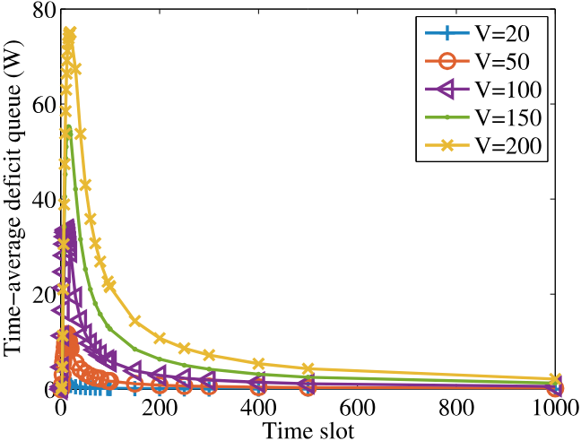
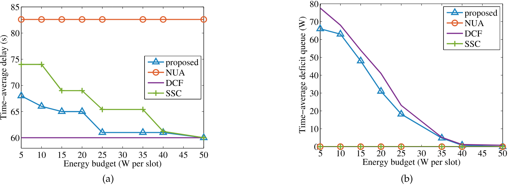
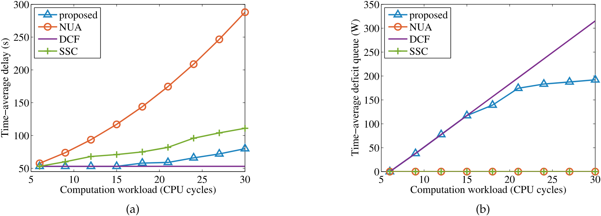
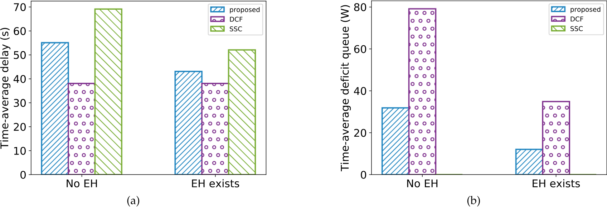
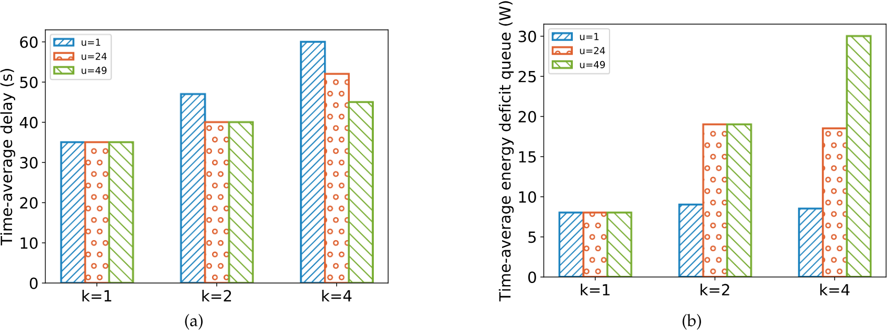

# UAV-Assisted Task Offloading in Vehicular Edge Computing Networks

Xingxia Dai , Zhu Xiao , Senior Member, IEEE, Hongbo Jiang , Senior Member, IEEE, and John C. S. Lui , Fellow, IEEE

Abstract—Vehicular edge computing (VEC) provides an effective task offloading paradigm by pushing cloud resources to the vehicular network edges, e.g., road side units (RSUs). However, overloaded RSUs are likely to occur especially in urban aggregation areas, possibly leading to greatly compromised offloading performance. Inspired by this, this article explores this situation by introducing an unmanned aerial vehicle (UAV) to address the VEC overload problem. Specifically, we formulate a novel online UAV-assisted vehicular task offloading problem to minimize vehicular task delay under the long-term UAV energy constraint. To solve the formulated problem, we first decouple the long-term energy constraint based on the Lyapunov optimization technique. In this way, the problem can be solved in a real-time manner without requiring future information. Then, we construct a Markov chain based on Markov approximation optimization to find out the close-to-optimal UAV-assisted offloading strategies. Furthermore, we derive a mathematical analysis to rigorously demonstrate the offloading performance of the proposed algorithm. Additionally, the simulation results show that the proposed method outperforms the baselines by significantly reducing the vehicular task delay constrained by the long-term UAV energy budget under various system parameters, such as the energy budget and computation workloads.

Index Terms—Lyapunov optimization, Markov approximation, UAV-assisted task offloading.

<a id="image-index"></a>
## 图像索引

本索引由 `raw/scripts/establish_image_links.py` 根据注释导出的图片标注解析生成。图片目录总览见 [dai2024UAVAssistedTaskOffloading/README.md](../assets/dai2024UAVAssistedTaskOffloading/README.md#asset-index)。

| 图号/表号 | 论文定位 | 资源文件 | 说明 |
| --- | --- | --- | --- |
| [Fig. 1](#fig-1) | p. 2 | [M28TWP4F.png](../assets/dai2024UAVAssistedTaskOffloading/M28TWP4F.png) | Computation workload distribution in Futian district, Shenzhen. (a) 9:00. (b) 15:00. RSUs located in areas with dark red reflect that the RSUs are highly overloaded. |
| [Fig. 2](#fig-2) | p. 4 | [FIRRH5ET.png](../assets/dai2024UAVAssistedTaskOffloading/FIRRH5ET.png) | System model. Vehicles offload their computing-hungry tasks to RSUs to achieve small task delay. When the RSUs are overloaded, the UAV will select an overloaded RSU to deliver offloading services. |
| [Table I](#table-1) | p. 4 | [B9ISLT9L.png](../assets/dai2024UAVAssistedTaskOffloading/B9ISLT9L.png) | Main notations |
| [Fig. 4](#fig-4) | p. 11 | [BSIGDJ74.png](../assets/dai2024UAVAssistedTaskOffloading/BSIGDJ74.png) | Time-average vehicular task delay with different V. |
| [Fig. 5](#fig-5) | p. 11 | [GWRAH7XM.png](../assets/dai2024UAVAssistedTaskOffloading/GWRAH7XM.png) | Time-average energy deficit queue with different V. |
| [Table II](#table-2) | p. 11 | [Z8EZWI5E.png](../assets/dai2024UAVAssistedTaskOffloading/Z8EZWI5E.png) | Parameters setting |
| [Fig. 3](#fig-3) | p. 11 | [DF4DBM9D.png](../assets/dai2024UAVAssistedTaskOffloading/DF4DBM9D.png) | Effect of the energy deficit queue. |
| [Fig. 6](#fig-6) | p. 11 | [ZQBBMFRT.png](../assets/dai2024UAVAssistedTaskOffloading/ZQBBMFRT.png) | Time-average energy deficit queue across time slots. |
| [Fig. 7](#fig-7) | p. 12 | [RGJLST5K.png](../assets/dai2024UAVAssistedTaskOffloading/RGJLST5K.png) | Impact of energy budget. (a) Time-average vehicular task delay. (b)Time-average energy deficit queue. |
| [Fig. 8](#fig-8) | p. 13 | [CHWILGTG.png](../assets/dai2024UAVAssistedTaskOffloading/CHWILGTG.png) | Impact of computation workloads. (a) Time-average vehicular task delay. (b)Time-average energy deficit queue. |
| [Fig. 9](#fig-9) | p. 13 | [UA8IX8Z2.png](../assets/dai2024UAVAssistedTaskOffloading/UA8IX8Z2.png) | Impact of EH. (a) Time-average vehicular task delay. (b)Time-average energy deficit queue. |
| [Fig. 10](#fig-10) | p. 13 | [342JGHK5.png](../assets/dai2024UAVAssistedTaskOffloading/342JGHK5.png) | Impact of the number of UAVs. (a) Time-average vehicular task delay. (b)Time-average energy deficit queue. |


## I. INTRODUCTION

W ITH the rapid advancement of mobile computation andsensor technologies, internet of vehicles (IoV) has been sensor technologies,internet of vehicles (IoV) has been

Manuscript received 11 October 2021; revised 21 November 2022; accepted 16 March 2023. Date of publication 20 March 2023; date of current version 6 March 2024. This work was supported in part by the National Natural Science Foundation of China under Grants 62272152 and U20A20181, in part by the Humanities and Social Sciences Foundation of the Ministry of Education under Grant 21YJCZH183, in part by the Key R&D Project of Hunan Province of China under Grant 2022GK2020, in part by the Hunan Natural Science Foundation of China under Grant 2022JJ30171, in part by the Open Research Fund from Guangdong Laboratory of Artificial Intelligence and Digital Economy [Shenzhen (SZ)] under Grants GML-KF-22-22 and GML-KF-22-23, in part by CAAI-Huawei MindSpore Open Fund, in part by the Shenzhen Science and Technology Program under Grant JCYJ20220530160408019, and in part by the Guangdong Basic and Applied Basic Research Foundation under Grant 2023A1515011915. (Corresponding authors: Zhu Xiao; Hongbo Jiang.)

Xingxia Dai, Zhu Xiao, and Hongbo Jiang are with the College of Computer Science and Electronic Engineering, Hunan University, Changsha, Hunan 410082, China, and also with the Shenzhen Research Institute, Hunan University, Shenzhen 518055, China (e-mail: xingxdai718@gmail.com; zhxiao@hnu.edu.cn; hongbojiang2004@gmail.com).

John C. S. Lui is with the Department of Computer Science & Engineering, Chinese University of Hong Kong, Shatin, N.T., Hong Kong (e-mail: cslui@cse.cuhk.edu.hk).

Digital Object Identifier 10.1109/TMC.2023.3259394 a promising paradigm for the future 6G era [1]. It has the potential of spurring the proliferation of many emerging vehicular applications, such as mobile augmented reality and autonomous driving. To support computing-hungry and delaysensitive applications, vehicles equipped with various advanced onboard sensors will be a requirement to run sophisticated software and algorithms, e.g., real-time trajectory tracking, navigation positioning, and environmental recognition. The processing consumes tremendous vehicular computation resources and battery power. Although the computing capabilities of vehicles are more substantial than those of portable mobile devices, computing-hungry applications still pose significant challenges for onboard vehicular processing. For example, a mobile augmented reality application demands 40 billion computation cycles and completion within 10 milliseconds, while local on-board processing produces several hundred milliseconds. Even for companies like NVidia developing vehicle’s onboard units with high computation capabilities, the post-production upgrades are still generally not profitable [2]. Furthermore, on-board processing affects the vehicular driving range. For instance, a modern electric vehicle with a 2 kW computing system can cause a  reduction in the driving range during rush hour [3].

To address the above issues, vehicular edge computing (VEC) has been extensively studied [4], [5], [6], [7], [8], [9]. In VEC networks, vehicles can offload the computing-hungry applications to vehicular edge servers (e.g., road side units (RSUs)) for execution to achieve reduced processing delay and lower energy consumption. We present a typical example of autonomous driving as follows. For an autonomous vehicle driving on the street, many real-time driving tasks with heavy computation workloads need to be executed, such as the video recognition task for the detection of surrounding traffic conditions and the online path planning task for intelligent driving decision-making. However, due to the complex traffic environment and limited vehicular computing ability, the on-board processing causes prolonged response time, leading to low driving efficiency, and may even cause autonomous driving accidents [10]. To cope with this dilemma, VEC is introduced to guarantee the response delay by allowing autonomous vehicles to offload real-time tasks (e.g., sensor data fusion and perception analysis) to the RSUs, thereby realizing a more efficient task processing and reliable autonomous driving [11].

Unfortunately, RSUs perform poorly when they are located in urban aggregation areas [12]. More explicitly, a presence in an urban aggregation areas indicates that, the vehicle density is likely large, and excessive computation requests could be initiated [13]. Accordingly, the RSUs with constrained computing capabilities in these areas are unable to handle the computation requests that may come from a number of computing-hungry vehicular tasks. Taking a real-world example of IoV trajectory dataset in Shenzhen city [12], [14], these trajectories reflect the vehicular movements in the VEC networks. On this basis, we can obtain the number of vehicles within the selected areas during the period. For a selected area in VEC networks, its computation workloads are determined by both the vehicular numbers and the task arrivals. By combining the vehicular trajectories with the vehicular task arrivals, we can obtain the computation workloads of the selected area. Guided by this, we visualize the distribution of the vehicle computation workloads as illustrated in Fig. 1. The dark red denotes the urban aggregation area, in which VEC overload [15], [16] occurs, namely, large computation workloads exceed the computing capabilities of the RSUs. Under these circumstances, the RSUs have to alleviate the excessive computation workloads from vehicles through queuing, postponing or even refusing, which inevitably degrades the quality of service (QoS).

<!-- image-->  
(a)

<!-- image-->  
(b)  


<a id="fig-1"></a>
Fig. 1. Computation workload distribution in Futian district, Shenzhen. (a) 9:00. (b) 15:00. RSUs located in areas with dark red reflect that the RSUs are highly overloaded.

We observe that the computation workloads of RSUs follow the first law of geography [12], [17]. To be exact, as shown in Fig. 1, the RSUs located in the center of the hot zone (i.e., the aggregated area) have the largest vehicular task computation workloads and are likely overloaded [13], and their neighboring RSUs have large workloads since they are a short distance from the center. The cooperation method [18], [19] may provide a solution in which the overloaded RSUs ask for help from their neighbors with abundant computing resources. However, this solution suffers from a degraded task offloading performance in exploiting the collaborative computing resources. Alternatively, the RSUs need to cross several different RSUs to receive cooperation, which creates additional communication costs between the RSUs and a series of other issues, including path selection, service continuity, and trust risk [15], [20].

Furthermore, it is noted that due to the time-varying characteristics of the aggregation effect [12], the locations of the overloaded RSUs change over time, depending on their serving of the vehicle density and the vehicular task arrivals. To address these issues, existing works [21], [22] explore the opportunity by introducing an external assistant to solve the VEC overload problem, such as a cloud server. In a cloud-assisted scenario, the excessive computation workloads can be further offloaded from the RSUs to the remote cloud server. Nevertheless, cloud computing incurs large transmission delay due to the long communication distance between the RSUs and the cloud server. In addition, a vast amount of data transmission will impose a great burden on the already-congested core network. Motivated by the limitations of the existing methods as well as the characteristics of vehicular computation workloads, a more agile and efficient approach needs to be proposed.

In this article, we introduce an unmanned aerial vehicle (UAV) to liberate the overloaded RSUs from the heavy computation workloads. Note that if the overloaded RSUs in the hot zone center can be offered an offloading service by the UAV, the computing pressure in this area will be significantly reduced. To that end, we strive to develop a novel vehicular task offloading scheme with the inclusion of UAV-assisted edge computing. In particular, a UAV equipped with edge servers enables edge computing, thus providing an offloading service for the overloaded terrestrial RSUs [23]. The common line-of-sight (LoS) communications between the UAV and terrestrial RSUs desirably empower effective air-land connectivity, which will not impact the original network environment but can also achieve low delay. Furthermore, thanks to its high mobility and agility, a UAV can adapt its location in response to the varying computation workloads among the RSUs, thereby offering an effective offloading service.

Despite the existing UAV-assisted offloading efforts in the literature [24], [25], [26], [27], [28], few works propose a specific UAV-assisted VEC framework for vehicular task offloading, where the two main challenges are faced. (i) The long-term UAV’s energy constraint. The performance of a UAV is mainly restricted by its available energy since its behavior has to conform to an energy budget for a long time. If a UAV currently consumes too much energy, the available energy for the following time slots will be reduced. As a result, the long-term UAV-assisted task offloading performance would be greatly degraded. (ii) Intractable UAV-assisted offloading decisions. It is challenging to determine the optimal UAV-assisted offloading decisions in VEC networks. Specifically, the overloaded RSUs act as UAV-assisted candidates, while the candidates change across time slots due to the varying task computation workloads. In addition, even though the abovementioned long-term constraint problem can be solved, the time-coupling characteristic remains and complicates UAV-assisted offloading.

To address the abovementioned challenges, this article studies UAV-assisted vehicular task offloading in VEC networks, where we aim to minimize the vehicular task delay under the long-term energy constraint of the UAV. The contributions of this article are summarized as follows.

- We study the UAV-assisted vehicular task offloading problem in VEC networks. To address the long-term UAV’s energy constraint, we develop an online method to transfer the long-term energy constraint to a real-time solvable constraint by constructing an energy deficit queue based on the Lyapunov optimization technique (detailed in Section V-A). Moreover, we prove that the method achieves close-to-optimal performance compared with the optimal method with all of the future information (e.g., vehicular task arrivals) while bounding the violation of the UAV’s energy consumption constraints.

We leverage the Markov approximation optimization technique to solve the intractable UAV-assisted task offloading problem (detailed in Section V-B). To that end, we introduce the task offloading probability distribution and convex log-sum-exp function to transform the vehicular task delay minimization problem into a Markov approximation optimization problem, where a Markov chain is constructed to achieve effective UAV-assisted task offloading.

- We conduct extensive simulations and the results validate the effectiveness of our proposed methods under various system parameters, such as the energy budget, deficit queue, and computation workloads, in terms of the vehicular task delay and the long-term UAV energy consumption.

The remainder of the paper is organized as follows. Section II presents the related works, followed by the system models and a problem formulation in Sections III and IV. Section V presents the online UAV-assisted task offloading. In Section VI, we present the performance evaluations. Finally, we conclude this article in Section VII.

## II. RELATED WORKS

In this section, we review the related works on task offloading in VEC networks, existing solutions for VEC overload, and UAV-assisted task offloading.

## A. Task Offloading in VEC Networks

By pushing cloud resources to the vehicular network edges, VEC enables the delivery of offloading services for computinghungry vehicular tasks. On this basis, previous studies have investigated task offloading in VEC environments[4], [5], [6], [16], [29], [30], [31], [32]. The authors in [4] investigate partial computation offloading and adaptive task scheduling, with the goal of achieving the optimal transmission scheduling discipline and offloading ratio. The authors in [5] design a priority-based resource allocation scheme in the VEC system under bursty task arrivals. The authors in [6] perform self-learning based distributed computation offloading to make computation offloading decisions for IoV, without requiring the assistance of any centralized controller. The authors in [16] propose a novel vehicle-mounted edge mechanism to maximize the completed tasks through comprehensive consideration of path planning and resource allocation. The authors in [29] present a two-layer cloud and RSU offloading architecture, aiming at maximizing the task completion ratio with strict delay constraints. The authors in [30] design a learning-based offloading scheme, enabling neighboring vehicles to learn the offloading delay performance in a vehicular edge computing system. In this way, the minimal average task offloading delay can be achieved. The authors in [31] investigate a cooperative task offloading scheme by jointly considering the task migration and heterogeneous computing capabilities, aiming at minimizing the service delay. The authors in [32] propose an offloading algorithm based on deep reinforcement learning, with the goal of maximizing the QoE for vehicle users.

Although these works attain satisfactory performance under the corresponding scenarios, they neglect the fact that a vehicular edge server has limited computation resources. Once the requested computation workloads exceed the computing capabilities of the vehicular edge server (i.e., VEC overload), the QoS of the vehicular tasks will greatly deteriorate and the expected performance cannot be guaranteed.

## B. Existing Solutions to VEC Overload

To resolve VEC overload, there are two main existing solutions. The solutions take the VEC resource constraints into consideration in task offloading to avoid suboptimal offloading strategies and unpredictable degraded offloading performance. One solution is cloud-assisted task offloading [33], where the cloud serves as a backup server for processing the task computation workloads from vehicular edge servers. Although a cloud has powerful computing capabilities, cloud-assisted offloading inevitably incurs large task transmission delay due to the prolonged network distance between the vehicular edges and the cloud. The other solution is VEC cooperation [18], [20], [34], [35], which involves one-hop and multihop cooperation. The authors in [18], [34] consider one-hop VEC cooperation, namely, the excessive workloads can be offloaded to a nearby vehicular edge server with redundant computing resources. Constrained by the limited cooperative coverage, the approach may cause compromised performance in exploiting collaborative computing resources, especially for the aggregated areas of a city. For that reason, several works involving [15], [20] focus on multihop VEC cooperation, where tasks can be further offloaded from the current vehicular edge servers to several vehicular edge servers across multiple edge nodes. Unfortunately, the multihop cooperation inherently attracts extra communication cost and incurs service continuity and trust risk problems. Since the existing solutions are incapable of effectively addressing the VEC overload, other methods need to be proposed.

## C. UAV-Assisted Task Offloading

Recently, UAV-assisted task offloading has attracted increasing attention [24], [25], [26], [26], [35], [36], [37], [38], where UAVs enable the delivery of offloading services for computinghungry tasks. For instance, the authors in [24] study that the UAV provides offloading services for IoT mobile devices, aiming at minimizing the entire energy consumption of the end devices. The authors in [25] propose a computation rate maximization problem in the UAV-enabled MEC system, where the UAV provides offloading services for mobile users. The authors in [26] develop a UAV-assisted relaying and edge computing framework, where a UAV acts as a computing node for task offloading or a relay for further offloading. The authors in [35] optimize the UAV energy and task processing rate under long-term data queue stability in a UAV-enabled MEC system, without requiring future knowledge of the task data and energy arrivals. The authors in [36] jointly consider service placement, UAV movement trajectory, task scheduling, and computation resource allocation for UAV-enabled mobile edge computing, aiming to minimize the overall energy consumption of mobile users under task latency and resource constraints. The authors in [37] investigate the optimal trajectory and CPU frequency under a UAV-assisted edge computing framework to minimize the UAV’s energy consumption. The authors in [38] consider the cooperation of the edge computing stations and UAVs, where the edge computing stations provide computation resources for the UAVs and the UAVs process the offloaded tasks from mobile users with the allocated computation resources. Through cooperation, satisfactory quality of services can be realized.

<!-- image-->  


<a id="fig-2"></a>
Fig. 2. System model. Vehicles offload their computing-hungry tasks to RSUs to achieve small task delay. When the RSUs are overloaded, the UAV will select an overloaded RSU to deliver offloading services.

Clearly, the aforementioned works concentrate either on a UAV-enabled system, where a UAV provides offloading service to end-users directly [24], [25], [35], [36], [37], or a UAV relay system by introducing a UAV to act as a relay for mobile users [26], [38]. To achieve these goals, the accurate location information of mobile users is required for UAV-assisted task offloading approaches, while the exact information is difficult to predict or obtain in real-world VEC scenarios. Furthermore, once the UAV flies away without the tasks being completed, the task offloading performance will inevitably be greatly degraded. Different from these works, we consider a UAV-assisted offloading scenario, where the UAV assists the overloaded RSUs rather than serving the end vehicles directly or acting as a relay. In this way, changing location information of the mobile vehicles is not required for the UAV. Moreover, when the UAV leaves for another aggregation area, the related vehicular tasks in the former aggregation area can be processed by the RSUs.

## III. SYSTEM MODELS

Fig. 2 illustrates an edge computing ecosystem in the VEC networks. The operational timeline in our system is discretized into time slots $( 0 , \ldots , t \ldots , T - 1 )$ with duration $\Delta .$ The VEC (0 1) Δsystem consists of three layers, the vehicle layer, the RSU layer, and the UAV layer. Vehicle $v \in \mathcal V$ generates computing-hungry tasks and offloads the tasks to RSU $m \in \mathcal { M }$ via vehicle-toinfrastructure (V2I) communication links. When the computation workloads exceed the RSU’s computing capacity, VEC overload occurs. To handle this problem, a UAV equipped with edge servers is introduced to deal with the excessive computation workloads from the overloaded terrestrial RSUs. Similar to most existing studies, such as [36], [37], we assume that UAV u flies at a fixed altitude H and its position at time slot t is denoted as $( x _ { u } ^ { t } , y _ { u } ^ { t } , H )$ . The main notations are illustrated in Table I.

<table><tr><td>Notation</td><td>Description</td></tr><tr><td>T</td><td>Number of time slots</td></tr><tr><td> $\nu , \mathcal { M }$ </td><td>Set of vehicles and RSUs,respectively</td></tr><tr><td> $V , M$ </td><td>Number of vehicles and RSUs,respectively</td></tr><tr><td> $( x _ { u } ^ { t } , y _ { u } ^ { t } , H )$ </td><td>The location ofUAV u at time slot t</td></tr><tr><td> $\lambda _ { v } ^ { t }$ </td><td>The task arrival rate of vehicle v at time slot t</td></tr><tr><td>Vt  $\stackrel { \nu } { \scriptscriptstyle \sum } \stackrel { m } { }$ </td><td>The vehicle set within the coverage of RSU m</td></tr><tr><td> $\textstyle \sum _ { v \in \mathcal { V } _ { m } } \lambda _ { v } ^ { t } c$ </td><td>Computation workloads of RSU m</td></tr><tr><td> $\textstyle \sum _ { v \in \mathcal { V } _ { m } } \lambda _ { v } ^ { t } d$ </td><td>Task data bits of RSU m</td></tr><tr><td> $r _ { m , v } ^ { t } , T _ { t r a n s } ^ { m , t }$ </td><td>Transmission rate and delay of RSU m</td></tr><tr><td> $K ^ { t }$ </td><td>The number of the overloaded RSUs</td></tr><tr><td> $( x _ { k } , y _ { k } , H _ { 0 } )$ </td><td>The location of overloaded RSU k</td></tr><tr><td>st</td><td>The UAV offloading decision</td></tr><tr><td> $c _ { k } ^ { \hat { t } } , d _ { k } ^ { t }$ </td><td>Computationworkloads and data bits from RSU k</td></tr><tr><td> $r _ { u , k } ^ { i } , T _ { t r a n s } ^ { u , k , t }$ </td><td>Transmission rate and delay of UAV u</td></tr><tr><td> ${ _ { T } } u , k , t$   $T _ { c o m p }$ </td><td>The computation delay of UAV u</td></tr><tr><td> $E _ { c o m n } ^ { u , k , t }$ </td><td>The energy consumption of UAV u</td></tr><tr><td> $T _ { c o m p } ^ { m , t }$ </td><td>The computation delay of RSU m</td></tr><tr><td> $T ^ { u , k , \hat { t } }$   $\boldsymbol { { \mathit { 1 } } _ { o u t p u t } ^ { } }$ </td><td>The outputs&#x27; delay of UAV u</td></tr><tr><td> $T _ { o u t p u t }$ </td><td>The outputs&#x27; delay of RSU m</td></tr><tr><td> $v _ { u } ^ { t } , \boldsymbol { \dot { e } } ^ { t }$ </td><td>Flight speed and energy packets arrivals of the UAV</td></tr></table>

<a id="table-1"></a>
TABLE I MAIN NOTATIONS

## A. System Characteristics

The UAV-assisted VEC system is unique regarding the following characteristics.

- First, this system emphasizes delay-sensitive and computing-hungry vehicular task offloading. Specifically, these vehicular tasks must be completed within strict deadlines (delay-sensitive), and processing these tasks inevitably consumes a large amount of computing resources (computing-hungry). As a result, a vehicle with limited computing resources is incapable of processing the tasks in time, and hence, it is critical to offload these tasks to the RSUs to achieve small task delay.

Second, this system pays particular attention to the effect of the computation workloads. The computation workloads change across time slots, initiated from dynamic vehicle density and different vehicular task arrivals. When an RSU has excessive computation workloads, the vehicular tasks may be queued, postponed, or even refused. Consequently, liberating an RSU from heavy computation workloads is important for satisfactory QoS.

Third, the UAV acts as an aerial edge server to provide offloading service for overloaded terrestrial RSUs in the system. Once the UAV provides offloading service for the overloaded RSU in the hot zone, the computing pressure in this area will be greatly relieved. In addition, unlike conventional backup servers (e.g., clouds), the UAV is near the overloaded RSUs, and its location can be adjusted to follow the changing computation workloads.

## B. Vehicular Task Offloading Model

Task arrivals are assumed to be a Poisson process [18]. We use $\lambda _ { v } ^ { t }$ (in task number per time slot) to denote the task arrival rate of vehicle v at time slot t. Without loss of generality, we assume that the expected computation workloads and data size for one task could be performed as c (in required CPU cycles per task) and d (in date bits per task). Correspondingly, ${ \lambda } _ { v } ^ { t } c$ and $\lambda _ { v } ^ { t } d$ are the task computation workloads and data bits of vehicle v at time slot t, respectively.

When implementing vehicular task offloading, the vehicular tasks are transmitted to the RSUs using orthogonal frequency division multiple access (OFDMA) scheme. On this basis, each RSU’s bandwidth resources are divided into multiple orthogonal subchannels and each subchannel can be allocated to at most one vehicle. Thus, we ignore the intra-cell interference among vehicles and consider inter-cell interference. Denote $\Upsilon _ { m , \iota } ^ { t }$ as Υthe inter-cell interference when RSU m assigns a subchannel to vehicle v for task transmission at time slot t.

$$
\Upsilon _ { m , v } ^ { t } = \sum _ { i \in \mathcal { M } \backslash \{ m \} } \sum _ { j \in \mathcal { V } \backslash \mathcal { V } _ { m } ^ { t } } P _ { i , j } ^ { t } H _ { i , j } ^ { t } ,\tag{1}
$$

where $i \in \mathcal { M } \backslash \{ m \}$ and $j \in \mathcal { V } \backslash \mathcal { V } _ { m } ^ { t }$ denote the RSU set except RSU m and the vehicle set other than vehicles within the radio coverage of RSU $m ,$ respectively. $P _ { i , j } ^ { t }$ and $H _ { i , j } ^ { t }$ represent the transmission power and channel gain when vehicular tasks are offloaded from RSU i to vehicle j at time slot t. Thus, the transmission rate (in Mbits per second) between RSU m and vehicle v at time slot t is expressed as:

$$
r _ { m , v } ^ { t } = B _ { m , v } ^ { t } l o g _ { 2 } ( 1 + \frac { H _ { m , v } ^ { t } P _ { m , v } ^ { t } } { ( \sigma _ { m , v } ^ { t } ) ^ { 2 } + \Upsilon _ { m , v } ^ { t } } ) , m \in \boldsymbol { \mathcal { M } } , t \in \mathcal { T } ,\tag{2}
$$

where $B _ { m , v } ^ { t } , ~ H _ { m , v } ^ { t } , ~ P _ { m , v } ^ { t } ,$ and $\sigma _ { m , v } ^ { t }$ represent the channel bandwidth, channel gain, transmission power, and noise power between vehicle v and RSU m at time slot t, respectively. Hence, the transmission delay from the vehicles to RSU m at time slot t can be expressed as:

$$
T _ { t r a n s } ^ { m , t } = \sum _ { v \in \mathcal { V } _ { m } ^ { t } } \frac { \lambda _ { v } ^ { t } d } { r _ { m , v } ^ { t } } , m \in \mathcal { M } , t \in \mathcal { T } ,\tag{3}
$$

where $\gamma _ { m } ^ { t }$ represents the vehicle set within the V2I communication coverage of RSU m at time slot t.

After vehicular task offloading, we ascertain that the total task arrival rate of RSU m at time slot t is $\textstyle \sum _ { v \in \mathcal { V } _ { m } ^ { t } } \lambda _ { v } ^ { t }$ . Correspondingly, $\sum _ { v \in \mathcal { V } _ { m } ^ { t } } \lambda _ { v } ^ { t } c$ and $\textstyle \sum _ { v \in \mathcal { V } _ { m } ^ { t } } \lambda _ { v } ^ { t } d$ denote the computation workloads and data bits of RSU m at time slot t, respectively. Constrained by the limited computing resources of the RSUs, VEC overload occurs (those RSUs are marked in red in Fig. 2) when the computation workloads exceed the RSU’s computing capacity. Denote ${ \boldsymbol { \mathcal { K } } } ^ { t }$ as the set of overloaded RSUs at time slot t $( K ^ { t } \leq M )$ . The location of overloaded RSU k is assumed to be constant with altitudes of $H _ { 0 }$ on the ground, and its horizontal coordinates are expressed as $l _ { k } = ( x _ { k } , y _ { k } ) , k \in K ^ { t }$

## C. UAV-Assisted Offloading Model

To solve the VEC overload problem, we introduce a UAV to deal with the excessive computation workloads from the overloaded RSUs. The UAV provides an offloading service for a single overloaded RSU $k \in \mathcal { K } ^ { t }$ per time slot. We denote $s _ { k } ^ { t } \in \{ 0 , 1 \}$ as the UAV offloading decision. When $s _ { k } ^ { t } = 1$ , the 0 1 = 1UAV provides an offloading service for the overloaded RSU k at time slot t; if $s _ { k } ^ { t } = 0$ , RSU k is not selected at time slot t. Let $c _ { k } ^ { t }$ (in required CPU cycles per time slot) and $d _ { k } ^ { t }$ (in data bits per time slot) represent the task computation workloads and the data size that offload from overloaded RSU k to the UAV at time slot t, respectively. Since the offloaded tasks cannot exceed the overall tasks of the RSU, the following constraints need to be satisfied.

$$
c _ { k } ^ { t } \leq \sum _ { v \in \mathcal { V } _ { m } ^ { t } } \lambda _ { v } ^ { t } c , k \in K ^ { t } , t \in \mathcal { T } ,\tag{4}
$$

$$
d _ { k } ^ { t } \leq \sum _ { v \in \mathcal { V } _ { m } ^ { t } } \lambda _ { v } ^ { t } d , k \in K ^ { t } , t \in \mathcal { T } .\tag{5}
$$

Then, the vehicular tasks will be transmitted from the overloaded RSU k to the UAV for processing. The wireless channel between the UAV and the overloaded RSU k is assumed to be dominated by the probabilistic LoS channel. We denote the probability of a LoS channel between overloaded RSU k and UAV u at time slot t as $\epsilon _ { u , k } ^ { t } ,$ which is determined by the environment-related parameters and the elevation angle of UAV [35].

$$
\epsilon _ { u , k } ^ { t } = \frac { 1 } { 1 + \mu _ { 1 } \exp ( - \mu _ { 2 } ( \beta _ { u , k } ^ { t } - \mu _ { 1 } ) ) } ,\tag{6}
$$

where $\mu _ { 1 }$ and $\mu _ { 2 }$ are both environment-related parameters, and βtu,k $. ( H - H _ { 0 } / \Vert l _ { u } ^ { t } - l _ { k } ^ { t } \Vert )$ represents the elevation an-= arctan( )gle when UAV u delivers the offloading services for overloaded RSU k at time slot t. As such, the channel gain is given by:

$$
g _ { u , k } ^ { t } = \frac { g _ { 0 } ( \epsilon _ { u , k } ^ { t } + \zeta ( 1 - \epsilon _ { u , k } ^ { t } ) ) } { ( ( H - H _ { 0 } ) ^ { 2 } + \| l _ { u } ^ { t } - l _ { k } \| ^ { 2 } ) } ,\tag{7}
$$

where $g _ { 0 }$ is the gain when the reference distance $l _ { 0 } =$ m, parameter ζ is an attenuation factor of the NLoS channel, $l _ { u } ^ { t } = ( x _ { u } ^ { t } , y _ { u } ^ { t } )$ and $l _ { k } = ( x _ { k } , y _ { k } )$ represent the horizontal coordinates of UAV u = ( )and overloaded RSU k, respectively. On this basis, the offloaded vehicular tasks are transmitted from the overloaded RSU k to UAV u at time slot t. The transmission rate (in Mbits per second) is expressed as:

$$
r _ { u , k } ^ { t } = B _ { u , k } ^ { t } l o g _ { 2 } \left( 1 + \frac { g _ { u , k } ^ { t } P _ { u , k } ^ { t } } { ( \sigma _ { u , k } ^ { t } ) ^ { 2 } } \right) ,\tag{8}
$$

where $B _ { u , k } ^ { t } , \ g _ { u , k } ^ { t } , \ P _ { u , k } ^ { t }$ and $\sigma _ { u , k } ^ { t }$ represent the transmission rate, channel bandwidth, channel gain, transmission power, and noise power between overloaded RSU k and UAV u at time slot t, respectively. Correspondingly, the transmitting delay is expressed as:

$$
T _ { t r a n s } ^ { u , k , t } = \frac { d _ { k } ^ { t } } { r _ { u , k } ^ { t } } , k \in { \cal K } ^ { t } , t \in { \cal T } .\tag{9}
$$

At the same time, the UAV arrives at position $( x _ { k } , y _ { k } , H )$ ( )to provide offloading services for the selected overloaded RSU k at the beginning of time slot t. Let $f ^ { u }$ (in CPU cycles per second) denote the computing ability of UAV u. We obtain the

UAV-assisted task computation delay:

$$
T _ { c o m p } ^ { u , k , t } = \frac { c _ { k } ^ { t } } { f ^ { u } } , k \in { \cal K } ^ { t } , t \in { \cal T } .\tag{10}
$$

Accordingly, the computation energy consumed by UAV u at time slot t can be obtained as:

$$
E _ { c o m p } ^ { u , k , t } = b ( f ^ { u } ) ^ { 2 } c _ { k } ^ { t } , k \in \mathcal { K } ^ { t } , t \in \mathcal { T } ,\tag{11}
$$

where b is the energy coefficient of the UAV which relies on the chip architecture.

The remaining computation workloads without UAV processing will be processed by the related RSUs. We denote $f ^ { m }$ (in CPU cycles per second) as the computing ability of RSU m. The computation delay conducted by RSU m is:

$$
T _ { c o m p } ^ { m , t } = \frac { \sum _ { v \in \mathcal { V } _ { m } ^ { t } } \lambda _ { v } ^ { t } c - s _ { k } ^ { t } i _ { k } ^ { m } c _ { k } ^ { t } } { f ^ { m } } , m \in \mathcal { M } , t \in \mathcal { T } ,\tag{12}
$$

where $i _ { k } ^ { m }$ is used to denote whether RSU m is exactly the overloaded RSU k $( i _ { k } ^ { m } = 1 )$ or not $( i _ { k } ^ { m } = 0 )$ . When $i _ { k } ^ { m } = 1$ and $s _ { k } ^ { t } = 1 , c _ { k } ^ { t }$ = 1 = 0 = 1reflects the computation workloads offloaded from = 1RSU m (i.e., RSU k) to the UAV at time slot t.

Additionally, the queue delay needs to be taken into consideration for the overloaded RSUs due to network congestion, and we use M/M/ queue theory to model the process [18]:

$$
T _ { q u e u e } ^ { k , t } = \frac { \tau } { 1 - \tau \xi } , k \in K ^ { t } , t \in \mathcal { T } ,\tag{13}
$$

where $\tau = d / r _ { k , v } ^ { t }$ denotes the expected delay for transmitting =one task from vehicle v to the overloaded RSU k without network congestion, and $\begin{array} { r } { \xi = \sum _ { v \in \mathcal { V } _ { k } } \lambda _ { v } ^ { t } d - d _ { k } ^ { t } } \end{array}$ represents the remaining =data bits of overloaded RSU k.

After task processing, the UAV produces $o ^ { t } d _ { k } ^ { t }$ bits of task output data for overloaded RSU k, where $o ^ { t }$ is the task input-output ratio at time slot t. Then, the UAV will send the task-output data back to overloaded RSU k with the duration of $T _ { o u t p u t } ^ { u , k , t } .$ Furthermore, overall RSUs need to feedback the task-output data to the vehicles to complete the vehicular tasks. Denote the feedback delay from RSU m to the vehicles at time slot t as:

$$
T _ { o u t p u t } ^ { m , t } = \sum _ { v \in \mathcal { V } _ { m } ^ { t } } \frac { o ^ { t } \lambda _ { v } ^ { t } d } { r _ { o u t p u t } ^ { m , v , t } } , m \in \mathcal { M } , t \in \mathcal { T } ,\tag{14}
$$

where $r _ { o u t p u t } ^ { m , v , t }$ (in Mbits per second) is the data transmission rate from RSU m to vehicle v at time slot t.

Note that the UAV stays hovering within finite time to receive data, perform edge computing and feedback the task output for overloaded RSU k. Thus, the corresponding energy consumption is $E _ { h o v e r } ^ { u , k , t } = \psi _ { u } ^ { t } ( T _ { t r a n s } ^ { u , k , t } + T _ { c o m p } ^ { u , k , t } + T _ { o u t p u t } ^ { u , \tilde { k } , t } )$ , where $\psi _ { u } ^ { t }$ is a = ( + +constant energy value per second [39].

Furthermore, UAV u arrives at overloaded RSU $k _ { 2 }$ from overloaded RSU $k _ { 1 }$ at the next time slot due to varying computation workloads. To achieve this, UAV u adjusts its flight speed. We assume that UAV u flies with a constant speed $\ v { v } _ { u } ^ { t }$ per time slot but can be adjusted across time slots.

$$
{ v _ { u } ^ { t } } = \frac { \| l _ { u } ^ { t + 1 } - l _ { u } ^ { t } \| } { \Delta } , t \in \mathcal { T } .\tag{15}
$$

The propulsive energy (i.e., fly energy) is consumed to keep UAV u in the air at time slot t, which is expressed as

$$
E _ { f l y } ^ { u , k , t } = \varpi \| v _ { u } ^ { t } \| ^ { 2 } , t \in \mathcal { T } .\tag{16}
$$

where $\varpi$ is related to the weight of the UAV [24].

## D. UAV Energy Harvesting Model

Short battery life sharply degrades the UAV offloading performance. As a solution, energy harvesting (EH) technology is applied to UAV-assisted task offloading, where the UAV often harvests radio frequency (RF) energy to alleviate the UAV’s energy burden [40]. However, RF-based energy harvesting may be severely degraded due to the path loss in practical UAVassisted task offloading scenarios. Thus, we extend the harvesting process and look for other renewable energy (e.g., wind and solar energy) to compensate for the UAV’s energy [41], [42]. The EH process is modeled as successive energy packet arrivals, and the arrivals are assumed to be independent and identically distributed [41]. Although the model is simple, it retains the stochastic and intermittent nature of the harvested energy packets. We denote $e ^ { t }$ to reflect the energy packet arrivals at the UAV at the beginning of time slot t.

$$
0 \leq e ^ { t } \leq e _ { \operatorname* { m a x } } ^ { t } , t \in \mathcal { T } ,\tag{17}
$$

where $e _ { \mathrm { m a x } } ^ { t }$ represents the maximum available energy packets captured by the UAV at time slot t.

UAV u is assumed to be fully charged at the initial time slot, and its energy budget per time slot is expressed as:

$$
\bar { E } _ { u } = \frac { E _ { \mathrm { m a x } } ^ { u } } { T } ,\tag{18}
$$

where $E _ { \mathrm { m a x } } ^ { u }$ indicates the fully charged energy of the UAV. Overall, UAV’s energy consumption at time slot t is:

$$
E _ { u } ^ { t } = E _ { c o m p } ^ { u , k , t } + E _ { h o v e r } ^ { u , k , t } + E _ { f l y } ^ { u , k , t } , k \in \mathcal { K } ^ { t } , t \in \mathcal { T } .\tag{19}
$$

The long-term energy constraint should be satisfied:

$$
\frac { 1 } { T } \sum _ { t = 0 } ^ { T - 1 } \mathbb { E } \{ E _ { u } ^ { t } - e ^ { t } \} \le \bar { E } _ { u } .\tag{20}
$$

Note that the extra energy of $e ^ { t }$ supplemented by EH cannot exceed UAV’ energy consumption of $E _ { u } ^ { t }$ at time slot t.

## E. Assumptions

In Sections III-B, III-C, and III-D, we present vehicular task offloading, UAV-assisted offloading, and UAV EH models. In this section, we detail assumptions before problem formulation.

- To simplify, we assume that each vehicular task is identical in the expected data bits and computation workloads. The assumption is motivated by the fact that moving vehicles often have similar task requests[43]. Despite the simplified assumption, a varying distribution of the computation workloads can be depicted by combining the assumption with different vehicular task arrivals. As such, such an assumption is adopted in existing studies, including [18].

- Moreover, we assume a homogeneous computing environment by ignoring the effect of specific hardware on computation workloads. In many existing studies, e.g., [35], [44], [45], such an assumption is general.

- Without loss of generality, we assume that the ground is at zero altitude [26]. On this basis, the overloaded RSUs have a constant altitude of $H _ { 0 } .$ , and the UAV flies at a fixed altitude of H. Guided by these, we analyzed the task delay and UAV’s energy consumption during a UAV-assisted task offloading trip, detailed in Section III-C.

. Similar to many previous works [12], [37], [44], [45], a quasi-static scenario is considered within the duration of each time slot, where the requested computation tasks and edge computing capabilities remain unchanged during the duration but can be changed across different time slots.

## IV. PROBLEM FORMULATION

Recall that for Section III, the task delay is expressed as:

$$
T _ { u } ^ { t } = T _ { R S U } ^ { t } + T _ { U A V } ^ { t } , t \in \mathcal { T } ,\tag{21}
$$

where $\begin{array} { r } { T _ { R S U } ^ { t } = \sum _ { m \in \mathcal { M } } T _ { t r a n s } ^ { m , t } + T _ { c o m p } ^ { m , t } + T _ { q u e u e } ^ { k , t } + T _ { o u t p u t } ^ { m , t } } \end{array}$ is = + + +the task delay conducted by the RSU-enabled offloading, and $\begin{array} { r } { T _ { U A V } ^ { t } = \sum _ { k \in \mathcal { K } ^ { t } } T _ { t r a n s } ^ { u , k , t } + \dot { T } _ { c o m p } ^ { u , k , t } + T _ { o u t p u t } ^ { u , k , t } } \end{array}$ is the task delay = + +performed by UAV-assisted offloading.

Our objective is to minimize vehicular task delay under the long-term energy constraint of the UAV by adjusting UAVassisted offloading strategies $\boldsymbol { s } _ { k } ^ { t }$ . Formally, the optimization problem is formulated as:

$$
\begin{array} { r l } { { \bf P 1 } } & { \displaystyle \operatorname* { m i n } _ { s _ { k } ^ { t } } \frac { 1 } { T } \sum _ { t = 0 } ^ { T - 1 } \mathbb E \{ T _ { u } ^ { t } \} , } \\ { \mathrm { s . t . ~ } } & { ( 4 ) , ~ ( 5 ) , ~ ( 1 7 ) , ~ ( 2 0 ) . } \end{array}\tag{22}
$$

Constraints (4) and (5) denote that the offloaded tasks cannot exceed task arrivals. Cconstraint (17) denotes that the energy packets captured by EH technology have a maximum value. Constraint (20) shows that offloading strategies are constrained by the long-term UAV energy budget.

Remarks. It is not straightforward to solve P1 directly since the following two challenges remain. i) The long-term energy constraint in (20) substantially complicates the UAV-assisted offloading strategies. In the long-term optimization problem, the overall offline information (e.g., task arrivals and captured energy packets) is required for solving P1. However, such information is difficult to acquire, if not impossible in real-world UAV-assisted VEC scenarios. ii) Discrete UAV-assisted offloading strategies cause a non-convex optimization problem. Worse still, the UAV-assisted offloading strategies are coupled across time slots due to the temporal correlation of the remaining UAV energy. If UAV u consumes too much energy at time slot t, its remaining available energy would be less, which complicates the derivation of the optimal solutions to P1.

To address the above-mentioned challenges, we design an online UAV-assisted task offloading approach rather than solving the original long-term problem P1 directly. The approach enables vehicular task offloading in a real-time manner without foreseeing future information, which is detailed in the next section.

## V. ONLINE UAV-ASSISTED TASK OFFLOADING

In this section, we propose online UAV-assisted vehicular task offloading algorithms based on the Lyapunov optimization technique and Markov approximation methods. After that, we analyze the algorithm’ performance.

## A. Online Problem Transformation via the Lyapunov Optimization Technique

Since the long-term UAV’s energy budget impedes the derivation of the solutions to P1, we construct a virtual UAV energy deficit queue to decouple the long-term UAV’s energy constraint based on the Lyapunov optimization technique [46]. We define the virtual energy deficit queue as:

$$
\begin{array} { r } { B _ { u } ^ { t + 1 } = \operatorname* { m a x } \{ B _ { u } ^ { t } + E _ { u } ^ { t } - e ^ { t } - \bar { E } _ { u } , 0 \} , t \in \mathcal { T } , } \end{array}\tag{23}
$$

where $E _ { u } ^ { t }$ is the energy consumption of the UAV, et is the energy captured by the EH technique, and $\bar { E } _ { u }$ is the energy budget for the UAV at time slot t. Clearly, the energy deficit queue is a non-negative indicator that reflects the energy violation of the UAV at each time slot. When the UAV consumes excessive energy, the energy deficit queue will enlarge; in other words, more energy violation incurs. The deficit queue at the initial time slot is set as zero, i.e., $B _ { u } ^ { 0 } = 0$

= 0Based on the UAV energy deficit queue, we apply the Lyapunov drift-plus-penalty framework to P1 and hence derive the following online optimization problem:

$$
\begin{array} { r l } & { \mathbf { P 2 } \quad \underset { s _ { k } ^ { t } } { \operatorname* { m i n } } V \cdot T _ { u } ^ { t } + B _ { u } ^ { t } \cdot E _ { u } ^ { t } . } \\ & { } \\ & { \mathrm { s . t . } ( 4 ) , ( 5 ) , ( 1 7 ) . } \end{array}\tag{24}
$$

Remarks. The optimization problem P2 is liberated from the long-term energy constraint (20) compared with P1. Therefore, P2 can be solved in an online manner, not requiring overall offline information. In the online optimization problem, the objectives are vehicular task delay of $T _ { u } ^ { t }$ and UAV’s energy consumption of $E _ { u } ^ { t }$ , which are weighted by the control parameter V and the energy deficit queue $B _ { u } ^ { t }$ , respectively. By reasonably adjusting the weighted factors, a well-tradeoff between vehicular task delay and UAV’s energy budget can be realized. Specifically, the control parameter V provides a static adjustment, which is fixed in UAV-assisted vehicular task offloading. A larger V facilitates reducing vehicular task delay. We will discuss the impact of the parameter V in Sections VI-B and VI-C. Furthermore, the energy deficit queue of $B _ { u } ^ { t }$ delivers a dynamic control, which varies due to different energy consumption of the UAV. A larger energy deficit queue indicates the less remaining energy of the UAV. Consequently, the UAV intends to reduce its energy consumption at the following time slots. In this way, an online UAV’s energy adjustment can be achieved in the optimization problem P2. We will discuss the impact of the energy deficit queue in Section VI-A. By solving the online optimization problem, satisfactory UAV-assisted offloading strategies of P1 can be identified and the performance gap between P1 and P2 will be analyzed in Section V-C.

```powershell
Algorithm 1: Online UAV-Assisted Vehicular Task
Offloading.
Input :The energy deficit queue $B _ { u } ^ { 0 } = 0 ,$ the
control parameter $\dot { V }$ and the computation
workloads of RSUs.
Output: The optimal UAV-assisted vehicular task
offloading decision $\boldsymbol { s } _ { \ast } ^ { t }$
1 for $t = 0$ to $t = T - 1$ do
2 Obtain the information of vehicular task
arrivals and captured energy packets.
3 Solve P2 to obtain the optimal UAV-assisted
offloading strategy of $\bar { s } _ { * } ^ { t }$ by minimizing
$V \cdot T _ { u } ^ { t } + \mathbf { \breve { B } } _ { u } ^ { t } \cdot E _ { u } ^ { t }$ at time slot t.
4 Update the UAV energy deficit queue:
$\stackrel { . } { B } { } _ { u } ^ { t + 1 } = m a x \{ B _ { u } ^ { t } + \stackrel { \smile } { E } _ { u } ^ { t } - e ^ { t } - \stackrel { . } { E } _ { u } , 0 \} .$
5 end
6 return the optimal UAV-assisted offloading
strategy of $\bar { \boldsymbol { s } } _ { \ast } ^ { t }$ at time slot t.
```

Guided by this, we present the online Algorithm 1 to solve the task delay minimization problem under the long-term UAV energy constraint. In the algorithm, the UAV determines its offloading strategy by solving the online optimization problem P2.

## B. Markov Approximation for UAV-Assisted Task Offloading in VEC Networks

Note that P2 is still difficult to solve in practical VEC scenarios since the UAV-assisted offloading strategy $\boldsymbol { s } _ { k } ^ { t }$ is a discrete decision variable. As a solution, we leverage the Markov approximation algorithm to transfer P2 to the following formulation inspired by the analysis in [47]:

$$
\mathbf { P 3 } \quad \operatorname* { m i n } _ { \mathcal { P } \geq 0 } \sum _ { s _ { k } ^ { t } \in \mathcal { S } ^ { t } } p ( s _ { k } ^ { t } ) f ( s _ { k } ^ { t } ) ,\tag{25}
$$

$$
\mathrm { s . t . } \sum _ { s _ { k } ^ { t } \in \mathcal { S } ^ { t } } p ( s _ { k } ^ { t } ) = 1 ,\tag{26}
$$

where $S ^ { t }$ denotes all feasible UAV-assisted vehicular task offloading strategies at time slot t. $p ( s _ { k } ^ { t } ) \in \mathcal { P }$ is an indicator to ( )represent the probability that UAV u provides an offloading service for overloaded RSU k under the offloading strategy $s _ { k } ^ { t }$ at time slot t. To simplify our expression, we define

$$
f ( s _ { k } ^ { t } ) = V \cdot T _ { u } ^ { t } + B _ { u } ^ { t } \cdot E _ { u } ^ { t } .\tag{27}
$$

The objective of P3 is to find the optimal UAV-assisted task offloading decision to minimize the weighted vehicular task delay, which has the same optimal solution as P2 [48].

To solve P3, we introduce a convex log-sum-up function $J _ { \alpha } ( s _ { k } ^ { t } )$ to approximate the optimization objective $f ( s _ { k } ^ { t } )$

$$
J _ { \alpha } ( s _ { k } ^ { t } ) = - \frac { 1 } { \alpha } \log \left( \sum _ { s _ { k } ^ { t } \in S ^ { t } } \exp ( - \alpha f ( s _ { k } ^ { t } ) ) \right) , t \in \mathcal { T } ,\tag{28}
$$

where α is a positive constant. $J _ { \alpha } ( s _ { k } ^ { t } )$ enables us to approximate the optimization objective $f ( s _ { k } ^ { t } )$ . Its optimality gap satisfies the following theorem.

Theorem 1. The $J _ { \alpha } ( s _ { k } ^ { t } )$ approximation gap is upper-bounded by $\textstyle { \frac { 1 } { \alpha } }$ |S t |.

logProof 1. Given a positive constant α, we have:

$$
\begin{array} { r l } & { \displaystyle \operatorname* { m i n } _ { s \downarrow \in S ^ { \ell } } f ( s _ { k } ^ { \ell } ) = - \frac { 1 } { \alpha } \log \left( \displaystyle \operatorname* { m i n } _ { s \uparrow \in S ^ { \ell } } \exp ( - \alpha f ( s _ { k } ^ { \ell } ) ) \right) } \\ & { \qquad \ge - \frac { 1 } { \alpha } \log \left( \displaystyle \sum _ { s _ { k } ^ { \ell } \in S ^ { \ell } } \exp \left( - \alpha f ( s _ { k } ^ { \ell } ) \right) \right) } \\ & { \qquad \ge - \frac { 1 } { \alpha } \log \left( \displaystyle \sum _ { s _ { k } ^ { \ell } \in S ^ { \ell } } \exp \left( - \alpha \displaystyle \operatorname* { m i n } _ { s _ { k } ^ { \ell } \in S ^ { \ell } } f ( s _ { k } ^ { \ell } ) \right) \right) } \\ & { \qquad \ge \displaystyle \operatorname* { m i n } _ { s \uparrow \in S ^ { \ell } } \left( s _ { k } ^ { \ell } \right) - \frac { 1 } { \alpha } \log | \mathcal { S } ^ { \ell } | . } \end{array}\tag{29}
$$

Based on the above analysis, we obtain

$$
\operatorname* { m i n } _ { s _ { k } ^ { t } \in S ^ { t } } f ( s _ { k } ^ { t } ) - \frac { 1 } { \alpha } \log | S ^ { t } | \leq J _ { \alpha } ( s _ { k } ^ { t } ) \leq \operatorname* { m i n } _ { s _ { k } ^ { t } \in S ^ { t } } f ( s _ { k } ^ { t } ) .\tag{30}
$$

Therefore, we prove that the $J _ { \alpha } ( s _ { k } ^ { t } )$ approximation gap is upper-bounded by $\scriptstyle { \frac { 1 } { \alpha } } \log | S ^ { t } |$

logAccordingly, we can derive the following convex log-sum-exp problem P4 motivated by [49].

$$
\begin{array} { r l } & { \mathrm { { \bf ~ P 4 } } \underset { \mathcal { P } \geq 0 } { \operatorname* { m i n } } \displaystyle \sum _ { s _ { k } ^ { t } \in S ^ { t } } p ( s _ { k } ^ { t } ) f ( s _ { k } ^ { t } ) + \frac { 1 } { \alpha } \displaystyle \sum _ { s _ { k } ^ { t } \in S ^ { t } } p ( s _ { k } ^ { t } ) \log p ( s _ { k } ^ { t } ) , } \\ & { \mathrm { ~ s . t . ~ } ( 2 6 ) . } \end{array}\tag{31}
$$

When the positive constant α tends to infinity, P4 is equivalent to P3. Problem P4 can be solved with the Karush-Kuhn-Tucker (KKT) condition [4]:

$$
f ( s _ { k } ^ { t } ) + \frac { 1 } { \alpha } \log p \left( s _ { * } ^ { t } \right) + \frac { 1 } { \alpha } + v ^ { * } = 0 ,\tag{32}
$$

$$
\sum _ { s _ { k } ^ { t } \in S ^ { t } } p ( s _ { * } ^ { t } ) = 1 ,\tag{33}
$$

where v is the Lagrange multiplier. The optimal solution at time slot t can be derived by:

$$
p ( s _ { * } ^ { t } ) = \frac { \exp { \left( - \alpha \sum _ { s _ { k } ^ { t } \in S ^ { t } } f ( s _ { * } ^ { t } ) \right) } } { \sum _ { \tilde { s } _ { * } ^ { t } \in S ^ { t } } \exp { \left( - \alpha \sum _ { s _ { k } ^ { t } \in S ^ { t } } f ( \tilde { s _ { * } ^ { t } } ) \right) } } , t \in \mathcal { T } ,\tag{34}
$$

where $\widetilde { s _ { * } ^ { t } }$ denotes the UAV-assisted strategy combination without the strategy $\boldsymbol { s } _ { \ast } ^ { t }$ . To determine the optimal UAV-assisted strategy $s _ { * } ^ { t }$ , we define the following transition probability between two different strategies, which is negatively correlated with the system objective of $f ( s _ { k } ^ { t } )$ :

$$
p ( s _ { k } ^ { t } , \widetilde { s _ { k } ^ { t } } ) = \gamma ( \exp ( \alpha f ( s _ { k } ^ { t } ) ) ) ^ { - 1 } , t \in \mathcal { T } ,\tag{35}
$$

where $\gamma$ is a positive constant, and $p ( s _ { k } ^ { t } , \tilde { s } _ { k } ^ { t } )$ denotes the proba-( )bility that the UAV-assisted strategy is converted from $s _ { k } ^ { t } \ \mathrm { t o } \ \widetilde s _ { k } ^ { t }$

```powershell
Algorithm 2: Markov Approximation Algorithm for UAV-
Assisted Vehicular Task Offloading.
Input :The vehicular task arrivals, the location
information about RSUs,and the initial
UAV-assisted strategy $s _ { k } ^ { t } .$
Output: The optimal UAV-assisted vehicular task
offloading decision $s _ { * } ^ { t }$
1 fort=Oto $t = T - 1$ do
2 while iteration do
3 fori=1 to $i = K ^ { t }$ do
4 Computing $f ( s _ { k } ^ { t } )$ for overloaded RSU k
at time slot t based on (27).
5 Obtain the transformation probability
$p ( s _ { k } ^ { t } , \widetilde { s _ { k } ^ { t } } )$ based on (35).
6 end
7 Update the UAV-assisted strategy by
choosing a new strategy.
8 Retain the optimal strategy $\ v { s } _ { \ast } ^ { t }$ with
minimum $\dot { \boldsymbol { f } } ( \boldsymbol { s } _ { * } ^ { t } )$ until now.
9 end
10 Once the balance constraint shown in (36) is
achieved, the optimal UAV-assisted vehicular
task offloading strategy could be realized.
11 Update UAV-assisted strategies based on (34).
12 end
13 return the optimal UAV-assisted strategy $\boldsymbol { s } _ { \ast } ^ { t }$ at
time slot t.
```

A larger $p ( s _ { k } ^ { t } , \tilde { s _ { k } ^ { t } } )$ indicates a lower probability that strategy $\boldsymbol { s } _ { k } ^ { t }$ ( )is chosen at time slot t.

In a discrete-time Markov chain, the following stationary balance equations should be satisfied for any two different UAV-assisted strategies.

$$
\begin{array} { r } { p ( s _ { k } ^ { t } ) p ( s _ { k } ^ { t } , \widetilde { s _ { k } ^ { t } } ) = p ( \widetilde { s _ { k } ^ { t } } ) p ( \widetilde { s _ { k } ^ { t } } , s _ { k } ^ { t } ) , k \in \mathcal { K } ^ { t } , t \in \mathcal { T } . } \end{array}\tag{36}
$$

The Markov approximation algorithm for UAV-assisted vehicular task offloading is presented in Algorithm 2. At each time slot, the UAV constructs a discrete-time Markov chain. Then, the UAV calculates the task delay, energy consumption, and transition probability based on (24) and (35), respectively. Once the balance constraint in (36) achieves, the optimal UAV-assisted strategy $\boldsymbol { s } _ { \ast } ^ { t }$ can be obtained.

Next, we analyze the complexity of the Markov approximation algorithm. For each overloaded RSU, calculating the vehicular task delay and the UAV’s energy consumption incurs $\mathcal { O } ( K ^ { t } )$ computational complexity per time slot. After obtaining ( )the transformation probability, we need to update the UAVassisted offloading strategies. The corresponding computational complexity of the update is $\mathcal { O } ( K ^ { t } )$ . Assuming that the algorithm achieves convergence after I iterations, we ascertain that the time complexity of Algorithm 2 is $\mathcal { O } ( I K ^ { t } )$ . As such, we ascertain ( )that the total computational complexity across T time slots is $\mathcal { O } ( T I K ^ { t } )$ .

## C. Performance Analysis

In this section, we conduct performance analysis for the proposed algorithms. Based on the theory in [46], we define a quadratic Lyapunov function as a measure of the virtual UAV energy deficit queue.

$$
L ( B _ { u } ^ { t } ) \triangleq { \frac { 1 } { 2 } } ( B _ { u } ^ { t } ) ^ { 2 } , t \in { \mathcal { T } } .\tag{37}
$$

A small $L ( B _ { u } ^ { t } )$ leads to large UAV energy consumption toler-( )ance at time slot t. Then, we introduce the one-slot conditional Lyapunov drift as follows:

$$
\Delta ( B _ { u } ^ { t } ) \triangleq \mathbb { E } \{ L ( B _ { u } ^ { t + 1 } ) - L ( B _ { u } ^ { t } ) | B _ { u } ^ { t } \} , t \in \mathcal { T } .\tag{38}
$$

Combining (23) and (37), we obtain the inequality:

$$
\Delta ( B _ { u } ^ { t } ) \leq \mathbb { E } \{ ( B _ { u } ^ { t } ) ( E _ { u } ^ { t } - e _ { u } ^ { t } - \bar { E } _ { u } ) | B _ { u } ^ { t } \} + B ,\tag{39}
$$

where $\begin{array} { r } { B = \frac { 1 } { 2 } ( E _ { u } ^ { \mathrm { m a x } } - \bar { E } _ { u } ) ^ { 2 } } \end{array}$ , and $E _ { u } ^ { \mathrm { m a x } }$ is the upper limit of the = ( )UAV’s energy consumption.

According to the above analysis, we present the two theorems to elaborate the performance gap between P4 and the original optimization problem P1 in the optimization objective $T _ { u } ^ { t }$ and long-term constraint $E _ { u } ^ { t }$ , respectively.

Theorem 2. Given a control parameter V and $\alpha ,$ the optimality gap between our proposed approximated solution and the theoretical optimal solution is expressed as:

$$
\frac { 1 } { T } \sum _ { t = 0 } ^ { T - 1 } \mathbb { E } \{ T _ { u } ^ { t } | B _ { u } ^ { t } \} \leq \frac { B } { V } + T ^ { o p t } + \frac { 1 } { V \alpha } \log | { \cal S } ^ { t } | .\tag{40}
$$

where $\begin{array} { r } { T ^ { o p t } = \frac { 1 } { T } \sum _ { t = 0 } ^ { T - 1 } \mathbb { E } \{ T _ { u } ^ { t } \} } \end{array}$ represents the optimal vehicular =task delay in P1.

Proof 2. According to the illustration in Theorem 4.5 in [46], we produce the following lemma.

Lemma 1. For any λ, there is a stationary and randomized policy $s _ { \pi } ^ { t }$ for P2, satisfying

$$
\mathbb { E } \{ T _ { u } ^ { t } ( s _ { \pi } ^ { t } ) \} \le T ^ { o p t } + \lambda ,\tag{41}
$$

$$
\mathbb { E } \{ E _ { u } ^ { t } ( s _ { \pi } ^ { t } ) - e _ { u } ^ { t } - \bar { E } _ { u } \} \le \lambda .\tag{42}
$$

Based on Lemma 1, we obtain:

$$
\begin{array} { r l } & { \displaystyle \Delta ( B _ { u } ^ { t } ) + V \mathbb { E } \{ T _ { u } ^ { t } | B _ { u } ^ { t } \} } \\ & { \quad \le \mathbb { E } \{ ( B _ { u } ^ { t } ) \big ( E _ { u } ^ { t } ( s _ { * } ^ { t } ) - e _ { u } ^ { t } - \bar { E } _ { u } \big ) | B _ { u } ^ { t } \} } \\ & { \quad \quad + B + V \mathbb { E } \{ T _ { u } ^ { t } ( s _ { * } ^ { t } ) | B _ { u } ^ { t } \} + \frac { 1 } { \alpha } \log | \mathcal { S } ^ { t } | } \\ & { \quad \le \mathbb { E } \{ ( B _ { u } ^ { t } ) \big ( E _ { u } ^ { t } ( s _ { \pi } ^ { t } ) - e _ { u } ^ { t } - \bar { E } _ { u } \big ) | B _ { u } ^ { t } \} } \\ & { \quad \quad + B + V \mathbb { E } \{ T _ { u } ^ { t } ( s _ { \pi } ^ { t } ) | B _ { u } ^ { t } \} + \frac { 1 } { \alpha } \log | \mathcal { S } ^ { t } | } \\ & { \quad \le B + V ( T ^ { o p t } + \lambda ) + \frac { 1 } { \alpha } \log | \mathcal { S } ^ { t } | . } \end{array}\tag{43}
$$

Summing (43) over $t \in \{ 0 , \ldots , T - 1 \}$ , dividing by the total time slots $T$ 0 1and the control parameter V each side. Letting $\lambda = 0$ , we obtain:

$$
\frac { 1 } { T } \sum _ { t = 0 } ^ { T - 1 } \mathbb { E } \{ T _ { u } ^ { t } | B _ { u } ^ { t } \} \leq \frac { B } { V } + T ^ { o p t } + \frac { 1 } { V \alpha } \log | \cal { S } ^ { t } | .\tag{44}
$$

Theorem 3. For UAV $u ,$ its long-term energy bound is:

$$
\frac { 1 } { T } \sum _ { t = 0 } ^ { T - 1 } \left( B _ { u } ^ { t } \right) \le \frac { 1 } { \eta } \bigg ( B + \frac { 1 } { \alpha } \log | \mathcal { S } ^ { t } | + V ( T ^ { \operatorname* { m a x } } ) - T ^ { o p t } \bigg ) ,\tag{45}
$$

where $T ^ { \mathrm { m a x } }$ represents the maximum task delay.

Proof 3. We elaborate the long-term UAV energy constraint. Lemma 2. ∃η $> 0 , \chi ( \eta )$ , there is a policy $s _ { \theta } ^ { t }$ for P2:

$$
\mathbb { E } \{ T _ { u } ^ { t } ( s _ { \theta } ^ { t } ) \} = \chi ( \eta ) ,\tag{46}
$$

$$
\mathbb { E } \{ E _ { u } ^ { t } ( s _ { \theta } ^ { t } ) - e _ { u } ^ { t } - \bar { E } _ { u } \} \le - \eta .\tag{47}
$$

Based on Lemma 2, we obtain:

$$
\begin{array} { r l } & { \Delta ( B _ { u } ^ { t } ) + V \mathbb { E } \{ T _ { u } ^ { t } | B _ { u } ^ { t } \} } \\ & { \quad \le \mathbb { E } \{ ( B _ { u } ^ { t } ) ( E _ { u } ^ { t } ( s _ { * } ^ { t } ) - e _ { u } ^ { t } - \bar { E } _ { u } ) | B _ { u } ^ { t } \} } \\ & { \quad \quad + B + V \mathbb { E } \{ T _ { u } ^ { t } ( s _ { * } ^ { t } ) | B _ { u } ^ { t } \} + \frac { 1 } { \alpha } \log | \mathcal { S } ^ { t } | } \\ & { \quad \le \mathbb { E } \{ ( B _ { u } ^ { t } ) ( E _ { u } ^ { t } ( s _ { \theta } ^ { t } ) - e _ { u } ^ { t } - \bar { E } _ { u } ) | B _ { u } ^ { t } \} } \\ & { \quad \quad + B + V \mathbb { E } \{ T _ { u } ^ { t } ( s _ { \theta } ^ { t } ) | B _ { u } ^ { t } \} + \frac { 1 } { \alpha } \log | \mathcal { S } ^ { t } | } \\ & { \quad \le B + V \chi ( \eta ) - \eta ( B _ { u } ^ { t } ) + \frac { 1 } { \alpha } \log | \mathcal { S } ^ { t } | . } \end{array}\tag{48}
$$

Summing (48) over $t \in \{ 0 , \ldots , T - 1 \}$ , and dividing by the total time slots T each side.

$$
\frac { 1 } { T } \mathbb { E } ( L ( B _ { u } ^ { T } ) - L ( B _ { u } ^ { 0 } ) ) + \frac { V } { T } \sum _ { t = 0 } ^ { T - 1 } \mathbb { E } \{ T _ { u } ^ { t } | B _ { u } ^ { T } \}
$$

$$
\leq B + V \chi ( \eta ) - \frac { T } { \eta } \sum _ { t = 0 } ^ { T - 1 } ( B _ { u } ^ { t } ) + \frac { 1 } { \alpha } \log | \cal { S } ^ { t } | .\tag{49}
$$

Then, dividing by the control parameter $\eta .$ We have

$$
\frac { 1 } { T } \sum _ { t = 0 } ^ { T - 1 } ( B _ { u } ^ { t } ) \leq \frac { 1 } { \eta } \left( B + \frac { 1 } { \alpha } \log | \mathcal { S } ^ { t } | + V ( T ^ { \operatorname* { m a x } } ) - T ^ { o p t } \right)\tag{50}
$$

Combining Theorems 2 and 3, we find that there exists an $[ O ( 1 / V ) , O ( V ) ]$ trade-off between the vehicular task delay and [ (1 ) ( )]the energy deficit queue. When V tends to ∞, the optimal vehicular task delay in P1 can be achieved at the price of a large energy deficit. Determining a suitable control parameter $V$ is essential to seek the balance between the vehicular task delay and the long-term UAV’s energy constraint. Furthermore, a large energy deficit queue indicates that stabilizing the system requires more energy adjustments and thus postpones convergence. Then, we investigate the stability of the energy deficit queue.

Theorem 4. The long-term UAV’s energy budget in (20) can be enforced when ${ \cal T } \to + \infty { \mathbb E } \{ B _ { u } ^ { T } \} / T = 0$

lim = 0Proof 4. Based on (23), we derive the following expressions:

$$
E _ { u } ^ { t } - e ^ { t } - \bar { E } _ { u } \leq B _ { u } ^ { t + 1 } - B _ { u } ^ { t } .\tag{51}
$$

Then, summing (51) over $t \in \{ 0 , \ldots , T - 1 \}$ , dividing by the total time $T$ 0 1and taking the expectation each side. We obtain the

following inequality:

$$
\frac { 1 } { T } \sum _ { t = 0 } ^ { T - 1 } \mathbb { E } \{ E _ { u } ^ { t } - e ^ { t } - \bar { E } _ { u } \} \leq \frac { \mathbb { E } \{ B _ { u } ^ { T } \} } { T } .\tag{52}
$$

According to the long-term energy constraint shown in (20), the following expression must be guaranteed:

$$
\operatorname* { l i m } _ { T \to + \infty } \frac { \mathbb { E } \{ B _ { m } ^ { T } \} } { T } = 0 .\tag{53}
$$

Following that, we investigate whether (53) can be satisfied. Guided by (49), we rearrange the terms, let $B _ { m } ^ { 0 } = 0$ , and we have:

$$
\mathbb { E } ( L ( B _ { u } ^ { T } ) ) \le T ( B + \frac { 1 } { \alpha } \log | \mathcal { S } ^ { t } | + V ( \chi ( \eta ) - T ^ { o p t } ) ) .\tag{54}
$$

Based on the Cauchy–Bunyakovsky–Schwarz inequality, we derive the following inequality:

$$
\frac { 1 } { T } \mathbb { E } ( B _ { u } ^ { T } ) \leq \sqrt { \frac { 2 } { T } \left( B + \frac { 1 } { \alpha } \log | \mathcal { S } ^ { t } | + V ( \chi ( \eta ) - T ^ { o p t } ) \right) } .\tag{55}
$$

Then, we analyze the convergence of the right term in (55) when $T$ tends to infinity. Clearly, the expression converges to zero in this case.

$$
\operatorname * { l i m } _ { T \to + \infty } \sqrt { \frac { 2 } { T } \left( B + \frac { 1 } { \alpha } \log | S ^ { t } | + V ( \chi ( \eta ) - T ^ { o p t } ) \right) } = 0 .\tag{56}
$$

The results demonstrate that $\mathtt { n } _ { T  + \infty } \mathbb { E } \{ B _ { u } ^ { T } \} / T = 0$ is lim = 0achieved, and hence the long-term UAV’s energy constraint can be guaranteed.

## VI. PERFORMANCE EVALUATION

Our simulations are based on a real-world example of the IoV dataset [12], [14] in Futian District, Shenzhen, from ◦ 
 N to 22 31◦ 
 N, and from ◦ 
 E to ◦ 
 E. These trajectories are used to simulate the vehicular movement in the VEC networks. Combining the trajectories with task arrivals, we can obtain the computation workloads of the selected area. The vehicular task arrivals of $\lambda _ { v } ^ { t } \in [ 1 , 3 ]$ follow a Poisson distribution [18]. Based [1 3]on the real measurements in [50], we set the expected computation workloads of c and data bits of d for one vehicular task as 0.5 GHz and 500 Kb, respectively. For simplification, the selected area is divided into $7 \times 7$ mesh grids. Each grid is deployed an RSU to provide offloading services for the vehicles within the V2I communication coverage. The computing capabilities of an RSU are distributed in [4, 8] GHz [50]. If the computation workloads exceed the RSU’s computing capacity, the RSU is overloaded. Then, the overloaded RSU requests offloading service from the UAV with the probabilistic LoS connection. Once the request is permitted, vehicular tasks can be further offloaded from the overloaded RSU to the UAV. We assume that the UAV’s vertical flight altitude is 30 meters [24], and the maximum speed of $v _ { \mathrm { m a x } }$ is 25 meters per second [35]. The computing capabilities of the UAV are set as 5 GHz [51]. Guided by [24], the UAV’s weight including the payload is assumed to be 9.65 kg, and the total energy budget is assumed to be 500 kJ. Additionally, the channel power gain of $g _ { 0 } .$ , communication bandwidth of $B _ { u , k } ^ { t } ,$ and attenuation factor of ζ are set as -50 dB [51], 20 MHz [52], and 0.2 [35], respectively. The environment-related parameters of $\mu _ { 1 }$ and $\mu _ { 2 }$ are considered to be 15 and 0.5 [35]. The UAV’s hovering energy is 220 Watts [24], and the energy coefficient b is set as $1 0 ^ { - 2 8 }$ [53]. The key parameters used in the simulations 10are listed in Table II. The simulations are conducted based on the MindSpore framework.

<a id="table-2"></a>
TABLE II PARAMETERS SETTING
<table><tr><td>KeyParameter RSUnumber,M</td><td>Value 49</td></tr><tr><td>Vehicular task arrivals, λt Expected computation workloads for one task, c Expected data bits for one task,d Computing capabilities of an  ${ \mathrm { R S U } } , f ^ { m }$  Computing capabilities of the  $\mathrm { U A V } , f ^ { u }$  Vertical flight altitude,H Maximum UAV&#x27;s speed,  $v _ { m a x }$  Total energy budget of the  $\mathrm { U A V } , E _ { m a x } ^ { u }$  Channel power gain, go Communication bandwidth,  $B _ { u , k } ^ { t }$  Attenuation factor of the NLoS channel, S Environment-related parameters,  $\mu _ { 1 }$  and  $\mu _ { 2 }$  The UAV&#x27;s hovering energy,  $\psi _ { u } ^ { t }$  The energy coeficient of the  $\boldsymbol { \mathrm { U A V } } , \boldsymbol { b }$ </td><td>[1,3] 0.5 GHz 500 Kb [4,8] GHz 5 GHz 30m  $2 5 \mathrm { m } / \mathrm { s }$  500 kJ -50 dB 20 MHz 0.2 15 and 0.5 220W  $1 0 ^ { - 2 8 }$ </td></tr></table>

<!-- image-->  


<a id="fig-3"></a>
Fig. 3. Effect of the energy deficit queue.

The proposed online UAV-assisted algorithm is compared with the following baselines:

- Delay consider first (DCF): The optimal UAV-assisted vehicular task offloading strategy is determined by minimizing the total vehicular task delay, regardless of the UAV’s long-term energy constraint [54].

Single slot constraint (SSC): Rather than following a longterm energy constraint, a stricter per-slot energy constraint to a UAV is implemented; therefore the energy budget is not violated. [18].

- No UAV assistance (NUA): UAV-assisted task offloading is not applied in this scheme. Vehicular tasks cannot be offloaded to the UAV even if the corresponding RSUs overload [55].

## A. Guidance of the Energy Deficit Queue to UAV’s Energy Consumption

Fig. 3 shows the impact of the energy deficit queue on the UAV’s energy consumption. The transformation from P1 to P2 is achieved by constructing an energy deficit queue to guide the UAV’s long-term energy consumption. A larger energy deficit queue at the current time slot means a larger energy crisis, namely, the UAV’s available energy for the following time slots is less. Consequently, the energy consumption of the UAV will decrease at the next time slots based on the guidance of the energy deficit queue to follow the long-term energy constraint. For example, the UAV consumes a lot of energy from the 5th to 8th time slot; accordingly, the energy deficit enlarges. In the following five time slots, the energy consumption is reduced to cut the energy deficit. In this way, a real-time adjustment of the UAV energy consumption can be achieved.

<!-- image-->  


<a id="fig-4"></a>
Fig. 4. Time-average vehicular task delay with different V .

<!-- image-->  
<a id="fig-5"></a>
Fig. 5. Time-average energy deficit queue with different V .

<!-- image-->  


<a id="fig-6"></a>
Fig. 6. Time-average energy deficit queue across time slots.

## B. Impact of the Control Parameter V

Figs. 4 and 5 illustrate the time-average delay and energy deficit queue under different control parameter V , respectively.

<!-- image-->  
(a)

<!-- image-->  
(b)  


<a id="fig-7"></a>
Fig. 7. Impact of energy budget. (a) Time-average vehicular task delay. (b)Time-average energy deficit queue.

Combining Figs. 4 and 5, we find that the DCF, denoting the delay-optimal method, has the minimal average delay and the highest energy deficit. The average energy deficit queue of SSC always remains zero for its strict energy rule per time slot. In addition, the NUA has the maximum task delay compared with other algorithms, which shows the rationality introducing the UAV in our system to reduce the vehicular task delay. Both the average delay and deficit queue remain static for the baselines since they are independent of the control parameter V . Furthermore, Fig. 4 shows that the average delay of our proposed algorithm decreases with an increasing control parameter V and eventually converges to the optimal one conducted by DCF. Conversely, the deficit queue of our proposed algorithm grows with V as shown in Fig. 5. The results imply an $[ O ( 1 / V ) , O ( V ) ]$ [ (1 ) ( )]trade-off between the task delay and the long-term energy constraint, which is consistent with the proposed Theorems 2 and 3.

## C. Queue Stability With Time Slots

To determine whether the long-term UAV energy constraint can be satisfied, we need to estimate the queue stability based on the energy deficit queue. As shown in Fig. 6, the time-average energy deficit queue converges to zero with increasing time slots. Recall that in Section V-C, the long-term energy constraint of the UAV can be satisfied when T $\begin{array} { r } { \Psi _ { \to + \infty } \mathbb { E } \{ \hat { B } _ { u } ^ { T } \} / T = 0 , } \end{array}$ lim = 0This demonstrates that the long-term energy constraint can be effectively implemented to satisfy the energy budget. In addition, we realized that a larger control parameter V has a slower convergence rate. This is because more attention has been placed on the vehicular task delay rather than the UAV’s energy consumption.

## D. Impact of the Energy Budget

Fig. 7(a) presents the impact of the per-slot energy budget on the time-average vehicular task delay. DCF is devoted to obtaining the minimal vehicular task delay at the expense of large energy consumption. Therefore, changing energy budget does not influence its delay, and the optimal delay is always maintained. For SSC and our proposed method, a larger energy budget means that the UAV has more energy to address the offloaded tasks; thus, the delay decreases and eventually converges to the optimal delay conducted by the DFC. Moreover, the fluctuation of the time-average task delay of the proposed method is lower than that of SSC. This is because the proposed method follows a trade-off between the vehicular task delay and UAV’s long-term energy constraint, while SSC is constrained directly by the energy budget per time slot. Fig. 7(b) explains the impact of the per-slot energy budget on the time-average energy deficit queue. Clearly, a larger UAV energy budget facilitates a lower energy deficit queue, and hence the deficit queues of the proposed method and DCF decrease with a UAV’s increasing energy budget. SSC follows strict energy rules and always keeps a zero energy deficit queue regardless of the varying energy budget.

## E. Impact of Computation Workloads

Fig. 8 shows the impact of computation workloads on the time-average vehicular task delay and energy deficit queue. Intuitively, task delay and energy deficit queue increase as the computation workloads grow. However, DCF, as a method for optimizing the vehicular task delay regardless of the energy consumption, enables minimal vehicular task delay while producing large energy consumption. For the energy deficit queue, NUA and SSC remain zero, as NUA consumes no UAV’s energy and SSC has low energy consumption. Furthermore, when the computation workloads are small, the proposed algorithm performs the optimal average delay similar to DCF. As the computation workloads increase, the corresponding computing burden of the UAV increases, and the energy deficit queue increases at a fast speed. Based on the results, we find that our proposed method achieves better performance in the trade-off between the vehicular task delay and the energy deficit queue compared with other baselines.

## F. Impact of EH

Fig. 9 presents the impact of the EH on the time-average vehicular task delay and the energy deficit queue. The horizontal axis with ”EH exists” denotes that the UAV leverages the EH technique to compensate for its energy; and ”no EH”, indicates otherwise. Since EH enables the capture of renewable energy, the UAV-assisted computing capability is improved, which facilitates less vehicular task delay and energy deficit queue. For the DFS method, its time-average vehicular task delay and deficit queue remain fixed. The reason is that the objective of DCF is the minimal vehicular task delay, ignoring the violation of its energy budget. SSC always keeps zero violations at the expense of large vehicular task delay.

<!-- image-->  
(a)

<!-- image-->



<a id="fig-8"></a>
Fig. 8. Impact of computation workloads. (a) Time-average vehicular task delay. (b)Time-average energy deficit queue.  
<!-- image-->  
(a)

<!-- image-->  
(b)



<a id="fig-9"></a>
Fig. 9. Impact of EH. (a) Time-average vehicular task delay. (b)Time-average energy deficit queue.  
<!-- image-->  
(a)

<!-- image-->  
(b)  


<a id="fig-10"></a>
Fig. 10. Impact of the number of UAVs. (a) Time-average vehicular task delay. (b)Time-average energy deficit queue.

## G. Impact of the Number of UAVs

We extend the UAV-assisted task offloading scenarios from a single UAV to multiple UAVs. As shown in Fig. 10, we discuss the impact of the number of UAVs under the different numbers of overloaded RSUs. $u = 1$ denotes single UAV serves for =overloaded RSUs, and the UAV moves to different overloaded

RSUs across time slots. $u = 4 9$ represents that 49 UAVs are =deployed, and each UAV keeps fixed and delivers offloading services for the corresponding overloaded RSUs in $7 \times 7$ mesh grids. Since vehicular tasks are time-dependent, the number and distribution of overloaded RSUs change across time slots. $k = 1$ ， =2, and 4 reflect the number of UAVs is 1, 2, and 4, respectively. We define “(row, column)” as the distribution of overloaded RSUs, where “row” and “column” denote the row and column of the overloaded RSU in $7 \times 7$ mesh grids. In our setting, when $k = 1$ , the location of the overloaded RSU is (1, 2); when $k = 2 .$ = =the locations of the overloaded RSUs are (1, 2) and (4, 3); when k 4, the locations of the overloaded RSUs are (1, 2), (4, 3), (6,6) =and (7,1). From the results, we find that more UAVs consume more energy (especially hovering energy), while the energy violation is mainly determined by the energy consumption of the UAV’s processing. When the number of UAVs delivering offloading services does not change, the energy deficit queue remains fixed. Constrained by the limited service coverage, a UAV is incapable of processing the excessive computation workloads from multiple overloaded RSUs simultaneously when k increases. In this case, deploying multiple UAVs facilitates less vehicular task delay and accordingly enlarges the energy deficit. Based on the results, we find that a large number of UAVs are beneficial to small vehicular task delay, while producing more energy consumption, particularly for multiple overloaded RSUs. Moreover, the deployment overhead should be considered in real-world scenarios of UAV-assisted task offloading.

## VII. CONCLUSION

In this article, we study the UAV-assisted vehicular task offloading problem in VEC networks. To overcome the issue of VEC overloads, we introduce a UAV to process the excessive task computation workloads from the overloaded RSUs. Constrained by the UAV’s long-term energy budget, we aim to minimize the time-average vehicular task delay. To achieve this, we transfer the long-term optimization problem to a realtime solvable problem based on the Lyapunov optimization technique. On this basis, we propose an online UAV-assisted task offloading algorithm based on Markov approximation optimization to determine the UAV-assisted offloading strategies. Moreover, we conduct rigorous theoretical analysis to prove that the proposed algorithm enables close-to-optimal solutions. Additionally, extensive experimental results also demonstrate the effectiveness of our proposed method. For future works, it would be interesting to study the problem where a UAV not only serves overloaded RSUs but also detects anomalies based on the collected vehicular information. Furthermore, it would be an interesting topic to discuss the impact of severe weather conditions on UAV’s high-quality navigation in UAV-assisted task offloading.

## REFERENCES

[1] F. Spinelli and V. Mancuso, “Toward enabled industrial verticals in 5G: A survey on MEC-based approaches to provisioning and flexibility,” IEEE Commun. Surv. Tuts., vol. 23, no. 1, pp. 596–630, First Quarter 2021.

[2] J. Tan, R. Khalili, H. Karl, and A. Hecker, “Multi-agent distributed reinforcement learning for making decentralized offloading decisions,” in Proc. IEEE Conf. Comput. Commun., 2022, pp. 2098–2107.

[3] T. Bahreini, M. Brocanelli, and D. Grosu, “VECMAN: A framework for energy-aware resource management in vehicular edge computing systems,” IEEE Trans. Mobile Comput., vol. 22, no. 2, pp. 1231–1245, Feb. 2023.

[4] Z. Ning et al., “Partial computation offloading and adaptive task scheduling for 5G-enabled vehicular networks,” IEEE Trans. Mobile Comput., vol. 21, no. 4, pp. 1319–1333, Apr. 2022.

[5] W. Miao, G. Min, X. Zhang, Z. Zhao, and J. Hu, “Performance modelling and quantitative analysis of vehicular edge computing with bursty task arrivals,” IEEE Trans. Mobile Comput., vol. 22, no. 2, pp. 1129–1142, Feb. 2023.

[6] Q. Luo, C. Li, T. H. Luan, W. Shi, and W. Wu, “Self-learning based computation offloading for Internet of Vehicles: Model and algorithm,” IEEE Trans. Wireless Commun., vol. 20, no. 9, pp. 5913–5925, Sep. 2021.

[7] X. Han et al., “Reliability-aware joint optimization for cooperative vehicular communication and computing,” IEEE Trans. Intell. Transp. Syst., vol. 22, no. 8, pp. 5437–5446, Aug. 2021.

[8] X. Wang, Y. Han, V. C. M. Leung, D. Niyato, X. Yan, and X. Chen, “Convergence of edge computing and deep learning: A comprehensive survey,” IEEE Commun. Surv. Tuts., vol. 22, no. 2, pp. 869–904, Second Quarter 2020.

[9] X. Dai et al., “Task offloading for cloud-assisted fog computing with dynamic service caching in enterprise management systems,” IEEE Trans. Ind. Informat., vol. 19, no. 1, pp. 662–672, Jan. 2023.

[10] Z. Su, Y. Hui, and T. H. Luan, “Distributed task allocation to enable collaborative autonomous driving with network softwarization,” IEEE J. Sel. Areas Commun., vol. 36, no. 10, pp. 2175–2189, Oct. 2018.

[11] B. Yang et al., “Edge intelligence for autonomous driving in 6G wireless system: Design challenges and solutions,” IEEE Wireless Commun., vol. 28, no. 2, pp. 40–47, Apr. 2021.

[12] D. Wang et al., “Stop-and-wait: Discover aggregation effect based on private car trajectory data,” IEEE Trans. Intell. Transp. Syst., vol. 20, no. 10, pp. 3623–3633, Oct. 2019.

[13] Z. Xiao et al., “Vehicular task offloading via heat-aware MEC cooperation using game-theoretic method,” IEEE Internet Things J., vol. 7, no. 3, pp. 2038–2052, Mar. 2020.

[14] Z. Xiao et al., “Understanding private car aggregation effect via spatiotemporal analysis of trajectory data,” IEEE Trans. Cybern., vol. 53, no. 4, pp. 2346–2357, Apr. 2023.

[15] Y. Li, X. Wang, X. Gan, H. Jin, L. Fu, and X. Wang, “Learning-aided computation offloading for trusted collaborative mobile edge computing,” IEEE Trans. Mobile Comput., vol. 19, no. 12, pp. 2833–2849, Dec. 2020.

[16] Y. Liu, Y. Li, Y. Niu, and D. Jin, “Joint optimization of path planning and resource allocation in mobile edge computing,” IEEE Trans. Mobile Comput., vol. 19, no. 9, pp. 2129–2144, Sep. 2020.

[17] W. R. Tobler, “A computer movie simulating urban growth in the Detroit region,” Econ. Geography, vol. 46, no. sup1, pp. 234–240, 1970. [Online]. Available: https://www.tandfonline.com/doi/abs/10.2307/143141

[18] L. Chen, S. Zhou, and J. Xu, “Computation peer offloading for energyconstrained mobile edge computing in small-cell networks,” IEEE/ACM Trans. Netw., vol. 26, no. 4, pp. 1619–1632, Aug. 2018.

[19] Z. Xiao et al., “Multi-objective parallel task offloading and content caching in D2D-aided MEC networks,” IEEE Trans. Mobile Comput., early access, Aug. 18, 2022, doi: 10.1109/TMC.2022.3199876.

[20] X. Lyu, C. Ren, W. Ni, H. Tian, and R. P. Liu, “Distributed optimization of collaborative regions in large-scale inhomogeneous fog computing,” IEEE J. Sel. Areas Commun., vol. 36, no. 3, pp. 574–586, Mar. 2018.

[21] X. Chen, “Decentralized computation offloading game for mobile cloud computing,” IEEE Trans. Parallel Distrib. Syst., vol. 26, no. 4, pp. 974–983, Apr. 2015.

[22] S. Guo, J. Liu, Y. Yang, B. Xiao, and Z. Li, “Energy-efficient dynamic computation offloading and cooperative task scheduling in mobile cloud computing,” IEEE Trans. Mobile Comput., vol. 18, no. 2, pp. 319–333, Feb. 2019.

[23] X. Wang and L. Duan, “Dynamic pricing and capacity allocation of UAVprovided mobile services,” in Proc. IEEE Conf. Comput. Commun., 2019, pp. 1855–1863.

[24] H. Guo and J. Liu, “UAV-enhanced intelligent offloading for Internet of Things at the edge,” IEEE Trans. Ind. Informat., vol. 16, no. 4, pp. 2737–2746, Apr. 2020.

[25] F. Zhou, Y. Wu, R. Q. Hu, and Y. Qian, “Computation rate maximization in UAV-enabled wireless-powered mobile-edge computing systems,” IEEE J. Sel. Areas Commun., vol. 36, no. 9, pp. 1927–1941, Sep. 2018.

[26] X. Hu, K. Wong, K. Yang, and Z. Zheng, “UAV-Assisted relaying and edge computing: Scheduling and trajectory optimization,” IEEE Trans. Wireless Commun., vol. 18, no. 10, pp. 4738–4752, Oct. 2019.

[27] T. Bai, J. Wang, Y. Ren, and L. Hanzo, “Energy-efficient computation offloading for secure UAV-edge-computing systems,” IEEE Trans. Veh. Technol, vol. 68, no. 6, pp. 6074–6087, Jun. 2019.

[28] W. Chen, Z. Su, Q. Xu, T. H. Luan, and R. Li, “VFC-based cooperative UAV computation task offloading for post-disaster rescue,” in Proc. IEEE Conf. Comput. Commun., 2020, pp. 228–236.

[29] C. Liu, K. Liu, S. Guo, R. Xie, V. C. S. Lee, and S. H. Son, “Adaptive offloading for time-critical tasks in heterogeneous Internet of Vehicles,” IEEE Internet Things J., vol. 7, no. 9, pp. 7999–8011, Sep. 2020.

[30] Y. Sun et al., “Adaptive learning-based task offloading for vehicular edge computing systems,” IEEE Trans. Veh. Technol, vol. 68, no. 4, pp. 3061–3074, Apr. 2019.

[31] P. Dai, K. Hu, X. Wu, H. Xing, F. Teng, and Z. Yu, “A probabilistic approach for cooperative computation offloading in MEC-assisted vehicular networks,” IEEE Trans. Intell. Transp. Syst., vol. 23, no. 2, pp. 899–911, Feb. 2022.

[32] X. He, H. Lu, M. Du, Y. Mao, and K. Wang, “QoE-based task offloading with deep reinforcement learning in edge-enabled Internet of Vehicles,” IEEE Trans. Intell. Transp. Syst., vol. 22, no. 4, pp. 2252–2261, Apr. 2021.

[33] X. Xu, Q. Wu, L. Qi, W. Dou, S.-B. Tsai, and M. Z. A. Bhuiyan, “Trustaware service offloading for video surveillance in edge computing enabled Internet of Vehicles,” IEEE Trans. Intell. Transp. Syst., vol. 22, no. 3, pp. 1787–1796, Mar. 2021.

[34] Y. Xiao and M. Krunz, “QoE and power efficiency tradeoff for fog computing networks with fog node cooperation,” in Proc. IEEE Conf. Comput. Commun., 2017, pp. 1–9.

[35] Z. Yang, S. Bi, and Y.-J. A. Zhang, “Dynamic offloading and trajectory control for UAV-enabled mobile edge computing system with energy harvesting devices,” IEEE Trans. Wireless Commun., vol. 21, no. 12, pp. 10515–10528, Dec. 2022.

[36] Y. Qu et al., “Service provisioning for UAV-enabled mobile edge computing,” IEEE J. Sel. Areas Commun., vol. 39, no. 11, pp. 3287–3305, Nov. 2021.

[37] C. Sun, W. Ni, and X. Wang, “Joint computation offloading and trajectory planning for UAV-assisted edge computing,” IEEE Trans. Wireless Commun., vol. 20, no. 8, pp. 5343–5358, Aug. 2021.

[38] H. Xu, W. Huang, Y. Zhou, D. Yang, M. Li, and Z. Han, “Edge computing resource allocation for unmanned aerial vehicle assisted mobile network with blockchain applications,” IEEE Trans. Wireless Commun., vol. 20, no. 5, pp. 3107–3121, May 2021.

[39] S. Suman, S. Kumar, and S. De, “UAV-assisted RF energy transfer,” in Proc. IEEE Int. Conf. Commun., 2018, pp. 1–6.

[40] X. Hu, K.-K. Wong, and Y. Zhang, “Wireless-powered edge computing with cooperative UAV: Task, time scheduling and trajectory design,” IEEE Trans. Wireless Commun., vol. 19, no. 12, pp. 8083–8098, Dec. 2020.

[41] Y. Mao, J. Zhang, and K. B. Letaief, “Dynamic computation offloading for mobile-edge computing with energy harvesting devices,” IEEE J. Sel. Areas Commun., vol. 34, no. 12, pp. 3590–3605, Dec. 2016.

[42] L. Yang, J. Chen, M. O. Hasna, and H. Yang, “Outage performance of UAVassisted relaying systems with RF energy harvesting,” IEEE Commun. Lett., vol. 22, no. 12, pp. 2471–2474, Dec. 2018.

[43] J. Cui, L. Wei, H. Zhong, J. Zhang, Y. Xu, and L. Liu, “Edge computing in VANETs-an efficient and privacy-preserving cooperative downloading scheme,” IEEE J. Sel. Areas Commun., vol. 38, no. 6, pp. 1191–1204, Jun. 2020.

[44] X. Wang, J. Ye, and J. C. Lui, “Decentralized task offloading in edge computing: A multi-user multi-armed bandit approach,” in Proc. IEEE Conf. Comput. Commun., 2022, pp. 1199–1208.

[45] P. A. Apostolopoulos, G. Fragkos, E. E. Tsiropoulou, and S. Papavassiliou, “Data offloading in UAV-assisted multi-access edge computing systems under resource uncertainty,” IEEE Trans. Mobile Comput., vol. 22, no. 1, pp. 175–190, Jan. 2023.

[46] M. Neely, Stochastic Network Optimization With Application to Communication and Queueing Systems. San Rafael, CA, USA: Morgan & Claypool, 2010.

[47] T. Ouyang, Z. Zhou, and X. Chen, “Follow me at the edge: Mobility-aware dynamic service placement for mobile edge computing,” IEEE J. Sel. Areas Commun., vol. 36, no. 10, pp. 2333–2345, Oct. 2018.

[48] Z. Ning et al., “Distributed and dynamic service placement in pervasive edge computing networks,” IEEE Trans. Parallel Distrib. Syst., vol. 32, no. 6, pp. 1277–1292, Jun. 2021.

[49] M. Chen, S. C. Liew, Z. Shao, and C. Kai, “Markov approximation for combinatorial network optimization,” IEEE Trans. Inf. Theory, vol. 59, no. 10, pp. 6301–6327, Oct. 2013.

[50] J. Kwak, Y. Kim, J. Lee, and S. Chong, “DREAM: Dynamic resource and task allocation for energy minimization in mobile cloud systems,” IEEE J. Sel. Areas Commun., vol. 33, no. 12, pp. 2510–2523, Dec. 2015.

[51] Z. Ning et al., “5G-enabled UAV-to-community offloading: Joint trajectory design and task scheduling,” IEEE J. Sel. Areas Commun., vol. 39, no. 11, pp. 3306–3320, Nov. 2021.

[52] T. Zhang, Z. Wang, Y. Liu, W. Xu, and A. Nallanathan, “Joint resource, deployment, and caching optimization for AR applications in dynamic UAV NOMA networks,” IEEE Trans. Wireless Commun., vol. 21, no. 5, pp. 3409–3422, May 2022.

[53] N. Zhao, Z. Ye, Y. Pei, Y.-C. Liang, and D. Niyato, “Multi-agent deep reinforcement learning for task offloading in UAV-assisted mobile edge computing,” IEEE Trans. Wireless Commun., vol. 21, no. 9, pp. 6949–6960, Sep. 2022.

[54] J. Ren, G. Yu, Y. Cai, and Y. He, “Latency optimization for resource allocation in mobile-edge computation offloading,” IEEE Trans. Wireless Commun., vol. 17, no. 8, pp. 5506–5519, Aug. 2018.

[55] L. Yang, H. Zhang, M. Li, J. Guo, and H. Ji, “Mobile edge computing empowered energy efficient task offloading in 5G,” IEEE Trans. Veh. Technol, vol. 67, no. 7, pp. 6398–6409, Jul. 2018.

<!-- image-->  
Xingxia Dai received the BS degree in communication engineering from Xiangtan University, Xiangtan, China, in 2018. She is currently working toward the PhD degree in computer science and technology with Hunan University, Changsha, China. Her current research interests include Internet of Vehicles and mobile edge computing.

<!-- image-->

Zhu Xiao (Senior Member, IEEE) received the MS and PhD degrees in communication and information system from Xidian University, China, in 2007 and 2009, respectively. From 2010 to 2012, he was a research fellow with the Department of Computer Science and Technology, University of Bedfordshire, U.K. He is currently a full professor with the College of Computer Science and Electronic Engineering, Hunan University, China. His research interests include mobile communications, wireless localization, Internet of Vehicles, and trajectory data mining.

<!-- image-->

Hongbo Jiang (Senior Member, IEEE) received the PhD degree from Case Western Reserve University, in 2008. He is currently a full professor with the College of Computer Science and Electronic Engineering, Hunan University. He ever was a professor with the Huazhong University of Science and Technology. His research concerns computer networking, especially algorithms and protocols for wireless and mobile networks. He was the editor of IEEE/ACM Transactions on Networking, the associate editor of IEEE Transactions on Mobile Computing, and the

associate technical editor of the IEEE Communications Magazine. He is an elected fellow of IET and BCS.

<!-- image-->

John C. S. Lui (Fellow, IEEE) received the PhD degree in computer science from the University of California, Los Angeles, 1992. He is currently the Choh-Ming Li professor with the Department of Computer Science and Engineering, Chinese University of Hong Kong (CUHK), Hong Kong. He was the chairman of the Department from 2005 to 2011. His current research interests include communication networks, network/system security (e.g., cloud security, mobile security, etc.), network economics, network sciences (e.g., online social networks, information spreading, etc.), cloud computing, large-scale distributed systems, and performance evaluation theory. He is an elected member of the IFIP WG 7.3, fellow of the ACM, senior research fellow of the Croucher Foundation and is currently the chair of the ACM SIGMETRICS. He has been serving in the editorial board of IEEE/ACM Transactions on Networking, IEEE Transactions on Computers, IEEE Transactions on Parallel and Distributed Systems, Journal of Performance Evaluation and International Journal of Network Security. He received various departmental teaching awards and the CUHK Vice-Chancellor’s Exemplary Teaching Award. He is also a co-recipient of the best paper award in the IFIP WG 7.3 Performance 2005, IEEE/IFIP NOMS 2006, and SIMPLEX 2013.

---


## 📷 Images

The following images were extracted from this PDF:

1. [[../extracted_images/Dai 等 - 2024 - UAV-Assisted Task Offloading in Vehicular Edge Com/page_2_img_1.jpeg|page_2_img_1]]
2. [[../extracted_images/Dai 等 - 2024 - UAV-Assisted Task Offloading in Vehicular Edge Com/page_4_img_1.png|page_4_img_1]]
3. [[../extracted_images/Dai 等 - 2024 - UAV-Assisted Task Offloading in Vehicular Edge Com/page_11_img_1.png|page_11_img_1]]
4. [[../extracted_images/Dai 等 - 2024 - UAV-Assisted Task Offloading in Vehicular Edge Com/page_13_img_1.png|page_13_img_1]]
5. [[../extracted_images/Dai 等 - 2024 - UAV-Assisted Task Offloading in Vehicular Edge Com/page_13_img_2.png|page_13_img_2]]
6. [[../extracted_images/Dai 等 - 2024 - UAV-Assisted Task Offloading in Vehicular Edge Com/page_15_img_1.jpeg|page_15_img_1]]
7. [[../extracted_images/Dai 等 - 2024 - UAV-Assisted Task Offloading in Vehicular Edge Com/page_15_img_2.jpeg|page_15_img_2]]
8. [[../extracted_images/Dai 等 - 2024 - UAV-Assisted Task Offloading in Vehicular Edge Com/page_15_img_3.jpeg|page_15_img_3]]
9. [[../extracted_images/Dai 等 - 2024 - UAV-Assisted Task Offloading in Vehicular Edge Com/page_15_img_4.jpeg|page_15_img_4]]

---

