# CSMAAC: Multi-Agent Reinforcement Learning Based Flight Control in Partially Observable Multi-UAV Assisted Crowd Sensing Systems

Zhen Gao , Gang Wang , Lei Yang , and Chenhao Ying

Abstract—In mobile crowd sensing systems, existing flight control methods enable uncrewed aerial vehicles (UAVs) to provide high-quality data collection services for various applications. However, due to limited communication range, UAVs typically collect data under partial observability, hindering optimal performance without global environmental information. Additionally, many methods fail to enforce critical safety constraints. This paper proposes a communication-assisted safe multi-agent actor-criticbased UAV flight control method (CSMAAC). First, we propose an independent prediction communication partner model to address the partial observability problem. Based on the UAV’s local observation, causal inference is used to obtain prior communication information between UAVs through a feed-forward neural network to help UAVs determine potential communication partners. Second, we utilize a critic-network to predict and quantify inter-UAV influence and determine the necessity of communication. By exchanging necessary information inter-UAV, UAVs can perceive global information, thereby solving the UAV’s partial observability problem and reducing communication overhead. Moreover, we propose a similarity enhancement mechanism to improve the learning efficiency of the model by enhancing the connection between UAV observations and the policies of other UAVs. Finally, we introduce a safety layer to Actor-Network to ensure safe UAV flight. The simulation results show that the proposed method outperforms the baselines.

Index Terms—Mobile crowd sensing, UAV flight control, partial observation, collision avoidance, multi-agent reinforcement learning.

## 图像索引

本索引由 `raw/scripts/establish_image_links.py` 根据注释导出的图片标注解析生成。图片目录总览见 [gao2025CSMAACMultiagentReinforcement/README.md](../assets/gao2025CSMAACMultiagentReinforcement/README.md#asset-index)。

| 图号/表号 | 论文定位 | 资源文件 | 说明 |
| --- | --- | --- | --- |
| [Fig. 1](#fig-1) | p. 1 | [4XQ8Y4VY.png](../assets/gao2025CSMAACMultiagentReinforcement/4XQ8Y4VY.png) | Multiple UAVs flight control in the partially observable UAV-assisted crowd sensing system. |
| [Table I](#table-1) | p. 4 | [VG4WGAT4.png](../assets/gao2025CSMAACMultiagentReinforcement/VG4WGAT4.png) | The comparison of the existing solutions and csmaac method |
| [Table II](#table-2) | p. 5 | [MUXDFTE7.png](../assets/gao2025CSMAACMultiagentReinforcement/MUXDFTE7.png) | Overview of key symbols |
| [Fig. 2](#fig-2) | p. 6 | [UQN9YI8F.png](../assets/gao2025CSMAACMultiagentReinforcement/UQN9YI8F.png) | The CSMAAC-based UAV flight control method in a collisionconstrained partially observable UAV-assisted crowd sensing system. |
| [Fig. 3](#fig-3) | p. 7 | [7GJEPQSD.png](../assets/gao2025CSMAACMultiagentReinforcement/7GJEPQSD.png) | CSMAAC adopts a request-reply based communication method. The UAV is only able to communicate with other UAVs within its observation range. |
| [Fig. 4](#fig-4) | p. 9 | [P56ZE6ND.png](../assets/gao2025CSMAACMultiagentReinforcement/P56ZE6ND.png) | This is an illustration of the safety layer integrated into the multi-agent actor-critic for applying the safe projection of the optimal action. Each UAV’s actor network takes a local observation ou(t) as input and outputs an evaluation of the current flight control strategy, which is then connected into a vector. Finally, solving a convex quadratic optimization problem further generates optimal safe actions a∗. |
| [Table IV](#table-4) | p. 12 | [J6CHBT5Q.png](../assets/gao2025CSMAACMultiagentReinforcement/J6CHBT5Q.png) | Parameter configuration |
| [Fig. 5](#fig-5) | p. 12 | [SUK6XWBQ.png](../assets/gao2025CSMAACMultiagentReinforcement/SUK6XWBQ.png) | Convergence and rewards of different methods. |
| [Fig. 6](#fig-6) | p. 13 | [SWU63HPV.png](../assets/gao2025CSMAACMultiagentReinforcement/SWU63HPV.png) | Total Collisions of different methods. |
| [Fig. 7](#fig-7) | p. 13 | [PI9TKE8N.png](../assets/gao2025CSMAACMultiagentReinforcement/PI9TKE8N.png) | Convergence and rewards of different methods. vs. Episodes. |
| [Fig. 8](#fig-8) | p. 13 | [A4Z5LP99.png](../assets/gao2025CSMAACMultiagentReinforcement/A4Z5LP99.png) | Total Collisions of different methods. vs. Episodes. |
| [Fig. 9](#fig-9) | p. 13 | [FM4XR5SN.png](../assets/gao2025CSMAACMultiagentReinforcement/FM4XR5SN.png) | Number of collisions for each of the three UAVs in a training episode. |
| [Fig. 10](#fig-10) | p. 13 | [3AHRLKUZ.png](../assets/gao2025CSMAACMultiagentReinforcement/3AHRLKUZ.png) | Cumulative number of collisions throughout the training process for different models. |
| [Fig. 11](#fig-11) | p. 14 | [9H3SNKHC.png](../assets/gao2025CSMAACMultiagentReinforcement/9H3SNKHC.png) | The CEF and average number of collisions over ten tests. |
| [Fig. 12](#fig-12) | p. 14 | [GEJ35S7Y.png](../assets/gao2025CSMAACMultiagentReinforcement/GEJ35S7Y.png) | In UAV-assisted crowd sensing system, 2 UAVs flight trajectories (red blocks represent obstacles, circles represent PoIs). |
| [Fig. 13](#fig-13) | p. 14 | [A45UQ4HF.png](../assets/gao2025CSMAACMultiagentReinforcement/A45UQ4HF.png) | In UAV-assisted crowd sensing system, 3 UAVs flight trajectories (red blocks represent obstacles, circles represent PoIs). |
| [Fig. 14](#fig-14) | p. 14 | [423R99U8.png](../assets/gao2025CSMAACMultiagentReinforcement/423R99U8.png) | In UAV-assisted crowd sensing system, 4 UAVs flight trajectories (red blocks represent obstacles, circles represent PoIs). |
| [Fig. 15](#fig-15) | p. 15 | [CQPHUB9C.png](../assets/gao2025CSMAACMultiagentReinforcement/CQPHUB9C.png) | Variation of communication overhead throughout the course of an episode in the UAV-assisted crowd sensing system. |
| [Fig. 16](#fig-16) | p. 15 | [G898P89W.png](../assets/gao2025CSMAACMultiagentReinforcement/G898P89W.png) | The impact of different PoIs on the CEF. |
| [Fig. 17](#fig-17) | p. 15 | [UQSVVZJP.png](../assets/gao2025CSMAACMultiagentReinforcement/UQSVVZJP.png) | The impact of different sensing range (unit) on the CEF. |
| [Fig. 18](#fig-18) | p. 15 | [ZJFPAV3S.png](../assets/gao2025CSMAACMultiagentReinforcement/ZJFPAV3S.png) | The impact of different numbers of UAVs on the CEF. |
| [Fig. 19](#fig-19) | p. 15 | [A96ICNEM.png](../assets/gao2025CSMAACMultiagentReinforcement/A96ICNEM.png) | The impact of the different numbers of PoIs on the data collection ratio of the algorithm. |
| [Fig. 20](#fig-20) | p. 16 | [MTF6HF3C.png](../assets/gao2025CSMAACMultiagentReinforcement/MTF6HF3C.png) | The impact of the different sensing ranges on the data collection ratio of the algorithm. |
| [Fig. 21](#fig-21) | p. 16 | [YGYBPCZI.png](../assets/gao2025CSMAACMultiagentReinforcement/YGYBPCZI.png) | The impact of the different numbers of UAVs on the data collection ratio of the algorithm. |
| [Fig. 22](#fig-22) | p. 16 | [RPNVUKBE.png](../assets/gao2025CSMAACMultiagentReinforcement/RPNVUKBE.png) | The impact of the different numbers of PoIs on the energy consumption ratio of the algorithm. |
| [Fig. 23](#fig-23) | p. 16 | [YQIQI9DF.png](../assets/gao2025CSMAACMultiagentReinforcement/YQIQI9DF.png) | The impact of the different sensing range on the energy consumption ratio of the algorithm. |
| [Fig. 24](#fig-24) | p. 16 | [U9PRR4K7.png](../assets/gao2025CSMAACMultiagentReinforcement/U9PRR4K7.png) | The impact of the numbers of UAVs on the energy consumption ratio of the algorithm. |
| [Fig. 25](#fig-25) | p. 17 | [YLXFVDA2.png](../assets/gao2025CSMAACMultiagentReinforcement/YLXFVDA2.png) | The impact of the numbers of PoIs on the Jain fairness index of the algorithm. |
| [Fig. 26](#fig-26) | p. 17 | [NSRWN6M2.png](../assets/gao2025CSMAACMultiagentReinforcement/NSRWN6M2.png) | The impact of the sensing range on the Jain fairness index of the algorithm. |
| [Fig. 27](#fig-27) | p. 17 | [45FQFDRC.png](../assets/gao2025CSMAACMultiagentReinforcement/45FQFDRC.png) | The impact of the numbers of UAV on the Jain fairness index of the algorithm. |
| [Fig. 28](#fig-28) | p. 17 | [AIM2MZQK.png](../assets/gao2025CSMAACMultiagentReinforcement/AIM2MZQK.png) | Average CEF of the CSMAAC algorithm in different scenarios. |
| [Fig. 29](#fig-29) | p. 17 | [UGTC8JIS.png](../assets/gao2025CSMAACMultiagentReinforcement/UGTC8JIS.png) | Average number of collisions of the CSMAAC algorithm in different scenarios. |
| [Fig. 30](#fig-30) | p. 18 | [YF4PK4JH.png](../assets/gao2025CSMAACMultiagentReinforcement/YF4PK4JH.png) | Average CEF of the different algorithms. |
| [Fig. 31](#fig-31) | p. 18 | [2NE6YFXN.png](../assets/gao2025CSMAACMultiagentReinforcement/2NE6YFXN.png) | Average number of collisions of the different algorithms. |
| [Fig. 32](#fig-32) | p. 18 | [7D4Q6BNF.png](../assets/gao2025CSMAACMultiagentReinforcement/7D4Q6BNF.png) | Average reward of the CSMAAC algorithm. |
| [Fig. 33](#fig-33) | p. 18 | [E8VIU2VS.png](../assets/gao2025CSMAACMultiagentReinforcement/E8VIU2VS.png) | Average number of collisions of the CSMAAC algorithm. |

## I. INTRODUCTION

W ITH the rapid advancement of intelligent devices inte-grated with a variety of high-performance sensors such grated with a variety of high-performance sensors such as positioning systems, microphones, visual sensors, and more, the mobile crowdsensing applications offering diverse locationbased services have now become increasingly feasible [1]. At present, a wide range of mobile crowd sensing systems have been deployed across nearly all areas of daily life [2], such as environmental monitoring and smart transportation aiming to enhance the management and quality of citizens’ everyday experiences [3]. Data collection is an essential component of mobile crowd-sensing systems that supply data sources for various applications. Due to its high deployment flexibility and wide coverage, uncrewedaerial vehicle (UAV)-assisted crowd sensing systems are widely used [4].

<!-- image-->  
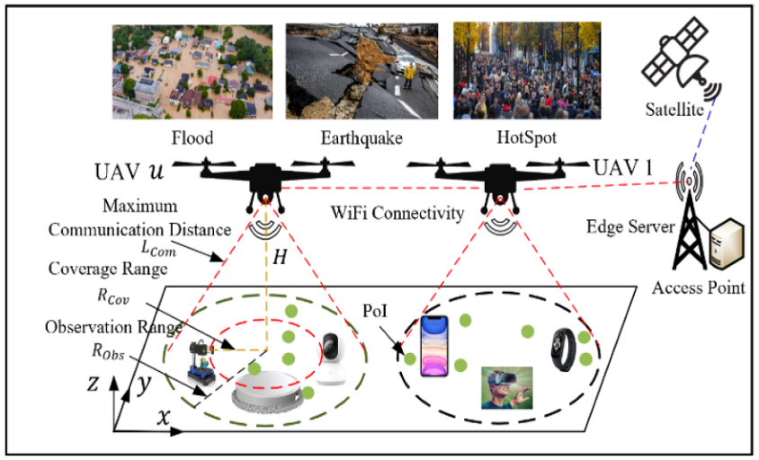

Fig. 1. Multiple UAVs flight control in the partially observable UAV-assisted crowd sensing system.

In recent UAV-assisted crowd sensing system research [5], [6], [7], [8], [9], [10], [11], [12], [13], [14], [15], each UAV is typically equipped with network modules such as WiFi, NB-IoT, or LoRA, enabling it to communicate with other UAVs and collaborate to collect data from points of interest (PoIs). However, some centralized UAV flight control methods [8], [11], [12], [14] are not feasible in this case due to the limitations of maximum communication range and high maneuverability. Moreover, as shown in Fig. 1, UAVs need to collaborate autonomously and in a distributed manner to provide high-quality data collection services for various applications. Therefore, different from previous studies [5], [6], [7], [8], [9], [10], [11], [12], [13], [14], [15], our modeling of the UAV-assisted crowd sensing system is more realistic and challenging. Specifically, first, we assume UAVs typically collect data from PoIs under partially observable conditions due to the constraint of their maximum communication range. Consequently, their flight strategies cannot access global system information and must rely solely on local observations within a limited area. Second, different from previous studies [10], [13], we assume that the PoIs and obstacles move in a dynamically stochastic manner, which requires the proposed algorithm to have strong robustness and exploratory capabilities. Third, different from previous studies [10], [13], since it is usually impractical to acquire global system data in a real UAV-assisted crowd sensing system, we assume that the training dataset for the model consists only of data from the UAV itself and other UAVs and PoIs within its communication range. In other words, the UAV’s flight strategy is trained using only local observations but should still perform well according to global metrics. Conversely, the prior research [10] leverages global information during the training phase to assist in stabilizing the model’s convergence.

Unfortunately, in non-convex and non-stationary UAVassisted crowdsensing system environments, achieving optimal data collection performance may be challenging without complete information about the environment. Our intuition for addressing partial observable problems is to leverage the Flying Ad-hoc Network (FANET) framework. In this framework, every UAV pair within the maximum communication range is interconnected and can exchange information with minimal latency. Specifically, communication provides the foundation for human collaboration [16] and likewise supports the coordination of multiple UAVs in a UAV-assisted crowd-sensing system. To address the partial observable problem, researchers have proposed several UAV flight control methods based on communication algorithms [5], [17], [18], [19], [20]. In these UAV fight control methods [5], [17], [20], the authors use graph neural networks (GNNs) as convolution kernels to capture information from each node via edges, thereby reducing the impact of partial observability at minimal cost. After determining communication choices, messages are broadcast to other UAVs. Although effective, it requires significant transmission resources and is difficult to adapt to real-world scenarios. In [19], the authors use a gate-based communication model to determine when to communicate with predefined neighboring UAVs. However, not all data collected by UAVs is beneficial for learning, as redundant data often disrupts model training. In [18], the authors propose a heterogeneous graph neural networks-based cooperative trajectory design algorithm of multiple UAV base stations. However, this method is a fully communicative algorithm, resulting in higher communication costs.

Humans typically communicate in two stages: first, they use prior information to identify valid communication partners, and second, they engage in targeted and effective communication. To this end, we first introduce an independently predict communication partner (IPC) model, which uses causal inference and feedforward neural networks based on each UAV’s local observations to acquire prior communication information between UAVs, helping UAVs identify potential communication partners. Next, we propose employing a critic-network to predict the influence of one UAV on another and quantify this influence, thereby determining the necessity of communication between UAVs. By facilitating essential information exchange between UAVs, this approach allows UAVs to perceive global information about the UAV-assisted crowd-sensing system environment, thereby addressing the partial observability issue and reducing communication overhead. Building on this, we propose a similarity enhancement mechanism to improve model learning efficiency by strengthening the connection between UAV observations and other UAVs’ flight strategies.

Beyond the constraint of partial observability, we impose collision avoidance requirements to ensure that UAVs do not collide with each other or with obstacles in the UAV-assisted crowd-sensing system. Recently, a few UAV flight control solutions have incorporated collision avoidance constraints. Specifically, first, some studies [21], [22] tackle collision issues during the training phase in model-free environments. These studies focus on the reward-shaping approach, which involves encoding information about undesirable action-state pairs into the reward function. Regrettably, these studies have the drawback that the collision behavior of the UAV is dispirited only while the related trajectories stay saved in the experience replay buffer. Another category of methods focuses on safety for systems with discrete state/action spaces and solves the collision avoidance problem via a constrained Markov decision process (CMDP) [23]. Several methods have been proposed based on CMDP. For instance, in [24], [25], the researchers introduce an algorithm that concentrates on learning the underlying CMDP relying solely on archived historical data. One common limitation of these approaches is their difficulty in generaling to continuous action spaces.

To prevent UAV collisions and ensure safe operations in UAVassisted crowd sensing systems, where the consequences of UAV flight decisions are comparatively immediate, we propose an off-policy Deep RL algorithm that efficiently leverages singlestep interaction experiences to assess whether state-action pairs violate collision constraints. This method eliminates the requirement for behavior-strategy information from conventional off-policy-based UAV flight control methods to secure exploration. Specifically, we introduce a safety layer in the flight decision network of each UAV and project the UAV’s unsafe flight strategy into the secure domain by employing a linear approximation of the constraint function, enabling the safety layer to be formulated as a quadratic program. This approximation originates from a first-order Taylor approximation of the constraints in the UAV’s flight strategy space, with its sensitivity parameterized by a neural network, which was pre-trained using archived historical data. Moreover, some of the proposed optimization formulations cannot guarantee recursive feasibility. In the multi-UAV coordination problem where UAVs impose constraints on each other due to natural symmetry, a UAV always has multiple valid constraints. Alternatively, we propose employing a particular soft-constrained formulation of the problem that tackles the absence of recursive feasibility guarantees in the hard-constrained formulation. This substantially boosts safety in real-world scenarios and is general enough to capture the complex dynamics of multi-UAV interactions in crowd-sensing systems. Therefore, the proposed method does not ensure zero constraint violations in all UAV-assisted crowd-sensing system environments assessed; however, through narrowing the constraints within a tolerance range, we can attain nearly safe UAV flight trajectories during training.

According to the above description, we propose a communication-assisted safe multi-agent actor-critic-based UAV flight control method (CSMAAC) in a UAV-assisted crowd-sensing system. By introducing efficient communication modules between UAVs and the safety layer, the algorithm can effectively solve some observability and collision problems of UAVs, significantly reduce communication costs and the number of collisions, and enhance collaboration, ultimately improving the data collection performance of UAVs. The contributions of this paper can be summarized as follows:

The Dynamic UAV Flight Control Problem in Collision-Constrained Partially Observable UAV-assisted Crowd Sensing System: We formulate a UAV flight control problem within a UAV-assisted crowd-sensing system, considering partially observable environments and collision constraints. The objective is to navigate a group of UAVs around a target area to maximize the total amount of collected data while managing limited energy reserves and ensuring geographical fairness among PoIs.

C CSMAAC Algorithm based UAV Flight Control Method: We propose a decentralized CSMAAC-based UAV flight control method. First, we propose an independent prediction communication partner model to address the partial observability problem. Based on the UAV’s local observation, causal inference is used to obtain prior communication information between UAVs through a feed-forward neural network to help UAVs determine potential communication partners. Second, we utilize a critic-network to predict and quantify inter-UAV influence and determine the necessity of communication. By exchanging necessary information inter-UAV, UAVs can perceive global information, thereby solving the UAV’s partial observability problem and reducing communication overhead. Moreover, we propose a similarity enhancement mechanism to improve the learning efficiency of the model by enhancing the connection between UAV observations and the policies of other UAVs. Finally, we use a neural network to predict a new policy’s cost value, enabling us to foresee its compliance with constraints without sampling the policy. Then, based on this neural network, we establish a safety layer to correct parts of the new policy that may lead to violations.

- Performance Evaluation: In the CSMAAC algorithm, we incorporate the Centralized Training and Distributed Execution (CTDE) mechanism. The adjacent edge server (ES) initially trains the CSMAAC model in a centralized manner. Subsequently, each UAV executes distributed flight strategies based on local observations using the trained model. Extensive simulation experiments demonstrate that CSMAAC significantly increases the total amount of collected data while managing limited energy reserves and geographical fairness among PoIs. Additionally, CSMAAC dramatically reduces communication overhead and total collisions.

The structure of this paper is as follows. Section II reviews the related works. Section III provides the UAV-assisted crowd-sensing system model. In Section IV, we provide the problem definition and MDP-based problem formulation. Section V provides a detailed introduction to the CSMAAC algorithm. In Section VI, we assess the performance of the CSMAAC algorithm. Finally, Section VII concludes the paper.

## II. RELATED WORKS

This section provides detailed related work on UAV flight control in a UAV-assisted crowdsensing system. Specifically, based on whether there is communication between UAVs during the execution phase, we divide the existing UAV flight control methods into communication algorithm-based UAV flight control methods and noncommunication-based UAV flight control methods. In addition, based on different collision constraint algorithms, we divide existing algorithms into reward-shaping-based UAV flight control algorithms and CMDP-based UAV flight control algorithms. The contrast between the current methods and the CSMAAC based on several key features is presented in Table I.

## A. Non Communication-Based UAV Flight Control Method

In [10], the authors propose a reinforcement learning (RL)- based method for multi-UAV navigation to achieve long-term communication coverage. In [26], the authors propose a multiagent RL (MARL) approach to maximize secure capacity by optimizing the flight strategy, transmission power, and interference power. In [27], the authors propose a MARL approach that investigates individuality and cooperation for air-ground spatial crowdsourcing. In [28], the authors propose a MARL-based multi-UAV path-planning algorithm in the UAV crowdsensing system. Although these methods incorporate the CTDE to reduce non-stationarity, UAVs still need to work on acting cooperatively during the testing phase. This occurs due to partial observability and randomness readily disrupting the optimal UAV flight strategy obtained through the training process, leading to severely uncoordinated UAV flight strategies [29].

## B. Communication-Based UAV Flight Control Method

In [17], the authors propose a GNN-based RL method for joint cruise control and task offloading for aerial edge Internet of Things. In [5], the authors propose a relational GNN-based RL method for age-of-information-minimal UAV crowdsensing. In [20], the authors propose a communication algorithm to coordinate decentralized users for task offloading in MEC and introduce an additional coordinator that learns to broadcast messages to all mobile users. In [12], the authors propose a graph convolutional MARL algorithm for UAV coverage control. For these methods [5], [12], [17], [20], upon deciding to communicate, the messages will be broadcast to all other/predefined UAVs. Nonetheless, this necessitates a substantial amount of bandwidth, resulting in extra latency in actual scenarios. In [19], the authors use a gate-based communication model to determine when to communicate with predefined neighboring mobile users. However, not every UAV can offer beneficial information, and excessive information may even hinder the UAV’s learning of flight strategies [30], [31]. In [18], the authors propose a heterogeneous GNNs-based cooperative trajectory design algorithm of multiple UAV base stations. However, this method is a fully communicative algorithm, resulting in higher communication costs.

TABLE I  
THE COMPARISON OF THE EXISTING SOLUTIONS AND CSMAAC METHOD
<table><tr><td rowspan=1 colspan=1>MethodsEssential features</td><td rowspan=1 colspan=1>[8]-[10], [12], [13]</td><td rowspan=1 colspan=1>[5],[17],[19], [20]</td><td rowspan=1 colspan=1>[18]</td><td rowspan=1 colspan=1>[21], [22]</td><td rowspan=1 colspan=1>[24], [25]</td><td rowspan=1 colspan=1>CSMAAC Method</td></tr><tr><td rowspan=1 colspan=1>FixedPoIsandobstacles</td><td rowspan=1 colspan=1>√</td><td rowspan=1 colspan=1></td><td rowspan=1 colspan=1></td><td rowspan=1 colspan=1></td><td rowspan=1 colspan=1></td><td rowspan=1 colspan=1></td></tr><tr><td rowspan=1 colspan=1>Mobile PoIsand obstacles</td><td rowspan=1 colspan=1></td><td rowspan=1 colspan=1></td><td rowspan=1 colspan=1></td><td rowspan=1 colspan=1></td><td rowspan=1 colspan=1></td><td rowspan=1 colspan=1>√</td></tr><tr><td rowspan=1 colspan=1>Global informationavailable</td><td rowspan=1 colspan=1>√</td><td rowspan=1 colspan=1></td><td rowspan=1 colspan=1></td><td rowspan=1 colspan=1></td><td rowspan=1 colspan=1></td><td rowspan=1 colspan=1></td></tr><tr><td rowspan=1 colspan=1>Partialinformationavailable</td><td rowspan=1 colspan=1></td><td rowspan=1 colspan=1>√</td><td rowspan=1 colspan=1></td><td rowspan=1 colspan=1></td><td rowspan=1 colspan=1></td><td rowspan=1 colspan=1>√</td></tr><tr><td rowspan=1 colspan=1>Broadcast communicationbetweenUAVs requires substantial bandwidthand adds latency</td><td rowspan=1 colspan=1></td><td rowspan=1 colspan=1>√</td><td rowspan=1 colspan=1></td><td rowspan=1 colspan=1></td><td rowspan=1 colspan=1></td><td rowspan=1 colspan=1></td></tr><tr><td rowspan=1 colspan=1>Full communication method</td><td rowspan=1 colspan=1></td><td rowspan=1 colspan=1></td><td rowspan=1 colspan=1>√</td><td rowspan=1 colspan=1></td><td rowspan=1 colspan=1></td><td rowspan=1 colspan=1></td></tr><tr><td rowspan=1 colspan=1>Reduce communication costs by one-to-one communication between UAVs</td><td rowspan=1 colspan=1></td><td rowspan=1 colspan=1></td><td rowspan=1 colspan=1></td><td rowspan=1 colspan=1></td><td rowspan=1 colspan=1></td><td rowspan=1 colspan=1>√</td></tr><tr><td rowspan=1 colspan=1>Reward  shaping-based  collisionavoidance algorithm</td><td rowspan=1 colspan=1></td><td rowspan=1 colspan=1></td><td rowspan=1 colspan=1></td><td rowspan=1 colspan=1>√</td><td rowspan=1 colspan=1></td><td rowspan=1 colspan=1></td></tr><tr><td rowspan=1 colspan=1>CMDP-based collision avoidancemethod</td><td rowspan=1 colspan=1></td><td rowspan=1 colspan=1></td><td rowspan=1 colspan=1></td><td rowspan=1 colspan=1></td><td rowspan=1 colspan=1>√</td><td rowspan=1 colspan=1>√</td></tr><tr><td rowspan=1 colspan=1>Difficult to generalize to continuousaction spaces</td><td rowspan=1 colspan=1></td><td rowspan=1 colspan=1></td><td rowspan=1 colspan=1></td><td rowspan=1 colspan=1></td><td rowspan=1 colspan=1>√</td><td rowspan=1 colspan=1></td></tr><tr><td rowspan=1 colspan=1>Addasafetylayertoactor-network</td><td rowspan=1 colspan=1></td><td rowspan=1 colspan=1></td><td rowspan=1 colspan=1></td><td rowspan=1 colspan=1></td><td rowspan=1 colspan=1></td><td rowspan=1 colspan=1>√</td></tr></table>

## C. Reward Shaping-Based UAV Flight Control Method

In [21], the authors propose a learning-based multi-UAV flocking control method with a limited visual field and instinctive repulsion. In [22], the authors propose a learning-based UAV path planning algorithm for data collection with integrated collision avoidance. These reward-shaping-based methods attempt to add to the reward function information encoding of action-state pairs that violate collision constraints. However, their drawback is that they only prevent the UAV’s flight strategy from violating collision constraints when the related trajectories are retained in the experience replay buffer.

## D. CMDP-Based UAV Flight Control Method

In [24], the authors propose a safe-DQN algorithm-based trajectory optimization method for UAV emergency communication with limited user equipment energy. In [25], the authors propose a constrained soft actor-critic algorithm-based energyaware trajectory design method in UAV-aided Internet of Things networks. However, a common drawback of these methods is the difficulty in applying them to scenarios with continuous action spaces.

## III. SYSTEM MODEL

In the proposed UAV-assisted crowd sensing system, we consider containing $\mathcal { U } \triangleq \{ u = 1 , 2 , . . . , U \}$ UAVs responsible for collecting data in a 2D target area, as shown in Fig. 1. The target area has a fixed boundary, and the UAV cannot fly out of it. In addition, we assume that the target area contains $\mathcal { D } \triangleq \{ d = 1 , 2 , . . . , D \}$ PoIs, and each PoI is linked with specific data collected by the UAV. We set $\mathcal { G } \triangleq \{ g = 1 , 2 , . . . , G \}$ obstacles to simulate the collision between UAV and obstacles in the target area. We assume that data collection will occur over T time slots, and these tasks are non-overlapping and independent. At the beginning of each episode, all UAVs are deployed in the exact location, and their batteries are fully charged. To gather data on each PoI, each UAV is guided to move around the area. Furthermore, in FANET, we consider that UAVs utilize IEEE 802.11s Mesh technology at the link layer to establish a dynamic and robust communication infrastructure. At the network layer, greedy perimeter stateless routing (GPSR) is adopted to accommodate the highly dynamic and three-dimensional network topology. The transport layer relies on user datagram protocol (UDP) to ensure low-latency communication, and the application layer employs lightweight protocols such as micro air vehicle link (MAVLink) for telemetry and coordination among UAVs.

As shown in Fig. 1, we define $L _ { C o m }$ as the maximum communication distance of UAVs, and each UAV can communicate with other UAVs and ground intelligent devices (GIDs) only within this area. Similar to these studies [10], [26], [27], we consider all UAVs flying at the same altitude H and communicating through the Ad-hoc network when their distance is within $L _ { C o m }$ In addition, each UAV can communicate with GIDs within the communication radius $R _ { O b s } = \sqrt { L _ { C o m } ^ { 2 } - H ^ { 2 } }$ . Due to the potential impact of real-world conditions on communication quality, we consider that GIDs can only obtain UAV communication services within the coverage radius $R _ { C o v }$ . In other words, if the GID is between $R _ { C o v }$ and $R _ { O b s } .$ , the UAV can observe it but cannot provide stable communication services. Different from previous studies [10], [13], we employ randomly distributed PoIs to denote the GIDs. Moreover, we consider that UAVs employ IEEE 802.11n/ac Wi-Fi to achieve reliable communication with GIDs.

At each time slot t, each UAV moves in a particular direction $\theta _ { u } ( t ) \in [ 0 , 2 \pi )$ for a distance $l _ { u } ( t ) \in [ 0 , l _ { \mathrm { m a x } } ]$ , in which $l _ { \mathrm { m a x } }$ signifies the maximum distance a UAV can travel within a time slot. Similar to these studies [5], [12], [20], our system model ignores the cost of flight time. In our system, we consider that each PoI has a different amount of data and the size of the data far exceeds the amount of data that the UAV can collect. Therefore, we consider that the UAV collects some data from the PoI within a time interval, and the remaining data is perceived or collected at subsequent time intervals. This scenario will pose a challenge to solving the problem, as each UAV needs to optimize its flight trajectory to collect data until it is collected. Further, we define $\psi _ { d } ^ { u } ( t ) , \forall \ : d \in \mathcal { D } , u \in \mathcal { U } , t \in T$ as the amount of tasks collected by the UAV in a time interval. We define $e _ { d } ^ { u } ( t )$ as the overall energy consumption of the UAV during its flight and task collection process. $e _ { 0 } ^ { u } ( t )$ indicates the initial energy of the UAV. Each UAV collects data on PoIs in a partially observable manner. To collect more data and maintain the lowest energy consumption, all UAVs need to collaborate efficiently to perceive the location distribution of PoIs and optimize their flight trajectories in a distributed manner to maximize long-term system returns.

TABLE II OVERVIEW OF KEY SYMBOLS
<table><tr><td>Symbols</td><td>Descriptions</td></tr><tr><td>U</td><td>Collection of UAVs.</td></tr><tr><td>D</td><td>Collection of PoIs.</td></tr><tr><td>g</td><td>Collection of obstacles.</td></tr><tr><td> $R _ { O b s }$ </td><td>Observation range.</td></tr><tr><td> $R _ { C o v }$ </td><td>Coverage range.</td></tr><tr><td> $L _ { C o m }$ </td><td>Maximum communication distance.</td></tr><tr><td> $l _ { u } ( t )$ </td><td>The flight distance of UAV.</td></tr><tr><td> $\theta _ { u } ( t )$ </td><td>The flight angle of UAV.</td></tr><tr><td> $H$ </td><td>The flight altitude of UAV.</td></tr><tr><td> $\psi _ { d } ^ { u } ( t )$ </td><td>Task collection amount.</td></tr><tr><td> $e _ { u } ( t )$ </td><td>Remaining energy reserves of UAV.</td></tr><tr><td> $e _ { 0 } ^ { u } ( t )$ </td><td>Initial energy of UAV.</td></tr><tr><td> $\check { P _ { u } } ( t )$ </td><td>Coordinates of the UAV.</td></tr><tr><td> $L _ { u , u ^ { \prime } } ( t )$ </td><td>Distance between UAVs.</td></tr><tr><td> $L _ { u , g } ( t )$ </td><td>Distance between UAVand obstacles.</td></tr><tr><td> $o _ { u } ( t )$ </td><td>Local observation of UAV.</td></tr><tr><td> $a _ { u } ( t )$ </td><td>The action of UAV.</td></tr><tr><td> $P _ { g } ( t )$ </td><td>Coordinates of obstacles.</td></tr><tr><td> ${ \cal L } _ { u , u ^ { \prime } } ^ { \mathrm { m u n } }$ </td><td>Safe distance between UAVs.</td></tr><tr><td> $L _ { \nu } ^ { \mathrm { m i n } }$  u,g</td><td>Safe distance between UAVs and obstacles.</td></tr><tr><td> $C ( \overset { \vartriangle } { \boldsymbol { \pi } } )$ </td><td>The total amount of task collection.</td></tr><tr><td> $J ( \pi )$ </td><td>Jain fairness index.</td></tr></table>

In addition, to prevent collisions between UAVs and between UAVs and obstacles, we consider two safety constraints. Specifically, first, we define $P _ { u } ( t ) = \{ P _ { u } ^ { x } ( t ) , P _ { u } ^ { y } ( t ) , P _ { u } ^ { z } ( t ) \}$ to represent the coordinates of the UAV. Next, the distance between the two UAVs is calculated by the following (1),

$$
L _ { u , u ^ { \prime } } ( t ) = | | P _ { u } ( t ) - P _ { u ^ { \prime } } ( t ) | | , \forall u , u ^ { \prime } \in \mathcal { U } , u \neq u ^ { \prime } ,\tag{1}
$$

where $P _ { u ^ { \prime } } ( t )$ represents the coordinates of other UAVs. Therefore, we consider that the distance between two drones should be greater than the minimum distance allowed between them, i.e., $L _ { u , u ^ { \prime } } ( t ) > L _ { u , u ^ { \prime } } ^ { \mathrm { m i n } }$ . Second, we define $P _ { g } ( t ) =$ $\{ P _ { g } ^ { x } ( t ) , P _ { g } ^ { y } ( t ) , P _ { g } ^ { z } ( t ) \} , g \in G$ as the coordinates of the obstacle. Next, the distance between the UAV and the obstacle can be represented by the following (2),

$$
L _ { u , g } ( t ) = | | P _ { u } ( t ) - P _ { g } ( t ) | | , \forall u \in \mathcal { U } , g \in G .\tag{2}
$$

Furthermore, collision constraints can be represented by the following (3),

$$
L _ { u , g } ( t ) \geq L _ { u , g } ^ { \operatorname* { m i n } } , \forall u \in \mathcal { U } , g \in G ,\tag{3}
$$

where $L _ { u , g } ^ { \mathrm { m i n } }$ is the minimum distance at which a UAV does not collide with an obstacle. Table II presents key symbols utilized in this paper.

## IV. PROBLEM DEFINITION AND FORMULATION

## A. Problem Definition

We further define the energy-efficient multi-UAV navigation problem for collision-constrained partially observable mobile crowdsensing systems. When a task is finished, we compute the total of all UAVs’ gathered data according to the UAV flight strategy π, represented by $C ( \pi )$ , as follows,

$$
C ( \pi ) = \sum _ { d = 1 } ^ { D } \phi ( \pi ; d ) ,\tag{4}
$$

where $\phi ( \pi ; d )$ represents the quantity of data collected from the PoI d using a specified UAV flight strategy π. Afterwards, in our system, we consider maximizing the total amount of task data collected $C ( \pi )$ by optimizing the flight strategy π of the UAV. Nevertheless, considering only the total amount of task collection may lead to unfair data collection for some PoIs, where PoIs with large amounts of data may be perceived and collected multiple times, while PoIs with small amounts of data may not be collected at all. Consequently, to guarantee equitable data collection across all PoIs, we incorporated the Jain fairness index [32] into the optimization objective. For a given UAV flight strategy π, the Jain fairness index can be defined by (5),

$$
J ( \pi ) = \frac { ( \sum _ { d = 1 } ^ { D } \phi ( \pi ; d ) ) ^ { 2 } } { D \sum _ { d = 1 } ^ { D } \phi ( \pi ; d ) ^ { 2 } } ,\tag{5}
$$

where $\phi ( \pi ; d )$ represents the overall quantity of collected data from PoI d under a given policy π upon task completion. Clearly, the more uniformly the data are gathered across all PoIs, the closer the value of $J ( \pi )$ approaches 1. Therefore, we consider maximizing $J ( \pi )$ . On the other hand, the proposed system model aims to minimize the energy consumption of each UAV and further increase the network service time. Therefore, the system model seeks to maximize the amount of data collected by UAVs and the fairness of data collection for each PoI while ensuring the minimum energy consumption of UAVs. Achieving all these goals simultaneously is quite challenging. This is because maximizing the amount of data collection by UAVs and the fairness of data collection for each PoI is a trade-off. To maximize both, the UAV must continuously fly within the target area to sense different PoIs, which will lead to increased energy consumption of the UAV due to long-distance flights, large amounts of data collection, and, to some extent, over time, some UAV flight strategies may not enable effective data collection (because some PoIs will have a small amount of data left or the data has been collected). On the other hand, reducing the energy consumption of UAVs will also mean limiting UAVs to flying or hovering in relatively small areas, resulting in unfair and small amounts of data collected. Therefore, the proposed system model aims to discover a flight strategy π that can effectively balance the trade-offs above.

## B. Dec-POMDP Based Problem Formulation

In the proposed system model, we consider each UAV an agent. In this system, each UAV maximizes data collection and data collection fairness for each PoI by optimizing its flight strategy while minimizing its energy consumption. Moreover, the decision process of UAV agents is modelled as a decentralized partially observable Markov Decision Process (Dec-POMDP). For UAV agents, their decision process is represented by a tuple $< S , \mathcal { O } , \mathcal { A } , \mathcal { P } , \mathbb { R } > . \mathcal { S }$ represents the state space of the UAV-assisted crowd-sensing system. O denotes the local observation space of the UAV. A denotes the action space of the UAV. P denotes state transition probability. R denotes the reward function.

1) Local Observation Space O: At each time slot t, each UAV u is capable of gathering local observations from the UAVassisted crowd-sensing system. As shown in Fig. 1, the UAV can observe PoI and other UAVs within the circles with the radius of $R _ { O b s }$ centred at its location. The local observation of UAV u, denoted as $o _ { u } ( t ) , ( o _ { u } ( t ) \in \mathcal { O } )$ , consists of $P _ { u } ( t ) , P _ { u , 1 , . . , d } ^ { R _ { O b s } } ( t )$ $P _ { u , 1 , . . , g } ^ { R _ { O b s } } ( t ) , P _ { u , 1 , . . , u ^ { \prime } } ^ { R _ { O b s } } ( t ) , b _ { u , 1 , . . , d } ^ { R _ { O b s } } ( t ) , e _ { u , 1 , . . , u ^ { \prime } } ^ { R _ { O b s } } ( t )$ ), and $\eta _ { u , 1 , . . , d } ^ { R _ { O b s } } ( t )$ $P _ { u } ( t )$ denotes the coordinates of the UAV u. $P _ { u , 1 , . . , d } ^ { R _ { O b s } } ( t )$ indicates the coordinates of the PoIs within the observation radius $R _ { O b s }$ of the UAV u. $P _ { u , 1 , . . , g } ^ { R _ { O b s } } ( t )$ indicates the coordinates of the obstacles within the observation radius $R _ { O b s }$ of the UAV u. $P _ { u , 1 , . . , u ^ { \prime } } ^ { R _ { O b s } } ( t )$ indicates the coordinates of the UAVs within the observation radius $R _ { O b s }$ of the UAV u. $b _ { u , 1 , . . , d } ^ { R _ { O b s } } ( t )$ represents the remaining data amount of PoIs within the observation radius $R _ { O b s }$ of the UAV $u . \ e _ { u , 1 , . . . , u ^ { \prime } } ^ { R _ { O b s } } ( t )$ indicates the remaining energy reserve of the UAVs within the observation radius $R _ { O b s }$ of the UAV u. $\eta _ { u , 1 , . . , d } ^ { R _ { O b s } } ( t )$ represents the accumulated data collection counts of the PoIs within the observation radius $R _ { O b s }$ of the UAV u. Further, we define $S ( t ) ( S ( t ) \in S )$ to represent the ground truth state of the UAV-assisted crowd-sensing system, which includes the positions of all UAVs $( P _ { u } ( t ) , \forall u \in \mathcal { U } )$ , the positions of all PoIs $( P _ { d } ( t ) , \forall d \in \mathcal { D } )$ , the positions of all obstacles $( P _ { g } ( t ) , \forall g \in \mathcal { G } )$ , the residual data quantities of all PoIs $( b _ { d } ( t ) , \forall d \in \mathcal { D } )$ , the remaining energy reserves of all UAVs $( e _ { u } ( t ) , \forall u \in \mathcal { U } )$ , and the accumulated data collection counts of all PoIs $( \eta _ { d } ( t ) , \forall d \in \mathcal { D } )$ . Furthermore, $o ( t ) = \{ o _ { 1 } ( t ) , \ldots , o _ { U } ( t ) \}$ denotes the joint observations of all UAV agents at time slot t.

2) The Action Space A: At each time slot t, each UAV moves in a particular direction $\theta _ { u } ( t ) \in [ 0 , 2 \pi )$ for a distance $l _ { u } ( t ) \in$ $[ 0 , l _ { \mathrm { m a x } } ]$ , in which $l _ { \mathrm { m a x } }$ signifies the maximum distance a UAV can travel within a time slot. Thereforce, UAV flight decisionmaking is expressed as $a _ { u } ( t ) = \{ \theta _ { u } ( t ) , l _ { u } ( t ) \} \in \mathcal { A }$ . Further, we have joint actions of all UAVs $\pmb { a } ( t ) = \{ a _ { 1 } ( t ) , . . . , a _ { U } ( t ) \}$

3) State Transition P: $\mathcal { P } ( S ( t + 1 ) | S ( t ) , \{ a _ { u } ( t ) \} _ { \forall u \in \mathcal { U } } )$ denotes a state transition, where the current state is S(t) and, upon selecting action $a _ { u } ( t )$ , the state transitions to a new state $S ( t + 1 )$ .

4) Reward Function: $S \times \mathcal { A }  \mathbb { R }$ represents the expected immediate reward obtained after transitioning from state $S ( t )$ to $S ( t + 1 )$ by taking the action $a _ { u } ( t ) , \forall u ,$ expressed as,

$$
r _ { u } ( t ) = \frac { J ( t ) \psi _ { d } ^ { u } ( t ) } { \varphi ( \psi _ { d } ^ { u } ( t ) , l _ { u } ( t ) ) } - \rho _ { u } ( t ) , \forall \ u \in \mathcal { U } ,\tag{6}
$$

where $\psi _ { d } ^ { u } ( t )$ represents the amount of data collected by the UAV during the time interval $t . \rho _ { u } ( t )$ is the penalty assigned to a UAV u when it collides with an obstacle or moves beyond the area

<!-- image-->  
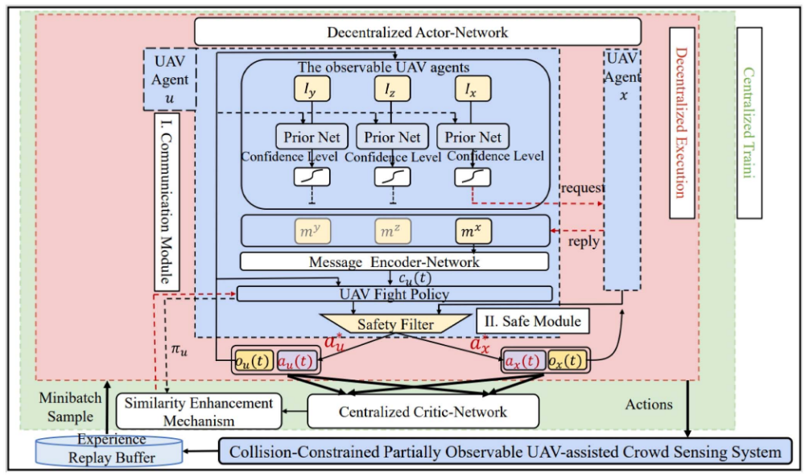

Fig. 2. The CSMAAC-based UAV flight control method in a collisionconstrained partially observable UAV-assisted crowd sensing system.

boundary. Further, J(t) is expressed as,

$$
J ( t ) = \frac { ( \sum _ { d = 1 } ^ { D } \eta _ { d } ( t ) ) ^ { 2 } } { D \sum _ { d = 1 } ^ { D } \eta _ { d } ( t ) ^ { 2 } } ,\tag{7}
$$

where $\eta _ { d } ( t )$ represents the number of data collection times for PoI d up to time slot $t . \ J ( t )$ indicates the level of equity among the data currently collected from all PoIs. As our aim is to effectively balance energy consumption and the amount of collected data, the proposed energy consumption model is formulated as:

$$
\begin{array} { r } { \varphi \left( \psi _ { d } ^ { u } ( t ) , l _ { u } ( t ) \right) = \alpha \cdot \psi _ { d } ^ { u } ( t ) + \beta \cdot l _ { u } ( t ) , \forall \ u \in \mathcal { U } , } \end{array}\tag{8}
$$

and $e _ { u } ( t ) = e _ { u } ( t - 1 ) - \varphi ( \psi _ { d } ^ { u } ( t ) , l _ { u } ( t ) )$ indicates the reduction in its energy reserve. α represents the energy consumption per unit of data collected. β represents the energy consumption per unit of distance travelled. Therefore, the proposed reward function $r _ { u } ( t )$ , ∀ u includes energy consumption, data collection amount, and PoI collection times fairness. Furthermore, we also refer to $r _ { u } ( t ) , \forall u .$ , as energy efficiency.

## V. CSMAAC ALGORITHM BASED UAV FLIGHT CONTROLMETHOD

## A. The Overview of the CSMAAC Algorithm

As shown in Fig. 2, we propose a decentralized UAV flight control method based on the CSMAAC algorithm in a collisionconstrained partially observable UAV-assisted crowdsensing system. As shown in Fig. 2, CSMAAC comprises communication and safe optimization modules. Specifically, first, to solve the partial observability of UAVs in the crowdsensing system environment, we propose a multi-UAV communication optimization module. Second, we propose a safe optimization module to avoid collisions between UAVs and between UAVs and obstacles. Next, we describe the communication and safe optimization modules in detail.

## B. Communication Optimization Module

As illustrated in Fig. 2, we present a multi-UAV communication module. Current UAV flight control methods offer high-efficiency data gathering services for GIDs in UAV-assisted crowd-sensing systems. Nevertheless, UAVs usually offer services to GIDs in partially observable conditions, and it is difficult for UAV flight control methods to achieve best data gathering service performance as a result of the inability to perceive the global information of the system. To address the issue of partial observability, an Independently Predict Communication partner (IPC) model is proposed, which uses causal inference based on the local observations of each UAV to obtain prior information on communication between UAVs through a feedforward neural network to help UAVs determine potential communication partner. Second, we propose to use Critic-Network to predict the influence of one UAV on another UAV and quantify the influence to determine the necessity of communication between UAVs. Through necessary information exchange between UAVs, UAVs can perceive the global information of the system, thereby solving some of the observability problems of UAVs and reducing communication overhead. On this basis, we propose a similarity enhancement mechanism to improve the learning efficiency of the model by enhancing the connection between UAV observations and the flight control strategies of other UAVs. Compared with existing UAV flight control methods based on communication algorithms [5], [12], [17], [20], our proposed UAV flight control method significantly decrease communication overhead. Moreover, our method achieve an improved cooperative flight control strategy.

<!-- image-->  
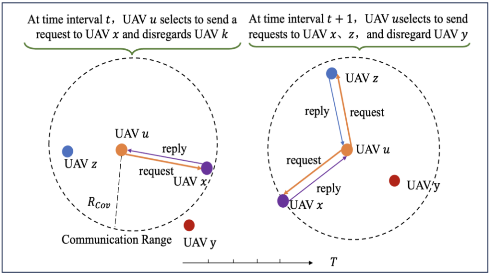

Fig. 3. CSMAAC adopts a request-reply based communication method. The UAV is only able to communicate with other UAVs within its observation range.

In Fig. 2, we can observe that the IPC model primarily comprises a Prior-Network, a Message Encoder-Network, and a similarity enhancement mechanism. A fully collaborative multi-UAV flight control task is set up in a partially observable UAV-assisted crowd-sensing system environment. These tasks are formulated as a communication-based decentralized partially observable Markov decision process. The UAVs aim to learn the optimal flight control strategy to maximize the total amount of collected data while managing limited energy reserves and ensuring geographical fairness among PoIs. Moreover, as depicted in Fig. 3, UAVs employ a request-reply communication mechanism to exchange messages with other observed UAVs. In the time slot t, the UAV u gets partial information $o _ { u } ( t )$ about the UAV-assisted mobile crowd-sensing system. The UAV u uses this partial information to determine which UAVs are within its communication range. As shown in Fig. 3, we consider the scenario where if UAV u can observe UAV x, then UAV u’s Prior-Network $\eta _ { u }$ takes UAV u’s observational information and identifying information $I _ { x }$ (or any unique identifier of UAV x) as input and outputs a confidence level indicating whether to communicate with UAV x. Based on this confidence level, if UAV u sends a request via the communication channel to UAV x, UAV x will respond with a message $m _ { x } ( t )$ , i.e., its own (encoding of) observation. All the messages received by UAV $u , m _ { x } ( t )$ , are fed into the Message Encoder-Network $E _ { u }$ to generate the encoded message $c _ { u } ( t )$ , and the policy network outputs a distribution of action $\pi _ { u } ( a _ { u } ( t ) | c _ { u } ( t ) , o _ { u } ( t ) )$ ). Furthermore, this section provides a detailed explanation of the IPC model’s principles. Specifically,

First, the communication module between UAVs (the IPC model) consists mainly of the Prior-Network, which helps UAVs discover the best communication partners. Typically, each UAV prefers to build communication with other UAVs that greatly influence its flight control strategies, seeking to gain insights into how they act and collaborate. Therefore, the causal influence of other UAVs can be considered as the flight control strategies of other UAVs that the current UAV needs to consider when making flight decisions. Additionally, the IPC model uses a centralized Critic-Network to predict and quantify the causal influence between UAVs and trains the Prior-Network to determine whether communication between UAVs is necessary. Then, we assume that the UAV flight control decision space of UAV u includes the probability distributions $p ( a _ { u } ( t ) | \mathbf { a } _ { \{ \backslash u \} } , o ( t ) )$ and $p ( a _ { u } ( t ) | { \pmb a } _ { \{ \backslash ( u , x ) \} } , { \pmb o } ( t ) ) . { \pmb a } _ { \{ \backslash u \} }$ denotes the joint flight control strategies of all UAVs except UAV u, while $\mathbf { \em a } _ { \{ \backslash ( u , x ) \} }$ denotes the joint flight control strategies of all UAVs except UAV u and UAV x. Compared to $p ( a _ { u } ( t ) | { \pmb a } _ { \{ \backslash u \} } , { \pmb o } ( t ) ) , p ( a _ { u } ( t ) | { \pmb a } _ { \{ \backslash ( u , x ) \} } , { \pmb o } ( t ) )$ represents the scenario where the influence of UAV x is not considered, meaning that when UAV u makes flight control decisions, it ignores UAV x. Therefore, the causal influence of UAV x on UAV u can be defined by (9),

$$
\phi _ { x , u } = D _ { K L } \left( p ( a _ { u } ( t ) | a _ { \{ \backslash u \} } , o ( t ) ) | | p \left( a _ { u } ( t ) | a _ { \{ \backslash ( u , x ) \} } , o ( t ) \right) \right) ,\tag{9}
$$

where $D _ { K L } ( \cdot )$ (i.e., Kullback-Leibler divergence) is utilized to measure the discrepancy between $p ( a _ { u } ( t ) | a _ { \{ \backslash u \} } , o ( t ) )$ and $p ( a _ { u } ( t ) | \mathbf { a } _ { \{ \backslash ( u , x ) \} } , \mathbf { o } ( t ) )$ . The magnitude of $\phi _ { x , u }$ indicates the degree to which UAV u adjusts its flight control policy when considering the flight control policy of UAV x. It also indicates the degree of correlation between the flight control policy of UAV u and UAV x. Finally, the IPC model takes into account utilizing a centralized Critic-Network to calculate $p ( a _ { u } ( t ) | \mathbf { } a _ { \{ \backslash u \} } , \mathbf { } o ( t ) )$ ) and $p ( a _ { u } ( t ) | \mathbf { 1 } a _ { \{ \backslash ( u , x ) \} } , \mathbf { o } ( t ) )$ ). The distribution $p ( a _ { u } ( t ) | \mathbf { \dot { a } } _ { \{ \backslash u \} } , o ( t ) )$ ) is calculated through the Softmax distribution of UAV u’s flight control policy, as shown in (10),

$$
p \left( a _ { u } ( t ) | a _ { \{ \backslash u \} } , o ( t ) \right) = \frac { \exp ( \epsilon \cdot Q ( a _ { u } ( t ) , a _ { \{ \backslash u \} } , o ( t ) ) ) } { \sum _ { a _ { u } ^ { \prime } ( t ) } \exp ( \epsilon \cdot Q ( a _ { u } ^ { \prime } ( t ) , a _ { \{ \backslash u \} } , o ( t ) ) ) } ,\tag{10}
$$

where $Q ( \mathbf { } a ( t ) , o ( t ) )$ represents the centralized Critic-Network, and 
 is a hyperparameter. The distribution

$p ( a _ { u } ( t ) | \mathbf { a } _  \{ \} \backslash ( u , x ) \} , \mathbf { o } ( t ) )$ can be viewed as the marginal distribution of $\begin{array} { r } { p ( a _ { u } ( t ) , a _ { x } ( t ) | \mathbf { 1 } a _ { \{ \backslash u , x \} } , \pmb { o } ( t ) ) } \end{array}$ , as calculated in (11),

$$
\begin{array} { l } { \displaystyle p ( a _ { u } ( t ) , a _ { x } ( t ) | a _ { \{ \backslash u , x \} } , o ( t ) ) = \sum _ { a _ { x } ( t ) } p ( a _ { u } ( t ) | a _ { \{ \backslash u , x \} } , o ( t ) ) } \\ { \displaystyle } \\ { \displaystyle = \sum _ { a _ { x } } \frac { \exp ( \epsilon \cdot Q ( a _ { u } ( t ) , a _ { x } ( t ) , \pmb { a } _ { \{ \backslash u , x \} } , o ( t ) ) ) } { \sum _ { a _ { u } ^ { \prime } ( t ) , a _ { x } ^ { \prime } ( t ) } \exp ( \epsilon \cdot Q ( a _ { u } ^ { \prime } ( t ) , a _ { x } ^ { \prime } ( t ) , a _ { \{ \backslash u , x \} } , o ( t ) ) ) } . } \end{array}\tag{11}
$$

Through (9) to (11) and the current observation information, the causal effect $\phi _ { x , u }$ of UAV x on UAV u can be calculated. Since UAV u determines which UAV to communicate with based only on $o _ { u } ( t )$ , the algorithm stores $\{ ( o _ { u } ( t ) , I _ { x } ) , \phi _ { x , u } \}$ in dataset X as training samples for the Prior-Network.

Based on the above description, first, the IPC communication model uses a centralized Critic-Network to predict the causal influence between UAVs and determine whether communication is needed. Second, each UAV u makes distributed flight control decisions $a _ { u } ( t )$ based on local information $o _ { u } ( t )$ and messages from other UAVs (whether they communicate or not). This approach can be seen as a distributed UAV flight control strategy enhanced by inter-UAV message communication, approximating a centralized control strategy generated by the centralized Critic-Network. In the best-case scenario, the flight control decisions of the UAVs requesting communication should be generated based on the observations and flight control strategies of all communicating UAVs. However, directly sharing flight control decisions $a _ { u } ( t )$ among UAVs is not feasible because it might lead to circular dependency issues. Therefore, a UAV’s flight control policy can only be derived from its observations $o _ { u } ( t )$ . Furthermore, we propose a similarity enhancement mechanism that increases the similarity between a UAV’s observations and flight control strategies with those of other UAVs, thereby reducing the difference in flight control strategy generation when considering or not considering the actions of other UAVs. Specifically,

As shown on the right side of Fig. 3, UAV u first observes UAVs x, z, and y within its communication range and decides to send information exchange requests to UAVs x and z based on communication prior information. Then, UAV u makes a flight control decision $a _ { u } ( t )$ based on the local observations of $\mathrm { U A V s ~ } x , z ,$ , and y. To further enhance the ability of the UAV to learn and predict its flight control strategy from other UAVs’ local observation information, the algorithm forces the UAV flight control strategy $\pi _ { u } ( a _ { u } ( t ) | E _ { u } ( o _ { x } ( t ) , o _ { z } ( t ) ) , o _ { u } ( t ) )$ based on local observation to be close to the flight control strategy $\hat { \pi } _ { u } ( a _ { u } ( t ) | a _ { x } ( t ) , a _ { z } ( t ) , E _ { u } ( o _ { x } ( t ) , o _ { z } ( t ) ) , o _ { u } ( t ) )$ From the perspective of UAV u, $\hat { \pi } _ { u } ( a _ { u } ( t ) | a _ { x } ( t )$ $a _ { z } ( t ) , E _ { u } ( o _ { x } ( t ) , o _ { z } ( t ) ) , o _ { u } ( t ) )$ is used to approximate $p ( a _ { u } ( t ) | a _ { \{ \backslash u \} } , o ( t ) )$ Therefore, the algorithm uses $p ( a _ { u } ( t ) | a _ { \{ \backslash u \} } , o ( t ) )$ as the learning target for $\pi _ { u } ( a _ { u } ( t ) | E _ { u } ( o _ { x } ( \dot { t } ) , o _ { z } ( t ) ) , o _ { u } ( t ) )$ . Furthermore, the algorithm uses $D _ { K L } ( p ( a _ { u } ( t ) | a _ { \{ \backslash u \} } , o ( t ) ) | | \pi _ { u } ( a _ { u } ( t ) | E _ { u } ( o _ { x } ( t ) , o _ { z } ( t ) ) , o _ { u } _ { \{ \} } )$ (t))) to enhance the similarity of between observations and UAV flight control strategy.

## C. Safe Optimization Module

As shown in Fig. 2, we propose a safe optimization module to avoid collisions between UAVs and between UAVs and obstacles. Specifically, we propose an off-policy Deep RL algorithm that effectively utilizes the $\mathrm { U A V } _ { \mathrm { \Delta } }$ single interaction experience to assess whether the state-action pairs violate the UAV’s collision constraints. This method eliminates the requirement for behavior-strategy information from conventional off-policy methods to secure exploration. Specifically, we introduce a safety layer to each UAV’s flight decisions that map the UAV’s collision violation strategy into the secure domain by employing a linear approximation of the constraint function, thereby enabling the safety layer to be formulated as a quadratic program. This approximation originates from a first-order Taylor approximation of the constraints in the action space, with its sensitivity parameterized by a neural network pre-trained using archived historical data.

In addition, different from these studies [24], [25], we eliminate the assumption that the optimization problem that rectifies unsafe policies merely has a single restriction active at any time interval and is therefore perpetually viable. In practical scenarios, the optimization formulation suggested offers no assurance of being recursively achievable. In multi-UAV coordination problems where UAVs enforce limitations on each other, there is invariably more than one restriction active because of the inherent symmetry. Instead, we propose employing a particular soft constrained formulation of the problem that tackles the absence of recursive feasibility assurances in the strictly constrained formulation. This improves safety considerably in real-world circumstances and is broad enough to encompass the intricate dynamics of multi-UAV coordination problems. In conclusion, our contribution is introducing an innovative safety enhancement algorithm for multi-UAV navigation while effectively avoiding infeasibility issues by reformulating the quadratic safety program in a soft-constrained fashion.

1) CMDP-Based Problem Formulation: First, a collection of K restrictions defined as mappings of the form $c _ { j } ( o ) \forall j \in$ $\{ 1 , . . . , K \}$ , indicating that each restriction might be influenced by the local observations of multiple UAVs. Second, a UAV flight control policy $\pi _ { u }$ is defined as a function that maps the local observations of UAV u to its local actions. Further, the UAV flight control strategies are parameterized by $\pmb \theta = ( \theta _ { 1 } , . . . , \theta _ { U } )$ . and therefore utilize the notation $\pi _ { \theta _ { u } }$ . In this setting, we investigate the problem of safe exploration in a constrained Markov Game (CMG), and hence, we strive to address the subsequent optimization problem for the UAV,

$$
\begin{array} { r l } { \displaystyle } & { \underset { \theta _ { u } } { \operatorname* { m a x } } \mathbb { E } \left[ \sum _ { t = 0 } ^ { \infty } \gamma ^ { t } r _ { u } \left( o _ { u } ( t ) , \pi _ { \theta _ { u } } \left( o _ { u } ( t ) \right) \right) \right] , \forall u } \\ { \mathrm { s . t . } \quad c _ { j , 1 } \left( o ( t ) \right) \leq C _ { j , 1 } , c _ { j , 2 } \left( o ( t ) \right) \leq C _ { j , 2 } , \forall j } \end{array}\tag{12}
$$

where $\gamma \in ( 0 , 1 )$ signifies the discount factor. Further, the constraint set mainly includes collision constraints between UAVs and between UAVs and obstacles, i.e., $L _ { u , u ^ { \prime } } ( t ) >$ $L _ { u , u ^ { \prime } } ^ { \mathrm { m i n } } , L _ { u , g } ( t ) \geq L _ { u , g } ^ { \mathrm { m i n } } . C _ { j , . }$ 1 represents the safety threshold for punishing collisions between UAVs. $C _ { j , 2 }$ represents the safety threshold for penalties resulting from collisions between UAVs and obstacles. $c _ { j , 1 } ( \pmb { o } ( t ) )$ represents the cost generated based on the state and collision constraints between $\mathrm { U A V s . } c _ { j , 2 } ( o ( t ) )$ represents the cost generated based on the state and collision constraints between UAVs and obstacles. The optimization problem is specified as $\pi ^ { * } = \underset { \pi } { \arg \operatorname* { m a x } } ( ( D _ { T } \times F _ { T } ) / \Delta E _ { T } )$ , where $D _ { T }$ represents the proportion between the total collected data and the initial data amount upon task completion. $F _ { T }$ denotes the geographic distribution of how uniformly the data associated with PoIs is gathered by all UAVs when a task is completed (up to T time slots). The calculation method of $F _ { T }$ is shown in (5). $\Delta E _ { T }$ represents the proportion of the total energy expended (for both movement and data collection) by all UAVs to the initial energy reserve at the completion of a task.

2) Safety Signal Model: Solving (12) is difficult in a UAVassisted crowd-sensing system. UAV flight control methods based on RL require continuous exploration of new and improved actions to meet constraint requirements. Without prior knowledge of the environment, these methods that use random initialization strategies cannot guarantee that the UAV satisfies the constraints of each state during the initial training phase. If punishment is carefully designed to distinguish between unpopular states and teach the UAV to avoid unpopular behaviour, the UAV must violate enough constraints. In this paper, we use a neural network to predict the cost value of a new policy, thereby enabling us to foresee its compliance with constraints without sampling the policy. Then, based on this neural network, we establish a safety layer to correct parts of the new policy that may lead to violations.

We add some basic prior knowledge to the single-step dynamic system, i.e., the single-step state transition data in the training log data, which can be used for pre-training the model to help ensure security during RL training. Further, a first-order approximation of the constraint function is defined in (12) concerning action a

$$
c _ { j } \left( \pmb { \sigma } ^ { \prime } \right) = \hat { c } _ { j } ( \pmb { o } , \pmb { a } ) \approx c _ { j } ( \pmb { o } ) + F \left( \pmb { o } ; \omega _ { j } \right) ^ { \top } \pmb { a } ,\tag{13}
$$

where $\mathbf { \delta } _ { o ^ { \prime } }$ signifies the system state after executing action a based on state $o , F$ denotes a neural network with o as input, output of the identical dimension as the action $^ { a , }$ and parameters $\omega _ { j }$ This network proficiently learns the restrictions’ sensitivity to the executed actions given characteristics of the present local observation based on a collection of the UAV’s single interaction experience $\boldsymbol { \mathcal { B } } = \{ ( o ^ { k } , \boldsymbol { a } ^ { k } , o ^ { k ^ { \prime } } ) \}$ }. During those experiments, we produce $\big \{ \big ( \boldsymbol { o } ^ { k } , \boldsymbol { a } ^ { k } , \boldsymbol { o } ^ { k ^ { \prime } } \big ) \big \}$ by setting up UAVs with a random local observation and selecting actions based on a sufficiently exploratory (stochastic) policy for many episodes. For each constraint $j ,$ we define a loss function $\mathcal { L } ( \omega _ { j } )$ that measures the extent to which the constraint is violated. The sensitivity network is trained by minimizing the sum (or weighted sum) of these loss functions across the dataset $\{ ( o ^ { k } , a ^ { k } , o ^ { \breve { k } ^ { \prime } } ) \}$ ,

$$
\mathcal { L } ( \omega _ { j } ) = \sum _ { ( o , a , o ^ { \prime } ) \in \mathcal { B } } \left( c _ { j } \left( o ^ { \prime } \right) - \left( c _ { j } ( o ) + F \left( o ; \omega _ { j } \right) ^ { \top } a \right) \right) ^ { 2 } ,\tag{14}
$$

where we train the sensitivity of each restriction separately.

<!-- image-->  
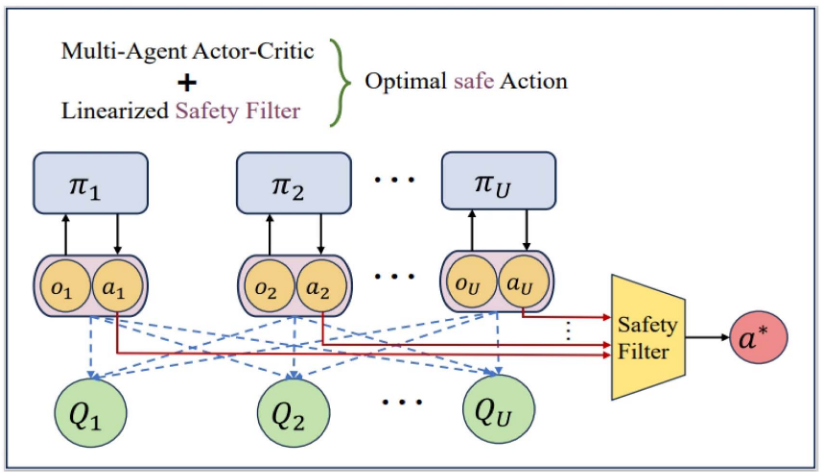

Fig. 4. This is an illustration of the safety layer integrated into the multi-agent actor-critic for applying the safe projection of the optimal action. Each UAV’s actor network takes a local observation $o _ { u } ( t )$ as input and outputs an evaluation of the current flight control strategy, which is then connected into a vector. Finally, solving a convex quadratic optimization problem further generates optimal safe actions a∗.

3) Safety Layer Optimization: Based on the single-step safety signals presented in (13), we augment the actor-networks by adding an extra centralized safety layer that reduces the collision frequency of UAVs by addressing the following issues,

$$
\begin{array} { r l } & { \underset { \ b { a } } { \arg \operatorname* { m i n } } \ : \| \pmb { a } - \Pi _ { \theta } ( \pmb { o } ) \| _ { 2 } ^ { 2 } } \\ & { ~ \mathrm { s . t . } ~ c _ { j } ( \pmb { o } ) + F \left( \pmb { o } ; \omega _ { j } \right) ^ { \top } \pmb { a } \leq C _ { j } ~ \forall ~ j = \{ 1 , \dots , K \} , } \end{array}\tag{15}
$$

where Π(o) denotes the set of all UAVs’ flight control policies, i.e., $\Pi ( o ) = \left( \pi _ { \theta _ { 1 } } ( o _ { 1 } ) , . . . , \pi _ { \theta _ { U } } ( o _ { U } ) \right)$ . This forms a quadratic optimization task that calculates the (least distance) mapping of the actions proposed by each of the actor-network $\pi _ { \boldsymbol { \theta } _ { u } } ( o _ { u } )$ onto the linearized safety set. Fig. 4 depicts the entire process for determining an action from a specific local observation.

We proceed to give the closed-form solution for (15).

Proposition 1: Let $( a ^ { * } , \{ \lambda _ { j } ^ { * } \} _ { j = 1 } ^ { K } )$ be a feasible solution to (15), where $\lambda _ { j } ^ { * }$ corresponds to the Lagrange multiplier for the jth constraint. Suppose further that at most one constraint is active $| \{ j | \lambda _ { j } ^ { * } > 0 \} | \le 1$ . Under these assumptions, we

$$
\lambda _ { j } ^ { * } = { \bf \Phi } \left[ \frac { F ( o ; w _ { j } ) ^ { \top } \mu _ { \theta } ( o ) + o - C _ { j } } { F ( o ; w _ { j } ) ^ { \top } F ( o ; w _ { j } ) } \right] ^ { + }\tag{16}
$$

$$
\begin{array} { r } { a ^ { * } = \Pi _ { \theta } ( o ) - \lambda _ { j ^ { * } } ^ { * } F \left( o ; w _ { j ^ { * } } \right) , \mathrm { ~ w h e r e ~ } j ^ { * } = \arg \operatorname* { m a x } _ { j } \lambda _ { j } ^ { * } . } \end{array}\tag{17}
$$

Proof: Due to the positive definite quadratic objective and linear constraints, there exists a globally unique minimum point for this convex problem when the feasible set is not empty. First, we assume that there exists a feasible solution to (15), denoted as $( a ^ { * } , \{ \lambda _ { j } ^ { * } \} _ { j = 1 } ^ { K } )$ , where $\lambda _ { j } ^ { * }$ denotes the best Lagrange multiplier linked to the jth constraint. Second, assuming $| \{ j | \lambda _ { i } ^ { * } > 0 \} | \le 1$ , that is, at most one constraint is satisfied. Then obtain $\lambda _ { j } ^ { * }$ and $a ^ { * }$

Since the objective function and constraints of (15) are both convex functions, the sufficient condition for the feasible solution $( a ^ { * } , \{ \lambda _ { j } ^ { * } \} _ { j = 1 } ^ { K } )$ , where $\lambda _ { j } ^ { * }$ is to satisfy the KKT condition. Further, the Lagrange function of (15) is

$$
L \left( \boldsymbol { a } , \lambda \right) =
$$

$$
\frac { 1 } { 2 } \| \pmb { a } - \Pi _ { \theta } ( \pmb { o } ) \| ^ { 2 } + \sum _ { j = 1 } ^ { K } \lambda _ { j } \left( c _ { j } ( \pmb { o } ) + F \left( \pmb { o } ; \pmb { w } _ { j } \right) ^ { \top } \pmb { a } - C _ { j } \right) ,\tag{18}
$$

and thus the KKT conditions at $( a ^ { * } , \{ \lambda _ { j } ^ { * } \} _ { j = 1 } ^ { K } )$ are

$$
\nabla _ { a } L = a ^ { * } - \Pi _ { \theta } ( \pmb { o } ) + \sum _ { j = 1 } ^ { K } \lambda _ { j } ^ { * } \boldsymbol { F } \left( \pmb { o } ; \boldsymbol { w } _ { j } \right) = 0 ,\tag{19}
$$

$$
\lambda _ { j } ^ { * } \left( c _ { j } ( o ) + F \left( o ; w _ { j } \right) ^ { \top } a ^ { * } - C _ { j } \right) = 0 \forall j \in [ K ] .\tag{20}
$$

First, examine the scenario in which $| \{ j | \lambda _ { i } ^ { * } > 0 \} | = 1$ that is, $\lambda _ { j ^ { * } } ^ { * } > 0$ . We then easily obtain (17) from (19). Subsequently, as indicated by (20) it follows that $\bar { c } _ { j ^ { * } } ( o ) +$ $F ( \pmb { o } ; \boldsymbol { w } _ { j ^ { * } } ) ^ { \top } \boldsymbol { a } ^ { * } - C _ { j ^ { * } } = 0$ . Replacing (17) in the latter results in $\lambda _ { i ^ { * } } ^ { * } F ( \pmb { \mathscr { o } } ; \boldsymbol { w } _ { i ^ { * } } ) ^ { \top } F ( \pmb { \mathscr { o } } ; \boldsymbol { w } _ { j ^ { * } } ) = F ( \pmb { \mathscr { o } } ; \boldsymbol { w } _ { j ^ { * } } ) ^ { \top } \Pi _ { \theta } ( \pmb { \mathscr { o } } ) + \bar { c } _ { j ^ { * } } ( \pmb { \mathscr { o } } ) - C _ { j ^ { * } }$ This gives us (16) for $j = j ^ { * }$ . Regarding $j \in [ K ] \setminus \{ j ^ { * } \}$ , the associated constraints are inactive because $\lambda _ { j } ^ { * } = 0$ . Therefore, $\begin{array} { r } { \pmb { o } + F \big ( \pmb { o } ; w _ { j } \big ) ^ { \top } \pmb { a } ^ { * } - C _ { j } < 0 , } \end{array}$ causing the fraction in (16) negative, thus yielding a value of 0 attributable to the [·]+ function yielding (16) also when $j \in [ K ] \setminus \{ j ^ { * } \}$

To finalize the proof, analyze the second scenario where $\lambda _ { j } ^ { * } =$ $0 \forall j \in [ K ]$ . According to (19) it follows that $a ^ { * } = \Pi _ { \theta } ( o )$ . This results in (17) given that $\lambda _ { j ^ { * } } ^ { * } = 0$ . Lastly, (16) holds due to the same inactive constraints argument as above, this time uniformly $\forall j \in [ K ]$ 

Because of the generality of the formulation, it is possible that there exists no recoverable action that can ensure the UAVs are taken to a safe state, even though the prior iteration of the optimization was indeed achievable. This is due to the assumption of restricted control authority, which also must adhere to the dynamics of the underlying system. To consider this without encountering infeasibility problems where the UAVs would need an alternative policy to exit unrecoverable states, we propose a soft constrained formulation, whose solution matches the original formulation whenever (15) is achievable. If not, the optimizer is permitted to relax the constraints by a penalized margin as suggested in [33]. We therefore reformulate (15) as follows

$$
\begin{array} { c } { { ( } { \pmb { a } } ^ { \ast } , { \pmb { v } } ^ { \ast } ) = \underset { { \pmb { a } } , { \pmb { v } } } { \arg \operatorname* { m i n } } \left\| \pmb { a } - \Pi ( \pmb { o } ) \right\| _ { 2 } ^ { 2 } + \varpi \left\| \pmb { v } \right\| _ { 1 } , } \\ { ~ } \\ { { \mathrm { s . t . } } ~ g \left( \pmb { o } ; \omega _ { j } \right) ^ { \top } \pmb { a } \leq C _ { j } - c _ { j } ( \pmb { o } ) + \upsilon _ { j } , } \\ { ~ } \\ { { \upsilon _ { j } } \geq 0 , ~ \forall j = \{ 1 , \dots , K \} , } \end{array}\tag{21}
$$

where $\pmb { v } = ( v _ { 1 } , \dots , v _ { K } )$ represents the slack variables and  denotes the penalty weight for constraint violations. We choose $\varpi > \| \sigma ^ { * } \| _ { \infty }$ where $\sigma ^ { * }$ denotes the optimal Lagrange multiplier for the initial problem formulation in (15), ensuring that the soft-constrained problem produces equivalent results whenever (15) is achievable (refer to [33]). Given that precisely quantifying the optimal Lagrange multiplier is time-consuming, we assign a substantial value of Ï
 through examination. It is crucial to state that the reformulation in (21) still forms a quadratic program when broadening the optimization vector into $( a , v )$ and employing an epigraph formulation. It is important to mention that this formulation does not inherently ensure zero breaches of constraints. Nevertheless, violations remain minimal when applying a relatively large penalty value .

## D. The Training Process of the CSMAAC Algorithm

We use $\theta _ { Q }$ to parameterize the centralized joint action-value function $Q ^ { \pi } ( a , o )$ (i.e., the centralized critic-network). The centralized critic-network utilizes the flight control strategies and local observation information of all UAVs as input to direct strategy optimization. The update of centralized critic-network can be defined by (22),

$$
\begin{array} { r l } & { \mathcal { L } ( \theta _ { Q } ) = \mathbb { E } _ { o , a , r , o ^ { \prime } } [ ( Q ^ { \pi } ( a , o ) - y ) ^ { 2 } ] , } \\ & { \quad \quad y = r + \gamma Q ^ { \pi } ( a ^ { \prime } , o ^ { \prime } ) | _ { a ^ { \prime } \sim \pi ( o ^ { \prime } ) } , } \end{array}\tag{22}
$$

where $\mathbf { { a } ^ { \prime } }$ are drawn from $\pi ( o ^ { \prime } )$ . We use $\theta _ { \pi _ { u } }$ to parameterize actor-network. Further, the regularized gradient update of each actor-network can be defined by (23),

$$
\begin{array} { r l r } { \left. { \nabla _ { \theta _ { \pi _ { u } } } \mathcal { I } \left( \theta _ { \pi _ { u } } \right) } } \\ & { } & { = \mathbb { E } _ { o , a } \left[ \mathbb { E } _ { \pi _ { u } } \left[ \nabla _ { \theta _ { \pi _ { u } } } \log \pi _ { u } \left( a _ { u } \middle | c _ { u } , o _ { u } \right) Q ^ { \pi } \left( a _ { u } , a _ { - u } , o \right) \right] \right. } \\ & { } & { \left. - \eta \nabla _ { \theta _ { \pi _ { u } } } D _ { \mathrm { K L } } \left( \pi _ { u } \left( \cdot \middle | c _ { u } , o _ { u } \right) \Vert p \left( \cdot \middle | a _ { - u } , o \right) \right) \right] , \qquad ( 2 \pi _ { u } \left( \cdot \right) \in \mathbb { R } ^ { 3 } ) \right\} } \end{array}\tag{3}
$$

where η serves as the factor for similarity enhancement.

Further, we employ $\theta _ { E _ { u } }$ to parameterize message encoder network. Through the chain rule, the gradient update of message encoder network can be defined by (24),

$$
\begin{array} { r l } & { \nabla _ { \theta _ { E _ { u } } } \mathcal { I } ( \theta _ { E _ { u } } ) = \mathbb { E } _ { o , m , a } } \\ & { \left[ \mathbb { E } _ { \pi _ { u } } \left[ \nabla _ { \theta _ { E _ { u } } } E _ { u } \left( c _ { u } | m _ { u } \right) \nabla _ { c _ { u } } \log \pi _ { u } ( a _ { u } | c _ { u } , o _ { u } ) Q ^ { \pi } ( a _ { u } , a _ { - u } , a ) \right] \right. } \\ & { \left. \quad - \eta \nabla _ { \theta _ { E _ { u } } } E _ { u } ( c _ { u } | m _ { u } ) \nabla _ { c _ { u } } D _ { \mathrm { K L } } \left( \pi _ { u } \left( \cdot | c _ { u } , o _ { u } \right) \| p \left( \cdot | a _ { - u } , o \right) \right) \right] . } \end{array}
$$

Moreover, we employ $\theta _ { b _ { u } }$ to parameterize prior network. Additionally, we train the prior network as a binary classifier based on the training data set X . The gradient update for the prior network is specified by (25),

$$
\begin{array} { r l r } { \mathrm { ~ } } & { } & { \mathcal { L } \left( \theta _ { b _ { u } } \right) = \mathbb { E } _ { ( o _ { u } , I _ { x } ) , \phi _ { x , u } \sim \mathcal { X } } \left[ - ( 1 - y _ { u } ^ { x } ) \log \left( 1 - b _ { u } \left( o _ { u } , I _ { x } \right) \right) \right. } \\ & { } & { \left. + y _ { u } ^ { x } \log \left( b _ { u } \left( o _ { u } , I _ { x } \right) \right) \right] . } \end{array}
$$

If the value of the variable $y _ { u } ^ { x }$ exceeds the threshold ς, then $y _ { u } ^ { x }$ is assigned a value of 1. If it is less than or equal to this threshold, $y _ { u } ^ { x }$ is set to 0. Here, ς is a predefined parameter used to determine the classification boundary. As shown in Table III, we summarized loss functions and their uses.

Algorithm 1 shows the whole training process of the CS-MAAC algorithm-based UAV flight control method. The CS-MAAC algorithm is implemented based on the multi-agent actor-critic framework. As aforementioned, the UAV-assisted crowd-sensing system has U CSMAAC agents, each running on a UAV. Specifically, Step 1∼8 represent the initialization of CSMAAC algorithm training. Step 11∼12 denote the safe optimization module. Step 13∼16 represent the data collection process for model training. Step 19 denotes the update of the centralized critic-network. Step 20 denotes the regularized gradient update of the policy network. Step 21 denotes the update of the message encoder network. Step 22 denotes the update of the prior network.

Algorithm 1: The Training of CSMAAC Algorithm.   
1: The critic-network $\overline { { Q ^ { \pi } } }$ based on variable $\theta _ { Q }$   
parameterization is initialized.   
2: The actor-network based on variable $\theta _ { \pi _ { u } }$   
parameterization is initialized.   
$3 { \mathrm { : } }$ The message encoder network $E _ { u }$ based on variable   
$\theta _ { E _ { u } }$ parameterization is initialized.   
$4 { : }$ The prior network based on variable $\theta _ { b _ { u } }$   
parameterization is initialized.   
5: The experience replay buffer pool is initialized.   
6: for $e = 1$ to $N$ do   
7: The UAV-assisted crowd-sensing system state S is   
initialized.   
8: for $t = 1$ to $T$ do   
9: Relying on the current policy network, observation   
state, and stochastic exploration, choose flight   
actions $a _ { u } ( t ) = \pi _ { u } ( o _ { u } ) + \mathcal { N } _ { t }$ for each UAV u.   
10: Concatenate actions into   
$\pmb { a } ( t ) = ( a _ { 1 } ( t ) , . . . , a _ { U } ( t ) )$   
11: Safe ptimization Module: Project a(t) to the safety   
set by solving (21).   
12: Use the $\mathrm { U A V } _ { \mathrm { \Delta } }$ flight action $\pmb { a } = ( a _ { 1 } , \ldots , a _ { U } )$ to   
interact with the crowd sensing system and obtain   
the reward r and the new state ${ \mathbf { } } o ^ { \prime } ( t )$   
13: Calculate $\phi _ { x , u } = D _ { K L } ( p ( a _ { u } ( t ) | \mathbf { a } _ { \{ \backslash u \} } , o ( t ) )$   
$| | p ( a _ { u } ( t ) | \mathbf { a } _ { \{ \backslash ( u , x ) \} } , o ( t ) ) )$ , store $\{ \dot { o _ { u } } ( t ) , I _ { x } , \phi _ { x , u } \}$   
as a sample of training data set X for the prior   
network.   
14: Store the experience $( o , \pmb { a } , r , \pmb { o } ^ { \prime } , \pmb { \chi } , \pmb { m } )$ generated   
by the interaction between UAV and crowdsensing   
system in the experience replay buffer pool.   
15: $\mathbf { \sigma } _ { o } \gets \mathbf { \sigma } _ { o ^ { \prime } }$   
16: for $u = 1$ to $U$ do   
17: Extract samples from the experience replay   
buffer pool.   
18: Update critic-network:   
$\mathcal { L } ( \theta _ { Q } ) = \mathbb { E } _ { o , a , r , o ^ { \prime } } [ ( Q ^ { \pi } ( o , a ; \zeta ) - y ) ^ { 2 } ] ,$   
$\begin{array} { r } { y = r + \gamma Q ^ { \pi } ( o ^ { \prime } , a ^ { \prime } ; \zeta ) \vert _ { a ^ { \prime } \sim \pi ^ { \prime } ( o ^ { \prime } ) } . } \end{array}$   
19: Update policy network:   
$\nabla _ { \theta _ { \pi _ { u } } } \mathcal { I } ( \theta _ { \pi _ { u } } ) = \mathbb { E } _ { o , a } [ \mathbb { E } _ { \pi _ { u } } [ \nabla _ { \theta _ { \pi _ { u } } } \log { \pi _ { u } ( a _ { u } ( t ) | c _ { u } , o _ { u } ( t ) ) }$   
$Q ^ { \pi } ( a _ { u } ( t ) , \pmb { a } _ { \{ \backslash u \} } , \pmb { o } ) ] -$   
$\eta \nabla _ { \theta _ { \pi _ { u } } } D _ { K L } \big ( \tilde { \pi } \big ( \cdot | c _ { u } , o _ { u } ( t ) \big ) | | p ( \cdot | a _ { \{ \backslash u \} } , o ) \big ) \big ]$   
20: Update message encoder-network:   
$\nabla _ { \theta _ { E _ { u } } } \mathcal { I } ( \theta _ { E _ { u } } ) = \mathbb { E } _ { o , m , a } [ \mathbb { E } _ { \pi _ { u } } [ \nabla _ { \theta _ { E _ { u } } } E _ { u } ( c _ { u } \vert m _ { u } )$   
$\nabla _ { c _ { u } } \log \pi _ { u } ( a _ { u } ( t ) | c _ { u } , o _ { u } ( t ) ) Q ^ { \pi } ( a _ { u } ( t ) , { \pmb a } _ { \{ \backslash u \} } , o ) ] -$   
$\eta \nabla _ { { \theta } _ { E _ { u } } } E _ { u } ( c _ { u } | m _ { u } ) \nabla _ { c _ { u } } D _ { K L } ( \pi ( \cdot | c _ { u } , o _ { u } ( t ) ) | |$   
$p ( \cdot | \pmb { a } _ { \{ \backslash u \} } , \pmb { o } ) \big )$   
21: Update prior network:   
$\mathcal { L } ( \theta _ { b _ { u } } ) = \mathbb { E } _ { ( o _ { u } ( t ) , I _ { x } ) , \phi _ { x , u } \sim \mathcal { X } } \bigl [ - ( 1 - y _ { u } ^ { x } ) \log ( 1 -$   
$b _ { u } ( o _ { u } ( t ) , I _ { x } ) ) + y _ { u } ^ { x } \log ( b _ { u } ( o _ { u } ( t ) , I _ { x } ) ) ]$   
22: end for   
23: end for   
24: end for

## VI. SIMULATION EXPERIMENT

## A. Experimental Settings

1) Simulation Environment Description: Our experiments are conducted for training and evaluation using TensorFlow 1.4 and Python 3.5 on an Ubuntu 16.04.3 server equipped with four NVIDIA Quadro RTX 8000 GPUs. In our simulation, we set the target area as a 2D square with a size of $1 6 ~ \times ~ 1 6$ units, and 256 PoIs (with data to be collected) are uniformed distributed in the target area. In our simulation, we designate the target zone as a two-dimensional square with a size of $1 6 \times 1 6$ units, where 256 PoIs (holding data to be gathered) are evenly spread throughout the target zone. We randomly assigned data volume for each PoI within the (0,1]. Each UAV begins with 500 units of stored energy. Clearly, in (8), the values of α and $\beta$ could significantly influence the value of $\varphi$ with the same $\psi _ { d } ^ { u } ( t )$ and $l _ { u } ( t )$ . In our implementation, we assigned $\beta = 0 . 1$ and $\alpha = 1$ , meaning the energy cost ratio between data collection and movement is 1:10. Table IV describes the main simulation parameter configurations.

2) Evaluation Metrics: We use the collection-energyfairness (CEF) to measure our performance, which is a comprehensive indicator. Similar to the reward function, CEF is defined by the following (26),

$$
\varrho = \left( D _ { T } \times F _ { T } \right) / \Delta E _ { T } ,\tag{26}
$$

where $D _ { T }$ represents the proportion between the total collected data and the initial data amount upon task completion. $F _ { T }$ denotes the geographic distribution of how uniformly the data associated with PoIs is gathered by all UAVs when a task is completed (up to $T$ time slots). The calculation method of $F _ { T }$ is shown in (5). $\Delta E _ { T }$ represents the proportion of the total energy expended (for both movement and data collection) by all UAVs to the initial energy reserve at the completion of a task.

3) Training Setup: Our model is trained using the MADDPG framework [34]. The centralized critic and policy networks are implemented with three fully connected layers. The prior network consists of two fully connected layers. Two LSTM layers are employed to process the messages for the message encoder. Leaky ReLU activations are utilized as the nonlinear function. The hidden layer size is set to 128. The safety filter is implemented as a neural network module, comprising two linear layers and a ReLU activation function. We applied weight decay with an $L _ { 2 }$ regularization coefficient of 0.01 to prevent overfitting. In addition, the initial learning rate is set to $l = 0 . 0 0 0 3$ , the discount factor $\gamma = 0 . 9 5$ , the update factor $\tau = 0 . 0 1$ , the buffer size is $2 \times 1 0 ^ { 5 }$ , and the batch size is 256. We set the learning rate decay to 0.99995 every 100 training time slots to ensure more stable training. Additionally, after 50 training cycles, the prior network begins training for 100 iterations, with a batch size of 64.

TABLE III  
SUMMARY OF DIFFERENT LOSS FUNCTIONS
<table><tr><td rowspan=1 colspan=1>Loss Function</td><td rowspan=1 colspan=1>Equation No.</td><td rowspan=1 colspan=1>Description</td><td rowspan=1 colspan=1>Used in Optimization</td></tr><tr><td rowspan=1 colspan=1> ${ \mathcal { L } } ( \theta _ { Q } )$ </td><td rowspan=1 colspan=1>Eq.(22)</td><td rowspan=1 colspan=1>Critic loss for value function approximation</td><td rowspan=1 colspan=1>Critic-network optimization</td></tr><tr><td rowspan=1 colspan=1> $\nabla _ { \boldsymbol { \theta } _ { \pi _ { u } } } \mathcal { I } ( \boldsymbol { \theta } _ { \pi _ { u } } )$ </td><td rowspan=1 colspan=1>Eq.(23)</td><td rowspan=1 colspan=1>Policy gradient for actor-network</td><td rowspan=1 colspan=1>Actor-network policy optimization</td></tr><tr><td rowspan=1 colspan=1> $\nabla _ { \theta _ { E _ { u } } } \mathcal { I } ( \theta _ { E _ { u } } )$ </td><td rowspan=1 colspan=1>Eq.(24)</td><td rowspan=1 colspan=1>Loss for training the message encoder network</td><td rowspan=1 colspan=1>Message encoder network optimization</td></tr><tr><td rowspan=1 colspan=1> $\mathcal { L } ( \theta _ { b _ { u } } )$ </td><td rowspan=1 colspan=1>Eq.(25)</td><td rowspan=1 colspan=1>Binary classification loss for the prior-network</td><td rowspan=1 colspan=1>Prior-network optimization</td></tr><tr><td rowspan=1 colspan=1> $\mathcal { L } ( \omega _ { j } )$ </td><td rowspan=1 colspan=1>Eq.(14)</td><td rowspan=1 colspan=1>Loss function for the constraint</td><td rowspan=1 colspan=1>Safety-aware policy optimization</td></tr></table>

TABLE IV

PARAMETER CONFIGURATION
<table><tr><td>Variables</td><td>Value</td></tr><tr><td>D</td><td>256</td></tr><tr><td>U  $\theta _ { u } ( t )$ </td><td>5~8</td></tr><tr><td> $l _ { u } ( t )$ </td><td> $[ 0 , 2 \pi )$   $[ 0 , l _ { \mathrm { m a x } } ]$ </td></tr><tr><td> $R _ { O b s }$  Episodes</td><td>3.0units 1500</td></tr><tr><td>The length of episode  $e _ { 0 } ^ { u } ( t )$ </td><td>200 100</td></tr><tr><td> $\beta$ </td><td>0.1</td></tr><tr><td> $\alpha$ </td><td>1</td></tr><tr><td>The initial learning rate</td><td>0.0003</td></tr><tr><td>Buffer size</td><td> $2 \times 1 0 ^ { 5 }$ </td></tr></table>

The proposed model was trained 1000 times in this experiment, with 200 epochs for each training session. During the training process, the model’s network weights were periodically saved. To evaluate the model’s performance, each model was tested ten times, and the average result was taken. Each test lasted for T = 200 time slots.

4) Baselines: As shown in Fig. 3, our proposed algorithm mainly includes communication and safe optimization modules. We have chosen the following baseline method to verify the effectiveness of these two optimization modules. Specifically, to verify the effectiveness of the proposed communication optimization module, we first compared it with other UAV communication-assisted crowdsensing methods, such as TarMAC [35] and IC3Net [36]. Second, we compared the MADDPG algorithm-based crowdsensing method and other crowd-sensing algorithms, e.g., DRL-ASPT [37] and DRLeFresh [6]. We compared the Greedy algorithm. Specifically, in this DRL-eFresh method, we consider each UAV moving to the nearest PoI based on the shortest distance to maximize the immediate reward at each time step. Finally, we compared two baseline models differing only in communication: each UAV consistently communicates with all visible UAVs, referred to as FullC, and each UAV randomly communicates with any visible UAV with a probability of $p _ { c } ,$ referred to as RandomC. To verify the effectiveness of the proposed safe optimization module, we compared it with the Safe-DQN-based UAV crowdsensing method [24], referred to as Safe-DQN.

## B. Simulation Experiment Analysis

As illustrated in Fig. 5, we present the learning curves of all the methods concerning the final reward in a UAV-assisted crowd-sensing system. We can see that DRL-eFresh+IPC converges to the highest reward compared with all other baselines. TarMAC and IC3Net exhibit the poorest performance and cannot formulate a collaborative strategy within this UAV-assisted crowd-sensing system. One potential explanation is that they need help with tasks where the team reward is not divisible into individual rewards. TarMAC also encounters difficulties in all scenarios of StarCraft II [29], a cooperative game. The experimental results show that the agents of both TarMAC and IC3Net initially lack a defined objective, leading to a cautious and purposeless approach. They prefer evading collisions over engaging with landmarks.

<!-- image-->  
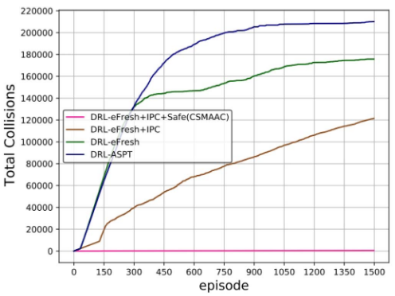

Fig. 5. Convergence and rewards of different methods.

As illustrated in Fig. 5, FullC gets a greater reward than the MADDPG-based crowdsensing approach (namely, DRL-ASPT), indicating that communication can assist UAVs in acquiring beneficial data and mastering improved flight trajectories. Nevertheless, RandomC performs more poorly than DRL-ASPT, confirming that extra information can detract from the performance. DRL-eFresh+IPC outperforms FullC. This indicates that redundancy is present even in full communication among UAVs with observed UAVs, and DRL-eFresh+IPC can distill essential communications for swifter convergence and enhanced performance. Furthermore, in the experimental setup, RandomC is adjusted by the parameter $p _ { c }$ to match the communication frequency of DRL-eFresh+IPC. Nonetheless, DRL-eFresh+IPC significantly outperforms RandomC. This confirms that the causal relationships between UAVs accurately reflect the essential nature of communication, and the learned prior network is also productive. Finally, based on the DRLeFresh+IPC algorithm, we propose a safe optimization module, i.e., the DRL-eFresh+IPC+Safe algorithm (CSMAAC). In Fig. 5, we can observe that compared to the DRL-eFresh+IPC algorithm; the CSMAAC algorithm achieved a slight improvement in terms of rewards. Both the DRL-eFresh+IPC and the CSMAAC exhibit analogous reward convergence patterns, indicating that these patterns remain unaffected by imposed constraints.

<!-- image-->  

Fig. 6. Total Collisions of different methods.

<!-- image-->  
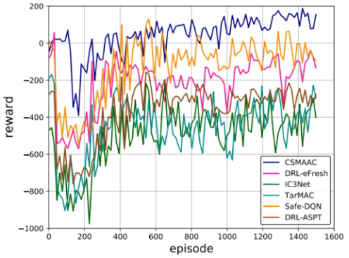

Fig. 7. Convergence and rewards of different methods. vs. Episodes.

As illustrated in Fig. 6, we demonstrate the change in the total collision count of different algorithms during the training episodes. Specifically, based on the DRL-eFresh+IPC algorithm, we propose a safe optimization module, i.e., the DRLeFresh+IPC+Safe algorithm (CSMAAC). Compared to other algorithms, the CSMAAC algorithm reduces the total number of collisions by 99.57% to 99.90%. This is because we introduce a safety layer to the actor-network to avoid violating the collision constraints between UAVs, thus significantly reducing the total number of collisions.

In Fig. 7, we can see that compared to other algorithms, the CSMAAC algorithm obtained the highest algorithm reward. This is mainly because we first propose an independent prediction communication partner model. Based on the local observations of UAVs, causal reasoning is used to obtain prior communication information between UAVs through feedforward neural networks to help UAVs identify potential communication partners. After that, we use the Critic Network to predict the impact of one UAV on another and quantify the influence to determine the necessity of communication between drones. Through the necessary information exchange between UAVs, UAVs can perceive global information, thereby solving some of the observability problems of drones and improving the rewards of the algorithm. Moreover, we introduce a safety layer to each UAV’s flight decisions that map the UAV’s collision violation strategy into the secure domain by employing a linear approximation of the constraint function, thereby enabling the safety layer to be formulated as a quadratic program.

In Fig. 8, we investigate the total number of collisions for different algorithms over various episodes. In Fig. 8, we can observe that the CSMAAC algorithm achieved the lowest number of collisions compared to other algorithms. For example, the CSMAAC algorithm reduces the total number of collisions by over 99.71% compared to other algorithms. This is mainly because we introduce a safety layer to the actor-network to avoid violating critical security constraints, thereby reducing the total number of collisions.

<!-- image-->  
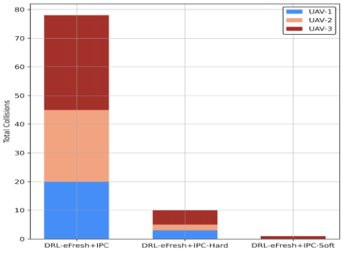

Fig. 8. Total Collisions of different methods. vs. Episodes.

<!-- image-->  

Fig. 9. Number of collisions for each of the three UAVs in a training episode.

<!-- image-->  
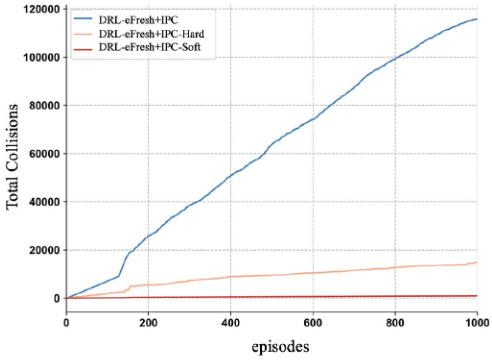

Fig. 10. Cumulative number of collisions throughout the training process for different models.

In Fig. 9, we explore the number of collisions of three UAVs in one episode during training for different algorithms. Compared with the DRL-eFresh+IPC algorithm, both the DRLeFresh+IPC algorithm with hard constraints and the DRLeFresh+IPC algorithm with soft constraints reduce the number of collisions to a certain extent, thus verifying that the algorithm with the safety filter module can also reliably avoid collisions during training. It is worth noting that the algorithm that incorporates soft constraints achieves the lowest number of collisions. This is because the DRL-eFresh+IPC-Soft algorithm imposes a relaxed state constraint while imposing a penalty to balance the relationship between exploration and safety. In this way, the DRL-eFresh+IPC-Soft algorithm can maintain exploration capabilities to a certain extent, avoiding the problem of infeasible solutions that may be caused by strict restrictions while maximizing rewards and ensuring safety.

<!-- image-->

<!-- image-->  
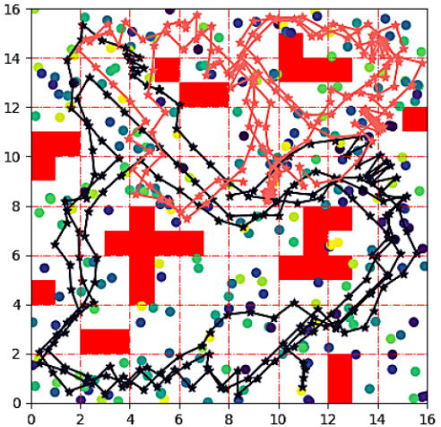

Fig. 11. The CEF and average number of collisions over ten tests.

<!-- image-->  

Fig. 12. In UAV-assisted crowd sensing system, 2 UAVs flight trajectories (red blocks represent obstacles, circles represent PoIs).

Fig. 10 shows the change of cumulative collision times of different algorithms in the whole training process. Compared with the DRL efresh+IPC algorithm without collision constraint, the cumulative collision times of the DRL efresh+IPC-Soft algorithm are reduced by 99.15%. However, the collision times of the DRL efresh+IPC-Hard algorithm are only reduced by 87.2%. This is because the soft constraint security layer can maintain feasibility and security when the hard constraint formula cannot return to the solution. In UAV flight control, a soft constraint may punish the UAV when it approaches obstacles rather than directly prohibit such behaviour. Therefore, the UAV may violate this constraint to a certain extent during the flight mission, but it will also be punished accordingly to remind the system to avoid this situation as much as possible.

To better understand the performance of the proposed algorithm after convergence, we conducted 10 simulation tests. Fig. 11 shows the average number of collisions and the average energy consumption ratio of the 10 tests. It is obvious that the average energy consumption ratios of the three algorithms are basically the same, but the DRL-eFresh+IPC-Soft algorithm achieves the least number of collisions. This is because the DRL-eFresh+IPC-Hard algorithm is subject to strict state restrictions to prevent the UAV from taking unsafe actions under any circumstances. This approach may limit the exploration ability in the early stages of training, and there may be infeasible solutions, thereby increasing the number of collisions.

As shown in Figs. 12, 13, and 14, we present the flight trajectories of 2, 3, and 4 UAVs. Specifically, as illustrated in Fig. 12, the two UAVs primarily focus on operating within their respective halves of the area, where they are responsible for data collection, thereby optimizing their potential rewards. Because of each UAV’s restricted sensing range and data-gathering ability, a single observation is insufficient to gather all the information about the PoI. Thus, both UAVs effectively learned to collect data repetitively in a small zone until all information was acquired from that zone. At the same time, to achieve a relatively more equitable data gathering (as specified in the reward function), these two UAVs do not follow a fixed path to traverse the area; instead, they have made effective adjustments slightly diverging from the traversing path to encompass other PoIs. For instance, the black UAV even travels to the upper left corner to collect edge case data. With the rise in the number of UAVs, we notice significantly more detailed trajectories of each UAV (i.e., smaller movement step size and collection zone). For instance, in Fig. 13, 3 UAVs initially detected the central area of all PoIs by manoeuvring around and then proceeded to other locations. Additionally, from Fig. 14, we observe that each UAV assumes responsibility to detect a localized area because sufficient UAVs are positioned, and they have acquired the ability to cooperate but not to venture into the territories of others. Contrasting Figs. 12 and 14, we observe that the travelling distance for 2 UAVs is significantly greater on average. This occurs because to maintain a more equitable data acquisition; two UAVs must detect PoIs that are infrequently sensed and, therefore, oscillating back and forth and cannot be evaded. Ultimately, we observe that all UAVs successfully evade obstacles and never exceed the boundaries.

<!-- image-->  
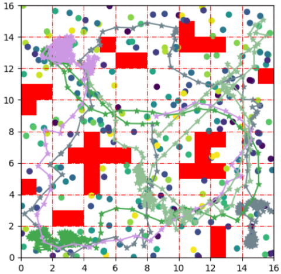

Fig. 13. In UAV-assisted crowd sensing system, 3 UAVs flight trajectories (red blocks represent obstacles, circles represent PoIs).

<!-- image-->  

Fig. 14. In UAV-assisted crowd sensing system, 4 UAVs flight trajectories (red blocks represent obstacles, circles represent PoIs).

<!-- image-->  
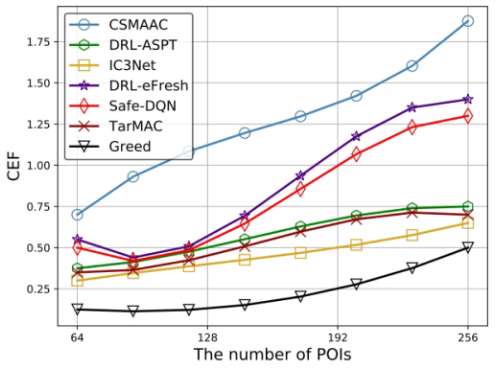

Fig. 15. Variation of communication overhead throughout the course of an episode in the UAV-assisted crowd sensing system.

<!-- image-->  

Fig. 16. The impact of different PoIs on the CEF.

<!-- image-->  
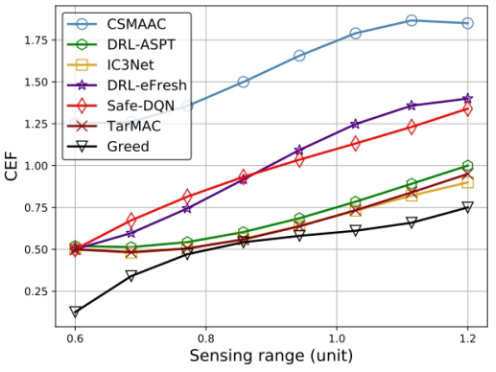

Fig. 17. The impact of different sensing range (unit) on the CEF.

As illustrated in Fig. 15, we analyze the communication behavior of the IPC algorithm. In Fig. 15, we demonstrate the variation in communication overhead throughout an episode, where the communication overhead represents the ratio between the total number of communicating UAVs and the total number of observed UAVs for all UAVs. At the start of the episode, the communication overhead quickly rises to over 90%. This is because at the beginning of the episode, the UAVs need to determine the cooperating UAVs and avoid data collection conflicts between UAVs, so more communication and exchange between UAVs are needed to form a consensus. As the episode advances, UAVs are getting closer and closer to their partners, and their impact on the flight strategies of other UAVs is becoming smaller and smaller. Consequently, the communication overhead gradually decreases as well. Eventually, the communication overhead drops to below 15%.

As shown in Figs. 16, 17, and 18, we investigate the effects of different numbers of PoIs, varying sensing ranges, and different numbers of UAVs on the performance evaluation metrics (the collection-energy-fairness (CEF)) of the algorithm. Specifically, as shown in Fig. 16, the CEF of all algorithms also increases with the number of Pois. Although data density is increased, the CSMAAC algorithm can also control limited UAVs to sense them well. For example, in Fig. 16, when the number of PoIs is 256, the CEF of the CSMAAC algorithm is 1.88, which is more than 36.23% higher than other algorithms.

<!-- image-->  
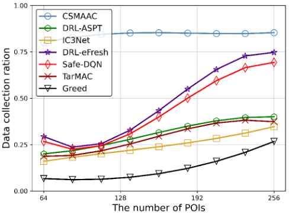

Fig. 18. The impact of different numbers of UAVs on the CEF.

<!-- image-->  

Fig. 19. The impact of the different numbers of PoIs on the data collection ratio of the algorithm.

Second, as depicted in Fig. 17, it is evident that the CEF for each algorithm rises steadily as the sensing range expands. This trend is attributed to the fact that a more excellent sensing range signifies an enhanced ability for all UAVs to gather data. Consequently, the movement of a single UAV can encompass a more significant number of data points, leading to an improved CEF. It is worth noting that CSMAAC consistently has the highest CEF. For instance, as shown in Fig. 17, when the sensing range is set to 1.0, CSMAAC records a CEF of 1.87, which is in contrast to the 1.38 CEF delivered by the top-performing baseline DRL-eFresh, representing a notable enhancement of 35.51%.

Finally, as shown in Fig. 18, we see that the energy efficiency of the CSMAAC algorithm does not increase with the number of UAVs and is even lower than the Greedy algorithm. This is because the CSMAAC algorithm utilizes some UAVs to sense PoIs in corner cases to improve the data collection ratio and the Jain fairness index, which results in higher energy consumption. Thus, lower CEF is expected.

In summary, the CSMAAC algorithm has achieved the best performance compared to most baselines. This is because, in the CSMAAC algorithm, we have introduced a communication module between UAVs and a safety optimization module, which solves the problem of partial observability and significantly reduces UAV collisions, thereby enhancing the algorithm’s performance.

As illustrated in Figs. 19, 20, and 21, we investigated the impact of different numbers of PoI, different sensing ranges, and different numbers of UAVs on the algorithm’s data collection ratio. Specifically, first, in Fig. 19, it is observable that the results of the CSMAAC algorithm marginally ascend as the quantity of PoIs grows, yet they remain at an exceedingly elevated level. This is because, as specified, an increased number of PoIs signifies a greater volume of initial data to be gathered; nonetheless, the CSMAAC algorithm continues to collect most of these data points effectively. Furthermore, the data collection ratios provided by the Greedy algorithm begin at a minimal level and climb swiftly as the number of PoIs increases. Still, they remain significantly below those of the CSMAAC algorithm. This occurs because when more PoIs are deployed, the intervals between them become smaller, enabling the Greedy algorithm to identify a greedy solution more readily. However, unlike our approach, it needs a comprehensive perspective on achieving equity and conserving energy over the extended term. Second, as depicted in Fig. 20, with the expansion of the sensing range, regardless of the model employed, the data collection ratio also experiences an enhancement since UAVs can detect a more significant number of PoIs with an extended sensing range. Additionally, at a sensing range of 1.2, the CSMAAC algorithm gathers 90% of all available data, which satisfies practical requirements. Finally, in Fig. 21, analogous patterns are noted; for instance, the CSMAAC algorithm surpasses all comparative baselines regarding the data collection ratio and the values for all increase with an increased number of UAVs. This is because, regardless of the model utilized, a more significant number of UAVs can invariably detect more PoIs concurrently.

<!-- image-->  
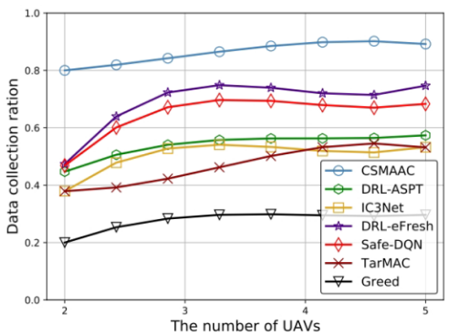

Fig. 20. The impact of the different sensing ranges on the data collection ratio of the algorithm.

<!-- image-->  

Fig. 21. The impact of the different numbers of UAVs on the data collection ratio of the algorithm.

As illustrated in Figs. 22, 23, and 24, we investigated the impact of different numbers of PoI, different sensing ranges, and different numbers of UAVs on the algorithm’s energy consumption ratio. Specifically, first, as illustrated in Fig. 22, as the number of PoIs increases, the energy consumption ratio of all algorithms gradually increases. This is because, with the increase of PoI, UAVs can collect more data and consume more energy, increasing the energy consumption ratio of all algorithms. In Fig. 22, it is observed that the CSMAAC algorithm’s energy expenditure increases with a higher number of PoIs due to the associated data collection costs. Second, in Fig. 23, it is evident that the energy consumption ratio of the CSMAAC algorithm increases more markedly than that of the baselines as the sensing range expands. This is attributed to the fact that three UAVs are insufficient to encompass the entire area, necessitating the UAVs to leverage their enhanced sensing capabilities to disperse more widely for a more equitable data collection process. Consequently, this results in increased energy expenditure for movement. Finally, as illustrated in Fig. 24, it is evident that the energy consumption ratio given by the CSMAAC algorithm keeps increasing with the number of UAVs. This occurs because the CSMAAC algorithm initiates from the same starting point, which is the centre of the area. An increased number of UAVs enables the rapid collection of PoIs in their vicinity, prompting the CSMAAC algorithm to adapt its navigation towards more distant locations to enhance fairness in data collection.

<!-- image-->  
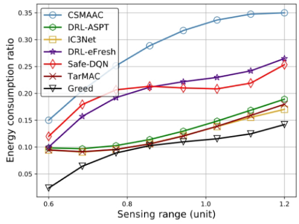

Fig. 22. The impact of the different numbers of PoIs on the energy consumption ratio of the algorithm.

<!-- image-->  

Fig. 23. The impact of the different sensing range on the energy consumption ratio of the algorithm.

<!-- image-->  
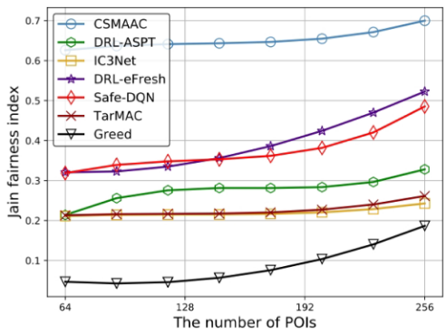

Fig. 24. The impact of the numbers of UAVs on the energy consumption ratio of the algorithm.

<!-- image-->  

Fig. 25. The impact of the numbers of PoIs on the Jain fairness index of the algorithm.

<!-- image-->  
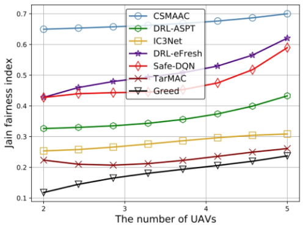

Fig. 26. The impact of the sensing range on the Jain fairness index of the algorithm.

<!-- image-->  

Fig. 27. The impact of the numbers of UAV on the Jain fairness index of the algorithm.

As illustrated in Figs. 25, 26, and 27, we investigated the impact of different numbers of PoI, different sensing ranges, and different numbers of UAVs on the algorithm’s Jain fairness index. Specifically, in Fig. 25, we see that the number of PoIs does not significantly impact the algorithm’s Jain fairness index. Compared to most baselines, the CSMAAC algorithm has achieved the best performance. For example, when the number of PoIs is 256, the Jain fairness index of the CSMAAC algorithm increased by over 34.62% compared to other algorithms. We have introduced a communication module between UAVs and a safety optimization module in the CSMAAC algorithm. This solves the problem of partial observability and significantly reduces UAV collisions, enhancing the algorithm’s performance. Second, similarly, as depicted in Fig. 26, it is evident that the Jain fairness index delivered by the CSMAAC algorithm also escalates with an extended sensing range. Finally, in Fig. 27, it is observable that the Jain fairness index experiences a modest rise with an increasing number of UAVs. This occurs because the quantity of covered PoIs will expand alongside the number of UAVs, implying that achieving a higher degree of fairness becomes more feasible for the CSMAAC algorithm.

<!-- image-->  
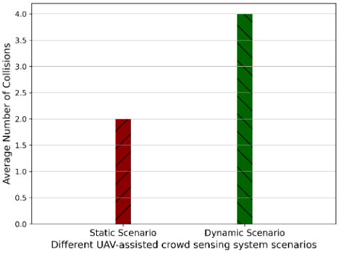

Fig. 28. Average CEF of the CSMAAC algorithm in different scenarios.

<!-- image-->  

Fig. 29. Average number of collisions of the CSMAAC algorithm in different scenarios.

Similar to these studies [38], [39], we extend the proposed UAV-assisted crowd-sensing system model to a system model with dynamic obstacles and mobile PoIs. Specifically, we assume that at the beginning of each episode, the positions of all PoIs and obstacles are initialized based on a random distribution. Throughout the episode, each PoI and obstacle is allowed to move randomly within the ranges of $\Delta \ x \in [ 0 , 1 . 5 ]$ meters, $\Delta \ y \in [ 0 , 1 . 5 ]$ meters, and $\Delta \ z \in [ 0 , 1 . 5 ]$ along the x, y, and z dimensions, respectively. In addition, we conducted ten simulation tests on the proposed algorithm in dynamic and static UAV-assisted crowd-sensing system scenarios. Fig. 4.10 shows the average number of collisions and average CEF for the ten tests. In addition, we will conduct ten simulation tests of the proposed algorithm on dynamic and static UAV-assisted crowd-sensing system scenarios. Figs. 28 and 29 show the average CEF and average number of collisions for the ten tests. From Figs. 28 and 29, we can see that compared to the static scenario, the performance of the proposed algorithm has decreased in the dynamic scenario. This is because PoIs and obstacles move randomly, requiring efficient cooperation between UAVs to perceive the distribution of PoIs and obstacles and avoid higher probability collisions. It is worth noting that the proposed algorithm still maintains high performance. This is because the proposed algorithm integrates efficient communication modules between UAVs and collision avoidance modules, achieving the best collaboration strategy and significantly reducing collision frequency through efficient message passing between UAVs and collision constraint algorithms.

To demonstrate the superiority of the proposed safe optimization module, we compare the proposed algorithm with existing collision avoidance methods, e.g., optimal reciprocal collision avoidance algorithm (ORCA) [40], artificial potential field algorithm (APF) [41], and model predictive control algorithm (MPC) [42]. From Figs. 30 and 31, we can see that compared to other algorithms, the proposed algorithm achieves the best performance. For example, the number of collisions decreased by 61.54%∼66.67%, and the CEF increased by 14.29%∼23.08%. This is because we proposed an improved multi-agent actorcritic by adding a safety layer to Actor-Network to avoid violating critical security constraints. Specifically, first, the concept of linearizing the single-step transition dynamics is extended to the multiple UAV crowd-sensing system environment, similar to its prior use in single-UAV crowd-sensing systems. Second, soft constraints are further introduced to mitigate infeasibility issues during the action adjustment phase. Therefore, the proposed algorithm can improve performance and reduce collision frequency.

<!-- image-->  
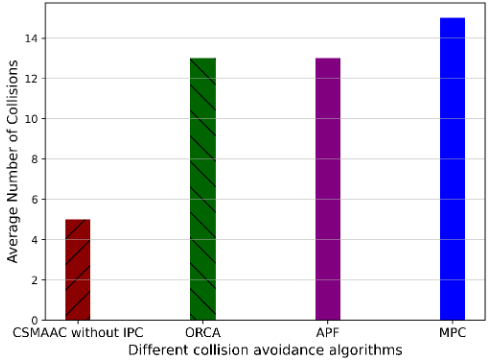

Fig. 30. Average CEF of the different algorithms.

<!-- image-->  

Fig. 31. Average number of collisions of the different algorithms.

<!-- image-->  
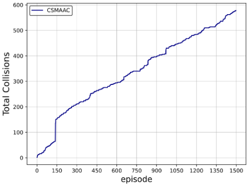

Fig. 32. Average reward of the CSMAAC algorithm.

As shown in Figs. 32 and 33, we conducted the training experiments of CSMAAC on a Gazebo-based testbed. From Fig. 32, we can see that the reward of CSMAAC can achieve model convergence through sufficient episodes. From Fig. 1, we can see that the reward of CSMAAC can achieve model convergence through sufficient episodes. This indicates that the communication module between UAVs and the collision avoidance module can operate normally. Through data analysis, compared with the experimental results on the UAV crowd sensing numerical simulation testbed designed by us, the reward of the CSMAAC algorithm is reduced by 6.51%, and the number of collisions is increased by 7.96%. As mentioned in these UAV-assisted crowd-sensing studies [5], [27], the performance degradation of CSMAAC is acceptable.

<!-- image-->  

Fig. 33. Average number of collisions of the CSMAAC algorithm.

1) Extension to 3D UAV-Assisted Crowd Sensing System Environment: In the real-world, UAVs and PoIs in UAV-assisted crowd-sensing scenarios usually have different altitudes. However, our proposed UAV control flight method can also be easily applied to real-world scenarios. Specifically, First, altitude control can be incorporated by introducing an additional dimension into each UAV’s action space, which neither alters the CSMAAC algorithm architecture nor imposes a significant computational overhead on action generation. Second, According to [43], UAVs generally fly at heights exceeding 50 meters when serving as aerial mobile base stations. In certain cases, the system model may remain unchanged since UAVs might not need to ascend or descend to avoid tall structures. Finally, the corresponding 3D euclidean distance can be readily computed, and the channel model can be applied in three-dimensional scenarios. However, as the altitude increases, the path loss associated with different 2D ground projections becomes almost indistinguishable.

2) Computational Complexity Analysis: Based on Section V, we know that the CSMAAC algorithm mainly includes UAV communication and collision avoidance modules. Therefore, we mainly analyze the computational complexity of these two optimization modules. Specifically, first, the computational complexity of the UAV communication module is determined by the UAV agent’s local observation input $o _ { u } .$ . Each observation, with input dimension $d = \dim ( o _ { u } )$ , is processed by several fully connected (FC) layers in the actor-network, critic-network, and prior-network. The overall FC component contributes $\mathcal { O } ( L _ { f c } ^ { \mathrm { t o t a l } }$ $( d \cdot h + h ^ { 2 } ) )$ to the complexity, where h is the hidden layer size. $L _ { f c } ^ { \mathrm { t o t a l } }$ denotes the total number of fully connected layers. Additionally, the message encoder employs $L _ { l s t m }$ stacked long short-term memory (LSTM) layers with input length $I _ { i n } ,$ resulting in an extra complexity of $\mathcal { O } ( L _ { l s t m } \cdot I _ { i n } \cdot ( d \cdot h + h ^ { 2 } ) )$ . Therefore, the total all UAV agent complexity can be approximated as: ${ \mathcal { O } } _ { \mathrm { t o t a l } } ^ { \mathrm { c o m m } } = U \cdot \left( L _ { f c } ^ { \mathrm { t o t a l } } + L _ { l s t m } \cdot I _ { i n } \right) \cdot { \mathcal { O } } ( h ^ { 2 } )$ . Second, in the process of training the safety layer, we employ a basic fully connected ReLU network $F ( S ; \omega _ { j } )$ with a hidden layer containing 10 neurons for each of the $N _ { \mathrm { c o n } }$ defined constraints. It is worth noting that, due to the symmetric nature of the pairwise constraints in the experiment (i.e., a collision between A and B implies a collision between B and A), the network architecture could theoretically be simplified. However, for the sake of generality, we chose to treat them as separate constraints. To address the quadratic programming (QP) problem, we utilized the qpsolvers library, relying on the operator splitting quadratic program solver (OSQP) method initially introduced in [44]. The computational complexity of the safety layer mainly consists of two parts: neural network inference and QP problem-solving. G is the number of obstacles. For each of the $N _ { \mathrm { c o n } } = U ( U - 1 ) + U \cdot G$ pairwise collision constraints, a fully connected ReLU network with an input dimension of d and a hidden layer of size H is used to predict constraint satisfaction, leading to a total forward-pass complexity of $\mathcal { O } ( N _ { \mathrm { c o n } } \cdot d H )$ . In addition, solving the QP problem over the 2U-dimensional action space under these constraints using the OSQP method would result in complexity of ${ \mathcal { O } } ( ( U + G ) ^ { \bar { 2 } } )$ . Therefore, the overall complexity of the collision avoidance module per decision step is approximately $\mathcal { O } _ { \mathrm { t o t a l } } ^ { \mathrm { s a f e } } ( ( U ( U - 1 ) + U G ) \cdot d H + ( U + G ) ^ { 2 } )$ In summary, the total computational complexity of the CS-MAAC algorithm is approximate: ${ \mathcal { O } } _ { \mathrm { t o t a l } } = U \cdot ( L _ { f c } ^ { \mathrm { t o t a l } } + L _ { l s t m }$ $I _ { i n } ) \cdot \mathcal { O } ( h ^ { 2 } ) + \mathcal { O } ( ( U ( U - 1 ) + U G ) \cdot d H + ( \hat { U _ { \mathit { \Phi } } } + G ) ^ { 2 } )$

## VII. CONCLUSION

In this paper, we propose a CSMAAC-based UAV flight control method in a partially observable multi-UAV-assisted crowd-sensing system. First, we propose an independent prediction communication partner model to address the partial observability problem. Second, we propose a similarity enhancement mechanism to improve the learning efficiency of the model by enhancing the connection between UAV observations and the policies of other UAVs. Finally, we introduce a safety layer to the actor-network to ensure safe UAV flight. Experiments show that CSMAAC achieves the best CEF and significantly reduces communication overhead and collisions compared with other algorithms. In the future, we will further design numerical simulation environments that consider more environmental factors to improve the adaptability of the algorithm in the real world.

## REFERENCES

[1] X. Yang, E. del Rey Castillo, Y. Zou, and L. Wotherspoon, “UAV-deployed deep learning network for real-time multi-class damage detection using model quantization techniques,” Automat. Construction, vol. 159, 2024, Art. no. 105254.

[2] Y. He et al., “Air-to-ground integrated internet of vehicles enhanced by LAPSs and RISs: Location, power, and phase shift optimization,” IEEE Internet Things J., vol. 11, no. 10, pp. 18020–18034, May 2024.

[3] P. Wan, G. Xu, J. Chen, and Y. Zhou, “Deep reinforcement learning enabled multi-UAV scheduling for disaster data collection with time-varying value,” IEEE Trans. Intell. Transp. Syst., vol. 25, no. 7, pp. 6691–6702, Jul. 2024.

[4] M. Adil et al., “UAV-assisted IoT applications, QoS requirements and challenges with future research directions,” ACM Comput. Surv., vol. 56, no. 10, pp. 1–35, 2024.

[5] Z. Dai et al., “AoI-minimal UAV crowdsensing by model-based graph convolutional reinforcement learning,” in Proc. IEEE Conf. Comput. Commun., 2023, pp. 1029–1038.

[6] Z. Dai, C. H. Liu, R. Han, G. Wang, K. K. Leung, and J. Tang, “Delaysensitive energy-efficient UAV crowdsensing by deep reinforcement learning,” IEEE Trans. Mobile Comput., vol. 22, no. 4, pp. 2038–2052, Apr. 2023.

[7] C. Dai, K. Zhu, and E. Hossain, “Multi-agent deep reinforcement learning for joint decoupled user association and trajectory design in full-duplex multi-UAV networks,” IEEE Trans. Mobile Comput., vol. 22, no. 10, pp. 6056–6070, Oct. 2023.

[8] X. Cheng, R. Jiang, H. Sang, G. Li, and B. He, “Joint optimization of multi-UAV deployment and user association via deep reinforcement learning for long-term communication coverage,” IEEE Trans. Instrum. Meas., vol. 73, 2024, Art. no. 5503613.

[9] X. Cheng, R. Jiang, H. Sang, G. Li, and B. He, “Trace pheromone-based energy-efficient UAV dynamic coverage using deep reinforcement learning,” IEEE Trans. Cogn. Commun. Netw., vol. 10, no. 3, pp. 1063–1074, Jun. 2024.

[10] C. H. Liu, X. Ma, X. Gao, and J. Tang, “Distributed energy-efficient multi-UAV navigation for long-term communication coverage by deep reinforcement learning,” IEEE Trans. Mobile Comput., vol. 19, no. 6, pp. 1274–1285, Jun. 2020.

[11] D. He, J. Zhang, L. Xu, Y. Liu, and X. Ye, “DRL-UPPS: User trajectory privacy protection strategy based on deep reinforcement learning in mobile crowdsensing,” IEEE Trans. Computat. Social Syst., to be published, doi: 10.1109/TCSS.2025.3543289.

[12] A. Dai, R. Li, Z. Zhao, and H. Zhang, “Graph convolutional multi-agent reinforcement learning for UAV coverage control,” in Proc. IEEE 2020 Int. Conf. Wireless Commun. Signal Process., 2022, pp. 1106–1111.

[13] C. H. Liu, Z. Chen, J. Tang, J. Xu, and C. Piao, “Energy-efficient UAV control for effective and fair communication coverage: A deep reinforcement learning approach,” IEEE J. Sel. Areas Commun., vol. 36, no. 9, pp. 2059–2070, Sep. 2018.

[14] N. Zhao, Y. Sun, Y. Pei, and D. Niyato, “Joint sensing and computation incentive mechanism for mobile crowdsensing networks: A multi-agent reinforcement learning approach,” IEEE Internet Things J., vol. 12, no. 9, pp. 13033–13046, May 2025.

[15] Z. Dai, H. Wang, C. H. Liu, R. Han, J. Tang, and G. Wang, “Mobile crowdsensing for data freshness: A deep reinforcement learning approach,” in Proc. IEEE Conf. Comput. Commun., 2022, pp. 1–10.

[16] C. K. De Dreu, A. Fariña, J. Gross, and A. Romano, “Prosociality as a foundation for intergroup conflict,” Curr. Opin. psychol., vol. 44, pp. 112– 116, 2022.

[17] K. Li, W. Ni, X. Yuan, A. Noor, and A. Jamalipour, “Deep-graph-based reinforcement learning for joint cruise control and task offloading for aerial edge Internet of Things (EdgeIoT),” IEEE Internet Things J., vol. 9, no. 21, pp. 21676–21686, Nov. 2022.

[18] X. Zhang, H. Zhao, J. Wei, C. Yan, J. Xiong, and X. Liu, “Cooperative trajectory design of multiple UAV base stations with heterogeneous graph neural networks,” IEEE Trans. Wireless Commun., vol. 22, no. 3, pp. 1495–1509, May 2023.

[19] K. Li, X. Wang, Q. He, M. Yang, M. Huang, and S. Dustdar, “Task computation offloading for multi-access edge computing via attention communication deep reinforcement learning,” IEEE Trans. Services Comput., vol. 16, no. 4, pp. 2985–2999, Jul./Aug. 2023.

[20] B. Zhang, B. Tang, and F. Xiao, “Learning to coordinate in mobile-edge computing for decentralized task offloading,” IEEE Internet Things J., vol. 10, no. 1, pp. 893–903, Jan. 2023.

[21] C. Bai, P. Yan, H. Piao, W. Pan, and J. Guo, “Learning-based multi-UAV flocking control with limited visual field and instinctive repulsion,” IEEE Trans. Cybern., vol. 54, no. 1, pp. 462–475, Jan. 2024.

[22] X. Wang, M. C. Gursoy, T. Erpek, and Y. E. Sagduyu, “Learning-based UAV path planning for data collection with integrated collision avoidance,” IEEE Internet Things J., vol. 9, no. 17, pp. 16663–16676, Sep. 2022.

[23] E. Altman, “Constrained markov decision processes with total cost criteria: Lagrangian approach and dual linear program,” Math. Methods Operations Res., vol. 48, pp. 387–417, 1998.

[24] T. Zhang, J. Lei, Y. Liu, C. Feng, and A. Nallanathan, “Trajectory optimization for UAV emergency communication with limited user equipment energy: A safe-DQN approach,” IEEE Trans. Green Commun. Netw., vol. 5, no. 3, pp. 1236–1247, Sep. 2021.

[25] X. Zhou, X. Zhang, H. Zhao, J. Xiong, and J. Wei, “Constrained soft actorcritic for energy-aware trajectory design in UAV-aided IoT networks,” IEEE Wireless Commun. Lett., vol. 11, no. 7, pp. 1414–1418, Jul. 2022.

[26] Y. Zhang, Z. Mou, F. Gao, J. Jiang, R. Ding, and Z. Han, “UAV-enabled secure communications by multi-agent deep reinforcement learning,” IEEE Trans. Veh. Technol., vol. 69, no. 10, pp. 11599–11611, Oct. 2020.

[27] Y. Ye et al., “Exploring both individuality and cooperation for air-ground spatial crowdsourcing by multi-agent deep reinforcement learning,” in Proc. IEEE 39th Int. Conf. Data Eng., 2023, pp. 205–217.

[28] K. Wei et al., “High-performance UAV crowdsensing: A deep reinforcement learning approach,” IEEE Internet Things J., vol. 9, no. 19, pp. 18487–18499, Oct. 2022.

[29] T. Wang, J. Wang, C. Zheng, and C. Zhang, “Learning nearly decomposable value functions via communication minimization,” 2021, arXiv:1910.05366.

[30] J. Jiang and Z. Lu, “Learning attentional communication for multiagent cooperation,” in Proc. Adv. Neural Inf. Process. Syst., 2019, pp. 7265–7275.

[31] T. Thorpe, “Multi-agent reinforcement learning: Independent vs. cooperative agents,” Ph.D. dissertation, Master’s thesis, Department of Computer Science, Colorado State University, 1997.

[32] D. M. Chiu, “A quantitative measure of fairness and discrimination for resource allocation in shared computer systems,” Digital Equipment Corporation, Tech. Rep. TR-301, 1984.

[33] E. C. Kerrigan and J. M. Maciejowski, “Soft constraints and exact penalty functions in model predictive control,” in Proc. Control 2000 Conf., Cambridge, 2000, pp. 2319–2327.

[34] R. Lowe, Y. I. Wu, A. Tamar, J. Harb, O. PieterAbbeel, and I. Mordatch, “Multi-agent actor-critic for mixed cooperative-competitive environments,” in Proc. Adv. Neural Inf. Process. Syst., 2017, pp. 6382–6393.

[35] A. Das et al., “Tarmac: Targeted multi-agent communication,” in Proc. Int. Conf. Mach. Learn., 2019, pp. 1538–1546.

[36] A. Singh, T. Jain, and S. Sukhbaatar, “Learning when to communicate at scale in multiagent cooperative and competitive tasks,” 2019, arXiv:1812.09755.

[37] L. Deng, W. Gong, M. Liwang, L. Li, B. Zhang, and C. Li, “Towards intelligent mobile crowdsensing with task state information sharing over edge-assisted UAV networks,” IEEE Trans. Veh. Technol., vol. 73, no. 8, pp. 11773–11788, Aug. 2024.

[38] L. Huber, J.-J. Slotine, and A. Billard, “Avoiding dense and dynamic obstacles in enclosed spaces: Application to moving in crowds,” IEEE Trans. Robot., vol. 38, no. 5, pp. 3113–3132, Oct. 2022.

[39] J. Feng, J. Zhang, G. Zhang, S. Xie, Y. Ding, and Z. Liu, “UAV dynamic path planning based on obstacle position prediction in an unknown environment,” IEEE Access, vol. 9, pp. 154679–154691, 2022.

[40] J. Van Den, S. J. Berg, M. GuyLin, and D. Manocha, “Optimal reciprocal collision avoidance for multi-agent navigation,” in Proc. IEEE Int. Conf. Robot. Automat., Anchorage (AK), USA, 2010.

[41] Q. Zhu, Y. Yan, and Z. Xing, “Robot path planning based on artificial potential field approach with simulated annealing,” in Proc. IEEE 6th Int. Conf. Intell. Syst. Des. Appl., 2006, pp. 622–627.

[42] M. Castillo-Lopez, S. A. Sajadi-Alamdari, J. L. Sanchez-Lopez, M. A. Olivares-Mendez, and H. Voos, “Model predictive control for aerial collision avoidance in dynamic environments,” in Proc. IEEE 26th Mediterranean Conf. Control Automat., 2018, pp. 1–6.

[43] 3GPP, “5G; study on scenarios and requirements for next generation access technologies,” Sophia Antipolis Cedex, France, Tech. Rep. 36.913, 5, 2017, version 14.2.0, 2017.

[44] B. Stellato, G. Banjac, P. Goulart, A. Bemporad, and S. Boyd, “OSQP: An operator splitting solver for quadratic programs,” Math. Program. Comput., vol. 12, no. 4, pp. 637–672, 2020.

Zhen Gao received the MS degree from the School of Computer Science and Engineering, Northeastern University, Shenyang, China, in 2020. His research interests include MEC, task offloading, and reinforement learning.

<!-- image-->

<!-- image-->

Gang Wang received the BS and MS degrees in 2015 and 2019, respectively. He is currently working toward the PhD degree with the Department of Computer Science and Engineering, the Northeast University, Shenyang. He research interests include blockchain, federated learning.

<!-- image-->

<!-- image-->

Lei Yang received the PhD degree in computer application and technology from Northeastern University, China, in 2008. He is an associate professor with the School of Computer Science and Engineering, Northeastern University, China. His current research interests include Big Data, cloud computing.

Chenhao Ying received the BE degree from the Department of Communication Engineering, Xidian University, China, in 2016 and the PhD degree from the Department of Computer Science and Engineering, Shanghai Jiao Tong University, China, in 2022. He is a research assistant professor of Department of Computer Science and Engineering, Shanghai Jiao Tong University, China. His current research interests include mobile crowd sensing, blockchain.

---

## 📷 Images

The following images were extracted from this PDF:

1. [[../extracted_images/Gao-2025-CSMAAC_ Multi-Agent Reinforcement Lea/page_6_img_1.jpeg|page_6_img_1]]
2. [[../extracted_images/Gao-2025-CSMAAC_ Multi-Agent Reinforcement Lea/page_7_img_1.png|page_7_img_1]]
3. [[../extracted_images/Gao-2025-CSMAAC_ Multi-Agent Reinforcement Lea/page_9_img_1.jpeg|page_9_img_1]]
4. [[../extracted_images/Gao-2025-CSMAAC_ Multi-Agent Reinforcement Lea/page_12_img_1.png|page_12_img_1]]
5. [[../extracted_images/Gao-2025-CSMAAC_ Multi-Agent Reinforcement Lea/page_13_img_1.png|page_13_img_1]]
6. [[../extracted_images/Gao-2025-CSMAAC_ Multi-Agent Reinforcement Lea/page_13_img_2.png|page_13_img_2]]
7. [[../extracted_images/Gao-2025-CSMAAC_ Multi-Agent Reinforcement Lea/page_13_img_3.png|page_13_img_3]]
8. [[../extracted_images/Gao-2025-CSMAAC_ Multi-Agent Reinforcement Lea/page_13_img_4.jpeg|page_13_img_4]]
9. [[../extracted_images/Gao-2025-CSMAAC_ Multi-Agent Reinforcement Lea/page_13_img_5.jpeg|page_13_img_5]]
10. [[../extracted_images/Gao-2025-CSMAAC_ Multi-Agent Reinforcement Lea/page_14_img_1.jpeg|page_14_img_1]]
11. [[../extracted_images/Gao-2025-CSMAAC_ Multi-Agent Reinforcement Lea/page_14_img_2.png|page_14_img_2]]
12. [[../extracted_images/Gao-2025-CSMAAC_ Multi-Agent Reinforcement Lea/page_14_img_3.png|page_14_img_3]]
13. [[../extracted_images/Gao-2025-CSMAAC_ Multi-Agent Reinforcement Lea/page_14_img_4.png|page_14_img_4]]
14. [[../extracted_images/Gao-2025-CSMAAC_ Multi-Agent Reinforcement Lea/page_15_img_1.png|page_15_img_1]]
15. [[../extracted_images/Gao-2025-CSMAAC_ Multi-Agent Reinforcement Lea/page_15_img_2.png|page_15_img_2]]
16. [[../extracted_images/Gao-2025-CSMAAC_ Multi-Agent Reinforcement Lea/page_15_img_3.png|page_15_img_3]]
17. [[../extracted_images/Gao-2025-CSMAAC_ Multi-Agent Reinforcement Lea/page_15_img_4.png|page_15_img_4]]
18. [[../extracted_images/Gao-2025-CSMAAC_ Multi-Agent Reinforcement Lea/page_15_img_5.png|page_15_img_5]]
19. [[../extracted_images/Gao-2025-CSMAAC_ Multi-Agent Reinforcement Lea/page_16_img_1.png|page_16_img_1]]
20. [[../extracted_images/Gao-2025-CSMAAC_ Multi-Agent Reinforcement Lea/page_16_img_2.png|page_16_img_2]]
21. [[../extracted_images/Gao-2025-CSMAAC_ Multi-Agent Reinforcement Lea/page_16_img_3.png|page_16_img_3]]
22. [[../extracted_images/Gao-2025-CSMAAC_ Multi-Agent Reinforcement Lea/page_16_img_4.png|page_16_img_4]]
23. [[../extracted_images/Gao-2025-CSMAAC_ Multi-Agent Reinforcement Lea/page_16_img_5.png|page_16_img_5]]
24. [[../extracted_images/Gao-2025-CSMAAC_ Multi-Agent Reinforcement Lea/page_17_img_1.png|page_17_img_1]]
25. [[../extracted_images/Gao-2025-CSMAAC_ Multi-Agent Reinforcement Lea/page_17_img_2.png|page_17_img_2]]
26. [[../extracted_images/Gao-2025-CSMAAC_ Multi-Agent Reinforcement Lea/page_17_img_3.png|page_17_img_3]]
27. [[../extracted_images/Gao-2025-CSMAAC_ Multi-Agent Reinforcement Lea/page_17_img_4.jpeg|page_17_img_4]]
28. [[../extracted_images/Gao-2025-CSMAAC_ Multi-Agent Reinforcement Lea/page_17_img_5.png|page_17_img_5]]
29. [[../extracted_images/Gao-2025-CSMAAC_ Multi-Agent Reinforcement Lea/page_18_img_1.png|page_18_img_1]]
30. [[../extracted_images/Gao-2025-CSMAAC_ Multi-Agent Reinforcement Lea/page_18_img_2.png|page_18_img_2]]
31. [[../extracted_images/Gao-2025-CSMAAC_ Multi-Agent Reinforcement Lea/page_18_img_3.png|page_18_img_3]]
32. [[../extracted_images/Gao-2025-CSMAAC_ Multi-Agent Reinforcement Lea/page_18_img_4.png|page_18_img_4]]
33. [[../extracted_images/Gao-2025-CSMAAC_ Multi-Agent Reinforcement Lea/page_20_img_1.jpeg|page_20_img_1]]
34. [[../extracted_images/Gao-2025-CSMAAC_ Multi-Agent Reinforcement Lea/page_20_img_2.jpeg|page_20_img_2]]
35. [[../extracted_images/Gao-2025-CSMAAC_ Multi-Agent Reinforcement Lea/page_20_img_3.jpeg|page_20_img_3]]
36. [[../extracted_images/Gao-2025-CSMAAC_ Multi-Agent Reinforcement Lea/page_20_img_4.jpeg|page_20_img_4]]

---

