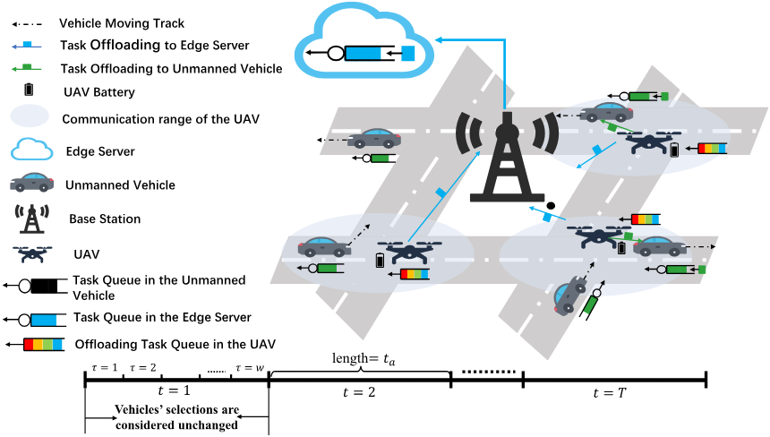
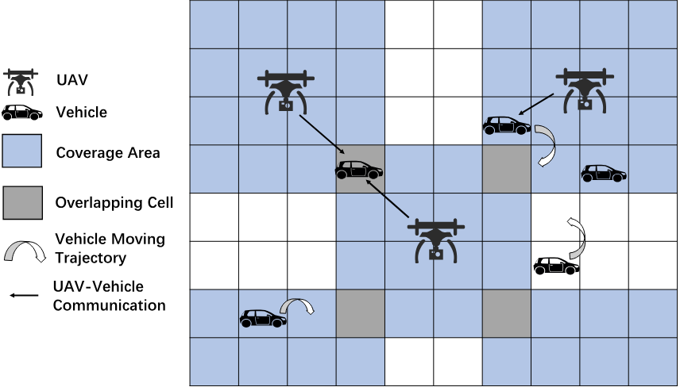
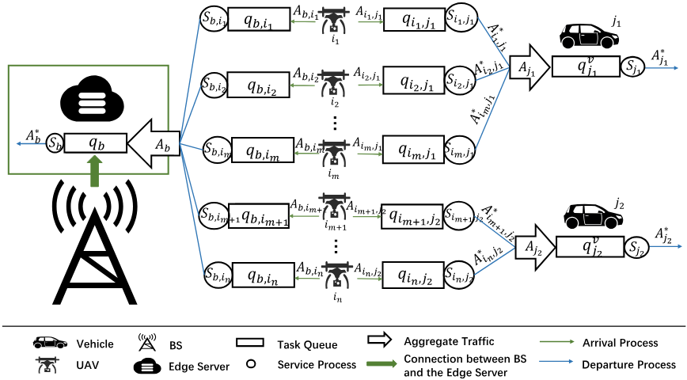
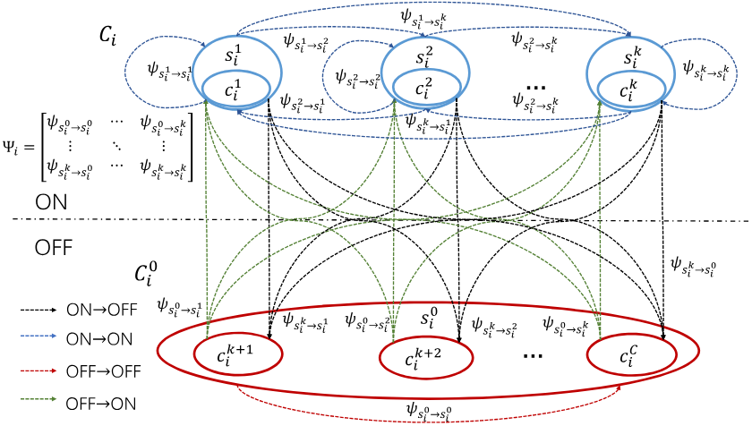
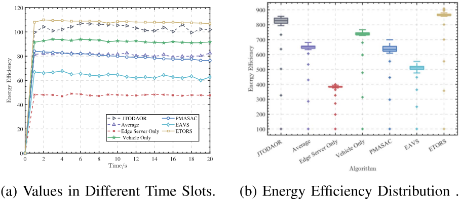
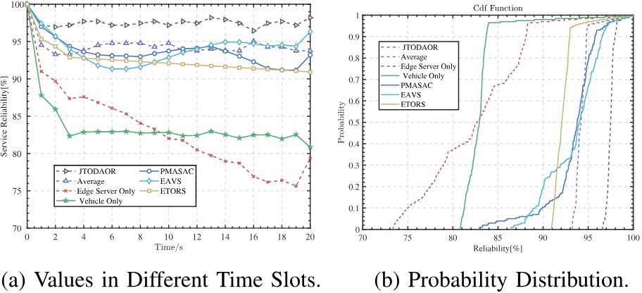
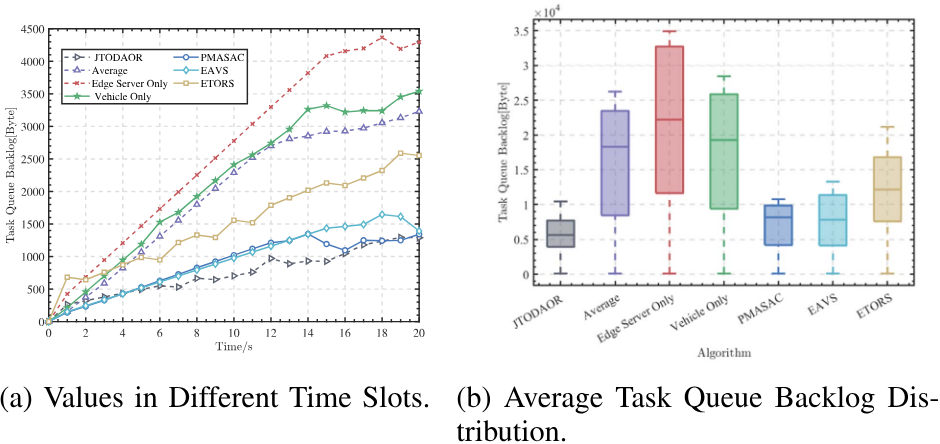
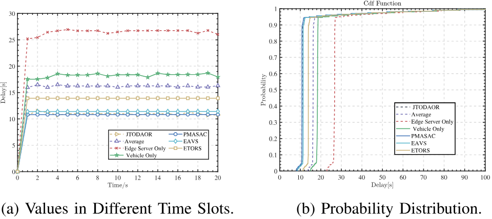
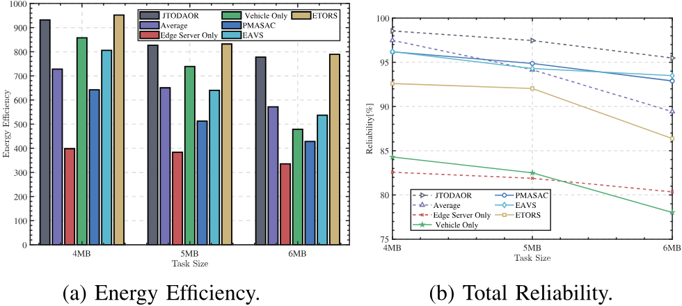
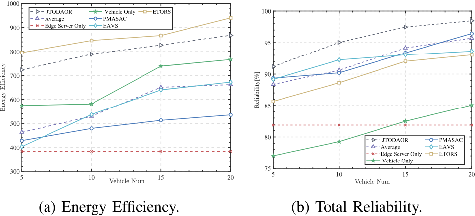

# Dynamic Task Offloading for Multi-UAVs in Vehicular Edge Computing With Delay Guarantees: A Consensus ADMM-Based Optimization

Rui Huang , Wushao Wen , Zhi Zhou , Member, IEEE, Chongwu Dong , Cheng Qiao , Member, IEEE, ZhiHong Tian , Senior Member, IEEE, and Xu Chen , Senior Member, IEEE

Abstract—Within the paradigm of forthcoming 6G network infrastructures, unmanned aerial vehicles (UAVs), functioning as principal conveyances, are projected to emerge as pivotal enablers in the nascent domain of the low-altitude economy. UAVs are poised to embrace various innovative applications, including latencysensitive and compute-intensive services. However, UAVs are constrained by their energy capacity and computational resources, rendering them insufficient for fulfilling the increasingly rigorous service demands in the future. To address these challenges, our investigation focuses on the innovative UAV-based Vehicular Edge Computing (UVEC) framework, incorporating Vehicular Edge Computing (VEC) in UAV systems to bolster service reliability. A UAV can enhance its mission duration by dynamically selecting suitable vehicles for computation offloading and adaptively adjusting the task offloading ratio between vehicles and the edge server. By integrating vehicle selection and task offloading scheduling in the UVEC framework, we investigate the optimization of energy efficiency while satisfying the statistical delay and the buffer constraints for UAVs. To deal with the proposed problem, a distributed algorithm is designed by jointly considering the vehicle selection for task offloading radio to vehicles and the edge server. The stochastic network calculus (SNC) is employed to derive performance bounds for the statistical delay and constraints, enabling robust analysis and optimization of network performance. After that, we leverage linear transformation techniques to reformulate the original problem into a linear framework, enabling the application of the Alternating Direction Method of Multipliers (ADMM) algorithm to efficiently solve the transformed problem. Theoretical analysis and simulation results show that our algorithm converges while effectively satisfying service reliability constraints within the desired targets, outperforming benchmark schemes in terms of efficiency while meeting task delay and error-rate bounded constraints.

Index Terms—6G, ADMM, stochastic network calculus, unmanned aerial vehicles, vehicular edge computing.

## 图像索引

本索引由 `raw/scripts/establish_image_links.py` 根据注释导出的图片标注解析生成。图片目录总览见 [huang2024DynamicTaskOffloading/README.md](../assets/huang2024DynamicTaskOffloading/README.md#asset-index)。

| 图号/表号 | 论文定位 | 资源文件 | 说明 |
| --- | --- | --- | --- |
| [Fig. 1](#fig-1) | p. 3 | [77THEKLU.png](../assets/huang2024DynamicTaskOffloading/77THEKLU.png) | System overview: a UAV-based vehicular edge computing. |
| [Table I](#table-1) | p. 4 | [LW48VS7J.png](../assets/huang2024DynamicTaskOffloading/LW48VS7J.png) | Summary of main notations |
| [Fig. 2](#fig-2) | p. 4 | [CH7ZRQ7H.png](../assets/huang2024DynamicTaskOffloading/CH7ZRQ7H.png) | Illustration of vehicle mobility in a cell-partitioned scenario with overlaps of communication coverage range for UAVs. |
| [Fig. 3](#fig-3) | p. 5 | [622STBAK.png](../assets/huang2024DynamicTaskOffloading/622STBAK.png) | The series-parallel queuing model for UVEC. |
| [Fig. 4](#fig-4) | p. 5 | [4FNENWKM.png](../assets/huang2024DynamicTaskOffloading/4FNENWKM.png) | The state transition matrix Ψi for the relative position between a UAV and a vehicle. |
| [Table II](#table-2) | p. 12 | [LVYTSFUA.png](../assets/huang2024DynamicTaskOffloading/LVYTSFUA.png) | Simulation parameters |
| [Fig. 5](#fig-5) | p. 13 | [K3JMSV56.png](../assets/huang2024DynamicTaskOffloading/K3JMSV56.png) | Energy efficiency analysis. |
| [Fig. 6](#fig-6) | p. 13 | [9NZBX93E.png](../assets/huang2024DynamicTaskOffloading/9NZBX93E.png) | Total reliability analysis. |
| [Fig. 7](#fig-7) | p. 13 | [4CUAI73V.png](../assets/huang2024DynamicTaskOffloading/4CUAI73V.png) | Average task queue backlog. |
| [Fig. 8](#fig-8) | p. 13 | [A8ZSKG6G.png](../assets/huang2024DynamicTaskOffloading/A8ZSKG6G.png) | Average task delay analysis. |
| [Fig. 9](#fig-9) | p. 14 | [GSSB87KR.png](../assets/huang2024DynamicTaskOffloading/GSSB87KR.png) | The impact of task size. |
| [Fig. 10](#fig-10) | p. 15 | [FBSSJFR6.png](../assets/huang2024DynamicTaskOffloading/FBSSJFR6.png) | The impact of vehicle amount. |

## I. INTRODUCTION

W ITH the advancement of 6G networks, unmanned aerialvehicles (UAVs), playing the core role in the low-altitude vehicles (UAVs), playing the core role in the low-altitude economy, is poised to emerge as a leading-edge technology in future advancements. In UAV-based systems, various innovative applications such as automated patrolling [1] and traffic monitoring [2] are set to rise as key services. The low-altitude economic scenario supported by UAV-based systems combined with 6G massive ultra-reliable and low-latency communications (mURLLC) has become an innovative economic paradigm and greatly enriched the convenience of people’s lives. In UAVbased scenarios, numerous UAVs are involved in communication, which poses a great challenge to the high reliability and low latency in mURLLC [3]. The end-to-end task completion latency is extremely low ( 1ms), and the task reliability is <extremely high ( ) in mURLLC scenarios. What’s more, energy efficiency is also a key demand for 6G mURLLC systems [4], [5].

To guarantee the service requirements in UAV-based systems, task offloading from UAVs to computing nodes has been proposed as a key enabler to enhance endurance capacity and accelerate computational speed [6]. Nevertheless, the adaptable flight paths of UAVs render a single, stationary edge computing service node insufficient for meeting their diverse requirements. Inspired by vehicles’ inherent computing capabilities and ubiquitous nature, vehicular edge computing (VEC) has come up to integrate with UAV systems to support latencysensitive services with extra-high energy efficiency under the constraint of mURLLC [7]. UAV-based Vehicular Edge Computing (UVEC) systems can meet the mURLLC requirements in 6G networks [8]. Besides, UVEC can effectively handle the problem where the road side unit (RSU) is overloaded [9]. In this novel UVEC framework, each UAV can offload its tasks to nearby vehicles for processing and obtain the results through wireless transmission.

However, ensuring service quality for multi-UAVs in UVEC still encounters numerous challenges. The primary challenge stems from the dynamic mobility of vehicles, resulting in fluctuating network topologies and variable wireless channel conditions [10]. Another problem can be caused by heterogeneous resource limitations between vehicles and UAVs [11]. Although UAVs can offload computation-intensive tasks to vehicles through wireless networks, task transmission between multiple UAVs and a vehicle can become congested when an excessive number of UAVs converge on the same vehicle for computation. Meanwhile, the computing process in the vehicle could also be blocked due to bounded computing performance in each car. Additionally, the unpredictable nature of task generation in each UAV complicates forecasting the load in UVEC, consequently hindering the achievement of deterministic service constraints. Innovative services in UAV-based systems are delaysensitive, unlike traditional traffic-heavy applications [12]. As a result, traditional average metrics are unsuitable for formulating service requirements.

To address the challenges mentioned above, we use stochastic network calculus (SNC) [13] to describe the stochastic QoS performance of multiple UAVs in UVEC in terms of latency and reliability. Based on the SNC theory, the maximum throughput with buffer constraint and task processing delay violation probability are analyzed in supporting mURLLC. Under the analysis of service reliability for multi-UAVs in UVEC, we concentrate on maximizing the UAV’s energy efficiency problem. The energy efficiency of the UAV is the ratio of profit from offloading data to energy consumption. Based on our system model, we design one distributed algorithm by integrating the vehicle selection and dynamically adjusting task throughput between UAVs and different computation nodes. Finally, to evaluate our proposed algorithm’s performance, a set of simulations is performed. The contributions of this article are listed as follows:

- We investigate the problem of maximizing energy efficiency in the UVEC framework. To meet the more stringent performance requirements of UVEC’s novel delay-andreliability-bounded constrained services, we model service reliability using stochastic network calculus.

- The energy efficiency maximization problem with multiple constraints for multi-UAVs in UVEC is highly complex. To solve this issue, we first performed a linear transformation of the problem. After converting it into a linear form, we employed the Consensus-ADMM algorithm to solve the original problem through vehicle selection and dynamic task throughput adjustment.

- Through rigorous theoretical analysis and numerical evaluation, we demonstrate the advantages of our proposed optimization method. Our algorithm achieves convergence and higher energy efficiency while effectively meeting service reliability constraints within the desired targets.

The remainder of the article is organized as follows. Section II summarizes related works. Section III establishes the system model based on UVEC. Section IV analyzes the maximum throughput with buffer constraint and task processing delay violation probability. The energy efficiency maximizing problem is also formulated in this section. Section V proposes a joint task offloading decision and offloading ratio algorithm to address the formulated problem. We conduct simulations to show the advantage of our algorithm in Section VI. Section VII gives the conclusion.

## II. RELATED WORK

Due to the high flexibility and extensive communication coverage of UAVs, incorporating UAVs for task offloading has become a prominent research trend. In UAV-based systems, the UAV’s placement is flexible regardless of the usage. The UAV can be positioned anywhere within the scene, rather than being fixed in one location [14]. The mobility of UAVs is invaluable in emergencies, including monitoring natural disaster search and rescue operations [15]. By instantly collecting various types of data such as images, videos, and sound, UAVs can process tasks in real-time by task offloading to an edge cloud nearby [16]. However, the high-speed mobility of UAVs causes fluctuating network topologies and variable wireless channel conditions [17]. In this case, only one fixed and stationary edge server could not support innovative applications in UVECs, such as highway monitoring. To address this issue, the framework of UVEC has been proposed, which leverages multiple UAVs in VEC. UAVs can offload computation-heavy tasks to the vehicle within the communication range.

However, several critical issues still need to be addressed when deploying sensitive applications in UAVs for the framework of UVEC. The limitations of computing resources in vehicles and communication resources between wireless links are two significant factors constraining service performance in UVEC. If numerous UAVs offload tasks to the same node simultaneously, the task queue at the node may become congested [18]. In addition, the transmission delays and queuing delays of the services are unpredictable due to the random nature of the transmission environment, which can hardly meet the stringent requirements of delay-sensitive services [19]. Furthermore, delay-sensitive services in UVEC necessitate more rigorous service guarantees compared to conventional high-traffic applications [12]. Merely incorporating average metrics into the system model falls short of fulfilling the QoS requisites for these innovative services.

To fulfill the QoS requirements for delay-sensitive services, the congestion in task transmission and edge computing process needs to be addressed. Therefore, various resource scheduling techniques have been recently developed and introduced to meet the stringent delay requirements. Hou et al. [20] proposed an Edge-assisted Adaptive Video streaming system (EAVS) with Serverless pipelines, which facilitates fine-grained management for multiple concurrent video transmission pipelines. Ng et al. [21] proposed a wireless-powered hybrid coding edge computing network in which UAVs act as mobile charging stations to reduce the QoS of energy-constrained IoT device applications. Xu et al. [22] studied the placement of UAVs to collect latencysensitive data from IoTs. Lin et al. [23] proposed a strategy for multi-UAV enabled communication systems to achieve an optimal trade-off between the global energy efficiency and communication capacity, in which multiple UAV-GT pairs cases are also considered. However, these studies mainly considered task offloading for nodes with fixed locations. Vehicles in UVEC are mobile and can greatly affect the task offloading performance.

To manage the instability of transmissions due to vehicular mobility, numerous studies have focused on delineating the patterns and characteristics of vehicle movements in UVECs. Li et al. [24] analyzed the microscopic motion behavior of vehicles and fully considered the dynamic effect of the vehicle’s acceleration and steering angle. Wu et al. [25] assumed that vehicles enter the RSU’s coverage area in the scenario based on a Poisson distribution, and the speed of each vehicle is generated by a truncated Gaussian distribution that is flexible and conforms to the real dynamic vehicle environment. Li et al. [26] consider a dynamic MEC network and propose a heuristic-assisted multiagent reinforcement learning (RL)-based framework to realize the joint optimization of computation offloading and resource allocation. Younis et al. [27] use approximate computing techniques to maximize the available computing resources on the MEC server. However, the above studies only considered the effect of vehicle mobility on task transmission and did not consider the service reliability after the task enters the node queue.

In the analysis of service reliability for delay-sensitive services, the intricate queuing behaviors in UVEC have been explored instead of average metrics, which poses significant difficulties in formulating determinative latency. To better characterize queuing behaviors, SNC theory is widely used as a mathematical tool to analyze queue status [28]. SNC can compute non-asymptotic statistical performance bounds while considering complex stochastic processes. Xiong et al. [19] design an intelligent task offloading framework for millimeter wave (mmWave) communication-based heterogeneous vehicular networks and derive the latency upper bounds of different offloading methods with specific failure probabilities using SNC. Zhu et al. [29] introduced the SNC-based min-plus convolution and the leftover service to analyze the performance and optimization in the Internet-of-Remote Things (IoRT) network. Chen et al. [30] used SNC to model the transmission latency upper bound for platoon-based autonomous driving through cellular V2V communications.

Although various studies have proposed different solutions to meet the demands of services, little literature comprehensively explores how to meet the requirements of latency-sensitive applications in a resource-constrained system with multiple vehicles moving at high speed. Unlike previous work, we study the movement characteristics of vehicles and investigate the stochastic process in UAV systems by the SNC theory. Moreover, few studies have adjusted task throughput to meet the QoS requirements of the system. To guarantee the service reliability for UAVs in the UVEC framework, the maximum throughput with buffer constraints and task delay violation probability are both utilized in our reliability model. Based on the reliability analysis, we propose a distributed algorithm to maximize energy efficiency for latency-sensitive applications in UVEC.

## III. SYSTEM MODEL

We consider a UVEC as shown in Fig. 1, which consists of multiple UAVs and vehicles as well as a base station (BS)

<!-- image-->  

Fig. 1. System overview: a UAV-based vehicular edge computing.

connected to an edge server. The computational capacities of the server or vehicles are $f _ { b }$ and $f _ { v }$ (cycles/s) respectively.

fb fvAll UAVs in our system model are indexed by $\begin{array} { r } { \mathcal { U } = \{ i \vert i = } \end{array}$ $1 , 2 , \ldots , u \}$ and the vehicle set is treated as $\nu = \{ j | j =$ $1 , 2 , \ldots , v \}$ = j j =. In our model, the system running time can be 1, 2, . . . , vdivided into $T$ time slots, with each time slot having a length of $t _ { a } ,$ Tdenoted as $\mathcal { T } = \{ t | t = 1 , 2 \ldots , T \}$ . Each time slot can ta = t t = 1, 2 . . . , T tbe divided into a total number of tiny time intervals , and weach of the tiny time intervals has the same length of $\frac { t a } { w }$ as wshown in Fig. 1. Each UAV can simultaneously offload tasks to nearby vehicles within its communication coverage or to edge servers through the BS . UAV selects vehicles in each time slot t $\cdot \ : x _ { i , j } ( t ) \in \{ 0 , 1 \}$ bis an indicator to denote whether the UAV t xi,j(t) 0, 1 iselects the vehicle . A UAV can only connect to one vehicle jwithin , while a vehicle can connect to multiple UAVs but twith a limited number $A _ { \mathrm { m a x } }$ of connections, just shown below.

$$
\left\{ \sum _ { i \in \mathcal { U } } x _ { i , j } ( t ) \leq A _ { \operatorname* { m a x } } , \right.\tag{1}
$$

Each UAV should decide the task offloading ratio between the selected vehicle and the edge server in each large slot. The offloading ratios for transmissions to the vehicle and to the BS of the UAV at the time are denoted as $\xi _ { i } ( t )$ and $1 - \xi _ { i } ( t )$ b i t ξi(t) 1 ξi(t)respectively. Denote the task throughput from the UAV to the BS  and from the UAV  to the vehicle  at the time  as $r _ { i , b } ( t )$ and $r _ { i , j } ( t )$ i j t ri,b(t). The total amount of tasks generated by a UAV during ri,j (t) is R, so ${ r _ { i , b } } ( t )$ and $r _ { i , j } ( t )$ are:

$$
\begin{array} { r } { \left\{ \begin{array} { l l } { r _ { i , j } ( t ) = \xi _ { i } ( t ) \mathcal { R } , } \\ { r _ { i , b } ( t ) = ( 1 - \xi _ { i } ( t ) ) \mathcal { R } . } \end{array} \right. } \end{array}\tag{2}
$$

In our system model, the BS  is located at the central position. bUAVs’ locations are modeled as a homogeneous Poisson Point Process (PPP) [31] inside the disc, which means that UAVs’ locations follow a uniform probability distribution. The channel gain from the UAV  to the BS  is represented by $h _ { i , b }$ . Simi b hi,bilarly, the channel gain between the UAV  and the vehicle is denoted by $h _ { i , j }$ . As illustrated in [32], the ground-to-UAV hi,jchannel follows the free-space path loss model, so $h _ { i , b }$ and $h _ { i , j }$ hi,b hi,jare both determined by the distance. Necessary notations in our formulation are listed in Table I.

TABLE I SUMMARY OF MAIN NOTATIONS
<table><tr><td>Notation</td><td>Description</td><td>Notation</td><td>Description</td></tr><tr><td> $r _ { i , b } ( t )$ </td><td>Task sending rate between the UAVi and the BS b</td><td> $r _ { i , j } ( t )$ </td><td>Task sending rate between the UAVi and the vehicle j</td></tr><tr><td> $h _ { i , b } ( t )$ </td><td>Channel gain between the UAV i and the BS b</td><td> $h _ { i , j } ( t )$ </td><td>Channel gain between the UAV i and the vehicle j</td></tr><tr><td> $\gamma _ { b , i } ( t )$ </td><td>SINR between the UAVi and the BS b</td><td> $\gamma _ { i , j } ( t )$ </td><td>SINR between the UAV i and the vehicle j</td></tr><tr><td> $x _ { i , j } ( t )$ </td><td>Indicator of whether the UAVi offloads to the vehicle j</td><td> $\xi _ { i } ( t )$ </td><td>Task offloading ratio</td></tr><tr><td> $\epsilon _ { i , b } ^ { D } ( t )$ </td><td>Delay violation probability for tasks transmitted to the BS b</td><td> $\epsilon _ { i , j } ^ { D } ( t )$ </td><td>Delay violation probability for tasks transmitted to the vehicle j</td></tr><tr><td>buf  $\epsilon _ { i , b } ^ { \upsilon a _ { J } }$ </td><td>Buffer overflow probability of tasks transmitted to the server</td><td> $_ { c } \tilde { b } u f$   $\epsilon _ { i , j }$ </td><td>Buffer overflow probability of tasks transmitted to the vehicle j</td></tr><tr><td> $L _ { b }$ </td><td>Buffer constraint for tasks transmited to the edge server</td><td> $L _ { u }$ </td><td>Buffer constraint for tasks transmitted to the vehicle j</td></tr><tr><td> $\mathcal { E } _ { i , b } ( t )$ </td><td>Total energy consumption between the BS b and the UAVi</td><td> $\mathcal { E } _ { i , j } ( t )$ </td><td>Total energy consumption between the UAVi and the vehicle j</td></tr><tr><td> $\mathcal { C } _ { i }$ </td><td>Communication coverage area of the UAVi</td><td> $\Gamma _ { i } ( t )$ </td><td>Service reliability of the UAVi</td></tr><tr><td> $T$ </td><td>Total tme</td><td> $\tau$ </td><td>Tinytime interval</td></tr><tr><td> $q _ { i } ^ { u } ( t )$ </td><td>Remaining task queue in the UAVi</td><td> $q _ { b } ( t )$ </td><td>Task queue in the edge server</td></tr><tr><td> $q _ { j } ^ { v } ( t )$ </td><td>Task queue in the vehicle j</td><td> $\mathcal { R }$ </td><td>Total amount of tasks generated by each UAV in every time slot</td></tr><tr><td> $f _ { b }$ </td><td>Computational capacity for the server</td><td> $f _ { v }$ </td><td>Computational capacity for the vehicle</td></tr><tr><td> $\iota _ { b }$ </td><td>Effective switched capacitance in the edge server depending</td><td> $\iota _ { v }$ </td><td>Effective switched capacitance in the vehicle depending on the</td></tr><tr><td> $P$ </td><td>on the chip architecture Vehicle area transfer matrix</td><td></td><td>chip architecture</td></tr><tr><td> $\Psi _ { i }$ </td><td>Transition matrix of the vehicle&#x27;s position relative to the communication range of the UAVi</td><td> $\pi _ { i }$   $\pi _ { i } ^ { \prime }$ </td><td>Steady-state location distribution for vehicles Steady-state distribution of the vehicle&#x27;s position relative to the</td></tr></table>

<!-- image-->  

Fig. 2. Illustration of vehicle mobility in a cell-partitioned scenario with overlaps of communication coverage range for UAVs.

## A. Mobility Model of Vehicles

As illustrated in Fig. 2, each UAV can only communicate with vehicles within its communication range, which encompasses the same number of cells for each UAV. The coverage areas of different UAVs may overlap, and a vehicle within an overlapping area may be able to connect to multiple UAVs simultaneously. Denotes the communication coverage area of the UAV  as $\mathcal { C } _ { i } = \{ c _ { i } ^ { 1 } , . . . , c _ { i } ^ { k } \}$ , where $\mathcal { C } _ { i } \subseteq \mathcal { C }$ i. Due to the small distance i ivariation of vehicles within the cell range in a cellular network, the change of channel gain in the same cell between a UAV and a vehicle is tiny and can be ignored [33]. In the initial stage of the UVEC system, vehicles are dispersed randomly across various cells. At the initial stage, a vehicle may be within the communication range of multiple UAVs or outside the range of any UAV. The position of the vehicle may be different between different tiny time intervals. The movement of the vehicle between cells follows a Markov process [34] and is controlled by a Markov transfer matrix , which is denoted as follows:

$$
P = [ \begin{array} { c c c c } { p _ { 1  1 } } & { p _ { 1  2 } } & { \cdots } & { p _ { 1  C } } \\ { p _ { 1  2 } } & { p _ { 2  2 } } & { \cdots } & { p _ { 2  C } } \\ { \vdots } & { \vdots } & { \ddots } & { \vdots } \\ { p _ { 1  C } } & { p _ { 2  C } } & { \cdots } & { p _ { C  C } } \end{array} ] ,\tag{3}
$$

where $p _ { m  n }$ is the conditional probability of a vehicle moving pm nto the cell  from the cell  in the current time interval  .

n m τThe vehicle transitions constitute a stable Markov chain, implying that each vehicle’s transition dynamics are governed by a fixed, steady-state transition matrix during Markov state transitions within each cell. Denote the steady-state location distribution for every vehicle as $\pi = \{ \pi _ { c } \} _ { 1 \times C }$ for vehicles over the cell $c \in { \mathcal { C } }$ satisfies $\pi P = \pi$ π = πc C. Thus, the steady-state of vehicle’s location distribution $\pi _ { \mathcal { C } _ { i } }$ over the communication coverage area $\mathcal { C } _ { i }$ πof the UAV  is obtained by:

$$
\pi _ { \mathcal { C } _ { i } } = \sum _ { c _ { i } ^ { m } \in \mathcal { C } _ { i } } \pi _ { c _ { i } ^ { m } } .\tag{4}
$$

## B. Task Transmission Model

As shown in Fig. 3, each UAV uses two queues $q _ { i , b }$ and $q _ { i , j }$ to qi,b qi,jstore tasks that have not been sent to the server and the vehicle, which are parallel. For the queue in each UAV or vehicle, the arrival process  is the size of tasks arriving at the queue during the current time slot. The service process  is the total data processed by the server in the current time slot, and the departure process $A ^ { * }$ is the data that leaves the task queue after being processed. Use $A _ { i , b }$ to represent the traffic arrival process of the queue of tasks transmitted to the BS in the UAV . $A _ { i , b } ^ { * }$ is the departure process of $q _ { i , b }$ . The service process for $q _ { i , b }$ Ai,bis denoted as $S _ { i , b }$ . Denote $A _ { i , j }$ qi,b qi,bas the traffic arrival process between UAV and vehicle $j ,$ and the departure process of $A _ { i , j }$ as $A _ { i , j } ^ { * } . \ S _ { i , j }$ is the service process of $q _ { i , j }$

<!-- image-->  

Fig. 3. The series-parallel queuing model for UVEC.

qi,jThe task queue of the edge server is an aggregate queue of all UAVs and is represented as $q _ { b }$ . Denote $A _ { b }$ as the aggregated arrival process and $S _ { b }$ qb Abas the service process of the edge server. $A _ { b } ^ { * }$ Sbis used to denote the corresponding departure process of $A _ { b } .$ AbDenote the task queue in the vehicle  as $q _ { j } ^ { v } ( t )$ Ab. Tasks from UAVs form aggregate traffic $\begin{array} { r } { A _ { j } = \sum _ { i \in \mathcal { U } } A _ { i , j } ^ { * } } \end{array}$ qj (t)in the vehicle and enter the task queue $q _ { j } ^ { v } ( t )$

qj (t)1) Task Transmission Model for UAVs and BS: The $\mathrm { U A V } \ i \in$ iU hovers in a fixed position in the sky and maintains a stable distance from the base station . Thus, the channel gain $h _ { i , b } ( t )$ and signal-to-noise ratio $( \mathrm { S I N R } ) \gamma _ { i , b } ( t )$ in every time slot remain constant. The value of $\gamma _ { i , b }$ is obtained as below:

$$
\gamma _ { i , b } = \frac { \delta _ { i , b } \left| h _ { i , b } \right| ^ { 2 } } { \sigma ^ { 2 } } ,\tag{5}
$$

where $\delta _ { i , b }$ is the transmission power between BS  and UAV .   
$\sigma ^ { 2 }$ δi,bis the variance of Gaussian white noise.

Denote $r _ { i , b } ( t )$ as the task throughput between the edge ri,b(t)server and UAV , and $R _ { i , b } ^ { t h r } = W _ { b } \log ( 1 + \gamma _ { i , b } )$ as the maximum channel capacity. $R _ { i , b } ^ { t h r }$ is calculated using the Shannon Ri,bformula [35] and represents the upper capacity limit of an ideal channel without transmission error rate. The cumulative amount of $A _ { i , b }$ and $S _ { i , b }$ during $[ t _ { 0 } , t _ { x } )$ can be obtained from $\begin{array} { r } { A _ { i , b } ( t _ { 0 } , t _ { x } ) = \sum _ { t = t _ { 0 } } ^ { t _ { x } } r _ { i , b } ( t ) } \end{array}$ and $\begin{array} { r } { \dot { S } _ { i , b } ( \dot { t } _ { 0 } , t _ { x } ) = \sum _ { t = t _ { 0 } } ^ { t _ { x } } R _ { i , b } ^ { t h r } = } \end{array}$ $( t _ { x } - t _ { 0 } ) W _ { b } \log ( 1 + \gamma _ { i , b } )$ , respectively. $W _ { b }$ t t i,bin the equation is (tx t )Wb log(1 + γi,b)the bandwidth between a UAV and BS .

The update of $q _ { i , b }$ is obtained by:

$$
\begin{array} { r l } & { q _ { i , b } ( t ) = A _ { i , b } ( 0 , t ) - A _ { i , b } ^ { * } ( 0 , t ) } \\ & { \qquad = \displaystyle \operatorname* { s u p } _ { 0 \leq t _ { 0 } \leq t } \{ A _ { i , b } ( t _ { 0 } , t ) - S _ { i , b } ( t _ { 0 } , t ) \} , } \end{array}\tag{6}
$$

where the expression of $A _ { i , b } ^ { * }$ can be obtained from:

$$
A _ { i , b } ^ { * } ( t _ { 0 } , t ) = \operatorname* { i n f } _ { t _ { 0 } \leq t _ { x } \leq t } \{ A _ { i , b } ( t _ { 0 } , t _ { x } ) + S _ { i , b } ( t _ { x } , t ) \} .\tag{7}
$$

A tuple $( L _ { b } , \epsilon _ { i , b } ^ { b u f } )$ is used to represent the queue backlog (Lconstraint of $q _ { i , b }$ ,bas in [28]. $L _ { b }$ is the finite cache capacity for storing backlogged tasks, and $\epsilon _ { i , b } ^ { b u f }$ is the buffer overflow i,bprobability constraint. The maximal size of the transmission task $R _ { i , b } ^ { \operatorname* { m a x } }$ is the maximum constraint that the edge server can support while satisfying . $R _ { i , b } ^ { \operatorname* { m a x } }$ can be obtained by:

<!-- image-->  

Fig. 4. The state transition matrix $\Psi _ { i }$ for the relative position between a UAV and a vehicle.

$$
R _ { i , b } ^ { \operatorname* { m a x } } = \operatorname* { m a x } \{ r _ { i , b } ( t ) : P r \{ q _ { i , b } ( t ) > L _ { b } \} \leq \epsilon _ { i , b } ^ { b u f } \} .\tag{8}
$$

Combining with (8), the size of the transmission task from the UAV  to the BS is subject to the following constraint:

$$
0 \leq r _ { i , b } ( t ) \leq R _ { i , b } ^ { \operatorname* { m a x } } , \forall i \in \mathcal { U } .\tag{9}
$$

The cumulative arrival process $A _ { b } ( t _ { 0 } , t _ { x } )$ of $q _ { b } ( t )$ can be obtained from $\begin{array} { r } { A _ { b } ( t _ { 0 } , t _ { x } ) = \sum _ { i \in \mathcal { U } } A _ { i , b } ^ { * } ( t _ { 0 } , t _ { x } ) } \end{array}$ qb(t). The task size ser-Ab(t , tx) = i Ai,b(t , tx)viced in the service process of queue is the accumulation of the qbprocessor capacity over the service time. Given that the length of each time slot in the scenario is $t _ { a } ,$ , the cumulative service process of queue $q _ { b }$ is calculated as $\begin{array} { r } { S _ { b } ( t _ { 0 } , t _ { x } ) = \sum _ { t = t _ { 0 } } ^ { t _ { x } } t _ { a } f _ { b } t . } \end{array}$ The update of $q _ { b } ( t )$ Sb(t , txis denoted as below [13]:

$$
\begin{array} { r l } & { q _ { b } ( t ) = A _ { b } ( 0 , t ) - A _ { b } ^ { * } ( 0 , t ) } \\ & { \qquad = \displaystyle \operatorname* { s u p } _ { 0 \leq t _ { 0 } \leq t } \{ A _ { b } ( t _ { 0 } , t ) - S _ { b } ( t _ { 0 } , t ) \} , } \end{array}\tag{10}
$$

where $A _ { b } ^ { * }$ can be obtained from [13] as below:

$$
A _ { b } ^ { * } ( t _ { 0 } , t ) = \operatorname* { i n f } _ { t _ { 0 } \leq t _ { x } \leq t } \{ A _ { b } ( t _ { 0 } , t _ { x } ) + S _ { b } ( t _ { x } , t ) \} .\tag{11}
$$

2) Task Transmission Model for UAVs and Vehicles: Denote $\gamma _ { i , j }$ as the SINR of the task transmission from the UAV  to the γi,jvehicle $j$ which has the expression:

$$
\gamma _ { i , j } = \frac { \delta _ { i , j } \left| h _ { i , j } \right| ^ { 2 } } { \sigma ^ { 2 } } ,\tag{12}
$$

where $\delta _ { i , j }$ is the power for the transmission between the UAV δi,jand the vehicle $j .$ i. The channel from the UAV  to the vehicle is a path-loss model, which is only related to the UAV  and the vehicle $j ^ { \dagger }$ s communication distance.

jWhen the vehicle’s movement follows the Markov process described in the previous section, $\Psi _ { i }$ is used to denote the Ψiprobability transfer matrix of different communication states from the UAV to the vehicle that follows this movement model. iAdditionally, the vehicle’s state transition matrix in (3) can be utilized to derive $\Psi _ { i }$ , with the solution process illustrated Ψiin Fig. 4. Each element of $\Psi _ { i }$ represents the state transition Ψiprobability of the channel gain between the UAV and the vehicle.

The transition matrix $\Psi _ { i }$ can be obtained by:

$$
\Psi _ { i } = [ \begin{array} { c c c c c } { \psi _ { s _ { i } ^ { 0 }  s _ { i } ^ { 0 } } } & { \psi _ { s _ { i } ^ { 0 }  s _ { i } ^ { 1 } } } & { \cdot \cdot } & { \psi _ { s _ { i } ^ { 0 }  s _ { i } ^ { k } } } \\ { \psi _ { s _ { i } ^ { 1 }  s _ { i } ^ { 0 } } } & { \psi _ { s _ { i } ^ { 1 }  s _ { i } ^ { 1 } } } & { \cdot \cdot } & { \psi _ { s _ { i } ^ { 1 }  s _ { i } ^ { k } } } \\ { \vdots } & { \vdots } & { \ddots } & { \vdots } \\ { \psi _ { s _ { i } ^ { k }  s _ { i } ^ { 0 } } } & { \psi _ { s _ { i } ^ { k }  s _ { i } ^ { 1 } } } & { \cdot \cdot } & { \psi _ { s _ { i } ^ { k }  s _ { i } ^ { k } } } \end{array} ] ,\tag{13}
$$

where $s _ { i } ^ { m }$ is the communication channel state between siUAV  and the vehicle at the cell , we have $s _ { i } ^ { m } \in s _ { i } =$ $\{ s _ { i } ^ { 0 } , s _ { i } ^ { 1 } , \ldots , s _ { i } ^ { k } \}$ m si si =. Vehicles around the UAV undergo Markov si , si , . . . , sistate changes over time. Define $\mathcal { C } _ { i } ^ { 0 }$ as the set of all cells outside ithe communication range of UAV . The state $s _ { i } ^ { 0 }$ indicates that ithe vehicle is located in a cell within $\mathcal { C } _ { i } ^ { 0 }$ si, and the communication istate with UAV is “OFF”. Conversely, $s _ { i } ^ { m }$ for $m \geq 1$ signifies i si m 1that the vehicle is in cell  and within the communication range mof UAV , thus the communication state is $\mathrm { \ " { o N } } \mathrm { \ " }$ . From Fig. 4 we ican see that cells within the communication range of the UAV iare represented by blue circles, while cells outside the communication range are represented by red circles. Correspondingly, when the vehicle moves within the communication range of the UAV, the state transition curve is represented by a blue line. When the vehicle moves outside the communication range of the UAV, the state transition curve is represented by a red line. If the vehicle leaves the communication range of the UAV, the communication state between the vehicle and the UAV changes from ”ON” to ”OFF”, which is indicated by a black line in the figure. For the vehicle enters the communication range of the UAV from outside, the communication state between the vehicle and the UAV changes from ”OFF” to ”ON”, whose transition is represented by a green line.

Denote $c _ { n }$ and $c _ { n ^ { \prime } }$ as the vehicle’s previous located cell and the cell it will transfer next, and denote $\psi _ { s _ { i } ^ { n }  s _ { i } ^ { n ^ { \prime } } }$ as the transition probability of the channel gain in cell $c _ { n }$ sand $c _ { n ^ { \prime } } . \psi _ { s _ { i } ^ { n }  s _ { i } ^ { n ^ { \prime } } }$ can be derived from four different cases:

Case 1: If the vehicle’s state transition occurs between two cells both within the communication range of the UAV , i.e. $c _ { n } , c _ { n ^ { \prime } } \in \mathcal { C } _ { i }$

$$
\psi _ { s _ { i } ^ { n }  s _ { i } ^ { n ^ { \prime } } } = p _ { c _ { n }  c _ { n ^ { \prime } } } .\tag{14}
$$

Case 2: If the vehicle is within the communication range of the UAV in the current time slot but moves out of the range in the inext time slot, i.e. $c _ { n } \in \mathcal { C } _ { i } , c _ { n ^ { \prime } } \in \mathcal { C } _ { i } ^ { 0 } , \psi _ { s _ { i } ^ { n }  s _ { i } ^ { n ^ { \prime } } }$ can be obtained from:

$$
\psi _ { s _ { i } ^ { n }  s _ { i } ^ { n ^ { \prime } } } = \sum _ { c _ { n ^ { \prime } } \in \mathcal { C } _ { i } ^ { 0 } } p _ { c _ { n }  c _ { n ^ { \prime } } } .\tag{15}
$$

Case 3: If the vehicle is not in the coverage range of the UAV in the previous time slot and enters it in the next time slot, i.e. $c _ { n } \in \mathcal { C } _ { i } ^ { 0 } , c _ { n ^ { \prime } } \in \mathcal { C } _ { i } , \psi _ { s _ { i } ^ { n }  s _ { i } ^ { n ^ { \prime } } }$ is shown as below:

$$
\psi _ { s _ { i } ^ { n }  s _ { i } ^ { n ^ { \prime } } } = \sum _ { c _ { n } \in \mathcal { C } _ { i } ^ { 0 } } p _ { c _ { n }  c _ { n ^ { \prime } } } .\tag{16}
$$

Case 4: If the vehicle moves outside the coverage range of the UAV  in two adjacent time slots, i.e. $c _ { n } , c _ { n ^ { \prime } } \in \mathcal { C } _ { i } ^ { 0 } . \psi _ { s _ { i } ^ { n }  s _ { i } ^ { n ^ { \prime } } }$

can be obtained from:

$$
\psi _ { s _ { i } ^ { n }  s _ { i } ^ { n ^ { \prime } } } = \sum _ { c _ { n } \in \mathcal { C } _ { i } ^ { 0 } } \sum _ { c _ { n ^ { \prime } } \in \mathcal { C } _ { i } ^ { 0 } } p _ { c _ { n }  c _ { n ^ { \prime } } } .\tag{17}
$$

Denote the steady-state probability matrix that derived from $\Psi _ { i }$ as $\pi _ { i } ^ { \prime } = \{ \pi _ { c } ^ { \prime } \} _ { 1 \times ( k + 1 ) }$ . Based on the above calculations:

$$
\pi _ { i } ^ { \prime } = \Psi _ { i } \pi _ { i } ^ { \prime } .\tag{18}
$$

The transition matrix of the vehicle within each UAV’s communication range can be viewed as a Markov modulated process (MMP) with multiple states according to the proof in Theorem 1.

Theorem 1: The state transition of the vehicle’s position relative to the communication range of the UAV  can be viewed as an MMP. For transition matrix $\Psi _ { i } .$ , any cell $m , m ^ { \prime } , n \in { \mathcal { C } }$ , we have:

$$
\psi _ { s _ { i } ^ { m }  s _ { i } ^ { m ^ { \prime } } } \psi _ { s _ { i } ^ { m ^ { \prime } }  s _ { i } ^ { n } } = \psi _ { s _ { i } ^ { m }  s _ { i } ^ { n } } .
$$

Proof: Please get the detailed proof of Theorem 1 through Appendix A, available online.

The cumulative amount of $A _ { i , j }$ during $[ t _ { 0 } , t _ { x } )$ is calculated as $\begin{array} { r } { A _ { i , j } ( t _ { 0 } , t _ { x } ) = \sum _ { t = t _ { 0 } } ^ { t _ { x } } x _ { i , j } ( t ) r _ { i , j } ( t ) } \end{array}$ [t , tx). The cumulative service process can be obtained from $\begin{array} { r } { S _ { i , j } ( t _ { 0 } , t _ { x } ) = \sum _ { t = t _ { 0 } } ^ { t _ { x } } S _ { i , j } ( t ) . S _ { i , j } } \end{array}$ can be obtained from:

$$
S _ { i , j } ( t - 1 , t ) = \sum _ { \tau = 1 } ^ { w } S _ { i , j , t } ( \tau ) .\tag{19}
$$

Similar as (11), the expression of $A _ { i , j } ^ { * }$ can be obtained from:

$$
A _ { i , j } ^ { * } ( t _ { 0 } , t ) = \operatorname* { i n f } _ { t _ { 0 } \leq t _ { x } \leq t } \{ A _ { i , j } ( t _ { 0 } , t _ { x } ) + S _ { i , j } ( t _ { x } , t ) \} .\tag{20}
$$

When the vehicle leaves the communication range of the UAV, the tasks generated by the UAV will not be sent to the vehicle due to channel conditions, resulting in a backlog of UAV tasks. $q _ { i , j }$ has a finite cache capacity $L _ { u }$ for storing backlogged tasks. The update of $q _ { i , j }$ denotes:

$$
\begin{array} { r l } & { q _ { i , j } ( t ) = A _ { i , j } ( 0 , t ) - A _ { i , j } ^ { \ast } ( 0 , t ) } \\ & { \qquad = \displaystyle \operatorname* { s u p } _ { 0 \leq t _ { 0 } \leq t } \{ A _ { i , j } ( t _ { 0 } , t ) - S _ { i , j } ( t _ { 0 } , t ) \} . } \end{array}\tag{21}
$$

The maximal size of transmission task $R _ { i , j } ^ { \operatorname* { m a x } }$ constrained by $( L _ { u } , \epsilon _ { i , j } ^ { b u f } )$ is:

$$
\begin{array} { r } { R _ { i , j } ^ { \operatorname* { m a x } } = \operatorname* { m a x } \{ r _ { i , j } ( t ) : P r \{ q _ { i , j } ( t ) > L _ { u } \} \leq \epsilon _ { i , j } ^ { b u f } \} , } \end{array}\tag{22}
$$

where $\epsilon _ { i , j } ^ { b u f }$ is the constraint of the probability that the length of i,jthe backlogged task queue $q _ { i , j } ( t )$ exceeds the capacity $L _ { u }$

qi,j (t)Similar to (9), the task throughput $r _ { i , j } ( t )$ Luis subject to the following constraint:

$$
0 \leq r _ { i , j } ( t ) \leq R _ { i , j } ^ { \operatorname* { m a x } } , \forall i \in \mathcal { U } , j \in \mathcal { V } .\tag{23}
$$

The channel between the UAV  and the vehicle  is in series i jwith the service queue in the vehicle. Similar to the queue $q _ { b }$ the task size serviced by the vehicle $j$ qbis the accumulation jof the number of tasks processed by the vehicle’s processor over the service time. The cumulative service process in the vehicle $j$ can be obtained from $\begin{array} { r } { S _ { j } ( t _ { 0 } , t _ { x } ) = \sum _ { t = t _ { 0 } } ^ { t = t _ { x } } t _ { a } f _ { v } t . } \end{array}$ . The update of the task queue $q _ { j } ^ { v } ( t )$ in the vehicle $j$ is obtained by:

$$
\begin{array} { l } { { q _ { j } ^ { v } ( t ) = A _ { j } ( 0 , t ) - A _ { j } ^ { * } ( 0 , t ) } } \\ { { \displaystyle \quad = \operatorname* { s u p } _ { 0 \leq t _ { 0 } \leq t } \{ A _ { j } ( t _ { 0 } , t ) - S _ { j } ( t _ { 0 } , t ) \} . } } \end{array}\tag{24}
$$

## C. Task Processing Delay Model

Denote $T _ { i , k } ^ { t o t a l } ( t )$ as the total delay of the task sent at time Ti,k (t)to computing node ,  represents the vehicle $j$ tor the BS . $T _ { i , k } ^ { t o t a l } ( t )$ k kcan be calculated from:

$$
\begin{array} { r } { T _ { i , k } ^ { t o t a l } ( t ) = T _ { i , k } ^ { t r a n } ( t ) + T _ { i , k } ^ { q u e } ( t ) + T _ { i , k } ^ { p r o } ( t ) , } \end{array}\tag{25}
$$

where $T _ { i , k } ^ { t r a n } ( t )$ is the transmission delay for tasks sent at the time $t , T _ { i . k } ^ { q u e } ( t )$ is the queuing delay and $T _ { i , k } ^ { p r o } ( t )$ is the task t Ti,k (t)processing delay.

Tasks are segmented into different sizes in each time slot and transmitted through wireless channels. Since the UAV’s position typically remains unchanged, the channel between the UAV and the BS remains stable, resulting in a tiny change in the free-path loss model. For any UAV $i \in \mathcal { U }$ , the task transmission delay $T _ { i , b } ^ { t r a n } ( t )$ ibetween UAV and BS is positively correlated Ti,b (t)with the transmission task $r _ { i , b } ( t )$ b. Due to the mobility of the ri,bvehicle, the transmission delay $T _ { i , j } ^ { t r a n } ( t )$ is not only related to the transmission task $r _ { i , j } ( t )$ Ti,j (t)but also to the dynamic change ri,j(t)of the channel state between the UAV and the vehicle. More specifically, according to [13], the transmission delay between the UAV  and the computing node  can be obtained as below:

$$
T _ { i , k } ^ { t r a n } ( t ) = \operatorname* { i n f } _ { 0 \leq t _ { 0 } } \{ t _ { 0 } : A _ { i , k } ( 0 , t ) \geq A _ { i , k } ^ { \ast } ( 0 , t + t _ { 0 } ) \} .\tag{26}
$$

The processing and queuing delay for the task sent at the time to computation node  can be obtained by:

$$
T _ { i , k } ^ { p r o } ( t ) + T _ { i , k } ^ { q u e } ( t ) = \operatorname* { i n f } _ { 0 \leq t _ { 0 } } \{ t _ { 0 } : A _ { k } ( 0 , t ) \geq A _ { k } ^ { * } ( 0 , t + t _ { 0 } ) \} .\tag{27}
$$

To ensure that the task can be completed in time, the threshold of the total delay $T _ { i , k } ^ { t o t a l } ( m )$ is denoted by $T _ { t h r e }$ . The delay violation probability $\epsilon _ { i , k } ^ { D } ( t )$ of tasks being served by the computing i,k(t)node  from the UAV  is:

$$
\epsilon _ { i , k } ^ { D } ( t ) = \mathrm { P r } \left\{ T _ { i , k } ^ { t o t a l } ( t ) > T _ { t h r e } \right\} .\tag{28}
$$

## D. Energy Efficiency Model

The energy efficiency model for each UAV can be discussed from four perspectives as below.

1) Energy Consumption Model for Transmissions Between the Edge Server and UAVs: Transmission energy consumption $\mathcal { E } _ { i , b } ^ { t r a n } ( t )$ for the UAV  offloading tasks to the BS  is related to i,b (t)the task throughput ${ r _ { i , b } } ( t )$ b. Similar to the work in [36], UAV’s ri,b(t)transmission energy consumption can be viewed as a function of task throughput, which can expressed as:

$$
\mathcal { E } _ { i , b } ^ { t r a n } ( t ) = \omega _ { B } T _ { i , b } ^ { t r a n } ( t ) ,\tag{29}
$$

where $\omega _ { B }$ is the unit energy consumption for transmitting tasks ωBto the BS .

b2) Energy Consumption Model for Transmissions Between Vehicles and UAVs: Transmission energy consumption $\mathcal { E } _ { i , j } ^ { t r a n } ( t )$

between the UAV  and the vehicle $j$ is:

$$
\mathcal { E } _ { i , j } ^ { t r a n } ( t ) = \omega _ { V } x _ { i , j } ( t ) T _ { i , j } ^ { t r a n s } ( t ) ,\tag{30}
$$

where $\omega _ { V }$ is the unit energy consumption for transmitting tasks ωVto the vehicle .

j3) Energy Consumption Model for Task Processing in the Edge Server: Task Processing energy consumption $\mathcal { E } _ { i , b } ^ { p r o c } ( t )$ in the edge server is related to the task sending rate $r _ { i , b } ( t )$ b (t)and the computational capacities $f _ { b }$ ri,b(t)of the server. From [37], we can calculate $\mathcal { E } _ { i , b } ^ { p r o c } ( t )$ fbthrough the following equation:

$$
\mathcal { E } _ { i , b } ^ { p r o c } ( t ) = \iota _ { b } ( T _ { i , b } ^ { p r o } ( t ) + T _ { i , b } ^ { q u e } ( t ) ) f _ { b } ^ { 3 } ,\tag{31}
$$

where $\iota _ { b }$ is the unit energy consumption for tasks processed in ιbthe edge server.

4) Energy Consumption Model for Task Processing in the Vehicle: Task Processing energy consumption $\mathcal { E } _ { i , j } ^ { p r o c } ( t )$ is obtained by:

$$
\mathcal { E } _ { i , j } ^ { p r o c } ( t ) = \iota _ { v } x _ { i , j } ( t ) ( T _ { i , j } ^ { p r o } ( t ) + T _ { i , j } ^ { q u e } ( t ) ) f _ { v } ^ { 3 } ,\tag{32}
$$

where $\iota _ { v }$ is the unit energy consumption for processing tasks in ιvthe vehicle $j .$

jThe total energy consumption of the task transmission can be obtained from the following equations:

$$
\mathcal { E } _ { i , b } ( t ) = \mathcal { E } _ { i , b } ^ { t r a n } ( t ) + \mathcal { E } _ { i , b } ^ { p r o c } ( t ) ,\tag{33}
$$

and

$$
\mathcal { E } _ { i , j } ( t ) = \mathcal { E } _ { i , j } ^ { t r a n } ( t ) + \mathcal { E } _ { i , j } ^ { p r o c } ( t ) .\tag{34}
$$

Define $\eta _ { i }$ as the energy efficiency of the UAV  and can be ηiderived as below:

$$
\eta _ { i } ( t ) = \frac { \sum _ { j \in \mathcal { V } } \varsigma _ { v } x _ { i , j } ( t ) r _ { i , j } ( t ) + \varsigma _ { b } r _ { i , b } ( t ) } { \sum _ { j \in \mathcal { V } } \mathcal { E } _ { i , j } ( t ) + \mathcal { E } _ { i , b } ( t ) } ,\tag{35}
$$

where $\varsigma _ { b }$ and $\varsigma _ { v }$ are two constants related to bandwidth profits.

## E. Service Reliability Model

Service reliability is the ability and probability of the system to complete the specified function within the specified time and under the specified working conditions [38]. In our reliability formulation, the task reliability is determined by the buffer error rate and the task processing delay violation probability. Define $\Gamma _ { i }$ as the service reliability of the UAV and $\Gamma _ { i } ( t )$ can be Γiobtained by:

$$
\begin{array} { l } { \displaystyle \Gamma _ { i } ( t ) = 1 - ( 1 - \Gamma _ { i , b } ( t ) ) \prod _ { j \in \mathcal { V } } ( 1 - \Gamma _ { i , j } ( t ) ) } \\ { \displaystyle \approx \Gamma _ { i , b } ( t ) + \sum _ { j \in \mathcal { V } } \Gamma _ { i , j } ( t ) , } \end{array}\tag{36}
$$

where $\Gamma _ { i , b } ( t )$ and $\Gamma _ { i , j } ( t )$ are the reliability related to the task Γi,b(t) Γi,j(t)offloading between the UAV  and the edge server and between the UAV  and the vehicle $j ,$ i and can be obtained from:

$$
\begin{array} { r l } & { \left\{ \Gamma _ { i , b } ( t ) = ( 1 - \epsilon _ { i , b } ^ { b u f } ) ( 1 - \epsilon _ { i , b } ^ { D } ( t ) ) , \right. } \\ & { \left. \Gamma _ { i , j } ( t ) = x _ { i , j } ( t ) ( 1 - \epsilon _ { i , j } ^ { b u f } ) ( 1 - \epsilon _ { i , j } ^ { D } ( t ) ) . \right. } \end{array}\tag{37}
$$

## IV. STOCHASTIC DELAY ANALYSIS AND PROBLEM FORMULATION

## A. The Buffer-Constrained Maximum Throughput Analysis

The upper limit of the size of transmission task $R _ { i , j } ^ { \mathrm { m a x } }$ and $R _ { i , b } ^ { \operatorname* { m a x } }$ is related to the queue capacity $q _ { i , b }$ and $q _ { i , j }$ Ri,j, which is Ri,bfound by (8) and (22). To compute $R _ { i , j } ^ { \operatorname* { m a x } }$ and $R _ { i , b } ^ { \operatorname* { m a x } }$ , we use the Ri,j Ri,bSNC method [13] to convert the arrival time and service time to the exponential domain.

Define the moment generating function (MGF) [39] as $\mathcal { M } _ { F } ( \theta ) \triangleq \mathbb { E } [ ( e ^ { F } ) ^ { \theta } ]$ , where  is a non-negative random variable Fand $\theta > 0$ [(e ) ] Fis a free parameter. Therefore, the MGF of the task θ > 0queue backlogs can be derived as $\mathcal { M } _ { q _ { i , j } ( t ) } ( \theta _ { 1 } ) = \mathbb { E } [ ( e ^ { q _ { i , j } ( t ) } ) ^ { \theta _ { 1 } } ]$ and $\mathcal { M } _ { q _ { i , b } ( t ) } ( \theta _ { 2 } ) = \mathbb { E } [ ( e ^ { q _ { i , b } ( t ) } ) ^ { \theta _ { 2 } } ]$

q t (θ ) = [(e ) ]The task arrival process from the UAV can be viewed as a ideterministic process with an uncertain arrival rate $r _ { i , j } ( t )$ . The MGF of the task arrival process for $q _ { i , j }$ and $q _ { i , b }$ are:

$$
\mathcal { M } _ { A _ { i , j } ( t - 1 , t ) } ( \theta _ { 1 } ) = e ^ { \theta _ { 1 } r _ { i , j } ( t ) } ,\tag{38}
$$

$$
\mathcal { M } _ { A _ { i , b } ( t - 1 , t ) } ( \theta _ { 2 } ) = e ^ { \theta _ { 2 } r _ { i , b } ( t ) } .\tag{39}
$$

As shown in Theorem 1, the state transition of the vehicle position relative to the UAV communication range ifollows a Markov characteristic. The channel between the UAV and the vehicle varies with the movement characteristics of the vehicle. The service process of the channel is a non-independent stochastic process. Similar to [39], the slope $( \rho ( \theta ) , \sigma ( \theta )$ -bounded process of the service process of the chan-(ρ(θ), σ(θ) )nel from the UAV to the vehicle in each tiny time interval i jthat follows MMP traffic can be obtained by:

$$
\left\{ \begin{array} { l l } { \sigma _ { S _ { i , j } } ( \theta _ { 1 } ) = 0 , } \\ { \rho _ { S _ { i , j } } ( \theta _ { 1 } ) = \frac { 1 } { \theta _ { 1 } } \log ( s p ( \Xi ( \theta _ { 1 } ) \Psi _ { i } ) ) , } \end{array} \right.\tag{40}
$$

where $s p ( \cdot )$ is the spectral radius of the matrix, and $\Xi ( \theta _ { 1 } )$ is sp( )calculated by:

$$
\boldsymbol \Xi ( \theta _ { 1 } ) = \left[ \begin{array} { c c c c } { e ^ { \theta _ { 1 } R _ { s _ { i } ^ { 0 } } } } & { 0 } & { \cdots } & { 0 } \\ { 0 } & { e ^ { \theta _ { 1 } R _ { s _ { i } ^ { 1 } } } } & { \cdots } & { 0 } \\ { \vdots } & { \vdots } & { \ddots } & { \vdots } \\ { 0 } & { 0 } & { \cdots } & { e ^ { \theta _ { 1 } R _ { s _ { i } ^ { k } } } } \end{array} \right] ,\tag{41}
$$

$R _ { s _ { i } ^ { n } }$ in the expression is the maximum throughput when the Rschannel gain state is $s _ { i } ^ { n } . R _ { s _ { i } ^ { n } }$ can be obtained by:

$$
R _ { s _ { i } ^ { n } } = W _ { v } \log ( 1 + \gamma _ { s _ { i } ^ { n } } ) ,\tag{42}
$$

where $W _ { v }$ in the equation is the bandwidth between a UAV and Wva vehicle and $\gamma _ { s _ { i } ^ { n } }$ is the SINR when the channel gain state is $s _ { i } ^ { n }$ γsthat can be obtained from (12).

From (19), the total service process in the large time slot can be obtained by:

$$
S _ { i , j } ( t - 1 , t ) = \sum _ { \tau = 1 } ^ { w } S _ { i , j , t } ( \tau ) = w \rho _ { S _ { i , j } } ( \theta _ { 1 } ) .\tag{43}
$$

Based on the above content, the detailed derivation of the maximal size of transmission task $R _ { i , j } ^ { \operatorname* { m a x } }$ and $R _ { i , b } ^ { \operatorname* { m a x } }$ are given in Lemma 1:

Lemma $ { \boldsymbol { l } } :$ The maximum size of transmission task $R _ { i , j } ^ { \operatorname* { m a x } }$ and $R _ { i , b } ^ { \operatorname* { m a x } }$ can be obtained by:

$$
R _ { i , j } ^ { \operatorname* { m a x } } = \frac { L _ { u } \mathbb { E } \left[ e ^ { \frac { \ln \epsilon _ { i , j } ^ { b u f } } { L _ { u } } w \rho _ { S _ { i , j } } ( \theta _ { 1 } ) } \right] } { \ln \epsilon _ { i , j } ^ { b u f } } ,\tag{44}
$$

where $\rho _ { S _ { i , j } }$ is obtained in (40), and

$$
R _ { i , b } ^ { \operatorname* { m a x } } = \frac { L _ { b } \mathbb { E } \left[ e ^ { \frac { \ln \epsilon _ { i , b } ^ { b u f } } { L _ { b } } R _ { i , b } ^ { t h r } } \right] } { \ln \epsilon _ { i , b } ^ { b u f } } .\tag{45}
$$

Proof: Please get the detailed proof of Lemma 1 through Appendix B, available online.

## B. Task Processing Delay Violation Probability Analysis

From (25) and (28), for the computation node , the upper kbound of delay violation probability can be derived as:

$$
\epsilon _ { i , k } ^ { D } ( t ) \leq e ^ { - \theta T _ { t h r e } } e ^ { \theta T _ { i , k } ^ { t o t a l } ( t ) } .\tag{46}
$$

The upper bound of latency violation probability of the task transmitted at the time  from the UAV  to the edge server and t ifrom the UAV  to the vehicle  can be obtained from Lemma 2:

i jLemma 2: The upper bound of latency violation probability of the task transmitted at the time  from the UAV  to the edge server can be derived as:

$$
\epsilon _ { i , b } ^ { D } ( t ) \leq \frac { e ^ { \theta _ { 2 } \left( \frac { r _ { i , b } ( t ) } { R _ { i , b } ^ { t h r } } + \sum _ { i \in \mathcal { U } } \left[ R _ { i , b } ^ { \operatorname* { m a x } } + R _ { i , b } ^ { t h r } \right] \right)} - T _ { t h r e }  }  { \left[ 1 - e ^ { \theta _ { 2 } \left( \frac { R _ { i , b } ^ { \operatorname* { m a x } } } { R _ { i , b } ^ { t h r } } - 1 \right) } \right] \left[ 1 - e ^ { \theta _ { 2 } \left( \frac { \sum _ { i \in \mathcal { U } } \left[ R _ { i , b } ^ { \operatorname* { m a x } } + R _ { i , b } ^ { t h r } \right] } { t a f _ { b } } - 1 \right) } \right] } ,
$$

and

$$
\begin{array} { r l } & { \epsilon _ { i , j } ^ { D } ( t ) \leq } \\ & { \frac { \theta _ { 1 } ( \frac { \alpha _ { i , j } ( t ) r _ { i , j } ( t ) } { w \rho _ { S _ { i , j } } ( \theta _ { 1 } ) } + \sum _ { i \in \mathcal { U } } x _ { i , j } ( t ) \big [ \frac { \operatorname* { R m a x } _ { i , j } } { t _ { a , j } } + w \rho _ { S _ { i , j } } ( \theta _ { 1 } ) \big ] } { e ^ { - \int _ { t h } ^ { \infty } ( \frac { R _ { i , j } ^ { \operatorname* { m a x } } } { w \rho _ { S _ { i , j } } ( \theta _ { 1 } ) } - 1 ) } \mathrm { \Bigg ] } } \cdot } \\ & { [ 1 - e ^ { \theta _ { 1 } ( \frac { R _ { i , j } ^ { \operatorname* { m a x } } } { w \rho _ { S _ { i , j } } ( \theta _ { 1 } ) } - 1 ) } ] [ 1 - e ^ { \theta _ { 1 } ( \frac { A _ { \operatorname* { m a x } } [ R _ { i , j } ^ { \operatorname* { m a x } } + w \rho _ { S _ { i , j } } ( \theta _ { 1 } ) ] } { t _ { a , j } } - 1 ) } ] } \end{array} .
$$

Proof: Please get the detailed proof of Lemma 2 through Appendix $\mathrm { C } ,$ available online.

## C. Problem Formulation

To maximize energy efficiency while ensuring that all tasks can be transmitted from UAVs within a specified time, service reliability constraints need to be considered. The problem is set below:

$$
\begin{array} { r l } & { \mathbf { P 1 } : \displaystyle \operatorname* { m a x } _ { x _ { i , j } , \xi _ { i } } \sum _ { t = 0 } ^ { T } \sum _ { i \in \mathcal { U } } \eta _ { i } ( t ) , } \\ & { \mathrm { s . t . } ~ ( 1 ) , ( 2 ) , ( 8 ) , ( 9 ) , ( 1 0 ) , ( 2 3 ) , ( 2 1 ) , ( 2 2 ) , ( 2 4 ) , } \end{array}\tag{47}
$$

$$
\Gamma _ { i } ( t ) \geq \Gamma _ { \operatorname* { m i n } } , \forall i \in \mathcal { U } ,\tag{48}
$$

in which (1) is the constraint on connections and $r _ { i } ( t )$ is the ri(t)task size sent by the UAV  at the time . Equations (9) and i t(23) is the task transmission rate constraints. Equation (21) is the backlogged task queue in the UAV due to the channel icondition. Equations (10) and (24) are the updates of $q _ { b }$ and $q _ { j } ^ { v }$ qb, respectively. Equations (8) and (22) are the maximum task qjsending rate constraints. Equation (28) is the delay violation probability constraint. Equation (48) is the reliability constraint for each UAV.

## V. DESIGN OF DYNAMIC DISTRIBUTED ALGORITHM

A dynamic distributed algorithm is designed as a solution for P1 in this section. Since UVEC is a distributed environment, we design a distributed algorithm for energy efficiency optimization. It can be observed that P1 is not a convex problem. To obtain a near-optimal solution, we employ a linear transformation method to transform the problem. After that, we propose a distributed optimization framework based on the consensus ADMM algorithm to solve P1.

## A. Problem Transformation

Due to the high computational complexity of P1, it is difficult to get the optimal result. As a result, the following transformations are used to reduce the problem’s complexity:

1) The Transformation for the Fractional Programming Problem: P1 is in the form of fractional programming and belongs to a non-convex problem. To achieve the optimal solution of the P1, the method of linear transformation that is used in [40] is adopted.

Similar to [40], if $( x _ { i , j } ^ { * } , \xi _ { i } ^ { * } )$ is an optimal solution to P1, then (xi,j, ξi )there exists an optimal solution $\varepsilon _ { i } = \varepsilon _ { i } ^ { * }$ subject to the constraints εi = εiof (1), (2), (8), (9), (10), (23), (21), (22), (24) and (48). Consequently, $( x _ { i , j } ^ { * } , \xi _ { i } ^ { * } )$ is a solution to the following problem:

$$
\begin{array} { r l r } {  { \operatorname* { m a x } _ { x _ { i , j } , \xi _ { i } } \sum _ { t = 0 } ^ { T } \sum _ { i \in \mathcal { U } } ( \sum _ { j \in \mathcal { V } } \varsigma _ { v } x _ { i , j } ( t ) r _ { i , j } ( t ) + \varsigma _ { b } r _ { i , b } ( t )  } } \\ & { } & { \qquad - \ \varepsilon _ { i } ( \sum _ { j \in \mathcal { V } } \mathcal { E } _ { i , j } ( t ) + \mathcal { E } _ { i , b } ( t ) ) ) , } \end{array}\tag{49}
$$

and $( x _ { i , j } ^ { * } , \xi _ { i } ^ { * } )$ also satisfies the following system of equations for $\varepsilon _ { i } ^ { * } \colon$

$$
\varepsilon _ { i } ^ { * } = \frac { \sum _ { j \in \mathcal { V } } \varsigma _ { v } x _ { i , j } ^ { * } ( t ) r _ { i , j } ^ { * } ( t ) + \varsigma _ { b } r _ { i , b } ^ { * } ( t ) } { \sum _ { j \in \mathcal { V } } \mathcal { E } _ { i , j } ^ { * } ( t ) + \mathcal { E } _ { i , b } ^ { * } ( t ) } , \forall i \in \mathcal { U } ,\tag{50}
$$

The fractional programming objective function $\mathcal { F } ^ { t } ( \varepsilon _ { i } )$ for (49) in each large time slot can be obtained from:

$$
\begin{array} { l } { \displaystyle \mathcal { F } ^ { t } ( \varepsilon _ { i } ) = \sum _ { i \in \mathcal { U } } \left( \sum _ { j \in \mathcal { V } } \varsigma _ { v } x _ { i , j } ( t ) r _ { i , j } ( t ) + \varsigma _ { b } r _ { i , b } ( t ) \right. } \\ { \displaystyle \left. - \ \varepsilon _ { i } \left( \sum _ { j \in \mathcal { V } } \mathcal { E } _ { i , j } ( t ) + \mathcal { E } _ { i , b } ( t ) \right) \right) . } \end{array}\tag{51}
$$

Algorithm 1: The Linear Transformation Algorithm.   
Input: $x _ { i , j } ( t ) , r _ { i , j } ( t ) , \mathcal { E } _ { i , j } ( t ) , r _ { i , b } ( t ) , \mathcal { E } _ { i , b } ( t )$ : The value of   
xi,j (t) ri,j (t) i,variables at the time .   
$\varepsilon _ { i } ( 0 ) = 0 \colon$ tInitial value of $\varepsilon _ { i }$   
$l = 0 , { l _ { { \mathrm { m a x } } } } \colon$ εi Loop step and maximum loop value.   
$\varkappa :$ = 0 l Tolerant error.   
Output: $\varepsilon _ { i } ^ { * } \mathrm { : }$ Final value of $\varepsilon _ { i } .$   
1: $\epsilon  \varepsilon _ { i } ( 0 )$   
2: $l  0$   
l 03: while $| \mathcal { F } ^ { t } ( \epsilon ( l ) ) - \mathcal { F } ^ { t } ( \epsilon ( l - 1 ) ) | >$ κ and $l < l _ { \mathrm { m a x } }$ do   
4: $\epsilon _ { \mathrm { p r e v } }  \epsilon$   
5:   Solve equation corresponding to $\epsilon _ { \mathrm { p r e v } }$ for   
6: $l  l + 1$   
l l +7: end while   
8: $\varepsilon _ { i } ^ { * } \gets \epsilon$   
εi 9: return $\varepsilon _ { i } ^ { * }$

The detail of the linear transformation algorithm for (49) is shown in Algorithm 1.

2) Binary Variable Relaxation: $x _ { i , j } ( t )$ is a binary variable, xi,j(t)which makes P1 hard to handle. As a result, we relax $x _ { i , j } ( t )$ as a continuous variable, where $0 \leq x _ { i , j } ( t ) \leq 1$

0 xi,j(t) 13) Global Variable Decomposition and Substitution of P1: It can be obtained from (1) that $x _ { i , j } ( t )$ is a global variable, so P1 xi,j(t)is not separable. Denote the local copies of the global variable $x _ { i , j } ( t )$ for UAV  as $\widetilde { x _ { i , j } } ( t )$ . To address the convexity brought xi,j(t) i xi,j(t)by the product relationships between $x _ { i , j } ( t )$ and $r _ { i , j } ( t )$ , define $\widetilde { r _ { i , j } } ( t ) \stackrel { - } { = } \widetilde { x _ { i , j } } ( t ) r _ { i , j } ( t ) = \widetilde { x _ { i , j } } ( t ) \xi _ { i } ( t ) \mathcal { R }$

,j(t) = xi,j(t)ri,j(t) = xi,j(t)ξi(t)As a result, combining with (51), P1 can be changed into the following problem:

$$
\begin{array} { r l r } {  { \mathbf { P 2 } : \operatorname* { m a x } _ { \substack { \widetilde { x _ { i , j } } , r _ { i , b } , \widetilde { r _ { i , j } } } } \sum _ { t = 0 } ^ { T } \sum _ { i \in \mathcal { U } } ( \sum _ { j \in \mathcal { V } } \varsigma _ { v } \widetilde { x _ { i , j } } ( t ) \widetilde { r _ { i , j } } ( t ) + \varsigma _ { b } r _ { i , b } ( t )  } } \\ & { } & { \qquad - \varepsilon _ { i } ( \sum _ { j \in \mathcal { V } } \widetilde { \mathcal { E } _ { i , j } } ( t ) + \mathcal { E } _ { i , b } ( t ) ) ) , \qquad ( \zeta \equiv \zeta _ { v } r _ { i , b } ( t ) ) } \end{array}\tag{52}
$$

$$
{ \mathrm { s . t . } } ( 1 ) , ( 8 ) , ( 9 ) , ( 1 0 ) , ( 2 1 ) , ( 2 4 ) ,
$$

$$
0 \leq \widetilde { x _ { i , j } } ( t ) \leq 1 , \forall i \in \mathcal { U } , \forall j \in \mathcal { V } ,\tag{53}
$$

$$
\widetilde { r _ { i , j } } ( t ) \leq r _ { i , j } ( t ) ,\tag{54}
$$

$$
0 \leq \widetilde { r _ { i , j } } ( t ) \leq R _ { i , j } ^ { \operatorname* { m a x } } , \forall i \in \mathcal { U } , j \in \mathcal { V } ,\tag{55}
$$

$$
\begin{array} { r } { \widetilde { r _ { i , j } } ( t ) + r _ { i , b } ( t ) = \mathcal { R } , } \end{array}\tag{56}
$$

$$
\widetilde { \Gamma _ { i } } ( t ) \geq \Gamma _ { \operatorname* { m i n } } , \forall i \in \mathcal { U } ,\tag{57}
$$

where $\widetilde { \mathcal { E } _ { i , j } } ( t )$ can be obtained by:

$$
\widetilde { \mathcal { E } _ { i , j } } ( t ) = \mathcal { E } _ { i , j } ( \widetilde { r _ { i , j } } ( t ) ) .
$$

To calculate the total reliability $\Gamma _ { i }$ for the UAV , global Γi iinformation about the entire scene is required. However, the computational load and the complexity of the algorithm increase significantly.

To simplify calculations and reduce the computational complexity, we have implemented the following approach:

$$
\left\{ \sum _ { i \in \mathcal { U } } r _ { i , b } ( t ) \approx u \overline { { r _ { i , b } ( t ) } } , \right.\tag{58}
$$

where $r _ { i , b } ( t )$ is the average value of the task sending rate between the UAV and the BS . $\widetilde { \Gamma _ { i } } ( t )$ is obtained by:

$$
\begin{array} { l } { \widetilde { \Gamma _ { i } } ( t ) = ( 1 - \epsilon _ { i , b } ^ { b u f } ) \big ( 1 - \overline { { \epsilon _ { i , b } ^ { D } } } ( t ) \big ) } \\ { + \displaystyle \sum _ { j \in \mathcal { V } } \widetilde { x _ { i , j } } ( t ) \big ( 1 - \epsilon _ { i , j } ^ { b u f } \big ) \big ( 1 - \widetilde { \epsilon _ { i , j } ^ { D } } ( t ) \big ) , } \end{array}\tag{59}
$$

where

$$
\overline { { \epsilon _ { i , b } ^ { D } } } ( t ) = \frac { e ^ { \theta _ { 2 } \frac { u \overline { { r _ { i , b } ( t ) } } } { f _ { b } t _ { a } } - \theta _ { 2 } T _ { t h r e } } } { 1 - e ^ { \theta _ { 2 } \left( \frac { U R _ { i , b } ^ { \operatorname* { m a x } } } { f _ { b } t _ { a } } - 1 \right) } } ,\tag{60}
$$

and

$$
\begin{array} { r l } & { \tilde { \epsilon } _ { i , j } ^ { \overline { { D } } } ( t ) = } \\ & { \frac { e ^ { \theta _ { 1 } \left( \frac { \widetilde { r _ { i , j } } ( t ) } { \rho _ { S _ { i , j } } ( \theta _ { 1 } ) } + \frac { u \widetilde { x _ { i , j } } ( t ) \left[ R _ { i , j } ^ { \operatorname* { m a x } } + w _ { \rho S _ { i , j } } ( \theta _ { 1 } ) \right] } { t a f v } - T _ { t h r e } \right) } } { \left[ 1 - e ^ { \theta _ { 1 } \left( \frac { R _ { i , j } ^ { \operatorname* { m a x } } } { \rho _ { S _ { i , j } } ( \theta _ { u } ) } + 1 \right) } \right] \left[ 1 - e ^ { \theta _ { 1 } \left( \frac { A _ { \operatorname* { m a x } } \left[ R _ { i , j } ^ { \operatorname* { m a x } } + w _ { \rho S _ { i , j } } ( \theta _ { 1 } ) \right] } { t _ { a f v } } - 1 \right) } - 1 \right) } . } \end{array}\tag{61}
$$

The aforementioned transformation converts P2 into a convex optimization problem, yet the computational complexity remains high. To streamline the solution of the distributed optimization problem, this paper introduces the Consensus ADMM Algorithm [41].

## B. Distributed Optimization Via Consensus ADMM Algorithm

According to [41], the augmented Lagrangian function of P2 is given as:

$$
\begin{array} { l } { { \displaystyle { \mathcal E } ( \overline { { x _ { i , j } ^ { - } } } ( t ) , x _ { i , j } ( t ) , r _ { i , b } ( t ) , r _ { i , j } ( t ) , \overline { { r _ { i , j } } } ( t ) , \overline { { r _ { i , j } } } ( t ) , \lambda _ { i } , \mu _ { i } , \nu _ { i } ) } } \\ { { \displaystyle = \sum _ { i \in { \mathcal U } } ( \sum _ { j \in \mathcal U } \zeta _ { i , j } ( t ) r _ { i , j } ( t ) + \zeta _ { i \in \mathcal U } r _ { i , b } ( t ) - \varepsilon _ { i } ( \sum _ { j \in \mathcal U } \xi _ { i , j } ( t )   } } \\ { { \displaystyle  \qquad + \mathcal E _ { i , b } ( t ) ) ) + \sum _ { i \in { \mathcal U } } \lambda _ { i } ( \overline { { x _ { i , j } } } ( t ) - x _ { i , j } ( t ) ) + \sum _ { i \in { \mathcal U } } \mu _ { i } ( \overline { { r _ { i , j } } } ( t ) } } \\ { { \displaystyle - r _ { i , j } ( t ) ) + \sum _ { i \in { \mathcal U } } \nu _ { i } ( \Gamma _ { \mathrm { m i n } } - \overline { { \Gamma _ { i } } } ( t ) ) + \sum _ { i \in { \mathcal U } } \frac { \kappa } { 2 } ( \overline { { x _ { i , j } } } ( t ) - x _ { i , j } ( t ) ) ^ { 2 } } } \\ { { \displaystyle + \sum _ { i \in { \mathcal U } } \frac { \kappa } { 2 } ( \widetilde { r } _ { i , j } ( t ) - r _ { i , j } ( t ) ) ^ { 2 } + \sum _ { i \in { \mathcal U } } \frac { \kappa } { 2 } ( \Gamma _ { \mathrm { m i n } } - \widetilde { \Gamma } _ { i } ( t ) ) ^ { 2 } } , \qquad ( 6 2 ) }  \end{array}
$$

where $\lambda _ { i } , \mu _ { i }$ and $\nu _ { i }$ are the Lagrange multipliers, and  is the i μi νpenalty parameter.

1) Global Variables Update: Denote $X _ { i } = \{ r _ { i , b } , \widetilde { x _ { i , j } } , \widetilde { r _ { i , j } } \}$ ， $Y _ { i } = \{ x _ { i , j } , r _ { i , j } , \overline { { r _ { i , b } } } \}$ and $Z _ { i } = \{ \lambda _ { i } , \mu _ { i } , \nu _ { i } \} , \mathcal { F } _ { i } ( X _ { i } )$ , xi,j , ri,jcan be cal-Yi = xi,j ,culated as:

$$
\begin{array} { r } { \mathcal { F } _ { i } ( X _ { i } ) = \displaystyle \sum _ { j \in \mathcal { V } } \varsigma _ { v } x _ { i , j } ( t ) r _ { i , j } ( t ) + \varsigma _ { b } r _ { i , b } ( t ) } \\ { - \varepsilon _ { i } \left( \displaystyle \sum _ { j \in \mathcal { V } } \mathcal { E } _ { i , j } ( t ) + \mathcal { E } _ { i , b } ( t ) \right) . } \end{array}\tag{63}
$$

The updating process of dual variables in $g + 1$ iterations is shown as follows.

$$
\begin{array} { r l } & { \| \nabla _ { x } x _ { 2 } \| ^ { 2 + 1 / 2 } = \gamma _ { 1 } \pi \sin ^ { 2 } \left\{ \pi ( x _ { 1 } x _ { 2 } + \xi _ { 1 } ^ { \prime \prime } ( x _ { 1 } ^ { \prime \prime } \sin ^ { 2 } \nu _ { 1 } \nu _ { 1 } ) - \alpha _ { 1 } \zeta ( x _ { 2 } ^ { \prime \prime } ) \right\} } \\ & { + \gamma _ { 1 } ^ { 2 + 1 / 2 } \zeta _ { 1 } ^ { 2 + 1 / 2 } ( \eta \sin ^ { 2 } \nu _ { 1 } ) \cos ^ { 2 } \nu _ { 1 } \zeta _ { 2 } \| ( 0 - i \omega _ { 1 } \zeta ) } \\ & { \quad + \gamma _ { 2 } ^ { 2 + 1 / 2 } ( \eta \sin ^ { 2 } \nu _ { 1 } ) \cos ^ { 2 } \nu _ { 1 } \zeta _ { 2 } \| ( 0 - i \omega _ { 1 } \zeta ) } \\ & { \quad - \gamma _ { 3 } \pi \sin ^ { 2 } \alpha _ { 1 } \zeta _ { 2 } \| ( \eta \sin ^ { 2 } \nu _ { 1 } ) - \gamma _ { 3 } \pi \sin ^ { 2 } \alpha _ { 1 } \zeta _ { 2 } \| \zeta _ { 3 } ^ { 2 } \| ( 0 - i \omega _ { 1 } \zeta ) } \\ & { \quad - \gamma _ { 4 } \pi \sin ^ { 2 } \alpha _ { 1 } \zeta _ { 1 } ^ { 2 + 1 / 2 } \cos ^ { 2 } \nu _ { 1 } \eta \sin ^ { 2 } \eta \Big \} , } \\ & { \| \nabla _ { x } y _ { 1 } \| ^ { 2 + 1 / 2 } = \lambda \pi \sin ^ { 2 } \alpha _ { 1 } \zeta _ { 2 } \| \zeta _ { 1 } ^ { 2 + 1 / 2 } \sin ^ { 2 } \alpha _ { 1 } \zeta _ { 2 } \| ( 0 - i \omega _ { 1 } \zeta ) } \\ &  \quad + \frac { 1 } { \sqrt { 3 } } \pi \frac { \mu _ { 0 } \mu _ { 0 } } { \mu _ { 0 } } \Big ( \sin ^ { 2 } \nu _ { 1 } \zeta _ { 1 } \| \cos ^ { 2 } \nu _  \end{array}\tag{4}
$$

5)

and the update of $\{ Z _ { i } ^ { ( m + 1 ) } \}$ can be obtained by:

$$
\begin{array} { r } { \left\{ \begin{array} { l l } { \lambda _ { i } ^ { ( g + 1 ) } = \lambda _ { i } ^ { ( g ) } + \kappa ( \widetilde { x _ { i , j } } ( t ) - x _ { i , j } ( t ) ) ^ { ( g + 1 ) } , } \\ { \mu _ { i } ^ { ( g + 1 ) } = \mu _ { i } ^ { ( g ) } + \kappa ( \widetilde { r _ { i , j } } ( t ) - r _ { i , j } ( t ) ) ^ { ( g + 1 ) } , } \\ { \nu _ { i } ^ { ( g + 1 ) } = \nu _ { i } ^ { ( g ) } + \kappa ( \Gamma _ { \operatorname* { m i n } } - \widetilde { \Gamma _ { i } } ( t ) ) ^ { ( g + 1 ) } . } \end{array} \right. } \end{array}\tag{66}
$$

2) Local Variables Update: After the global variables are updated, each UAV needs to update the local variables. From (54) and $( 5 6 ) , \widetilde { r _ { i , j } } ( t )$ can be replaced by $\mathcal { R } - r _ { i , b } ( t )$ . Each UAV needs ri,j (t) ri,b(t)to solve the following optimization P2.1 at iteration $m + 1 \cdot$

$$
\begin{array} { r l } & { \displaystyle \mathbf { P 2 . 1 } : \operatorname* { m a x } _ { \vec { x } _ { i , j } , r _ { i , b } } \left\{ \mathcal { F } _ { i } ( X _ { i } ) + \lambda _ { i } ^ { ( g ) } ( \widehat { x _ { i , j } } ( t ) - x _ { i , j } ( t ) ^ { ( g ) } ) \right. } \\ & { \displaystyle \left. + \mu _ { i } ^ { ( g ) } ( \mathcal { R } - r _ { i , b } ( t ) - r _ { i , j } ( t ) ^ { ( g ) } ) + \nu _ { i } ^ { ( g ) } \sum _ { j \in \mathcal { V } } \widehat { x _ { i , j } } ( t ) \cdot \right. } \\ & { \displaystyle \left. ( 1 - \epsilon _ { i , j } ^ { b u f } ) ( 1 - \widehat { \epsilon _ { i , j } ^ { D } } ( t ) ) + \frac { \kappa } { 2 } [ \widehat { x _ { i , j } } ( t ) - x _ { i , j } ( t ) ^ { ( g ) } ] ^ { 2 } + \frac { \kappa } { 2 } [ \mathcal { R } } \\ & { \displaystyle - r _ { i , b } ( t ) - r _ { i , j } ( t ) ^ { ( g ) } ] ^ { 2 } + \frac { \kappa } { 2 } [ ( \Gamma _ { \mathrm { m i n } } - \widetilde { \Gamma _ { i } } ( t ) ^ { ( g + 1 ) } ) ] ^ { 2 } \right\} , } \end{array}\tag{.(67}
$$

Note that P2.1 is a convex problem, so convex optimization methods can obtain the corresponding optimal solution.

To simplify the calculations, we decompose the (67) into different parts and replace the original terms with different letters. According to (64)–(66), we can get that:

$$
\begin{array} { r } { \left\{ \begin{array} { l } { \mathcal { G } _ { i } ( \widetilde { x _ { i , j } } ( t ) ) = \lambda _ { i } ^ { ( g ) } ( \widetilde { x _ { i , j } } ( t ) { - } x _ { i , j } ( t ) ^ { ( g ) } ) { + } \frac { \kappa } { 2 } [ \widetilde { x _ { i , j } } ( t ) { - } x _ { i , j } ( t ) ^ { ( g ) } ] ^ { 2 } , } \\ { \mathcal { H } _ { i } ( r _ { i , b } ( t ) ) = \frac { \kappa } { 2 } [ \mathcal { R } - r _ { i , b } ( t ) - r _ { i , j } ( t ) ^ { ( g ) } ] ^ { 2 } , } \\ { \mathcal { T } _ { i } ( X _ { i } ) = \mathcal { F } _ { i } ( X _ { i } ) { + } \nu _ { i } ^ { ( g ) } \sum _ { j \in \mathcal { V } } \widetilde { x _ { i , j } } ( t ) ( 1 { - } \epsilon _ { i , j } ^ { b u f } ) ( 1 { - } \widetilde { \epsilon _ { i , j } ^ { D } } ( t ) ) } \\ { \quad \quad \quad \quad + \frac { \kappa } { 2 } [ ( \Gamma _ { \operatorname* { m i n } } - \widetilde { \Gamma _ { i } } ( t ) ^ { ( g + 1 ) } ) ] ^ { 2 } . } \end{array} \right. } \end{array}\tag{68}
$$

So P2.1 can be transformed into:

$$
\mathbf { P 2 . 2 } : \operatorname* { m a x } _ { \widetilde { x _ { i , j } } , r _ { i , b } } \left\{ \mathcal { G } ( \widetilde { x _ { i , j } } ( t ) ) + \mathcal { H } ( r _ { i , b } ( t ) ) + \mathcal { T } _ { i } ( X _ { i } ) \right\} .\tag{69}
$$

3) Global Variables and Lagrange Multipliers Update: It can be easily obtained that (65) is an unconstrained quadratic problem and strictly convex. Given $X _ { i } ^ { ( m + 1 ) }$ , the global variables $x _ { i , j } ( t ) , r _ { i , j } ( t )$ and $\overline { { r _ { i , b } ( t ) } }$ ican be obtained as follows, respecxi,j (t),tively:

$$
\left\{ \sum _ { i \in \mathcal { U } } x _ { i , j } ( t ) \right\} ^ { ( g + 1 ) } = \arg \operatorname* { m a x } \left\{ \frac { \kappa } { 2 } \sum _ { i \in \mathcal { U } } [ \widetilde { x _ { i , j } } ( t ) ^ { ( g + 1 ) } - x _ { i , j } ( t ) ] ^ { 2 } \right.\tag{70}
$$

$$
\begin{array} { r l r } {  { \{ \sum _ { i \in \mathcal { U } } r _ { i , j } ( t ) \} ^ { ( g + 1 ) } = \arg \operatorname* { m a x } \{ \frac { \kappa } { 2 } \sum _ { i \in \mathcal { U } } [ \widetilde { r _ { i , j } } ( t ) ^ { ( g + 1 ) } - r _ { i , j } ( t ) ] ^ { 2 }  } } \\ & { } & {  + \sum _ { i \in \mathcal { U } } \mu _ { i } ^ { ( g ) } ( \widetilde { r _ { i , j } } ( t ) ^ { ( g + 1 ) } - r _ { i , j } ( t ) ) \} , } \end{array}\tag{71}
$$

$$
\left\{ \overline { { r _ { i , b } ( t ) } } \right\} ^ { ( g + 1 ) } = \arg \operatorname* { m a x } \left\{ \frac { \kappa } { 2 } \sum _ { i \in \mathcal { U } } [ ( \Gamma _ { \operatorname* { m i n } } - \widetilde { \Gamma _ { i } } ( t ) ^ { ( g + 1 ) } ) ] ^ { 2 } \right.
$$

$\widetilde { \Gamma _ { i } } ( t ) ^ { ( g + 1 ) }$ in (65) is calculated by:

$$
\begin{array} { l } { \widetilde { \Gamma _ { i } } ( t ) ^ { ( g + 1 ) } = ( 1 - \epsilon _ { i , b } ^ { b u f } ) ( 1 - \overline { { \epsilon _ { i , b } ^ { D } } } ( t ) ^ { ( g ) } ) } \\ { \displaystyle \qquad + \sum _ { j \in \mathcal { V } } \widetilde { x _ { i , j } } ( t ) ^ { ( g + 1 ) } ( 1 - \epsilon _ { i , j } ^ { b u f } ) ( 1 - \widetilde { \epsilon _ { i , j } ^ { D } } ( t ) ^ { ( g + 1 ) } ) . } \end{array}
$$

After obtaining $X _ { i } ^ { ( g + 1 ) }$ and $Y _ { i } ^ { ( g + 1 ) }$ from the above equations, XiLagrange multipliers $\lambda _ { i } , \mu _ { i }$ and $\nu _ { i }$ in the $( g + 1 ) t h$ iteration are derived from (66).

To sum up, the details of the proposed consensus-ADMM based algorithm are shown in Algorithm 2.

Algorithm 2: The Consensus-ADMM Based Algorithm.   
Input: $r _ { i , b } ( t ) ^ { ( 0 ) } , x _ { i , j } ( t ) ^ { ( 0 ) }$ , and $r _ { i , j } ( t ) ^ { ( 0 ) }$ : Initial values at   
time .   
$g = 0 , g _ { \mathrm { m a x } } \mathrm { : }$ Initial loop step and maximum loop value.   
$\varphi _ { x } , \varphi _ { y } , \varphi _ { z } \colon$ Stopping criterion thresholds for $\lambda _ { i } , \mu _ { i } ,$ , and   
1   
$\lambda _ { i } ^ { ( 0 ) } , \mu _ { i } ^ { ( 0 ) } , \nu _ { i } ^ { ( 0 ) }$ : Initial values of Lagrange multipliers.   
i , μOutput: $r _ { i , b } ^ { * } ( t ) , x _ { i , j } ^ { * } ( t )$ , and $r _ { i , j } ^ { * } ( t )$ : Optimal values at   
time .   
twhile $\parallel \widetilde { x _ { i , j } } ( t ) - x _ { i , j } ( t ) \parallel _ { 2 } ^ { ( g ) } > \varphi _ { x }$ or   
$\parallel \widetilde { r _ { i , j } } ( t ) - r _ { i , j } ( t ) \parallel _ { 2 } ^ { ( g ) } > \varphi _ { y } \mathrm { o r } \parallel \Gamma _ { \mathrm { m i n } } - \widetilde { \Gamma _ { i } } ( t ) \parallel _ { 2 } ^ { ( g ) } > \varphi _ { y }$   
riand $g < g _ { \mathrm { m a x } }$ j(t)do   
g < g2: Solve P2.2 to obtain local optimal variables $\widetilde { x _ { i , j } } ( t ) ^ { ( g ) }$   
$\widetilde { r _ { i , j } } ( t ) ^ { ( g ) }$ , and ${ r _ { i , b } } ( t ) ^ { ( g ) }$ ·   
ri,j(t) ri,b(t)Obtain global optimal variables using (70)–(72):   
$\begin{array} { r } { \sum _ { i \in \mathcal { U } } x _ { i , j } ( t ) ^ { ( g ) } , \sum _ { i \in \mathcal { U } } r _ { i , j } ( t ) ^ { ( g ) } } \end{array}$ , and $\overline { { r _ { i , b } ( t ) } } ^ { ( g ) }$   
4: Update Lagrange multipliers $\lambda _ { i } ^ { ( g ) } , \mu _ { i } ^ { ( g ) } , \nu _ { i } ^ { ( g ) }$ using   
updates specified in $Z _ { i }$   
$g  g + 1 .$   
g g +6: end while   
return $r _ { i , b } ^ { * } ( t ) , x _ { i , j } ^ { * } ( t )$ , and $r _ { i , j } ^ { * } ( t )$

C. Joint Task Offloading Decision and Offloading Ratio Algorithm (JTODAOR)

After employing the aforementioned algorithm, we obtain the corresponding offloading ratios of each UAV and transmission task amounts for vehicles and the server. By using the rounding principle mentioned in [42], the binary variable $x _ { i , j } ( t )$ is obtained.

Our proposed strategy to solve P1 is summarized in Algorithm 3.

## D. Performance Analysis

1) Algorithm Complexity: Algorithm 1 is iterated $\boldsymbol { l } _ { \mathrm { m a x } }$ times, lwith each iteration having a computational complexity of $O ( u )$ Thus, the total time complexity of Algorithm 1 is $O ( u l _ { \mathrm { m a x } } )$ O(ul )In contrast, the number of iterations for Algorithm 2 is primarily constrained by $g _ { \mathrm { m a x } }$ , and each iteration has a complexity of $O ( u v )$ . Consequently, the total time complexity of O(Algorithm 2 is $O ( u v g _ { \mathrm { m a x } } )$ . Taking into account the complexities O(uvg )of these two sub-algorithms, along with the additional operations in JTODAOR, the overall complexity of our algorithm is $O ( T \cdot ( u l _ { \operatorname* { m a x } } + u v g _ { \operatorname* { m a x } } + v ) )$

(T (ul + uvg + v))2) The Convergence of the Strategy: To demonstrate the convergence of the strategy, the following theorems are proposed and proven.

Theorem 2: Our proposed strategy can be proved objective function value convergence, and we have:

$$
\begin{array} { r l } { } & { \displaystyle \sum _ { i \in \mathcal { U } } \mathcal { F } _ { i } ( X _ { i } ^ { * } ) - \sum _ { i \in \mathcal { U } } \mathcal { F } _ { i } ( X _ { i } ^ { ( g + 1 ) } ) \leq \sum _ { i \in \mathcal { U } } \lambda _ { i } ^ { ( * ) } ( \widetilde { x _ { i , j } } ( t ) } \\ { } & { \displaystyle - x _ { i , j } ( t ) ) ^ { ( g + 1 ) } + \sum _ { i \in \mathcal { U } } \mu _ { i } ^ { ( * ) } ( \widetilde { r _ { i , j } } ( t ) - r _ { i , j } ( t ) ) ^ { ( g + 1 ) } } \end{array}
$$

Algorithm 3: Joint Task Offloading Decision and Offloading   
Ratio Algorithm (JTODAOR).   
Initialization: Set $t = 0 ,$ initialize $q _ { b } ( 0 ) = 0 ,$ and   
$q _ { j } ( 0 ) = 0$ for all $j \in \mathcal { V } .$   
qj(0)while $t \leq T$ do   
t T3: Transform the fractional programming part in P1   
using linear transformation by Algorithm 1.   
Obtain the offloading ratio and task throughput $r _ { i , b } ( t )$   
and $r _ { i , j } ( t )$ ri,b(t)for the UAV  to the BS  and the vehicle   
respectively, using Algorithm 2.   
Determine the binary variable $x _ { i , j } ( t )$ using the   
rounding principle.   
6: Update the queue lengths $q _ { b } ( t )$ and $q _ { j } ( t )$ for all $j \in \mathcal V$   
Increment time step: $t = t + 1$   
end while

$$
+ \sum _ { i \in \mathcal { U } } \nu _ { i } ^ { ( * ) } ( \Gamma _ { \operatorname* { m i n } } - \widetilde { \Gamma _ { i } } ( t ) ^ { ( g + 1 ) } ) .
$$

Proof: Please get the detailed proof of Theorem 2 through Appendix D, available online.

The algorithm proposed in Section V can be proved dual variable convergence in Theorem 3.

Theorem 3: Our proposed algorithm can be proved dual variable convergence for all UAVs, we have:

$$
\begin{array} { r l } & { \displaystyle \sum _ { i \in \mathcal { U } } F _ { i } ( X _ { i } ^ { ( \varrho + 1 ) } ) - \sum _ { i \in \mathcal { U } } F _ { i } ( X _ { i } ^ { * } ) \leq \sum _ { i \in \mathcal { U } } ( \widehat { x } _ { i , j } ^ { - } ( t ) ^ { * } } \\ & { \displaystyle - \widehat { x } _ { i \setminus j } ^ { - } ( t ) ^ { ( \varrho + 1 ) } ) [ \lambda _ { i } ^ { ( \varrho + 1 ) } - \kappa \sum _ { i \in \mathcal { U } } ( x _ { i , j } ( t ) ^ { ( \varrho + 1 ) } - x _ { i , j } ( t ) ^ { ( \varrho ) } ) ] } \\ & { \displaystyle + \sum _ { i \in \mathcal { U } } ( r _ { i , j } ^ { - } ( t ) ^ { * } - \widehat { r } _ { i , j } ^ { - } ( t ) ^ { ( \varrho + 1 ) } ) [ \mu _ { i } ^ { ( \varrho + 1 ) } - \kappa \sum _ { i \in \mathcal { U } } ( r _ { i , j } ( t ) ^ { ( \varrho + 1 ) } } \\ & { \displaystyle - r _ { i , j } ( t ) ^ { ( \varrho ) } ) ] + \sum _ { i \in \mathcal { U } } ( \widehat { \Gamma } _ { i } ( l ) ^ { * } - \widehat { \Gamma } _ { i } ( l ) ^ { ( \varrho + 1 ) } ) [ \nu _ { i } ^ { ( \varrho + 1 ) } - \kappa } \\ & { \displaystyle \cdot \sum _ { i \in \mathcal { U } } ( \widehat { \Gamma } _ { i } ( t ) ^ { ( \varrho + 1 ) } - \Gamma _ { \mathrm { m i n } } ) ] . } \end{array}
$$

Proof: Please get the detailed proof of Theorem 3 through Appendix E, available online.

Define a Lyapunov function  for P2, the value of  for the $g + 1$ iteration is obtained by:

$$
{ \cal B } ^ { ( g + 1 ) } = \frac { 1 } { \kappa } \parallel Z _ { i } ^ { ( g + 1 ) } - Z _ { i } ^ { * } \parallel _ { 2 } ^ { 2 } + \kappa \parallel Y _ { i } ^ { ( g + 1 ) } - Y _ { i } ^ { * } \parallel _ { 2 } ^ { 2 }\tag{73}
$$

In Theorem 4, we can prove that our algorithm is residual convergence.

Theorem 4: Based on (73), our algorithm can be proved residual convergence. We have:

$$
\begin{array} { l } { { \displaystyle { \cal B } ^ { ( g + 1 ) } \le { \cal B } ^ { ( g ) } - \kappa \sum _ { i \in \mathcal { U } } [ ( \widetilde { x _ { i , j } } ( t ) - x _ { i , j } ( t ) ) ^ { ( g + 1 ) } ] ^ { 2 } } \ ~ } \\ { { \displaystyle ~ + \sum _ { i \in \mathcal { U } } [ ( \widetilde { r _ { i , j } } ( t ) - r _ { i , j } ( t ) ) ^ { ( g + 1 ) } ] ^ { 2 } + \sum _ { i \in \mathcal { U } } [ \Gamma _ { \operatorname* { m i n } } - \widetilde { \Gamma _ { i } } ( t ) ^ { ( g + 1 ) } ] ^ { 2 } } \ ~ } \\ { { \displaystyle ~ - \kappa \parallel Y _ { i } ^ { ( g + 1 ) } - Y _ { i } ^ { g } \parallel _ { 2 } ^ { 2 } } . } \end{array}
$$

<table><tr><td>Parameter</td><td>Description</td><td>Value</td></tr><tr><td> $\sigma ^ { 2 }$ </td><td>White Gaussian noise</td><td>-174 dBm</td></tr><tr><td> $\delta _ { i , b }$ </td><td>Transmission power between the BS b and the UAVi</td><td>23 dBm</td></tr><tr><td> $\delta _ { i , j }$ </td><td>Transmission power between the UAVi and the vehicle j</td><td>23 dBm</td></tr><tr><td> $L _ { b }$ </td><td>Buffer constraint for tasks transmitted to the edge server</td><td>500 MB</td></tr><tr><td> $L _ { u }$ </td><td>Buffer constraint for tasks transmitted to the vehicle</td><td>300MB</td></tr><tr><td> $f _ { b }$ </td><td>Edge processing capacity</td><td> $5 \times 1 0 ^ { 7 } \mathrm { H z }$ </td></tr><tr><td> $f _ { v }$ </td><td>Vehicle processing capacity</td><td> $2 . 5 \times 1 0 ^ { 6 } \mathrm { H z }$ </td></tr><tr><td> $A _ { \mathrm { m a x } }$ </td><td>Maximal connections for a UAV</td><td>3</td></tr><tr><td> $W _ { b }$ </td><td>Bandwidth between the transmission of the BSbandtheUAVi</td><td>10 MHz</td></tr><tr><td> $W _ { S }$ </td><td>Bandwidth between the transmission of the UAVi and the vehicle j</td><td>5 MHz</td></tr><tr><td> $T$ </td><td>Number of large time slots</td><td>20</td></tr><tr><td> $t _ { a }$ </td><td>Duration of large time slots</td><td>5</td></tr><tr><td>T</td><td>Tiny time interval</td><td>0.2 s</td></tr></table>

TABLE II SIMULATION PARAMETERS

Proof: Please get the detailed proof of Theorem 4 through Appendix F, available online.

Our strategy can be proven to eventually converge and obtain the optimal solution through the above three theorems.

## VI. PERFORMANCE EVALUATION

We consider the UVEC framework in one scenario that has one BS attached to one edge server. UAVs are located in a geographical area whose size is 1km × 1km. 4 UAVs are deployed in the area following PPP with a communication coverage radius of 250m with unmanned vehicles. Besides, multiple unmanned vehicles are randomly deployed in the scenario and each moves following a Markov jump process model. Each vehicle can connect with three different UAVs. Meanwhile, each UAV can only build up a connection with only one vehicle. The power for transmissions between the UAV  and the BS  and for i btransmissions between the UAV  and the vehicle  is set to $\delta _ { i , b } = \delta _ { i , j } = 2 3 \mathrm { d B m }$ i j, and the Gaussian white noise is set as δi,b = δi,j = 23− dBm. The bandwidth between UAVs and BS is set as 174 MHz while the bandwidth between UAVs and unmanned 10vehicles is set as  MHz. The length of large time slots and 5tiny time intervals are 1s and 0.2s. And the amount of large time slots is 20. The processing capacity of the edge server and unmanned vehicles are set as $\bar { 5 } \times \bar { 1 } 0 ^ { 7 }$ Hz and $2 . 5 \times 1 0 ^ { 6 } \mathrm { H z } .$ A 5 10 2.5 10set of trace-driven experiments are given in this section. The necessary simulation parameters are given in Table II.

## A. Methodology

Our JTODAOR algorithm is compared with five different benchmark methods to get a better evaluation of the algorithm. The five compared algorithms are described below.

1) Edge Server Only Strategy: Each UAV transmits and offloads tasks only to the edge server.

<!-- image-->  
(a) Values in Different Time Slots.

Fig. 5. Energy efficiency analysis.  
<!-- image-->  
(b)Energy Efficiency Distribution .

<!-- image-->  
(a) Values in Different Time Slots.

2) Vehicle Only Strategy: Vehicle Only strategy selects the most suitable vehicles to offload tasks for each UAV.

## B. Comparison With Other Algorithms

6) ETORS Strategy: ETORS strategy [27] is designed to optimize the tradeoff between energy consumption and delay. The offloading strategy is adjusted by Lagrange gradient descent. The optimal value of the Lagrange multiplier related to the original problem is obtained by using the duality technique. In the inner layer, a convex optimization technique is used to solve subproblems effectively.

5) EAVS Strategy: EAVS strategy [20] is a deep reinforcement learning (DRL) algorithm based on recent strategy optimization (PPO), which uses a ternary clipping method to make rate decisions to obtain better QoS.

<!-- image-->

3) Average Ratio Strategy: UAVs select vehicles by Algorithm 1 and divide tasks for the edge server and for the selected vehicles equally.

The value of energy efficiency in each time slot for all strategies is compared in Fig. 5(a). From Fig. 5(a), we can get that the energy efficiency of all strategies fluctuates constantly due to the mobility of vehicles and changes in the task queue. We further observe that our proposed JTODAOR strategy outperforms the other strategies because of JTODAOR’s flexible partial offloading mode, which can significantly reduce task processing time. PMASAC and EAVS are dynamic strategies similar to JTODAOR. The PMASAC Strategy is based on SAC, an off-policy algorithm, but the SAC algorithm is easy to diverge in the parallel environment. Hence, the results obtained by PMASAC are worse than the other two strategies. The EAVS Strategy is based on PPO, which is more accessible to converge in a parallel environment than SAC. However, the PPO algorithm is easier to converge to the local optimal, which affects the final results of EAVS. The ETORS strategy aims to optimize the balance between energy efficiency and delay, yet neglects task reliability. Consequently, ETORS achieves higher energy efficiency compared to our algorithm but sacrifices some degree of reliability.

4) PMASAC Strategy: The PMASAC strategy is a new parameterized multi-agent RL algorithm based on soft actor critical (SAC) proposed by [26]. The random policy network uses the sum of the negative value of the soft Q function and the logarithm of the current strategy probability as the loss function of the PMASAC strategy.

Fig. 6. Total reliability analysis.  
(b) Probability Distribution.  
<!-- image-->

<!-- image-->  
(a) Values in Different Time Slots.(b) Average Task Queue Backlog Distribution.

Fig. 7. Average task queue backlog.  
<!-- image-->  
(a) Values in Different Time Slots.

<!-- image-->  
(b）Probability Distribution.  

Fig. 8. Average task delay analysis.

Fig. 5(b) is the boxplots of energy efficiency under different strategies, which shows the distribution among different strategies. From Fig. 5(b), it is easy to obtain that our JTODAOR can obtain about 7 higher energy efficiency than the Vehicle Only %strategy and about 7.7 higher than the Average strategy and %PMASAC strategy, which supports the conclusion in Fig. 5(a). Meanwhile, our algorithm can achieve energy efficiency that is closely comparable to the results of the ETORS algorithm.

Fig. 6(a) shows the total reliability of the six strategies versus the number of time slots. As expected, our proposed JTODAOR strategy outperforms the other schemes, especially the Edge Server Only and Vehicle Only strategies. Moreover, the performance of JTODAOR maintains more stable than other strategies over time, indicating that JTODAOR is more suitable for the changeable distributed scenario. Fig. 6(b) demonstrates the cumulative distribution function (CDF) of total reliability. The Vehicle Only can ensure about 81 of tasks from UAVs experience %higher total reliability, while ETORS strategy can ensure 91 %total reliability. EAVS and PMASAC can ensure 92 . However,

<!-- image-->  
(a) Energy Efficiency.

<!-- image-->  
(b) Total Reliability.  

Fig. 9. The impact of task size.

(c) Average Task Delay.  
<!-- image-->

Fig. 8(a) shows the fluctuation of average delay for tasks a UAV sent at each time slot while Fig. 8(b) demonstrates the probability distributions of average delay for different strategies. From Fig. 8(a), we can find that our strategy JTODAOR achieves the same effect as the PMASAC strategy and the EAVS Strategy but outperforms Vehicle Only and Average strategy and performs far better than Edge Only strategy. PMASAC strategy and EAVS strategy use DRL methods to know about the environment in response to changes in the dynamic environment. Our strategy estimates vehicle mobility and queue backlog to adjust the task offloading ratio dynamically and keep the delay within the required range. In Fig. 8(b), the task delay of the Edge Server Only strategy is about 28s, which is the largest among all policies. Our algorithm can keep the task delay at about 11s, which is almost consistent with EAVS strategy and PMASAC strategy.

Fig. 7(a) displays the changes in average queue backlog over time slots. The changes in average queue backlog in all strategies rise after a period and then gradually reach a plateau. As expected, our JTODAOR strategy performs better than the other strategies, and the queue backlog changes are the smoothest of all strategies. Our strategy can adaptively adjust the ratio of tasks transmitted to the edge server and the vehicle according to the estimations of queue congestions through SNC. Fig. 7(b) is the boxchart of the average task queue backlog distributions for all strategies. As can be seen from the figure, the fixed task offloading strategies result in a larger queue backlog and greater fluctuation than the dynamic adjustment strategies. Our strategy not only guarantees a minimum queue backlog but also has much less fluctuation in the queue backlog compared to the other strategies.

our strategy can ensure 97 of tasks from UAVs experience %higher total reliability which outperforms other strategies. Compared to the Vehicle Only strategy, our algorithm also considers offloading tasks to edge servers, which can effectively reduce the impact of vehicle movement on reliability. Additionally, compared with PMASAC strategy and EAVS strategy, our strategy can more accurately predict the impact of vehicle moving trajectory on task queues, so it can achieve better results than these two strategies.

Fig. 9(a)–(d) show the simulation results for all strategies under different task sizes. We plot the performance of energy efficiency, total reliability, total task latency, and average queue backlog for various strategies. As can be seen from the figures, the energy efficiency and system reliability of all strategies show a decreasing trend as the task size increases. The average task delay and average queue backlog length increase with the rise in task size. However, compared with other algorithms, our algorithm always achieves the highest system reliability, as well as the lowest average task delay and average queue backlog length. Although the energy efficiency of our strategy is lower than that of ETORS strategy, the gap between them gradually narrows with the increase of task size. The specific content will be analyzed in the following.

(d) Average Task Queue Backlog.  
<!-- image-->

Fig. 9(a) shows the energy efficiency in the six strategies changing with the task sizes. From Fig. 9(a), the energy efficiency decreases with increasing task sizes because a larger task size results in more significant task latency. The larger task latency causes lower energy efficiency and a more considerable queue backlog. Moreover, we can observe that when the task size is 4MB and 5MB, our strategy achieves an average energy efficiency 10% higher than the strategy with the second-highest energy efficiency. When the task size rises to 6MB, our strategy achieves an average energy efficiency of 28 higher.

%The total reliability for different strategies changing along with a variety of task sizes is depicted in Fig. 9(b). In Fig. 9(b), the reliability also decreases with increasing task sizes because the larger task sizes result in a more significant delay violation probability. With the increment of task sizes, the reliability of JTODAOR strategy can still be guaranteed at more than 95 , which is better than the performance of other algorithms.

Fig. 9(c) and (d) demonstrate total task latency and task queue average backlog changing under various task sizes for different strategies, respectively. As the task size grows, the total delay and average task queue backlogs are increasing for all strategies. Static algorithms, including Average strategy, Edge Server Only strategy, and Vehicle Only strategy obtain the poorest performance when the task sizes grow. Our strategy always obtains lower task delays and smaller queue backlogs through dynamic resource management and task offloading control. What’s more, the fluctuation in our strategy is relatively small when the task size grows.

Fig. 10(a)–(d) show the simulation results for all strategies under different amounts of vehicles. Same as Fig. 9, the performance of energy efficiency, total reliability, average task delay, and average task queue backlog for different strategies are evaluated. As the Edge Server Only strategy will not be affected by the changing of vehicle amount, the curve for the strategy is a horizontal line.

Fig. 10(a) shows the energy efficiency changing with the amount of vehicles among different strategies. As the number of vehicles grows, energy efficiency increases for all strategies.

<!-- image-->  
(a) Energy Efficiency.

Fig. 10. The impact of vehicle amount.  
<!-- image-->  
(b) Total Reliability.

<!-- image-->  
(c) Average Task Delay.

<!-- image-->  
(d) Average Task Queue Backlog.

But from Fig. 10(a) it can be obtained that when the number of vehicles increases from 15 to 20, the energy efficiency change is tiny because the number of vehicles has an upper limit on improving the task delay. For our strategy, increasing the vehicle amount from 5 to 20 can increase the energy efficiency from 700 to nearly 1000. Moreover, the energy efficiency of our strategy is lower than that of ETORS strategy under different vehicle amounts, but the energy efficiency gap between the two strategies is not large. The total reliability, task delay and average task queue backlog of our strategy are higher than that of ETORS strategy, which represents that our strategy can achieve the balance of all attributes.

Fig. 10(b) demonstrates the total reliability for different strategies changing along with different amounts of vehicles. When the number of vehicles rises, the reliability also increases. When the number of vehicles grows, the queue backlogs in the vehicles will significantly decrease, resulting in a more negligible delay violation probability. The increase of vehicle amount from 5 to 20 can increase the reliability of our strategy from 90 to nearly %99 . It is easy to obtain from the figure that our algorithm has an advantage over other algorithms in any number of vehicles.

Fig. 10(c) shows the total task delay changing under different amounts of vehicles for different strategies. Fig. 10(d) demonstrates the average task queue backlog changing under different amounts of vehicles for different strategies. As the task size grows, the total delay and average task queue backlogs significantly decrease for all strategies from 5 to 15. When the vehicle amount rises to 20, the total task delay changes slightly as the vehicle queue backlogs change slightly. Our strategy always obtains lower task delays and smaller queue backlogs under different amount of vehicles.

## VII. CONCLUSION

We proposed one novel distributed framework, which is consisted of multiple UAVs in a VEC system. The massive demands for connectivity and the limited resources for UAVs in the framework have brought great difficulties in satisfying the QoS for delay-sensitive services. To maximize energy efficiency while satisfying the statistical delay and queue buffer bounded constraint, we incorporate the optimization framework by integrating vehicle selection and task offloading scheduling. The SNC theory is used to analyze the statistical delay and the maximum throughput with buffer constraints. Besides, we transform the original problem into a linear problem through a linear transformation method. A consensus ADMM method is proposed to decompose the problem. Through rigorous theoretical analysis and extensive numerical evaluation, we demonstrate the optimality and convergence of our proposed optimization while satisfying service reliability constraints. Simulation results demonstrate significant performance gains over the benchmark approach.

## REFERENCES

[1] D. Yang, J. Wang, F. Wu, L. Xiao, Y. Xu, and T. Zhang, “Energy efficient transmission strategy for mobile edge computing network in UAV-based patrol inspection system,” IEEE Trans. Mobile Comput., vol. 23, no. 5, pp. 5984–5998, May 2024.

[2] Y. Yang, W. Wang, L. Liu, K. Dev, and N. M. F. Qureshi, “AoI optimization in the UAV-aided traffic monitoring network under attack: A stackelberg game viewpoint,” IEEE Trans. Intell. Transp. Syst., vol. 24, no. 1, pp. 932–941, Jan. 2023.

[3] X. Zhang, Q. Zhu, and H. V. Poor, “Massive-MIMO based RSMA under Nakagami-m channel over 6G mURLLC wireless networks,” in Proc. 57th Annu. Conf. Inf. Sci. Syst., 2023, pp. 1–6.

[4] N. Hu, Z. Tian, X. Du, and M. Guizani, “An energy-efficient in-network computing paradigm for 6G,” IEEE Trans. Green Commun. Netw., vol. 5, no. 4, pp. 1722–1733, Dec. 2021.

[5] X. Zhang, J. Wang, and H. V. Poor, “AoI-driven statistical delay and errorrate bounded QoS provisioning for mURLLC over UAV-multimedia 6G mobile networks using FBC,” IEEE J. Sel. Areas Commun., vol. 39, no. 11, pp. 3425–3443, Nov. 2021.

[6] L. Bai, Z. Huang, L. Cui, and X. Cheng, “A non-stationary multi-UAV cooperative channel model for 6G massive MIMO mmWave communications,” IEEE Trans. Wireless Commun., vol. 22, no. 12, pp. 9233–9247, Dec. 2023.

[7] X. Zhang, J. Wang, and H. V. Poor, “Statistical delay and error-rate bounded QoS provisioning for 6G mURLLC over AoI-driven and UAVenabled wireless networks,” in Proc. IEEE Conf. Comput. Commun., 2021, pp. 1–10.

[8] J. Hu, C. Chen, L. Cai, M. R. Khosravi, Q. Pei, and S. Wan, “UAV-assisted vehicular edge computing for the 6G internet of vehicles: Architecture, intelligence, and challenges,” IEEE Commun. Standards Mag., vol. 5, no. 2, pp. 12–18, Jun. 2021.

[9] X. Dai, Z. Xiao, H. Jiang, and J. C. S. Lui, “UAV-assisted task offloading in vehicular edge computing networks,” IEEE Trans. Mobile Comput., vol. 23, no. 4, pp. 2520–2534, Apr. 2024.

[10] Z. Tian, X. Gao, S. Su, J. Qiu, X. Du, and M. Guizani, “Evaluating reputation management schemes of Internet of Vehicles based on evolutionary game theory,” IEEE Trans. Veh. Technol, vol. 68, no. 6, pp. 5971–5980, Jun. 2019.

[11] S. Su, Z. Tian, S. Liang, S. Li, S. Du, and N. Guizani, “A reputation management scheme for efficient malicious vehicle identification over 5G networks,” IEEE Wirel. Commun., vol. 27, no. 3, pp. 46–52, Jun. 2020.

[12] Y. Guan, L. Zhao, J. Hu, N. Lin, and M. F. Alhamid, “Softwarized industrial deterministic networking based on unmanned aerial vehicles,” IEEE Trans. Ind. Informat., vol. 17, no. 8, pp. 5635–5644, Aug. 2021.

[13] Y. Liu, “Stochastic network calculus,” in Stochastic Network Calculus. Berlin, Germany: Springer-Verlag, 2009, pp. XIX–232.

[14] G. Yang, R. Dai, and Y.-C. Liang, “Energy-efficient UAV backscatter communication with joint trajectory design and resource optimization,” IEEE Trans. Wireless Commun., vol. 20, no. 2, pp. 926–941, Feb. 2021.

[15] X. Hou, J. Wang, C. Jiang, X. Zhang, Y. Ren, and M. Debbah, “UAVenabled covert federated learning,” IEEE Trans. Wireless Commun., vol. 22, no. 10, pp. 6793–6809, Oct. 2023.

[16] Z. Na, Y. Liu, J. Shi, C. Liu, and Z. Gao, “UAV-supported clustered NOMA for 6G-enabled Internet of Things: Trajectory planning and resource allocation,” IEEE Internet Things J., vol. 8, no. 20, pp. 15 041–15 048, Oct. 2021.

[17] M. Noor-A-Rahim et al., “6G for vehicle-to-everything (V2X) communications: Enabling technologies, challenges, and opportunities,” in Proc. IEEE, vol. 110, no. 6, pp. 712–734, Jun. 2022.

[18] H. A. Ammar, R. Adve, S. Shahbazpanahi, G. Boudreau, and K. V. Srinivas, “User-centric cell-free massive MIMO networks: A survey of opportunities, challenges and solutions,” IEEE Commun. Surv. Tut., vol. 24, no. 1, pp. 611–652, First Quarter, 2022.

[19] K. Xiong, S. Leng, C. Huang, C. Yuen, and Y. L. Guan, “Intelligent task offloading for heterogeneous V2X communications,” IEEE Trans. Intell. Transp. Syst., vol. 22, no. 4, pp. 2226–2238, Apr. 2021.

[20] B. Hou, S. Yang, F. A. Kuipers, L. Jiao, and X. Fu, “EAVS: Edge-assisted adaptive video streaming with fine-grained serverless pipelines,” in Proc. IEEE Conf. Comput. Commun., 2023, pp. 1–10.

[21] W. C. Ng et al., “Resource optimization for uav-assisted wireless power charging enabled hybrid coded edge computing network,” IEEE Trans. Mobile Comput., vol. 23, no. 3, pp. 2022–2038, Mar. 2024.

[22] W. Xu et al., “Minimizing the deployment cost of UAVs for delay-sensitive data collection in IoT networks,” IEEE/ACM Trans. Netw., vol. 30, no. 2, pp. 812–825, Apr. 2022.

[23] N. Lin, Y. Fan, L. Zhao, X. Li, and M. Guizani, “GREEN: A global energy efficiency maximization strategy for multi-UAV enabled communication systems,” IEEE Trans. Mobile Comput., vol. 22, no. 12, pp. 7104–7120, Dec. 2023.

[24] L. Li, J. Gan, X. Ji, X. Qu, and B. Ran, “Dynamic driving risk potential field model under the connected and automated vehicles environment and its application in car-following modeling,” IEEE Trans. Intell. Transp. Syst., vol. 23, no. 1, pp. 122–141, Jan. 2022.

[25] Q. Wu, Y. Zhao, Q. Fan, P. Fan, J. Wang, and C. Zhang, “Mobility-aware cooperative caching in vehicular edge computing based on asynchronous federated and deep reinforcement learning,” IEEE J. Sel. Topics Signal Process., vol. 17, no. 1, pp. 66–81, Jan. 2023.

[26] X. Li, Y. Qin, J. Huo, and W. Huangfu, “Heuristically assisted multiagent RL-based framework for computation offloading and resource allocation of mobile-edge computing,” IEEE Internet Things J., vol. 10, no. 17, pp. 15 477–15 487, Sep. 2023.

[27] A. Younis, S. Maheshwari, and D. Pompili, “Energy-latency computation offloading and approximate computing in mobile-edge computing networks,” IEEE Trans. Netw. Service Manag., vol. 21, no. 3, pp. 3401–3415, Jun. 2024.

[28] Z. Li, Y. Jiang, Y. Gao, L. Sang, and D. Yang, “On buffer-constrained throughput of a wireless-powered communication system,” IEEE J. Sel. Areas Commun., vol. 37, no. 2, pp. 283–297, Feb. 2019.

[29] Y. Zhu, W. Bai, M. Sheng, J. Li, D. Zhou, and Z. Han, “Joint UAV access and GEO satellite backhaul in IoRT networks: Performance analysis and optimization,” IEEE Internet Things J., vol. 8, no. 9, pp. 7126–7139, May 2021.

[30] X. Chen, S. Leng, J. He, L. Zhou, and H. Liu, “The upper bounds of cellular vehicle-to-vehicle communication latency for platoon-based autonomous driving,” IEEE Trans. Intell. Transp. Syst., vol. 24, no. 7, pp. 6874–6887, Jul. 2023.

[31] P. Diggle, Statistical Analysis of Spatial and Spatio-Temporal Point Patterns, 3rd ed. Boca Raton, FL, USA: CRC Press, 2013.

[32] K. Meng, Q. Wu, S. Ma, W. Chen, K. Wang, and J. Li, “Throughput maximization for UAV-enabled integrated periodic sensing and communication,” IEEE Trans. Wireless Commun., vol. 22, no. 1, pp. 671–687, Jan. 2023.

[33] K. C. Dey, A. Rayamajhi, M. Chowdhury, P. Bhavsar, and J. Martin, “Vehicle-to-vehicle (V2V) and vehicle-to-infrastructure (V2I) communication in a heterogeneous wireless network - performance evaluation,” Transp. Res. Part C, Emerg. Technol., vol. 68, pp. 168–184, 2016. [Online]. Available: https://www.sciencedirect.com/science/article/ pii/S0968090X16300018

[34] Y. Li, D. Jin, Z. Wang, P. Hui, L. Zeng, and S. Chen, “A Markov jump process model for urban vehicular mobility: Modeling and applications,” IEEE Trans. Mobile Comput., vol. 13, no. 9, pp. 1911–1926, Sep. 2014.

[35] R. F. Nalewajski, Elements of Information Theory. Berlin, Germany: Springer, 2012.

[36] C. Zhou et al., “Deep reinforcement learning for delay-oriented IoT task scheduling in SAGIN,” IEEE Trans. Wireless Commun., vol. 20, no. 2, pp. 911–925, Feb. 2021.

[37] M. Guo, W. Wang, X. Huang, Y. Chen, L. Zhang, and L. Chen, “Lyapunovbased partial computation offloading for multiple mobile devices enabled by harvested energy in MEC,” IEEE Internet Things J., vol. 9, no. 11, pp. 9025–9035, Jun. 2022.

[38] M. Mozaffari, W. Saad, M. Bennis, Y.-H. Nam, and M. Debbah, “A tutorial on UAVs for wireless networks: Applications, challenges, and open problems,” IEEE Commun. Surv. Tut., vol. 21, no. 3, pp. 2334–2360, Third Quarter, 2019.

[39] C.-S. Chang, “Stability, queue length, and delay of deterministic and stochastic queueing networks,” IEEE Trans. Autom. Control, vol. 39, no. 5, pp. 913–931, May 1994.

[40] B. Mond and B. Craven, “Nonlinear fractional programming,” Bull. Australian Math. Soc., vol. 12, pp. 391–397, 1975.

[41] S. Boyd, N. Parikh, E. Chu, B. Peleato, and J. Eckstein, Distributed Optimization and Statistical Learning via the Alternating Direction Method of Multipliers. Boston, MA, USA: Now Publishers Inc, 2011.

[42] M. Liu, F. R. Yu, Y. Teng, V. C. M. Leung, and M. Song, “Joint computation offloading and content caching for wireless blockchain networks,” in Proc. IEEE Conf. Comput. Commun. Workshops, 2018, pp. 517–522.

[43] C.-X. Wang et al., “On the road to 6G: Visions, requirements, key technologies, and testbeds,” IEEE Commun. Surv. Tut., vol. 25, no. 2, pp. 905–974, Second Quarter, 2023.

[44] M. Cui, Z. Wu, Y. Lu, X. Wei, and L. Dai, “Near-field MIMO communications for 6G: Fundamentals, challenges, potentials, and future directions,” IEEE Commun. Mag., vol. 61, no. 1, pp. 40–46, Jan. 2023.

[45] M.-H. T. Nguyen et al., “Real-time optimized clustering and caching for 6G satellite-UAV-terrestrial networks,” IEEE Trans. Intell. Transp. Syst., vol. 25, no. 3, pp. 3009–3019, Mar. 2024.

[46] F. Wu, S. Leng, S. Maharjan, X. Huang, and Y. Zhang, “Joint power control and computation offloading for energy-efficient mobile edge networks,” IEEE Trans. Wireless Commun., vol. 21, no. 6, pp. 4522–4534, Jun. 2022.

[47] Q. Wu et al., “A comprehensive overview on 5G-and-beyond networks with UAVs: From communications to sensing and intelligence,” IEEE J. Sel. Areas Commun., vol. 39, no. 10, pp. 2912–2945, Oct. 2021.

[48] W. Saad, M. Bennis, and M. Chen, “A vision of 6G wireless systems: Applications, trends, technologies, and open research problems,” IEEE Netw., vol. 34, no. 3, pp. 134–142, May/Jun. 2020.

[49] Z. Zhou et al., “When mobile crowd sensing meets UAV: Energy-efficient task assignment and route planning,” IEEE Trans. Commun., vol. 66, no. 11, pp. 5526–5538, Nov. 2018.

[50] Y. Zhu, M. Sheng, J. Li, D. Zhou, and Z. Han, “Modeling and performance analysis for satellite data relay networks using two-dimensional Markov-modulated process,” IEEE Trans. Wireless Commun., vol. 19, no. 6, pp. 3894–3907, Jun. 2020.

[51] J. Qiu and E. Knightly, “Measurement-based admission control with aggregate traffic envelopes,” IEEE/ACM Trans. Netw., vol. 9, no. 2, pp. 199–210, Apr. 2001.

[52] S. Lipovetsky, “Matrix analysis, 2nd edition, roger a. horn and charles r. johnson, book review, technometrics, 55, 3, 2013, 376,” Technometrics, vol. 55, 2013, Art. no. 376.

[53] Y. Jong, “An efficient global optimization algorithm for nonlinear sumof-ratios problem,” Optim. Online, vol. 32, pp. 38–39, 2012.

[54] X. Wang, Z. Ning, S. Guo, and L. Wang, “Imitation learning enabled task scheduling for online vehicular edge computing,” IEEE Trans. Mobile Comput., vol. 21, no. 2, pp. 598–611, Feb. 2022.

[55] H. Liao, Z. Zhou, Z. Wang, S. Mumtaz, and M. Guizani, “Learning-based queue-aware task offloading and resource allocation for air-ground integrated PIoT,” in Proc. IEEE Int. Conf. Commun., 2021, pp. 1–6.

[56] E. Boshkovska, D. W. K. Ng, N. Zlatanov, and R. Schober, “Practical non-linear energy harvesting model and resource allocation for SWIPT systems,” IEEE Commun. Lett., vol. 19, no. 12, pp. 2082–2085, Dec. 2015.

[57] T. T. S. Rappaport, Wireless Communications - Principles and Practice. Cambridge, U.K.: Cambridge Univ. Press, 1996.

[58] M. Neely, Stochastic Network Optimization With Application to Communication and Queueing Systems, vol. 3. Berlin, Germany: Springer, 2010.

<!-- image-->

Rui Huang received the BS degree from the School of Computer Science and Engineering, South China University of Technology, Guangzhou, China, and the MS degree from Underwater Acoustic Engineering, Harbin Engineering University. She is working toward the PhD degree in computer science with the School of Data and Computer Science, Sun Yat-sen University, Guangzhou, China. Her research interests focus on 5G/B5G, edge computing, and wireless communication.

<!-- image-->

Wushao Wen received the BS degree from the University of Science and Technology of China in 1993 and the MS and PhD degrees from the University of California, Davis, in 1999 and 2001, respectively. He is a professor with the School of Data and Computer Science, Sun Yat-Sen University, China. He was an engineer and project manager with China Telecommunication Inc., from 1993 to 1997. From 2000 to 2001, he was an engineer with Cisco Systems, Inc, USA. From 2001 to 2004, he was a senior engineer with CIENA Corporation, Cupertino, CA, leading

<!-- image-->

the design and implementation of optical routing and signaling systems. He worked as a senior networking expert in McAfee Inc. from 2004 to 2006 and a staff engineer with Juniper Networks from 2006 to 2009 in network intrusion detection area. He has been a professor in Sun Yat-sen University since 2009 and was appointed as the chief director of the Networks and Information Center, the director of Shared Experimentation Teaching Center, Sun Yat-Sen University, China in 2013, 2014 respectively. He is currently doing research in cloud computing, network security, network architectures, and multimedia networks.

Zhi Zhou (Member, IEEE) received the BS, ME, and PhD degrees from the Huazhong University of Science and Technology (HUST) in Wuhan, China in 2012, 2014, and 2017, respectively. He currently serves as an associate professor with the School of Computer Science and Engineering, Sun Yat-sen University, located in Guangzhou, China. In 2016, he also held the position of a visiting scholar with the University of Göttingen. His primary research interests encompass cloud computing, edge computing, and distributed systems. He has published more than

80 papers in main venues such as Proceedings of the IEEE, IEEE Journal on Selected Areas in Communications, IEEE/ACM Transactions on Networking, IEEE Transactions on Computers, IEEE Transactions on Mobile Computing, IEEE Transactions on Parallel and Distributed Systems, INFOCOM, WWW, RTSS, MobiHoc, ICDCS, and ICPP. He was nominated for the 2019 China Computer Federation (CCF) Outstanding Doctoral Dissertation Award, received the 2018 ACM Wuhan & Hubei Computer Society Doctoral Dissertation Award, and was honored with the 2022 IEEE IoT-J Best Paper Runner-Up Award, the Best Paper Award at IEEE UIC 2018, the Best Student Paper Award at CCFSys 2023, and a Best Paper Award Nomination at IEEE WCNC 2023.

<!-- image-->

Chongwu Dong received the BS degree in software engineering from the School of Software, Sun Yat-sen University, Guangzhou, China in 2013, and the PhD degree in computer science from the School of Data and Computer Science, Sun Yat-sen University, Guangzhou, China in 2019. He is a postdoctoral research fellow with the School of Computer Science and Engineering, Sun Yat-sen University, Guangzhou, China, from 2020 to 2023. He is currently a lecturer with the Cyberspace Institute of Advanced Technology, Guangzhou University,

Cheng Qiao (Member, IEEE) received the PhD degree from University College Cork, Ireland, in 2021. Before joining UCC, he worked as a research assistant with the Shenzhen Institute of Advanced Technology, Chinese Academy of Science (CAS). He is curretly a associate professor with the Cyberspace Institute of Advanced Technology, Guangzhou University. His research interests include clustering algorithms, inference learning, intelligent decision-making and distributed learning in wireless networks.

Guangzhou, China. His research interests include cloud architecture, edge computing, wireless communication, and deep reinforcement learning.

<!-- image-->

<!-- image-->

ZhiHong Tian (Senior Member, IEEE) is currently a professor, and dean, with the Cyberspace Institute of Advanced Technology, Guangzhou University, Guangdong Province, China. Guangdong Province Universities and Colleges Pearl River Scholar (Distinguished Professor). He is also a part-time professor with Carlton University, Ottawa, Canada. Previously, he served in different academic and administrative positions with the Harbin Institute of Technology. He has authored more than 200 journal and conference papers in these areas. His research interests include computer networks and cyberspace security. His research has been supported in part by the National Natural Science Foundation of China, National Key Research and Development Plan of China, National High tech R&D Program of China (863 Program), and National Basic Research Program of China (973 Program). He also served as a member, chair, and general chair of a number of international conferences. He is a senior member of the China Computer Federation.

<!-- image-->

Xu Chen (Senior Member, IEEE) received the PhD degree in information engineering from The Chinese University of Hong Kong in 2012. He was a postdoctoral research associate with Arizona State University, Tempe, AZ, USA, from 2012 to 2014, and a Humboldt Scholar fellow with the Institute of Computer Science, University of Goettingen, Germany, from 2014 to 2016. He is currently a full professor with Sun Yat-sen University, Guangzhou, China, and the vice director of the National and Local Joint Engineering Laboratory of Digital Home Interactive Applications.

He was a recipient of the Prestigious Humboldt Research Fellowship awarded by the Alexander von Humboldt Foundation of Germany, the Honorable Mention Award of the 2010 IEEE International Conference on Intelligence and Security Informatics, the Best Paper Runner-Up Award of the 2014 IEEE International Conference on Computer Communications (INFOCOM), the 2014 Hong Kong Young Scientist Runner-Up Award, the 2016 Thousand Talents Plan Award for Young Professionals of China, the 2017 IEEE Communication Society Asia-Pacific Outstanding Young Researcher Award, the 2017 IEEE ComSoc Young Professional Best Paper Award, and the Best Paper Award of the 2017 IEEE International Conference on Communications. He is an area editor of IEEE Open Journal of the Communications Society and an associate editor of IEEE Transactions on Wireless Communications, IEEE Internet of Things Journal, and IEEE Journal on Selected Areas in Communications Series on Network Softwarization and Enablers.

---

## 📷 Images

The following images were extracted from this PDF:

1. [[../extracted_images/Huang 等 - 2024 - Dynamic Task Offloading for Multi-UAVs in Vehicular Edge Computing With Delay Guarantees A Consensu/page_13_img_1.jpeg|page_13_img_1]]
2. [[../extracted_images/Huang 等 - 2024 - Dynamic Task Offloading for Multi-UAVs in Vehicular Edge Computing With Delay Guarantees A Consensu/page_13_img_2.jpeg|page_13_img_2]]
3. [[../extracted_images/Huang 等 - 2024 - Dynamic Task Offloading for Multi-UAVs in Vehicular Edge Computing With Delay Guarantees A Consensu/page_17_img_1.jpeg|page_17_img_1]]
4. [[../extracted_images/Huang 等 - 2024 - Dynamic Task Offloading for Multi-UAVs in Vehicular Edge Computing With Delay Guarantees A Consensu/page_17_img_2.jpeg|page_17_img_2]]
5. [[../extracted_images/Huang 等 - 2024 - Dynamic Task Offloading for Multi-UAVs in Vehicular Edge Computing With Delay Guarantees A Consensu/page_17_img_3.jpeg|page_17_img_3]]
6. [[../extracted_images/Huang 等 - 2024 - Dynamic Task Offloading for Multi-UAVs in Vehicular Edge Computing With Delay Guarantees A Consensu/page_17_img_4.jpeg|page_17_img_4]]
7. [[../extracted_images/Huang 等 - 2024 - Dynamic Task Offloading for Multi-UAVs in Vehicular Edge Computing With Delay Guarantees A Consensu/page_17_img_5.jpeg|page_17_img_5]]
8. [[../extracted_images/Huang 等 - 2024 - Dynamic Task Offloading for Multi-UAVs in Vehicular Edge Computing With Delay Guarantees A Consensu/page_17_img_6.jpeg|page_17_img_6]]
9. [[../extracted_images/Huang 等 - 2024 - Dynamic Task Offloading for Multi-UAVs in Vehicular Edge Computing With Delay Guarantees A Consensu/page_17_img_7.jpeg|page_17_img_7]]

---

