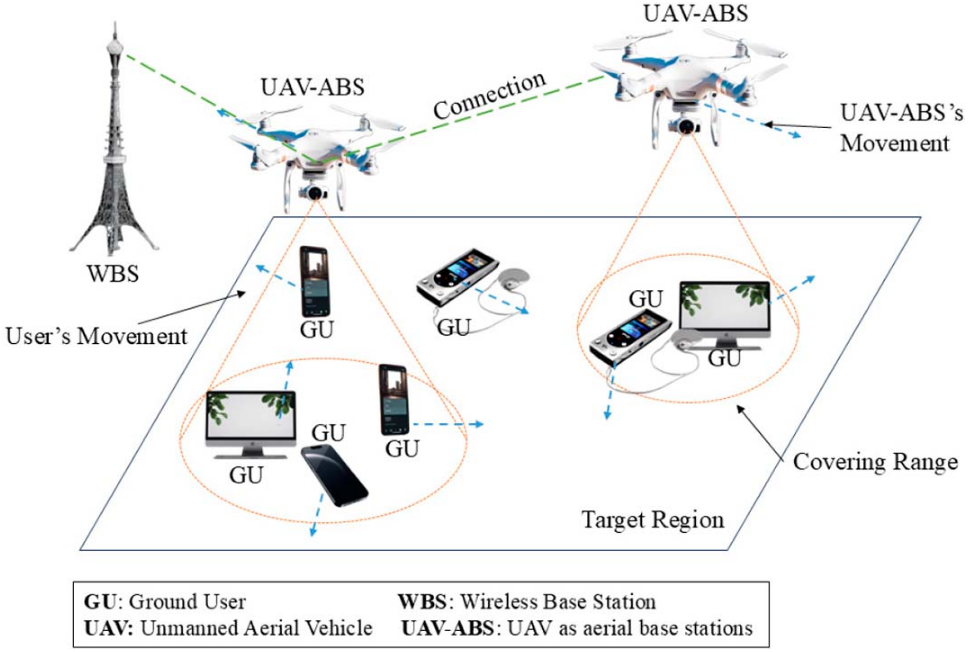
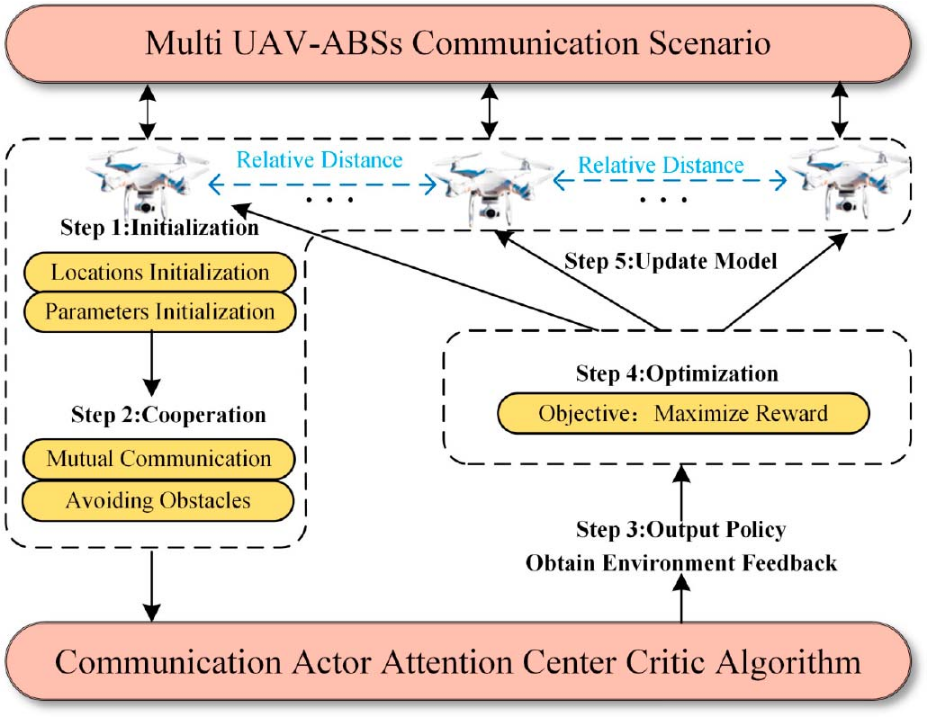
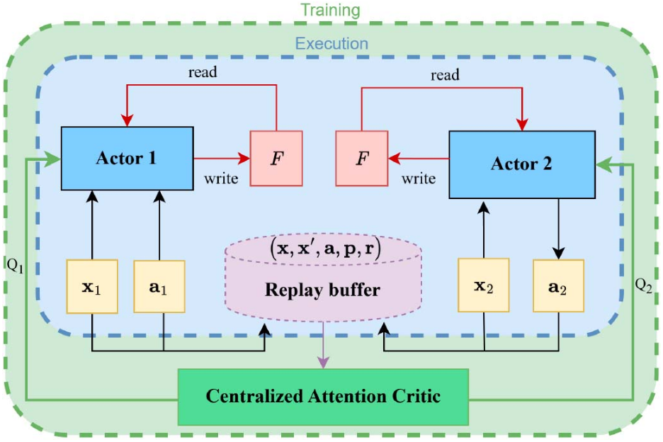
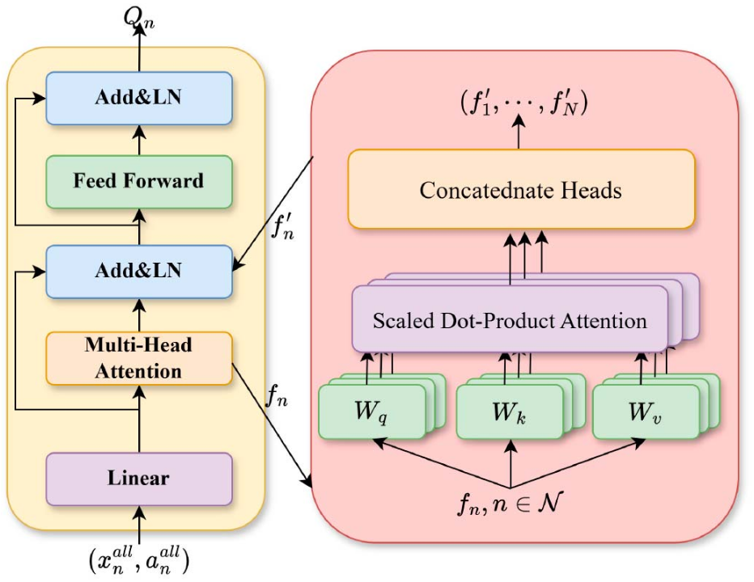
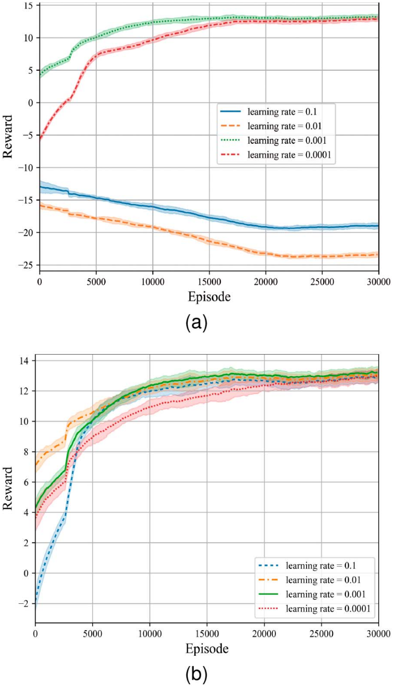
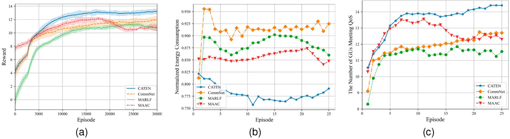
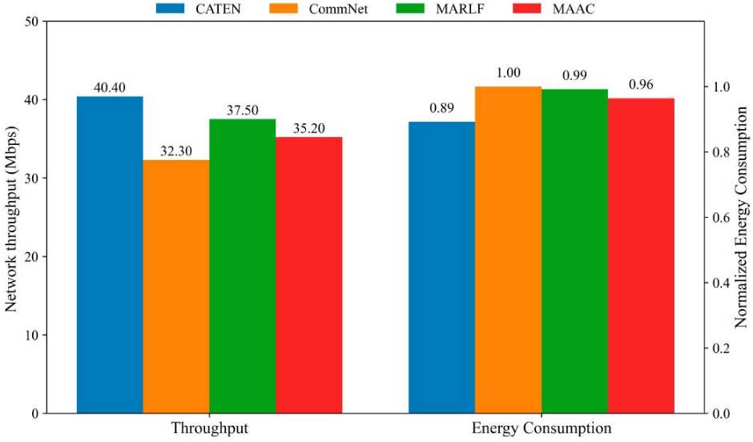
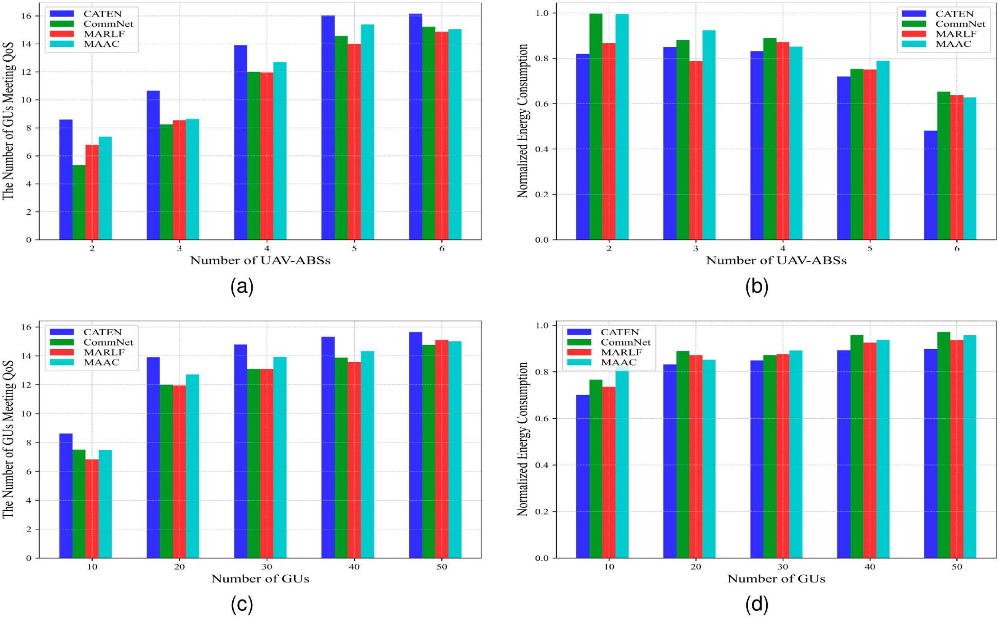
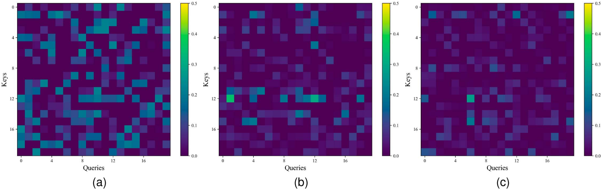
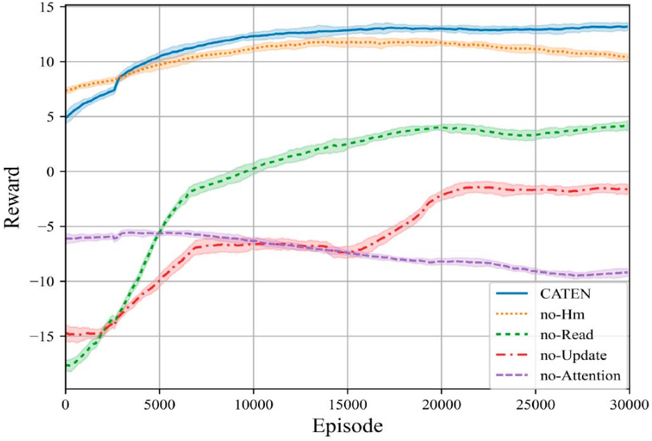

# Trajectory Optimization and Power Allocation for Multi-UAV Wireless Networks: A Communication-Based Multi-Agent Deep Reinforcement Learning Approach

Zimeng Yuan , Yuanguo Bi , Member, IEEE, Yanbo Fan , Graduate Student Member, IEEE, Yuheng Liu , Graduate Student Member, IEEE, Lianbo Ma , Liang Zhao , Member, IEEE, and Qiang He , Associate Member, IEEE

Abstract—Uncrewed Aerial Vehicles (UAVs) play a crucial role in next-generation mobile communication systems, serving as aerial base stations to provide services when ground base stations fail to meet coverage requirements. However, trajectory planning and power allocation for collaborative UAVs as Aerial Base Stations (UAV-ABSs) face several challenges, including energy limitations, flight time constraints, high optimization complexity due to dynamic environment interactions, and insufficient decision-making information. To address these challenges, this paper proposes a multi-agent reinforcement learning algorithm, namely Communication Actor Centralized Attention Critic Algorithm (CATEN), to jointly optimize the flight trajectory and power allocation strategies of UAV-ABSs. The proposed algorithm aims to maximize the number of users meeting Quality of Service (QoS) requirements while minimizing UAV-ABSs energy consumption. To achieve this, firstly, an information sharing mechanism is designed to improve the collaboration efficiency among UAV-ABSs. It leverages distributed storage, intelligent

Received 29 July 2024; revised 6 May 2025; accepted 26 June 2025. Date of publication 10 July 2025; date of current version 10 September 2025. This work was supported in part by the National Key Research and Development Program of China under Grant 2022YFE0114200, in part by the National Natural Science Foundation of China under Grant 62471121, in part by Fundamental Research Funds for the Central Universities of China under Grant N2424010-18, in part by the Shenyang Science and Technology Plan Fund Project under Grant 23-503-6-17, in part by the Liaoning Provincial Science and Technology Plan Project under Grant 2023JH2/101700370, and in part by the Fund of the National Key Laboratory of Metallurgical Intelligent Manufacturing System. Recommended for acceptance by J. Cao. (Corresponding author: Yuanguo Bi.)

Digital Object Identifier 10.1109/TC.2025.3587976

scheduling of UAV-ABSs interaction experiences, and gating units to enhance information screening and fusion. Secondly, a multihead attention critic network is proposed to capture correlations among UAV-ABSs from different subspaces. This allows the network to prioritize value information, reduce redundancy, and strengthen UAV-ABSs collaboration and decision-making capabilities. Simulation results demonstrate that CATEN achieves better performance in terms of the number of served users and energy consumption compared to existing algorithms, exhibiting good robustness and adaptability in dynamic environments.

Index Terms—Uncrewed Aerial Vehicle (UAV) networks, multi-UAV trajectory planning, deep reinforcement learning, power allocation.

<a id="image-index"></a>
## 图像索引

本索引由 `raw/scripts/establish_image_links.py` 根据注释导出的图片标注解析生成。图片目录总览见 [yuan2025TrajectoryOptimizationPower/README.md](../assets/yuan2025TrajectoryOptimizationPower/README.md#asset-index)。

| 图号/表号 | 论文定位 | 资源文件 | 说明 |
| --- | --- | --- | --- |
| [Fig. 1](#fig-1) | p. 3 | [G7DS9V98.png](../assets/yuan2025TrajectoryOptimizationPower/G7DS9V98.png) | UAV-ABSs provide communication services to GUs in a target region. |
| [Table I](#table-1) | p. 4 | [7NYKKM9D.png](../assets/yuan2025TrajectoryOptimizationPower/7NYKKM9D.png) | Important notations in this article |
| [Fig. 2](#fig-2) | p. 6 | [72ATDBUJ.png](../assets/yuan2025TrajectoryOptimizationPower/72ATDBUJ.png) | The training process of CATEN. |
| [Fig. 3](#fig-3) | p. 6 | [46B2WSN3.png](../assets/yuan2025TrajectoryOptimizationPower/46B2WSN3.png) | Diagram of CATEN algorithm framework. |
| [Fig. 4](#fig-4) | p. 8 | [HFEIGZ7N.png](../assets/yuan2025TrajectoryOptimizationPower/HFEIGZ7N.png) | The centralized critic network framework. |
| [Table II](#table-2) | p. 10 | [VEAHUE79.png](../assets/yuan2025TrajectoryOptimizationPower/VEAHUE79.png) | Parameter values |
| [Fig. 5](#fig-5) | p. 10 | [YZEUDSPH.png](../assets/yuan2025TrajectoryOptimizationPower/YZEUDSPH.png) | Impact of learning rates on CATEN performance: (a) actor network and (b) critic network. |
| [Fig. 6](#fig-6) | p. 11 | [I9ZACUC3.png](../assets/yuan2025TrajectoryOptimizationPower/I9ZACUC3.png) | Comparison of performance of different algorithms on (a) reward, (b) normalized energy consumption of a UAV-ABS and (c) the number of GUs satisfying QoS constraints. |
| [Fig. 7](#fig-7) | p. 11 | [ZVEARB3E.png](../assets/yuan2025TrajectoryOptimizationPower/ZVEARB3E.png) | Comprehensive evaluation of task execution performance. |
| [Fig. 8](#fig-8) | p. 12 | [BRXXZ6T9.png](../assets/yuan2025TrajectoryOptimizationPower/BRXXZ6T9.png) | Algorithm robustness analysis. The impact of the number of UAV-ABSs on (a) the number of GUs satisfying QoS constraints and (b) normalized energy consumption. The impact of the number of GUs on (c) the number of GUs satisfying QoS constraints and (d) normalized energy consumption. |
| [Fig. 9](#fig-9) | p. 12 | [QT7XMZVD.png](../assets/yuan2025TrajectoryOptimizationPower/QT7XMZVD.png) | Attention matrix with different model training episodes: (a) 0 episode, (b) 10000 episodes and (c) 30000 episodes. |
| [Fig. 10](#fig-10) | p. 13 | [I7D8EWFW.png](../assets/yuan2025TrajectoryOptimizationPower/I7D8EWFW.png) | Reward convergence of different algorithm parts. |


## I. INTRODUCTION

N recent years, Uncrewed Aerial Vehicles (UAVs) have become essential in various applications such as task offloading [1], data collection [2], and emergency communications [3], due to their high mobility, flexible deployment, and costeffectiveness. In particular, UAVs as Aerial Base Stations (UAV-ABSs) have attracted significant research interest due to their unique advantages over terrestrial fixed wireless base stations. Firstly, the three-dimensional mobility of UAV-ABSs offers an “overlooking perspective” [4] enhancing Line-of-Sight links (LoS) and greatly improving communication quality for Ground Users (GUs). Secondly, UAV-ABSs can be rapidly deployed in post-disaster or high-traffic areas to flexibly meet transient high-capacity communication demands [5]. Moreover, UAV-ABS networking avoids the need for complex infrastructure and extensive wiring, greatly reducing deployment time and costs [6]. Consequently, UAV-ABSs are becoming an indispensable and crucial component of the next-generation mobile communication network system [7], and their collaborative control has emerged as a topic of widespread interest in both academia and industry.

Despite the above advantages, collaborative control among UAV-ABSs still encounters challenges, particularly in the precise joint control of trajectory and power allocation [8]. To provide high-quality wireless services to GUs, UAV-ABSs

Qiang He is with the School of Medicine and Biological Information Engineering, Northeastern University, Shenyang 110169, China (e-mail: heqiang@bmie.neu.edu.cn).

must frequently adjust their positions to maintain better communication conditions. However, unnecessary movement of UAV-ABSs can significantly increase energy consumption [9], potentially compromising service quality for some GUs. Furthermore, precise power allocation is crucial to balance communication quality and energy consumption. The power allocation of UAV-ABS needs to comprehensively consider various factors, including GUs communication requirements, dynamic changes in the distance between UAVs and GUs, and potential interference between multiple UAV-ABSs. Therefore, a well-designed joint control strategy is imperative to assist UAV-ABSs optimize power allocation and flight paths, ensuring optimal outcomes in energy consumption, communication quality, and interference management.

Traditional mathematical optimization methods often convert non-convex collaborative control problems into convex ones, which compromises solution accuracy and makes it challenging to effectively handle GUs mobility [10]. In contrast, Deep Reinforcement Learning (DRL) provides a novel and effective paradigm to address these issues. By enabling agents to make optimal decisions through environmental interactions without transforming the original problem, DRL avoids the accuracy loss caused by problem conversion and better adapts to dynamic scenarios with mobile GUs. Existing DRL-based UAV control studies primarily focus on single-agent scenarios, overlooking the complex interactions among multiple UAV-ABSs [11], [12]. This research instead frames the problem as a Multi-Agent Reinforcement Learning (MARL) collaborative issue [13] to better capture how each UAV-ABS’s decisions affect the environmental state and, consequently, the feedbacks received by other agents.

However, in the MARL framework, information exchange among agents only occurs during the centralized training, while in the decentralized execution phase, agents act independently without real-time communications. This design limits the communications between agents to a certain extent [14], leading to the problem of information asymmetry. This may cause agents to make suboptimal decisions, affecting the overall system performance. In addition, as the number of GUs increases, the critic network may struggle to identify key factors from extensive state information. Irrelevant information increases computational complexity and may obscure critical decision-making clues, ultimately reducing the efficiency and quality of policy learning.

To address these challenges, this paper proposes a Communication Actor Centralized Attention Critic Algorithm (CATEN) that significantly enhances communication coverage by collaboratively optimizing the flight trajectory and power allocation of UAV-ABSs. Unlike traditional studies that focus on single objectives (e.g., trajectory planning) in static or low-dynamic environments, CATEN simultaneously minimizes energy consumption and maximizes the number of GUs fulfilling QoS requirements, adapting to highly dynamic scenarios. This dual-objective approach aligns with practical needs while significantly increasing problem complexity. Within CATEN, we design a communication learning mechanism that leverages distributed storage and intelligent scheduling of UAV-ABSs interaction experiences. Through a three-stage “encoderetrieve-update” process, it filters and integrates information, dynamically adjusting weights to balance long and short term observations, thus enhancing collaboration efficiency among UAV-ABSs. Furthermore, we introduce a multi-head attention critic network, where each “head” focuses on specific multidimensional collaboration features (e.g., trajectory or power allocation), using adaptive weights to suppress redundant interference and prioritize critical information. This improves the model’s information processing and the intelligent decision-making capabilities of UAV-ABSs. Notably, this work pioneers the integration of communication-based multi-agent reinforcement learning into the domain of UAV collaborative communication coverage control. The main contributions are summarized as follows:

We propose an energy efficiency optimization framework considering GU mobility to effectively improves energy utilization and service coverage in UAV-ABSs wireless communication scenarios.

• To facilitate adaptive decision-making for multi-UAV-ABSs in optimizing trajectory and power allocation, we design the CATEN algorithm within the context of the CTDE framework. Moreover, we develop an innovative information-sharing communication mechanism to enhance distributed collaborative decision-making capabilities of UAV-ABSs.

• To address the challenges of low information utilization and difficulty in establishing accurate collaboration relationships in multi-UAV-ABSs collaboration, we propose a centralized critic network framework based on a multihead attention mechanism. It filters irrelevant information to accurately understand and evaluate the effectiveness of collaboration between UAV-ABSs.

• Simulation results show CATEN outperforms other optimization approaches and demonstrates excellent robust adaptability to environmental changes.

The remainder of this paper is structured as follows: Section II reviews related work. Section III introduces the system model and problem description. Section IV proposes a multi-UAV reinforcement learning framework. Section V evaluates the performance of the algorithm through simulations and conducts a comparative analysis with state-of-the-art algorithms. Section VI provides the conclusions.

## II. RELATED WORK

UAV control technology is set to play an essential role in the development of next-generation communication networks, and has garnered significant attention from both academia and industry, with UAV-ABS being one of the most promising applications. Current researches in this field have been approached from two main perspectives: conventional mathematical optimization techniques [10], [15], [16], [17] and the novel DRL paradigm [1], [3], [12], [18], [19], [20], [21], [22].

Regarding conventional mathematical approaches, researchers typically formulate optimization problem as non-convex problems and then convert them into solvable convex forms. For instance, Zeng et al. in [15] consider factors including communication throughput and energy consumption, using state space approximation and convex optimization techniques to optimize UAV trajectories. However, this approach ignores ground terminal mobility and restricts UAV trajectories to simplistic circular paths. The study in [10] optimizes trajectories through Lagrangian duality and continuous convex programming optimization techniques to maximize the total energy received by the energy receiver. Studies in [16], [17] aim to enhance transmission efficiency through joint optimization of UAV trajectories and transmission power. While mathematical theory can transform non-convex problems into solvable convex forms, traditional mathematical methods may be inefficient in addressing multi-users mobile scenarios and multi-objective optimization.

In contrast, DRL methods, such as Q-learning [3], Deep Q-Networks (DQN) [1], and Deep Deterministic Policy Gradient (DDPG) [12], can learn optimal strategy autonomously without altering the underlying problem, showing better adaptability in complex scenarios. Liu et al. [18] present a DDPGbased approach for UAV-ABSs control to achieve communication coverage while optimizing energy consumption, fairness, and connectivity. However, these methods overlook the environmental repercussions of multiple UAV-ABSs behaviors, potentially destabilizing the environmental state and introducing non-Markovian characteristics that impact final decisions. Consequently, recent studies mostly utilize MARL to address these challenges.

MARL extends single-agent reinforcement learning by focusing on how multiple agents learn to collaborate or compete in shared environments. Centralized Training with Distributed Execution (CTDE) [23] is a popular framework in MARL that combines the advantages of centralized and distributed methods. In CTDE, agents train centrally but act independently during task execution. Unlike centralized learning (prone to single point failures and communication delays) and independent learning (facing non-stationary environments and information asymmetry), CTDE balances these approaches and is widely used in advanced MARL algorithms. A multi-agent Q-learning solution based on the CTDE framework, as proposed in [19], aims to jointly optimize trajectory design and power control for maximum throughput. In [20], a method based on a Multi-Agent Deep Q Network is proposed to optimize UAV mobility and coordination in Vehicular Ad-Hoc Networks. With this method, UAVs learn near-optimal control policies, thereby balancing coverage, energy efficiency, delay, and point-to-point communication performance. In [21], a Multi-agent Deep Deterministic Policy Gradient (MADDPG) method is presented to maximize long-term network utility while satisfying user equipment QoS requirements. Zhou et al. [22] introduce a Multi-Agent Value-Extended Deep Deterministic Policy Gradient algorithm (MAVE-DDPG) for trajectory design and power control, which minimizes total power consumption while maximizes the number of GUs meeting QoS requirements. However, there has been little consideration in research of communications for UAV-ABSs during task execution, with scarce studies exploring the use of communication-based multi-agent reinforcement learning algorithms to address the optimization control challenges of multiple UAV-ABSs.

<!-- image-->  


<a id="fig-1"></a>
Fig. 1. UAV-ABSs provide communication services to GUs in a target region.

Our article proposes a novel approach enabling UAV-ABSs to acquire and share communication experience through a communication mechanism to assist decision-making. Moreover, we employ the CTDE framework to address challenges like single point failure and environmental instability, ensuring control system reliability and optimizing overall UAV-ABS network performance.

## III. SYSTEM MODEL AND PROBLEM FORMULATION

We consider a wireless communication system where N UAVs are deployed as aerial base stations to provide reliable communication services to M GUs, as illustrated in Fig. 1. In this system, we denote the sets of UAV-ABSs and GUs as $\mathcal { N } = \{ 1 , \ldots , N \}$ and $\mathcal { M } = \{ 1 , \dots , M \}$ , respectively. It is assumed that the system operates over T consecutive time slots of equal length, where the set $\mathcal { T } = \{ 1 , \ldots , T \}$ represents a complete episode. To enhance readability, we summarize the key symbols and their descriptions in Table I.

## A. Mobility Model

Firstly, the GUs are uniformly distributed throughout the designated area, with their initial locations fixed. Multiple UAV-ABSs in the system operate at different initial altitudes and maintain a constant height during flight to avoid potential collision risks and optimize airspace utilization. To model their movement, the random walk model [24] has been adopted for the GUs. Specifically, a GU can perform one of the following five actions with equal probability: move forward, backward, left, right, or remain stationary. The 3D coordinate of GU m at time slot t is denoted as $\begin{array} { r } { \dot { \boldsymbol { \omega } } _ { m } ^ { \mathrm { U E } } ( t ) = [ { \boldsymbol { x } } _ { m } ( t ) , { \boldsymbol { y } } _ { m } ( t ) , 0 ] , t \in \qquad } \end{array}$ $\tau , m \in { \mathcal { M } }$

Similarly, the 3D coordinate of UAV-ABS n is given by $\omega _ { n } ^ { \mathrm { U A V } } ( \cdot ) = [ x _ { n } ( t ) , y _ { n } ( t ) , H _ { n } ] , t \in \mathcal { T } , n \in \mathcal { N }$ , where $H _ { n } \in$ [70, 100] represents the flying altitude of the UAV-ABS. Subsequently, the horizontal distance between UAV-ABS n and GU m at time slot t can be expressed as

<a id="table-1"></a>
TABLE I  
IMPORTANT NOTATIONS IN THIS ARTICLE
<table><tr><td>Symbol</td><td>Meaning</td></tr><tr><td> $\mathcal { N }$ </td><td>SetofUAV-ABSs</td></tr><tr><td> $\mathcal { M }$ </td><td>Set of GUs</td></tr><tr><td> $\tau$ </td><td>Time slots</td></tr><tr><td>t</td><td>Index of  $\tau$ </td></tr><tr><td> $\omega _ { m } ^ { \mathrm { U E } } ( t )$ </td><td>3D coordinates of GU</td></tr><tr><td> $\omega _ { n } ^ { \mathrm { U A V } } ( t )$ </td><td>3D coordinates ofUAV-ABS</td></tr><tr><td> $H _ { n }$ </td><td>Flight altitude of UAV-ABS</td></tr><tr><td> $d _ { n , m } ( t )$ </td><td>Horizontal distance</td></tr><tr><td> ${ \boldsymbol { v } } _ { n } ( t )$ </td><td>Velocity vector of UAV-ABS</td></tr><tr><td> $\zeta _ { n , t }$ </td><td>Time slot t of the trajectory of UAV-ABS</td></tr><tr><td>8</td><td>Time interval of each time slot</td></tr><tr><td> $D _ { \mathrm { m i n } }$ </td><td>Minimum distance between any two UAV-ABSs</td></tr><tr><td> $\rho _ { n , m } ^ { \mathrm { L o S } } ( t ) , \rho _ { n , m } ^ { \mathrm { N L o S } } ( t )$ </td><td>LoS and NLoS probability</td></tr><tr><td> $\theta _ { n , m } ( t )$ </td><td>Elevation angle between UAV-ABS and GU</td></tr><tr><td> $L _ { n , m } ( t )$ </td><td>Path loss between UAV-ABS and GU</td></tr><tr><td> $\eta _ { \mathrm { L o S } } , \eta _ { \mathrm { N L o S } }$ </td><td></td></tr><tr><td> $S _ { n , m } ( t )$ </td><td>Path loss parameters for LoS and NLoS</td></tr><tr><td> $R _ { m } ( t )$ </td><td>SINR ofUAV-ABS to GU</td></tr><tr><td> $E _ { n } ^ { \mathrm { F l y } } ( t )$ </td><td>Data transmission rate of GU</td></tr><tr><td> $E _ { \scriptscriptstyle \mathrm { - } \scriptscriptstyle \mathrm { - } } ^ { \mathrm { C o i n } }$ </td><td>Flight energy consumption of UAV-ABS</td></tr><tr><td> $E _ { n } ^ { ' \phantom { } } ( t )$ </td><td>Communication energy consumption Total energy consumption</td></tr></table>

$$
d _ { n , m } ( t ) = { \sqrt { \left[ x _ { n } ( t ) - x _ { m } ( t ) \right] ^ { 2 } + \left[ y _ { n } ( t ) - y _ { m } ( t ) \right] ^ { 2 } } } .\tag{1}
$$

At the start of the task, the initial positions of UAV-ABSs are randomly determined. For simplicity and to reduce model complexity, the impacts of acceleration and deceleration on the UAV-ABSs’ movements are neglected. It is assumed that UAV-ABSs can instantaneously adjust their speeds at the start of each time slot and maintain a constant velocity throughout the time slot duration. The normalized velocity of the UAV-ABS n at time slot t is expressed as ${ \pmb v } _ { n } ( t ) = [ { \pmb v } _ { x , n } ( t ) , { \pmb v } _ { y , n } ( t ) ]$ ， where $| | \pmb { v } _ { n } ( t ) | | \leq 1$ , and $- 1 \leq { \boldsymbol v } _ { x , n } ( t ) , { \boldsymbol v } _ { y , n } ( t ) \leq 1$ . Consequently, the position of the UAV-ABS n at time slot t + 1 can be expressed as

$$
\omega _ { n } ^ { \mathrm { U A V } } ( t + 1 ) = \omega _ { n } ^ { \mathrm { U A V } } ( t ) + ( \pmb { v } _ { n } ( t ) V _ { \operatorname* { m a x } } + \zeta _ { n , t } ) \delta ,\tag{2}
$$

where $V _ { \mathrm { m a x } }$ is the maximum speed of the UAV-ABS n, $\zeta _ { n , t }$ represents environmental and hardware random disturbances (wind, turbulence, control errors) modeled as zero-mean Gaussian noise. Introducing this random factor makes our model more representative of real flight environments and enhances the robustness of the reinforcement learning algorithm, encouraging it to learn strategies that adapt to small environmental changes. δ represents the duration of the time slot. Additionally, any two UAV-ABSs must satisfy the collision constraints during flight, which can be expressed as

$$
| | \omega _ { i } ^ { \mathrm { U A V } } ( t ) - \omega _ { j } ^ { \mathrm { U A V } } ( t ) | | ^ { 2 } \geq D _ { m i n } ^ { 2 } , \forall i , j \in \mathcal { N } , i \neq j ,\tag{3}
$$

where $D _ { m i n }$ represents the minimum distance between the two UAV-ABSs. As an aerial base station, each UAV-ABS has a circular communication coverage area with radius R projected onto the ground. This coverage model is the same as that used in [25] and [26]. If a GU is located within this coverage area, it is considered that the GU can receive communication services from the corresponding UAV-ABS. In any given time slot, each GU can receive communication services from at most one UAV-ABS.

## B. Communication Model

The communication model of UAV-ABSs considers both LoS and Non-Line of Sight (NLoS) scenarios, which is influenced by various factors, including terrain and environment. According to [27], the probability of having LoS between UAV-ABS n and GU m in time slot t can be expressed as

$$
\rho _ { n , m } ^ { \mathrm { L o S } } ( t ) = \frac { 1 } { ( 1 + a e ^ { ( - b [ \theta _ { m , n } ( t ) - a ] ) } ) } ,\tag{4}
$$

where a and b are environment-dependent constants, $\theta _ { m , n } ( t )$ represents the elevation angle between UAV-ABS n and GU m, which can be expressed as

$$
\theta _ { m , n } ( t ) = \frac { 1 8 0 } { \pi } \times \arcsin \left( \frac { H _ { n } } { \sqrt { d _ { n , m } ( t ) ^ { 2 } + H _ { n } ^ { 2 } } } \right) .\tag{5}
$$

Moreover, the probability of NLoS can be expressed as $\rho _ { n , m } ^ { \mathrm { N L o S } } ( t ) = 1 - \mathrm { \bar { \rho } } _ { n , m } ^ { \mathrm { L o S } } ( t )$ . The average channel gain is expressed as

$$
L _ { m , n } ( t ) = d _ { m , n } ^ { - \alpha } ( t ) [ \rho _ { n , m } ^ { \mathrm { L o S } } ( t ) \eta _ { \mathrm { L o S } } + \rho _ { n , m } ^ { \mathrm { N L o S } } ( t ) \eta _ { \mathrm { N L o S } } ] ,\tag{6}
$$

where α represents the path loss exponent, $\eta _ { \mathrm { L o S } }$ and ηNLoS denote the path losses of LoS and NLoS, respectively. As stated in [28], the Signal-to-Interference-plus-Noise Ratio (SINR) received by GU m from UAV-ABS n can be expressed as

$$
S _ { n , m } ( t ) = \frac { P _ { n } ( t ) L _ { m , n } ( t ) } { \big ( \sum _ { n ^ { \prime } \in \mathcal { N } \backslash n } P _ { n ^ { \prime } } ( t ) L _ { m , n ^ { \prime } } ( t ) + \varrho ^ { 2 } \big ) } ,\tag{7}
$$

where $\varrho ^ { 2 }$ denotes the Additive White Gaussian Noise (AWGN), and $P _ { n } ( t ) \in [ 0 , 1 ]$ represents the transmit power of UAV-ABS n in time slot t. When applying Frequency Division Multiple Access (FDMA), the data rate of GU m can be defined using the Shannon Capacity Theorem as

$$
R _ { m } ( t ) = \frac { W } { \vert \mathscr { U } _ { n } ( t ) \vert } \log _ { 2 } \left( 1 + S _ { n , m } ( t ) \right) ,\tag{8}
$$

where ${ { \mathcal { U } } _ { n } } ( t )$ represents the number of GUs served by UAV-ABS n in time slot t, and W represents the total bandwidth of the UAV-ABS, which is evenly distributed to the served GUs.

## C. Energy Model

The energy consumption of a UAV-ABS comprises two components1: communication energy consumption for data transmissions and mobile energy consumption during flight. For simplicity, we exclude the energy consumption of UAV-ABSs during takeoff, landing and hovering, as stated in [30]. Let $P _ { \mathrm { t i p } }$ denote the blade power and $v _ { \mathrm { t i p } }$ represent the blade speed. As stated in [31], the flight energy consumption of UAV-ABS n during time slot t can be expressed as

$$
E _ { n } ^ { \mathrm { F l y } } ( t ) = P _ { \mathrm { t i p } } \left( 1 + 3 | | \pmb { v } _ { n } ( t ) | | ^ { 2 } \frac { V _ { \mathrm { m a x } } ^ { 2 } } { \pmb { v } _ { \mathrm { t i p } } ^ { 2 } } \right) \delta .\tag{9}
$$

The blade speed of UAV-ABS is a critical design parameter, precisely controlled through blade length and rotational speed to ensure optimal lift and aerodynamic performance. During stable flight, blade speed remains constant, independent of variations in the UAV-ABS’s horizontal flight speed. The communication energy consumption of UAV-ABS n can be expressed as $E _ { n } ^ { \mathrm { C o m } } ( t ) = \ - P _ { n } ( t ) P _ { \mathrm { m a x } } \delta$ , where $P _ { \mathrm { m a x } }$ denotes the maximum transmission power of the UAV-ABS. In this study, we consider the energy consumption associated with data transmissions as the primary communication energy consumption. In summary, the total energy consumption of UAV-ABS n during time slot t is denoted by $E _ { n } ( t ) \bar { = } E _ { n } ^ { \mathrm { F l y } } ( t ) + E _ { n } ^ { \mathrm { C o m } } ( t )$ , which can be expressed as

$$
E _ { n } ( t ) = \left[ P _ { \mathrm { t i p } } \left( 1 + 3 | | \boldsymbol { v } _ { n } ( t ) | | ^ { 2 } \frac { V _ { \mathrm { m a x } } ^ { 2 } } { v _ { \mathrm { t i p } } ^ { 2 } } \right) + P _ { n } ( t ) P _ { \mathrm { m a x } } \right] \delta .\tag{10}
$$

## D. Problem Formulation

The objective is to simultaneously maximize the number of GUs meeting the QoS requirements, and minimize energy consumption by optimizing the speeds and transmit power of UAV-ABSs over T time slots. The objective can be formulated as

$$
\begin{array} { r l r } { \underset { v _ { n } ( t ) , P _ { n } ( t ) } { \operatorname* { m a x } } \mathbb { E } \left[ \displaystyle \sum _ { t = 1 } ^ { T } \left( \displaystyle \sum _ { m = 1 } ^ { M } \mathbf { r } ( R _ { m } ( t ) - \bar { R } _ { m } ) - \lambda \displaystyle \sum _ { n = 1 } ^ { N } \frac { E _ { n } ( t ) } { E _ { \operatorname* { m a x } } } \right) \right] } & \\ { \mathrm { s . t . } C _ { 1 } : \| \boldsymbol { \omega } _ { i } ^ { \mathrm { U A V } } ( t ) - \boldsymbol { \omega } _ { j } ^ { \mathrm { U A V } } ( t ) \| ^ { 2 } } & \\ { \quad \quad \quad \quad \geq D _ { m i n } ^ { 2 } , \forall i , j \in \mathcal { N } , i \neq j , } & \\ { C _ { 2 } : \| \boldsymbol { v } _ { n } ( t ) \| \leq 1 , t \in \mathcal { T } , n \in \mathcal { N } , } & \\ { C _ { 3 } : H _ { n } \in [ 7 0 , 1 0 0 ] , n \in \mathcal { N } , } & \\ { C _ { 4 } : P _ { n } ( t ) \leq 1 , n \in \mathcal { N } , } & { ( 1 1 ) } & \end{array}
$$

where $E _ { \mathrm { m a x } }$ represents the maximum energy consumption of the UAV-ABS, which is a normalized value for energy consumption. When $P _ { n } ( t ) = 1$ and $| | v _ { n } ( t ) | | = 1 , E _ { \operatorname* { m a x } }$ is calculated as $[ P _ { \mathrm { t i p } } ( 1 + 3 \dot { V } _ { \mathrm { m a x } } ^ { 2 } / v _ { \mathrm { t i p } } ^ { 2 } ) + \stackrel { \cdot \cdot } { P } _ { \mathrm { m a x } } ] \dot { \delta } . \Gamma ( x )$ is an indicator function that evaluates the QoS of GUs. If $R _ { m } ( t ) - \bar { R } _ { m } \geq 0$ ， the value of the function is 1, otherwise, it is $0 . \bar { R } _ { m }$ represents the minimum transmission rate that GUs must meet. Constraint (3) represents the collision avoidance constraint that must be satisfied during the UAV-ABSs’ flight. λ denotes the weighting factor used to adjust the relative importance of energy consumption and QoS in the objective function given in Eq. (11). The expectation function is employed to account for the uncertainty of the environment model, including factors such as the random mobility of GUs.

The optimization problem in Eq. (11) is non-convex with multiple constraints and numerous time-varying variables, making traditional mathematical methods inefficient for quick solutions. MARL, however, shows exceptional potential in addressing such complex optimization challenges. The MARL approach transforms the combinatorial optimization problem in Eq. (11) into a multi-agent collaborative optimization framework where agents learn optimal joint decision-making strategies through DRL algorithms. This distributed intelligent approach leverages parallel computing and collaborative decision-making, significantly improving efficiency in solving non-convex optimization problems. The proposed UAV-ABS control method builds on this MARL foundation, with detailed mechanisms explained in the following section.

## IV. CATEN: MARL-BASED DISTRIBUTED UAV-ABSS CONTROL APPROACH

In this section, we propose a MARL-based distributed UAV-ABSs control method to maximize the number of QoS-satisfied GUs while minimizing energy consumption. Firstly, we defined the Markov Game for the system model presented in the preceding section.

## A. Markov Game Formulation

To formulate the problem in the context of the MARL-based algorithm, we first introduce the concept of a Markov game [32]. In this game, multiple agents interact with the environment by taking actions, observing states, and receiving rewards, at each time step. In this game, the shared objective of all agents is to maximize the long-term cumulative reward by optimizing their action sequences. We define the key elements of the Markov game as follows:

Observation Space $o _ { n } ( t )$ : The observation of the n-th UAV-ABS includes its own position coordinates, as well as the positions of GUs and other UAV-ABSs within its communication range. Mathematically, the observation of the n-th UAV-ABS can be expressed as

$$
\begin{array} { r l } & { \begin{array} { r l } { { \pmb { o } } _ { n } ( t ) = [ \omega _ { 1 } ^ { \mathrm { U E } } ( t ) , \omega _ { 2 } ^ { \mathrm { U E } } ( t ) , . . . , \omega _ { M } ^ { \mathrm { U E } } ( t ) , } \\ { { \omega } _ { 1 } ^ { \mathrm { U A V } } ( t ) , \omega _ { 2 } ^ { \mathrm { U A V } } ( t ) , . . . , \omega _ { N } ^ { \mathrm { U A V } } ( t ) ] . } \end{array} } \end{array}\tag{12}
$$

Action Space ${ \bf } a _ { n } ( t )$ : According to the optimization objective given in Eq. (11), the trajectories and transmission power strategies of UAV-ABSs need to be jointly optimized. Under the assumption of constant UAV-ABS flight altitude, the position coordinates of the next time slot can be calculated based on the flight speed and time slot duration, as given in Eq. (2). Therefore, we can represent the action of the n-th UAV-ABS as

$$
{ \bf a } _ { n } ( t ) = [ { \pmb v } _ { x , n } ( t ) , { \pmb v } _ { y , n } ( t ) , P _ { n } ( t ) ] .\tag{13}
$$

Reward Fuction $\mathbf { } r _ { n } ( t )$ : In this UAV-ABSs communication coverage problem, all agents share a global reward, which aims to maximize the number of QoS-satisfied GUs and minimize the total energy consumption. Moreover, the anti-collision constraints in Eq. (3) must be met during deployment, and violations incur a fixed penalty $\xi _ { n } ^ { \mathrm { c o l } }$ . Taking these factors into account, we define a total system reward as a weighted sum of the number of users, energy consumption, and collision penalty, expressed as

<!-- image-->  


<a id="fig-2"></a>
Fig. 2. The training process of CATEN.

$$
r _ { n } ( t ) = \sum _ { n = 1 } ^ { N } \left[ \sum _ { m = 1 } ^ { M } \Gamma ( R _ { m } ( t ) - \bar { R } _ { m } ) - \lambda \frac { E _ { n } ( t ) } { E _ { \mathrm { m a x } } } + \xi _ { n } ^ { \mathrm { c o l } } \right] .\tag{14}
$$

## B. The Framework of the CATEN

In this paper, we propose a distributed UAV-ABS control method based on MARL, that is CATEN, to optimize the system objective function. Fig. 2 illustrates CATEN’s training process in a multi-UAV-ABS communication scenario. During the initialization phase, UAV-ABS positions, GU positions, and neural network parameters are initialized. During the cooperation phase, each UAV-ABS broadcasts its experience to other UAV-ABSs within its communication range through the builtin communication storage device F , while receiving broadcasts from others. UAV-ABSs decode these experiences, integrate them with their observations, and enrich their storage devices. During the decision-making process, each UAV-ABS combines the heterogeneous experiences from multiple UAV-ABSs with their local observations (e.g., relative positions of GUs and other UAV-ABSs) to select the optimal action. After decision-making, each UAV-ABS updates its storage device with new experiences and synchronizes with other UAV-ABSs through broadcasts. This exchange continues until all UAV-ABSs complete their decisions for the current time slot. During the feedback phase, the environment receives the actions of all UAV-ABSs and provides corresponding feedbacks on system energy consumption and the number of GUs meeting the QoS requirements. All actions, observations, rewards, and communication experiences are stored for future strategy optimization. During the optimization phase, each UAV-ABS uses the stored experiences to optimize its decision-making strategy through the MARL, maximizing the long-term cumulative rewards. In the update phase, the optimized model is deployed to all UAV-ABSs. After completing one iteration, the algorithm returns to the cooperation phase for a new round. The iterative process continues until all UAV-ABSs strategies converge to the optimal and stable state.

<!-- image-->  


<a id="fig-3"></a>
Fig. 3. Diagram of CATEN algorithm framework.

As illustrated in Fig. 3, the proposed collaborative control framework for multi-UAV-ABSs adopts the CTDE paradigm with two distinct operational phases: centralized training and distributed execution. During the centralized training phase, each UAV-ABS is equipped with an actor network and a communication buffer, while the centralized critic network is deployed in the training center. Storage device F stores the communication experiences from other UAV-ABSs after being filtered and fused through the communication mechanism, which is detailed in Section IV. Each actor network generates actions based on its local observations and the heterogeneous experiences retrieved from its buffer. After each actor network interacts with the environment, its trajectory samples (states, actions, rewards, etc.) are stored in the training center’s replay buffer, which aggregates the trajectories of all agents to optimize the networks through iterative training. In the decentralized deployment phase, autonomous decision-making occurs through distributed coordination where each actor dynamically incorporates both local real-time observations and heterogeneous experiences retrieved from its buffer.

To summarize, this framework adopts a hybrid paradigm, combining centralized training and distributed execution. The critic network and replay buffer deployed in the training center enable joint optimization of multiple actor networks, effectively improving sample efficiency. The distributed deployment and operation of actor networks and communication storage devices on each UAV-ABS facilitate the distributed collaborative control of the UAV-ABSs, which overcomes the limitations of a single agent in observation and decision-making, while enhancing real-time performance and robustness. In the following two subsections, we further illustrate how the actor network achieves collaborative learning within the group using storage devices and the specific structural design of the centralized critic network.

## C. Communication Mechanism

To enhance the distributed collaboration capability of UAV-ABSs, we propose an innovative communication mechanism.

This mechanism equips each UAV-ABS with a communication storage device F , which has a capacity $C ,$ used to store the communication experiences of other UAV-ABSs to facilitate collaborative decision-making. During the processes of information extraction and utilization in communication mechanisms, we draw inspiration from the design of gated recurrent units (GRUs) and introduce forget gate and update gate mechanisms to intelligently filter and fuse communication experiences. The system architecture integrating this communication mechanism under the CTDE framework is shown in Fig. 3. In this section, we focus on the encoding, reading, and updating operations of communication mechanism throughout the entire UAV-ABS training and execution processes.

Encoding Operation. Each UAV-ABS employs a fully connected neural network Γenc parametrised by $\theta _ { n } ^ { e }$ to map its local observation $\scriptstyle { \pmb { o } } _ { n }$ to a feature representation $\mathbf { c } _ { n }$ . This mapping can be expressed as

$$
\mathbf { c } _ { n } = \Gamma ^ { \mathrm { e n c } } ( { \pmb { o } } _ { n } ) .\tag{15}
$$

This process unifies the feature representation dimensions of different UAV-ABSs and extracts high-level features from the observation information, providing a richer and more effective basis for subsequent information fusion and decision-making.

Read Operation. After encoding the local observation $\scriptstyle { \pmb { o } } _ { n } .$ the UAV-ABS n reads the communication experience $\mathbf { p } _ { n }$ from the communication storage device F and uses the gating unit $\mathbf { k } _ { n }$ to combine it with the encoded information $\mathbf { c } _ { n }$ to obtain the final read information $\mathbf { A } _ { n }$ , which is expressed as

$$
\mathbf { A } _ { n } = \mathbf { p } _ { n } \odot \mathbf { k } _ { n } ,\tag{16}
$$

where $\odot$ denotes the Hadamard product. The gating unit $\mathbf { k } _ { n }$ determines the importance of each element in $\mathbf { p } _ { n } .$ , which is calculated based on $\mathbf { c } _ { n } , \mathbf { p } _ { n }$ and the context vector $\mathbf { h } _ { n }$ as

$$
\begin{array} { r l } & { { \mathbf k } _ { n } = \sigma ( { \mathbf W } _ { n } ^ { k } [ { \mathbf c } _ { n } , { \mathbf h } _ { n } , { \mathbf p } _ { n } ] ) , \quad { \mathbf k } _ { n } \in [ 0 , 1 ] , } \\ & { { \mathbf h } _ { n } = { \mathbf W } _ { n } ^ { h } { \mathbf c } _ { n } , } \end{array}\tag{17}
$$

where $\mathbf { W } _ { n } ^ { k }$ and $\mathbf { W } _ { n } ^ { h }$ are learnable weight matrixes. [·] denotes the concatenation operation, and σ is the sigmoid activation function. The context vector $\mathbf { h } _ { n }$ plays a crucial role in extracting the spatiotemporal information of $\mathbf { c } _ { n } ,$ which reflects the internal state of the UAV-ABS and is especially significant in complex environments. The learnable weights in the read operation empower the UAV-ABS to interpret empirical information based on its own observations and generate dynamically evolving fusion information $\mathbf { A } _ { n } .$ . To more clearly elucidate the intricate relationships among the variables involved, the read operation can be reformulated as

$$
\mathbf { A } _ { n } = \chi _ { n } ^ { r } ( \mathbf { o } _ { n } , \mathbf { p } _ { n } ) ,\tag{18}
$$

where $\theta _ { n } ^ { r } = \{ \mathbf { W } _ { n } ^ { h } , \mathbf { W } _ { n } ^ { k } \}$ encapsulates all the learnable parameters within the read operation, thereby enabling a more comprehensive understanding of the underlying computational processes.

Update Operation. In order to achieve efficient management and long-term retention of heterogeneous information, we propose an adaptive selective update mechanism that dynamically learns information update strategies to effectively integrate critical data into the memory state of the device F . The updated memory state is then synchronized in real-time across all UAV-ABSs within the network. This process is primarily coordinated by two essential gating units: the update gate ${ \bf G } _ { n }$ and the forget gate ${ \bf F } _ { n }$ . The update gate ${ \bf G } _ { n }$ , through learned parameters, adaptively determines the extent to which new information should be incorporated during the update process. Simultaneously, the forget gate ${ \bf F } _ { n }$ manages the selective retention and discard of the communication experience $\mathbf { p } _ { n }$ . By introducing these two gating units, the model gains the flexibility to dynamically balance the significance of both new and previously stored information, ultimately maintaining a concise yet informationally rich memory state. The elements within these two gating units are constrained to values between 0 and 1, as expressed in the following formula:

$$
\begin{array} { r } { \mathbf { G } _ { n } = \sigma ( \mathbf { W } _ { n } ^ { g } [ \mathbf { c } _ { n } , \mathbf { p } _ { n } ] ) , } \\ { \mathbf { F } _ { n } = \sigma ( \mathbf { W } _ { n } ^ { c } [ \mathbf { c } _ { n } , \mathbf { p } _ { n } ] ) , } \end{array}\tag{19}
$$

where $\mathbf { W } _ { n } ^ { c }$ and $\mathbf { W } _ { n } ^ { g }$ are all learnable parameters. Under the regulation of the gating units, we compute the candidate memory information $\tilde { U } _ { n } ^ { - }$ , which is an integration of data managed by the forget gate ${ \bf F } _ { n }$ , and formulated as

$$
\begin{array} { r } { \tilde { U } _ { n } = \operatorname { t a n h } ( { \mathbf W } _ { n } [ { \mathbf c } _ { n } , { \mathbf p } _ { n } \odot { \mathbf F } _ { n } ] ) . } \end{array}\tag{20}
$$

Ultimately, we employ the update gate ${ \bf G } _ { n }$ to balance the significance of the read information $\mathbf { A } _ { n }$ and the candidate memory information ${ \tilde { U } } _ { n } .$ , yielding the final updated information $U _ { n }$ which can be expressed as

$$
{ \cal U } _ { n } = { \bf G } _ { n } \odot { \bf A } _ { n } + ( 1 - { \bf G } _ { n } ) \odot \tilde { { \cal U } } _ { n } .\tag{21}
$$

This process guarantees that the updated information $U _ { n }$ effectively correlates and integrates all relevant data from the encoding, reading, and previous memory states, ensuring efficient information memorization. To streamline the representation, we collectively denote all learning parameters in the memory update operation as ${ \boldsymbol { \theta } } _ { n } ^ { w } = \{ \mathbf { W } _ { n } ^ { g } , \mathbf { W } _ { n } ^ { c } , \mathbf { W } _ { n } \}$ and reformulate the updated information $U _ { n }$ as

$$
\begin{array} { r } { U _ { n } = \chi _ { n } ^ { w } ( \mathbf { o } _ { n } , \mathbf { p } _ { n } ) . } \end{array}\tag{22}
$$

Model Update. After processing the encoding, interpreting, and updating information, the UAV-ABS takes appropriate actions based on the integrated data. This decision-making process can be formulated as

$$
\begin{array} { r } { { \bf { a } } _ { n } = \Gamma ^ { \mathrm { { a c t } } } ( { \bf c } _ { n } , { \bf A } _ { n } , U _ { n } ) , } \end{array}\tag{23}
$$

where $\Gamma ^ { \mathrm { a c t } }$ represents the actor network, which encompasses the three aforementioned operations of encoding, reading, and updating. During the training process, we employ the policy gradient descent algorithm to optimize the parameters of the actor network. To encourage the agent to explore and prevent convergence to suboptimal deterministic policies, we introduce a maximum entropy reinforcement learning method—namely, the soft Q-value function. This method incorporates an entropy regularization term into the policy gradient to balance exploration and exploitation. The update formula for the policy network is given by

$$
\begin{array} { r l r } & { } & { \nabla _ { \theta _ { n } } J ( \pi _ { \theta } ) = \mathbb { E } _ { \mathbf { x } \sim \mathcal { D } , \mathbf { a } \sim \pi } [ \nabla _ { \theta _ { n } } \pi _ { \theta _ { n } } ( \mathbf { a } _ { n } \vert \mathbf { x } _ { n } ) ( - \alpha \log ( \pi _ { \theta _ { n } } ( \mathbf { a } _ { n } \vert \mathbf { x } _ { n } ) )  } \\ & { } & {  + Q _ { \phi } ( \mathbf { x } , \mathbf { a } ) - b ( \mathbf { x } , \mathbf { a } \setminus n ) ) ] , \qquad ( 2 4 ) } \end{array}
$$

where $\theta _ { n } = \{ \theta _ { n } ^ { e } , \theta _ { n } ^ { r } , \theta _ { n } ^ { w } , \theta _ { n } ^ { a } \}$ denotes the parameters of all components involved in the decision-making process. $J ( \pi _ { \theta } )$ denotes the expected cumulative reward of the policy function $\pi _ { \boldsymbol { \theta } _ { n } } ( \mathbf { a } _ { n } | \mathbf { x } _ { n } )$ , and D represents the experience distribution in the replay buffer, which contains training experiences in the form of $( \mathbf { x } , \mathbf { x } ^ { \prime } , \mathbf { a } , \mathbf { p } , \mathbf { r } )$ , in which, x represents the state of the agent at the current time step, while $\mathbf { x } ^ { \prime }$ denotes the state at the subsequent time step. The action taken by the agent in state x is represented by a. p encapsulates the communication information exchanged between agents, facilitating multi-agent coordination. Finally, r signifies the immediate reward provided by the environment in response to the agent’s action. $Q _ { \phi } \left( \mathbf { x } , \mathbf { a } \right)$ is the critic network parameterized by $\phi ,$ which estimates the Qvalue of the current state-action pair. $b ( \mathbf { x } , \mathbf { a } _ { \backslash n } )$ is a multi-agent baseline function used to reduce variance and improve learning efficiency when calculating the advantage function, and α is the entropy regularization coefficient that controls the strength of exploration.

Furthermore, the communication mechanism processes communication experiences using a neural network encoder and gated units, effectively reducing information leakage risks. Specifically, the neural network encoder converts raw observations into high-dimensional abstract features through irreversible mathematical operations, such as nonlinear activation functions and feature space projections, thereby reducing data recoverability. Subsequently, the gated units dynamically filter features based on task relevance, for example, by removing outdated or redundant information, further minimizing the exposure of irrelevant data. This synergistic encoding and filtering approach protects communication data privacy while ensuring efficient collaborative task performance.

Finally, we analyze the computational overhead of executing the actor network in a single instance. We assume that $D$ represents the typical dimension of inputs/outputs such as observation $d _ { o } .$ , features $d _ { c } ,$ , communication experiences $d _ { p } ,$ , context vector $d _ { h }$ , and updated information $d _ { u }$ . The encoding stage contributes $O ( d _ { o } \cdot d _ { c } ) \approx O ( D ^ { 2 } )$ through matrix multiplication. The reading stage, involving gated unit computations and matrix operations, yields $O ( d _ { p } \cdot ( d _ { c } + d _ { h } + d _ { p } ) ) \approx O ( D ^ { 2 } )$ . The updating stage, driven by dual gating and candidate memory calculations, contributes $O ( 3 \cdot d _ { u } \cdot ( d _ { c } + d _ { p } ) ) \approx O ( D ^ { 2 } )$ . Overall, the computational overhead for each UAV-ABS is approximately $O ( D ^ { 2 } )$ . The analysis process calculates floating-point operations for matrix multiplications in each stage, aggregates dominant terms, and neglects lower-order operations.

<!-- image-->  


<a id="fig-4"></a>
Fig. 4. The centralized critic network framework.

## D. Multi-Head Attention Critic Network

The attention mechanism, which imitates the attention allocation in human information processing, allows the neural network to selectively focus on important information in the input data. This mechanism is widely used in the Transformer architecture [33]. The multi-head attention mechanism in Transformer can capture the correlation between input data from different subspaces, achieving context awareness and feature selection, and significantly enhancing the model’s ability to understand complex environments.

Inspired by the success of Transformer, we employ the multihead attention mechanism into the critic network framework to solve the problems of low information utilization efficiency and difficulty in establishing accurate collaboration relationships in multi-UAV-ABSs communication coverage scenarios. Through the attention mechanism, the critic network can dynamically adjust the weights of different UAV-ABS information in realtime according to collaborative needs. By enhancing the encoding weight of relevant information and effectively filtering out redundant information, it significantly reduces interference. This enables the critic network to more comprehensively and accurately understand and evaluate the collaborative effects between UAVs-ABS, thereby constructing a more efficient and precise representation of collaborative relationships.

Fig. 4 illustrates the framework of the critic network. The network primarily comprises an embedding layer, a multi-head attention layer, a feed-forward layer, and a layer normalization layer. The embedding layer, composed of fully connected

$$
\mathcal { L } _ { Q } ( \phi ) = \sum _ { n = 1 } ^ { N } \mathbb { E } _ { ( \mathbf { x } , \mathbf { a } , \mathbf { r } , \mathbf { p } , \mathbf { x } ^ { \prime } ) \sim \mathcal { D } } \left[ \left( Q _ { n } ^ { \phi } ( \mathbf { x } , \mathbf { a } ) - y _ { n } \right) ^ { 2 } \right] , \mathrm { w h e r c } \quad y _ { n } = \mathbf { r } _ { n } + \gamma \mathbb { E } _ { \mathbf { a } ^ { \prime } \sim \pi \mathbb { Z } _ { \theta } ( \mathbf { a } _ { n } | \mathbf { a } _ { n } ) } \left[ Q _ { n } ^ { \tilde { \phi } } ( \mathbf { x } ^ { \prime } , \mathbf { a } ^ { \prime } ) - \alpha \log \left( \pi _ { \tilde { \theta } } ( \mathbf { a } _ { n } | \mathbf { a } _ { n } ) \right) \right] .\tag{25}
$$

layers, encodes the joint state-action input. As depicted in the Fig. 4, the encoded data is processed by the multi-head attention layer. Initially, the encoding information is mapped to three trainable and shared weight matrices: query matrix Q, key matrix K, and value matrix V, which is expressed as

$$
\begin{array} { r l } & { \mathbf { Q } = ( q _ { 1 } , q _ { 2 } , . . . , q _ { N } ) , q _ { n } = W _ { q } c _ { n } , } \\ & { \mathbf { K } = ( k _ { 1 } , k _ { 2 } , . . . , k _ { N } ) , k _ { n } = W _ { k } c _ { n } , } \\ & { \mathbf { V } = ( v _ { 1 } , v _ { 2 } , . . . , v _ { N } ) , v _ { n } = W _ { v } c _ { n } , n \in N , } \end{array}\tag{26}
$$

where $c _ { n }$ denotes the data encoded by the embedding layer. Subsequently, the attention weights for a single attention head are computed using these three weight matrices, and the formula is expressed as

$$
{ \mathrm { A t t e n t i o n } } ( \mathbf { Q } , \mathbf { K } , \mathbf { V } ) = { \mathrm { s o f t m a x } } \left( { \frac { \mathbf { Q } \mathbf { K } ^ { T } } { \sqrt { d _ { k } } } } \right) \mathbf { V } ,\tag{27}
$$

where $\sqrt { d _ { k } }$ is a scaling factor used to scale the similarity. Finally, the outputs from all attention heads are aggregated through a weighted sum to obtain the final output of the multihead attention layer. The multi-head attention mechanism enables the critic network to extract key information from different subspaces, enhancing the network’s ability to comprehend complex environments.

To normalize the data, layer normalization layers are inserted between the multi-head attention layers, enabling the ReLU activation function in the feed-forward layer to perform nonlinear transformations on the normalized data. The activation function in the feed-forward layer enhances the network’s expressiveness and improves its ability to capture dependencies between the current experience and other experiences. The update formula of the critic network is expressed as Eq. (27). In Eq. (27), $Q _ { n } ^ { \phi } ( \mathbf { x } , \mathbf { a } )$ represents the Q-value predicted by the critic network, and $y _ { n }$ represents the target Q-value, and the objective is to minimize the loss ${ \mathcal { L } } _ { Q } ( \phi )$ between the predicted and target Q-value. The target Q-value computation incorporates the current reward ${ \bf r } _ { n }$ and the estimated Q-value of the next stateaction pair $( \mathbf { x } ^ { \prime } , \mathbf { a } ^ { \prime } )$ by the target critic network. Additionally, an entropy regularization term $\gamma$ is introduced to strike a balance between exploration and exploitation. The entropy regularization term encourages the agent to maintain exploration throughout the learning process, preventing premature convergence to suboptimal solutions and significantly reduce the risk of overfitting, thereby enhancing the generalization ability of the strategy [34]. The pseudocodes of CATEN are shown in Algorithm 1. We analyze the complexity of Algorithm 1 using the asymptotic computational time complexity, expressed as ${ \cal O } \big ( ( ( \dot { C _ { a } } + \dot { C _ { a } } ^ { \top } + | \theta | ) \dot { | } N | + ( C _ { c } ^ { \top } + | \phi | ) ) i \dot { t } e r \big ) . \ \dot { C } _ { a }$ and $C _ { a } ^ { \top }$ represent the computational load of the actor network during parameter updates and back propagation, respectively, $C _ { c } ^ { \top }$ represents the computational load of the critic network during parameter updates, and iter denotes the total number of training iterations.

Next, we explore the impact of system latency on decisionmaking efficiency. In the dynamic collaborative environment of UAV-ABS, we implemented effective strategies to address the challenges posed by system latency. By utilizing the CATEN algorithm, we innovatively introduced gating units and multihead attention mechanisms, successfully compressing the volume of communication data. This approach not only reduced signal propagation time but also decreased bandwidth requirements. Additionally, we optimized the neural network architecture and incorporated high-performance hardware to further minimize computational latency. Through these precise strategies, system latency was maintained at a nearly negligible level, ensuring real-time and efficient decision-making in the multi-agent system and providing robust technical support for collaborative operations in complex dynamic environments.

```powershell
Algorithm 1: Training Procedures of CATEN
1: Randomly initialize $\pi _ { \theta } , \pi _ { \bar { \theta } } , Q _ { \phi } , Q _ { \bar { \phi } }$ and replay buffer D
2:for episode = 1 to max-episode-number do
3: Reset the environment
4: Inizialise memory device $F$
5: for t= 1 to max-episode-length do
6: for agent = 1 to N do
Receive observation $\mathbf { o } _ { n }$ and the message $\mathbf { p } _ { n }  F$
8: Generate observation encoding $c _ { n }$ in (15)
9: Generate read information $A _ { n }$ in (18)
10: Generate Update information $U _ { n }$ in (22)
11: Store Update information in the memory device
$F  U _ { n }$
12: Select action ${ \bf a } _ { n } = \Gamma ^ { a c t } ( { \bf c } _ { n } , { \bf A } _ { n } , U _ { n } ) +$ noise
13: end for
14: Set $\mathbf { x } = ( \mathbf { o } _ { 1 } , . . . , \mathbf { o } _ { N } )$ and $\mathbf { p } = ( U _ { 1 } , . . . , U _ { N } )$
15: Execute actions $\mathbf { a } = ( \mathbf { a } _ { 1 } , . . , \mathbf { a } _ { N } )$ and observe reward
$\mathbf { r } = ( \mathbf { r } _ { 1 } , . . , \mathbf { r } _ { N } )$ and next state $\mathbf { x } ^ { \prime }$
16: Push $( \mathbf { x } , \mathbf { x } ^ { \prime } , \mathbf { a } , \mathbf { p } , \mathbf { r } )$ into replay buffer D and set X ←
$\mathbf { x } ^ { \prime }$
17: if length of D larger than given length then
18: for agent = 1 to N do
19: Sample a minibatch K of samples from D
20: Update $Q _ { \phi }$ by minimizing $\mathcal { L } _ { Q } ( \phi )$ in (26)
21: Update Tθ using the sampled police gradient
$\nabla _ { \boldsymbol { \theta } _ { n } } J ( \pi _ { \boldsymbol { \theta } _ { n } } )$ in (24)
22: end for
23: Update target networks: $\bar { \phi } = \tau \bar { \phi } + ( 1 - \tau ) \phi , \bar { \theta } =$
$\tau { \bar { \theta } } + ( 1 - \tau ) \theta$
24: end if
25: end for
26:end for
```

## V. SIMULATION

## A. Simulation Settings

In this section, the performance of the proposed CATEN is evaluated through extensive simulations, where four UAV-ABSs provide communication services to 20 randomly distributed GUs within a 1000 m × 1000 m area. Table II presents the detailed simulation parameters, with the UAV-ABS mobility model following [35] and the UAV-ABS channel model sourced from [36].

<a id="table-2"></a>
TABLE II  
PARAMETER VALUES
<table><tr><td>Parameter Flight altitude(H)</td><td>Value  $\overline { { [ 7 0 ~ \mathrm { m } , ~ 1 0 0 ~ \mathrm { m } ] } }$ </td></tr><tr><td>Maximum connection distance(  $D _ { \mathrm { t h } } )$  Environment related  $\mathrm { c o n s t a n t s } ( B , C )$  Average additional  $\mathrm { l o s s } ( \mu _ { \mathrm { L o S } } , \mu _ { \mathrm { N L o S } } )$  Noise power  $\cdot ( \varrho ^ { 2 } )$  Maximal transmit  $\mathrm { p o w e r } ( P _ { \mathrm { m a x } } )$  Blade power(  $( P _ { 0 } )$  Maximal  $\operatorname { s p e e d } ( V _ { \mathrm { m a x } } )$  Rotor tip  ${ \mathrm { s p e e d } } ( V _ { \mathrm { t i p } } )$  Minimal required data rate(  $( R _ { \mathrm { m i n } } )$ </td><td> $3 0 0 \mathrm { ~ m ~ }$   $0 . 3 5 , 2$   $- 3 \ \mathrm { d B } , \ - 2 3 \ \mathrm { d B }$   $- 1 0 0 ~ \mathrm { d B m }$   $5 0 0 ~ \mathrm { m W }$   $5 8 0 ~ \mathrm { W }$   $6 0 ~ \mathrm { m / s }$   $2 0 0 ~ \mathrm { m / x }$   $1 ~ \mathrm { M b p s }$ </td></tr></table>

The training process utilizes a total of 30,000 episodes, with each training epoch consisting of 25 time slots. The actor network’s output layer employs the Tanh activation function, while the hidden layer uses the Sigmoid activation function. A replay buffer with a size of 100,000 is used to store past experiences. The batch size for training is set to $B a t c h = 5 1 2$ , and the discount factor d is set to 0.99. Both the actor network and the critic network are trained using the AdamOptimizer [37]. The selection of these hyperparameters follows the best practices of classic multi-agent reinforcement learning frameworks such as MADDPG. Our network architecture design is one of the core innovations of this paper, with parameters carefully tuned to meet the specific requirements of UAV-ABS collaboration scenarios. The rationality of these design choices has been fully validated through subsequent comparative experiments and ablation studies.

## B. Result Analysis

In this section, we compare the performance of the proposed algorithm with three advanced MARL algorithms to evaluate its effectiveness in collaborative decision-making of UAV-ABSs. The three benchmark algorithms are: MARLF [38]: A multiagent reinforcement learning algorithm similar to MADDPG that, through the CTDE framework, provides long-term support to rescue members and delivers communication services. CommNet (Communication Networks) [37]: A centralized multi-agent collaborative decision-making algorithm that supports communication and knowledge sharing among agents. It enhances the collaborative capabilities of agents through information exchange and is suitable for cooperative tasks. MAAC (Multi-Actor-Attention-Critic) [39]: An advanced multi-agent reinforcement learning algorithm that introduces an attention mechanism to optimize the interaction between agents, providing strong flexibility and scalability.

We studied the effects of actor and critic network learning rates on model convergence and final rewards in a scenario with M = 20 GUs and $N = 4 { \mathrm { U A V - A B S s } } .$ . In Fig. 5, solid lines show the mean rewards while shaded regions illustrate reward confidence intervals, indicating the range of reward variations across different experimental runs. We applied smoothing techniques to better visualize trends. The reward function plots for the subsequent experiments follow the same format and methodology as previously described. The figure illustrates the impact of various learning rates for the actor network on the reward value, with the critic network learning rate fixed at 0.001. By maintaining a fixed learning rate for the critic network, we ensure a stable and reliable feedback for guiding the policy learning of the actor network, as further evidenced in Fig. 5(b). From Fig. 5(a), we can observe that smaller learning rates (0.0001 and 0.001) eventually converge to higher reward levels, while excessively large or small learning rates hindered convergence or produced lower rewards. Fig. 5(b) fixes the actor network learning rate at 0.001 to examine the impacts of different critic network learning rates on reward values. Appropriate critic network rates (0.01 and 0.001) accelerated convergence and produced higher final rewards. In subsequent experiments, we conduct more fine-grained experiments to adjust the learning rate. Finally, we set both actor and critic network learning rates to 0.001.

<!-- image-->  
(a)

<!-- image-->  
(b)  


<a id="fig-5"></a>
Fig. 5. Impact of learning rates on CATEN performance: (a) actor network and (b) critic network.

In the next step, we compare CATEN with related algorithms, namely CommNet, MARLF, and MAAC using multiple indicators in the same scenario. Fig. 6(a) shows reward value trends during training for all four algorithms. CATEN reaches a stable state after approximately 15,000 iterations. This is about 30% faster in convergence compared to MARLF and MAAC, on par with that of CommNet, but ultimately demonstrating significantly superior performance to all comparative models.

<!-- image-->  
(a)

<!-- image-->  
(b)

<!-- image-->  
（c）  


<a id="fig-6"></a>
Fig. 6. Comparison of performance of different algorithms on (a) reward, (b) normalized energy consumption of a UAV-ABS and (c) the number of GUs satisfying QoS constraints.

This improvement stem from multi-head attention mechanism, which helps UAV-ABSs selectively focus on important environmental information while disregard irrelevant information, accelerating the training process. Additionally, the communication mechanism allows UAV-ABSs to gather effective information beyond local observations, enabling better decisionmaking. During the initial 4000 cycles, CATEN’s rewards may not be the highest because we deliberately employ entropy regularization techniques to encourage exploration of unknown areas, sometimes resulting in boundary constraint violations and penalties. While this design may slightly delay convergence speed, it significantly enhances the robustness and quality of the final model performance — a trade-off particularly important in UAV-ABS collaboration scenarios.

Fig. 6(b) illustrates average energy consumption of UAV-ABSs under different algorithms during communication tasks, while Fig. 6(c) shows variations in the number of GUs meeting QoS requirements. It can be observed that CATEN consistently maintains higher service levels for GUs, especially in later stages, demonstrating superior communication service capability. Additionally, while maintaining high performance, CATEN exhibits the lowest energy consumption throughout execution, indicating more effective control and energy savings. To comprehensively evaluate the performance of CATEN, Fig. 7 presents a histogram comparing the average energy consumption and the newly introduced metric, network throughput, for each algorithm. The network throughput is calculated based on Eq. (8). Results demonstrate that compared to MARLF, CommNet, and MAAC, CATEN achieves approximately 7.73%, 25.08%, and 14.77% higher network throughput while reducing energy consumption by about 11%, 10.1%, and 7.29%, respectively.

To validate CATEN’s scalability, we examine how UAV-ABS and GU quantities affect algorithm performance. Fig. 8(a) and Fig. 8(b) show performance trends across four algorithms using two metrics. Generally, increasing UAV-ABSs significantly improves QoS-satisfied GU coverage while proportionally increasing energy consumption. This occurs because more UAV-ABSs working together can serve more GUs, though their extended flight paths consume more energy. CATEN demonstrates exemplary performance on both metrics, serving the most QoS-satisfied GUs with minimal energy use. Notably, with N = 2 and N = 3, CATEN exhibits marginally higher energy consumption compared to MARLF, yet delivers significantly greater network coverage (GU). This design is intended to balance energy consumption and coverage capacity while ensuring stable communications.

<!-- image-->  


<a id="fig-7"></a>
Fig. 7. Comprehensive evaluation of task execution performance.

Fig. 8(c) and Fig. 8(d) show that with 4 UAV-ABSs, as GU numbers increase, all algorithms consume more energy to meet additional QoS needs. However, CATEN manages this energy growth most effectively while maintaining high service levels and consuming the least energy, confirming its superiority. As GU numbers increase, CommNet and MARLF experience higher computational complexity, reducing their overall performance. MAAC underperforms compared to CATEN due to its weaker cooperation capabilities during task execution. Meanwhile, The experimental results also demonstrate that the CATEN algorithm does not exhibit overfitting, which is primarily attributed to the key techniques we introduced. By employing entropy regularization, we optimized the policy distribution of the actor network, balancing exploration and exploitation, enhancing the algorithm’s stability, and reducing overfitting to specific patterns. Meanwhile, by utilizing experience replay and random sampling, we disrupted the temporal correlations between samples, lowering the risk of overfitting to recent dynamic patterns, and enabling the critic network to capture more comprehensive collaborative relationships.

<!-- image-->  
(a)

<!-- image-->  
(b)

<!-- image-->  
（c）

<!-- image-->  
(d）



<a id="fig-8"></a>
Fig. 8. Algorithm robustness analysis. The impact of the number of UAV-ABSs on (a) the number of GUs satisfying QoS constraints and (b) normalized energy consumption. The impact of the number of GUs on (c) the number of GUs satisfying QoS constraints and (d) normalized energy consumption.  
<!-- image-->  
(a)

<!-- image-->  
(b）

<!-- image-->  
(c）  


<a id="fig-9"></a>
Fig. 9. Attention matrix with different model training episodes: (a) 0 episode, (b) 10000 episodes and (c) 30000 episodes.

## C. Performance Analysis of Key Algorithm Modules

Next, we examine the multi-head attention mechanism in CATEN by analyzing attention weight distributions at various stages during training. Fig. 9 depicts heat maps of attention weights at initial, middle (10,000 steps), and terminal (30,000 steps) training stages. These figures reveal that attention weight matrices become increasingly sparse during training, with some weights approaching zero. This implies the attention mechanism can learn autonomously and adaptively, selecting pivotal elements that are significant to the current decisionmaking process amidst copious input information while efficiently curbing the impact of irrelevant perturbing information. As training progresses, the attention distribution stabilizes, with high-weighted areas becoming more concentrated and lowweighted areas more dispersed. This indicates that, through perpetual exploration and learning, the model ultimately converges on a logical attention allocation strategy, enabling it to promptly seize the core information and bolster effective decision-making. These observations confirm the multi-head attention mechanism’s crucial role in CATEN. It provides powerful information filtering and abstraction capabilities, enabling the model to process complex environmental information and achieve superior performance. Additionally, the sparse weight matrix reduces computational burden and improves decisionmaking efficiency.

<!-- image-->  


<a id="fig-10"></a>
Fig. 10. Reward convergence of different algorithm parts.

Finally, we analyze the impact of core components on overall performance in CATEN through ablation experiments. Reward curves are processed using the same methodology as in Fig. 5 to ensure consistency across experiments. As shown in Fig. 10, “CATEN” represents the complete model, and “no-Hm” indicates the encoding module without historical contextual information. This version shows slow training convergence and lower final rewards, demonstrating that contextual information is integral for enhancing decision-making quality. The “no-Read” version (without the reading module) performs well initially but stagnates later in terms of improvement. The confusion in decision-making spawns due to a lack of experience with other UAV-ABSs. The “no-Update” version lacks the update module. The “no-Attention” version (with attention mechanism removed) performs the worst, with its reward value consistently remaining at a low level, far below the complete CATEN model. This demonstrates that the attention mechanism is an indispensable key component in the CATEN architecture, which is crucial for effectively filtering information and improving decisionmaking quality. These experiments confirm that all components are indispensable to CATEN’s robust decision-making capabilities. Removing any component substantially impairs model performance in complex environments, validating the effectiveness of our proposed architecture.

## VI. CONCLUSION AND FUTURE WORKS

In this paper, we have proposed CATEN, a novel MARL algorithm designed to jointly optimize UAV-ABS flight trajectories and power allocation. To improve communication coverage, we have proposed an information sharing mechanism that improves UAV-ABSs collaboration through efficient information fusion and communication experiences utilization.

Additionally, to help UAV-ABSs focus on valuable information and enhancing collaborative decision-making capabilities, we have designed a centralized multi-head attention critic network that captures inter-UAV-ABS relationships across different subspaces. Our extensive simulations show that CATEN significantly outperforms traditional methods in both QoS-satisfied GU numbers and energy efficiency, demonstrating its potential for UAV-ABS optimization. For future work, we intend to further extend the research on CATEN by considering more complex UAV-ABS mobility models and exploring the algorithm’s feasibility in other application scenarios.

In our future research, we aim to optimize the system in two key areas. First, we will systematically advance the deployment of CATEN, beginning with hardware-algorithm adaptation and controlled environment testing, and progressively validating its performance across various real-world scenarios. Furthermore, our research will focus on the comprehensive evaluation of the system’s performance and CATEN’s resistance to interference. Specifically, we will categorize interference sources systematically, precisely quantify their impacts, and develop a robust performance assurance framework to ensure that the UAV-ABS communication system maintains stable service quality even under extreme and challenging conditions.

## REFERENCES

[1] X. Dai, Z. Xiao, H. Jiang, and J. C. S. Lui, “UAV-assisted task offloading in vehicular edge computing networks,” IEEE Trans. Mobile Comput., vol. 23, no. 4, pp. 2520–2534, Apr. 2024.

[2] X. Wang, M. Yi, J. Liu, Y. Zhang, M. Wang, and B. Bai, “Cooperative data collection with multiple UAVs for information freshness in the Internet of Things,” IEEE Trans. Commun., vol. 71, no. 5, pp. 2740– 2755, May 2023.

[3] C. Wang, D. Deng, L. Xu, and W. Wang, “Resource scheduling based on deep reinforcement learning in UAV assisted emergency communication networks,” IEEE Trans. Commun., vol. 70, no. 6, pp. 3834–3848, Jun. 2022.

[4] W. Wang, G. Srivastava, J. C. Lin, Y. Yang, M. Alazab, and T. R. Gadekallu, “Data freshness optimization under CAA in the UAV-aided MECN: A potential game perspective,” IEEE Trans. Intell. Transp. Syst., vol. 24, no. 11, pp. 12912–12921, Nov. 2023.

[5] S. Zhang, H. Zhang, and L. Song, “Beyond D2D: Full dimension UAVto-everything communications in 6G,” IEEE Trans. Veh. Technol., vol. 69, no. 6, pp. 6592–6602, Jun. 2020.

[6] L. Wang, K. Wang, C. Pan, W. Xu, N. Aslam, and A. Nallanathan, “Deep reinforcement learning based dynamic trajectory control for UAVassisted mobile edge computing,” IEEE Trans. Mobile Comput., vol. 21, no. 10, pp. 3536–3550, Oct. 2021.

[7] Z. M. Fadlullah and N. Kato, “HCP: Heterogeneous computing platform for federated learning based collaborative content caching towards 6G networks,” IEEE Trans. Emerg. Topics Comput., vol. 10, no. 1, pp. 112– 123, Jan./Mar. 2020.

[8] R. Ding, Y. Xu, F. Gao, and X. Shen, “Trajectory design and access control for air–ground coordinated communications system with multiagent deep reinforcement learning,” IEEE Internet Things J., vol. 9, no. 8, pp. 5785–5798, Apr. 2022.

[9] F. Song et al., “Evolutionary multi-objective reinforcement learning based trajectory control and task offloading in UAV-assisted mobile edge computing,” IEEE Trans. Mobile Comput., vol. 22, no. 12, pp. 7387– 7405, Dec. 2023.

[10] J. Xu, Y. Zeng, and R. Zhang, “UAV-enabled wireless power transfer: Trajectory design and energy optimization,” IEEE Trans. Wireless Commun., vol. 17, no. 8, pp. 5092–5106, Aug. 2018.

[11] Q. Luo, T. H. Luan, W. Shi, and P. Fan, “Deep reinforcement learning based computation offloading and trajectory planning for multi-UAV cooperative target search,” IEEE J. Sel. Areas Commun., vol. 41, no. 2, pp. 504–520, Feb. 2023.

[12] Y. Luo, Y. Wang, Y. Lei, C. Wang, D. Zhang, and W. Ding, “Decentralized user allocation and dynamic service for multi-UAV-enabled MEC system,” IEEE Trans. Veh. Technol., vol. 73, no. 1, pp. 1306–1321, Jan. 2024.

[13] L. Busoniu, R. Babuska, and B. D. Schutter, “A comprehensive survey of multiagent reinforcement learning,” IEEE Trans. Syst., Man, Cybern. C, Appl. Rev., vol. 38, no. 2, pp. 156–172, Mar. 2008.

[14] P. Hernandez-Leal, B. Kartal, and M. E. Taylor, “A survey and critique of multiagent deep reinforcement learning,” Auton. Agents Multi-Agent Syst., vol. 33, no. 6, pp. 750–797, 2019.

[15] Y. Zeng and R. Zhang, “Energy-efficient UAV communication with trajectory optimization,” IEEE Trans. Wireless Commun., vol. 16, no. 6, pp. 3747–3760, Jun. 2017.

[16] G. Zhang, Q. Wu, M. Cui, and R. Zhang, “Securing UAV communications via joint trajectory and power control,” IEEE Trans. Wireless Commun., vol. 18, no. 2, pp. 1376–1389, Feb. 2019.

[17] K. Xu, M.-M. Zhao, Y. Cai, and L. Hanzo, “Low-complexity joint power allocation and trajectory design for UAV-enabled secure communications with power splitting,” IEEE Trans. Commun., vol. 69, no. 3, pp. 1896– 1911, Mar. 2021.

[18] C. H. Liu, Z. Chen, J. Tang, J. Xu, and C. Piao, “Energy-efficient UAV control for effective and fair communication coverage: A deep reinforcement learning approach,” IEEE J. Sel. Areas Commun., vol. 36, no. 9, pp. 2059–2070, Sep. 2018.

[19] X. Liu, Y. Liu, Y. Chen, and L. Hanzo, “Trajectory design and power control for multi-UAV assisted wireless networks: A machine learning approach,” IEEE Trans. Veh. Technol., vol. 68, no. 8, pp. 7957–7969, Aug. 2019.

[20] A. I. Ameur, O. S. Oubbati, A. Lakas, A. Rachedi, and M. B. Yagoubi, “Efficient vehicular data sharing using aerial p2p backbone,” IEEE Trans. Intell. Veh., early access, Jun. 2024, doi: 10.1109/TIV.2024.3414140.

[21] Q. Hou, Y. Cai, Q. Hu, M. Lee, and G. Yu, “Joint resource allocation and trajectory design for multi-UAV systems with moving users: Pointer network and unfolding,” IEEE Trans. Wireless Commun., vol. 22, no. 5, pp. 3310–3323, May 2023.

[22] S. Zhou, Y. Cheng, and X. Lei, “Multi-agent model-based reinforcement learning for trajectory design and power control in UAV-enabled networks,” in Proc. 3rd Inf. Commun. Technol. Conf., 2022, pp. 33–38.

[23] J. Zhang, Y. Zhang, X. S. Zhang, Y. Zang, and J. Cheng, “Intrinsic action tendency consistency for cooperative multi-agent reinforcement learning,” in Proc. AAAI Conf. Artif. Intell., vol. 38, no. 16, 2024, pp. 17600–17608.

[24] K.-H. Chiang and N. Shenoy, “A 2-D random-walk mobility model for location-management studies in wireless networks,” IEEE Trans. Veh. Technol., vol. 53, no. 2, pp. 413–424, Mar. 2004.

[25] J. Li, C. Yi, J. Chen, K. Zhu, and J. Cai, “Joint trajectory planning, application placement, and energy renewal for UAV-assisted MEC: A triple-learner-based approach,” IEEE Internet Things J., vol. 10, no. 15, pp. 13622–13636, Aug. 2023.

[26] X. Zhang, H. Zhao, J. Wei, C. Yan, J. Xiong, and X. Liu, “Cooperative trajectory design of multiple UAV base stations with heterogeneous graph neural networks,” IEEE Trans. Wireless Commun., vol. 22, no. 3, pp. 1495–1509, Mar. 2023.

[27] S. M. Abohashish, R. Y. Rizk, and E. Elsedimy, “Trajectory optimization for UAV-assisted relay over 5G networks based on reinforcement learning framework,” EURASIP J. Wireless Commun. Netw., vol. 2023, no. 1, p. 55, 2023.

[28] C. Zhao, J. Liu, M. Sheng, W. Teng, Y. Zheng, and J. Li, “Multi-UAV trajectory planning for energy-efficient content coverage: A decentralized learning-based approach,” IEEE J. Sel. Areas Commun., vol. 39, no. 10, pp. 3193–3207, Oct. 2021.

[29] K. Messaoudi, A. Baz, O. Sami Oubbati, A. Rachedi, T. Bendouma, and M. Atiquzzaman, “UGV charging stations for UAV-assisted AoI-aware data collection,” IEEE Trans. Cogn. Commun. Netw., vol. 10, no. 6, pp. 2325–2343, Dec. 2024.

[30] T. Ao, K. Zhang, H. Shi, Z. Jin, Y. Zhou, and F. Liu, “Energy-efficient multi-UAVs cooperative trajectory optimization for communication coverage: An MADRL approach,” Remote Sens., vol. 15, no. 2, p. 429, 2023.

[31] B. Chen, D. Liu, and L. Hanzo, “Decentralized trajectory and power control based on multi-agent deep reinforcement learning in UAV networks,” in Proc. IEEE Int. Conf. Commun., Piscataway, NJ, USA: IEEE, 2022, pp. 3983–3988.

[32] F. A. Oliehoek and C. Amato, A Concise Introduction to Decentralized POMDPs, Cham Switzerland: Springer, vol. 1. 2016.

[33] A. Vaswani et al., “Attention is all you need,” in Proc. Adv. Neural Inf. Process. Syst., vol. 30, no. 11, 2017, pp. 6000–6010.

[34] J. Wu, H. Fan, X. Zhang, S. Lin, and Z. Li, “Semi-supervised semantic segmentation via entropy minimization,” in Proc. IEEE Int. Conf. Multimedia Expo (ICME), 2021, pp. 1–6.

[35] Y. Zeng, J. Xu, and R. Zhang, “Energy minimization for wireless communication with rotary-wing UAV,” IEEE Trans. Wireless Commun., vol. 18, no. 4, pp. 2329–2345, Apr. 2019.

[36] N. Zhao, Z. Ye, Y. Pei, Y.-C. Liang, and D. Niyato, “Multi-agent deep reinforcement learning for task offloading in UAV-assisted mobile edge computing,” IEEE Trans. Wireless Commun., vol. 21, no. 9, pp. 6949– 6960, Sep. 2022.

[37] C. Park, G. S. Kim, S. Park, S. Jung, and J. Kim, “Multi-agent reinforcement learning for cooperative air transportation services in citywide autonomous urban air mobility,” IEEE Trans. Intell. Veh., vol. 8, no. 8, pp. 4016–4030, Aug. 2023.

[38] O. S. Oubbati, H. Badis, A. Rachedi, A. Lakas, and P. Lorenz, “Multi-UAV assisted network coverage optimization for rescue operations using reinforcement learning,” in Proc. IEEE 20th Consum. Commun. Netw. Conf. (CCNC), 2023, pp. 1003–1008.

[39] Z. Ye, K. Wang, Y. Chen, X. Jiang, and G. Song, “Multi-UAV navigation for partially observable communication coverage by graph reinforcement learning,” IEEE Trans. Mobile Comput., vol. 22, no. 7, pp. 4056–4069, Jul. 2023.

<!-- image-->  
Zimeng Yuan received the B.S. degree in computer science in 2021 and the M.S. degree in artificial intelligence from the Northeastern University, Shenyang, China. His research interests include multi-agent reinforcement learning and multiuncrewed aerial vehicle control.

<!-- image-->

Yuanguo Bi (Member, IEEE) is currently a Professor with the School of Computer Science and Engineering, Northeastern University, China. He has authored/coauthored more than 80 journal/ conference papers, including high quality journal papers. His research interests include medium access control and mobility management in vehicular networks, task offloading in mobile edge computing, etc. He has served as an Editor/Guest Editor of IEEE Communications Magazine, IEEE Wireless Communications, and IEEE Network.

<!-- image-->

Yanbo Fan (Graduate Student Member, IEEE) received the M.S. degree in computer science from Shenyang Aerospace University, China, in 2023. He is currently working toward the Ph.D. degree in computer science and technology with the Northeastern University, NEU, China. His research interests include convex and nonconvex optimization, wireless power transfer, and air-space-ground integrated communications. He is a reviewer for IEEE Network Magazine.

<!-- image-->

Yuheng Liu (Graduate Student Member, IEEE) received the M.S. degree in computer science from Shenyang Aerospace University, China, in 2021. He is currently working toward the Ph.D. degree in computer science and technology with the Northeastern University, NEU, China. His research interests include multiagent reinforcement learning, federated learning, and space-air-ground integrated networks. He is a reviewer for IEEE Network Magazine.

<!-- image-->

Lianbo Ma received the B.Sc. and M.Sc. degrees in communication and information system from the Northeastern University, Shenyang, China, in 2004 and 2007, respectively, and the Ph.D. degree from the University of Chinese Academy of Sciences, China, in 2015. He is currently a Professor with the Northeastern University. He has published more than 100 journal articles, books, and refereed conference papers. His research interests include edge intelligence and machine learning.

<!-- image-->

Liang Zhao (Member, IEEE) received the Ph.D. degree from the School of Computing, Edinburgh Napier University, in 2011. He is a Professor with Shenyang Aerospace University, China. He is a JSPS invitational Fellow (2023) and a Visiting Professor with the University of Electro-Communications, Japan. He has published more than 150 articles. His research interests include Intelligent Transportation Systems, Vehicular Ad-hoc Network, Wireless Mesh Network, and Software-Defined Networking. He served as the Chair of

several international conferences and workshops, including 2022 IEEE Big-DataSE (Steering Co-Chair) and 2021 IEEE TrustCom (Program Co-Chair). He is an Associate Editor of Frontiers in Communications and Networking and Journal of Circuits, Systems, and Computers. He is/has been a Guest Editor of IEEE TRANSACTIONS ON NETWORK SCIENCE AND ENGINEERING, Springer Journal of Computing, etc.

<!-- image-->

Qiang He (Associate Member, IEEE) is currently an Associate Professor with the College of Medicine and Biological Information Engineering, Northeastern University, Shenyang, China. His research interests include machine learning, social network analysis, data mining, health care, infectious diseases informatics, etc. He has published more than 70 journal articles and conference papers, including IEEE TRANSACTIONS ON KNOWLEDGE AND DATA ENGINEERING, IEEE TRANSACTIONS ON NEURAL NETWORKS AND LEARNING SYSTEMS,

IEEE TRANSACTIONS ON CYBERNETICS, IEEE TRANSACTIONS ON CLOUD COMPUTING, IEEE TRANSACTIONS ON COMPUTATIONAL SOCIAL SYSTEMS, and IEEE TRANSACTIONS ON COGNITIVE AND DEVELOPMENTAL SYSTEMS.

---


## 📷 Images

The following images were extracted from this PDF:

1. [[../extracted_images/Trajectory_Optimization_and_Power_Allocation_for_Multi-UAV_Wireless_Networks_A_Communication-Based_Multi-Agent_Deep_Reinforcement_Learning_Approach/page_3_img_1.jpeg|page_3_img_1]]
2. [[../extracted_images/Trajectory_Optimization_and_Power_Allocation_for_Multi-UAV_Wireless_Networks_A_Communication-Based_Multi-Agent_Deep_Reinforcement_Learning_Approach/page_6_img_1.jpeg|page_6_img_1]]
3. [[../extracted_images/Trajectory_Optimization_and_Power_Allocation_for_Multi-UAV_Wireless_Networks_A_Communication-Based_Multi-Agent_Deep_Reinforcement_Learning_Approach/page_6_img_2.jpeg|page_6_img_2]]
4. [[../extracted_images/Trajectory_Optimization_and_Power_Allocation_for_Multi-UAV_Wireless_Networks_A_Communication-Based_Multi-Agent_Deep_Reinforcement_Learning_Approach/page_8_img_1.jpeg|page_8_img_1]]
5. [[../extracted_images/Trajectory_Optimization_and_Power_Allocation_for_Multi-UAV_Wireless_Networks_A_Communication-Based_Multi-Agent_Deep_Reinforcement_Learning_Approach/page_10_img_1.jpeg|page_10_img_1]]
6. [[../extracted_images/Trajectory_Optimization_and_Power_Allocation_for_Multi-UAV_Wireless_Networks_A_Communication-Based_Multi-Agent_Deep_Reinforcement_Learning_Approach/page_11_img_1.jpeg|page_11_img_1]]
7. [[../extracted_images/Trajectory_Optimization_and_Power_Allocation_for_Multi-UAV_Wireless_Networks_A_Communication-Based_Multi-Agent_Deep_Reinforcement_Learning_Approach/page_11_img_2.jpeg|page_11_img_2]]
8. [[../extracted_images/Trajectory_Optimization_and_Power_Allocation_for_Multi-UAV_Wireless_Networks_A_Communication-Based_Multi-Agent_Deep_Reinforcement_Learning_Approach/page_12_img_1.jpeg|page_12_img_1]]
9. [[../extracted_images/Trajectory_Optimization_and_Power_Allocation_for_Multi-UAV_Wireless_Networks_A_Communication-Based_Multi-Agent_Deep_Reinforcement_Learning_Approach/page_12_img_2.jpeg|page_12_img_2]]
10. [[../extracted_images/Trajectory_Optimization_and_Power_Allocation_for_Multi-UAV_Wireless_Networks_A_Communication-Based_Multi-Agent_Deep_Reinforcement_Learning_Approach/page_13_img_1.jpeg|page_13_img_1]]
11. [[../extracted_images/Trajectory_Optimization_and_Power_Allocation_for_Multi-UAV_Wireless_Networks_A_Communication-Based_Multi-Agent_Deep_Reinforcement_Learning_Approach/page_14_img_1.jpeg|page_14_img_1]]
12. [[../extracted_images/Trajectory_Optimization_and_Power_Allocation_for_Multi-UAV_Wireless_Networks_A_Communication-Based_Multi-Agent_Deep_Reinforcement_Learning_Approach/page_14_img_2.jpeg|page_14_img_2]]
13. [[../extracted_images/Trajectory_Optimization_and_Power_Allocation_for_Multi-UAV_Wireless_Networks_A_Communication-Based_Multi-Agent_Deep_Reinforcement_Learning_Approach/page_14_img_3.jpeg|page_14_img_3]]
14. [[../extracted_images/Trajectory_Optimization_and_Power_Allocation_for_Multi-UAV_Wireless_Networks_A_Communication-Based_Multi-Agent_Deep_Reinforcement_Learning_Approach/page_14_img_4.jpeg|page_14_img_4]]
15. [[../extracted_images/Trajectory_Optimization_and_Power_Allocation_for_Multi-UAV_Wireless_Networks_A_Communication-Based_Multi-Agent_Deep_Reinforcement_Learning_Approach/page_15_img_1.jpeg|page_15_img_1]]
16. [[../extracted_images/Trajectory_Optimization_and_Power_Allocation_for_Multi-UAV_Wireless_Networks_A_Communication-Based_Multi-Agent_Deep_Reinforcement_Learning_Approach/page_15_img_2.jpeg|page_15_img_2]]
17. [[../extracted_images/Trajectory_Optimization_and_Power_Allocation_for_Multi-UAV_Wireless_Networks_A_Communication-Based_Multi-Agent_Deep_Reinforcement_Learning_Approach/page_15_img_3.jpeg|page_15_img_3]]

---

