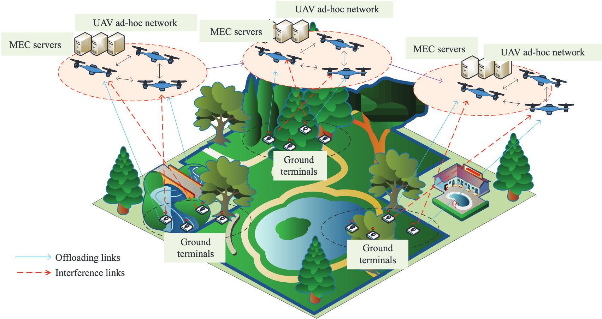
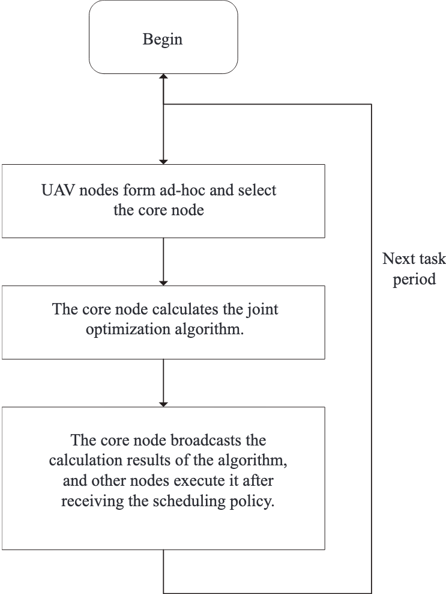
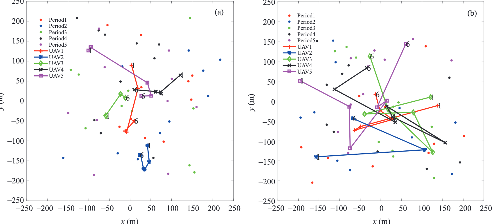
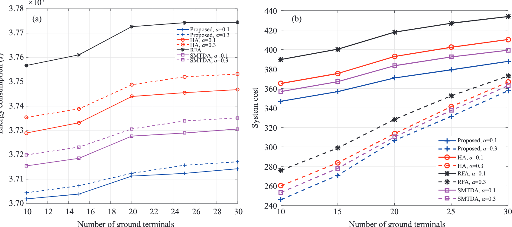
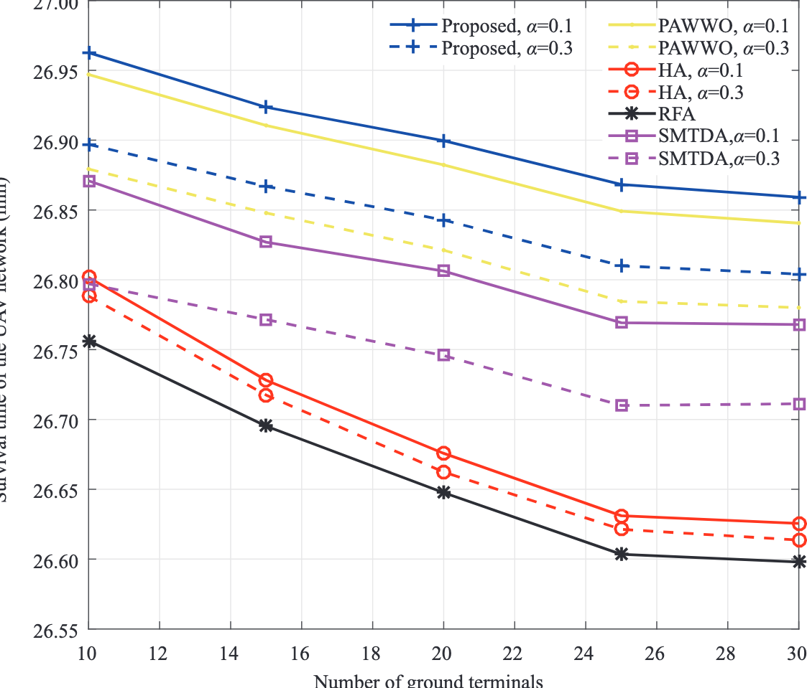
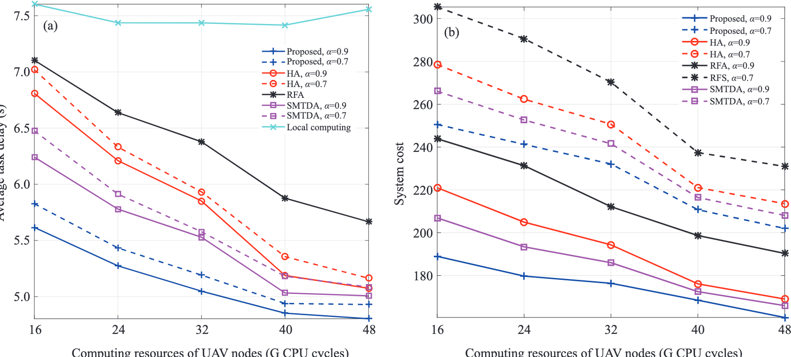
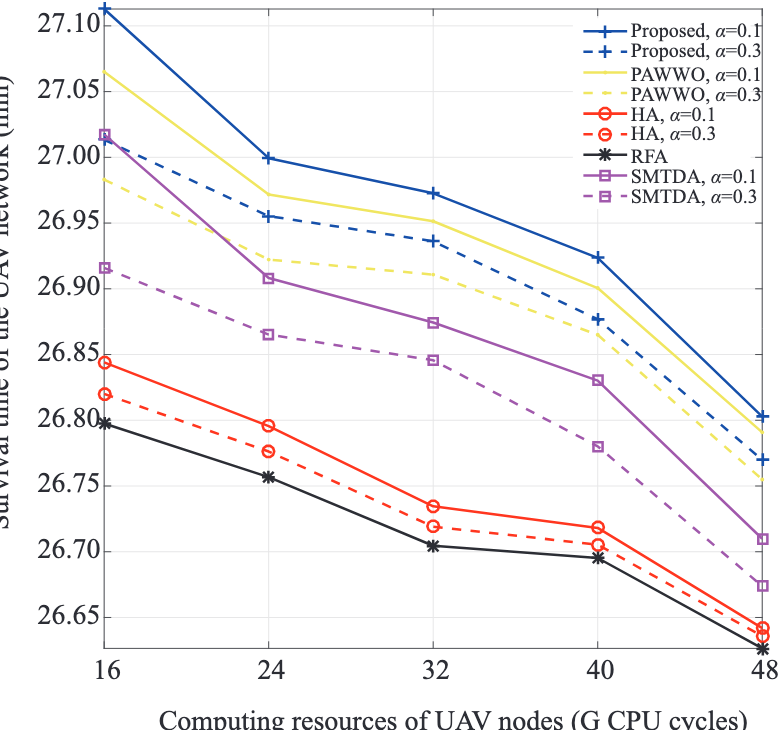
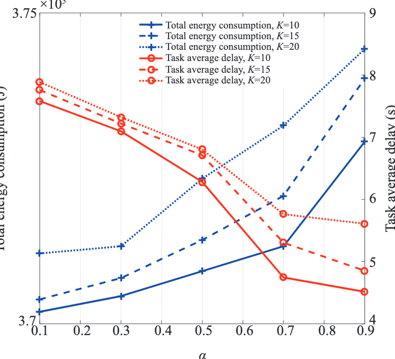

. RESEARCH PAPER .

September 2023, Vol. 66 192303:1–192303:20   
https://doi.org/10.1007/s11432-022-3667-3

# Joint task scheduling and multi-UAV deployment for aerial computing in emergency communication networks

Tiankui ZHANG1, Chaobin CHEN1, Yu XU1, Jonathan LOO2 & Wenjun XU3\*

1School of Information and Communication Engineering,

Beijing University of Posts and Telecommunications, Beijing 100876, China;

2School of Computing and Engineering, University of West London, London W5 5RF, UK;

3School of Artificial Intelligence, Beijing University of Posts and Telecommunications, Beijing 100876, China

Received 1 August 2022/Revised 30 October 2022/Accepted 26 December 2022/Published online 28 August 2023

Abstract This article studies mobile edge computing technologies enabled by unmanned aerial vehicles (UAVs) in disasters. First, considering that the ground servers may be damaged in emergency scenarios, we proposed an air-ground cooperation architecture based on ad-hoc UAV networks. We defined the system cost as the weighted sum of task delay and energy consumption because of different delay sensitivity and energy sensitivity tasks in emergency communication networks. Then, we formulated the system cost-minimization problem of task scheduling and multi-UAV deployments. To solve the proposed mixed integer nonlinear programming problem, we decomposed it to two sub-problems that were solved by proposing a swap matchingbased task scheduling sub-algorithm and a successive convex approximation-based multi-UAV deployment sub-algorithm. Accordingly, we propose a joint optimization algorithm by iterating the two sub-algorithms to obtain a low complexity sub-optimal solution. Finally, the simulation results show that (i) the proposed algorithm converges in several iterations, and (ii) compared with the benchmark algorithms, the proposed algorithm has better performance of reducing task delay and energy consumption and achieves a good tradeoff between them for diverse tasks.

Keywords emergency communication, mobile edge computing, swap matching algorithm, unmanned aerial vehicle

Citation Zhang T K, Chen C B, Xu Y, et al. Joint task scheduling and multi-UAV deployment for aerial computing in emergency communication networks. Sci China Inf Sci, 2023, 66(9): 192303, https://doi.org/10.1007/ s11432-022-3667-3

<a id="image-index"></a>
## 图像索引

本索引由 `raw/scripts/establish_image_links.py` 根据注释导出的图片标注解析生成。图片目录总览见 [zhang2023JointTaskScheduling/README.md](../assets/zhang2023JointTaskScheduling/README.md#asset-index)。

| 图号/表号 | 论文定位 | 资源文件 | 说明 |
| --- | --- | --- | --- |
| [Table 1](#table-1) | p. 4 | [NXMWYJDU.png](../assets/zhang2023JointTaskScheduling/NXMWYJDU.png) | Notation descriptions |
| [Fig. 1](#fig-1) | p. 5 | [H5BKNAC2.png](../assets/zhang2023JointTaskScheduling/H5BKNAC2.png) | Air-ground cooperation architecture based on the ad-hoc network. |
| [Fig. 2](#fig-2) | p. 13 | [EQHLPE6I.png](../assets/zhang2023JointTaskScheduling/EQHLPE6I.png) | Application flow chart of the strategy. |
| [Table 2](#table-2) | p. 14 | [36ZBV5DL.png](../assets/zhang2023JointTaskScheduling/36ZBV5DL.png) | Simulation parameters |
| [Fig. 3](#fig-3) | p. 15 | [XR2G76KH.png](../assets/zhang2023JointTaskScheduling/XR2G76KH.png) | The convergence of the proposed algorithm with varying weights. |
| [Fig. 4](#fig-4) | p. 15 | [5WG2ACR4.png](../assets/zhang2023JointTaskScheduling/5WG2ACR4.png) | Deployment of UAV nodes in different cases. (a) Delay-sensitive case; (b) energy-sensitive case. |
| [Fig. 5](#fig-5) | p. 16 | [AGFGKE9C.png](../assets/zhang2023JointTaskScheduling/AGFGKE9C.png) | Comparison with different number of ground terminals in delay-sensitive case. (a) Comparison of task delay; (b) comparison of system cost. |
| [Fig. 6](#fig-6) | p. 16 | [AYBNCS5J.png](../assets/zhang2023JointTaskScheduling/AYBNCS5J.png) | Comparison with different numbers of ground terminals in the energy-sensitive case. (a) Comparison of energy consumption; (b) comparison of system cost. |
| [Fig. 7](#fig-7) | p. 17 | [TL4KCYYR.png](../assets/zhang2023JointTaskScheduling/TL4KCYYR.png) | Comparison of the survival time of the UAV network with different numbers of ground terminals in the energy-sensitive case. |
| [Fig. 8](#fig-8) | p. 17 | [335MCYCT.png](../assets/zhang2023JointTaskScheduling/335MCYCT.png) | Comparison with different computing resources of UAV nodes in the delay-sensitive case. (a) Comparison of task delay; (b) comparison of system cost. |
| [Fig. 9](#fig-9) | p. 18 | [63NHUJ2P.png](../assets/zhang2023JointTaskScheduling/63NHUJ2P.png) | Comparison with different computing resources of UAV nodes in the energy-sensitive case. (a) Comparison of energy consumption; (b) comparison of system cost. |
| [Fig. 10](#fig-10) | p. 18 | [CS35C7N3.png](../assets/zhang2023JointTaskScheduling/CS35C7N3.png) | Comparison of the survival time of the UAV network computing resources of UAV nodes in the energy-sensitive case. |
| [Fig. 11](#fig-11) | p. 18 | [C289XS5E.png](../assets/zhang2023JointTaskScheduling/C289XS5E.png) | Influence of different weights on system performance. |

## 1 Introduction

Nowadays, various natural disasters, such as tsunamis, earthquakes, hurricanes, wildfires, and floods, have caused great damage. In the past 30 years, material losses caused by disasters worldwide have increased by about 100%–150% [1]. When disasters happen, communication infrastructures, such as the base stations (BSs) in cellular networks, fail to provide communication services in emergency scenarios.

An unmanned aerial vehicle (UAV) is a self-contained device that is controlled by specific control and non-payload communications (CNPC) links [2]. As a popular aircraft, UAVs are currently used in many fields [3–5] and have played an important role in emergency scenarios [6]. Given the flexibility of UAVs, they are widely used in disaster relief in the field such as communication recovery, rescue target identification, and aerial mapping of the affected terrain [7, 8].

Ground terminals including various sensor devices generally have limited computing power, which will take a long task execution delay when the computing task burden is heavy. Mobile edge computing (MEC) is a promising technology to solve this problem [9]. MEC is an emerging technology that provides information technology service environment and cloud computing capability at the edge of mobile networks [10]. Accordingly, terminal devices can offload the computing task to the edge server, thereby reducing service delays for users and alleviating network congestion [11]. This will allow tasks with high real-time requirements to be finished quickly, including some specific tasks such as augmented reality and target recognition [12, 13]. However, in traditional MEC networks, the edge server is usually embedded in the ground BS. Damage in ground communication infrastructure makes the traditional MEC networks invalid in emergency scenarios. Thus, aerial computing has drawn extensive attention. It is a new technology that further integrates air radio access network and edge computing through UAVs and other flight equipment [14]. Aerial computing is a part of the UAV-enabled MEC system. Unlike the UAV-assisted MEC system, it generally does not have ground infrastructure. By using the computing ability of edge servers carried by UAVs, aerial computing uses UAV as effective edge nodes to help ground terminals perform task uninstallation calculations [15]. Authors [16] proposed an air-ground collaborative architecture based on UAV, where ground terminals can offload their computing tasks to UAV nodes according to the input data of different tasks.

In emergency relief, better services are necessary for some specific tasks that need assistance of aerial computing. When disasters occur, sensors and cameras carried by the ground terminal are usually used to perform search and rescue tasks. In this case, ground terminals can upload target-area information to the UAV node through MEC networks. It will make more accurate and quick decisions by the high-speed computational capability of UAVs. However, to provide better services, each UAV in emergency scenarios should hover over with suitable velocity and distance [17]. Moreover, owing to the diversity of applications in emergency scenarios, we should further consider tasks with different requirements, including delaysensitive and energy-sensitive tasks. Therefore, designing a cooperation mechanism between multiple UAVs considering task diversity in emergency scenarios is an urgent problem.

## 1.1 Motivations and related work

At present, different contributions have been carried out on the task-completion strategies of UAV networks from single UAV to multiple UAV collaboration. First, in emergency scenarios, most studies focus on how to use the UAV as a BS to achieve fast recovery of communications [18, 19]. These studies do not consider the task computing requirements of ground terminals in emergency scenarios. Second, existing contributions mainly solve the UAV edge computing-task scheduling and offloading under cloud edge collaboration architectures [20–24]. Gu et al. [20] presented an innovative task-completion strategy for multiple UAVs by combining animal group perception with edge resource scheduling and task assignment. The authors in [22] proposed an UAV-enabled MEC system involving interactions among Internet of Things (IoT) devices, UAVs, and ground macro BSs. In [23], the UAV plays the role of an MEC server in the IoT, so that computing tasks can be performed on local devices, UAV, or ground BSs. To minimize the weighted system cost of delay and energy consumption, the authors in [24] proposed a scheme based on game theory to find the optimal solution under the constraints of offloading decision and resource competition. In the above studies, the aerial computing architecture is based on the cloud edge collaboration architecture. Moreover, it relies on the high-speed computing capacity of the ground cloud server. Therefore, a good communication link between ground cloud servers and UAV nodes is necessary. However, in the post-earthquake relief or other emergency scenarios, the communication infrastructure maybe damaged, resulting in the inability to transmit task information from the UAVs to the ground cloud servers.

In addition, some studies examined trajectory optimization in air-ground cooperation architecture [25– 30]. Under task constraints and information causality constraints, Hu et al. [25] proposed an alternating optimization algorithm to minimize the weighted total energy consumption of UAVs and terminals. A multi-agent deep reinforcement learning-based trajectory control algorithm was also proposed to manage task scheduling and the trajectory of each UAV [26]. Ning et al. [27] considered trajectory and taskscheduling optimization for 5G-enabled UAV-to-community offloading system. They developed an average throughput maximization-based auction algorithm and a dynamic task admission algorithm to maximize the throughput. Sun et al. [28] examined the joint design of the 3D aerial trajectory and wireless resource allocation in solar-powered MC-UAV communication systems. Cai et al. [29] investigated the trajectory and resource-allocation design for downlink energy-efficient secure UAV communication systems. By jointly optimizing the trajectory of UAV, transmit beamforming, and phase shift of intelligent reflecting surface (IRS), Pang et al. [30] investigated a secure transmission design for an IRS-assisted UAV network in the presence of an eavesdropper. In these contributions of aerial computing, the trajectory optimization of UAVs is generally determined in advance by task information and will not be adjusted with the change in user mobility. Besides, considering some energy-sensitive applications in emergency communications, the energy is quite valuable for UAV nodes and ground terminals. However, most optimization problems in existing task scheduling strategies rarely consider the current energy state of UAV nodes and ignore the network lifetime of UAV node formation.

## 1.2 Contributions and organization

Gaps in previous studies reflect the need for a distributed air-ground cooperation mechanism for diverse task requirements in emergency communications. In this study, we propose an air-ground cooperation architecture based on the ad-hoc network to jointly optimize task scheduling and UAV node deployment, which can minimize the weighted sum of task delay and energy consumption for mixed time-sensitive and energy-sensitive tasks. The main contributions are as follows.

• We proposed an air-ground cooperation architecture based on the ad-hoc network. In the proposed architecture, we defined the weighted sum of task delay and energy consumption as system cost. Specifically, the total task delay and energy consumption consist of three parts: the task execution consumption in ground terminals and UAV nodes and flight consumption in UAV nodes. On this basis, the system cost-minimization problem of task scheduling and multi-UAV deployment was proposed, in which the multi-UAV deployment included the optimization of the position and velocity of UAV nodes.

• Owing to the intractability of the formulated problem, we transformed the optimization problem into two subproblems: the task scheduling strategy sub-problem and the multi-UAV deployment sub-problem. Since the essence of the two sub-problems was the many-to-many matching problem and continuous nonconvex problem, we used the swap-matching algorithm and the successive convex approximation (SCA) algorithm to solve them. Accordingly, we proposed a joint optimization algorithm by iterating the two sub-algorithms.

• We demonstrated the convergence and effectiveness of the algorithm by numerical simulations. The simulation results showed that in the air-ground cooperation architecture based on the ad-hoc network, the proposed algorithm can greatly reduce task delay and energy consumption compared with benchmark algorithms. Furthermore, it prolonged the survival time of the network and achieved a good trade-off between task delay and energy consumption in diverse task scenarios.

The rest of this paper is organized as follows. Section 2 presents the system model and formulates the optimization problem. In Section 3, we decompose the problem into two subproblems and propose a joint optimization algorithm. In Section 4, the simulation results are provided. Finally, Section 5 presents the summary.

## 2 System model and problem formulation

To further reduce task delay and energy consumption, studies should focus on task scheduling and offloading technology of air-ground collaborative computing in emergency scenarios. Compared with the literature, we have made the following improvements to the system model: (1) we proposed an air-ground cooperation architecture based on the ad-hoc network to solve the problem of ground communication infrastructure damage and (2) the remaining energy weight was set in the system cost to solve the problem of uneven energy consumption of UAV nodes. The main notations in this paper are summarized in Table 1.

## 2.1 Design of air-ground cooperation architecture

As shown in Figure 1, in the air-ground coordination scenario with UAV nodes for emergency communications, multiple tasks are required from the ground terminals. To speed up task execution, task offloading will be provided by air computing. The UAV node network should further consider flight position, communication interference, and other factors in the air-ground cooperation architecture. Considering the damaged ground traditional communication link in the emergency scenario, UAV nodes must communicate with each other according to their computing power and cache resources. The mobile edge cloud system based on the ad-hoc network is a suitable MEC architecture for distributed collaborative computing. The virtual cloud based on the ad-hoc network does not need to rely on remote servers but can calculate and be completed by a group of mobile devices. A recent study showed that the MEC architecture based on the ad-hoc network can use the resources of adjacent mobile devices to achieve better overall system performance [31]. It not only can complete the tasks with lower energy consumption but can also significantly reduce the computation delay. Therefore, we chose to establish the ad-hoc self-organizing network by the UAV nodes and built an air-ground cooperation architecture.

<a id="table-1"></a>
Table 1 Notation descriptions
<table><tr><td>Description</td><td>Notation</td></tr><tr><td>Period time (s) of task collaboration strategy update</td><td> $T _ { s }$ </td></tr><tr><td>Number of UAV nodes</td><td>M</td></tr><tr><td>Number of ground terminal</td><td>K</td></tr><tr><td>Number of tasks</td><td> $N$ </td></tr><tr><td>Amount of the input data(bits) of task n</td><td> $I _ { n }$ </td></tr><tr><td>Ground terminal generating task n</td><td> $H _ { n }$ </td></tr><tr><td>Cycles of computation required for task</td><td> $\xi _ { n }$ </td></tr><tr><td>Whether task n is offloaded to the UAV node m</td><td> $x _ { m n }$ </td></tr><tr><td>Whether task n is computed locally</td><td> $x _ { M + 1 , n }$ </td></tr><tr><td>Whether the ground terminal  $H _ { n }$  （2 is associated with the UAV node m</td><td> $\Theta ( m , k )$ </td></tr><tr><td>Computation capability(GHz) of the ground terminal k</td><td> $f _ { k }$ </td></tr><tr><td>Computation delay (s) for the local execution of task n</td><td> $t _ { n } ^ { l }$ </td></tr><tr><td>Energy consumption (J) of local execution of task n</td><td> $e _ { n } ^ { l }$ </td></tr><tr><td>Local task execution cost of task n</td><td> $Z _ { n } ^ { l }$ </td></tr><tr><td>Weight of task delay</td><td>α</td></tr><tr><td>Weight of energy consumption</td><td> $\beta$ </td></tr><tr><td>Position vector of the UAV node m</td><td> ${ \mathbf { \Delta } } { \mathbf { \em u } } _ { m }$ </td></tr><tr><td>Position vector of the ground terminal k</td><td> ${ \pmb u } _ { k }$ </td></tr><tr><td>Whether ground terminal k&#x27; has communication interaction with other UAVs</td><td> $\Gamma ( \boldsymbol { m } , \boldsymbol { k } ^ { \prime } )$ </td></tr><tr><td>Transmission rate (Mbps) between the UAV node m and the ground terminal k</td><td> $r _ { m , k }$ </td></tr><tr><td>Transmission delay (s) of task n for offloading</td><td> $t _ { n } ^ { c , \mathrm { t r } }$ </td></tr><tr><td>Computing task capability(GHz) of the UAV node m</td><td> $f _ { m }$ </td></tr><tr><td>Computing delay (s) of task n executed at the UAV node m</td><td> $t _ { n } ^ { c , \mathrm { e x } }$ </td></tr><tr><td>Task delay (s) of task n for offloading</td><td> $t _ { n } ^ { c }$ </td></tr><tr><td>Energy consumption (J) of offloading task n</td><td> $e _ { n } ^ { c }$ </td></tr><tr><td>Cost of task n executed in the UAV node m</td><td> $Z _ { n } ^ { c }$ </td></tr><tr><td>Flight velocity (m/s) of the UAV node m</td><td> $v _ { m }$ </td></tr><tr><td>Flight time (s) of the UAV node m</td><td> $t _ { m } ^ { F }$ </td></tr><tr><td>Flight power (W) of the UAV node m</td><td> $p ^ { F } ( v _ { m } )$ </td></tr><tr><td>Flight cost of the UAV node m</td><td> $Z _ { m } ^ { F }$ </td></tr><tr><td>Computing resources (G CPU cycles) of the UAV node m</td><td> $c _ { m }$ </td></tr></table>

Based on the above design of air-ground cooperation architecture, the self-organizing network was assumed to be composed of multiple middle-high-altitude and long-duration rotary-wing UAV nodes. In this case, the UAV nodes will not be affected by the non-line-of-sight $\mathrm { ( N L o S ) }$ link and can provide communication and computing services for ground terminals. We adopted mobile ad-hoc network routing protocol, such as the zone routing protocol (ZRP), to deal with the problem of controlling information overhead and obstacles in communication [32]. Moreover, the UAV node was assumed to have two communication modules: a module for communication with ground terminals and another for communication with other UAVs. The spectral resources of these two communication modules were assumed to be orthogonal with each other and do not have inter-frequency interference. Therefore, communications between UAV nodes will not affect that between UAV nodes and ground terminals.

## 2.2 Task execution model

According to the characteristics of the air-ground cooperation architecture at the edge, we assume that the period time of task collaboration strategy update is $T _ { S }$ . There are M UAV nodes, the UAV node set is denoted by $\mathcal { M } = \{ 1 , \dots , M \}$ . There are K ground terminals, and the set of which is denoted by $\mathcal { K } = \{ 1 , \ldots , K \}$ In the system, it has N tasks, the set of which is denoted by $\mathcal { N } = \{ 1 , \dots , N \}$ The tasks can be executed locally at the ground terminal according to the task information, or offloaded to the UAV nodes. The information of task n includes $\left( I _ { n } , \xi _ { n } , H _ { n } \right)$ , where $I _ { n }$ represents the amount of input data (in bits) of task $n , H _ { n }$ represents the ground terminal generating task n, i.e., $H _ { n } \in \mathcal { K }$ . Assume that the cycles of computation required for task, $\mathrm { i . e . , } \xi _ { n } ,$ is proportional to the input data size. Thus, we have $\xi _ { n } = \kappa I _ { n }$ , where the coefficient κ represents required CPU cycles for executing one bit of task data.

<!-- image-->  


<a id="fig-1"></a>
Figure 1 (Color online) Air-ground cooperation architecture based on the ad-hoc network.

Define the task scheduling variable matrix of the UAV nodes as x. The matrix element $x _ { m n } , m \in$ $\mathcal { M } , n \in \mathcal { N }$ , is a binary variable, which indicates whether task n is offloaded to UAV node m. When $x _ { m n } = 1$ , the ground terminal generating task n is offloaded to UAV node $m ,$ otherwise $x _ { m n } = 0$ In particular, let $X _ { M + 1 }$ indicates whether the ground terminal performs computing tasks locally. If $X _ { M + 1 , n } = 1$ , task n will perform calculation locally, otherwise $X _ { M + 1 , n } = 0$ . On this basis, the association function between the ground terminal and UAV node is set as $\Theta ( m , k )$ ，

$$
\Theta ( m , k ) = \left\{ { 1 , ~ x _ { m n } = 1 , ~ H _ { n } = k } , \right.\tag{1}
$$

If task n is scheduled to the m-th UAV node, $\Theta ( m , k ) = 1$ denotes the ground terminal $H _ { n }$ is associated with UAV node m.

According to the scheduling of the tasks, the task execution can be divided into two types: local task execution and UAV task execution. The two types of task execution models are as follows.

(1) Local task execution model. In the air-ground cooperation architecture, tasks can be executed locally at the ground terminals. Suppose that task n is generated in ground terminal k. Define the computation capability (in CPU cycles per second) of ground terminal k as $f _ { k }$ . the computation delay for local execution of task n is

$$
t _ { n } ^ { l } = \frac { \xi _ { n } } { f _ { k } } = \frac { \kappa I _ { n } } { f _ { k } } .\tag{2}
$$

The energy consumption of local execution is described as $e _ { n } ^ { l } \ = \ \mu _ { k } t _ { n } ^ { l }$ , where $\mu _ { k }$ is the computing energy consumption per unit time of ground terminal $k ,$ denoted by $\mu _ { k } = \gamma f _ { k } ^ { 3 }$ 3k , and $\gamma \geqslant 0$ is the effective switched capacitance [33]. In order to cope with the diversity of task delay and energy consumption requirements, the local execution cost of task n at ground terminal k is defined as

$$
Z _ { n } ^ { l } = x _ { M + 1 , n } ( \alpha t _ { n } ^ { l } + \beta w _ { c } e _ { n } ^ { l } ) ,\tag{4}
$$

where $\alpha$ and $\beta$ is the weight of task delay and energy consumption, and $\alpha + \beta = 1$ . The two weights respectively represent the sensitivity of the task to the task delay and energy consumption. If the task focuses more on reducing the task delay, the coefficient α can be increased appropriately. On the contrary, if we focus more on reducing energy consumption, we could increase the coefficient $\beta$ appropriately. $w _ { c }$ is the coefficient that adjusts the task delay and energy consumption to the same scale.

(2) UAV task execution model. Let the position variable matrix of the UAV nodes be u, The matrix element is the position vector $\mathbf { \boldsymbol { u } } _ { m }$ of UAV node $m ,$ which is expressed as $\left( x _ { m } , y _ { m } , z _ { m } \right)$ in rectangular coordinates. The distance $d _ { m , k }$ between UAV node m and ground terminal k is expressed as $d _ { m , k } =$ $\left| \left| \pmb { u } _ { m } - \pmb { u } _ { k } \right| \right| ,$

Because of the high-altitude advantage of the UAV, we only consider the line-of-sight (Los) channel [34], so the channel fading is only related to the position of the UAV. Besides, the position of UAVs can be obtained by means of Global positioning system (GPS) so that the channel gain can be obtained accurately [35]. So the channel gain $g _ { m , k }$ is

$$
g _ { m , k } = \frac { g _ { 0 } ^ { D } } { { d _ { m , k } } ^ { 2 } } ,\tag{3}
$$

where $g _ { 0 } ^ { D }$ denotes the channel gain with a distance of 1 m. Suppose that when multiple ground terminals are associated with the same UAV node due to task offloading, the ground to air transmission link between them adopts the statistical time multiplexing. Since there are multiple UAV nodes communicating with the ground terminal at the same time, the same bandwidth is in common. As a result, the ground terminal accessed by the same UAV node has complementary interference. For the interference of airground communication channel, there is only inter cell co-frequency interference.

According to the free space propagation model, the signal to interference plus noise ratio (SINR) of the ground terminal k associated with the UAV node m is

$$
\mathrm { S I N R } _ { m , k } = \frac { p _ { D } g _ { m , k } } { \sum _ { k ^ { \prime } \neq k } ^ { K } p _ { D } g _ { m , k ^ { \prime } } \Gamma ( m , k ^ { \prime } ) + B _ { D } \sigma ^ { 2 } } ,\tag{4}
$$

where $\sigma ^ { 2 }$ denotes the Gaussian noise of the channel, pD denotes the signal transmission power from the ground terminal to the UAV node, $g _ { m , k }$ denotes the channel gain between ground terminal k and UAV node $m , B _ { D }$ denotes the bandwidth of UAV node for air-ground communication link. $\Gamma ( \boldsymbol { m } , \boldsymbol { k } ^ { \prime } )$ indicates whether the ground terminal $k ^ { \prime }$ associates with other UAVs,

$$
\Gamma ( m , k ^ { \prime } ) = \left\{ \begin{array} { l } { { 1 , \displaystyle \sum _ { m ^ { \prime } \neq m } ^ { M } \Theta ( m ^ { \prime } , k ^ { \prime } ) > 0 , } } \\ { { 0 , \displaystyle \sum _ { m ^ { \prime } \neq m } ^ { M } \Theta ( m ^ { \prime } , k ^ { \prime } ) = 0 . } } \end{array} \right.\tag{5}
$$

If $\Gamma ( m , k ^ { \prime } ) = 1$ , ground terminal $k ^ { \prime }$ will interfere with the transmission link between UAV node m and ground terminal $k ,$ otherwise not. Then, the transmission rate $r _ { m , k }$ between UAV node m and ground terminal k is

$$
r _ { m , k } = B _ { D } \mathrm { l o g } _ { 2 } \mathrm { ( 1 + S I N R } _ { m , k } \mathrm { ) . }\tag{6}
$$

The transmission delay of task n for offloading is

$$
t _ { n } ^ { c , \mathrm { t r } } = \frac { I _ { n } } { r _ { m , k } } .\tag{7}
$$

The computing task capability of each UAV node is related to many internal factors, including CPU core frequency, number of CPU cores, and memory space. Assume that the computation capability (in CPU cycles per second) of UAV node m is $f _ { m }$ , the computing delay of task n executed at UAV node m is

$$
t _ { n } ^ { c , \mathrm { e x } } = \frac { \xi _ { n } } { f _ { m } } = \frac { \kappa I _ { n } } { f _ { m } } .\tag{8}
$$

Therefore, the task delay of task n for offloading is

$$
t _ { n } ^ { c } = t _ { n } ^ { c , \mathrm { e x } } + t _ { n } ^ { c , \mathrm { t r } } .\tag{9}
$$

Generally speaking, the output data of the task is much less than the input data [23], so the transmission cost of task results is ignored. Similarly, suppose that $\mu _ { m }$ is the computing energy consumption per unit time of UAV node m, and $\mu _ { m } = \gamma f _ { m } ^ { 3 }$ . The energy consumption of offloading task n at UAV node m is

$$
e _ { n } ^ { c } = \mu _ { m } t _ { n } ^ { c , \mathrm { e x } } + p _ { D } t _ { n } ^ { c , \mathrm { t r } } .\tag{10}
$$

In order to further prolong the survival time of the network and balance the workload, the remaining energy of UAV node needs to be considered. Similar to the local task execution model, for different task requirements, the cost of task n executed in UAV node m is defined as

$$
Z _ { n } ^ { c } = \frac { e _ { 0 } } { e _ { m } } ( \alpha t _ { n } ^ { c } + \beta w _ { c } e _ { n } ^ { c } ) x _ { m n } ,\tag{11}
$$

where $e _ { m }$ and $e _ { 0 }$ denote the remaining energy and initial energy of UAV node $m .$ . That is, the less energy left in UAV node m, the greater the cost of mobilizing UAV node m for offloaded task computing. Parameter $\alpha , \beta , w _ { c }$ is consistent with the local task execution model.

## 2.3 Hovering and flying consumption model

Based on the design idea of combining multi-UAV deployment optimization with scheduling strategy, UAV nodes need to optimize deployment according to task scheduling strategy. We need to further consider the cost of UAV node position updating. Let $\mathbf { \boldsymbol { u } } _ { m }$ be the new position vector of UAV node m after receiving the decision of deployment optimization strategy. Let $\pmb { u } _ { m } ^ { 0 }$ be the original position vector of the UAV node m. We assume that UAV m maintains a uniform motion in position updating and the flight velocity is $v _ { m }$ . Therefore, the flight time $t _ { m } ^ { F }$ is described as

$$
t _ { m } ^ { F } = \frac { | | \boldsymbol { u _ { m } } - \boldsymbol { u _ { m } ^ { 0 } } | | } { v _ { m } } .\tag{12}
$$

According to the emergency scenario assumption, the UAV nodes need to hover for task computing. Let the flight power of UAV node m be $p ^ { F } ( v _ { m } )$ , then the flight energy consumption required in $T _ { s }$ is

$$
\begin{array} { r l } & { e _ { m } ^ { F } = e _ { m } ^ { F , \mathrm { f u y } } + e _ { m } ^ { F , \mathrm { h o } } , } \\ & { e _ { m } ^ { F , \mathrm { f u y } } = t _ { m } ^ { F } p ^ { F } ( v _ { m } ) , } \\ & { e _ { m } ^ { F , \mathrm { h o } } = p ^ { F } ( 0 ) ( T _ { s } - t _ { m } ^ { F } ) , } \end{array}\tag{13}
$$

where $e _ { m } ^ { F , \mathrm { { f l y } } }$ is the flying energy consumption with $v _ { m }$ in flying state, $e _ { m } ^ { F , \mathrm { h o } }$ is the hovering energy consumption, and $p ^ { F } ( 0 )$ denotes the flight power consumed by UAV nodes in hovering state. According to the flight power model of rotary-wing UAV [36], the relationship between $p ^ { F } ( v _ { m } )$ and $v _ { m }$ is

$$
p ^ { F } ( v _ { m } ) = P _ { 0 } \left( 1 + \frac { 3 v _ { m } ^ { 2 } } { U _ { \mathrm { t i p } } ^ { 2 } } \right) + P _ { i } \left( \sqrt { 1 + \frac { v _ { m } ^ { 4 } } { 4 v _ { 0 } ^ { 2 } } } - \frac { v _ { m } ^ { 2 } } { 2 v _ { 0 } ^ { 2 } } \right) ^ { \frac { 1 } { 2 } } + \frac { 1 } { 2 } d _ { 0 } \rho s A v _ { m } ^ { 3 } ,\tag{14}
$$

where $P _ { 0 }$ and $P _ { i }$ two constants denote blade profile power and induced power respectively in hovering state, $U _ { \mathrm { t i p } }$ is the tip velocity of the rotor blade, $v _ { 0 }$ denotes the average rotor induced velocity in hover, $d _ { 0 }$ and s denote the fuselage resistance ratio and rotor solids respectively, $\rho$ and A denote air density and rotor disk area respectively. So the hovering flight power of the UAV node $p ^ { F } ( 0 ) = P _ { 0 } + P _ { i }$

In order to balance the contradiction between delay and energy consumption during UAV movement and achieve better cost saving effect, the flight cost of UAV task execution model is designed as

$$
Z _ { m } ^ { F } = \alpha t _ { m } ^ { F } + \beta w _ { F } e _ { m } ^ { F } ,\tag{15}
$$

where parameter α, $\beta$ is consistent with the execution model. Since the flight energy consumption far exceeds the transmission and calculation losses, we use the different coefficient $w _ { F }$ to adjust the flight delay and flight energy consumption to the same scale.

## 2.4 Problem formulation

Based on the above system model, we take the sum of the local task execution cost of tasks in ground terminals, the UAV task execution cost and the flight cost in UAV nodes as the total system cost, which is composed of task execution delay and energy consumption of ground terminals and UAV nodes. In the system cost, we can find that the task delay and energy consumption required for offloading are not only related to the task scheduling strategy $x _ { m n } ,$ but also related to the position $\pmb { u } _ { m } = ( x _ { m } , y _ { m } , z _ { m } )$ and velocity $v _ { m }$ of UAV node m. Therefore, the optimization problems is formulated as follows:

$$
\operatorname { P 1 } : \operatorname* { m i n } _ { x , u , v } f = \sum _ { m = 1 } ^ { M } \sum _ { n = 1 } ^ { N } ( Z _ { n } ^ { l } + Z _ { n } ^ { c } + Z _ { m } ^ { F } ) ,\tag{16}
$$

$$
\mathrm { s . t . } \sum _ { m } ^ { M } x _ { m n } + x _ { M + 1 , n } = 1 , \forall m , n ,\tag{16a}
$$

$$
e _ { m } ^ { F , \mathrm { H y } } < e _ { \mathrm { m a x } } ^ { \mathrm { f i y } } , \ \forall m ,\tag{16b}
$$

$$
\sum _ { n } ^ { N } \xi _ { n } x _ { m n } \leqslant c _ { m } , \ \forall m ,\tag{16c}
$$

$$
h _ { \mathrm { m i n } } < z _ { m } < h _ { \mathrm { m a x } } , \forall m ,\tag{16d}
$$

$$
x _ { m n } , x _ { M + 1 , n } \in \{ 0 , 1 \} , \forall m , n ,\tag{16e}
$$

$$
v _ { m } \leqslant v _ { \mathrm { m a x } } , \ \forall m .\tag{16f}
$$

Constraint (16a) indicates that the task can be offloaded at most once; constraint (16b) represents that the flight energy of UAV node needs to be limited, where $e _ { \mathrm { m a x } } ^ { \mathrm { f i y } }$ is the maximum flying energy of the UAV nodes; constraint (16c) indicates that the offloading task received by the UAV node cannot exceed its remaining computing resources; constraints (16d) and (16f) represents that the flight altitude of UAV node needs to be in $[ h _ { \operatorname* { m i n } } , h _ { \operatorname* { m a x } } ]$ and the velocity needs to be smaller than $v _ { \mathrm { m a x } } ;$ constraint (16e) indicates that $x _ { m n }$ and $x _ { M + 1 , n }$ are binary.

The optimization problem P1 is a mixed integer nonlinear programming problem, which is also a nonconvex optimization problem. In order to solve this problem efficiently, we divide problem P1 into two sub-problems, the task scheduling sub-problem and the UAVs’ deployment problem. On this basis, we propose a joint optimization algorithm to solve problem P1.

## 3 Joint optimization algorithm

In order to solve the primal problem P1 proposed in Section 2, we propose an effective low complexity algorithm in this section. Specifically, we first decompose the optimization problem to two sub-problems. Then, we solved them by proposing a swap matching based task scheduling algorithm and a SCA based multi-UAV deployment algorithm. On this basis, the joint optimization algorithm is proposed by iterating these two algorithms.

## 3.1 Swap matching based task scheduling algorithm

Given the location variable u and velocity variable v, problem P1 becomes a scheduling strategy subproblem, given by

$$
\begin{array} { r l r } { \mathrm { P 2 : } } & { \displaystyle \operatorname* { m i n } _ { x } \sum _ { n = 1 } ^ { N } \sum _ { m = 1 } ^ { M } x _ { M + 1 , n } ( \alpha t _ { n } ^ { l } + \beta w _ { c } e _ { n } ^ { l } ) + \frac { e _ { 0 } } { e _ { m } } ( \alpha t _ { n } ^ { c } + \beta w _ { c } e _ { n } ^ { c } ) x _ { m n } , } & \\ & { \mathrm { s . t . } } & { ( 1 6 \mathrm { a } ) , ( 1 6 \mathrm { c } ) , ( 1 6 \mathrm { e } ) . } \end{array}\tag{17}
$$

According to the system model, one UAV node can accept multiple tasks offloading, but one task can only be offloaded to one UAV node. It is necessary to develop a multi-task scheduling algorithm in the case of different computing ability and real-time energy consumption of UAV nodes with the amount of different tasks. Based on the fact that the swap matching algorithm can not only ensure the stability of a pairing but also have low complexity and fast convergence [37], we choose it to optimize the task scheduling.

Let computing device set $\mathcal { M } = \{ 1 , \ldots , M + 1 \}$ and task set $\mathcal { N } = \{ 1 , \ldots , N \}$ be finite and disjoint. When the UAV node m is assigned to task n, a matching pair $( m , n )$ is formed. We take the system cost as the basis for establishing the preference list. Preference list records the system cost of one party to the other in the match. The matching exchange between the two sides is based on the preference list.

As a result, for the sub-problem, each UAV node has its own preference list of each task, and each task has its own preference list for each UAV node similarly. If the ranking position of UAV node m in the preference list of task n is higher than UAV node $m ^ { \prime }$ , it indicates that the system cost of offloading task n at UAV node m is less than UAV node $m ^ { \prime }$ , expressed as $m { \succ } _ { n } m ^ { \prime }$ . During the iteration, the preference lists of both agents meet the following conditions:

• Both agents can compare and select the matching selection through their own preference list without being unable to select.

• Preference selection is transitive, that is, if $m \mathrm { \sim } _ { n } m ^ { \prime } , m ^ { \prime } \mathrm { \sim } _ { n } m ^ { \prime \prime }$ , then $m { \succ } _ { n } m ^ { \prime \prime }$

Since the UAV node can accept the offloading of multiple tasks, but the tasks can only be offloaded to one UAV node at most, the task scheduling strategy is optimized as a one to many matching problem. Set the matching function denotes as $\varphi ,$ it is defined as follows [37]:

Definition $\quad 1 . \qquad \bullet \ | \varphi ( n ) | = 1 , \forall n \in { \mathcal { N } } ;$

• $| \varphi ( m ) | \leqslant I _ { V } , \forall m \in { \mathcal { M } }$ , where $I _ { V }$ is the maximum number of tasks that UAV nodes can perform under the constraints of computing resources and energy consumption;

$$
\bullet \ \varphi ( n ) = m \Leftrightarrow \varphi ( m ) = n .
$$

According to the Definition 1, some UAV nodes may not be assigned tasks, but the tasks must be executed. Since there is communication interference between tasks during task scheduling, sub-problem P2 is a one-to-many matching problem with external characteristics. Since the income of one matching pair will be affected by other matching pairs, the concept of stability cannot be defined directly. We give the definition of swap matching $\varphi _ { m n } ^ { m ^ { \prime } n ^ { \prime } }$ as

$$
\varphi _ { m n } ^ { m ^ { \prime } n ^ { \prime } } = \{ \varphi \backslash \{ ( m , n ) , ( m ^ { \prime } , n ^ { \prime } ) \} \cup \{ ( m , n ^ { \prime } ) , ( m ^ { \prime } , n ) \} \} ,\tag{18}
$$

where $\varphi ( n ) = m \Leftrightarrow \varphi ( m ) = n$

Based on the above definition of swap matching, the definition of bilateral swap stable matching is given below.

Definition 2. If and only if there is no blocking pair, the matching $\varphi$ is a bilateral stable matching state, where the blocking pair (m, m′) is defined as

$$
\begin{array} { r l } & { \bullet \varphi ( m ) = n , \ \varphi ( m ^ { \prime } ) = n ^ { \prime } ; } \\ & { \bullet \forall x \in \{ m , n , m ^ { \prime } , n ^ { \prime } \} , \ U _ { x } ( \varphi _ { m n } ^ { m ^ { \prime } n ^ { \prime } } ) \leqslant U _ { x } ( \varphi ) ; } \\ & { \bullet \exists x \in \{ m , n , m ^ { \prime } , n ^ { \prime } \} , \ U _ { x } ( \varphi _ { m n } ^ { m ^ { \prime } n ^ { \prime } } ) < U _ { x } ( \varphi ) . } \end{array}
$$

$U _ { x } ( \varphi )$ is the system cost of element x under the matching $\varphi _ { ; }$ The characteristics of $( n , n ^ { \prime } )$ shows that if the swap matching is successful, the system cost of all elements will not increase, and the system cost of at least one element will decrease. With the success of swap matching, when there is no blocking pair in the system, it indicates that the bilateral matching has reached stability. For either agent, it is impossible to find a matching agent that can make the preference cost smaller from the optional list.

In order to describe the external characteristics, the preference cost function U is established according to the task delay and energy consumption of the optimization problem P2, given as

$$
U ( m , n ) = \left\{ \begin{array} { l l } { \alpha t _ { n } ^ { l } + \beta w _ { c } e _ { n } ^ { l } , ~ m = M + 1 , } \\ { \displaystyle \frac { e _ { 0 } } { e _ { m } } ( \alpha t _ { n } ^ { c } + \beta w _ { c } e _ { n } ^ { c } ) , ~ m \neq M + 1 . } \end{array} \right.\tag{19}
$$

The specific steps of the algorithm are described as follows:

• During initialization, since the matching state between UAV nodes and ground terminals is not established, we use signal to noise ratio (SNR) instead of SINR in the preference cost function U for initialization assignment, where $\begin{array} { r } { \mathrm { S N R } _ { m , k } \ = \ \frac { p _ { D } g _ { m , k } } { B _ { D } \sigma ^ { 2 } } } \end{array}$ Namely, the cost of interference between ground terminals is not considered. The deferred acceptance algorithm (DAA) is used to establish the initial matching state between the UAV node and the task. Each task sends a request to the UAV node with the highest priority in the preference list, and each UAV node receives the task with the highest priority in the requested task according to the preference list. When the computing resources of each UAV node are full or unmatched tasks are rejected by all UAV nodes, the DAA algorithm ends.

• Update the preference cost list according to (19). Based on the initialized matching state, for any task $n ,$ if there is another task $n ^ { \prime } \in N \ ( n ^ { \prime } \neq n )$ that will make the system cost decrease, the swapping will happen. It will stop until the system cost stabilizes.

Therefore, the swap matching based task scheduling algorithm is summarized in Algorithm 1.

Algorithm 1 Swap matching based task scheduling algorithm   
Require: The SINR in the preference cost U is replaced by SNR for initialization assignment. And we initialize the matching   
state $S _ { 0 }$ between UAV nodes and ground terminalS based on DAA algorithm, let $S = S _ { 0 } ,$ , number of iterations t = 1.   
1: repeat   
2: for n ∈ {1, . . . , N} do   
3: Find a task $n ^ { \prime } \stackrel { \cdot } { \in } N ( n ^ { \prime } \neq n ) ;$   
4: if (n, n′) is a blocking pair, after the swap, the UAV nodes still meets the resource constraints then   
5: Swap $( n , n ^ { \prime } ) ;$   
6: else   
7: Keep existing matching status;   
8: end if   
9: Update the preference cost list according to (19);   
10: end for   
11: until No blocking pair in the matching;   
12: return The task scheduling variable matrix x.

In the following, we present the complexity and convergence analysis of Algorithm 1.

(1) Complexity. According to the system model, the number of UAV nodes is M. Considering the local execution model, the equipment available for task execution is $M + 1$ and the number of tasks is N. Hence, the algorithm complexity of DAA algorithm during initialization is $O ( I _ { V } ( M + 1 ) N )$ We assume that the swap matching algorithm can converge in $L _ { 1 }$ . In the worst case, the complexity of the algorithm is $O ( I _ { V } ( M + 1 ) N + L _ { 1 } C _ { M + 1 } ^ { 2 } N )$ , i.e., the number of swaps is $1 + 2 + \cdots + M$ in each iteration. Therefore, compared with exhaustive search, this sub-algorithm achieves better performance due to the low complexity of exchange matching for the many to many matching problem.

(2) Convergence. In the final stable matching state, according to the definition, for any task $n ,$ there will be no $n ^ { \prime }$ that $( n , n ^ { \prime } )$ is a blocking pair. In the process of matching swap, the total preferred cost of matching continues to decrease. Since the total scheduling cost is always non-negative, the value of the total scheduling cost has a lower bound. As thus, after a limited numbers of swap matching, the swap matching based task scheduling algorithm can converge to a stable matching state.

## 3.2 SCA based multi-UAV deployment algorithm

Given the scheduling strategy variable x, problem P1 becomes a sub-problem of position and velocity of the UAV nodes, given by

$$
\begin{array} { r l } { } & { \mathrm { P 3 : } \underset { u , v } { \operatorname* { m i n } } \displaystyle \sum _ { n = 1 } ^ { N } \sum _ { m = 1 } ^ { M } \frac { e _ { 0 } } { e _ { m } } ( \alpha t _ { n } ^ { c } + \beta w _ { c } e _ { n } ^ { c } ) x _ { m n } + \alpha t _ { m } ^ { F } + \beta w _ { F } e _ { m } ^ { F } , } \\ { } & { \mathrm { s . t . } \ ( 1 6 \mathrm { b } ) , ( 1 6 \mathrm { d } ) , ( 1 6 \mathrm { f } ) . } \end{array}\tag{20}
$$

It can be found that when the scheduling strategy variable x is determined, the execution time $t _ { n } ^ { c , \mathrm { e x } }$ of task n is independent of the multi-UAV deployment. Therefore, the problem is equivalent to solving the minimum value of communication cost and flight cost when the UAV nodes position and velocity change, i.e.,

$$
\begin{array} { r l } & { \mathrm { P 3 ^ { \prime } } \stackrel { ! } { : } \underset { u , v } { \operatorname* { m i n } } \displaystyle \sum _ { n = 1 } ^ { N } \sum _ { m = 1 } ^ { M } \frac { e _ { 0 } } { e _ { m } } [ ( \alpha + \beta w _ { c } p _ { D } ) t _ { n } ^ { c , \mathrm { t r } } ] x _ { m n } + \alpha t _ { m } ^ { F } + \beta w _ { F } e _ { m } ^ { F } , } \\ & { \mathrm { s . t . } \ ( 1 6 \mathrm { b } ) , \ ( 1 6 \mathrm { d } ) , \ ( 1 6 \mathrm { f } ) . } \end{array}\tag{21}
$$

When the scheduling strategy variable x is given, the position and velocity variables between UAV nodes can be considered separately. Thus problem P3′ can be equivalent to the following problem:

$$
\begin{array} { r l } { \mathrm { P 3 ^ { \prime \prime } } : } & { \underset { u _ { m } , v _ { m } } { \mathrm { m i n } } \Omega _ { m } ( \boldsymbol { u } _ { m } , \boldsymbol { v } _ { m } ) } \\ & { = \displaystyle \sum _ { n = 1 } ^ { N } \frac { e _ { 0 } } { e _ { m } } [ ( \alpha + \beta w _ { c } p _ { D } ) t _ { n } ^ { c , \mathrm { t r } } ] x _ { m n } + \alpha t _ { m } ^ { F } + \beta w _ { F } e _ { m } ^ { F } , } \\ & { \mathrm { s . t . } \ ( 1 6 \mathrm { b } ) , \ ( 1 6 \mathrm { d } ) , \ ( 1 6 \mathrm { f } ) . } \end{array}\tag{22}
$$

The problem $\mathrm { P 3 ^ { \prime \prime } }$ is non-convex function, and constraints (16d) and (16f) are linear. Since $\mathrm { P 3 ^ { \prime \prime } }$ contains multiple second-order terms about $| | \boldsymbol { u } _ { m } - \boldsymbol { u } _ { k } | | ^ { 2 }$ and cannot be replaced in a holistic manner, we consider using block coordinate descent to lower $\mathbf { \boldsymbol { u } } _ { m }$ and $v _ { m }$ respectively. In the constraint (16b), we can transform constraint (16b) to

$$
e _ { m } ^ { F , \mathrm { f y } } - e _ { \mathrm { m a x } } ^ { \mathrm { f i y } } < 0 .\tag{23}
$$

We give the following lemma.

Lemma 1. $l _ { m } ( x _ { m } , y _ { m } , z _ { m } , v _ { m } ) = e _ { m } ^ { F , \mathrm { H y } } - e _ { \operatorname* { m a x } } ^ { \mathrm { H y } }$ is a convex function with regard to variable $x _ { m } .$ ym, $z _ { m } ,$ $v _ { m }$ when only one of them is considered.

Proof. Because $e _ { \mathrm { m a x } } ^ { \mathrm { f i y } }$ is a constant, it only needs to prove that $e _ { m } ^ { F , \mathrm { { f l y } } }$ is a convex function. To this end, we rewrite $e _ { m } ^ { F , \mathrm { { f l y } } }$ as

$$
e _ { m } ^ { F , \mathrm { f l y } } = t _ { m } ^ { F } p _ { m } ^ { F } ( v _ { m } ) = \delta ( x _ { m } , y _ { m } , z _ { m } ) \chi ( v _ { m } ) ,\tag{24}
$$

$$
\begin{array} { r } { \mathfrak { s } \delta ( x _ { m } , y _ { m } , z _ { m } ) = | | u _ { m } - u _ { m } ^ { 0 } | | = \sqrt { ( x _ { m } - x _ { m } ^ { 0 } ) ^ { 2 } + ( y _ { m } - y _ { m } ^ { 0 } ) ^ { 2 } + ( z _ { m } - z _ { m } ^ { 0 } ) ^ { 2 } } , \chi ( v _ { m } ) = \frac { p _ { m } ^ { F } } { v _ { m } } = \frac { P _ { 0 } } { v _ { m } } ( 1 + | v _ { m } | ^ { 2 } ) . } \end{array}
$$

$$
\begin{array} { r } { \frac { 3 v _ { m } ^ { 2 } } { U _ { \mathrm { t i p } } ^ { 2 } } \big ) + \frac { P _ { i } } { v _ { m } } \big ( \sqrt { 1 + \frac { v _ { m } ^ { 4 } } { 4 v _ { 0 } ^ { 2 } } } - \frac { v _ { m } ^ { 2 } } { 2 v _ { 0 } ^ { 2 } } \big ) ^ { \frac { 1 } { 2 } } + \frac { 1 } { 2 } d _ { 0 } \rho s A v _ { m } ^ { 2 } . } \end{array}
$$

We can calculate the second-order partial derivatives of four variables in (24) separately. When only considering the position variable $x _ { m } , y _ { m } , z _ { m }$ separately, we simplify (24) as $e _ { m } ^ { F , \mathrm { H y } } = C _ { 1 } \delta ( x _ { m } , y _ { m } , z _ { m } )$ where $C _ { 1 }$ is a non-negative coefficient that they will not affect the concave-convex of $( 2 4 )$ . When only one of the position variables is considered, $\delta ( x _ { m } , y _ { m } , z _ { m } )$ is a composite function of monotonically increasing convex function $x ^ { \frac { 1 } { 2 } }$ and convex function $\left( x - x _ { 0 } \right) ^ { 2 } + a$ , where $x _ { 0 }$ , a is a constant. Thus, it is a convex function.

When only considering the velocity variable $v _ { m }$ , we simplify (24) as $e _ { m } ^ { F , \mathrm { H y } } = C _ { 2 } \chi ( v _ { m } )$ , where $C _ { 2 }$ is a non-negative coefficient, which will not affect the concave-convex of (24). By calculating the second-order partial derivative of $v _ { m }$ in $\chi ( v _ { m } )$ , we can find that it is greater than 0 easily. In conclusion, when only one of the four variables is considered, the second-order partial derivatives of $l _ { m }$ under simulation conditions is non-negative. Therefore, Lemma 1 is proved.

In sub-problem $\mathrm { P 3 ^ { \prime \prime } }$ , we need to transform $\Omega _ { m } ( \boldsymbol { u } _ { m } , \boldsymbol { v } _ { m } )$ to a convex form. To this end, we adopt the SCA algorithm [38, 39] to solve the optimization problem P3′′.

In order to develop the SCA based multi-UAV deployment algorithm, Lemma 2 is given [28].

Lemma 2. For any continuous first-order differentiable non-convex function $\Gamma ( x )$ , there will be a convex function $g ( x ; x ^ { t } )$ , which at the point of $x ^ { t }$ $\nabla \Gamma ( \boldsymbol { x } ^ { t } ) = \nabla g ( \boldsymbol { x } ; \boldsymbol { x } ^ { t } ) | _ { \boldsymbol { x } = \boldsymbol { x } ^ { t } }$ . The general form of $g ( x ; x ^ { t } )$ is

$$
\begin{array} { r } { g ( x ; x ^ { t } ) = \Gamma ( x ^ { t } ) + \nabla \Gamma ( x ^ { t } ) ( x - x ^ { t } ) + \tau | | x - x ^ { t } | | ^ { 2 } , } \end{array}\tag{25}
$$

where $\tau > 0 .$ , t is the number of iterations. So the problem of minimizing $\Gamma ( x )$ can be converted to minimizing $g ( x ; x ^ { t } )$ and the $x ^ { t }$ is updated iteratively according to the minimum $y ^ { t }$ of $g ( x ; x ^ { t } )$ under constraints,

$$
x ^ { t } = x ^ { t - 1 } + \alpha ^ { t } ( y ^ { t } - x ^ { t - 1 } ) ,\tag{26}
$$

where $\alpha ^ { t }$ is the moving step weight, dynamically adjusted $\alpha ^ { t }$ can avoid the phenomenon of crossing the optimal value $x ^ { * }$ of Γ(x) due to too long step length. $\alpha ^ { t }$ is generally adjusted by the Armijo criteria.

Based on Lemma 2, we optimize the position variable $x _ { m } , y _ { m } , z _ { m }$ and the velocity variable $v _ { m }$ separately. And the optimized variables are combined into a new vectors variable $\pmb { \eta } _ { m } = ( x _ { m } , y _ { m } , z _ { m } , v _ { m } )$ Let $\eta _ { m i }$ represents ith element of $\eta _ { m }$ , the optimization problem $\mathrm { P 3 ^ { \prime \prime } }$ can be converted to

$$
\mathrm { P 3 } ^ { \prime \prime \prime } : \operatorname* { m i n } _ { \eta _ { m _ { i } } } g _ { m } ( \eta _ { m _ { i } } ) = \Omega _ { m } ( \eta _ { m _ { i } } ^ { t } ) + \nabla \Omega _ { m } ( \eta _ { m _ { i } } ^ { t } ) ( \eta _ { m _ { i } } - \eta _ { m _ { i } } ^ { t } ) + \tau | | \eta _ { m _ { i } } - \eta _ { m _ { i } } ^ { t } | | ^ { 2 } ,\tag{27}
$$

where $\eta _ { m i } ^ { t }$ is the given feasible points at the tth iteration.

For the convex optimization problem $\mathrm { P 3 ^ { \prime \prime \prime } }$ , the standard convex optimization tool CVX can be used to solve ${ \mathrm { i t } } ,$ which generally uses the built-in interior point method $( \mathrm { I P M } )$ to solve the convex optimization problem. The SCA based multi-UAV deployment algorithm is summarized in Algorithm 2.

In the following, we present the complexity and convergence analysis of Algorithm 2.

(1) Complexity. The algorithm complexity analysis of the sub-problem is based on the algorithm complexity of the IPM [40]. The total number of variables is 4M, and there are 3M linear constraints, including 1 variable; M second-order cone-constraints, including 4 variables. Assuming that the total number of external iterations is $L _ { 2 }$ , the total complexity of the algorithm is $O ( L _ { 2 } M ^ { 2 . 5 } )$ . So compared with exhaustive search, this sub-algorithm achieves better performance for the good use of gradient descent by SCA algorithm.

```perl
Algorithm 2 SCA based multi-UAV deployment algorithm
Require: Initialize the UAV nodes position matrix u0 according to the scheduling variable matrix x and UAV nodes velocity
matrix v0. Let number of external iterations r = 0.
1: repeat
2: for m $\in \{ 1 , \ldots , M \}$ d o
3: for i ∈ {1, . . . , 4} do
4: Initialize $t = 0 , \eta _ { m _ { i } } ^ { r + 1 , 0 } = \eta _ { m _ { i } } ^ { r } ;$
5: repeat
6: $t = t + 1 ;$
7: Use IPM to solve the convex optimization problem $\mathrm { P 3 ^ { \prime \prime \prime } } ,$ and get $y ^ { t } ;$
8: Solve αt using the Armijo criteria;
9: Update $\pmb { \eta } _ { m _ { i } } ^ { r + 1 , \breve { t } }$ according to (26);
10: until $\eta _ { m _ { i } } ^ { r + 1 , t }$ is a stable convergent solution;
11: end for
12: $r = r + 1 ;$
13: end for
14: until $\eta _ { m } ^ { \textit { r } }$ is a stable convergent solution;
15: return The UAV nodes position matrix ur and UAV nodes velocity matrix $v _ { r }$
```

(2) Convergence. Since the problem solved in each internal iteration is a convex problem about $\eta _ { m i } ,$ the global optimal solution of problem $\mathrm { P 3 ^ { \prime \prime \prime } }$ can always be found by the IPM in each internal iteration so that the internal iteration can always converge. The external iteration is about the block coordinate descent of $\eta _ { m i }$ . Since $\Omega _ { m } ( \boldsymbol { u } _ { m } , \boldsymbol { v } _ { m } )$ is a smooth continuous function, there is always $\Omega _ { m } ( \pmb { \eta } _ { m } ^ { r - 1 } ) \geqslant \Omega _ { m } ( \pmb { \eta } _ { m } ^ { r } )$ At the same time, because of $\Omega _ { m } ( \pmb { \eta } _ { m } ) > 0 , \Omega _ { m } ( \pmb { \eta } _ { m } )$ must have a lower bound. Therefore, the proposed Algorithm 2 is guaranteed to converge.

## 3.3 Joint optimization algorithm

Based on the above analysis, the optimization problem is divided into two sub-problems, and the corresponding algorithms are proposed. Now, we propose a joint optimization algorithm by combining the aforementioned two algorithms in an iterative manner to obtain the solution to the primal problem P1, which is summarized in Algorithm 3.

The convergence and complexity of the joint optimization algorithm are analyzed as follows.

Algorithm 3 Joint optimization algorithm   
Require: Initialize the task scheduling matrix x0, the UAV nodes position matrix u0, the UAV nodes velocity matrix v0. And   
input the system parameters, set the number of iterations l = 0, give the convergence accuracy ε.   
1: repeat   
2: l = l + 1;   
3: Update the task scheduling matrix xl according to the swap matching based task scheduling algorithm;   
4: Update the UAV nodes position matrix ul and the UAV nodes velocity matrix vl according to the SCA based multi-UAV   
deployment algorithm;   
5: until $| f ( \pmb { x } _ { l } , \pmb { u } _ { l } , \pmb { v } _ { l } ) - f ( \pmb { x } _ { l - 1 } , \pmb { u } _ { l - 1 } , \pmb { v } _ { l - 1 } ) | < \varepsilon ;$   
6: return The task scheduling matrix x, the UAV nodes position matrix u and the UAV nodes velocity matrix v.

(1) Complexity. In each iteration, Algorithms 1 and 2 are used to solve problem P2 and P3 in turn. According to the analysis of the sub-problems in the above two subsections, we can get the algorithm complexity of the two sub-algorithms. We assume that the proposed optimization algorithm can converge in G iterations. Then the complexity of the joint optimization algorithm is $O ( G ( I _ { V } ( M +$ $1 ) N + L _ { 1 } C _ { M + 1 } ^ { 2 } N + M ^ { 2 . 5 } L _ { 2 } ) )$

(2) Convergence. According to the convergence analysis of the the swap matching based task scheduling algorithm in the above subsection, we can obtain the following conclusions:

$$
f ( \pmb { x } _ { l - 1 } , \pmb { u } _ { l - 1 } , \pmb { v } _ { l - 1 } ) \geqslant f ( \pmb { x } _ { l } , \pmb { u } _ { l - 1 } , \pmb { v } _ { l - 1 } ) .\tag{28}
$$

And according to the convergence analysis of the SCA based multi-UAV deployment algorithm,

$$
f ( \pmb { x } _ { l } , \pmb { u } _ { l - 1 } , \pmb { v } _ { l - 1 } ) \geqslant f ( \pmb { x } _ { l } , \pmb { u } _ { l } , \pmb { v } _ { l } ) .\tag{29}
$$

<!-- image-->  


<a id="fig-2"></a>
Figure 2 Application flow chart of the strategy.

Since the system cost $f ( x , u , v ) > 0$ the optimization objective function has a lower bound. So the the proposed joint optimization algorithm can converge and obtain an sub-optimal solution.

Due to the need for higher network control efficiency, and without considering the security and scalability of data, we have adopted a centralized control method to implement the joint algorithm. Since there is no cloud server in the air-ground collaboration architecture based on ad-hoc, it is necessary to select a suitable core node in the UAV nodes that can collects the resource information of other UAV nodes and task information sent by ground terminals in period $T _ { s }$ . And it can also compute the proposed joint optimization algorithm, which is used to assign tasks, and optimize the deployment of each UAV node. Therefore, we design the application flow as follows.

• The UAV nodes form an ad-hoc network, and then the appropriate core node can be selected according to the distributed Raft election algorithm [41], which is very suitable for the election problem of distributed networks.

• Ground terminals send task information to the nearest UAV nodes. The core node collects task information and then computes the joint optimization algorithm to reduce the system cost of offloading.

• The core node broadcasts the task scheduling strategy, deployment optimization policies to other UAV nodes. Each node updates its position and velocity according to the results of joint optimization algorithm and performs task assistance.

The specific steps is also shown in Figure 2.

## 4 Simulation results

This section demonstrates the performance of the proposed algorithm.

Consider a square task area with a length of 500 m in which M UAV nodes and K ground terminals are distributed randomly. The UAV nodes form a self-organizing network based on the ad-hoc network architecture, and their service coverage can cover the entire task area. Considering the limitations in reality, we set the range of UAV node deployment height between 120 and 500 m [36]. According to the parameters in reality and literature [42], the specific simulation parameters are presented in Table 2.

To verify the effectiveness of the proposed joint optimization algorithm, the performance must be compared with benchmark algorithms. Benchmark algorithms should have the characteristics of most of the existing algorithms and have a certain degree of optimization performance for the proposed problem. Based on these principles, the following two algorithms are used as the benchmark algorithms for performance comparison:

<a id="table-2"></a>
Table 2 Simulation parameters
<table><tr><td>Parameter</td><td>Value</td></tr><tr><td>Task area size</td><td>500m</td></tr><tr><td>Number of UAV nodes</td><td> $M = 5$ </td></tr><tr><td>Deployment height range of UAV nodes</td><td> $[ 1 2 0 , 5 0 0 ] ~ \mathrm { m }$ </td></tr><tr><td>Flightvelocity range ofUAV nodes</td><td> $[ 0 , 2 0 ] \ \mathrm { m / s }$ </td></tr><tr><td>Maximum flight energy of the UAV node</td><td> $e _ { \mathrm { m a x } } ^ { \mathrm { f l y } } = 8 \times 1 0 ^ { 4 } \ \mathrm { J }$ </td></tr><tr><td>Number of computing tasks per ground terminal</td><td>[1,3]</td></tr><tr><td>Computing resources of UAV nodes</td><td> $c _ { m } = [ 1 6 , 4 8 ] \mathrm { ~ G ~ C P U ~ c y c l e s }$ </td></tr><tr><td>Ground terminal signal transmission power</td><td> $p _ { D } = 0 . 5 \mathrm { ~ W ~ }$ </td></tr><tr><td>Communication bandwidth between the UAV and the ground terminal</td><td>30 Mbps</td></tr><tr><td>Computing rate of UAV nodes</td><td> $f _ { m } = [ 3 , 5 ] \ \mathrm { G H z }$ </td></tr><tr><td>Computing rate of the ground terminal</td><td> $f _ { k } = 1 \mathrm { G H z }$ </td></tr><tr><td>Amount of task input data</td><td> ${ \cal I } _ { n } = [ 5 , 1 0 ] ~ \mathrm { M b i t s }$ </td></tr><tr><td>Coefficient of the relationship between the cycles of computation required for the task and its amount of input data</td><td>K= 1000</td></tr><tr><td>CPU capacitance coefficient of UAV nodes and ground terminal</td><td> $\gamma = { { 1 0 } ^ { - 2 7 } }$ </td></tr><tr><td>Noise power spectral density</td><td> $\sigma ^ { 2 } = - 1 7 4 ~ \mathrm { d B m / H z }$ </td></tr><tr><td>Channel gain with a distance of 1 m</td><td> $g _ { 0 } ^ { D } = - 5 0 ~ \mathrm { d B }$ </td></tr><tr><td>Blade profile power in the hovering state</td><td> $P _ { 0 } = 1 5 8 . 7 6 ~ \mathrm { W }$ </td></tr><tr><td>Induced power in the hovering state</td><td> $P _ { i } = 8 8 . 6 3 \mathrm { ~ W ~ }$ </td></tr><tr><td>Tipvelocity of the rotor blade</td><td> $U _ { \mathrm { t i p } } = 1 2 0 ~ \mathrm { m / s }$ </td></tr><tr><td>Average rotor-induced velocity in hover</td><td> $v _ { 0 } = 4 . 0 3 ~ \mathrm { m / s }$ </td></tr><tr><td>Fuselage resistance ratio</td><td> $d _ { 0 } = 0 . 3$ </td></tr><tr><td>Rotor solids</td><td> $s = 0 . 0 5 ~ \mathrm { k g / m ^ { 3 } }$ </td></tr><tr><td>Air density</td><td> $\rho = 1 . 2 2 5 ~ \mathrm { k g / m ^ { 3 } }$ </td></tr><tr><td>Rotor disk area</td><td> $A = 0 . 5 0 3 ~ \mathrm { m ^ { 2 } }$ </td></tr><tr><td>Task collaboration policy update cycle</td><td> $T _ { s } = 3 0 0 ~ \mathrm { s }$ </td></tr><tr><td>Initial energy of the UAV node</td><td> $e _ { 0 } = 4 \times 1 0 ^ { 5 } \mathrm { ~ J }$ </td></tr></table>

(1) Heuristic algorithm (HA). Each task selects the UAV node for offloading according to the lowest system cost composed of task delay and energy consumption. When the computing resource of the selected UAV node is insufficient, the task will select the next lowest UAV node for offloading, and so on, until it is left locally. Moreover, the coordinate center point, which indicates the center position of all matched ground terminal coordinates, is taken as the optimal position of the UAV node under the condition that the flight altitude remains unchanged. Consequently, in most cases, it will reduce the transmission delay. The velocity is set to a constant of 15 m/s.

(2) Random-access and fixed position algorithm (RFA). The tasks and UAV nodes were randomly matched under the constraint. The coordinate center point of the matched ground terminal was taken as the optimal position of the UAV node under the condition that the flight altitude remains unchanged, and the velocity was set to a constant of 15 $\mathrm { m } / \mathrm { s }$

(3) Swap matching-based task scheduling and UAV deployment algorithm (SMTDA). In map discretization, the problem of UAV node location deployment is transformed into a one-to-one matching problem. Finally, the swap-matching method was used to simultaneously iteratively optimize the task scheduling and UAV node location deployment strategy [43]. In the simulation, altitude and velocity were set as constant of 200 m and $\mathrm { 1 5 ~ m / s , }$ respectively.

In HA, since the ground terminal can access the UAV node with the lowest system cost, the participation of an ad-hoc network can be avoided. On the contrary, because of the need for global information exchange, the proposed algorithm and SMTDA must work in the proposed self-organizing architecture using the proposed strategy. Therefore, the following comparative experiments can also further illustrate the effectiveness of our proposed architecture and algorithm:

Initially, we demonstrated the convergence of the proposed algorithm where the number of UAV nodes $M = 5$ , number of ground terminals $K = 2 0$ , and computing resources of UAV nodes $c _ { m } = 4 0 \mathrm { ~ G ~ }$ CPU cycles. In the simulation results, the system cost is defined as the objective function in the optimization problem P1. In Figure 3, the proposed algorithm can converge within four iterations under different weights, which shows that the proposed algorithm has fast convergence and is conducive to the scheduling strategy computation of UAV nodes in the distributed architecture.

<!-- image-->  


<a id="fig-3"></a>
Figure 3 (Color online) The convergence of the proposed algorithm with varying weights.

<!-- image-->

<!-- image-->  
<a id="fig-4"></a>
Figure 4 (Color online) Deployment of UAV nodes in different cases. (a) Delay-sensitive case; (b) energy-sensitive case.

Then, we demonstrated the deployment of the UAV nodes with different task requirements. Figure 4 demonstrates the deployment of UAV nodes in the delay-sensitive case $( \alpha = 0 . 9 )$ and the energy-sensitive case $( \beta = 0 . 9 )$ , where the computing resources of UAV nodes $c _ { m } = 4 0 \mathrm { \ G \ C P U }$ cycles and the number of ground terminals $K = 1 0$ The simulation results in Figures 4(a) and (b) show that most UAV nodes will choose to fly in the direction of the ground terminal concentration area after the position of ground terminals changes. Figure $4 ( \mathrm { a } )$ also shows that to save task delay as much as possible, the flight distance of most UAV nodes is short in the delay-sensitive case. Conversely, Figure 4(b) shows that the flight distance of most UAV nodes is long in the energy-sensitive case because in the flight power model, when the flight velocity is $< 2 0 ~ \mathrm { m / s }$ , hovering energy consumption is always greater than flight energy consumption. Thus, energy consumption should be reduced, and most UAV nodes tend to prolong flight time.

To verify the effectiveness of the proposed algorithm, we randomly set the initial positions of UAV nodes and ground terminals many times according to the Monte Carlo method. Furthermore, the performance of the proposed algorithm was observed when the number of ground terminals and the computing resources of UAV nodes were changed.

<!-- image-->

<!-- image-->  


<a id="fig-5"></a>
Figure 5 (Color online) Comparison with different number of ground terminals in delay-sensitive case. (a) Comparison of task delay; (b) comparison of system cost.

<!-- image-->

<!-- image-->  
<a id="fig-6"></a>
Figure 6 (Color online) Comparison with different numbers of ground terminals in the energy-sensitive case. (a) Comparison of energy consumption; (b) comparison of system cost.

Initially, we demonstrated the effectiveness of the proposed algorithm by varying the number of ground terminals in different delay-sensitive cases $( \alpha = 0 . 9 , 0 . 7 )$ and energy-sensitive cases $( \beta = 0 . 9 , 0 . 7 )$ in Figures 5–7, where the computing resources of UAV nodes $c _ { m } = 4 0 \mathrm { ~ G ~ C P U }$ cycles.

Figure 5 shows the system performance in the delay-sensitive case. We compared the proposed algorithm and the two benchmark algorithms in the delay-sensitive case. Compared with HA and RFA, the task delay and system cost of the proposed algorithm were significantly reduced. However, with the increase of ground terminals, the task load becomes increasingly heavy, and the system cost increases gradually toward the system cost without cooperation because the computing resources and communication bandwidth of the UAV node are limited in the system.

Then, we compared the system performance by varying the number of ground terminals in the energysensitive case. The simulation result in Figure 6 shows that compared with HA and RFA, the energy consumption and system cost of the proposed algorithm are greatly reduced. However, by increasing the ground terminals, the task load gradually became heavy, and the system cost gradually increased.

To verify the system performance of the energy-consumption weight optimization proposed in this paper, the survival time of the UAV network was also simulated. The UAV network survival time is defined as the total execution time when the first UAV node exits the network because of insufficient energy. In addition, we added the performance of the proposed algorithm without weight optimization in the simulation, which is named PAWWO in Figure 7. In the energy-sensitive case, compared with HA, RFA, and PAWWO, the UAV network survival time of the proposed algorithm has greatly improved, which shows the effectiveness of the proposed algorithm. When the number of ground terminals is small, most tasks will be offloaded to UAV nodes. Therefore, with the increase in the number of ground terminals, the survival time of the UAV network decreases rapidly. Otherwise, when there is task overloading, some tasks will be computed locally at the ground terminal without increasing the execution cost of UAV nodes. As a result, the decreasing trend of the survival time of the UAV network becomes slower.

<!-- image-->  


<a id="fig-7"></a>
Figure 7 (Color online) Comparison of the survival time of the UAV network with different numbers of ground terminals in the energy-sensitive case.

<!-- image-->

<!-- image-->  
Computing resources of UAV nodes (G CPU cycles)  


<a id="fig-8"></a>
Figure 8 (Color online) Comparison with different computing resources of UAV nodes in the delay-sensitive case. (a) Comparison of task delay; (b) comparison of system cost.

Furthermore, we demonstrated the effectiveness of the proposed algorithm by varying the computing resources of UAV nodes in different cases in Figures 8–10, where the number of ground terminals $K = 1 5 .$

Figure 8 compares the system performance in the delay-sensitive case. The simulation result shows that compared with HA and RFA, the task delay and system cost of the proposed algorithm are significantly reduced when the task is delay sensitive. With the increase in computing resources, the offloaded tasks gradually increased; thus, the system cost gradually decreased.

<!-- image-->

<!-- image-->  


<a id="fig-9"></a>
Figure 9 (Color online) Comparison with different computing resources of UAV nodes in the energy-sensitive case. (a) Comparison of energy consumption; (b) comparison of system cost.

<!-- image-->  
<a id="fig-10"></a>
Figure 10 (Color online) Comparison of the survival time of the UAV network computing resources of UAV nodes in the energy-sensitive case.

<!-- image-->  


<a id="fig-11"></a>
Figure 11 (Color online) Influence of different weights on system performance.

Then, we illustrated the system performance by varying the computing resources of UAV nodes in the energy-sensitive case. The simulation result Figure 9 shows that compared with HA and RFA, the energy consumption and system cost of the proposed algorithm are greatly reduced. Since the energy consumption required for task offloading to the UAV nodes is generally greater than that required for local computing, with the increase in computing resources, more and more tasks are offloaded to UAV nodes to assist in computing, resulting in the gradual increasing of the system cost. Similarly, when the computing resources change, the effectiveness of the energy-consumption weight optimization is verified in Figure 10.

Finally, we explored the effect of task delay weight α and energy weight $\beta$ on system performance under different numbers of ground terminals. The simulation results in Figure 11 show that for the proposed algorithm, the task delay weight α and energy weight β can effectively control the optimization of task delay and energy consumption. It further illustrates the contradictory relationship between task delay and energy consumption, in which maximum optimization is difficult to obtain at the same time.

## 5 Conclusion

Owing to the broken link with the ground BS, aerial computing effectively accelerates task execution. Therefore, we studied the problem of task scheduling and multi-UAV deployment in emergency communication networks. To minimize task delay and energy consumption, we proposed a joint optimization algorithm based on task scheduling, position, and velocity optimization. The simulation results showed that compared with the benchmark algorithms, the proposed joint optimization algorithm performed better in reducing task delay and energy consumption, and prolonging network lifetime.

Acknowledgements This work was supported in part by Beijing Natural Science Foundation (Grant No. 4222010), National Key Research and Development Program of China (Grant No. 2019YFC1511302), and Key Technology Research Project of Jiangxi Province (Grant No. 2013AAE01007).

## References

1 Munich R. Natcatservice Loss Events Worldwide 1980–2014. Munich: Munich Reinsurance, 2015

2 Stanford D K. Unmanned aircraft systems. 2009. https://onlinelibrary.wiley.com/doi/pdf/10.1002/9780470664797.fmatter

3 Zeng Y, Zhang R, Lim T J. Wireless communications with unmanned aerial vehicles: opportunities and challenges. IEEE Commun Mag, 2016, 54: 36–42

4 Wang H, Wang J, Ding G, et al. Completion time minimization with path planning for fixed-wing UAV communications. IEEE Trans Wireless Commun, 2019, 18: 3485–3499

5 Xu Y, Zhang T, Liu Y, et al. UAV-assisted MEC networks with aerial and ground cooperation. IEEE Trans Wireless Commun, 2021, 20: 7712–7727

6 Zhao N, Lu W, Sheng M, et al. UAV-assisted emergency networks in disasters. IEEE Wireless Commun, 2019, 26: 45–51

7 Sun Y, Wang T, Wang S. Location optimization and user association for unmanned aerial vehicles assisted mobile networks. IEEE Trans Veh Technol, 2019, 68: 10056–10065

8 Ueyama J, Freitas H, Faical B S, et al. Exploiting the use of unmanned aerial vehicles to provide resilience in wireless sensor networks. IEEE Commun Mag, 2014, 52: 81–87

9 Sabella D, Vaillant A, Kuure P, et al. Mobile-edge computing architecture: the role of MEC in the Internet of Things. IEEE Consumer Electron Mag, 2016, 5: 84–91

10 Du J, Cheng W, Lu G, et al. Resource pricing and allocation in MEC enabled blockchain systems: an A3C deep reinforcement learning approach. IEEE Trans Netw Sci Eng, 2022, 9: 33–44

11 Messaoudi F, Ksentini A, Bertin P. On using edge computing for computation offloading in mobile network. In: Proceedings of IEEE Global Communications Conference (GLOBECOM), 2017

12 Du J, Yu F R, Lu G, et al. MEC-assisted immersive VR video streaming over terahertz wireless networks: a deep reinforcement learning approach. IEEE Int Things J, 2020, 7: 9517–9529

13 Liao Z, Peng J, Huang J, et al. Distributed probabilistic offloading in edge computing for 6G-enabled massive Internet of Things. IEEE Int Things J, 2021, 8: 5298–5308

14 Pham Q V, Ruby R, Fang F, et al. Aerial computing: a new computing paradigm, applications, and challenges. IEEE Int Things J, 2022, 9: 8339–8363

15 Zheng J, Anpalagan A, Guizani M, et al. Guest editorial: aerial computing: drones for multi-access edge computing. IEEE Wireless Commun, 2021, 28: 10–12

16 Cheng N, Xu W, Shi W, et al. Air-ground integrated mobile edge networks: architecture, challenges, and opportunities. IEEE Commun Mag, 2018, 56: 26–32

17 Liao Z, Ma Y, Huang J, et al. HOTSPOT: a UAV-assisted dynamic mobility-aware offloading for mobile-edge computing in 3-D space. IEEE Internet Things J, 2021, 8: 10940–10952

18 Erdelj M, Natalizio E, Chowdhury K R, et al. Help from the sky: leveraging UAVs for disaster management. IEEE Pervasive Comput, 2017, 16: 24–32

19 Zhang S, Cheng W. Statistical QoS provisioning for UAV-enabled emergency communication networks. In: Proceedings of IEEE Globecom Workshops (GC Wkshps), 2019. 1–6

20 Gu J, Su T, Wang Q, et al. Multiple moving targets surveillance based on a cooperative network for multi-UAV. IEEE Commun Mag, 2018, 56: 82–89

21 Budaev D, Amelin K, Voschuk G, et al. Real-time task scheduling for multi-agent control system of UAV’s group based on network-centric technology. In: Proceedings of International Conference on Control, Decision and Information Technologies (CoDIT), 2016. 378–381

22 Zhang L, Chakareski J. UAV-assisted edge computing and streaming for wireless virtual reality: analysis, algorithm design, and performance guarantees. IEEE Trans Veh Technol, 2022, 71: 3267–3275

23 Zhang T, Xu Y, Loo J, et al. Joint computation and communication design for UAV-assisted mobile edge computing in IoT. IEEE Trans Ind Inf, 2020, 16: 5505–5516

24 Zhang K, Gui X, Ren D, et al. Energy-latency tradeoff for computation offloading in UAV-assisted multiaccess edge computing system. IEEE Int Things J, 2021, 8: 6709–6719

25 Hu X, Wong K K, Yang K, et al. UAV-assisted relaying and edge computing: scheduling and trajectory optimization. IEEE Trans Wireless Commun, 2019, 18: 4738–4752

26 Wang L, Wang K, Pan C, et al. Deep reinforcement learning based dynamic trajectory control for UAV-assisted mobile edge computing. IEEE Trans Mobile Comput, 2022, 21: 3536–3550

27 Ning Z, Dong P, Wen M, et al. 5G-enabled UAV-to-community offloading: joint trajectory design and task scheduling. IEEE J Sel Areas Commun, 2021, 39: 3306–3320

28 Sun Y, Xu D, Ng D W K, et al. Optimal 3D-trajectory design and resource allocation for solar-powered UAV communication systems. IEEE Trans Commun, 2019, 67: 4281–4298

29 Cai Y, Wei Z, Li R, et al. Joint trajectory and resource allocation design for energy-efficient secure UAV communication systems. IEEE Trans Commun, 2020, 68: 4536–4553

30 Pang X, Zhao N, Tang J, et al. IRS-assisted secure UAV transmission via joint trajectory and beamforming design. IEEE Trans Commun, 2022, 70: 1140–1152

31 Tianze L, Muqing W, Min Z, et al. An overhead-optimizing task scheduling strategy for ad-hoc based mobile edge computing. IEEE Access, 2017, 5: 5609–5622

32 Haas Z J, Pearlman M R. The performance of query control schemes for the zone routing protocol. IEEE ACM Trans Netw, 2001, 9: 427–438

33 Yang Z, Pan C, Wang K, et al. Energy efficient resource allocation in UAV-enabled mobile edge computing networks. IEEE Trans Wireless Commun, 2019, 18: 4576–4589

34 Wang H, Wang J, Ding G, et al. Completion time minimization for turning angle-constrained UAV-to-UAV communications. IEEE Trans Veh Technol, 2020, 69: 4569–4574

35 Simon E P, Ros L, Hijazi H, et al. Joint carrier frequency offset and channel estimation for OFDM systems via the EM algorithm in the presence of very high mobility. IEEE Trans Signal Process, 2012, 60: 754–765

36 Zeng Y, Xu J, Zhang R. Energy minimization for wireless communication with rotary-wing UAV. IEEE Trans Wireless Commun, 2019, 18: 2329–2345

37 Bodine-Baron E, Lee C, Chong A, et al. Peer effects and stability in matching markets. In: Proceedings of the 4th International Conference on Algorithmic Game Theory, 2011

38 Scutari G, Facchinei F, Lampariello L. Parallel and distributed methods for constrained nonconvex optimization-part I: theory. IEEE Trans Signal Process, 2017, 65: 1929–1944

39 Scutari G, Facchinei F, Lampariello L, et al. Parallel and distributed methods for constrained nonconvex optimization-part II: applications in communications and machine learning. IEEE Trans Signal Process, 2017, 65: 1945–1960

40 Wang K Y, So A M C, Chang T H, et al. Outage constrained robust transmit optimization for multiuser MISO downlinks: tractable approximations by conic optimization. IEEE Trans Signal Process, 2014, 62: 5690–5705

41 Ongaro D, Ousterhout J. In search of an understandable consensus algorithm. In: Proceedings of USENIX Annual Technical Conference (USENIX ATC 14), 2014. 305–319

42 Zhou Y, Pan C, Yeoh P L, et al. Communication-and-computing latency minimization for UAV-enabled virtual reality delivery systems. IEEE Trans Commun, 2021, 69: 1723–1735

43 Zhang T, Wang Y, Liu Y, et al. Cache-enabling UAV communications: network deployment and resource allocation. IEEE Trans Wireless Commun, 2020, 19: 7470–7483

---


## 📷 Images

The following images were extracted from this PDF:

1. [[../extracted_images/Joint task scheduling and multi-UAV deployment for aerial computing in emergency communication networks/page_5_img_1.png|page_5_img_1]]
2. [[../extracted_images/Joint task scheduling and multi-UAV deployment for aerial computing in emergency communication networks/page_5_img_2.png|page_5_img_2]]
3. [[../extracted_images/Joint task scheduling and multi-UAV deployment for aerial computing in emergency communication networks/page_5_img_3.png|page_5_img_3]]
4. [[../extracted_images/Joint task scheduling and multi-UAV deployment for aerial computing in emergency communication networks/page_5_img_4.png|page_5_img_4]]
5. [[../extracted_images/Joint task scheduling and multi-UAV deployment for aerial computing in emergency communication networks/page_5_img_5.png|page_5_img_5]]
6. [[../extracted_images/Joint task scheduling and multi-UAV deployment for aerial computing in emergency communication networks/page_5_img_6.png|page_5_img_6]]
7. [[../extracted_images/Joint task scheduling and multi-UAV deployment for aerial computing in emergency communication networks/page_5_img_7.png|page_5_img_7]]
8. [[../extracted_images/Joint task scheduling and multi-UAV deployment for aerial computing in emergency communication networks/page_5_img_8.png|page_5_img_8]]
9. [[../extracted_images/Joint task scheduling and multi-UAV deployment for aerial computing in emergency communication networks/page_5_img_9.png|page_5_img_9]]
10. [[../extracted_images/Joint task scheduling and multi-UAV deployment for aerial computing in emergency communication networks/page_5_img_10.png|page_5_img_10]]
11. [[../extracted_images/Joint task scheduling and multi-UAV deployment for aerial computing in emergency communication networks/page_5_img_11.png|page_5_img_11]]
12. [[../extracted_images/Joint task scheduling and multi-UAV deployment for aerial computing in emergency communication networks/page_5_img_12.png|page_5_img_12]]
13. [[../extracted_images/Joint task scheduling and multi-UAV deployment for aerial computing in emergency communication networks/page_5_img_13.png|page_5_img_13]]
14. [[../extracted_images/Joint task scheduling and multi-UAV deployment for aerial computing in emergency communication networks/page_5_img_14.png|page_5_img_14]]
15. [[../extracted_images/Joint task scheduling and multi-UAV deployment for aerial computing in emergency communication networks/page_5_img_15.png|page_5_img_15]]
16. [[../extracted_images/Joint task scheduling and multi-UAV deployment for aerial computing in emergency communication networks/page_5_img_16.png|page_5_img_16]]
17. [[../extracted_images/Joint task scheduling and multi-UAV deployment for aerial computing in emergency communication networks/page_5_img_17.png|page_5_img_17]]
18. [[../extracted_images/Joint task scheduling and multi-UAV deployment for aerial computing in emergency communication networks/page_5_img_18.png|page_5_img_18]]
19. [[../extracted_images/Joint task scheduling and multi-UAV deployment for aerial computing in emergency communication networks/page_5_img_19.png|page_5_img_19]]
20. [[../extracted_images/Joint task scheduling and multi-UAV deployment for aerial computing in emergency communication networks/page_5_img_20.png|page_5_img_20]]
21. [[../extracted_images/Joint task scheduling and multi-UAV deployment for aerial computing in emergency communication networks/page_5_img_21.png|page_5_img_21]]
22. [[../extracted_images/Joint task scheduling and multi-UAV deployment for aerial computing in emergency communication networks/page_5_img_22.png|page_5_img_22]]
23. [[../extracted_images/Joint task scheduling and multi-UAV deployment for aerial computing in emergency communication networks/page_5_img_23.png|page_5_img_23]]
24. [[../extracted_images/Joint task scheduling and multi-UAV deployment for aerial computing in emergency communication networks/page_5_img_24.png|page_5_img_24]]
25. [[../extracted_images/Joint task scheduling and multi-UAV deployment for aerial computing in emergency communication networks/page_5_img_25.png|page_5_img_25]]
26. [[../extracted_images/Joint task scheduling and multi-UAV deployment for aerial computing in emergency communication networks/page_5_img_26.png|page_5_img_26]]
27. [[../extracted_images/Joint task scheduling and multi-UAV deployment for aerial computing in emergency communication networks/page_5_img_27.png|page_5_img_27]]
28. [[../extracted_images/Joint task scheduling and multi-UAV deployment for aerial computing in emergency communication networks/page_5_img_28.png|page_5_img_28]]
29. [[../extracted_images/Joint task scheduling and multi-UAV deployment for aerial computing in emergency communication networks/page_5_img_29.png|page_5_img_29]]
30. [[../extracted_images/Joint task scheduling and multi-UAV deployment for aerial computing in emergency communication networks/page_5_img_30.png|page_5_img_30]]
31. [[../extracted_images/Joint task scheduling and multi-UAV deployment for aerial computing in emergency communication networks/page_5_img_31.png|page_5_img_31]]
32. [[../extracted_images/Joint task scheduling and multi-UAV deployment for aerial computing in emergency communication networks/page_5_img_32.png|page_5_img_32]]
33. [[../extracted_images/Joint task scheduling and multi-UAV deployment for aerial computing in emergency communication networks/page_5_img_33.png|page_5_img_33]]
34. [[../extracted_images/Joint task scheduling and multi-UAV deployment for aerial computing in emergency communication networks/page_5_img_34.png|page_5_img_34]]
35. [[../extracted_images/Joint task scheduling and multi-UAV deployment for aerial computing in emergency communication networks/page_5_img_35.png|page_5_img_35]]
36. [[../extracted_images/Joint task scheduling and multi-UAV deployment for aerial computing in emergency communication networks/page_5_img_36.png|page_5_img_36]]
37. [[../extracted_images/Joint task scheduling and multi-UAV deployment for aerial computing in emergency communication networks/page_5_img_37.png|page_5_img_37]]
38. [[../extracted_images/Joint task scheduling and multi-UAV deployment for aerial computing in emergency communication networks/page_5_img_38.png|page_5_img_38]]
39. [[../extracted_images/Joint task scheduling and multi-UAV deployment for aerial computing in emergency communication networks/page_5_img_39.png|page_5_img_39]]
40. [[../extracted_images/Joint task scheduling and multi-UAV deployment for aerial computing in emergency communication networks/page_5_img_40.png|page_5_img_40]]
41. [[../extracted_images/Joint task scheduling and multi-UAV deployment for aerial computing in emergency communication networks/page_5_img_41.png|page_5_img_41]]
42. [[../extracted_images/Joint task scheduling and multi-UAV deployment for aerial computing in emergency communication networks/page_5_img_42.png|page_5_img_42]]
43. [[../extracted_images/Joint task scheduling and multi-UAV deployment for aerial computing in emergency communication networks/page_5_img_43.png|page_5_img_43]]
44. [[../extracted_images/Joint task scheduling and multi-UAV deployment for aerial computing in emergency communication networks/page_5_img_44.png|page_5_img_44]]
45. [[../extracted_images/Joint task scheduling and multi-UAV deployment for aerial computing in emergency communication networks/page_5_img_45.png|page_5_img_45]]
46. [[../extracted_images/Joint task scheduling and multi-UAV deployment for aerial computing in emergency communication networks/page_5_img_46.png|page_5_img_46]]
47. [[../extracted_images/Joint task scheduling and multi-UAV deployment for aerial computing in emergency communication networks/page_5_img_47.png|page_5_img_47]]
48. [[../extracted_images/Joint task scheduling and multi-UAV deployment for aerial computing in emergency communication networks/page_5_img_48.png|page_5_img_48]]
49. [[../extracted_images/Joint task scheduling and multi-UAV deployment for aerial computing in emergency communication networks/page_5_img_49.png|page_5_img_49]]
50. [[../extracted_images/Joint task scheduling and multi-UAV deployment for aerial computing in emergency communication networks/page_5_img_50.png|page_5_img_50]]
51. [[../extracted_images/Joint task scheduling and multi-UAV deployment for aerial computing in emergency communication networks/page_5_img_51.png|page_5_img_51]]
52. [[../extracted_images/Joint task scheduling and multi-UAV deployment for aerial computing in emergency communication networks/page_5_img_52.png|page_5_img_52]]
53. [[../extracted_images/Joint task scheduling and multi-UAV deployment for aerial computing in emergency communication networks/page_5_img_53.png|page_5_img_53]]
54. [[../extracted_images/Joint task scheduling and multi-UAV deployment for aerial computing in emergency communication networks/page_5_img_54.png|page_5_img_54]]
55. [[../extracted_images/Joint task scheduling and multi-UAV deployment for aerial computing in emergency communication networks/page_5_img_55.png|page_5_img_55]]
56. [[../extracted_images/Joint task scheduling and multi-UAV deployment for aerial computing in emergency communication networks/page_5_img_56.png|page_5_img_56]]
57. [[../extracted_images/Joint task scheduling and multi-UAV deployment for aerial computing in emergency communication networks/page_5_img_57.png|page_5_img_57]]
58. [[../extracted_images/Joint task scheduling and multi-UAV deployment for aerial computing in emergency communication networks/page_5_img_58.png|page_5_img_58]]
59. [[../extracted_images/Joint task scheduling and multi-UAV deployment for aerial computing in emergency communication networks/page_5_img_59.png|page_5_img_59]]
60. [[../extracted_images/Joint task scheduling and multi-UAV deployment for aerial computing in emergency communication networks/page_5_img_60.png|page_5_img_60]]
61. [[../extracted_images/Joint task scheduling and multi-UAV deployment for aerial computing in emergency communication networks/page_5_img_61.png|page_5_img_61]]
62. [[../extracted_images/Joint task scheduling and multi-UAV deployment for aerial computing in emergency communication networks/page_5_img_62.png|page_5_img_62]]
63. [[../extracted_images/Joint task scheduling and multi-UAV deployment for aerial computing in emergency communication networks/page_5_img_63.png|page_5_img_63]]
64. [[../extracted_images/Joint task scheduling and multi-UAV deployment for aerial computing in emergency communication networks/page_5_img_64.png|page_5_img_64]]
65. [[../extracted_images/Joint task scheduling and multi-UAV deployment for aerial computing in emergency communication networks/page_5_img_65.png|page_5_img_65]]
66. [[../extracted_images/Joint task scheduling and multi-UAV deployment for aerial computing in emergency communication networks/page_5_img_66.png|page_5_img_66]]
67. [[../extracted_images/Joint task scheduling and multi-UAV deployment for aerial computing in emergency communication networks/page_5_img_67.png|page_5_img_67]]
68. [[../extracted_images/Joint task scheduling and multi-UAV deployment for aerial computing in emergency communication networks/page_5_img_68.png|page_5_img_68]]
69. [[../extracted_images/Joint task scheduling and multi-UAV deployment for aerial computing in emergency communication networks/page_5_img_69.png|page_5_img_69]]
70. [[../extracted_images/Joint task scheduling and multi-UAV deployment for aerial computing in emergency communication networks/page_5_img_70.png|page_5_img_70]]
71. [[../extracted_images/Joint task scheduling and multi-UAV deployment for aerial computing in emergency communication networks/page_5_img_71.png|page_5_img_71]]
72. [[../extracted_images/Joint task scheduling and multi-UAV deployment for aerial computing in emergency communication networks/page_5_img_72.png|page_5_img_72]]
73. [[../extracted_images/Joint task scheduling and multi-UAV deployment for aerial computing in emergency communication networks/page_5_img_73.png|page_5_img_73]]
74. [[../extracted_images/Joint task scheduling and multi-UAV deployment for aerial computing in emergency communication networks/page_5_img_74.png|page_5_img_74]]
75. [[../extracted_images/Joint task scheduling and multi-UAV deployment for aerial computing in emergency communication networks/page_5_img_75.png|page_5_img_75]]
76. [[../extracted_images/Joint task scheduling and multi-UAV deployment for aerial computing in emergency communication networks/page_5_img_76.png|page_5_img_76]]
77. [[../extracted_images/Joint task scheduling and multi-UAV deployment for aerial computing in emergency communication networks/page_5_img_77.png|page_5_img_77]]
78. [[../extracted_images/Joint task scheduling and multi-UAV deployment for aerial computing in emergency communication networks/page_5_img_78.png|page_5_img_78]]
79. [[../extracted_images/Joint task scheduling and multi-UAV deployment for aerial computing in emergency communication networks/page_5_img_79.png|page_5_img_79]]
80. [[../extracted_images/Joint task scheduling and multi-UAV deployment for aerial computing in emergency communication networks/page_5_img_80.png|page_5_img_80]]
81. [[../extracted_images/Joint task scheduling and multi-UAV deployment for aerial computing in emergency communication networks/page_5_img_81.png|page_5_img_81]]
82. [[../extracted_images/Joint task scheduling and multi-UAV deployment for aerial computing in emergency communication networks/page_5_img_82.png|page_5_img_82]]
83. [[../extracted_images/Joint task scheduling and multi-UAV deployment for aerial computing in emergency communication networks/page_5_img_83.png|page_5_img_83]]
84. [[../extracted_images/Joint task scheduling and multi-UAV deployment for aerial computing in emergency communication networks/page_5_img_84.png|page_5_img_84]]
85. [[../extracted_images/Joint task scheduling and multi-UAV deployment for aerial computing in emergency communication networks/page_5_img_85.png|page_5_img_85]]
86. [[../extracted_images/Joint task scheduling and multi-UAV deployment for aerial computing in emergency communication networks/page_5_img_86.png|page_5_img_86]]
87. [[../extracted_images/Joint task scheduling and multi-UAV deployment for aerial computing in emergency communication networks/page_5_img_87.png|page_5_img_87]]
88. [[../extracted_images/Joint task scheduling and multi-UAV deployment for aerial computing in emergency communication networks/page_5_img_88.png|page_5_img_88]]
89. [[../extracted_images/Joint task scheduling and multi-UAV deployment for aerial computing in emergency communication networks/page_5_img_89.png|page_5_img_89]]
90. [[../extracted_images/Joint task scheduling and multi-UAV deployment for aerial computing in emergency communication networks/page_5_img_90.png|page_5_img_90]]
91. [[../extracted_images/Joint task scheduling and multi-UAV deployment for aerial computing in emergency communication networks/page_5_img_91.png|page_5_img_91]]
92. [[../extracted_images/Joint task scheduling and multi-UAV deployment for aerial computing in emergency communication networks/page_5_img_92.png|page_5_img_92]]
93. [[../extracted_images/Joint task scheduling and multi-UAV deployment for aerial computing in emergency communication networks/page_5_img_93.png|page_5_img_93]]
94. [[../extracted_images/Joint task scheduling and multi-UAV deployment for aerial computing in emergency communication networks/page_5_img_94.png|page_5_img_94]]
95. [[../extracted_images/Joint task scheduling and multi-UAV deployment for aerial computing in emergency communication networks/page_5_img_95.png|page_5_img_95]]
96. [[../extracted_images/Joint task scheduling and multi-UAV deployment for aerial computing in emergency communication networks/page_5_img_96.png|page_5_img_96]]
97. [[../extracted_images/Joint task scheduling and multi-UAV deployment for aerial computing in emergency communication networks/page_5_img_97.png|page_5_img_97]]
98. [[../extracted_images/Joint task scheduling and multi-UAV deployment for aerial computing in emergency communication networks/page_5_img_98.png|page_5_img_98]]
99. [[../extracted_images/Joint task scheduling and multi-UAV deployment for aerial computing in emergency communication networks/page_5_img_99.png|page_5_img_99]]
100. [[../extracted_images/Joint task scheduling and multi-UAV deployment for aerial computing in emergency communication networks/page_5_img_100.png|page_5_img_100]]
101. [[../extracted_images/Joint task scheduling and multi-UAV deployment for aerial computing in emergency communication networks/page_5_img_101.png|page_5_img_101]]
102. [[../extracted_images/Joint task scheduling and multi-UAV deployment for aerial computing in emergency communication networks/page_5_img_102.png|page_5_img_102]]
103. [[../extracted_images/Joint task scheduling and multi-UAV deployment for aerial computing in emergency communication networks/page_5_img_103.png|page_5_img_103]]
104. [[../extracted_images/Joint task scheduling and multi-UAV deployment for aerial computing in emergency communication networks/page_5_img_104.png|page_5_img_104]]
105. [[../extracted_images/Joint task scheduling and multi-UAV deployment for aerial computing in emergency communication networks/page_5_img_105.png|page_5_img_105]]
106. [[../extracted_images/Joint task scheduling and multi-UAV deployment for aerial computing in emergency communication networks/page_5_img_106.png|page_5_img_106]]
107. [[../extracted_images/Joint task scheduling and multi-UAV deployment for aerial computing in emergency communication networks/page_5_img_107.png|page_5_img_107]]
108. [[../extracted_images/Joint task scheduling and multi-UAV deployment for aerial computing in emergency communication networks/page_5_img_108.png|page_5_img_108]]
109. [[../extracted_images/Joint task scheduling and multi-UAV deployment for aerial computing in emergency communication networks/page_5_img_109.png|page_5_img_109]]
110. [[../extracted_images/Joint task scheduling and multi-UAV deployment for aerial computing in emergency communication networks/page_5_img_110.png|page_5_img_110]]
111. [[../extracted_images/Joint task scheduling and multi-UAV deployment for aerial computing in emergency communication networks/page_5_img_111.png|page_5_img_111]]
112. [[../extracted_images/Joint task scheduling and multi-UAV deployment for aerial computing in emergency communication networks/page_5_img_112.png|page_5_img_112]]
113. [[../extracted_images/Joint task scheduling and multi-UAV deployment for aerial computing in emergency communication networks/page_5_img_113.png|page_5_img_113]]
114. [[../extracted_images/Joint task scheduling and multi-UAV deployment for aerial computing in emergency communication networks/page_5_img_114.png|page_5_img_114]]
115. [[../extracted_images/Joint task scheduling and multi-UAV deployment for aerial computing in emergency communication networks/page_5_img_115.png|page_5_img_115]]
116. [[../extracted_images/Joint task scheduling and multi-UAV deployment for aerial computing in emergency communication networks/page_5_img_116.png|page_5_img_116]]
117. [[../extracted_images/Joint task scheduling and multi-UAV deployment for aerial computing in emergency communication networks/page_5_img_117.png|page_5_img_117]]
118. [[../extracted_images/Joint task scheduling and multi-UAV deployment for aerial computing in emergency communication networks/page_5_img_118.png|page_5_img_118]]
119. [[../extracted_images/Joint task scheduling and multi-UAV deployment for aerial computing in emergency communication networks/page_5_img_119.png|page_5_img_119]]

---

